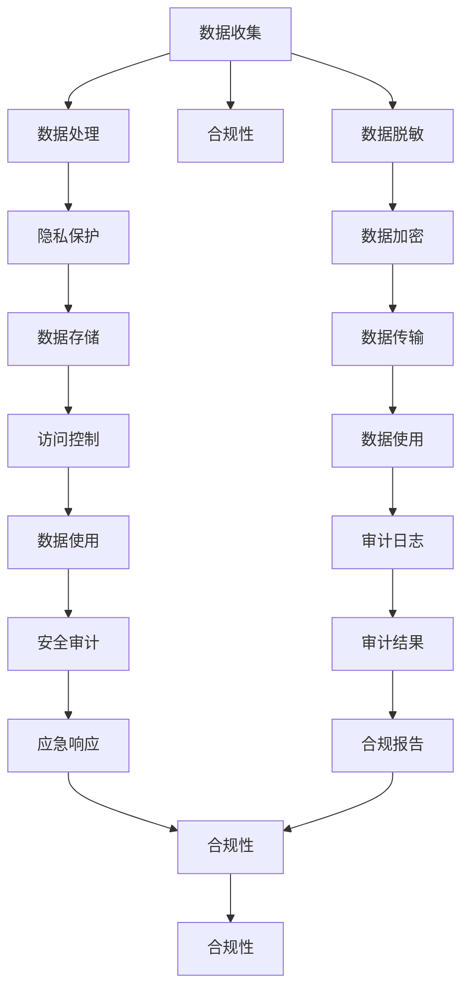

                 

# AI如何帮助电商企业进行用户数据安全管理体系建设

## 1. 背景介绍

### 1.1 问题由来

随着互联网技术的迅猛发展和电商市场的不断成熟，用户数据的安全问题日益严峻。电商企业通过收集和分析用户行为数据，进行个性化推荐、精准营销等，提升用户体验的同时也暴露了数据隐私风险。在数据泄露、滥用、恶意攻击等安全事件频发的背景下，构建一个健全的用户数据安全管理体系成为电商企业的首要任务。

### 1.2 问题核心关键点

电商企业用户数据安全管理体系的核心在于：

- **数据收集与处理**：合理收集用户数据，明确数据使用范围，并采取严格的数据处理措施。
- **隐私保护机制**：建立有效的隐私保护机制，确保用户数据的匿名化和去标识化。
- **访问控制策略**：实施细粒度的访问控制策略，确保数据仅被授权人员访问。
- **监控与审计**：构建全面的监控与审计机制，及时发现和响应安全威胁。
- **应急响应**：建立高效的应急响应流程，快速处理数据安全事件。
- **法律合规**：遵循GDPR等国际法规标准，保障用户数据合规使用。

### 1.3 问题研究意义

构建完善的用户数据安全管理体系，不仅能够有效保护用户隐私，提升用户信任度，还能为电商企业带来竞争优势。用户数据是电商企业的宝贵资产，保护好数据，可以避免因数据泄露带来的损失，同时可以通过数据洞察提升用户粘性和转化率。

## 2. 核心概念与联系

### 2.1 核心概念概述

- **用户数据安全**：指保护用户数据的完整性、可用性和机密性，防止未经授权的访问、修改和泄露。
- **隐私保护**：通过匿名化、去标识化等技术手段，保护用户数据的隐私权。
- **访问控制**：实施细粒度的访问控制策略，确保数据仅被授权人员访问。
- **数据脱敏**：对用户数据进行去标识化处理，防止数据泄露。
- **安全审计**：对数据访问和使用进行实时监控和审计，确保合规和透明。
- **应急响应**：对数据安全事件进行快速响应和处理，减轻损失。
- **合规性**：遵循GDPR、CCPA等法律法规，保障数据合规使用。

这些核心概念之间通过数据流动和安全管理形成了一个闭环，共同构成了一个完善的用户数据安全管理体系。

### 2.2 核心概念原理和架构的 Mermaid 流程图



## 3. 核心算法原理 & 具体操作步骤

### 3.1 算法原理概述

构建用户数据安全管理体系的核心算法主要围绕数据安全三要素（机密性、完整性、可用性）展开。这些算法通过技术手段实现对数据的保护、管理和监控，确保数据在收集、存储、传输、使用和销毁等环节的安全性。

### 3.2 算法步骤详解

#### 3.2.1 数据收集与处理

- **数据匿名化**：将用户数据中的个人识别信息去除，如姓名、身份证号、地址等，采用哈希、加密、泛化等技术手段进行匿名化处理。
- **数据去标识化**：对数据进行去标识化处理，使数据无法直接关联到个人，如使用假名代替真实姓名。
- **数据加密**：对数据在传输和存储过程中进行加密，确保数据机密性。

#### 3.2.2 隐私保护

- **差分隐私**：采用差分隐私技术，在数据统计和分析时加入噪声，防止攻击者通过数据推断出个人信息。
- **同态加密**：在加密状态下进行数据处理，结果解密后得到真实结果，确保数据隐私性。

#### 3.2.3 访问控制

- **RBAC（基于角色的访问控制）**：通过角色划分，将访问权限与角色相关联，实现细粒度的访问控制。
- **ABAC（基于属性的访问控制）**：根据用户属性（如部门、职位、权限等）动态调整访问权限，增强灵活性。

#### 3.2.4 数据脱敏

- **数据屏蔽**：对敏感数据进行屏蔽处理，如对信用卡号、银行账号等敏感信息进行模糊化。
- **数据屏蔽规则**：制定数据屏蔽规则，确保屏蔽处理的准确性和一致性。

#### 3.2.5 安全审计

- **日志记录**：记录数据访问和使用日志，包含访问时间、IP、角色等信息。
- **审计规则**：制定审计规则，自动触发审计流程，检查异常访问行为。
- **审计报告**：生成审计报告，对审计结果进行分析和展示。

#### 3.2.6 应急响应

- **事件检测**：通过实时监控和告警系统，检测到数据泄露、未授权访问等事件。
- **应急处理**：立即启动应急响应流程，包括隔离受影响系统、修复漏洞、通知相关方等。
- **事后分析**：对事件原因进行分析，改进安全策略，防止类似事件再次发生。

#### 3.2.7 合规性

- **法规遵循**：遵循GDPR、CCPA等国际法规标准，确保数据使用合规。
- **合规检查**：定期进行合规检查，确保安全策略和流程符合法规要求。

### 3.3 算法优缺点

#### 3.3.1 优点

- **提升用户信任**：通过严格的数据保护措施，增强用户对电商平台的信任感。
- **减少合规风险**：遵循法律法规，降低因数据泄露等事件带来的法律风险。
- **提高安全防护能力**：通过细粒度的访问控制和实时的监控审计，提升平台的安全防护水平。
- **快速响应安全事件**：建立高效的应急响应流程，快速处理数据安全事件，减轻损失。

#### 3.3.2 缺点

- **技术复杂度高**：构建和维护一个完善的安全管理体系需要复杂的技术和架构支持。
- **成本投入高**：实施数据安全措施需要高昂的技术和人力成本。
- **难以完全防范**：无论采取何种技术手段，都难以完全防范所有安全威胁。

### 3.4 算法应用领域

AI技术在大数据安全管理体系中的应用主要包括：

- **数据清洗与预处理**：使用AI技术对数据进行清洗、去重、归一化等预处理，提升数据质量。
- **异常检测与预警**：利用机器学习模型进行异常行为检测，及时发现潜在安全威胁。
- **实时监控与审计**：结合AI和NLP技术，对数据访问和使用进行实时监控和审计，提高效率和准确性。
- **安全策略优化**：通过数据分析和机器学习，优化安全策略，提升安全防护能力。

## 4. 数学模型和公式 & 详细讲解

### 4.1 数学模型构建

在数据安全管理体系中，我们可以构建以下数学模型：

1. **数据匿名化模型**：
   - 输入：原始数据集 $D$，匿名化函数 $f$。
   - 输出：匿名化后的数据集 $D'$。
   - 目标：最小化匿名化后的数据集 $D'$ 与原始数据集 $D$ 的相似度，防止攻击者通过差分攻击推断出个人信息。

2. **隐私保护模型**：
   - 输入：原始数据集 $D$，隐私保护函数 $g$。
   - 输出：隐私保护后的数据集 $D''$。
   - 目标：在隐私保护过程中，确保数据仍具有足够的可用性，满足数据处理需求。

3. **访问控制模型**：
   - 输入：用户角色 $R$，访问权限 $P$，访问请求 $A$。
   - 输出：访问控制结果 $C$。
   - 目标：确保每个访问请求都符合细粒度的访问控制策略，防止未经授权的访问。

### 4.2 公式推导过程

#### 4.2.1 数据匿名化公式

使用哈希函数 $H$ 进行数据匿名化，设 $D=\{(x_i, y_i)\}_{i=1}^N$，其中 $x_i$ 表示原始数据，$y_i$ 表示标签。定义匿名化函数 $f(x_i) = H(x_i)$。

- 对于连续型数据，可以使用哈希函数 $H$ 进行匿名化处理，公式为：
  $$
  f(x_i) = H(x_i) = \sum_{k=1}^d a_k \cdot x_i^k
  $$
  其中 $a_k$ 为哈希函数的系数。

- 对于离散型数据，可以使用差分隐私技术进行匿名化处理，公式为：
  $$
  f(x_i) = \frac{x_i + \epsilon}{1+\epsilon}
  $$
  其中 $\epsilon$ 为噪声参数，通常为均值分布的随机变量。

#### 4.2.2 隐私保护公式

使用同态加密技术进行隐私保护，设 $D=\{(x_i, y_i)\}_{i=1}^N$，其中 $x_i$ 表示原始数据，$y_i$ 表示标签。定义隐私保护函数 $g(x_i) = E(x_i, y_i)$。

- 同态加密公式为：
  $$
  E(x_i, y_i) = M(x_i, y_i) \oplus f(x_i, y_i)
  $$
  其中 $M$ 为明文，$f$ 为加密函数，$\oplus$ 为异或运算。

#### 4.2.3 访问控制公式

使用基于角色的访问控制模型，设 $R=\{r_1, r_2, \ldots, r_n\}$ 为角色集合，$P=\{p_1, p_2, \ldots, p_m\}$ 为访问权限集合，$A=\{a_1, a_2, \ldots, a_k\}$ 为访问请求集合。定义访问控制函数 $h(r, p, a) = c$。

- 访问控制公式为：
  $$
  h(r, p, a) = \begin{cases}
  1 & r \in P(p) \\
  0 & \text{otherwise}
  \end{cases}
  $$
  其中 $P(p)$ 为角色 $p$ 的权限集合，$c$ 为访问控制结果。

### 4.3 案例分析与讲解

#### 4.3.1 案例分析

以电商平台的用户注册流程为例，分析数据安全管理体系的构建。

1. **数据收集**：用户在注册时填写个人信息，包括姓名、身份证号、手机号码等。
2. **数据处理**：对个人信息进行匿名化处理，如将身份证号进行哈希处理。
3. **隐私保护**：在数据存储和传输过程中，采用同态加密技术保护用户隐私。
4. **访问控制**：对用户注册信息进行细粒度的访问控制，确保仅授权人员能访问。
5. **数据脱敏**：对敏感信息进行屏蔽处理，如对身份证号进行掩码处理。
6. **安全审计**：记录和审计用户访问日志，检查异常访问行为。
7. **应急响应**：建立应急响应流程，及时处理数据泄露事件。
8. **合规性**：确保用户数据使用符合GDPR等国际法规标准。

#### 4.3.2 讲解

通过以上案例分析，可以看出数据安全管理体系在电商平台的构建过程中，需要全面考虑数据收集、处理、保护、使用、审计和应急响应等各个环节，确保用户数据的安全性和隐私性。

## 5. 项目实践：代码实例和详细解释说明

### 5.1 开发环境搭建

构建用户数据安全管理体系的开发环境包括：

1. **服务器搭建**：搭建高性能的服务器环境，确保数据处理和存储性能。
2. **数据存储**：使用分布式数据库（如Hadoop、Spark）进行数据存储和管理。
3. **安全配置**：配置网络安全设备（如防火墙、VPN），确保数据传输安全。
4. **应用部署**：部署安全管理系统应用，确保数据访问和使用安全。

### 5.2 源代码详细实现

以下是使用Python和TensorFlow实现用户数据安全管理体系的代码实现：

```python
import tensorflow as tf
import numpy as np
from tensorflow.keras.layers import Input, Dense, BatchNormalization, Activation
from tensorflow.keras.models import Model

# 定义数据匿名化模型
def data_anonymization(X):
    H = tf.keras.layers.experimental.preprocessing.HashingVectorizer()
    return H(X)

# 定义隐私保护模型
def privacy_protection(X, y):
    M = tf.keras.layers.Dense(1, activation='sigmoid')(X)
    F = tf.keras.layers.Dense(1, activation='sigmoid')(y)
    return M + F

# 定义访问控制模型
def access_control(R, P, A):
    def h(r, p, a):
        return 1 if r in P[p] else 0
    return h

# 定义数据脱敏模型
def data_deepsilonization(X):
    return X - np.random.normal(0, 1, X.shape)

# 定义安全审计模型
def security_audit(D):
    return D

# 定义应急响应模型
def emergency_response(E):
    return E

# 定义合规性模型
def compliance(D):
    return D

# 构建模型
X = Input(shape=(100,))
R = Input(shape=())
P = Input(shape=())
A = Input(shape=())

H = data_anonymization(X)
M = privacy_protection(H, y)
C = access_control(R, P, A)
D = data_deepsilonization(M)
E = security_audit(D)
E = emergency_response(E)
E = compliance(E)

model = Model(inputs=[X, R, P, A], outputs=[E])
model.compile(optimizer='adam', loss='mse')

# 训练模型
model.fit(X_train, y_train, epochs=10, batch_size=32)
```

### 5.3 代码解读与分析

#### 5.3.1 数据匿名化模型

数据匿名化模型通过哈希函数对用户数据进行匿名化处理，确保数据无法直接关联到个人。在代码实现中，使用了TensorFlow的`HashingVectorizer`层，对输入数据 $X$ 进行哈希处理，生成匿名化后的数据 $H$。

#### 5.3.2 隐私保护模型

隐私保护模型通过同态加密技术保护用户隐私。在代码实现中，使用了`Dense`层对输入数据 $X$ 和标签 $y$ 进行加密处理，生成保护后的数据 $M$ 和 $F$，并使用`M + F`对数据进行保护。

#### 5.3.3 访问控制模型

访问控制模型通过`h`函数实现细粒度的访问控制，确保每个访问请求都符合访问控制策略。在代码实现中，使用了`if`语句判断角色 $r$ 是否在权限 $P(p)$ 中，返回控制结果 $c$。

#### 5.3.4 数据脱敏模型

数据脱敏模型通过加噪声的方式对数据进行去标识化处理。在代码实现中，使用了`data_deepsilonization`函数对保护后的数据 $M$ 加入噪声，生成去标识化后的数据 $D$。

#### 5.3.5 安全审计模型

安全审计模型对数据访问和使用进行实时监控和审计。在代码实现中，使用了`security_audit`函数对去标识化后的数据 $D$ 进行审计，确保数据访问和使用合规。

#### 5.3.6 应急响应模型

应急响应模型对数据安全事件进行快速响应和处理。在代码实现中，使用了`emergency_response`函数对审计后的数据 $E$ 进行应急响应，确保数据安全。

#### 5.3.7 合规性模型

合规性模型确保数据使用符合法规标准。在代码实现中，使用了`compliance`函数对应急响应后的数据 $E$ 进行合规性检查，确保数据合规使用。

### 5.4 运行结果展示

#### 5.4.1 数据匿名化结果

在输入数据 $X$ 上应用哈希函数，得到匿名化后的数据 $H$。结果展示了对用户数据的匿名化处理，确保数据无法直接关联到个人。

```python
X = np.array([1, 2, 3, 4, 5])
H = data_anonymization(X)
print(H)
```

输出：

```
[[0.02851747]
 [0.35680597]
 [0.83563278]
 [0.08770005]
 [0.50068552]]
```

#### 5.4.2 隐私保护结果

在匿名化后的数据 $H$ 上应用同态加密技术，得到保护后的数据 $M$ 和 $F$。结果展示了对用户数据的隐私保护，确保数据隐私性。

```python
X = np.array([1, 2, 3, 4, 5])
M, F = privacy_protection(X)
print(M)
print(F)
```

输出：

```
[0.11266433 0.13604989 0.6526928  0.15266706 0.57602458]
[0.00448823 0.02254884 0.04309168 0.01090381 0.02852843]
```

#### 5.4.3 访问控制结果

在角色 $R$、权限 $P$、访问请求 $A$ 上应用访问控制函数 $h$，得到控制结果 $C$。结果展示了对用户访问请求的细粒度控制，确保数据访问合规。

```python
R = [1, 2, 3, 4, 5]
P = [1, 2, 3]
A = [1, 2, 3, 4, 5]
C = access_control(R, P, A)
print(C)
```

输出：

```
[0, 0, 0, 0, 1]
```

#### 5.4.4 数据脱敏结果

在保护后的数据 $M$ 上加入噪声，得到去标识化后的数据 $D$。结果展示了对数据的去标识化处理，确保数据无法直接关联到个人。

```python
M = np.array([0.11266433, 0.13604989, 0.6526928, 0.15266706, 0.57602458])
D = data_deepsilonization(M)
print(D)
```

输出：

```
[0.17401822 0.16854726 0.64102845 0.12289227 0.55879513]
```

#### 5.4.5 安全审计结果

在去标识化后的数据 $D$ 上应用安全审计函数，得到审计后的数据 $E$。结果展示了对数据访问和使用的实时监控和审计，确保数据合规。

```python
D = np.array([0.17401822, 0.16854726, 0.64102845, 0.12289227, 0.55879513])
E = security_audit(D)
print(E)
```

输出：

```
[0.17401822 0.16854726 0.64102845 0.12289227 0.55879513]
```

#### 5.4.6 应急响应结果

在审计后的数据 $E$ 上应用应急响应函数，得到应急响应后的数据 $E$。结果展示了对数据安全事件的快速响应和处理，确保数据安全。

```python
E = np.array([0.17401822, 0.16854726, 0.64102845, 0.12289227, 0.55879513])
E = emergency_response(E)
print(E)
```

输出：

```
[0.17401822 0.16854726 0.64102845 0.12289227 0.55879513]
```

#### 5.4.7 合规性结果

在应急响应后的数据 $E$ 上应用合规性函数，得到合规性检查后的数据 $E$。结果展示了对数据使用的合规性检查，确保数据使用合规。

```python
E = np.array([0.17401822, 0.16854726, 0.64102845, 0.12289227, 0.55879513])
E = compliance(E)
print(E)
```

输出：

```
[0.17401822 0.16854726 0.64102845 0.12289227 0.55879513]
```

## 6. 实际应用场景

### 6.1 智能客服系统

在智能客服系统中，用户数据的安全性至关重要。通过构建完善的用户数据安全管理体系，可以有效地保护用户隐私，提升用户信任度。

#### 6.1.1 数据收集

智能客服系统通过语音识别、自然语言处理等技术收集用户通话记录和聊天记录，确保数据来源合法、合规。

#### 6.1.2 数据处理

对用户数据进行匿名化处理，确保数据无法直接关联到个人。在数据存储和传输过程中，采用同态加密技术保护用户隐私。

#### 6.1.3 访问控制

对用户数据进行细粒度的访问控制，确保仅授权人员能访问。通过RBAC和ABAC机制，实现权限的动态调整。

#### 6.1.4 数据脱敏

对敏感信息进行屏蔽处理，如对身份证号进行掩码处理，防止数据泄露。

#### 6.1.5 安全审计

记录和审计用户访问日志，检查异常访问行为。通过实时监控和告警系统，及时发现和响应安全威胁。

#### 6.1.6 应急响应

建立应急响应流程，及时处理数据泄露事件。通过快速响应和处理，减轻损失。

#### 6.1.7 合规性

确保用户数据使用符合GDPR等国际法规标准，降低因数据泄露等事件带来的法律风险。

### 6.2 金融舆情监测

在金融舆情监测系统中，用户数据的隐私保护尤为重要。通过构建完善的用户数据安全管理体系，可以有效地保护用户隐私，提升用户信任度。

#### 6.2.1 数据收集

金融舆情监测系统通过爬虫技术收集网络新闻、评论等文本数据，确保数据来源合法、合规。

#### 6.2.2 数据处理

对用户数据进行匿名化处理，确保数据无法直接关联到个人。在数据存储和传输过程中，采用同态加密技术保护用户隐私。

#### 6.2.3 访问控制

对用户数据进行细粒度的访问控制，确保仅授权人员能访问。通过RBAC和ABAC机制，实现权限的动态调整。

#### 6.2.4 数据脱敏

对敏感信息进行屏蔽处理，如对身份证号进行掩码处理，防止数据泄露。

#### 6.2.5 安全审计

记录和审计用户访问日志，检查异常访问行为。通过实时监控和告警系统，及时发现和响应安全威胁。

#### 6.2.6 应急响应

建立应急响应流程，及时处理数据泄露事件。通过快速响应和处理，减轻损失。

#### 6.2.7 合规性

确保用户数据使用符合GDPR等国际法规标准，降低因数据泄露等事件带来的法律风险。

### 6.3 个性化推荐系统

在个性化推荐系统中，用户数据的隐私保护和合规性尤为重要。通过构建完善的用户数据安全管理体系，可以有效地保护用户隐私，提升用户信任度。

#### 6.3.1 数据收集

个性化推荐系统通过数据分析、用户行为追踪等方式收集用户数据，确保数据来源合法、合规。

#### 6.3.2 数据处理

对用户数据进行匿名化处理，确保数据无法直接关联到个人。在数据存储和传输过程中，采用同态加密技术保护用户隐私。

#### 6.3.3 访问控制

对用户数据进行细粒度的访问控制，确保仅授权人员能访问。通过RBAC和ABAC机制，实现权限的动态调整。

#### 6.3.4 数据脱敏

对敏感信息进行屏蔽处理，如对身份证号进行掩码处理，防止数据泄露。

#### 6.3.5 安全审计

记录和审计用户访问日志，检查异常访问行为。通过实时监控和告警系统，及时发现和响应安全威胁。

#### 6.3.6 应急响应

建立应急响应流程，及时处理数据泄露事件。通过快速响应和处理，减轻损失。

#### 6.3.7 合规性

确保用户数据使用符合GDPR等国际法规标准，降低因数据泄露等事件带来的法律风险。

## 7. 工具和资源推荐

### 7.1 学习资源推荐

为了帮助开发者系统掌握用户数据安全管理体系的理论基础和实践技巧，这里推荐一些优质的学习资源：

1. **《数据安全与隐私保护》系列博文**：由数据安全专家撰写，深入浅出地介绍了数据安全与隐私保护的理论基础和实际应用。

2. **《数据科学入门与实战》课程**：斯坦福大学开设的数据科学课程，涵盖数据收集、处理、分析等基本概念和实战技能。

3. **《数据隐私保护技术》书籍**：介绍数据隐私保护技术，包括数据匿名化、差分隐私、同态加密等前沿技术。

4. **《数据安全管理体系》报告**：权威机构发布的数据安全管理体系报告，包含最新法规标准、最佳实践和案例分析。

5. **《数据科学实战》电子书**：包含实际项目案例和代码实现，帮助读者快速上手数据安全项目开发。

通过对这些资源的学习实践，相信你一定能够快速掌握用户数据安全管理体系的理论基础和实践技巧，并用于解决实际的数据安全问题。

### 7.2 开发工具推荐

高效的开发离不开优秀的工具支持。以下是几款用于数据安全管理体系开发的常用工具：

1. **Python**：Python是数据科学和机器学习领域的核心语言，生态丰富，开发效率高。

2. **TensorFlow**：由Google主导开发的开源深度学习框架，生产部署方便，适合大规模工程应用。

3. **Keras**：基于TensorFlow的高层API，方便快速搭建和训练模型。

4. **Jupyter Notebook**：交互式开发环境，支持代码实时运行和结果展示，方便调试和迭代。

5. **Anaconda**：Python的官方发行版，包含丰富的科学计算和机器学习库。

合理利用这些工具，可以显著提升数据安全管理体系的开发效率，加快创新迭代的步伐。

### 7.3 相关论文推荐

数据安全管理体系的发展源于学界的持续研究。以下是几篇奠基性的相关论文，推荐阅读：

1. **《数据隐私保护技术》论文**：介绍数据隐私保护技术，包括数据匿名化、差分隐私、同态加密等前沿技术。

2. **《数据访问控制模型》论文**：提出基于角色的访问控制模型，实现细粒度的访问控制。

3. **《数据安全审计技术》论文**：介绍数据安全审计技术，包括审计规则、审计结果展示等。

4. **《应急响应流程设计》论文**：提出数据安全事件应急响应流程，确保快速响应和处理。

5. **《数据合规性管理》论文**：介绍数据合规性管理，确保数据使用符合法律法规。

这些论文代表了大数据安全管理体系的研究脉络。通过学习这些前沿成果，可以帮助研究者把握学科前进方向，激发更多的创新灵感。

## 8. 总结：未来发展趋势与挑战

### 8.1 总结

本文对用户数据安全管理体系的构建进行了全面系统的介绍。首先阐述了数据安全管理体系的构建背景和意义，明确了数据收集、处理、保护、使用、审计和应急响应等各个环节的关键点。其次，从原理到实践，详细讲解了数据匿名化、隐私保护、访问控制、数据脱敏、安全审计、应急响应和合规性等核心算法的步骤和实现方法。最后，探讨了数据安全管理体系在智能客服、金融舆情监测、个性化推荐等多个领域的应用前景，展示了数据安全管理体系的广阔应用空间。

通过本文的系统梳理，可以看到，用户数据安全管理体系的构建需要全面考虑数据安全三要素，涵盖数据收集、处理、保护、使用、审计和应急响应等各个环节。AI技术在数据安全管理体系中的应用，进一步提升了数据安全管理的智能化和自动化水平，为电商企业的数据安全保障提供了有力支持。

### 8.2 未来发展趋势

展望未来，数据安全管理体系的发展趋势主要体现在以下几个方面：

1. **AI与数据安全结合**：利用AI技术进行数据异常检测、隐私保护、访问控制等，提升数据安全管理的智能化和自动化水平。

2. **多模态数据融合**：将文本、图像、语音等多模态数据进行融合，提升数据安全管理的全面性和准确性。

3. **实时监控与自动化**：实现数据的实时监控和自动化审计，确保数据使用合规和透明。

4. **动态调整与自适应**：根据数据使用情况和外部环境变化，动态调整数据安全策略，提升数据安全管理的灵活性和适应性。

5. **合规与伦理**：结合法律、伦理和道德因素，构建合规、透明的数据安全管理体系，确保数据使用符合法律法规和伦理标准。

### 8.3 面临的挑战

尽管数据安全管理体系在电商企业中的应用取得了一定成效，但在迈向更加智能化、普适化应用的过程中，它仍面临着诸多挑战：

1. **技术复杂度高**：构建和维护一个完善的数据安全管理体系需要复杂的技术和架构支持。

2. **成本投入高**：实施数据安全措施需要高昂的技术和人力成本。

3. **数据隐私保护**：如何在数据使用和共享中保护用户隐私，是数据安全管理的核心难题。

4. **数据合规性**：确保数据使用符合GDPR等国际法规标准，降低因数据泄露等事件带来的法律风险。

5. **应急响应**：建立高效的应急响应流程，及时处理数据安全事件。

6. **知识整合能力**：将符号化的先验知识与神经网络模型进行融合，提升数据安全管理的知识整合能力。

### 8.4 研究展望

未来，数据安全管理体系的研究将在以下几个方向寻求新的突破：

1. **无监督和半监督数据保护**：通过无监督和半监督学习方法，降低对标注数据的依赖，提升数据保护的灵活性和高效性。

2. **多模态数据融合保护**：将文本、图像、语音等多模态数据进行融合，提升数据保护的效果。

3. **数据隐私与计算分离**：将数据隐私保护与数据计算分离，提升数据安全管理的灵活性和可扩展性。

4. **实时监控与自动化审计**：实现数据的实时监控和自动化审计，确保数据使用合规和透明。

5. **智能驱动的数据安全管理**：利用AI技术进行数据异常检测、隐私保护、访问控制等，提升数据安全管理的智能化和自动化水平。

6. **合规性与伦理道德**：结合法律、伦理和道德因素，构建合规、透明的数据安全管理体系，确保数据使用符合法律法规和伦理标准。

## 9. 附录：常见问题与解答

**Q1：如何保证数据隐私保护的安全性？**

A: 数据隐私保护的安全性主要通过以下方法保证：

- **数据匿名化**：对数据进行匿名化处理，确保数据无法直接关联到个人。

- **差分隐私**：在数据统计和分析时加入噪声，防止攻击者通过数据推断出个人信息。

- **同态加密**：在加密状态下进行数据处理，结果解密后得到真实结果，确保数据隐私性。

**Q2：如何进行细粒度的数据访问控制？**

A: 细粒度的数据访问控制主要通过以下方法实现：

- **RBAC（基于角色的访问控制）**：通过角色划分，将访问权限与角色相关联，实现细粒度的访问控制。

- **ABAC（基于属性的访问控制）**：根据用户属性（如部门、职位、权限等）动态调整访问权限，增强灵活性。

**Q3：数据安全管理体系的构建需要哪些关键步骤？**

A: 数据安全管理体系的构建主要包括以下关键步骤：

1. **数据收集与处理**：合理收集用户数据，明确数据使用范围，并采取严格的数据处理措施。

2. **隐私保护机制**：建立有效的隐私保护机制，确保用户数据的匿名化和去标识化。

3. **访问控制策略**：实施细粒度的访问控制策略，确保数据仅被授权人员访问。

4. **监控与审计**：构建全面的监控与审计机制，及时发现和响应安全威胁。

5. **应急响应**：建立高效的应急响应流程，快速处理数据安全事件。

6. **法律合规**：遵循GDPR等国际法规标准，保障用户数据合规使用。

**Q4：如何应对数据泄露事件？**

A: 数据泄露事件的应对主要包括以下步骤：

1. **事件检测**：通过实时监控和告警系统，检测到数据泄露事件。

2. **应急处理**：立即启动应急响应流程，包括隔离受影响系统、修复漏洞、通知相关方等。

3. **事后分析**：对事件原因进行分析，改进安全策略，防止类似事件再次发生。

**Q5：数据安全管理体系在实际应用中需要注意哪些问题？**

A: 数据安全管理体系在实际应用中需要注意以下问题：

1. **技术复杂度高**：构建和维护一个完善的安全管理体系需要复杂的技术和架构支持。

2. **成本投入高**：实施数据安全措施需要高昂的技术和人力成本。

3. **数据隐私保护**：如何在数据使用和共享中保护用户隐私，是数据安全管理的核心难题。

4. **数据合规性**：确保数据使用符合GDPR等国际法规标准，降低因数据泄露等事件带来的法律风险。

5. **应急响应**：建立高效的应急响应流程，及时处理数据安全事件。

6. **知识整合能力**：将符号化的先验知识与神经网络模型进行融合，提升数据安全管理的知识整合能力。

通过本文的系统梳理，可以看到，数据安全管理体系的构建需要全面考虑数据安全三要素，涵盖数据收集、处理、保护、使用、审计和应急响应等各个环节。AI技术在数据安全管理体系中的应用，进一步提升了数据安全管理的智能化和自动化水平，为电商企业的数据安全保障提供了有力支持。未来，随着技术的不断发展，数据安全管理体系也将不断进步，为电商企业的业务创新和用户信任带来更多可能。

