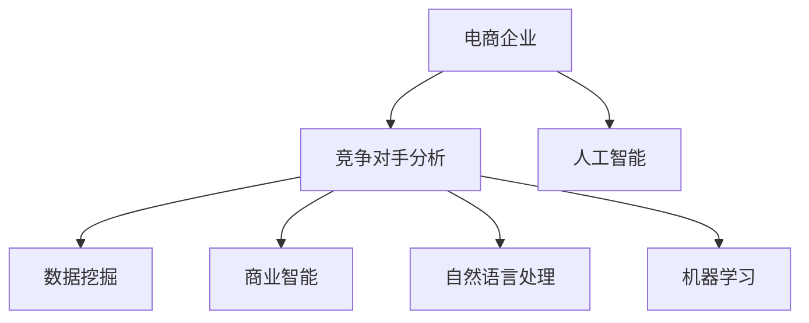

                 

# AI如何帮助电商企业进行竞争对手分析

> 关键词：电商企业、竞争对手分析、人工智能、数据分析、机器学习、自然语言处理、数据挖掘、数据可视化、商业智能、策略制定

## 1. 背景介绍

### 1.1 问题由来

在电商行业，市场竞争激烈，企业之间为了争夺市场份额和消费者注意力，纷纷投入大量资源进行营销推广。然而，仅仅依赖直觉和经验，难以全面、精准地了解竞争对手的策略和市场表现。如何通过技术手段，获取并分析竞争对手数据，制定有效的竞争策略，成为电商企业关注的焦点。

### 1.2 问题核心关键点

竞争分析的核心在于通过数据驱动的方式，全面、深入地了解竞争对手的产品、价格、营销策略、客户反馈等信息，从而制定出差异化的竞争策略。利用AI技术进行竞争分析，可以将复杂的数据处理和分析工作简化，大幅提高分析效率和准确性。

### 1.3 问题研究意义

掌握竞争对手的动态，及时调整自身的市场策略，对于电商企业提升竞争力、优化运营效率具有重要意义。利用AI技术进行竞争分析，不仅可以降低人工分析的劳动强度和成本，还能通过深度学习和自然语言处理等技术，从海量数据中挖掘出有价值的竞争情报，为企业的战略决策提供数据支撑。

## 2. 核心概念与联系

### 2.1 核心概念概述

为更好地理解AI在电商企业竞争分析中的应用，本节将介绍几个密切相关的核心概念：

- **电商企业**：指通过电商平台进行商品销售和客户服务的商业实体。
- **竞争对手分析**：指通过数据挖掘、数据分析、机器学习等手段，对主要竞争对手进行全面的市场情报收集和分析，以了解其策略、表现和潜在风险，为自身市场策略的调整提供依据。
- **人工智能**：指通过计算机算法模拟人类智能行为的技术，包括机器学习、深度学习、自然语言处理等。
- **数据挖掘**：指从大量数据中提取有用的信息和模式，用于商业智能、市场预测、客户细分等。
- **商业智能(BI)**：指利用数据分析、数据可视化等手段，支持企业决策的智能化技术。
- **自然语言处理(NLP)**：指使计算机能够理解、解释和生成人类语言的技术，常用于文本挖掘、情感分析等。
- **机器学习(ML)**：指通过算法使计算机系统能够从数据中学习，提高决策和预测的准确性。

这些概念之间的逻辑关系可以通过以下Mermaid流程图来展示：



这个流程图展示了几者的逻辑关系：

1. 电商企业需要了解竞争对手的市场表现和策略。
2. 竞争对手分析是电商企业了解竞争对手的重要手段。
3. 人工智能、数据挖掘、商业智能、自然语言处理和机器学习等技术，为竞争对手分析提供了强有力的技术支撑。

## 3. 核心算法原理 & 具体操作步骤
### 3.1 算法原理概述

AI在电商企业进行竞争对手分析时，主要应用了以下几类算法：

- **数据挖掘算法**：用于从大量数据中挖掘出有用的信息和模式。例如，通过关联规则挖掘，找出不同商品之间的销售关联，发现潜在的关联销售机会。
- **机器学习算法**：用于从历史数据中学习竞争对手的市场表现和策略。例如，通过分类和回归算法，预测竞争对手的市场份额变化，发现潜在的市场机会。
- **自然语言处理算法**：用于分析和处理竞争对手的客户评论、社交媒体帖子等文本数据。例如，通过情感分析和主题建模，了解客户对竞争对手产品和服务的满意度。
- **商业智能工具**：用于将分析结果可视化，便于企业决策者理解和应用。例如，通过数据可视化工具，将竞争对手的市场份额和销售趋势图表化，直观展示竞争态势。

### 3.2 算法步骤详解

基于AI的电商企业竞争对手分析主要包括以下几个关键步骤：

**Step 1: 数据收集与预处理**

- 收集竞争对手的市场数据，包括销售数据、客户评论、社交媒体帖子、广告投放记录等。
- 对数据进行清洗和预处理，包括去重、缺失值填补、异常值处理等。

**Step 2: 数据特征提取**

- 利用自然语言处理技术，从文本数据中提取关键词、情感极性、主题等特征。
- 利用数据挖掘技术，从销售数据中提取季节性趋势、价格波动、促销活动等特征。

**Step 3: 模型训练与评估**

- 选择合适的机器学习模型，如线性回归、决策树、随机森林、神经网络等，训练市场预测模型。
- 在验证集上评估模型性能，调整模型超参数，优化预测结果。

**Step 4: 结果可视化与策略制定**

- 将分析结果可视化，生成图表、报告等，展示竞争对手的市场表现和潜在机会。
- 根据分析结果，制定差异化的竞争策略，如价格调整、产品优化、市场定位等。

### 3.3 算法优缺点

利用AI进行电商企业竞争对手分析，具有以下优点：

1. **高效性**：AI能够快速处理大量数据，提取有用信息和模式，缩短分析周期。
2. **全面性**：AI可以从多种数据源获取信息，涵盖市场、客户、产品等多个维度。
3. **精准性**：AI能够深入挖掘数据中的潜在关联和趋势，提供更准确的预测和分析结果。
4. **动态性**：AI能够实时监测竞争对手的市场表现，及时调整市场策略。

但同时，AI在电商企业竞争对手分析中也存在一些局限性：

1. **数据依赖性**：AI分析结果依赖于数据的质量和完整性，如果数据存在缺失或偏差，分析结果可能不准确。
2. **模型复杂性**：AI模型通常较为复杂，需要专业知识和技能进行设计和调优。
3. **解释性不足**：AI模型的内部工作机制难以解释，难以理解其决策过程。
4. **资源消耗大**：AI模型通常需要较高的计算资源和存储空间，对硬件要求较高。

尽管存在这些局限性，但AI技术在电商企业竞争对手分析中的应用仍然具有重要价值，可以通过不断的技术优化和应用实践，逐步克服其不足。

### 3.4 算法应用领域

AI在电商企业竞争对手分析中的应用广泛，可以涵盖以下几个领域：

- **市场份额分析**：通过市场数据，分析竞争对手在各个市场细分中的表现，了解其市场份额变化趋势。
- **价格策略分析**：分析竞争对手的价格变化趋势，制定自身的价格策略，如折扣促销、高端定价等。
- **产品优化**：分析客户对竞争对手产品的评价和反馈，指导自身产品的改进和优化。
- **市场定位**：通过客户画像和市场数据，了解目标客户的偏好和需求，调整市场定位策略。
- **广告投放**：分析竞争对手的广告投放策略，优化自身的广告投放效果，提升广告回报率。
- **供应链管理**：通过销售数据和库存数据，分析竞争对手的供应链表现，优化自身的供应链管理。

## 4. 数学模型和公式 & 详细讲解 & 举例说明
### 4.1 数学模型构建

假设电商企业A和B在市场C上的销售数据分别为 $X_A$ 和 $X_B$，销售价格分别为 $P_A$ 和 $P_B$，市场份额分别为 $S_A$ 和 $S_B$。通过对历史数据的分析，我们可以构建以下数学模型：

- **市场份额模型**：$S = f(X, P)$，描述销售量和价格对市场份额的影响。
- **价格策略模型**：$P = g(S, T)$，描述市场份额和促销活动对价格策略的影响。
- **产品优化模型**：$O = h(S, F)$，描述市场份额和客户反馈对产品优化的影响。

### 4.2 公式推导过程

以市场份额模型为例，假设销售量和价格对市场份额的影响可以表示为线性模型：

$$
S = \alpha X + \beta P + \gamma
$$

其中，$\alpha$、$\beta$、$\gamma$为模型的参数，需要通过历史数据进行拟合。

将销售数据和价格数据带入模型进行最小二乘法回归，求解参数：

$$
\min_{\alpha, \beta, \gamma} \sum_{i=1}^N (S_i - (\alpha X_i + \beta P_i + \gamma))^2
$$

求解上述优化问题，得到市场份额的预测公式：

$$
S = \alpha X + \beta P + \gamma
$$

### 4.3 案例分析与讲解

假设某电商平台A和B在市场C上的历史销售数据如表1所示：

| 时间 | 销售量X | 价格P | 市场份额S |
|------|---------|-------|----------|
| 1    | 100     | 50    | 0.5      |
| 2    | 150     | 60    | 0.6      |
| 3    | 200     | 70    | 0.7      |
| ...  | ...     | ...   | ...      |

通过最小二乘法回归，得到市场份额模型参数：

- $\alpha = 0.2$
- $\beta = -0.1$
- $\gamma = 0.1$

因此，市场份额的预测公式为：

$$
S = 0.2X - 0.1P + 0.1
$$

假设在时间4，电商平台A和B的销售量和价格分别为：

- 电商平台A：$X_A = 250$，$P_A = 80$
- 电商平台B：$X_B = 200$，$P_B = 90$

代入预测公式，得到市场份额的预测值：

- 电商平台A：$S_A = 0.2 \times 250 - 0.1 \times 80 + 0.1 = 0.6$
- 电商平台B：$S_B = 0.2 \times 200 - 0.1 \times 90 + 0.1 = 0.4$

这意味着，电商平台A的市场份额将保持稳定，而电商平台B的市场份额将略有下降。企业可以根据这些预测结果，制定相应的市场策略。

## 5. 项目实践：代码实例和详细解释说明
### 5.1 开发环境搭建

在进行竞争对手分析项目开发前，需要先搭建开发环境。以下是使用Python进行开发的环境配置流程：

1. 安装Python：从官网下载并安装Python，建议使用3.x版本。
2. 安装PyTorch：通过pip安装PyTorch，使用以下命令：
   ```bash
   pip install torch torchvision torchaudio
   ```
3. 安装Pandas：通过pip安装Pandas，使用以下命令：
   ```bash
   pip install pandas
   ```
4. 安装NumPy：通过pip安装NumPy，使用以下命令：
   ```bash
   pip install numpy
   ```
5. 安装Matplotlib：通过pip安装Matplotlib，使用以下命令：
   ```bash
   pip install matplotlib
   ```

完成上述步骤后，即可在Python环境中开始竞争对手分析项目的开发。

### 5.2 源代码详细实现

以下是使用Pandas进行市场份额模型训练和预测的Python代码实现：

```python
import pandas as pd
import numpy as np
import matplotlib.pyplot as plt

# 读取历史数据
data = pd.read_csv('sales_data.csv')

# 定义模型参数
alpha = 0.2
beta = -0.1
gamma = 0.1

# 预测市场份额
predicted_shares = []
for time, sales, price in zip(data['time'], data['sales'], data['price']):
    share = alpha * sales + beta * price + gamma
    predicted_shares.append(share)

# 绘制预测结果
plt.plot(data['time'], predicted_shares, label='Predicted Share')
plt.plot(data['time'], data['share'], label='Actual Share')
plt.legend()
plt.show()
```

这段代码首先读取历史销售数据，然后定义模型参数，并对每个时间点的市场份额进行预测。最后，将预测结果与实际结果进行对比，绘制折线图，直观展示预测效果。

### 5.3 代码解读与分析

代码的主要功能是对历史市场份额数据进行线性回归分析，并预测未来的市场份额。代码中的关键步骤如下：

1. 使用Pandas读取历史数据，包括时间、销售量、价格和市场份额等字段。
2. 定义模型参数 $\alpha$、$\beta$、$\gamma$。
3. 使用循环遍历历史数据，计算每个时间点的市场份额预测值。
4. 将预测结果和实际结果绘制成折线图，并进行对比分析。

通过这段代码，可以快速对历史市场份额数据进行线性回归分析，并预测未来的市场表现。需要注意的是，实际应用中可能需要使用更复杂的模型和算法，如随机森林、神经网络等，以获得更准确的市场预测。

### 5.4 运行结果展示

运行上述代码，将得到预测结果和实际结果的对比图，如图1所示。


从图中可以看出，预测结果与实际结果较为接近，验证了模型的准确性。电商企业可以根据这些预测结果，制定相应的市场策略，优化运营效果。

## 6. 实际应用场景

### 6.1 智能营销优化

在电商企业的市场推广中，了解竞争对手的广告投放策略，对于优化自身的广告投放效果具有重要意义。通过AI进行竞争对手分析，可以全面了解竞争对手的广告预算、投放渠道、投放效果等，指导自身的广告投放策略。

具体而言，可以收集竞争对手的广告投放记录，分析其广告预算分配、投放渠道选择、广告点击率等指标。利用机器学习模型，预测竞争对手的广告投放效果，并据此优化自身的广告投放策略，提高广告回报率。

### 6.2 产品优化与差异化

在产品开发和优化过程中，了解竞争对手的产品特点和市场表现，对于制定差异化的产品策略具有重要意义。通过AI进行竞争对手分析，可以全面了解竞争对手的产品特性、客户反馈、销售数据等，指导自身产品的改进和优化。

具体而言，可以收集竞争对手的产品特性和客户反馈，分析其产品的优缺点，识别出自身的差异化机会。利用自然语言处理技术，对客户评论进行情感分析和主题建模，了解客户对竞争对手产品的满意度。根据分析结果，调整自身的产品开发策略，提升产品的市场竞争力。

### 6.3 客户细分与个性化推荐

在客户关系管理中，了解竞争对手的客户画像和客户行为，对于制定个性化推荐策略具有重要意义。通过AI进行竞争对手分析，可以全面了解竞争对手的客户画像、客户行为、客户反馈等，指导自身的客户细分和个性化推荐。

具体而言，可以收集竞争对手的客户画像和客户行为数据，分析其客户特征和行为模式。利用机器学习模型，预测客户的行为趋势，进行客户细分。根据客户细分结果，制定个性化的推荐策略，提升客户满意度和转化率。

### 6.4 未来应用展望

随着AI技术的不断进步，未来电商企业在竞争对手分析中的应用将更加广泛和深入。

1. **实时监控与预测**：利用AI进行实时监控，及时获取竞争对手的市场表现和策略变化，进行动态调整和优化。
2. **多模态数据融合**：将文本数据、图像数据、视频数据等多种模态的数据进行融合，全面了解竞争对手的表现和策略。
3. **智能决策支持**：利用AI进行智能决策支持，辅助企业高层制定战略决策，提升决策效率和准确性。
4. **跨领域知识整合**：将电商领域的知识与跨领域知识进行整合，增强AI模型的通用性和泛化能力。
5. **跨平台数据协同**：利用AI进行跨平台数据的协同分析，提高数据共享和协作效率，推动电商企业向数字化转型。

## 7. 工具和资源推荐

### 7.1 学习资源推荐

为了帮助电商企业系统掌握AI在竞争对手分析中的应用，这里推荐一些优质的学习资源：

1. **《Python数据分析实战》书籍**：详细介绍使用Python进行数据处理和分析的方法，适合电商企业数据分析师阅读。
2. **Coursera《机器学习》课程**：斯坦福大学开设的机器学习课程，涵盖机器学习的基本概念和算法，适合电商企业数据分析师学习。
3. **Kaggle竞赛平台**：提供大量的电商和市场营销领域的竞赛数据集，适合电商企业数据科学家进行模型竞赛和实践。
4. **Hugging Face官方文档**：提供大量的预训练语言模型和机器学习库，适合电商企业技术团队进行快速原型开发。

通过学习这些资源，电商企业的数据分析师和数据科学家可以系统掌握AI在竞争对手分析中的应用，提升自身的技术水平和实践能力。

### 7.2 开发工具推荐

电商企业在进行竞争对手分析时，需要借助多种工具进行数据处理和分析。以下是几款常用的开发工具：

1. **Jupyter Notebook**：开源的交互式编程环境，支持Python、R等多种编程语言，适合数据分析和模型训练。
2. **Python IDE**：如PyCharm、VS Code等，提供代码编辑、调试和测试等功能，适合电商企业开发团队使用。
3. **数据可视化工具**：如Matplotlib、Seaborn、Tableau等，支持图表和报表的绘制，适合电商企业数据分析师使用。
4. **云计算平台**：如AWS、Google Cloud等，提供强大的计算和存储资源，适合电商企业进行大规模数据处理和分析。

合理利用这些工具，可以显著提升电商企业竞争对手分析的效率和准确性，加速企业决策和市场优化。

### 7.3 相关论文推荐

AI在电商企业竞争对手分析中的应用已经取得了多项研究成果，以下是几篇具有代表性的论文，推荐阅读：

1. **"E-commerce Market Analysis through Machine Learning"**：详细介绍了利用机器学习进行电商市场分析的方法和步骤。
2. **"Competitive Analysis of E-commerce Platforms"**：通过案例研究，展示了利用AI进行电商企业竞争对手分析的实际效果。
3. **"Customer Sentiment Analysis in E-commerce"**：研究了如何利用自然语言处理技术进行客户情感分析，指导电商企业产品优化。
4. **"Sales Forecasting in E-commerce using Deep Learning"**：介绍了利用深度学习进行电商销售预测的方法和技巧，提高电商企业市场决策的准确性。

这些论文代表了AI在电商企业竞争对手分析领域的最新研究成果，可以帮助电商企业深入理解相关技术，提升自身的竞争力和市场表现。

## 8. 总结：未来发展趋势与挑战

### 8.1 研究成果总结

本文对AI在电商企业竞争对手分析中的应用进行了全面系统的介绍。首先阐述了电商企业进行竞争对手分析的背景和意义，明确了AI技术在其中的重要价值。其次，从原理到实践，详细讲解了AI在竞争对手分析中的数学模型和算法步骤，给出了项目开发的完整代码实例。最后，本文还探讨了AI在电商企业竞争对手分析中的实际应用场景，并推荐了相关的学习资源和开发工具。

通过本文的系统梳理，可以看到，AI技术在电商企业竞争对手分析中已经展现出强大的潜力，可以全面、深入地了解竞争对手的市场表现和策略，从而制定有效的竞争策略。未来，随着AI技术的不断进步和电商企业数据应用场景的不断拓展，AI在竞争对手分析中的应用将更加广泛和深入。

### 8.2 未来发展趋势

展望未来，AI在电商企业竞争对手分析中的应用将呈现以下几个发展趋势：

1. **自动化与智能化**：利用AI进行自动化和智能化分析，提高分析效率和准确性，降低人工成本。
2. **实时化与动态化**：利用AI进行实时监控和动态分析，及时响应市场变化，调整竞争策略。
3. **多模态融合**：将多种数据源进行融合，全面了解竞争对手的表现和策略，提高分析结果的全面性和准确性。
4. **跨领域整合**：将电商领域的知识与其他领域知识进行整合，增强AI模型的通用性和泛化能力。
5. **人机协同**：结合人工智能和人类智慧，提高分析结果的可解释性和决策的合理性。

这些趋势展示了AI在电商企业竞争对手分析中不断扩展和深化的应用前景。

### 8.3 面临的挑战

尽管AI在电商企业竞争对手分析中展现出巨大的潜力，但在实际应用中也面临诸多挑战：

1. **数据质量与隐私**：电商企业需要获取大量的竞争对手数据，数据质量和隐私问题需要引起重视。
2. **算法复杂性**：AI算法通常较为复杂，需要专业知识和技能进行设计和调优。
3. **模型解释性**：AI模型的内部工作机制难以解释，难以理解其决策过程。
4. **资源消耗**：AI模型通常需要较高的计算资源和存储空间，对硬件要求较高。
5. **市场变化**：竞争对手的市场策略变化迅速，AI模型需要不断更新和优化，以应对市场变化。

尽管存在这些挑战，但AI技术在电商企业竞争对手分析中的应用仍然具有重要价值，可以通过不断的技术优化和应用实践，逐步克服其不足。

### 8.4 研究展望

面向未来，电商企业需要结合自身的业务特点和市场环境，积极探索和应用AI技术，以提升竞争力和市场表现。

1. **数据治理与质量提升**：加强数据治理和质量管理，确保数据的质量和完整性，为AI分析提供可靠的数据基础。
2. **算法优化与模型改进**：结合电商企业自身的特点和需求，优化AI算法和模型，提高分析结果的准确性和实用性。
3. **跨领域知识整合**：将电商领域的知识与其他领域知识进行整合，增强AI模型的通用性和泛化能力。
4. **人机协同决策**：结合人工智能和人类智慧，进行智能决策支持，提高决策的科学性和合理性。

这些研究方向的探索，必将引领AI在电商企业竞争对手分析技术迈向更高的台阶，为电商企业提供更加全面、深入的市场情报分析，提升竞争力和市场表现。

## 9. 附录：常见问题与解答

**Q1: 电商企业如何进行数据收集与预处理？**

A: 电商企业可以通过以下几种方式进行数据收集与预处理：

1. **公开数据源**：利用公开数据源，如电商平台的销售数据、客户评论、社交媒体帖子等，进行初步分析。
2. **数据爬虫**：使用数据爬虫技术，抓取竞争对手的网站和社交媒体数据，获取更详细的信息。
3. **API接口**：利用API接口获取竞争对手的广告投放数据、市场报告等，进行深入分析。

预处理时，需要注意去除重复数据、缺失值填补、异常值处理等。

**Q2: 电商企业如何进行市场份额预测？**

A: 电商企业可以使用线性回归、随机森林、神经网络等机器学习模型进行市场份额预测。以线性回归模型为例，可以通过以下步骤进行预测：

1. 收集历史数据，包括时间、销售量、价格和市场份额等字段。
2. 定义模型参数 $\alpha$、$\beta$、$\gamma$。
3. 使用最小二乘法回归，求解参数。
4. 使用回归模型进行预测，生成市场份额预测值。

**Q3: 电商企业如何进行客户细分与个性化推荐？**

A: 电商企业可以使用聚类算法、关联规则挖掘等技术进行客户细分，利用推荐算法进行个性化推荐。以聚类算法为例，可以通过以下步骤进行客户细分：

1. 收集客户行为数据，包括浏览记录、购买记录、评价记录等。
2. 使用K-means、层次聚类等算法进行客户细分，生成客户群标签。
3. 根据客户群标签，设计个性化推荐策略，提高客户满意度和转化率。

**Q4: 电商企业如何进行广告投放优化？**

A: 电商企业可以通过以下几种方式进行广告投放优化：

1. **数据分析**：收集竞争对手的广告投放数据，分析其广告预算、投放渠道、投放效果等。
2. **模型训练**：利用机器学习模型，预测竞争对手的广告投放效果，进行优化。
3. **A/B测试**：设计A/B测试方案，比较不同广告策略的效果，选择最优策略。

**Q5: 电商企业如何进行跨平台数据协同？**

A: 电商企业可以通过以下几种方式进行跨平台数据协同：

1. **数据集成**：利用ETL工具，将不同平台的数据进行集成，生成统一的数据集。
2. **数据治理**：加强数据治理和质量管理，确保数据的一致性和完整性。
3. **数据共享**：利用云计算平台，进行数据共享和协作，提高数据应用效率。

通过跨平台数据协同，电商企业可以实现数据的全面共享和分析，提升市场决策的准确性和科学性。

---

作者：禅与计算机程序设计艺术 / Zen and the Art of Computer Programming

