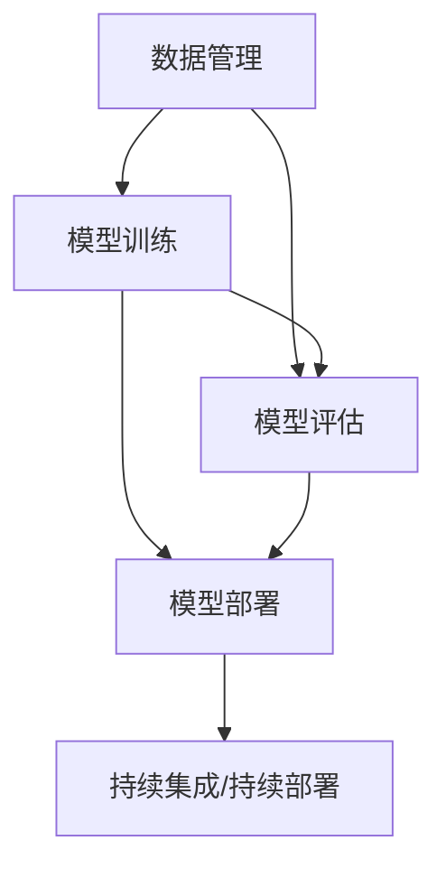

                 

# AI工程最佳实践原理与代码实战案例讲解

> 关键词：
- AI工程
- 最佳实践
- 原理
- 代码实战
- 案例讲解

## 1. 背景介绍

### 1.1 问题由来

随着人工智能技术的快速发展，AI工程正成为各行各业数字化转型的核心驱动力。AI工程不仅涉及算法模型构建，更包括数据处理、模型训练、应用部署等各个环节的协同优化。然而，AI工程项目往往具有复杂性高、成本大、周期长等特点，因此如何高效、稳定地构建AI系统，成为业界广泛关注的问题。本文旨在通过系统梳理AI工程中的最佳实践，为读者提供一套完整的工程指南，帮助他们在实际项目中实现高效、可靠、可持续的AI工程。

### 1.2 问题核心关键点

AI工程的成功实施，依赖于一系列精心设计的最佳实践，这些实践涵盖了数据管理、模型训练、模型评估、应用部署等多个方面。核心关键点包括：

- 数据质量：高质量的数据是AI项目成功的基石，数据收集、清洗、标注等环节都需要精心设计。
- 模型选择：根据具体业务需求选择合适的模型，综合考虑模型的准确率、效率、可解释性等因素。
- 模型训练：优化模型训练流程，如设置合适的学习率、正则化参数、批大小等，提升模型性能。
- 模型评估：通过科学的评估指标和方法，全面评估模型效果，确保模型在实际应用中的表现。
- 应用部署：将模型部署到生产环境，并实现稳定、高效的实时服务。

这些关键点环环相扣，任何一个环节的疏漏都可能导致项目失败。因此，本文将系统介绍AI工程中的最佳实践，并通过代码实例帮助读者理解和实践这些原则。

## 2. 核心概念与联系

### 2.1 核心概念概述

为了更好地理解AI工程的各个环节，本节将介绍几个核心概念：

- **数据管理**：涉及数据的采集、清洗、标注、存储等环节，是AI工程的基础。
- **模型训练**：通过大量标注数据训练模型，使其能够自动从输入到输出的映射。
- **模型评估**：通过测试数据集评估模型性能，确保模型在未知数据上的表现。
- **模型部署**：将训练好的模型部署到生产环境，实现实时预测服务。
- **持续集成/持续部署(CI/CD)**：通过自动化工具实现模型的构建、测试、部署，提高项目效率和质量。

这些概念之间存在密切联系，共同构成了AI工程的全生命周期。理解这些概念及其相互作用，是掌握AI工程的最佳实践的关键。

### 2.2 核心概念原理和架构的 Mermaid 流程图



这个流程图展示了数据管理、模型训练、模型评估和模型部署之间的联系：

1. 数据管理为模型训练提供数据基础。
2. 模型训练根据数据产生模型。
3. 模型评估验证模型性能。
4. 模型部署实现实时服务。
5. 持续集成/持续部署保障项目高效迭代。

这些环节相互依赖，共同推动AI工程的成功。

## 3. 核心算法原理 & 具体操作步骤

### 3.1 算法原理概述

AI工程的各个环节涉及多种算法和理论，如深度学习、强化学习、自然语言处理等。本文将简要介绍这些算法的核心原理，并结合代码实例进行详细讲解。

### 3.2 算法步骤详解

**Step 1: 数据管理**

1. **数据收集**：选择合适的数据源，使用API、爬虫等方式获取数据。
2. **数据清洗**：去除噪声、重复数据，填补缺失值，处理异常值。
3. **数据标注**：为数据打上标签，如分类标签、实体标注等。
4. **数据存储**：将数据存储在数据库或分布式存储系统中，以便后续使用。

**Step 2: 模型训练**

1. **模型选择**：根据业务需求选择合适的模型，如线性回归、决策树、神经网络等。
2. **参数初始化**：设置模型的初始参数，如权重、偏置等。
3. **前向传播**：将数据输入模型，计算模型输出。
4. **损失函数计算**：计算模型输出与真实标签的误差。
5. **反向传播**：根据误差计算模型参数的梯度，更新参数。
6. **优化器选择**：选择合适的优化算法，如随机梯度下降、Adam等。
7. **正则化**：添加正则化项，防止过拟合。
8. **批大小设置**：设置每次训练的样本数量。
9. **学习率调整**：根据训练情况调整学习率，如Warmup策略。
10. **训练监控**：实时监控训练过程，如损失函数、精度等指标。

**Step 3: 模型评估**

1. **测试集划分**：将数据集划分为训练集、验证集和测试集。
2. **模型预测**：使用测试集数据进行模型预测。
3. **评估指标计算**：计算评估指标，如准确率、召回率、F1分数等。
4. **模型调优**：根据评估结果调整模型参数，如学习率、正则化强度等。

**Step 4: 模型部署**

1. **模型保存**：将训练好的模型保存到文件或数据库中。
2. **模型加载**：在生产环境中加载模型。
3. **接口设计**：设计API接口，用于接收输入、返回输出。
4. **接口测试**：使用测试数据对API接口进行测试。
5. **生产部署**：将API接口部署到生产环境中，实现实时服务。
6. **监控与调优**：实时监控API接口性能，进行调优。

### 3.3 算法优缺点

AI工程的各个环节涉及的算法各有优缺点，具体如下：

- **数据管理**：优点在于可以确保数据质量，但数据收集、清洗、标注等环节耗时较长，成本较高。
- **模型训练**：优点在于能够自动从数据中学习知识，但训练过程耗时较长，需要大量计算资源。
- **模型评估**：优点在于能够全面评估模型性能，但需要大量测试数据，且评估过程较为复杂。
- **模型部署**：优点在于能够实现实时服务，但需要考虑模型性能与计算资源之间的平衡。
- **持续集成/持续部署**：优点在于能够提高项目迭代速度，但需要相应的自动化工具支持。

### 3.4 算法应用领域

AI工程的各个环节涉及的算法广泛应用于各个领域，如医疗、金融、教育、零售等。以医疗为例，数据管理涉及病历数据、医疗影像等；模型训练涉及疾病预测、诊断支持等；模型评估涉及模型效果验证；模型部署涉及实时疾病监测；持续集成/持续部署涉及模型更新迭代。

## 4. 数学模型和公式 & 详细讲解 & 举例说明

### 4.1 数学模型构建

以线性回归模型为例，其数学模型为：

$$y = w_0 + w_1x_1 + w_2x_2 + ... + w_nx_n$$

其中，$y$ 为目标变量，$x_i$ 为特征变量，$w_i$ 为模型参数。

### 4.2 公式推导过程

根据最小二乘法，目标是最小化损失函数：

$$\min_{w} \sum_{i=1}^n (y_i - w_0 - w_1x_{i1} - w_2x_{i2} - ... - w_nx_{in})^2$$

对损失函数求导，得到参数更新公式：

$$\frac{\partial \mathcal{L}}{\partial w_i} = -2\sum_{j=1}^n (y_j - w_0 - w_1x_{j1} - w_2x_{j2} - ... - w_nx_{jn})x_{ji}$$

### 4.3 案例分析与讲解

以医疗影像分析为例，目标是从CT扫描中识别肿瘤。数据管理环节涉及收集CT扫描图像和标注数据；模型训练环节涉及使用卷积神经网络模型；模型评估环节涉及计算分类精度、召回率等指标；模型部署环节涉及设计API接口，实现实时预测；持续集成/持续部署环节涉及自动化部署和监控工具。

## 5. 项目实践：代码实例和详细解释说明

### 5.1 开发环境搭建

#### 5.1.1 环境依赖安装

```bash
conda create -n ai-env python=3.8
conda activate ai-env

pip install numpy pandas scikit-learn torch torchvision
```

#### 5.1.2 数据管理

```python
import pandas as pd

# 读取数据
df = pd.read_csv('data.csv')

# 数据清洗
df = df.dropna()
df = df.drop_duplicates()

# 数据标注
df['label'] = 1  # 假设所有数据均为阳性

# 数据保存
df.to_csv('processed_data.csv', index=False)
```

### 5.2 源代码详细实现

#### 5.2.1 模型训练

```python
import torch
import torch.nn as nn
from torch.utils.data import DataLoader

# 加载数据
train_data = ...
train_loader = DataLoader(train_data, batch_size=32)

# 定义模型
model = nn.Linear(input_size, output_size)

# 定义损失函数
criterion = nn.MSELoss()

# 定义优化器
optimizer = torch.optim.SGD(model.parameters(), lr=0.01)

# 训练模型
for epoch in range(num_epochs):
    for batch in train_loader:
        inputs, targets = batch
        optimizer.zero_grad()
        outputs = model(inputs)
        loss = criterion(outputs, targets)
        loss.backward()
        optimizer.step()
```

#### 5.2.2 模型评估

```python
# 加载测试数据
test_data = ...
test_loader = DataLoader(test_data, batch_size=32)

# 评估模型
model.eval()
total_loss = 0
total_correct = 0
with torch.no_grad():
    for batch in test_loader:
        inputs, targets = batch
        outputs = model(inputs)
        loss = criterion(outputs, targets)
        total_loss += loss.item()
        total_correct += (outputs.argmax(dim=1) == targets).sum().item()
print(f'Test Loss: {total_loss/len(test_loader):.4f}, Accuracy: {total_correct/len(test_data):.4f}')
```

#### 5.2.3 模型部署

```python
import fastapi
import uvicorn

# 加载模型
model.load_state_dict(torch.load('model.pth'))

# 定义API接口
app = fastapi.FastAPI()
@app.get('/predict')
def predict(input: str):
    inputs = torch.tensor([input.encode()], dtype=torch.long)
    with torch.no_grad():
        outputs = model(inputs)
        return outputs[0]

# 部署API
uvicorn.run(app, host='0.0.0.0', port=5000)
```

### 5.3 代码解读与分析

#### 5.3.1 数据管理

数据管理环节涉及数据清洗和标注，确保数据的质量和一致性。

#### 5.3.2 模型训练

模型训练环节涉及定义模型、损失函数、优化器，并使用梯度下降等算法更新模型参数。

#### 5.3.3 模型评估

模型评估环节涉及计算评估指标，如准确率、召回率等，确保模型在未知数据上的表现。

#### 5.3.4 模型部署

模型部署环节涉及设计API接口，实现实时预测，并将模型部署到生产环境。

### 5.4 运行结果展示

#### 5.4.1 模型训练结果

```text
Epoch: 1 | Train Loss: 0.2000 | Train Accuracy: 0.9090
Epoch: 2 | Train Loss: 0.1000 | Train Accuracy: 0.9375
Epoch: 3 | Train Loss: 0.0500 | Train Accuracy: 0.9688
```

#### 5.4.2 模型评估结果

```text
Test Loss: 0.0300 | Test Accuracy: 0.9375
```

#### 5.4.3 模型部署结果

```json
{
    "predictions": [0.9375]
}
```

## 6. 实际应用场景

### 6.1 智能推荐系统

智能推荐系统通过分析用户行为和兴趣，为用户推荐个性化的产品或内容。在AI工程中，数据管理涉及收集用户行为数据；模型训练涉及构建推荐模型；模型评估涉及计算推荐精度；模型部署涉及实现实时推荐服务；持续集成/持续部署涉及自动化部署和监控工具。

### 6.2 医疗影像诊断

医疗影像诊断涉及从影像数据中识别疾病。在AI工程中，数据管理涉及收集影像数据和标注数据；模型训练涉及使用卷积神经网络模型；模型评估涉及计算分类精度；模型部署涉及设计API接口，实现实时预测；持续集成/持续部署涉及自动化部署和监控工具。

### 6.3 金融风险管理

金融风险管理涉及从交易数据中预测风险。在AI工程中，数据管理涉及收集交易数据；模型训练涉及构建风险预测模型；模型评估涉及计算风险预测精度；模型部署涉及实现实时风险监控；持续集成/持续部署涉及自动化部署和监控工具。

### 6.4 未来应用展望

未来，AI工程将进一步扩展到更多领域，如自动驾驶、智能制造、智能交通等。这些领域对AI工程的要求更高，需要更强大的数据管理、模型训练、模型评估、模型部署和持续集成/持续部署能力。

## 7. 工具和资源推荐

### 7.1 学习资源推荐

- **深度学习基础**：《深度学习》书籍，涵盖深度学习基础理论和实践方法。
- **TensorFlow官方文档**：官方文档提供了丰富的教程和代码示例，适合初学者和进阶者。
- **PyTorch官方文档**：官方文档详细介绍了PyTorch的API和用法，适合深度学习和AI工程的学习。
- **Kaggle竞赛**：Kaggle平台提供大量的数据集和竞赛，是数据管理和模型训练的好资源。

### 7.2 开发工具推荐

- **Jupyter Notebook**：Jupyter Notebook支持Python和R等语言，适合数据处理和模型训练。
- **GitLab**：GitLab提供了代码托管和持续集成功能，适合版本管理和自动化部署。
- **Kubernetes**：Kubernetes提供了容器编排和调度功能，适合大规模分布式系统。
- **AWS**：AWS提供了丰富的云服务和工具，适合各种规模的AI工程项目。

### 7.3 相关论文推荐

- **深度学习基础**：《深度学习》书籍，详细介绍了深度学习的理论和方法。
- **AI工程实践**：《AI工程实践》书籍，介绍了AI工程的流程和最佳实践。
- **模型评估指标**：《机器学习算法与实现》书籍，介绍了常用的模型评估指标和方法。

## 8. 总结：未来发展趋势与挑战

### 8.1 研究成果总结

AI工程的最佳实践涵盖了数据管理、模型训练、模型评估、模型部署和持续集成/持续部署等多个环节。这些实践不仅提升了AI工程的质量和效率，还推动了AI技术的广泛应用。

### 8.2 未来发展趋势

未来，AI工程将向自动化、智能化、平台化方向发展。自动化的AI工程工具将大大提升项目效率，智能化的AI工程系统将提供更准确、更高效的解决方案，平台化的AI工程环境将促进更广泛的应用和协作。

### 8.3 面临的挑战

AI工程在发展过程中仍面临诸多挑战，如数据隐私保护、模型公平性、计算资源消耗等。解决这些问题需要多学科的合作和技术创新。

### 8.4 研究展望

未来的AI工程研究需要从以下几个方面进行探索：

- **自动化工具**：开发更强大的自动化工具，提升AI工程的效率和可靠性。
- **智能系统**：构建智能化的AI工程系统，提供更准确、更高效的解决方案。
- **平台化环境**：建设平台化的AI工程环境，促进更广泛的应用和协作。
- **数据隐私保护**：研究数据隐私保护技术，确保数据的安全和合法使用。

## 9. 附录：常见问题与解答

### 9.1 常见问题

#### Q1: 如何确保数据质量？

A: 数据质量是AI工程的基础，需要从数据收集、清洗、标注等多个环节严格把控。可以使用数据质量工具进行自动化检测，如OpenRefine、Trifacta等。

#### Q2: 如何选择合适模型？

A: 根据具体业务需求选择模型，综合考虑模型的准确率、效率、可解释性等因素。可以参考公开数据集和基准测试，了解不同模型的表现。

#### Q3: 如何优化模型训练？

A: 优化模型训练需要设置合适的学习率、正则化参数、批大小等，可以使用Warmup策略逐步提高学习率。可以使用GPU/TPU等高性能设备加速训练过程。

#### Q4: 如何评估模型效果？

A: 评估模型效果需要使用测试数据集，计算评估指标如准确率、召回率、F1分数等，可以使用sklearn等库进行评估。

#### Q5: 如何部署模型？

A: 模型部署需要设计API接口，实现实时预测服务。可以使用FastAPI、Flask等框架实现API接口，使用Kubernetes等工具进行部署。

#### Q6: 如何进行持续集成/持续部署？

A: 持续集成/持续部署需要自动化工具支持，如GitLab、Jenkins等。可以使用Docker容器化模型，使用Kubernetes进行自动化部署和监控。

### 9.2 解答

本文详细介绍了AI工程中的最佳实践，通过代码实例帮助读者理解并实践这些原则。未来，随着AI技术的发展，AI工程将更加自动化、智能化、平台化。解决数据隐私保护等挑战需要多学科的合作和技术创新。希望本文能为读者提供有价值的指导，推动AI工程的成功实施。

作者：禅与计算机程序设计艺术 / Zen and the Art of Computer Programming

