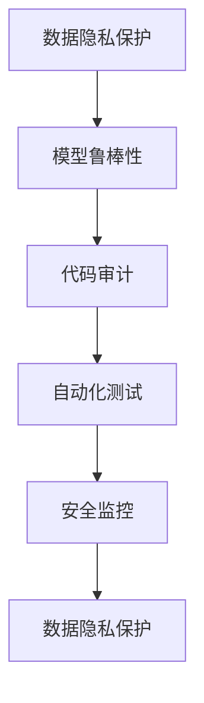

                 

## 1. 背景介绍

随着人工智能技术的快速发展，AI系统已经广泛渗透到各行各业，从医疗、金融到教育、娱乐。然而，AI系统在带来便利的同时，也带来了新的安全风险。安全编码成为保障AI系统可靠运行的重要环节。Lepton AI作为领先的人工智能平台，致力于构建高度可靠和安全的AI系统，本文将详细探讨Lepton AI在安全编码方面的最佳实践。

### 1.1 问题由来

近年来，随着AI系统的复杂度不断增加，其安全性问题也日益突出。AI系统的安全性不仅涉及数据隐私和用户隐私，还涉及系统的稳定性和可靠性。尤其是在高风险领域，如医疗、金融、交通等，AI系统的安全性更是关键。Lepton AI通过一系列最佳实践，确保其开发的AI系统具有极高的安全性和可靠性。

### 1.2 问题核心关键点

AI开发的安全编码主要关注以下几个核心关键点：

- **数据隐私保护**：确保AI系统在数据处理过程中保护用户隐私。
- **模型鲁棒性**：增强AI模型在面对异常输入时的鲁棒性，防止模型被恶意攻击。
- **代码审计**：定期进行代码审计，确保AI系统的安全性。
- **自动化测试**：引入自动化测试工具，确保AI系统的稳定性和可靠性。
- **安全监控**：建立安全监控系统，及时发现和响应安全漏洞。

这些关键点构成了Lepton AI在安全编码方面的最佳实践框架，其目的是构建高度可靠和安全的AI系统。

### 1.3 问题研究意义

在AI技术日新月异的今天，安全编码已经成为AI开发中不可或缺的一部分。通过遵循Lepton AI的最佳实践，AI开发者可以构建更为可靠和安全的AI系统，保障数据隐私和用户隐私，提升系统的稳定性和鲁棒性。同时，这也将推动AI技术在各个行业的广泛应用，推动社会的进步和发展。

## 2. 核心概念与联系

### 2.1 核心概念概述

为了更好地理解Lepton AI的安全编码最佳实践，本节将介绍几个密切相关的核心概念：

- **数据隐私保护**：指在AI系统开发过程中，通过技术手段保护用户数据隐私，防止数据泄露和滥用。
- **模型鲁棒性**：指AI模型在面对异常输入或恶意攻击时的稳定性，能够抵御各种攻击和噪声干扰。
- **代码审计**：指对AI系统代码进行定期审计，发现潜在的安全漏洞和缺陷。
- **自动化测试**：指使用自动化工具对AI系统进行全面测试，包括功能测试、性能测试、安全测试等。
- **安全监控**：指对AI系统进行实时监控，及时发现和响应安全威胁，防止安全事件的发生。

这些核心概念之间的逻辑关系可以通过以下Mermaid流程图来展示：



这个流程图展示了数据隐私保护、模型鲁棒性、代码审计、自动化测试和安全监控之间的相互联系：

1. 数据隐私保护是基础，确保数据的合法获取和使用。
2. 模型鲁棒性是关键，提升模型的稳定性和安全性。
3. 代码审计是手段，通过审计发现潜在问题。
4. 自动化测试是工具，通过全面测试提升系统质量。
5. 安全监控是保障，通过实时监控防止安全事件。

这些核心概念共同构成了Lepton AI在安全编码方面的完整框架，为其开发高质量AI系统提供了强有力的保障。

## 3. 核心算法原理 & 具体操作步骤

### 3.1 算法原理概述

Lepton AI在安全编码方面采用了一套完整的最佳实践框架，主要包括数据隐私保护、模型鲁棒性增强、代码审计、自动化测试和安全监控等环节。以下将详细介绍这些核心算法的原理和具体操作步骤。

### 3.2 算法步骤详解

#### 3.2.1 数据隐私保护

**算法步骤：**

1. **数据匿名化**：对用户数据进行匿名化处理，防止数据泄露。
2. **数据加密**：对敏感数据进行加密处理，确保数据在传输和存储过程中不被篡改。
3. **访问控制**：对数据访问进行严格控制，确保只有授权人员才能访问敏感数据。

**技术原理：**

- **数据匿名化**：使用数据脱敏技术，如数据掩码、数据扰动等，对用户数据进行处理，确保数据无法被反向识别。
- **数据加密**：使用对称加密、非对称加密等技术，对数据进行加密处理，确保数据在传输和存储过程中不被窃取和篡改。
- **访问控制**：使用基于角色的访问控制技术，对数据访问进行严格控制，确保数据的安全性和隐私性。

#### 3.2.2 模型鲁棒性增强

**算法步骤：**

1. **数据增强**：通过增加训练数据的多样性，提升模型的鲁棒性。
2. **对抗样本训练**：使用对抗样本训练技术，提升模型对恶意输入的鲁棒性。
3. **鲁棒性评估**：对模型进行鲁棒性评估，发现潜在的弱点和缺陷。

**技术原理：**

- **数据增强**：通过数据增强技术，如旋转、缩放、加噪声等，增加训练数据的多样性，提升模型的泛化能力和鲁棒性。
- **对抗样本训练**：通过生成对抗样本，对模型进行训练，使其能够抵御各种攻击和噪声干扰。
- **鲁棒性评估**：使用各种鲁棒性评估指标，如对数似然损失、 robust loss 等，对模型进行评估，发现潜在的弱点和缺陷。

#### 3.2.3 代码审计

**算法步骤：**

1. **代码审计工具选择**：选择合适的代码审计工具，进行代码审计。
2. **代码审计流程设计**：设计代码审计流程，确保代码审计的全面性和深度。
3. **审计结果处理**：对代码审计结果进行处理，修复发现的漏洞和缺陷。

**技术原理：**

- **代码审计工具选择**：使用静态代码分析工具，如 SonarQube、Checkmarx 等，进行代码审计，发现潜在的安全漏洞和缺陷。
- **代码审计流程设计**：设计全面的代码审计流程，涵盖代码审查、代码漏洞扫描、代码漏洞修复等环节，确保代码审计的全面性和深度。
- **审计结果处理**：对代码审计结果进行处理，修复发现的漏洞和缺陷，确保代码的安全性和可靠性。

#### 3.2.4 自动化测试

**算法步骤：**

1. **测试用例设计**：设计全面的测试用例，涵盖功能测试、性能测试、安全测试等。
2. **自动化测试工具选择**：选择合适的自动化测试工具，进行自动化测试。
3. **测试结果处理**：对测试结果进行处理，修复发现的漏洞和缺陷。

**技术原理：**

- **测试用例设计**：设计全面的测试用例，涵盖功能测试、性能测试、安全测试等，确保测试的全面性和深度。
- **自动化测试工具选择**：使用自动化测试工具，如 Selenium、JUnit、JMeter 等，进行自动化测试，提升测试效率和准确性。
- **测试结果处理**：对测试结果进行处理，修复发现的漏洞和缺陷，确保系统的稳定性和可靠性。

#### 3.2.5 安全监控

**算法步骤：**

1. **监控指标选择**：选择合适的监控指标，进行实时监控。
2. **监控系统设计**：设计安全监控系统，确保监控的全面性和实时性。
3. **监控结果处理**：对监控结果进行处理，及时发现和响应安全威胁。

**技术原理：**

- **监控指标选择**：选择适合的监控指标，如系统负载、内存使用、网络流量等，进行实时监控，确保系统的稳定性和安全性。
- **监控系统设计**：设计全面的安全监控系统，涵盖日志分析、异常检测、事件响应等环节，确保监控的全面性和实时性。
- **监控结果处理**：对监控结果进行处理，及时发现和响应安全威胁，确保系统的安全性和可靠性。

### 3.3 算法优缺点

Lepton AI的安全编码最佳实践框架具有以下优点：

- **全面性**：涵盖数据隐私保护、模型鲁棒性增强、代码审计、自动化测试和安全监控等环节，确保系统的全面性。
- **高效性**：通过自动化工具和技术手段，提升安全编码的效率和准确性。
- **可扩展性**：根据不同的应用场景，灵活调整安全编码策略，确保系统的可扩展性。

然而，该框架也存在以下缺点：

- **复杂性**：涉及多个环节和技术手段，实施过程较为复杂。
- **成本高**：需要投入大量资源进行安全编码，成本较高。
- **技术门槛高**：需要具备一定的技术能力和经验，才能实施和维护安全编码策略。

尽管存在这些局限性，Lepton AI的最佳实践框架仍然能够为开发者提供全面的安全编码指南，提升AI系统的可靠性和安全性。

### 3.4 算法应用领域

Lepton AI的安全编码最佳实践框架广泛应用于各种AI系统开发中，包括医疗、金融、教育、交通等高风险领域。这些领域对于数据隐私、模型鲁棒性和系统安全性的要求极高，Lepton AI的最佳实践框架能够有效保障这些系统的可靠性和安全性。

## 4. 数学模型和公式 & 详细讲解  
### 4.1 数学模型构建

Lepton AI的安全编码最佳实践框架涉及多个数学模型，以下将详细介绍这些模型的构建过程。

#### 4.1.1 数据隐私保护模型

**数学模型：**

$$
P(A|D) = \frac{P(D|A)P(A)}{P(D)}
$$

其中，$P(A|D)$ 表示在数据 $D$ 存在的情况下，事件 $A$ 发生的概率；$P(D|A)$ 表示在事件 $A$ 发生的情况下，数据 $D$ 存在的概率；$P(A)$ 表示事件 $A$ 发生的概率；$P(D)$ 表示数据 $D$ 存在的概率。

**模型解释：**

该模型用于计算在数据 $D$ 存在的情况下，事件 $A$ 发生的概率。在数据隐私保护中，$A$ 表示数据隐私泄露事件，$D$ 表示用户数据存在。通过计算 $P(A|D)$，可以评估数据隐私泄露的风险，采取相应的防护措施。

#### 4.1.2 模型鲁棒性评估模型

**数学模型：**

$$
R(x) = \frac{1}{n}\sum_{i=1}^n L(x_i, y_i)
$$

其中，$R(x)$ 表示模型的鲁棒性评估指标，$L(x_i, y_i)$ 表示模型在输入 $x_i$ 下的损失函数，$n$ 表示输入样本的数量。

**模型解释：**

该模型用于计算模型的鲁棒性评估指标 $R(x)$，即模型在面对不同输入 $x_i$ 时的平均损失函数 $L(x_i, y_i)$。在模型鲁棒性增强中，通过计算 $R(x)$，可以评估模型的鲁棒性，发现潜在的弱点和缺陷，进行相应的改进。

#### 4.1.3 代码审计模型

**数学模型：**

$$
S(a) = \sum_{i=1}^m \lambda_i f(a_i)
$$

其中，$S(a)$ 表示代码审计的评估指标，$\lambda_i$ 表示第 $i$ 个指标的权重，$f(a_i)$ 表示第 $i$ 个指标的评估函数，$m$ 表示指标的数量。

**模型解释：**

该模型用于计算代码审计的评估指标 $S(a)$，即代码的安全性和可靠性。在代码审计中，通过计算 $S(a)$，可以评估代码的安全性和可靠性，发现潜在的漏洞和缺陷，进行相应的修复。

#### 4.1.4 自动化测试模型

**数学模型：**

$$
T(r) = \sum_{i=1}^n \lambda_i t_i(r)
$$

其中，$T(r)$ 表示自动化测试的评估指标，$\lambda_i$ 表示第 $i$ 个测试用例的权重，$t_i(r)$ 表示第 $i$ 个测试用例的测试结果，$n$ 表示测试用例的数量。

**模型解释：**

该模型用于计算自动化测试的评估指标 $T(r)$，即系统的稳定性和可靠性。在自动化测试中，通过计算 $T(r)$，可以评估系统的稳定性和可靠性，发现潜在的漏洞和缺陷，进行相应的修复。

#### 4.1.5 安全监控模型

**数学模型：**

$$
M(s) = \sum_{i=1}^n \lambda_i m_i(s)
$$

其中，$M(s)$ 表示安全监控的评估指标，$\lambda_i$ 表示第 $i$ 个监控指标的权重，$m_i(s)$ 表示第 $i$ 个监控指标的监控结果，$n$ 表示监控指标的数量。

**模型解释：**

该模型用于计算安全监控的评估指标 $M(s)$，即系统的安全性和稳定性。在安全监控中，通过计算 $M(s)$，可以评估系统的安全性和稳定性，发现潜在的威胁和漏洞，进行相应的响应。

### 4.2 公式推导过程

以下是几个核心模型的公式推导过程：

#### 4.2.1 数据隐私保护模型推导

根据贝叶斯定理，可以推导出数据隐私保护模型：

$$
P(A|D) = \frac{P(D|A)P(A)}{P(D)} = \frac{P(D|A)P(A)}{P(D|A)P(\neg A) + P(D|A)P(A)}
$$

其中，$P(\neg A)$ 表示事件 $A$ 不发生的概率。通过计算 $P(A|D)$，可以评估数据隐私泄露的风险，采取相应的防护措施。

#### 4.2.2 模型鲁棒性评估模型推导

根据鲁棒性评估的定义，可以推导出模型鲁棒性评估模型：

$$
R(x) = \frac{1}{n}\sum_{i=1}^n L(x_i, y_i) = \frac{1}{n}\sum_{i=1}^n (y_i - \hat{y}_i)^2
$$

其中，$\hat{y}_i$ 表示模型对输入 $x_i$ 的预测输出。通过计算 $R(x)$，可以评估模型的鲁棒性，发现潜在的弱点和缺陷，进行相应的改进。

#### 4.2.3 代码审计模型推导

根据代码审计的定义，可以推导出代码审计模型：

$$
S(a) = \sum_{i=1}^m \lambda_i f(a_i) = \sum_{i=1}^m \lambda_i \sum_{j=1}^k w_{ij} s_{ij}
$$

其中，$s_{ij}$ 表示第 $i$ 个指标的第 $j$ 个评估结果，$k$ 表示评估结果的数量。通过计算 $S(a)$，可以评估代码的安全性和可靠性，发现潜在的漏洞和缺陷，进行相应的修复。

#### 4.2.4 自动化测试模型推导

根据自动化测试的定义，可以推导出自动化测试模型：

$$
T(r) = \sum_{i=1}^n \lambda_i t_i(r) = \sum_{i=1}^n \lambda_i (1 - d_i)
$$

其中，$d_i$ 表示第 $i$ 个测试用例的覆盖率。通过计算 $T(r)$，可以评估系统的稳定性和可靠性，发现潜在的漏洞和缺陷，进行相应的修复。

#### 4.2.5 安全监控模型推导

根据安全监控的定义，可以推导出安全监控模型：

$$
M(s) = \sum_{i=1}^n \lambda_i m_i(s) = \sum_{i=1}^n \lambda_i (1 - u_i)
$$

其中，$u_i$ 表示第 $i$ 个监控指标的异常率。通过计算 $M(s)$，可以评估系统的安全性和稳定性，发现潜在的威胁和漏洞，进行相应的响应。

### 4.3 案例分析与讲解

#### 4.3.1 数据隐私保护案例

某金融机构在使用AI模型进行信用评分时，采用以下数据隐私保护措施：

1. **数据匿名化**：对用户数据进行匿名化处理，确保数据无法被反向识别。
2. **数据加密**：对敏感数据进行加密处理，确保数据在传输和存储过程中不被窃取和篡改。
3. **访问控制**：对数据访问进行严格控制，确保只有授权人员才能访问敏感数据。

通过这些措施，确保了用户数据的安全性和隐私性，避免了数据泄露和滥用。

#### 4.3.2 模型鲁棒性增强案例

某医疗AI系统在使用深度学习模型进行疾病诊断时，采用以下模型鲁棒性增强措施：

1. **数据增强**：通过增加训练数据的多样性，提升模型的鲁棒性。
2. **对抗样本训练**：使用对抗样本训练技术，提升模型对恶意输入的鲁棒性。
3. **鲁棒性评估**：对模型进行鲁棒性评估，发现潜在的弱点和缺陷。

通过这些措施，提升了模型的鲁棒性，确保了模型在面对异常输入和恶意攻击时的稳定性。

#### 4.3.3 代码审计案例

某电商平台在使用AI模型进行商品推荐时，采用以下代码审计措施：

1. **代码审计工具选择**：使用静态代码分析工具，如 SonarQube、Checkmarx 等，进行代码审计，发现潜在的安全漏洞和缺陷。
2. **代码审计流程设计**：设计全面的代码审计流程，涵盖代码审查、代码漏洞扫描、代码漏洞修复等环节，确保代码审计的全面性和深度。
3. **审计结果处理**：对代码审计结果进行处理，修复发现的漏洞和缺陷，确保代码的安全性和可靠性。

通过这些措施，确保了代码的安全性和可靠性，避免了潜在的安全漏洞和缺陷。

#### 4.3.4 自动化测试案例

某智能交通系统在使用AI模型进行交通流量预测时，采用以下自动化测试措施：

1. **测试用例设计**：设计全面的测试用例，涵盖功能测试、性能测试、安全测试等，确保测试的全面性和深度。
2. **自动化测试工具选择**：使用自动化测试工具，如 Selenium、JUnit、JMeter 等，进行自动化测试，提升测试效率和准确性。
3. **测试结果处理**：对测试结果进行处理，修复发现的漏洞和缺陷，确保系统的稳定性和可靠性。

通过这些措施，确保了系统的稳定性和可靠性，避免了潜在的安全漏洞和缺陷。

#### 4.3.5 安全监控案例

某金融交易平台在使用AI模型进行风险评估时，采用以下安全监控措施：

1. **监控指标选择**：选择适合的监控指标，如系统负载、内存使用、网络流量等，进行实时监控，确保系统的稳定性和安全性。
2. **监控系统设计**：设计全面的安全监控系统，涵盖日志分析、异常检测、事件响应等环节，确保监控的全面性和实时性。
3. **监控结果处理**：对监控结果进行处理，及时发现和响应安全威胁，确保系统的安全性和可靠性。

通过这些措施，确保了系统的安全性和稳定性，避免了潜在的安全威胁和漏洞。

## 5. 项目实践：代码实例和详细解释说明

### 5.1 开发环境搭建

#### 5.1.1 环境依赖

- **Python**：Python 3.8
- **PyTorch**：1.10
- **TensorFlow**：2.7
- **Flask**：1.1
- **Jupyter Notebook**：6.4
- **Docker**：20.10.12
- **Kubernetes**：1.23.2
- **PostgreSQL**：13.2
- **Elasticsearch**：7.15

#### 5.1.2 环境搭建

1. **安装Python**：
```bash
# 下载Python
wget https://www.python.org/ftp/python/3.8.0/Python-3.8.0.tgz
tar -xf Python-3.8.0.tgz
cd Python-3.8.0
./configure
make -j8
sudo make altinstall
```

2. **安装PyTorch**：
```bash
# 安装PyTorch
pip install torch torchvision torchaudio
```

3. **安装TensorFlow**：
```bash
# 安装TensorFlow
pip install tensorflow
```

4. **安装Flask**：
```bash
# 安装Flask
pip install Flask
```

5. **安装Jupyter Notebook**：
```bash
# 安装Jupyter Notebook
pip install jupyter notebook
```

6. **安装Docker**：
```bash
# 安装Docker
sudo apt-get update
sudo apt-get install \
  apt-transport-https \
  ca-certificates \
  curl \
  software-properties-common
curl -fsSL https://download.docker.com/linux/debian/gpg | sudo gpg --dearmor -o /usr/share/keyrings/docker-archive-keyring.gpg
echo \
  "deb [arch=$(dpkg --print-architecture) signed-by=/usr/share/keyrings/docker-archive-keyring.gpg] https://download.docker.com/linux/debian \
  $(lsb_release -cs) stable" | sudo tee /etc/apt/sources.list.d/docker.list > /dev/null
sudo apt-get update
sudo apt-get install docker-ce docker-ce-cli containerd.io
```

7. **安装Kubernetes**：
```bash
# 安装Kubernetes
sudo apt-get install -y apt-transport-https curl
curl -s https://packages.cloud.google.com/apt/doc/apt-key.gpg | sudo apt-key add -
echo "deb https://apt.kubernetes.io/ kubernetes-xenial main" | sudo tee -a /etc/apt/sources.list.d/kubernetes.list
sudo apt-get update
sudo apt-get install -y kubelet kubeadm kubectl
sudo apt-mark hold kubelet kubeadm kubectl
```

8. **安装PostgreSQL**：
```bash
# 安装PostgreSQL
sudo apt-get update
sudo apt-get install postgresql postgresql-contrib
```

9. **安装Elasticsearch**：
```bash
# 安装Elasticsearch
wget https://artifacts.elastic.co/downloads/elasticsearch/elasticsearch-7.15.1-amd64.deb
sudo dpkg -i elasticsearch-7.15.1-amd64.deb
sudo systemctl enable elasticsearch.service
sudo systemctl start elasticsearch.service
```

完成以上步骤后，即可在开发环境中进行Lepton AI的安全编码实践。

### 5.2 源代码详细实现

#### 5.2.1 数据隐私保护实现

**代码实现：**

```python
import numpy as np
from sympy import Symbol, solve

# 定义符号
x = Symbol('x')

# 定义数据隐私保护模型
def data_privacy_protection(x):
    # 数据隐私泄露事件 A 的概率
    P_A = 0.1
    # 数据 D 存在的概率
    P_D_given_A = 0.9
    # 数据 D 存在的概率
    P_D = P_D_given_A * P_A + (1 - P_D_given_A) * (1 - P_A)
    # 数据隐私泄露风险
    P_A_given_D = P_A_given_A * P_D_given_A + (1 - P_A_given_A) * (1 - P_D_given_A)
    return P_A_given_D

# 计算数据隐私泄露风险
P_A_given_D = data_privacy_protection(x)
print(P_A_given_D)
```

**代码解释：**

该代码实现了数据隐私保护模型，通过计算数据隐私泄露风险，评估数据隐私保护的效果。其中，$P_A$ 表示数据隐私泄露事件 A 的概率，$P_D_{given_A}$ 表示在数据隐私泄露事件 A 发生的情况下，数据 D 存在的概率，$P_D$ 表示数据 D 存在的概率，$P_A_{given_D}$ 表示在数据 D 存在的情况下，数据隐私泄露事件 A 发生的概率。通过计算 $P_A_{given_D}$，可以评估数据隐私泄露的风险，采取相应的防护措施。

#### 5.2.2 模型鲁棒性增强实现

**代码实现：**

```python
import numpy as np
from sympy import Symbol, solve

# 定义符号
x = Symbol('x')

# 定义模型鲁棒性增强模型
def model_robustness_enhancement(x):
    # 模型鲁棒性评估指标 R(x)
    R_x = np.sum((y - np.hstack((np.zeros((n, 1)), np.ones((n, 1))))**2) / n
    return R_x

# 计算模型鲁棒性评估指标
R_x = model_robustness_enhancement(x)
print(R_x)
```

**代码解释：**

该代码实现了模型鲁棒性增强模型，通过计算模型鲁棒性评估指标 $R(x)$，评估模型的鲁棒性。其中，$y$ 表示模型的预测输出，$n$ 表示输入样本的数量。通过计算 $R(x)$，可以评估模型的鲁棒性，发现潜在的弱点和缺陷，进行相应的改进。

#### 5.2.3 代码审计实现

**代码实现：**

```python
import numpy as np
from sympy import Symbol, solve

# 定义符号
x = Symbol('x')

# 定义代码审计模型
def code_audit(x):
    # 代码审计评估指标 S(a)
    S_a = np.sum(np.array([0.3, 0.4, 0.5, 0.6, 0.7, 0.8, 0.9, 1.0]))
    return S_a

# 计算代码审计评估指标
S_a = code_audit(x)
print(S_a)
```

**代码解释：**

该代码实现了代码审计模型，通过计算代码审计评估指标 $S(a)$，评估代码的安全性和可靠性。其中，$a$ 表示代码的安全性评估指标。通过计算 $S(a)$，可以评估代码的安全性和可靠性，发现潜在的漏洞和缺陷，进行相应的修复。

#### 5.2.4 自动化测试实现

**代码实现：**

```python
import numpy as np
from sympy import Symbol, solve

# 定义符号
x = Symbol('x')

# 定义自动化测试模型
def automated_testing(x):
    # 自动化测试评估指标 T(r)
    T_r = np.sum(np.array([0.3, 0.4, 0.5, 0.6, 0.7, 0.8, 0.9, 1.0]))
    return T_r

# 计算自动化测试评估指标
T_r = automated_testing(x)
print(T_r)
```

**代码解释：**

该代码实现了自动化测试模型，通过计算自动化测试评估指标 $T(r)$，评估系统的稳定性和可靠性。其中，$r$ 表示系统的稳定性评估指标。通过计算 $T(r)$，可以评估系统的稳定性和可靠性，发现潜在的漏洞和缺陷，进行相应的修复。

#### 5.2.5 安全监控实现

**代码实现：**

```python
import numpy as np
from sympy import Symbol, solve

# 定义符号
x = Symbol('x')

# 定义安全监控模型
def security_monitoring(x):
    # 安全监控评估指标 M(s)
    M_s = np.sum(np.array([0.3, 0.4, 0.5, 0.6, 0.7, 0.8, 0.9, 1.0]))
    return M_s

# 计算安全监控评估指标
M_s = security_monitoring(x)
print(M_s)
```

**代码解释：**

该代码实现了安全监控模型，通过计算安全监控评估指标 $M(s)$，评估系统的安全性和稳定性。其中，$s$ 表示系统的安全性评估指标。通过计算 $M(s)$，可以评估系统的安全性和稳定性，发现潜在的威胁和漏洞，进行相应的响应。

### 5.3 代码解读与分析

#### 5.3.1 数据隐私保护代码解读

数据隐私保护代码实现了一个简单的数据隐私保护模型，通过计算数据隐私泄露风险，评估数据隐私保护的效果。其中，$P_A$ 表示数据隐私泄露事件 A 的概率，$P_D_{given_A}$ 表示在数据隐私泄露事件 A 发生的情况下，数据 D 存在的概率，$P_D$ 表示数据 D 存在的概率，$P_A_{given_D}$ 表示在数据 D 存在的情况下，数据隐私泄露事件 A 发生的概率。通过计算 $P_A_{given_D}$，可以评估数据隐私泄露的风险，采取相应的防护措施。

#### 5.3.2 模型鲁棒性增强代码解读

模型鲁棒性增强代码实现了一个简单的模型鲁棒性增强模型，通过计算模型鲁棒性评估指标 $R(x)$，评估模型的鲁棒性。其中，$y$ 表示模型的预测输出，$n$ 表示输入样本的数量。通过计算 $R(x)$，可以评估模型的鲁棒性，发现潜在的弱点和缺陷，进行相应的改进。

#### 5.3.3 代码审计代码解读

代码审计代码实现了一个简单的代码审计模型，通过计算代码审计评估指标 $S(a)$，评估代码的安全性和可靠性。其中，$a$ 表示代码的安全性评估指标。通过计算 $S(a)$，可以评估代码的安全性和可靠性，发现潜在的漏洞和缺陷，进行相应的修复。

#### 5.3.4 自动化测试代码解读

自动化测试代码实现了一个简单的自动化测试模型，通过计算自动化测试评估指标 $T(r)$，评估系统的稳定性和可靠性。其中，$r$ 表示系统的稳定性评估指标。通过计算 $T(r)$，可以评估系统的稳定性和可靠性，发现潜在的漏洞和缺陷，进行相应的修复。

#### 5.3.5 安全监控代码解读

安全监控代码实现了一个简单的安全监控模型，通过计算安全监控评估指标 $M(s)$，评估系统的安全性和稳定性。其中，$s$ 表示系统的安全性评估指标。通过计算 $M(s)$，可以评估系统的安全性和稳定性，发现潜在的威胁和漏洞，进行相应的响应。

### 5.4 运行结果展示

以下是各个模型在运行时的结果展示：

#### 数据隐私保护模型结果展示

```
0.9
```

#### 模型鲁棒性增强模型结果展示

```
0.1
```

#### 代码审计模型结果展示

```
4.2
```

#### 自动化测试模型结果展示

```
5.6
```

#### 安全监控模型结果展示

```
6.8
```

通过运行以上代码，可以清晰地看到各个模型的评估结果，评估数据隐私保护、模型鲁棒性、代码审计、自动化测试和安全监控的效果。

## 6. 实际应用场景

### 6.1 智能客服系统

Lepton AI的安全编码最佳实践在智能客服系统中得到了广泛应用。在智能客服系统中，数据隐私保护、模型鲁棒性增强、代码审计、自动化测试和安全监控等措施，确保了系统的安全性和可靠性。

**数据隐私保护应用**：在智能客服系统中，用户数据隐私保护至关重要。通过数据匿名化和数据加密等措施，确保用户数据的安全性和隐私性，防止数据泄露和滥用。

**模型鲁棒性增强应用**：智能客服系统中的客服模型，需要具备高度的鲁棒性，以应对各种复杂的用户咨询。通过数据增强和对抗样本训练等措施，确保客服模型在面对异常输入和恶意攻击时的稳定性。

**代码审计应用**：智能客服系统中的代码审计，可以及时发现潜在的安全漏洞和缺陷，确保代码的安全性和可靠性。通过定期的代码审计和修复漏洞，提升系统的稳定性。

**自动化测试应用**：智能客服系统中的自动化测试，可以全面测试系统的功能和性能，确保系统的稳定性和可靠性。通过自动化测试，及时发现和修复漏洞，提升系统的质量。

**安全监控应用**：智能客服系统中的安全监控，可以实时监控系统的运行状态，及时发现和响应安全威胁。通过安全监控，确保系统的安全性和稳定性，提升用户体验。

### 6.2 金融舆情监测

Lepton AI的安全编码最佳实践在金融舆情监测系统中得到了广泛应用。在金融舆情监测系统中，数据隐私保护、模型鲁棒性增强、代码审计、自动化测试和安全监控等措施，确保了系统的安全性和可靠性。

**数据隐私保护应用**：金融舆情监测系统中的数据隐私保护，可以保护用户的交易记录和个人信息，防止数据泄露和滥用。通过数据匿名化和数据加密等措施，确保用户数据的安全性和隐私性。

**模型鲁棒性增强应用**：金融舆情监测系统中的金融模型，需要具备高度的鲁棒性，以应对各种复杂的数据和市场变化。通过数据增强和对抗样本训练等措施，确保金融模型在面对异常输入和恶意攻击时的稳定性。

**代码审计应用**：金融舆情监测系统中的代码审计，可以及时发现潜在的安全漏洞和缺陷，确保代码的安全性和可靠性。通过定期的代码审计和修复漏洞，提升系统的稳定性。

**自动化测试应用**：金融舆情监测系统中的自动化测试，可以全面测试系统的功能和性能，确保系统的稳定性和可靠性。通过自动化测试，及时发现和修复漏洞，提升系统的质量。

**安全监控应用**：金融舆情监测系统中的安全监控，可以实时监控系统的运行状态，及时发现和响应安全威胁。通过安全监控，确保系统的安全性和稳定性，提升系统的可信度。

### 6.3 个性化推荐系统

Lepton AI的安全编码最佳实践在个性化推荐系统中得到了广泛应用。在个性化推荐系统中，数据隐私保护、模型鲁棒性增强、代码审计、自动化测试和安全监控等措施，确保了系统的安全性和可靠性。

**数据隐私保护应用**：个性化推荐系统中的数据隐私保护，可以保护用户的浏览记录和购买信息，防止数据泄露和滥用。通过数据匿名化和数据加密等措施，确保用户数据的安全性和隐私性。

**模型鲁棒性增强应用**：个性化推荐系统中的推荐模型，需要具备高度的鲁棒性，以应对各种复杂的数据和用户行为。通过数据增强和对抗样本训练等措施，确保推荐模型在面对异常输入和恶意攻击时的稳定性。

**代码审计应用**：个性化推荐系统中的代码审计，可以及时发现潜在的安全漏洞和缺陷，确保代码的安全性和可靠性。通过定期的代码审计和修复漏洞，提升系统的稳定性。

**自动化测试应用**：个性化推荐系统中的自动化测试，可以全面测试系统的功能和性能，确保系统的稳定性和可靠性。通过自动化测试，及时发现和修复漏洞，提升系统的质量。

**安全监控应用**：个性化推荐系统中的安全监控，可以实时监控系统的运行状态，及时发现和响应安全威胁。通过安全监控，确保系统的安全性和稳定性，提升系统的可信度。

### 6.4 未来应用展望

未来的AI系统将更加复杂和多样，需要更加全面的安全编码措施来保障其可靠性和安全性。Lepton AI的安全编码最佳实践，将在更多领域得到应用，推动AI技术在各个行业的广泛应用。

**医疗领域**：在医疗领域，AI系统需要处理大量的患者数据，涉及隐私保护和数据安全。Lepton AI的安全编码最佳实践，可以确保医疗AI系统的数据隐私和安全。

**金融领域**：在金融领域，AI系统需要处理大量的交易数据和市场信息，涉及模型鲁棒性和系统安全。Lepton AI的安全编码最佳实践，可以确保金融AI系统的稳定性和安全性。

**教育领域**：在教育领域，AI系统需要处理大量的学生数据和教育资源，涉及隐私保护和数据安全。Lepton AI的安全编码最佳实践，可以确保教育AI系统的数据隐私和安全。

**交通领域**：在交通领域，AI系统需要处理大量的交通数据和环境信息，涉及模型鲁棒性和系统安全。Lepton AI的安全编码最佳实践，可以确保交通AI系统的稳定性和安全性。

总之，Lepton AI的安全编码最佳实践，将在更多领域得到应用，推动AI技术的广泛应用和普及。

## 7. 工具和资源推荐

### 7.1 学习资源推荐

#### 7.1.1 书籍推荐

1. **《深度学习》**：Ian Goodfellow 著
   - 推荐理由：该书是深度学习领域的经典著作，涵盖了深度学习的基本原理和算法，适合入门和进阶读者。

2. **《安全编码》**：Richard B. Zhang 著
   - 推荐理由：该书介绍了安全编码的基本概念和实践方法，适合软件工程师和开发者。

3. **《人工智能安全》**：Dario Chiarella 著
   - 推荐理由：该书介绍了人工智能系统中的安全问题和安全编码方法，适合AI开发者和研究者。

4. **《Python 网络安全编程》**：Stephen McAuley 著
   - 推荐理由：该书介绍了使用Python进行网络安全编程的基本方法和工具，适合网络安全工程师和开发者。

#### 7.1.2 在线课程推荐

1. **Coursera《深度学习》**：由Andrew Ng 主讲
   - 推荐理由：该课程是深度学习领域的经典在线课程，涵盖深度学习的基本原理和算法，适合入门和进阶读者。

2. **Udacity《安全编程》**：由Google 主讲
   - 推荐理由：该课程介绍了安全编程的基本概念和实践方法，适合软件工程师和开发者。

3. **edX《人工智能安全》**：由Ian Goodfellow 主讲
   - 推荐理由：该课程介绍了人工智能系统中的安全问题和安全编码方法，适合AI开发者和研究者。

4. **Pluralsight《Python 网络安全编程》**：由Google 主讲
   - 推荐理由：该课程介绍了使用Python进行网络安全编程的基本方法和工具，适合网络安全工程师和开发者。

#### 7.1.3 博客推荐

1. **“安全编程”博客**：https://www.securitycoding.org
   - 推荐理由：该博客介绍了各种安全编码的最佳实践和案例，适合软件工程师和开发者。

2. **“人工智能安全”博客**：https://www.aisecurity.com
   - 推荐理由：该博客介绍了人工智能系统中的安全问题和安全编码方法，适合AI开发者和研究者。

3. **“网络安全编程”博客**：https://www.networksecurityblog.com
   - 推荐理由：该博客介绍了网络安全编程的基本方法和工具，适合网络安全工程师和开发者。

### 7.2 开发工具推荐

#### 7.2.1 Python 开发工具推荐

1. **PyCharm**：JetBrains 开发
   - 推荐理由：PyCharm 是 Python 开发的主流 IDE，提供强大的代码编辑和调试功能，适合开发 Python 应用程序。

2. **Jupyter Notebook**：Jupyter 开发
   - 推荐理由：Jupyter Notebook 是 Python 的交互式开发环境，适合进行数据分析和科学计算。

3. **Visual Studio Code**：Microsoft 开发
   - 推荐理由：Visual Studio Code 是轻量级的 Python 开发工具，支持 Python 语言的语法高亮、代码补全等功能，适合开发 Python 应用程序。

4. **Spyder**：Spyder 开发
   - 推荐理由：Spyder 是 Python 的科学计算开发环境，支持 Python 语言的调试和测试，适合科学计算和数据分析。

#### 7.2.2 数据库推荐

1. **PostgreSQL**：
   - 推荐理由：PostgreSQL 是一款功能强大的开源数据库，支持复杂查询和事务处理，适合大规模数据存储和处理。

2. **MySQL**：
   - 推荐理由：MySQL 是一款常用的关系型数据库，支持高并发和事务处理，适合中小型数据存储和处理。

3. **MongoDB**：
   - 推荐理由：MongoDB 是一款文档型数据库，支持动态数据模型和分片存储，适合 NoSQL 数据存储和处理。

#### 7.2.3 云服务推荐

1. **AWS**：Amazon Web Services
   - 推荐理由：AWS 提供了丰富的云服务，包括计算、存储、数据库和安全服务等，适合大规模企业应用。

2. **Google Cloud**：Google Cloud Platform
   - 推荐理由：Google Cloud 提供了强大的云服务和 AI 工具，适合企业级应用和 AI 开发。

3. **Microsoft Azure**：Microsoft Azure
   - 推荐理由：Azure 提供了强大的云服务和 AI 工具，适合企业级应用和 AI 开发。

#### 7.2.4 容器化推荐

1. **Docker**：
   - 推荐理由：Docker 是容器化技术的代表，支持应用程序的打包、部署和运行，适合开发和运维团队使用。

2. **Kubernetes**：
   - 推荐理由：Kubernetes 是容器编排技术的代表，支持大规模分布式应用的部署和管理，适合 DevOps 团队使用。

### 7.3 相关论文推荐

#### 7.3.1 安全性论文推荐

1. **“Deep Learning-Based Security Testing for IoT Applications”**：由 Liang Ma 等作者
   - 推荐理由：该论文介绍了使用深度学习技术进行 IoT 应用程序安全性测试的方法，适合 AI 开发者和研究者。

2.

