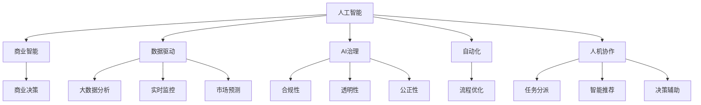

                 

# AI技术在商业中的发展趋势

> 关键词：人工智能,商业智能,数据驱动,AI治理,区块链,边缘计算,自动化,人机协作

## 1. 背景介绍

在过去几十年中，人工智能(AI)技术从理论研究逐渐走向实际应用，成为了推动经济社会发展的关键动力。AI在商业中的应用，从简单的数据分析，到复杂的自动化决策系统，从智能客服，到智能供应链管理，正以不可阻挡的趋势渗透到各行各业。AI技术的商业化应用，不仅仅是提高了生产效率，降低了运营成本，更重要的是改变了企业的商业模式和竞争格局。

### 1.1 问题由来

随着技术的不断演进，AI在商业中的应用已从单一的业务流程优化，发展到全业务链的智能化改造。但是，AI技术的广泛应用也带来了一些新的问题。例如，如何在保证数据隐私的前提下，实现数据的价值最大化？如何平衡技术进步与就业压力？如何制定AI技术的商业伦理标准？如何应对技术滥用带来的潜在风险？这些问题成为AI技术在商业发展中必须面对的挑战。

### 1.2 问题核心关键点

AI技术在商业中的应用主要体现在以下几个关键点：

1. **数据驱动的决策**：通过大数据分析，AI可以为企业提供精准的决策支持，优化产品推荐、库存管理、营销策略等。
2. **自动化流程**：AI技术可以自动化重复性高、劳动强度大的任务，如客服、财务、制造等，提升生产效率。
3. **智能监控**：AI可以通过实时数据分析，监测业务运行状态，提前预测风险，提高运营安全性。
4. **个性化服务**：AI可以通过用户行为分析，提供定制化的服务，提升用户体验。
5. **市场预测**：AI可以通过大数据分析，预测市场趋势，帮助企业提前布局。

这些关键点展示了AI技术在商业中的应用广度和深度，但也暴露了企业在应用AI过程中需要考虑的关键问题。

## 2. 核心概念与联系

### 2.1 核心概念概述

为了更好地理解AI技术在商业中的应用，本节将介绍几个密切相关的核心概念：

- **人工智能(AI)**：一种模拟人类智能过程的技术，通过计算机程序和算法实现对复杂问题的自主解决。
- **商业智能(BI)**：使用数据分析技术，帮助企业发现并解读数据，从而支持业务决策。
- **数据驱动(Driven by Data)**：通过数据驱动企业决策，以数据为基础进行运营管理和战略规划。
- **AI治理(AI Governance)**：建立AI技术的治理框架，确保AI应用的合法合规、透明公正。
- **区块链(Blockchain)**：一种去中心化的分布式账本技术，用于记录交易和合约，保障数据安全与透明。
- **边缘计算(Edge Computing)**：将计算任务分布到靠近数据源的设备上进行处理，提升数据处理速度和效率。
- **自动化(Automation)**：通过AI技术实现工作流程的自动化，减少人工干预，提高效率。
- **人机协作(Human-Machine Collaboration)**：将AI技术与人类智慧相结合，形成优势互补，共同解决问题。

这些核心概念之间的逻辑关系可以通过以下Mermaid流程图来展示：



这个流程图展示了大语言模型的核心概念及其之间的关系：

1. 人工智能技术通过商业智能，实现数据驱动的商业决策。
2. AI治理确保AI应用的合规性、透明性和公正性。
3. 区块链和边缘计算提升数据处理和存储的安全性和效率。
4. 自动化技术优化流程，提高效率。
5. 人机协作实现优势互补，共同解决问题。

这些概念共同构成了AI技术在商业中的应用框架，使其能够在各种场景下发挥巨大的价值。

## 3. 核心算法原理 & 具体操作步骤
### 3.1 算法原理概述

AI技术在商业中的应用，往往基于以下核心算法原理：

- **机器学习(ML)**：通过数据训练模型，使其能够自动学习输入与输出之间的映射关系，实现数据驱动的决策。
- **深度学习(DL)**：利用神经网络模型，实现对复杂数据的深度表示和处理，提升模型的泛化能力。
- **自然语言处理(NLP)**：通过语言模型和算法，实现对自然语言的理解和生成，提供智能客服、智能翻译等服务。
- **强化学习(Reinforcement Learning)**：通过奖励机制，训练模型在特定环境中做出最优决策。
- **计算机视觉(CV)**：通过图像识别和处理技术，实现对视觉信息的自动化分析。

这些算法原理构成了AI技术在商业中的技术基础，使其能够在复杂的商业环境中实现高效的数据处理和智能决策。

### 3.2 算法步骤详解

基于AI技术的商业应用，一般包括以下几个关键步骤：

**Step 1: 数据收集与处理**

- 收集业务运营相关的数据，包括客户信息、交易记录、产品性能等。
- 对数据进行清洗、去重、归一化等预处理操作。
- 进行特征工程，提取对业务决策有帮助的关键特征。

**Step 2: 模型训练与优化**

- 选择合适的机器学习模型，如线性回归、决策树、随机森林等。
- 使用历史数据训练模型，优化模型参数。
- 使用交叉验证等方法评估模型性能。
- 进行超参数调优，提高模型效果。

**Step 3: 模型部署与监控**

- 将训练好的模型部署到生产环境。
- 实时监控模型性能，确保模型稳定运行。
- 定期更新模型，适应业务变化。
- 建立反馈机制，不断优化模型。

**Step 4: 应用集成与评估**

- 将模型集成到业务流程中，实现自动化决策。
- 评估模型应用效果，进行业务改进。
- 分析模型输出结果，提供决策支持。
- 进行用户反馈收集，改进模型。

### 3.3 算法优缺点

AI技术在商业中的应用具有以下优点：

1. **提高效率**：通过自动化流程和智能决策，大幅提升业务处理速度和效率。
2. **降低成本**：减少人力成本，提升资源利用率。
3. **精准决策**：通过数据分析，提供精准的决策支持，优化业务策略。
4. **提高客户满意度**：通过智能客服和个性化推荐，提升客户体验。
5. **预测未来趋势**：通过市场预测，帮助企业提前布局，抢占市场先机。

同时，这些应用也存在一些缺点：

1. **数据隐私问题**：在数据驱动的决策中，如何保护用户隐私，避免数据滥用，是必须解决的问题。
2. **技术依赖**：过度依赖技术，忽视了人的作用，可能导致技术滥用。
3. **技术复杂性**：AI技术的实现和维护需要专业知识，对企业技术能力提出了较高要求。
4. **风险管理**：AI技术的决策过程透明性不足，可能引发误解和争议。
5. **伦理挑战**：AI技术的决策过程可能存在偏见，引发伦理问题。

### 3.4 算法应用领域

AI技术在商业中的应用已经覆盖了诸多领域，包括但不限于：

- **金融服务**：风险控制、信用评估、欺诈检测、投资策略等。
- **零售行业**：个性化推荐、库存管理、销售预测、顾客行为分析等。
- **制造业**：生产流程优化、质量控制、供应链管理、设备维护等。
- **医疗健康**：疾病诊断、患者监护、药物研发、健康管理等。
- **交通运输**：智能调度、车辆维护、事故预警、物流优化等。
- **能源管理**：智能电网、能源消耗预测、能源优化调度等。
- **物流仓储**：智能仓储管理、路线优化、库存优化等。
- **教育培训**：个性化学习、智能评估、教学管理等。

这些领域展示了AI技术在商业中的广泛应用，推动了各个行业向智能化、自动化方向发展。

## 4. 数学模型和公式 & 详细讲解  
### 4.1 数学模型构建

在商业中应用AI技术，通常基于以下数学模型：

- **线性回归模型**：用于预测连续变量的值，如销售预测、客户满意度预测等。
- **决策树模型**：用于分类和回归分析，帮助企业做出决策。
- **随机森林模型**：通过组合多个决策树，提升模型的准确性和鲁棒性。
- **支持向量机(SVM)**：用于分类和回归分析，特别是对于高维数据的处理。
- **神经网络模型**：用于深度学习，处理复杂的非线性关系。
- **强化学习模型**：通过奖励机制，优化决策策略。
- **聚类算法**：用于发现数据中的模式和群组，如客户分群、市场细分等。

### 4.2 公式推导过程

以下以线性回归模型为例，推导其基本公式及其在商业中的应用。

设有一组训练数据 $\{(x_i, y_i)\}_{i=1}^N$，其中 $x_i$ 为自变量，$y_i$ 为因变量。线性回归模型的目标是找到一个线性函数 $y=\theta_0+\theta_1x$，使得对所有训练数据，预测值与实际值之间的误差最小。

最小化误差的目标函数为：

$$
\min \sum_{i=1}^N (y_i - \theta_0 - \theta_1x_i)^2
$$

对上述目标函数进行求导，得到最小化误差时的 $\theta_0$ 和 $\theta_1$ 的公式：

$$
\theta_0 = \frac{1}{N} \sum_{i=1}^N y_i - \frac{1}{N} \sum_{i=1}^N x_i
$$

$$
\theta_1 = \frac{\sum_{i=1}^N (x_i - \frac{1}{N} \sum_{i=1}^N x_i)(y_i - \frac{1}{N} \sum_{i=1}^N y_i)}{\sum_{i=1}^N (x_i - \frac{1}{N} \sum_{i=1}^N x_i)^2}
$$

训练好的线性回归模型可以通过上述公式计算预测值，帮助企业进行销售预测、客户满意度预测等决策。

### 4.3 案例分析与讲解

假设一家电商公司，希望通过AI技术预测下季度销售额。首先，收集过去一年的销售数据、广告支出、用户行为等数据。然后，对数据进行清洗和特征工程，构建一个线性回归模型，预测下季度销售额。

具体步骤如下：

1. 收集数据：收集过去一年的销售数据、广告支出、用户行为等数据。
2. 数据清洗：去除无效数据，处理缺失值，进行归一化处理。
3. 特征工程：提取对销售预测有帮助的关键特征，如广告支出、用户点击率、复购率等。
4. 模型训练：使用历史数据训练线性回归模型，优化模型参数。
5. 模型部署：将训练好的模型部署到生产环境，实时计算预测销售额。
6. 模型监控：实时监控模型性能，确保模型稳定运行。
7. 应用改进：根据模型输出结果，进行业务改进，提升销售效果。

通过以上步骤，电商公司可以实时预测销售趋势，优化库存管理，提升客户满意度。

## 5. 项目实践：代码实例和详细解释说明
### 5.1 开发环境搭建

在进行AI技术商业化应用前，我们需要准备好开发环境。以下是使用Python进行Scikit-Learn开发的环境配置流程：

1. 安装Anaconda：从官网下载并安装Anaconda，用于创建独立的Python环境。

2. 创建并激活虚拟环境：
```bash
conda create -n ai-env python=3.8 
conda activate ai-env
```

3. 安装Scikit-Learn：
```bash
conda install scikit-learn
```

4. 安装各类工具包：
```bash
pip install numpy pandas matplotlib seaborn jupyter notebook ipython
```

完成上述步骤后，即可在`ai-env`环境中开始AI技术的商业化应用实践。

### 5.2 源代码详细实现

这里我们以电商公司销售预测为例，给出使用Scikit-Learn进行线性回归模型训练的Python代码实现。

首先，定义数据处理函数：

```python
import pandas as pd
from sklearn.model_selection import train_test_split
from sklearn.linear_model import LinearRegression
from sklearn.metrics import mean_squared_error

def load_data(file_path):
    df = pd.read_csv(file_path)
    return df.dropna(), df['Sales']

def split_data(data, test_size=0.2):
    x_train, x_test, y_train, y_test = train_test_split(data.drop('Sales', axis=1), data['Sales'], test_size=test_size)
    return x_train, x_test, y_train, y_test

def train_model(X, y):
    model = LinearRegression()
    model.fit(X, y)
    return model

def evaluate_model(model, X_test, y_test):
    y_pred = model.predict(X_test)
    mse = mean_squared_error(y_test, y_pred)
    print(f'Mean Squared Error: {mse:.3f}')
```

然后，定义模型训练和评估函数：

```python
def train_and_evaluate(data_path, test_size=0.2):
    data, target = load_data(data_path)
    x_train, x_test, y_train, y_test = split_data(data, test_size)
    
    model = train_model(x_train, y_train)
    evaluate_model(model, x_test, y_test)
```

最后，启动模型训练流程：

```python
train_and_evaluate('sales_data.csv', test_size=0.2)
```

以上就是使用Scikit-Learn进行线性回归模型训练的完整代码实现。可以看到，使用Scikit-Learn可以快速搭建一个简单的线性回归模型，并用于商业预测。

### 5.3 代码解读与分析

让我们再详细解读一下关键代码的实现细节：

**load_data函数**：
- 读取数据文件，并进行数据清洗，去除无效数据和缺失值。
- 返回处理后的数据和目标变量。

**split_data函数**：
- 使用train_test_split方法，将数据集划分为训练集和测试集。
- 返回训练集、测试集、训练集标签和测试集标签。

**train_model函数**：
- 使用LinearRegression模型，训练线性回归模型。
- 返回训练好的模型。

**evaluate_model函数**：
- 计算模型在测试集上的均方误差。
- 输出模型评估结果。

**train_and_evaluate函数**：
- 调用load_data函数加载数据。
- 调用split_data函数划分数据集。
- 调用train_model函数训练模型。
- 调用evaluate_model函数评估模型。

这些函数实现了从数据加载、模型训练、模型评估的完整流程，方便用户快速搭建一个简单的AI预测系统。

## 6. 实际应用场景
### 6.1 智能客服系统

智能客服系统是AI技术在商业中的典型应用之一。通过AI技术，智能客服系统可以实现全天候、高效、个性化的客户服务。智能客服系统可以理解客户的问题，提供实时回答，减少人工客服的负担，提升客户满意度。

在技术实现上，智能客服系统通常包括以下几个步骤：

1. 收集历史客服对话记录，将其标注为问题和最佳回答。
2. 训练一个预训练的语言模型，如BERT或GPT，用于处理自然语言。
3. 微调模型，使其能够识别客户意图，并从知识库中匹配最佳答案。
4. 集成到实际应用中，实时处理客户咨询，并根据客户反馈不断优化模型。

智能客服系统的应用，不仅减少了企业的人力成本，提高了客户满意度，还提升了企业的服务质量和品牌形象。

### 6.2 金融风控系统

金融行业是AI技术的重要应用领域之一。AI技术可以用于金融风险控制、信用评估、欺诈检测等，帮助金融机构更好地管理风险，提升运营效率。

在风险控制方面，AI可以通过分析用户的历史交易数据，识别出潜在的风险用户，并进行预警。在信用评估方面，AI可以基于用户的信用历史和行为，提供精准的信用评分。在欺诈检测方面，AI可以通过分析交易数据，检测出异常交易行为，并及时进行阻止。

AI技术在金融行业的应用，不仅提高了金融机构的运营效率，降低了运营成本，还提升了风险管理和用户服务质量。

### 6.3 智能供应链管理

智能供应链管理是AI技术在商业中的另一个重要应用。通过AI技术，企业可以实现供应链的自动化和智能化管理，提升供应链的效率和透明度。

AI可以通过分析历史交易数据和市场数据，预测未来的需求和供应情况，优化库存管理和采购策略。同时，AI还可以实时监控供应链中的各个环节，及时发现异常情况，并进行预警和调整。

AI技术在智能供应链管理中的应用，不仅提升了供应链的效率，降低了运营成本，还提高了供应链的透明度和灵活性。

## 7. 工具和资源推荐
### 7.1 学习资源推荐

为了帮助开发者系统掌握AI技术在商业中的应用，这里推荐一些优质的学习资源：

1. **Coursera《机器学习》课程**：由斯坦福大学教授Andrew Ng开设，是机器学习领域的经典课程，系统讲解了机器学习的基本概念和算法。

2. **Kaggle数据科学竞赛**：Kaggle是全球最大的数据科学竞赛平台，提供大量的数据集和竞赛任务，帮助开发者实践AI技术。

3. **Google AI博客**：Google AI博客汇集了最新的AI研究成果和应用案例，是了解AI技术前沿的优秀资源。

4. **GitHub开源项目**：GitHub是全球最大的开源社区，提供大量的AI项目代码和文档，方便开发者学习和使用。

5. **《Python数据科学手册》**：这是一本全面介绍Python数据科学的书籍，涵盖了数据清洗、特征工程、模型训练、模型评估等多个方面的内容。

通过这些资源的学习实践，相信你一定能够快速掌握AI技术在商业中的应用，并用于解决实际的商业问题。

### 7.2 开发工具推荐

高效的开发离不开优秀的工具支持。以下是几款用于AI技术商业化开发常用的工具：

1. **Jupyter Notebook**：Jupyter Notebook是Python数据科学生态系统中最重要的工具之一，支持实时交互式编程和数据可视化。

2. **TensorFlow**：由Google开发的开源深度学习框架，支持分布式训练和模型部署。

3. **PyTorch**：由Facebook开发的开源深度学习框架，支持动态计算图和GPU加速。

4. **Scikit-Learn**：基于Python的机器学习库，提供了丰富的机器学习算法和模型。

5. **SciPy**：基于Python的科学计算库，提供了许多数值计算和科学计算的功能。

6. **Pandas**：基于Python的数据分析库，提供了高效的数据处理和数据分析功能。

7. **Numpy**：基于Python的数值计算库，提供了高效的多维数组计算功能。

这些工具为AI技术在商业中的应用提供了强有力的技术支持，可以显著提升开发效率和模型效果。

### 7.3 相关论文推荐

AI技术在商业中的应用得益于学界的持续研究。以下是几篇奠基性的相关论文，推荐阅读：

1. **《深度学习》**：Ian Goodfellow等著，系统介绍了深度学习的基本概念、算法和应用。

2. **《人工智能：一种现代方法》**：Stuart Russell和Peter Norvig合著，是人工智能领域的经典教材，涵盖了人工智能的基本概念和应用。

3. **《强化学习：一种现代方法》**：Richard Sutton和Andrew Barto合著，系统介绍了强化学习的基本概念、算法和应用。

4. **《自然语言处理综论》**：Daniel Jurafsky和James H. Martin合著，全面介绍了自然语言处理的基本概念、算法和应用。

5. **《Python数据科学手册》**：Jake VanderPlas著，涵盖了Python数据科学生态系统中的关键工具和库，是学习Python数据科学的优秀资源。

这些论文代表了AI技术在商业中的应用方向和前沿成果，可以帮助研究者把握学科前进方向，激发更多的创新灵感。

## 8. 总结：未来发展趋势与挑战
### 8.1 总结

本文对AI技术在商业中的应用进行了全面系统的介绍。首先阐述了AI技术在商业中的重要性，明确了AI技术在数据驱动、自动化流程、智能监控、个性化服务、市场预测等方面的应用价值。其次，从原理到实践，详细讲解了AI技术在商业中的应用流程，给出了商业预测的完整代码实现。同时，本文还广泛探讨了AI技术在智能客服、金融风控、智能供应链管理等多个行业领域的应用前景，展示了AI技术的巨大潜力。

通过本文的系统梳理，可以看到，AI技术在商业中的应用正在逐渐普及，并在各个行业中产生深远影响。AI技术不仅提升了企业的运营效率和客户满意度，还推动了企业的商业模式创新和产业升级。未来，随着AI技术的持续进步，其在商业中的应用将更加广泛和深入。

### 8.2 未来发展趋势

展望未来，AI技术在商业中的应用将呈现以下几个发展趋势：

1. **数据驱动的全面化**：AI技术将更多地依赖数据驱动决策，从单一的业务流程优化，走向全业务链的智能化改造。

2. **自动化的深度化**：AI技术将更多地应用于复杂的自动化任务，如智能制造、智能交通、智能医疗等，提升生产效率和运营安全性。

3. **智能监控的实时化**：AI技术将更多地应用于实时监控和预警，如智能电网、智能交通、智能工厂等，提高业务运行的安全性和稳定性。

4. **个性化服务的个性化**：AI技术将更多地应用于个性化服务，如智能推荐、智能客服、智能投顾等，提升用户体验和客户满意度。

5. **市场预测的精准化**：AI技术将更多地应用于市场预测，如智能市场分析、智能投资策略等，帮助企业提前布局，抢占市场先机。

6. **技术融合的多元化**：AI技术将更多地与其他技术融合，如区块链、边缘计算、物联网等，提升技术应用的广度和深度。

7. **AI治理的标准化**：AI技术的治理框架将逐步标准化，建立AI技术的伦理、法律、技术标准，保障AI应用的透明性和公正性。

这些趋势展示了AI技术在商业中的广泛应用前景，推动了企业向智能化、自动化、个性化方向发展。

### 8.3 面临的挑战

尽管AI技术在商业中的应用已经取得了显著成效，但在迈向更加智能化、普适化应用的过程中，它仍面临着诸多挑战：

1. **数据隐私问题**：在数据驱动的决策中，如何保护用户隐私，避免数据滥用，是必须解决的问题。

2. **技术依赖问题**：过度依赖技术，忽视了人的作用，可能导致技术滥用。

3. **技术复杂性问题**：AI技术的实现和维护需要专业知识，对企业技术能力提出了较高要求。

4. **风险管理问题**：AI技术的决策过程透明性不足，可能引发误解和争议。

5. **伦理挑战问题**：AI技术的决策过程可能存在偏见，引发伦理问题。

6. **技术融合问题**：AI技术与其他技术的融合，需要解决技术兼容性、接口问题等。

这些挑战需要企业在应用AI技术时，采取相应的措施加以应对，确保AI技术的应用能够安全、透明、公正。

### 8.4 研究展望

面对AI技术在商业应用中面临的挑战，未来的研究需要在以下几个方面寻求新的突破：

1. **数据隐私保护技术**：研究如何在大数据驱动决策中，保护用户隐私，防止数据滥用。

2. **人机协作机制**：研究如何在AI技术的基础上，充分发挥人的作用，形成人机协作的智能系统。

3. **AI技术的可解释性**：研究如何提高AI技术的可解释性，使其决策过程透明，便于监管和审计。

4. **多模态数据融合技术**：研究如何整合视觉、语音、文本等多模态数据，提升AI技术的应用效果。

5. **智能系统的伦理规范**：研究如何建立AI技术的伦理规范，确保AI技术的应用符合人类价值观和伦理道德。

6. **AI技术的跨领域应用**：研究如何实现AI技术的跨领域应用，推动AI技术在更多行业中的应用。

这些研究方向将引领AI技术在商业中的进一步应用和发展，推动AI技术更好地服务于人类社会。

## 9. 附录：常见问题与解答

**Q1：AI技术在商业中如何保证数据隐私？**

A: 为了保护用户隐私，AI技术在商业中通常采用以下措施：

1. 数据匿名化：对数据进行匿名化处理，去除或模糊化用户身份信息。

2. 数据加密：对数据进行加密处理，防止数据被未授权访问。

3. 数据去重：对数据进行去重处理，防止数据泄露。

4. 数据脱敏：对敏感数据进行脱敏处理，防止数据滥用。

5. 数据访问控制：对数据访问进行严格控制，防止数据被未经授权访问。

6. 数据使用审计：对数据使用进行审计，确保数据使用的合法合规。

通过这些措施，可以最大限度地保护用户隐私，防止数据滥用。

**Q2：AI技术在商业中的应用，如何平衡技术进步和就业压力？**

A: 在AI技术的应用中，平衡技术进步和就业压力，是必须考虑的问题。以下是一些具体的措施：

1. 再培训计划：为受影响的员工提供再培训计划，提升其技能水平，使其适应新的工作岗位。

2. 灵活就业模式：采用灵活就业模式，如远程办公、兼职等，减轻员工的就业压力。

3. 人机协作：将AI技术与人类智慧相结合，形成优势互补，共同解决问题。

4. 企业社会责任：企业应承担社会责任，为受影响的员工提供经济补偿和社会保障。

5. 行业标准化：制定行业标准，规范AI技术的应用，防止技术滥用，保障就业稳定。

通过这些措施，可以在技术进步的同时，平衡就业压力，确保社会的和谐稳定。

**Q3：AI技术在商业中的应用，如何防范技术滥用？**

A: 防范AI技术滥用，是AI技术在商业应用中必须考虑的重要问题。以下是一些具体的措施：

1. 技术监管：建立AI技术的监管机制，确保AI技术的应用符合法律法规。

2. 技术透明性：提高AI技术的透明性，使其决策过程可解释、可审查。

3. 伦理规范：制定AI技术的伦理规范，确保AI技术的应用符合人类价值观和伦理道德。

4. 数据隐私保护：在数据驱动的决策中，保护用户隐私，防止数据滥用。

5. 用户反馈机制：建立用户反馈机制，及时发现和纠正AI技术的不当应用。

6. 多方参与治理：建立多方参与的治理机制，确保AI技术的应用透明、公正、合法。

通过这些措施，可以有效防范AI技术滥用，保障AI技术在商业中的应用安全、透明、公正。

**Q4：AI技术在商业中的应用，如何提升用户体验？**

A: 提升用户体验，是AI技术在商业应用中必须考虑的重要目标。以下是一些具体的措施：

1. 个性化服务：通过AI技术，提供个性化的服务，如智能推荐、智能客服等，提升用户满意度。

2. 快速响应：通过AI技术，实现快速响应，提升用户体验。

3. 智能监测：通过AI技术，实时监测用户行为，及时发现问题，提升用户体验。

4. 数据可视化：通过AI技术，将数据可视化，便于用户理解和使用。

5. 交互设计：通过AI技术，优化交互设计，提升用户操作体验。

6. 智能预警：通过AI技术，实时预警问题，防止用户出现问题。

通过这些措施，可以提升用户体验，增强用户粘性，提升用户满意度。

---

作者：禅与计算机程序设计艺术 / Zen and the Art of Computer Programming

