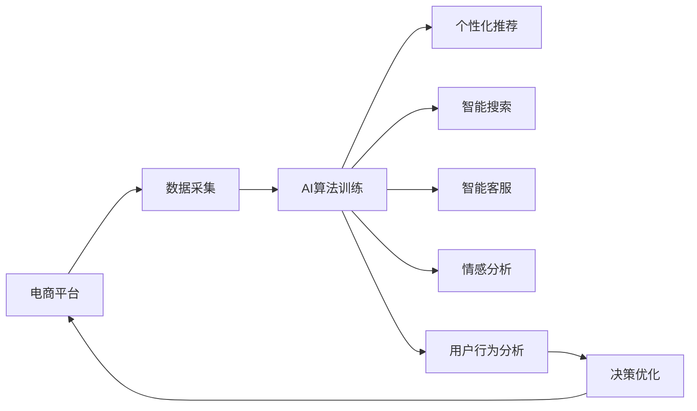

                 

# AI提升电商用户体验的多种方法

在数字化转型的大背景下，电子商务行业迎来了前所未有的发展机遇，同时也面临着用户需求日益复杂、市场竞争愈发激烈的挑战。如何通过技术手段，提升用户体验，成为电商企业关注的焦点。人工智能技术的突破性进展，为解决这一问题提供了重要契机。本文将系统梳理AI提升电商用户体验的多种方法，旨在为企业提供全面、实用的技术参考。

## 1. 背景介绍

随着电子商务的快速发展，用户行为模式、需求偏好正在不断演变。传统电商网站、APP虽已积累了大量用户数据，但缺乏有效的数据驱动分析手段，难以快速响应市场变化，满足用户个性化需求。为此，电商平台开始探索引入人工智能技术，实现智能化升级，提升用户体验。

本节将回顾电商行业对AI的需求背景，阐述引入AI的必要性和可行性，明确AI对电商用户体验提升的潜力。具体而言，包括以下几个方面：

1. **用户体验需求变化**：电商用户对商品推荐、搜索、支付、客服等环节的智能化、个性化需求日益增长，传统电商服务已无法完全满足。
2. **数据资源积累**：电商平台拥有大量用户行为数据，如点击、浏览、购买记录等，是AI算法训练和优化的重要数据来源。
3. **技术基础成熟**：深度学习、自然语言处理、计算机视觉等AI技术已取得显著进展，具备大规模应用的基础。
4. **竞争压力驱动**：传统电商巨头纷纷布局AI技术，新兴电商平台为后来者，必须通过AI提升服务质量，保持竞争力。

## 2. 核心概念与联系

在介绍AI提升电商用户体验的具体方法前，有必要先概述一些核心概念及其之间的联系。

### 2.1 核心概念概述

- **人工智能(AI)**：通过模拟人类智能，实现语音识别、图像识别、自然语言处理等任务的技术集合。
- **机器学习(ML)**：AI技术的一种，通过数据训练模型，实现预测、分类、聚类等任务。
- **深度学习(DL)**：ML技术的一种，使用深层神经网络进行学习和推理。
- **自然语言处理(NLP)**：AI技术的一种，用于处理和分析人类语言，如文本分类、情感分析、机器翻译等。
- **计算机视觉(CV)**：AI技术的一种，用于处理和分析视觉信息，如图像识别、目标检测等。
- **推荐系统(Recommender System)**：AI技术在电商领域的重要应用，通过个性化推荐商品、活动，提升用户体验。
- **语音助手(VA)**：AI技术在电商客服中的应用，用于处理用户语音指令，提供自动化服务。
- **情感分析(Affective Analysis)**：NLP技术的一种，用于分析用户情感倾向，调整服务策略。

### 2.2 核心概念原理和架构的 Mermaid 流程图



## 3. 核心算法原理 & 具体操作步骤

### 3.1 算法原理概述

AI提升电商用户体验的核心在于通过智能技术，优化电商的各个业务环节，使其更加贴合用户需求。主要包括以下几个方面：

- **个性化推荐系统**：通过分析用户行为和偏好，为用户推荐相关商品、活动。
- **智能搜索系统**：利用自然语言处理技术，理解用户查询，提供精准搜索结果。
- **智能客服系统**：使用语音助手和情感分析技术，实现自动化客服，提升用户体验。
- **用户行为分析系统**：通过数据分析和机器学习，预测用户行为，优化电商策略。

这些AI技术在电商中的应用，共同构建了一个以用户为中心、智能化的电商平台，显著提升了用户体验。

### 3.2 算法步骤详解

以下以**个性化推荐系统**为例，详细介绍其原理和操作步骤。

#### 3.2.1 算法原理概述

个性化推荐系统基于用户行为数据，构建用户画像，通过预测模型推荐用户可能感兴趣的物品。其核心算法包括协同过滤、基于内容的推荐、矩阵分解等。

#### 3.2.2 算法步骤详解

1. **数据准备**
   - 收集用户行为数据，如浏览、点击、购买记录等。
   - 整理数据，生成用户画像和物品画像。

2. **模型训练**
   - 选择推荐算法，如协同过滤、基于内容的推荐等。
   - 使用用户画像和物品画像进行模型训练。

3. **模型评估**
   - 在验证集上进行模型评估，选择最优模型。
   - 使用AUC、RMSE等指标评估模型效果。

4. **实时推荐**
   - 将训练好的模型部署到电商平台上，实时生成推荐结果。
   - 根据用户实时行为数据，动态调整推荐内容。

### 3.3 算法优缺点

#### 3.3.1 优点

- **提升用户体验**：个性化推荐、智能搜索等AI技术，大幅提升了用户购物体验，减少了选择成本。
- **提高转化率**：精准推荐提高了用户购买意愿，显著提高了电商平台的转化率。
- **数据驱动决策**：基于数据分析的推荐系统，使得电商企业能够更加科学、合理地制定营销策略。

#### 3.3.2 缺点

- **数据隐私风险**：收集和分析用户数据，可能侵犯用户隐私。
- **算法偏见**：推荐系统可能存在偏见，导致部分用户被忽视。
- **冷启动问题**：新用户缺乏足够历史数据，导致推荐效果不佳。

### 3.4 算法应用领域

AI提升电商用户体验的方法，主要应用于以下几个领域：

1. **个性化推荐系统**：广泛应用于商品推荐、广告推荐、活动推荐等场景。
2. **智能搜索系统**：帮助用户快速找到所需商品，提升搜索效率和准确性。
3. **智能客服系统**：通过语音助手和情感分析，实现自动化客服，减少人工干预。
4. **用户行为分析系统**：分析用户行为，预测用户需求，优化电商策略。
5. **视觉识别系统**：通过图像识别技术，提高商品搜索、分类等功能的准确性。

## 4. 数学模型和公式 & 详细讲解

### 4.1 数学模型构建

以**协同过滤推荐算法**为例，构建推荐系统的数学模型。

假设用户集合为 $U$，物品集合为 $I$，用户对物品的评分矩阵为 $R \in \mathbb{R}^{m \times n}$，其中 $m$ 为用户数，$n$ 为物品数。用户 $u$ 对物品 $i$ 的评分记为 $r_{ui}$。

协同过滤推荐算法的目标是为每个用户 $u$ 推荐 $k$ 个物品 $i_1,i_2,...,i_k$，使得评分矩阵 $R$ 的预测值 $r_{ui_1}, r_{ui_2},...,r_{ui_k}$ 与真实评分尽可能接近。

### 4.2 公式推导过程

假设用户 $u$ 对物品 $i$ 的评分预测值由物品 $i$ 的邻居评分加权求和得到：

$$
\hat{r}_{ui} = \frac{\sum_{j \in \mathcal{N}_i} a_{uj} \cdot r_{ji}}{\sum_{j \in \mathcal{N}_i} a_{uj}}
$$

其中，$\mathcal{N}_i$ 为物品 $i$ 的邻居集合，$a_{uj}$ 为物品 $j$ 对物品 $i$ 的影响权重。

通过最大化 $r_{ui}$ 和 $\hat{r}_{ui}$ 的差异，可以使用矩阵分解的方法求解预测评分：

$$
\hat{R} = \mathcal{P}(R)
$$

其中，$\mathcal{P}$ 为矩阵分解函数，$\hat{R}$ 为预测评分矩阵。常用的矩阵分解方法包括奇异值分解(SVD)、低秩矩阵分解(LRMF)等。

### 4.3 案例分析与讲解

以**基于内容的推荐算法**为例，分析其原理和应用场景。

假设用户对物品的评分由物品的属性向量 $w_i$ 和用户偏好向量 $v_u$ 的内积决定：

$$
r_{ui} = v_u \cdot w_i
$$

其中，$w_i$ 为物品 $i$ 的属性向量，$v_u$ 为用户 $u$ 的偏好向量。属性向量可以通过物品的标签、描述等信息获得。

在推荐系统中，可以通过向量内积计算用户对物品的评分预测值，并选择合适的权重进行推荐。例如，可以使用余弦相似度计算物品间的相似性，选择与用户偏好相似的物品进行推荐。

## 5. 项目实践：代码实例和详细解释说明

### 5.1 开发环境搭建

要实现AI在电商中的应用，需要搭建相应的开发环境。以下是基于Python的开发环境配置流程：

1. **安装Python**：选择Python 3.8及以上版本，从官网下载并安装。

2. **配置虚拟环境**：使用虚拟环境管理工具，如Anaconda、Pyenv等，创建独立的环境。

3. **安装必要的库**：
   - **深度学习库**：如TensorFlow、PyTorch等。
   - **自然语言处理库**：如NLTK、SpaCy等。
   - **数据处理库**：如Pandas、NumPy等。
   - **推荐系统库**：如Surprise、LightFM等。

4. **设置代码编辑器**：如VSCode、PyCharm等，方便代码编写和调试。

### 5.2 源代码详细实现

以**基于协同过滤的推荐系统**为例，展示推荐系统的代码实现。

```python
import pandas as pd
from surprise import Dataset, Reader, KNNBasic
from surprise.model_selection import cross_validate

# 准备数据集
reader = Reader(rating_scale=(1, 5))
data = Dataset.load_from_df(df[['user_id', 'item_id', 'rating']], reader)

# 使用KNN基本算法进行推荐
knn = KNNBasic(k=10, sim_options={'name': 'pearson_baseline', 'user_based': True})
results = cross_validate(knn, data, measures=['RMSE', 'MAE'], cv=5, verbose=False)

# 输出结果
print(results)
```

### 5.3 代码解读与分析

**数据准备**：
- 使用Pandas库读取用户行为数据，生成用户画像和物品画像。
- 使用Surprise库中的Reader类将数据集转换为推荐系统的格式。

**模型训练**：
- 使用Surprise库中的KNNBasic算法进行模型训练。
- 设置参数 $k$ 为推荐物品数量，使用Pearson算法进行用户基线相似度计算。

**模型评估**：
- 使用cross_validate函数在验证集上进行模型评估，选择RMSE和MAE作为评估指标。
- 输出评估结果，评估模型的预测精度。

### 5.4 运行结果展示

运行上述代码，可以得到推荐系统的交叉验证结果，包括RMSE和MAE值。这些指标反映了模型的预测精度和鲁棒性。

## 6. 实际应用场景

### 6.1 智能搜索系统

智能搜索系统是提升电商用户体验的重要手段。用户通过输入关键词或语音指令，系统能够实时返回精准的搜索结果。

#### 6.1.1 算法原理概述

智能搜索系统通过自然语言处理技术，解析用户查询，理解用户意图。常见的算法包括TF-IDF、BM25、BERT等。

#### 6.1.2 算法步骤详解

1. **数据预处理**：收集用户查询和搜索结果，构建查询-文档矩阵。
2. **模型训练**：使用TF-IDF、BM25等算法训练查询匹配模型。
3. **实时搜索**：接收用户查询，实时计算匹配得分，返回相关搜索结果。

### 6.2 智能客服系统

智能客服系统通过语音助手和情感分析，实现自动化客服，大幅提升客服效率和用户体验。

#### 6.2.1 算法原理概述

智能客服系统通过语音识别技术，将用户语音转换成文本，再使用情感分析技术理解用户情感，提供个性化回复。

#### 6.2.2 算法步骤详解

1. **语音识别**：使用语音识别库，将用户语音转换成文本。
2. **情感分析**：使用情感分析模型，判断用户情感倾向，生成情感标签。
3. **自动化回复**：根据情感标签和问题内容，生成自动化回复。

### 6.3 用户行为分析系统

用户行为分析系统通过分析用户行为数据，预测用户需求，优化电商策略。

#### 6.3.1 算法原理概述

用户行为分析系统通过机器学习技术，预测用户行为，如购买概率、退货率等。常见的算法包括回归、分类等。

#### 6.3.2 算法步骤详解

1. **数据收集**：收集用户行为数据，如点击、浏览、购买记录等。
2. **特征工程**：提取特征，如用户停留时间、点击深度等。
3. **模型训练**：使用回归或分类算法训练预测模型。
4. **结果应用**：根据预测结果，优化电商策略，如商品推荐、广告投放等。

## 7. 工具和资源推荐

### 7.1 学习资源推荐

以下是推荐的AI学习资源，帮助你全面掌握相关知识：

1. **在线课程**：如Coursera、Udacity等平台上的AI和NLP课程。
2. **开源项目**：如TensorFlow、PyTorch等框架的官方文档和示例代码。
3. **书籍**：如《深度学习》、《自然语言处理综述》等经典书籍。
4. **论文集**：如NIPS、ICML等顶级会议的论文集。
5. **社区论坛**：如GitHub、Stack Overflow等，及时获取技术更新和社区支持。

### 7.2 开发工具推荐

以下是推荐的AI开发工具，帮助你高效实现电商中的AI应用：

1. **深度学习框架**：如TensorFlow、PyTorch、Keras等。
2. **自然语言处理工具**：如NLTK、SpaCy、Gensim等。
3. **推荐系统库**：如Surprise、LightFM、TensorRec等。
4. **数据处理工具**：如Pandas、NumPy、Scikit-Learn等。
5. **模型可视化工具**：如TensorBoard、Weights & Biases等。

### 7.3 相关论文推荐

以下是推荐的AI相关论文，帮助你深入理解相关技术：

1. **深度学习基础**：如《深度学习》、《深度学习入门》等。
2. **自然语言处理**：如BERT、GPT、T5等模型相关论文。
3. **推荐系统**：如协同过滤、基于内容的推荐算法等。
4. **智能搜索**：如TF-IDF、BM25等算法。
5. **情感分析**：如情感词典、情感分类模型等。

## 8. 总结：未来发展趋势与挑战

### 8.1 总结

本文系统梳理了AI提升电商用户体验的多种方法，包括个性化推荐、智能搜索、智能客服等，详细介绍了其原理和操作步骤。通过对这些方法的学习，电商平台可以更好地满足用户需求，提升用户体验。

### 8.2 未来发展趋势

展望未来，AI提升电商用户体验将呈现以下发展趋势：

1. **技术融合加速**：AI技术与其他技术的融合将更加深入，如与区块链、IoT等技术结合，提升电商系统的安全性和智能化水平。
2. **个性化服务深化**：基于用户数据的深度分析和建模，实现更精准、个性化的推荐和服务。
3. **多模态信息融合**：结合视觉、语音、文本等多模态信息，提供更丰富、全面的电商体验。
4. **用户隐私保护加强**：采用联邦学习、差分隐私等技术，保护用户隐私，增强数据安全。
5. **实时性要求提升**：电商应用对AI系统的实时性要求不断提高，推动技术优化和算法改进。
6. **跨领域应用拓展**：AI技术在电商以外的领域，如医疗、金融、制造等，将获得更广泛的应用，拓展电商AI应用的边界。

### 8.3 面临的挑战

尽管AI技术在电商中的应用前景广阔，但也面临诸多挑战：

1. **数据隐私和安全**：电商平台需要处理大量用户数据，如何保护用户隐私，防止数据泄露，是一大挑战。
2. **模型公平性和透明性**：推荐系统等AI模型可能存在偏见，如何确保模型公平性，增强可解释性，是一个重要问题。
3. **计算资源需求高**：大规模深度学习模型和高并发的实时推荐系统，对计算资源提出了高要求。
4. **用户适应性**：AI系统的广泛应用可能导致用户依赖性增强，如何避免AI系统的误导和滥用，仍需关注。
5. **跨领域融合难度**：不同领域的AI技术往往具有不同的特点和要求，如何实现跨领域的有效融合，是一个复杂的技术难题。

### 8.4 研究展望

未来，电商AI技术的研究需要关注以下几个方向：

1. **数据隐私保护**：开发更高效的数据保护技术，确保用户隐私安全。
2. **模型公平性研究**：深入研究AI模型公平性问题，开发公平性评估工具和方法。
3. **跨领域融合技术**：研究跨领域的AI应用技术，提升AI系统的通用性和适应性。
4. **用户适应性研究**：研究用户对AI系统的适应性和接受度，制定合理的AI应用策略。
5. **实时性和可解释性**：提高AI系统的实时性和可解释性，提升用户体验和信任度。

## 9. 附录：常见问题与解答

**Q1：电商平台上应用AI的主要优势是什么？**

A: 电商平台上应用AI的主要优势包括：
1. **提升用户体验**：通过个性化推荐、智能搜索等AI技术，提升用户购物体验，减少选择成本。
2. **提高转化率**：精准推荐提高了用户购买意愿，显著提高了电商平台的转化率。
3. **数据驱动决策**：基于数据分析的推荐系统，使得电商企业能够更加科学、合理地制定营销策略。

**Q2：在电商平台上实现AI应用需要哪些技术支持？**

A: 在电商平台上实现AI应用，需要以下技术支持：
1. **深度学习框架**：如TensorFlow、PyTorch等。
2. **自然语言处理库**：如NLTK、SpaCy等。
3. **推荐系统库**：如Surprise、LightFM等。
4. **数据处理工具**：如Pandas、NumPy、Scikit-Learn等。
5. **模型可视化工具**：如TensorBoard、Weights & Biases等。

**Q3：如何评估电商平台上AI推荐系统的性能？**

A: 电商平台上AI推荐系统的性能评估，可以从以下几个方面进行：
1. **准确率**：评估推荐系统推荐的物品是否与用户的真实需求相匹配。
2. **召回率**：评估推荐系统推荐的物品数量是否足够，是否遗漏了用户的潜在需求。
3. **覆盖率**：评估推荐系统推荐的物品类型是否多样，是否覆盖了用户的多样化需求。
4. **实时性**：评估推荐系统的响应速度，是否能够在用户点击时快速返回推荐结果。
5. **可解释性**：评估推荐系统的可解释性，用户是否能够理解推荐结果的生成逻辑。

**Q4：电商平台上AI应用面临的主要挑战是什么？**

A: 电商平台上AI应用面临的主要挑战包括：
1. **数据隐私和安全**：电商平台需要处理大量用户数据，如何保护用户隐私，防止数据泄露。
2. **模型公平性和透明性**：推荐系统等AI模型可能存在偏见，如何确保模型公平性，增强可解释性。
3. **计算资源需求高**：大规模深度学习模型和高并发的实时推荐系统，对计算资源提出了高要求。
4. **用户适应性**：AI系统的广泛应用可能导致用户依赖性增强，如何避免AI系统的误导和滥用。
5. **跨领域融合难度**：不同领域的AI技术往往具有不同的特点和要求，如何实现跨领域的有效融合。

**Q5：如何在电商平台上实现AI应用的可持续性？**

A: 在电商平台上实现AI应用的可持续性，可以从以下几个方面进行：
1. **数据治理**：建立完善的数据治理体系，确保数据的质量和安全性。
2. **算法透明**：提高AI算法的透明性，确保算法的公平性和可解释性。
3. **技术优化**：持续优化AI系统，提升算法的效率和准确性，降低计算成本。
4. **用户教育**：加强用户对AI技术的认知，提升用户对AI系统的信任度和接受度。
5. **跨领域合作**：与各领域的专家合作，提升AI技术的跨领域融合能力。

---

作者：禅与计算机程序设计艺术 / Zen and the Art of Computer Programming

