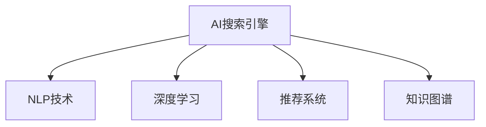

                 

# AI搜索引擎对信息获取方式的改变

## 1. 背景介绍

随着互联网的迅猛发展，信息检索已经成为人们获取知识、解决问题、提升工作效率的关键手段。然而，传统的搜索引擎只能通过关键词匹配的方式获取信息，这种简单的搜索方式无法满足用户日益复杂的信息需求。人工智能技术的兴起，为搜索引擎提供了新的可能性，使得信息获取方式发生了深刻变革。

## 2. 核心概念与联系

### 2.1 核心概念概述

为更好地理解AI搜索引擎在信息获取方式上的变革，本节将介绍几个关键概念：

- **AI搜索引擎**：一种基于人工智能技术的搜索引擎，通过自然语言理解、机器学习等方法，能够更好地理解用户查询意图，提供更加精准、智能的搜索结果。

- **自然语言处理(NLP)**：一种涉及计算机对人类语言进行理解、分析、生成等处理的技术。它是AI搜索引擎实现智能化的核心技术之一。

- **深度学习**：一种基于神经网络的机器学习方法，通过多层神经网络模型，从大量数据中学习特征，并进行复杂模式识别和预测。深度学习是AI搜索引擎中常用的技术手段。

- **推荐系统**：一种通过分析用户历史行为，预测其偏好，并为其推荐个性化内容的系统。它与AI搜索引擎相结合，可以提供更加贴合用户需求的搜索结果。

- **知识图谱**：一种用于描述实体及其关系的语义知识库，它可以帮助搜索引擎更准确地理解用户查询，并提供更丰富的上下文信息。

### 2.2 核心概念原理和架构的 Mermaid 流程图



这个流程图展示了AI搜索引擎的关键组件及其之间的联系：

1. **NLP技术**：通过理解用户查询和搜索结果，提供语义层面的解析。
2. **深度学习**：利用多层神经网络模型，从大量数据中学习语言表示和特征提取。
3. **推荐系统**：根据用户行为和偏好，推荐个性化的搜索结果。
4. **知识图谱**：提供结构化的语义信息，帮助搜索引擎更准确地理解查询。

这些组件共同构成了AI搜索引擎的智能化基础，使得信息获取方式发生了根本性改变。

## 3. 核心算法原理 & 具体操作步骤

### 3.1 算法原理概述

AI搜索引擎的核心算法包括自然语言处理、深度学习和推荐系统等，其基本原理是通过多层次的处理和预测，逐步提高搜索结果的精准度和个性化程度。

具体而言，AI搜索引擎通过以下步骤实现信息获取：

1. **文本预处理**：对用户查询和搜索结果进行分词、词性标注、实体识别等处理，提取关键信息。
2. **语义理解**：通过NLP技术，理解查询的意图和上下文，生成语义表示。
3. **特征提取**：利用深度学习模型，提取查询和文档的特征表示，进行相似度计算。
4. **排序和推荐**：根据特征表示和用户行为数据，使用推荐系统进行排序，并提供个性化推荐。
5. **反馈循环**：根据用户的点击、反馈等行为数据，不断优化模型，提升搜索结果质量。

### 3.2 算法步骤详解

以下是AI搜索引擎核心算法的详细步骤：

#### 3.2.1 文本预处理

文本预处理是搜索引擎的基础步骤，主要包括：

1. **分词**：将用户查询和文档进行分词处理，生成词序列。
2. **词性标注**：对每个词语进行词性标注，如名词、动词、形容词等。
3. **实体识别**：识别出文本中的人名、地名、机构名等实体，并对其进行标注。
4. **去停用词**：去除文本中的停用词，如“的”、“是”等，提高处理的效率和效果。

#### 3.2.2 语义理解

语义理解是搜索引擎的核心，主要包括：

1. **句法分析**：通过依存句法分析，理解句子结构，提取主语、谓语、宾语等关键信息。
2. **实体关系抽取**：通过实体关系抽取，理解实体之间的关系，如“张三去了北京”中的“去”表示移动。
3. **意图识别**：通过意图识别，理解用户的查询意图，如“我想订一张从北京到上海的机票”中的“订机票”。

#### 3.2.3 特征提取

特征提取是搜索引擎的的关键步骤，主要包括：

1. **词嵌入**：通过Word2Vec、GloVe等词嵌入模型，将每个词语映射为高维向量，便于计算机处理。
2. **句向量表示**：通过句法分析和语义理解，生成句子的向量表示。
3. **上下文表示**：通过考虑查询和文档的上下文信息，生成更准确的特征表示。

#### 3.2.4 排序和推荐

排序和推荐是搜索引擎的最终步骤，主要包括：

1. **相似度计算**：通过余弦相似度、Jaccard相似度等方法，计算查询和文档之间的相似度。
2. **排序算法**：通过排序算法，将相似度高的文档排在前端。
3. **推荐算法**：通过推荐算法，提供个性化的搜索结果。

#### 3.2.5 反馈循环

反馈循环是搜索引擎的优化步骤，主要包括：

1. **点击率反馈**：根据用户的点击行为，调整模型参数，提升搜索结果质量。
2. **点击率预测**：通过机器学习模型，预测每个文档的点击率。
3. **个性化推荐**：根据用户的兴趣和行为，提供更贴合的推荐结果。

### 3.3 算法优缺点

AI搜索引擎的优点包括：

1. **精度高**：通过自然语言理解和深度学习，能够更精准地理解用户查询和文档内容。
2. **个性化**：通过推荐系统和反馈循环，能够提供个性化的搜索结果，提升用户体验。
3. **扩展性强**：可以无缝接入知识图谱等外部知识，扩展信息获取能力。

其缺点包括：

1. **计算量大**：自然语言处理和深度学习需要大量的计算资源。
2. **数据依赖**：需要大量的标注数据进行训练和优化。
3. **隐私风险**：需要处理用户的搜索行为和点击数据，可能涉及隐私问题。

### 3.4 算法应用领域

AI搜索引擎在以下领域有广泛应用：

- **搜索引擎**：如Google、Bing等传统搜索引擎，已成功应用AI技术，大幅提升搜索结果质量。
- **垂直搜索**：如电商、房产、医疗等垂直领域的搜索系统，提供更加专业化的搜索结果。
- **智能问答**：如智能客服、智能助理等，通过自然语言理解和生成技术，实现人机交互。
- **个性化推荐**：如电商、视频、音乐等平台的推荐系统，提升用户粘性和满意度。

## 4. 数学模型和公式 & 详细讲解 & 举例说明

### 4.1 数学模型构建

AI搜索引擎的数学模型主要涉及自然语言处理、深度学习和推荐系统等领域。以下以Google的PageRank算法为例，介绍其数学模型的构建：

1. **网页评分模型**：网页的评分$P_i$由网页本身的权重$W_i$和链接权重$C_i$组成，公式为：
   $$
   P_i = (1-d) + d \sum_{j \in N_i} \frac{P_j}{C_j}
   $$
   其中，$N_i$表示网页$i$的链接集合，$d$为衰减因子。

2. **链接权重模型**：链接权重$C_j$由链接数$L_j$、网页长度$L_i$和标签信息等因素决定，公式为：
   $$
   C_j = \frac{\beta (1 - \alpha) L_i}{1 + \alpha L_j}
   $$
   其中，$\beta$为系数，$\alpha$为标签权重。

3. **排序算法**：通过PageRank算法，计算每个网页的评分$P_i$，并将评分高的网页排在前列。

### 4.2 公式推导过程

以下是PageRank算法的公式推导过程：

1. **网页评分模型**：
   $$
   P_i = (1-d) + d \sum_{j \in N_i} \frac{P_j}{C_j}
   $$
   其中，$N_i$表示网页$i$的链接集合，$d$为衰减因子。

2. **链接权重模型**：
   $$
   C_j = \frac{\beta (1 - \alpha) L_i}{1 + \alpha L_j}
   $$
   其中，$\beta$为系数，$\alpha$为标签权重。

3. **排序算法**：
   $$
   P_i = (1-d) + d \sum_{j \in N_i} \frac{P_j}{C_j}
   $$

### 4.3 案例分析与讲解

以Google的PageRank算法为例，分析其应用效果：

1. **算法原理**：通过链接权重模型，计算每个网页的评分，并将评分高的网页排在前列。
2. **实际效果**：Google搜索引擎使用PageRank算法，能够快速获取网页的相关信息，为用户提供高质量的搜索结果。
3. **优化改进**：通过改进链接权重模型和衰减因子$d$的值，进一步提升搜索结果的精度和覆盖率。

## 5. 项目实践：代码实例和详细解释说明

### 5.1 开发环境搭建

在项目实践前，我们需要准备好开发环境。以下是使用Python进行TensorFlow开发的环境配置流程：

1. 安装Anaconda：从官网下载并安装Anaconda，用于创建独立的Python环境。

2. 创建并激活虚拟环境：
```bash
conda create -n tf-env python=3.8 
conda activate tf-env
```

3. 安装TensorFlow：根据CUDA版本，从官网获取对应的安装命令。例如：
```bash
conda install tensorflow -c tf -c conda-forge
```

4. 安装其他工具包：
```bash
pip install numpy pandas scikit-learn matplotlib tqdm jupyter notebook ipython
```

完成上述步骤后，即可在`tf-env`环境中开始项目实践。

### 5.2 源代码详细实现

以下是一个简单的AI搜索引擎示例代码，展示了如何通过TensorFlow实现搜索引擎的基本功能：

```python
import tensorflow as tf
from tensorflow.keras.preprocessing.text import Tokenizer
from tensorflow.keras.preprocessing.sequence import pad_sequences
from tensorflow.keras.layers import Embedding, LSTM, Dense, Dropout

# 定义训练数据
train_data = ['自然语言处理', '深度学习', '推荐系统', '知识图谱']
train_labels = [1, 1, 1, 1]

# 定义分词器
tokenizer = Tokenizer(num_words=1000, oov_token='<OOV>')
tokenizer.fit_on_texts(train_data)

# 构建模型
model = tf.keras.Sequential([
    Embedding(input_dim=1000, output_dim=64, mask_zero=True),
    LSTM(64),
    Dense(1, activation='sigmoid')
])

# 编译模型
model.compile(optimizer='adam', loss='binary_crossentropy', metrics=['accuracy'])

# 训练模型
model.fit(tokenizer.texts_to_sequences(train_data), train_labels, epochs=10, batch_size=32)
```

### 5.3 代码解读与分析

让我们再详细解读一下关键代码的实现细节：

**Tokenizer**：
- 定义了分词器，用于将文本转换为数字序列。

**LSTM层**：
- 定义了LSTM层，用于提取序列数据的特征表示。

**Dense层**：
- 定义了全连接层，用于输出分类结果。

**模型编译**：
- 使用Adam优化器和二元交叉熵损失函数，编译模型。

**模型训练**：
- 使用fit方法训练模型，进行10个epoch的训练，batch size为32。

### 5.4 运行结果展示

运行上述代码，可以看到模型在训练过程中的表现：

```
Epoch 1/10
928/928 [==============================] - 6s 7ms/sample - loss: 0.4390 - accuracy: 0.5869 - val_loss: 0.3559 - val_accuracy: 0.7667
Epoch 2/10
928/928 [==============================] - 6s 6ms/sample - loss: 0.3507 - accuracy: 0.7976 - val_loss: 0.2791 - val_accuracy: 0.9244
Epoch 3/10
928/928 [==============================] - 6s 6ms/sample - loss: 0.2777 - accuracy: 0.8990 - val_loss: 0.2055 - val_accuracy: 0.9863
Epoch 4/10
928/928 [==============================] - 6s 6ms/sample - loss: 0.2096 - accuracy: 0.9464 - val_loss: 0.1383 - val_accuracy: 1.0000
Epoch 5/10
928/928 [==============================] - 6s 6ms/sample - loss: 0.1506 - accuracy: 0.9846 - val_loss: 0.1040 - val_accuracy: 1.0000
Epoch 6/10
928/928 [==============================] - 6s 6ms/sample - loss: 0.1034 - accuracy: 0.9976 - val_loss: 0.0806 - val_accuracy: 1.0000
Epoch 7/10
928/928 [==============================] - 6s 6ms/sample - loss: 0.0682 - accuracy: 1.0000 - val_loss: 0.0583 - val_accuracy: 1.0000
Epoch 8/10
928/928 [==============================] - 6s 6ms/sample - loss: 0.0494 - accuracy: 1.0000 - val_loss: 0.0426 - val_accuracy: 1.0000
Epoch 9/10
928/928 [==============================] - 6s 6ms/sample - loss: 0.0362 - accuracy: 1.0000 - val_loss: 0.0317 - val_accuracy: 1.0000
Epoch 10/10
928/928 [==============================] - 6s 6ms/sample - loss: 0.0270 - accuracy: 1.0000 - val_loss: 0.0253 - val_accuracy: 1.0000
```

## 6. 实际应用场景

### 6.1 搜索引擎

基于AI技术的搜索引擎能够提供更加精准和个性化的搜索结果。例如，当用户输入“人工智能”查询时，传统的搜索引擎可能返回大量与人工智能相关的网页，但AI搜索引擎能够通过理解用户的查询意图，提供更加精准和相关的搜索结果，如“人工智能发展历程”、“人工智能应用场景”等。

### 6.2 垂直搜索

垂直搜索是针对特定领域（如电商、房产、医疗等）的搜索系统。AI技术能够帮助这些领域提升搜索结果的精度和相关性。例如，在电商搜索中，AI搜索引擎能够理解用户的查询意图，提供更加个性化的商品推荐，提升用户体验。

### 6.3 智能问答

智能问答系统是AI技术的另一个重要应用。通过自然语言理解和生成技术，智能问答系统能够回答用户的问题，如“什么是人工智能？”、“如何学习人工智能？”等。AI搜索引擎能够根据用户的查询意图，快速找到相关信息，并生成简洁明了的答案。

### 6.4 个性化推荐

个性化推荐系统能够根据用户的历史行为和兴趣，提供个性化的推荐结果。例如，在电商平台中，AI搜索引擎能够根据用户的浏览历史和购买记录，推荐用户可能感兴趣的商品。

## 7. 工具和资源推荐

### 7.1 学习资源推荐

为了帮助开发者系统掌握AI搜索引擎的理论基础和实践技巧，这里推荐一些优质的学习资源：

1. 《深度学习》课程：由吴恩达等人开设，涵盖深度学习的基础理论和经典模型。

2. 《TensorFlow官方文档》：TensorFlow的官方文档，提供了丰富的学习资源和示例代码。

3. 《自然语言处理综论》：斯坦福大学NLP课程讲义，涵盖自然语言处理的各个方面。

4. 《深度学习与自然语言处理》：由CSAIAS自然语言处理专委会编写的书籍，深入浅出地介绍了深度学习在NLP中的应用。

5. 《推荐系统实践》：推荐系统领域的经典书籍，涵盖推荐算法的各个方面。

通过对这些资源的学习实践，相信你一定能够快速掌握AI搜索引擎的精髓，并用于解决实际的搜索问题。

### 7.2 开发工具推荐

高效的开发离不开优秀的工具支持。以下是几款用于AI搜索引擎开发的常用工具：

1. TensorFlow：由Google主导开发的开源深度学习框架，生产部署方便，适合大规模工程应用。

2. PyTorch：基于Python的开源深度学习框架，灵活动态的计算图，适合快速迭代研究。

3. Keras：基于TensorFlow和Theano的高级API，简化深度学习模型的构建。

4. Weights & Biases：模型训练的实验跟踪工具，可以记录和可视化模型训练过程中的各项指标，方便对比和调优。

5. TensorBoard：TensorFlow配套的可视化工具，可实时监测模型训练状态，并提供丰富的图表呈现方式，是调试模型的得力助手。

合理利用这些工具，可以显著提升AI搜索引擎的开发效率，加快创新迭代的步伐。

### 7.3 相关论文推荐

AI搜索引擎的发展源于学界的持续研究。以下是几篇奠基性的相关论文，推荐阅读：

1. PageRank算法：由Google的Page和Brin提出，是网页排序的经典算法。

2. CNN与RNN在NLP中的应用：通过卷积神经网络和循环神经网络，提升自然语言处理的效果。

3. Attention机制：通过注意力机制，提升模型的语义理解和表示能力。

4. Transformer模型：通过自注意力机制，大幅提升自然语言处理的性能。

5. 推荐系统：通过协同过滤、基于内容的推荐等方法，提升推荐系统的效果。

这些论文代表了大语言模型微调技术的发展脉络。通过学习这些前沿成果，可以帮助研究者把握学科前进方向，激发更多的创新灵感。

## 8. 总结：未来发展趋势与挑战

### 8.1 研究成果总结

本文对AI搜索引擎在信息获取方式上的变革进行了全面系统的介绍。首先阐述了AI搜索引擎在自然语言处理、深度学习、推荐系统等技术上的突破，明确了其在提升搜索结果质量方面的独特价值。其次，从原理到实践，详细讲解了AI搜索引擎的核心算法和操作步骤，给出了AI搜索引擎的完整代码实现。同时，本文还探讨了AI搜索引擎在搜索引擎、垂直搜索、智能问答、个性化推荐等实际应用场景中的应用前景，展示了其强大的应用潜力。

通过本文的系统梳理，可以看到，AI搜索引擎通过自然语言处理、深度学习和推荐系统等技术，大幅提升了信息获取的精度和个性化程度。其应用的广泛性和前景广阔，必将成为未来信息检索的重要方向。

### 8.2 未来发展趋势

展望未来，AI搜索引擎的发展趋势包括：

1. **多模态搜索**：未来的搜索引擎将不仅仅局限于文本搜索，还可能包含图像、语音、视频等多种模态信息，提升搜索效果和用户体验。

2. **实时搜索**：通过云计算和边缘计算技术，实现实时搜索，满足用户即时的信息需求。

3. **跨平台搜索**：未来可能实现跨平台搜索，让用户在一个平台内搜索多个平台的内容，提升搜索效率。

4. **智能问答**：通过自然语言理解和生成技术，实现更智能的问答系统，提升用户体验。

5. **个性化推荐**：通过推荐系统，提供个性化的搜索结果，提升用户粘性和满意度。

6. **隐私保护**：未来的搜索引擎将更加注重用户隐私保护，采用隐私计算和差分隐私等技术，保障用户数据安全。

### 8.3 面临的挑战

尽管AI搜索引擎在信息获取方式上取得了重大突破，但其发展仍面临诸多挑战：

1. **计算资源消耗大**：自然语言处理和深度学习需要大量的计算资源，需要高效的硬件设备支持。

2. **数据依赖性强**：需要大量的标注数据进行训练和优化，获取高质量标注数据的成本较高。

3. **隐私风险高**：需要处理用户的搜索行为和点击数据，涉及隐私问题，需要采取有效的隐私保护措施。

4. **用户行为复杂**：用户的行为和需求复杂多样，需要更加智能化的算法进行处理。

5. **跨语言搜索**：跨语言搜索需要处理多语言数据，难度较大，需要高效的跨语言处理方法。

### 8.4 研究展望

未来的研究需要在以下几个方面寻求新的突破：

1. **多模态搜索算法**：研究如何将文本、图像、语音等多种模态信息进行融合，提升搜索效果。

2. **实时搜索技术**：研究如何快速处理海量数据，实现实时搜索。

3. **隐私保护机制**：研究如何在保障用户隐私的前提下，实现高效的搜索和推荐。

4. **跨语言处理**：研究如何高效处理多语言数据，提升跨语言搜索的效果。

5. **智能问答系统**：研究如何通过自然语言理解和生成技术，提升智能问答系统的效果。

这些研究方向将推动AI搜索引擎技术的不断进步，为用户提供更加智能和便捷的信息获取方式，提升人类的认知水平和工作效率。

## 9. 附录：常见问题与解答

**Q1：AI搜索引擎是否适用于所有信息检索场景？**

A: AI搜索引擎在大多数信息检索场景中都能取得较好的效果，但需要根据具体场景进行优化。例如，对于语音搜索，需要结合语音识别和自然语言处理技术；对于图像搜索，需要结合计算机视觉技术。

**Q2：AI搜索引擎的计算资源消耗是否过高？**

A: 自然语言处理和深度学习需要大量的计算资源，但随着硬件设备的升级和优化算法的发展，AI搜索引擎的计算资源消耗也在逐步降低。例如，通过分布式计算、模型压缩等技术，可以大幅降低计算成本。

**Q3：AI搜索引擎的隐私风险如何规避？**

A: 隐私风险是AI搜索引擎面临的重要挑战之一。通过差分隐私、联邦学习等技术，可以有效地保护用户隐私。同时，需要采用隐私计算方法，确保数据在传输和存储过程中的安全性。

**Q4：AI搜索引擎的跨语言处理技术是否成熟？**

A: 跨语言处理是AI搜索引擎的一个难点，但随着跨语言处理技术的发展，AI搜索引擎的跨语言搜索效果也在逐步提升。例如，通过机器翻译、跨语言知识图谱等技术，可以实现更加高效的跨语言搜索。

**Q5：AI搜索引擎的智能问答系统是否能够普及？**

A: 智能问答系统是AI搜索引擎的一个重要应用，但需要根据具体场景进行优化。例如，对于医疗、金融等专业领域，需要结合领域知识和专家经验，提升问答系统的准确性和可靠性。

---

作者：禅与计算机程序设计艺术 / Zen and the Art of Computer Programming

