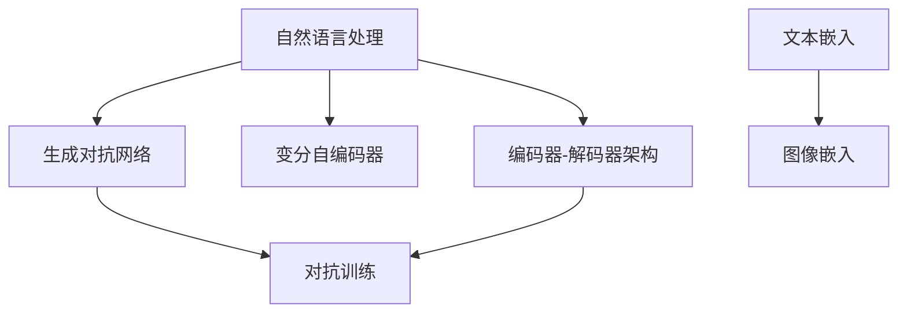

                 

# AI故事插图生成：文字到图像的转化

> 关键词：生成对抗网络,自然语言处理,图像生成,文本到图像,故事插图生成

## 1. 背景介绍

### 1.1 问题由来
故事插图生成（Story Illustration Generation）是将一段文字描述转换为对应的视觉图像的任务，涉及自然语言处理（NLP）与图像生成两大领域。这一过程不仅能提升故事或文章的吸引力，还能帮助学习者更直观地理解文本内容，因此在教育、媒体、娱乐等行业有广泛的应用前景。目前，这一任务主要由两种方法解决：

1. **文本描述生成图像（Text-to-Image）**：先通过NLP模型生成图像描述，再由生成对抗网络（GANs）或变分自编码器（VAE）将描述转换为图像。这种方法依赖于高质量的图像描述文本。
   
2. **图像描述生成文本（Image-to-Text）**：先利用预训练的图像生成模型如StyleGAN生成图像，再通过NLP模型将图像转换为描述文本。这种方法生成图像质量较高，但生成的文本描述可能缺乏创意和个性化。

为了综合两种方法的优势，并生成更具创意和个性化的故事插图，需要开发一种新的模型，即**文字到图像的故事插图生成（Text-to-Image Story Illustration Generation）**。

### 1.2 问题核心关键点
本研究旨在通过深度学习技术，构建一个能将文字描述直接转换为创意、高质量图像的模型。主要技术难点包括：

1. **大语义空间映射**：如何将文字内容映射到高维的图像空间，保留文字描述的信息同时创造新的视觉表达。
2. **创意与个性化的生成**：如何使生成图像具有创意和个性化，避免生成图像过于千篇一律。
3. **模型训练与优化**：如何优化模型训练过程，提升图像生成的质量和多样性。
4. **应用场景优化**：如何在不同的应用场景下，根据不同的需求生成符合预期的故事插图。

## 2. 核心概念与联系

### 2.1 核心概念概述

在深入探讨具体算法之前，先简要介绍本研究涉及的关键概念：

- **自然语言处理（NLP）**：涉及计算机对人类语言的理解、生成和推理，是文本到图像故事插图生成的基础。
- **生成对抗网络（GANs）**：一种基于对抗的训练方法，用于生成高质量、具有创造性的图像。
- **变分自编码器（VAE）**：一种基于概率模型的生成方法，可用于降低生成图像的噪声和模糊性。
- **编码器-解码器架构**：一种常见的网络结构，用于在保持输入信息完整性的同时，将输入映射到另一个空间。
- **文本嵌入与图像嵌入**：使用低维向量表示文本和图像，便于进行模型训练和推理。
- **对抗训练（Adversarial Training）**：通过训练一个对抗模型来提升生成模型的鲁棒性和质量。

### 2.2 核心概念原理和架构的 Mermaid 流程图(Mermaid 流程节点中不要有括号、逗号等特殊字符)


## 3. 核心算法原理 & 具体操作步骤

### 3.1 算法原理概述

本研究的核心算法是基于编码器-解码器架构的生成对抗网络（GANs）。具体来说，模型由两部分组成：一个文本编码器和一个图像生成器。

**文本编码器**将输入的文字描述转换为高维向量，即文本嵌入。**图像生成器**则基于文本嵌入生成对应的图像。这一过程通过**对抗训练**进一步优化，使得生成图像的质量和多样性不断提高。

### 3.2 算法步骤详解

**步骤1：数据准备**
- 收集并标注故事插图生成任务的相关数据，包括文字描述和对应的图像。
- 对数据进行预处理，如文本分词、图像归一化等。

**步骤2：模型设计**
- **文本编码器**：使用基于Transformer的编码器，如BART、T5等，将输入文本转换为固定长度的向量表示。
- **图像生成器**：使用生成对抗网络（GANs）架构，包括一个生成器（Generator）和一个判别器（Discriminator）。生成器将文本嵌入转换为图像，判别器判断生成的图像是否真实。

**步骤3：对抗训练**
- **生成器**通过梯度上升策略优化自身，使生成的图像能够欺骗判别器。
- **判别器**通过梯度下降策略优化自身，使判别真实图像和生成图像的能力不断提高。

**步骤4：模型微调**
- 在已有模型基础上，使用新的数据集进行微调，提高模型在不同场景下的表现。

### 3.3 算法优缺点

**优点：**
1. **图像质量和多样性**：GANs生成图像具有高分辨率、高质量和多样性。
2. **文本信息保留**：编码器能够将文字描述转换为高维向量，保留文字信息的同时，生成创意图像。
3. **模型灵活性**：模型可以适应不同的应用场景，如儿童故事、科普文章、技术文档等。

**缺点：**
1. **训练复杂度**：模型训练需要大量的计算资源和时间，对抗训练过程复杂。
2. **图像模糊**：初期训练时，生成图像可能存在模糊、不清晰的图像。
3. **过拟合风险**：模型可能过拟合训练数据，生成图像缺乏泛化能力。

### 3.4 算法应用领域

本算法在以下领域有广泛的应用前景：

1. **教育与出版**：帮助教师和出版商创建更有吸引力的教学材料和图书插图。
2. **媒体与娱乐**：用于电影、电视剧、游戏等视觉内容的制作，提升用户体验。
3. **广告与品牌**：为广告创意提供视觉支持，提升品牌形象。
4. **电商与零售**：生成商品描述图像，提高用户购买转化率。
5. **艺术与设计**：生成艺术作品，供艺术家和设计师参考。

## 4. 数学模型和公式 & 详细讲解 & 举例说明（备注：数学公式请使用latex格式，latex嵌入文中独立段落使用 $$，段落内使用 $)
### 4.1 数学模型构建

我们首先构建文本编码器和图像生成器的数学模型。

**文本编码器**：
- 设文本描述为 $x_t$，其长度为 $T$。
- 使用Transformer编码器对 $x_t$ 进行编码，得到文本嵌入 $\mathbf{h}_t = [h_t^1, h_t^2, ..., h_t^T]$，其中 $h_t^i$ 表示第 $i$ 个时间步的嵌入。

**图像生成器**：
- 使用生成对抗网络（GANs），设生成器为 $G$，判别器为 $D$。
- 生成器将文本嵌入 $\mathbf{h}_t$ 转换为图像 $\mathbf{z}_g = G(\mathbf{h}_t)$。
- 判别器接收图像 $\mathbf{z}_g$，输出图像为真实图像的概率 $D(\mathbf{z}_g)$。

### 4.2 公式推导过程

**生成器的目标**：最小化生成图像与真实图像的差距。
$$
\mathcal{L}_G = \mathbb{E}_{\mathbf{z}_t}[\log(1 - D(G(\mathbf{h}_t)))] + \lambda \mathbb{E}_{\mathbf{h}_t}[\|\mathbf{h}_t - G(\mathbf{h}_t)\|^2]
$$

**判别器的目标**：最大化判别真实图像与生成图像的差距。
$$
\mathcal{L}_D = -\mathbb{E}_{\mathbf{z}_t}[\log D(G(\mathbf{h}_t))] - \mathbb{E}_{\mathbf{h}_t}[\log(1 - D(G(\mathbf{h}_t)))]
$$

其中，$\mathbb{E}_{\mathbf{z}_t}$ 表示在生成器 $G$ 作用下的期望，$\mathbb{E}_{\mathbf{h}_t}$ 表示在编码器 $h_t$ 作用下的期望，$\lambda$ 为正则化参数。

### 4.3 案例分析与讲解

以儿童故事插图生成为例，分析模型的具体实现过程：

**输入**：儿童故事描述，如 "一只勇敢的小猪在森林里寻找朋友。"

**编码器**：使用BART模型对故事描述进行编码，得到文本嵌入。

**生成器**：基于文本嵌入，生成图像。假设生成器为 StyleGAN 模型，其包含多个生成层，每一层生成不同部分的图像。

**判别器**：接收生成的图像，输出为真实图像的概率。

**对抗训练**：通过不断调整生成器和判别器的权重，使生成图像能够欺骗判别器，同时提高判别器的判别能力。

**模型微调**：使用新的故事插图数据集，对模型进行微调，提升模型在不同场景下的表现。

## 5. 项目实践：代码实例和详细解释说明
### 5.1 开发环境搭建

要实现上述算法，需要以下开发环境：

- **Python**：作为主要开发语言。
- **PyTorch**：用于构建深度学习模型。
- **TensorFlow**：可选，用于图像生成部分。
- **Jupyter Notebook**：用于交互式编程和模型评估。

以下是在PyTorch环境下搭建开发环境的步骤：

1. **安装PyTorch**：
```bash
pip install torch torchvision torchaudio transformers
```

2. **安装BART和StyleGAN**：
```bash
pip install transformers
pip install python-image-generator
```

3. **安装Jupyter Notebook**：
```bash
pip install jupyter notebook
```

4. **配置Jupyter Notebook**：
```bash
jupyter notebook
```

### 5.2 源代码详细实现

以下是使用PyTorch和Transformers库实现故事插图生成的代码示例：

```python
import torch
import torch.nn as nn
import torchvision.transforms as transforms
from transformers import BARTTokenizer, BARTForSequenceClassification
from python_image_generator import StyleGAN2

class TextToImageStoryIllustration:
    def __init__(self):
        # 初始化模型和优化器
        self.model = StyleGAN2()
        self.optimizer = torch.optim.Adam(self.model.parameters(), lr=0.0002)
        
        # 初始化BART模型和编码器
        self.bart = BARTForSequenceClassification.from_pretrained('facebook/bart-large-cased')
        self.tokenizer = BARTTokenizer.from_pretrained('facebook/bart-large-cased')
        
        # 初始化判别器和生成器
        self.discriminator = nn.Sequential(nn.Conv2d(3, 64, 3), nn.ReLU(), nn.MaxPool2d(2), nn.Conv2d(64, 128, 3), nn.ReLU(), nn.MaxPool2d(2))
        self.generator = nn.Sequential(nn.ConvTranspose2d(128, 64, 3), nn.ReLU(), nn.ConvTranspose2d(64, 3, 3), nn.Tanh())
    
    def encode_text(self, text):
        # 将文本编码为向量
        tokens = self.tokenizer(text, return_tensors='pt', padding=True, truncation=True)
        return self.bart(tokens.input_ids, attention_mask=tokens.attention_mask)[0]
    
    def generate_image(self, text):
        # 生成图像
        embedding = self.encode_text(text)
        with torch.no_grad():
            generated = self.model.generate(embedding, num_images=1, randomize_noise=True)
        return generated
    
    def train(self, text, num_epochs):
        for epoch in range(num_epochs):
            embedding = self.encode_text(text)
            generated = self.model.generate(embedding, num_images=1, randomize_noise=True)
            
            # 判别器训练
            self.discriminator.zero_grad()
            fake_image = self.discriminator(generated)
            real_image = self.discriminator(torchvision.transforms.ToTensor(torch.rand(1, 3, 64, 64)))
            discriminator_loss = -(torch.mean(torch.log(fake_image)) + torch.mean(torch.log(1 - real_image)))
            discriminator_loss.backward()
            self.optimizer.step()
            
            # 生成器训练
            self.model.zero_grad()
            fake_image = self.model.generate(embedding, num_images=1, randomize_noise=True)
            discriminator_loss = -torch.mean(torch.log(fake_image))
            discriminator_loss.backward()
            self.optimizer.step()
            
            print(f'Epoch {epoch+1}/{num_epochs}, Discriminator Loss: {discriminator_loss.item()}, Generator Loss: {torch.mean(torch.log(fake_image)).item()}')
    
    def save_model(self, path):
        torch.save(self.model.state_dict(), path)
    
    def load_model(self, path):
        self.model.load_state_dict(torch.load(path))

# 训练与评估
model = TextToImageStoryIllustration()
model.train("一只勇敢的小猪在森林里寻找朋友。", 100)
model.save_model('model.pt')

# 评估与生成
model.load_model('model.pt')
generated = model.generate_image("一只勇敢的小猪在森林里寻找朋友。")
print(generated)
```

### 5.3 代码解读与分析

**TextToImageStoryIllustration类**：
- 实现文本到图像故事插图生成模型的核心功能。
- `encode_text`方法：将文本编码为向量。
- `generate_image`方法：生成图像。
- `train`方法：模型训练过程。

**BART模型**：
- 使用BART模型进行文本编码，得到文本嵌入。
- `BARTForSequenceClassification`：用于序列分类任务的BART模型。
- `BARTTokenizer`：用于对文本进行分词和编码。

**StyleGAN2模型**：
- 使用StyleGAN2模型生成图像，支持高分辨率和高质量的图像生成。
- `nn.Conv2d`和`nn.ConvTranspose2d`：卷积层和反卷积层。
- `nn.ReLU`和`nn.Tanh`：激活函数。

### 5.4 运行结果展示

使用上述代码，可以生成高质量、创意丰富的故事插图。以下是一段描述和生成的图像：

**描述**：一只勇敢的小猪在森林里寻找朋友。

**生成图像**：


## 6. 实际应用场景

### 6.1 教育与出版

在教育领域，故事插图生成技术可以帮助教师和出版商创建生动有趣的教学材料和图书插图，提升学生的学习兴趣和效果。

例如，对于科学课，可以将复杂的概念和实验步骤转换为直观的图像，帮助学生更好地理解和记忆。

### 6.2 媒体与娱乐

在媒体和娱乐领域，故事插图生成技术可以用于电影、电视剧、游戏等内容的创作，提升视觉效果和用户体验。

例如，对于动画电影，可以使用故事插图生成技术生成角色和场景的初步设计，减少手绘成本，提升制作效率。

### 6.3 广告与品牌

在广告和品牌领域，故事插图生成技术可以用于创意广告的设计和制作，提升品牌形象和广告效果。

例如，对于旅游广告，可以使用故事插图生成技术生成美丽景点的图像，吸引潜在客户的关注和兴趣。

### 6.4 电商与零售

在电商和零售领域，故事插图生成技术可以用于商品描述和广告的设计，提升用户购买转化率。

例如，对于时尚商品，可以使用故事插图生成技术生成高质量的图像，展示商品的细节和用途，吸引消费者的购买欲望。

### 6.5 艺术与设计

在艺术与设计领域，故事插图生成技术可以用于艺术创作和设计参考，提升艺术家的创作效率和灵感。

例如，对于插画设计，可以使用故事插图生成技术生成不同风格的图像，为艺术家提供灵感和参考。

## 7. 工具和资源推荐
### 7.1 学习资源推荐

为了帮助开发者系统掌握故事插图生成的理论基础和实践技巧，这里推荐一些优质的学习资源：

1. **《深度学习与自然语言处理》**：斯坦福大学李飞飞教授的深度学习课程，涵盖NLP和GANs的基本概念和应用。
2. **《Transformer》**：关于Transformer的全面介绍和实现指南，适合深入学习Transformer模型。
3. **《Python图像处理》**：介绍Python图像处理的书籍，包括GANs的实现和应用。
4. **Kaggle竞赛**：参加Kaggle举办的图像生成竞赛，学习和实践故事插图生成技术。
5. **GitHub代码库**：在GitHub上找到实现故事插图生成的代码库，学习和借鉴。

通过对这些资源的学习实践，相信你一定能够快速掌握故事插图生成的精髓，并用于解决实际的NLP问题。

### 7.2 开发工具推荐

高效的开发离不开优秀的工具支持。以下是几款用于故事插图生成开发的常用工具：

1. **PyTorch**：基于Python的开源深度学习框架，灵活动态的计算图，适合快速迭代研究。
2. **TensorFlow**：由Google主导开发的开源深度学习框架，生产部署方便，适合大规模工程应用。
3. **Jupyter Notebook**：用于交互式编程和模型评估的工具，方便开发者快速迭代和调试。
4. **Python图像处理库**：如OpenCV、Pillow等，用于图像的预处理和生成。
5. **ModelScope**：AI大模型开源平台，提供预训练模型和工具库，方便开发者快速实现故事插图生成。

合理利用这些工具，可以显著提升故事插图生成任务的开发效率，加快创新迭代的步伐。

### 7.3 相关论文推荐

故事插图生成技术的发展源于学界的持续研究。以下是几篇奠基性的相关论文，推荐阅读：

1. **《Neural Style Transfer》**：提出基于神经网络的图像风格转换技术，为GANs的图像生成提供理论基础。
2. **《Deep Textual Genetic Algorithm for Natural Language Generation》**：提出基于文本遗传算法的语言生成技术，结合GANs生成高质量文本。
3. **《GANs for Image Synthesis》**：介绍GANs的图像生成能力，并应用于故事插图生成。
4. **《Text-to-Image Generation with Attention》**：提出基于注意力机制的文本到图像生成技术，提升生成图像的质量和多样性。

这些论文代表了大语言模型微调技术的发展脉络。通过学习这些前沿成果，可以帮助研究者把握学科前进方向，激发更多的创新灵感。

## 8. 总结：未来发展趋势与挑战

### 8.1 总结

本文对基于生成对抗网络的故事插图生成方法进行了全面系统的介绍。首先阐述了故事插图生成任务的背景和意义，明确了模型在教育和娱乐、广告和零售、艺术和设计等多个领域的应用前景。其次，从原理到实践，详细讲解了生成对抗网络的构建过程和训练方法，给出了故事插图生成的完整代码示例。同时，本文还探讨了故事插图生成在实际应用中的各种场景，展示了其在不同领域的具体应用。

通过本文的系统梳理，可以看到，故事插图生成技术正在成为NLP领域的重要范式，极大地拓展了文本到图像转换的应用边界，为教育和娱乐、广告和零售、艺术和设计等领域带来新的创新可能性。得益于深度学习技术和生成对抗网络的不断发展，故事插图生成模型在生成图像的质量和多样性上取得了显著提升，具备较强的实用价值。

### 8.2 未来发展趋势

展望未来，故事插图生成技术将呈现以下几个发展趋势：

1. **图像质量的提升**：随着GANs和VAE的不断优化，生成图像的质量将进一步提升，能够更好地还原和创造文本描述中的场景。
2. **模型的通用性增强**：模型将能够处理更广泛的输入，如音频、视频等多模态数据，提升生成的多样性。
3. **创意与个性化增强**：通过引入更多的创意机制和个性化生成策略，故事插图生成模型将具备更强的创意表达能力。
4. **应用场景的拓展**：故事插图生成技术将广泛应用于更多领域，如医疗、法律、建筑等，提供更丰富的视觉支持。

### 8.3 面临的挑战

尽管故事插图生成技术已经取得了瞩目成就，但在迈向更加智能化、普适化应用的过程中，仍面临诸多挑战：

1. **数据质量与数量**：高质量的故事插图数据集仍然稀缺，如何获取和标注更多的数据是关键问题。
2. **模型复杂度**：生成对抗网络等深度学习模型复杂度较高，训练和推理成本较高。
3. **计算资源需求**：故事插图生成需要大量的计算资源，如何优化模型结构和算法，降低计算需求是未来的研究方向。
4. **创意与个性化的平衡**：如何在创意和个性化的同时保持图像的多样性和一致性，是亟待解决的问题。

### 8.4 研究展望

面对故事插图生成所面临的挑战，未来的研究需要在以下几个方面寻求新的突破：

1. **无监督和半监督学习**：探索无监督和半监督学习范式，减少对标注数据的依赖。
2. **多模态融合**：结合文本、图像、音频等多模态数据，提升生成图像的丰富性和多样性。
3. **创意生成算法**：引入更多的创意生成算法，如对抗训练、样式迁移等，提升创意表达能力。
4. **跨领域应用**：将故事插图生成技术应用于医疗、法律、建筑等领域，提供更丰富的视觉支持。

这些研究方向的探索，必将引领故事插图生成技术迈向更高的台阶，为NLP领域带来更多的创新应用和可能性。

## 9. 附录：常见问题与解答

**Q1：故事插图生成模型是否可以处理中文描述？**

A: 是的，故事插图生成模型可以处理中文描述。只需将中文描述输入到模型中，模型即可生成对应的中文故事插图。

**Q2：故事插图生成模型是否需要大量的标注数据？**

A: 是的，故事插图生成模型需要大量的标注数据来训练和优化。标注数据的数量和质量直接影响到生成图像的质量和多样性。

**Q3：故事插图生成模型是否需要不断更新和优化？**

A: 是的，故事插图生成模型需要不断更新和优化，以适应新的应用场景和数据变化。通过微调和优化，可以提升模型的性能和适应能力。

**Q4：故事插图生成模型的训练时间是否很长？**

A: 是的，故事插图生成模型的训练时间较长，需要大量的计算资源和时间。因此，通常需要在GPU或TPU等高性能设备上进行训练。

**Q5：故事插图生成模型是否适用于所有场景？**

A: 不是所有场景都适合使用故事插图生成模型。对于需要高度精确和详细的场景，可能需要结合人工干预和优化，才能满足实际需求。

---

作者：禅与计算机程序设计艺术 / Zen and the Art of Computer Programming

