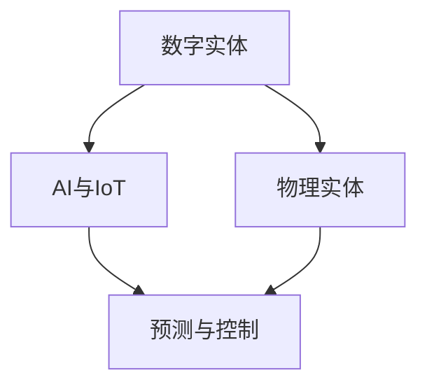

                 

# AI数字实体与物理实体的融合

## 1. 背景介绍

在信息时代，数字实体的涌现已成为推动社会进步、促进经济发展的重要驱动力。通过数字化的方式，我们可以捕捉、存储、处理和分析物理实体的数据，形成海量数字资产，进一步实现智能决策和精准运营。然而，数字实体与物理实体的融合，不仅仅是一个技术问题，更是一个涉及哲学、伦理和社会治理的深刻议题。本文将从技术、伦理和应用角度，探讨AI数字实体与物理实体的融合，旨在推动两者之间的深度融合，实现更高层次的智能化。

## 2. 核心概念与联系

### 2.1 核心概念概述

为了深入理解AI数字实体与物理实体的融合，我们首先需要明确几个核心概念：

- **数字实体**：指通过数字化手段形成的数据资产，包括但不限于自然语言、图像、音频、视频、传感器数据等。数字实体蕴含着物理实体的特征和行为信息，是AI认知和推理的基础。
- **物理实体**：指现实世界中的物体、环境和社会主体，如工厂、车辆、用户、气候等。物理实体的运行和交互，通过数字实体进行记录、分析和预测。
- **融合**：指将数字实体与物理实体进行深度整合，实现数据与模型的双向流动，提升智能决策和运营的精准度。
- **AI与IoT**：物联网（IoT）通过连接物理实体，收集数据，而AI则通过对这些数据的分析和学习，实现对物理实体的预测和控制。

这些概念之间的逻辑关系可以通过以下Mermaid流程图来展示：



此流程图展示了数字实体与物理实体的交互过程：

1. 数字实体通过传感器、摄像头等设备收集物理实体的数据。
2. AI与IoT技术将数字实体整合到模型中，进行预测和控制。
3. 预测结果反馈到物理实体，实现智能决策和优化。

## 3. 核心算法原理 & 具体操作步骤

### 3.1 算法原理概述

AI数字实体与物理实体的融合，主要依赖于以下算法原理：

- **数据采集与传输**：通过传感器、摄像头、RFID等技术，收集物理实体的状态和行为数据，并通过网络传输到云端或边缘计算设备。
- **数据处理与存储**：对采集的数据进行清洗、归一化、聚合等处理，存储到数据库或数据湖中，供后续分析使用。
- **模型训练与推理**：构建AI模型，如深度学习、强化学习、时间序列分析等，对历史数据进行训练，并部署到实时推理系统中，进行预测和决策。
- **反馈与优化**：将模型的预测结果反馈到物理实体，进行实际验证和调整，通过迭代优化提升模型效果。

### 3.2 算法步骤详解

以下是一个典型的AI数字实体与物理实体融合流程，包括关键步骤：

**Step 1: 数据采集与传输**
- 部署传感器、摄像头等设备，收集物理实体的数据，如温度、湿度、速度、位置等。
- 通过5G、Wi-Fi、蓝牙等技术，将数据实时传输到云端或边缘计算设备。

**Step 2: 数据预处理与存储**
- 对采集的数据进行清洗，去除噪声和异常值。
- 使用数据清洗、归一化、聚合等技术，生成特征向量。
- 将处理后的数据存储到数据库或数据湖中，供后续分析使用。

**Step 3: 模型训练与推理**
- 选择合适的AI模型，如CNN、RNN、LSTM、Transformer等，用于处理和预测数据。
- 使用历史数据对模型进行训练，优化模型参数。
- 将训练好的模型部署到推理系统中，实现实时预测和决策。

**Step 4: 反馈与优化**
- 将模型的预测结果反馈到物理实体，进行实际验证和调整。
- 通过迭代优化提升模型效果，增加预测的准确度和鲁棒性。
- 定期更新模型，适应数据分布的变化。

### 3.3 算法优缺点

AI数字实体与物理实体的融合，具有以下优点：

1. **提升运营效率**：通过实时监控和预测，可以优化生产流程、提高资源利用率，降低运营成本。
2. **增强决策精准度**：通过数据分析和模型学习，能够提升决策的科学性和精准度，减少人为误差。
3. **实现智能化控制**：通过AI模型的控制策略，实现对物理实体的智能调整，提高系统的响应速度和灵活性。
4. **支持数据驱动决策**：将物理实体的运行数据与AI模型结合，形成闭环反馈，支持数据驱动的决策制定。

同时，也存在以下局限：

1. **数据质量依赖高**：数字实体的质量直接决定了融合效果，数据缺失、噪声、不完整等问题可能影响模型性能。
2. **模型泛化能力不足**：模型的预测结果可能受限于训练数据集的分布，泛化能力较弱。
3. **隐私与安全风险**：数字实体可能包含敏感信息，数据泄露或滥用可能带来隐私和安全风险。
4. **技术门槛高**：实现高质量的融合需要具备先进的AI和IoT技术，对技术能力要求较高。

### 3.4 算法应用领域

AI数字实体与物理实体的融合，在多个领域展现了广阔的应用前景，如：

- **智慧工业**：通过传感器和AI技术，实现设备状态监控、预测性维护、生产过程优化。
- **智能交通**：利用摄像头和AI模型，进行交通流量预测、异常事件检测、智能调度。
- **智慧城市**：通过物联网和AI技术，实现环境监测、智能交通、公共安全等。
- **智能家居**：通过传感器和AI技术，实现智能照明、能源管理、安全监控。
- **智慧医疗**：通过可穿戴设备和AI技术，实现健康监测、疾病预测、个性化治疗。

## 4. 数学模型和公式 & 详细讲解 & 举例说明

### 4.1 数学模型构建

为了更好地理解AI数字实体与物理实体的融合，我们定义如下数学模型：

- **输入数据**：记为 $\mathbf{x} \in \mathbb{R}^n$，其中 $n$ 为特征维度。
- **输出目标**：记为 $y \in \{0,1\}$，表示物理实体的状态。
- **模型参数**：记为 $\theta$，包括模型结构、权重和偏置等。

AI数字实体与物理实体的融合，可以通过以下步骤建模：

1. 数据采集与传输：将物理实体的状态数据 $\mathbf{x}$ 传输到云端或边缘计算设备。
2. 数据预处理与存储：对数据进行清洗、归一化、聚合等处理，生成特征向量 $\mathbf{X}$。
3. 模型训练与推理：使用历史数据 $\mathbf{X}$ 和目标标签 $y$，训练模型 $f(\mathbf{X};\theta)$，进行实时推理 $f(\mathbf{X}_{new};\theta)$。
4. 反馈与优化：将模型预测结果 $\hat{y}$ 反馈到物理实体，进行实际验证和调整，通过迭代优化提升模型效果。

### 4.2 公式推导过程

假设我们有一个简单的二分类模型 $f(\mathbf{X};\theta)=\sigma(\mathbf{W}\mathbf{X}+\mathbf{b})$，其中 $\sigma$ 为激活函数，$\mathbf{W}$ 和 $\mathbf{b}$ 为模型参数。

1. **模型训练**：使用交叉熵损失函数 $L(y,f(\mathbf{X}))=-\frac{1}{N}\sum_{i=1}^N(y_i\log f(\mathbf{x}_i)+(1-y_i)\log(1-f(\mathbf{x}_i)))$ 对模型进行训练。
2. **模型推理**：对于新的输入 $\mathbf{X}_{new}$，模型输出 $\hat{y}_{new}=f(\mathbf{X}_{new};\theta)$。
3. **反馈与优化**：将 $\hat{y}_{new}$ 与真实标签 $y_{new}$ 进行对比，计算损失 $\mathcal{L}(\mathbf{X}_{new},y_{new})$，更新模型参数 $\theta$。

### 4.3 案例分析与讲解

以智慧工业为例，我们通过传感器采集设备状态数据，使用AI模型进行预测性维护。具体步骤如下：

1. **数据采集**：使用温度、振动、电流等传感器，采集设备的运行状态数据。
2. **数据预处理**：对采集的数据进行清洗、归一化、聚合等处理，生成特征向量 $\mathbf{X}$。
3. **模型训练**：使用历史数据 $\mathbf{X}$ 和故障标签 $y$，训练预测模型 $f(\mathbf{X};\theta)$，预测设备故障概率。
4. **模型推理**：对于新的设备状态数据 $\mathbf{X}_{new}$，进行预测 $\hat{y}_{new}=f(\mathbf{X}_{new};\theta)$，判断是否需要维护。
5. **反馈与优化**：将预测结果 $\hat{y}_{new}$ 反馈到设备，进行实际验证和调整，通过迭代优化提升模型效果。

## 5. 项目实践：代码实例和详细解释说明

### 5.1 开发环境搭建

在进行AI数字实体与物理实体的融合实践前，我们需要准备好开发环境。以下是使用Python进行PyTorch开发的环境配置流程：

1. 安装Anaconda：从官网下载并安装Anaconda，用于创建独立的Python环境。

2. 创建并激活虚拟环境：
```bash
conda create -n pytorch-env python=3.8 
conda activate pytorch-env
```

3. 安装PyTorch：根据CUDA版本，从官网获取对应的安装命令。例如：
```bash
conda install pytorch torchvision torchaudio cudatoolkit=11.1 -c pytorch -c conda-forge
```

4. 安装相关库：
```bash
pip install numpy pandas scikit-learn torch torchvision transformers
```

完成上述步骤后，即可在`pytorch-env`环境中开始融合实践。

### 5.2 源代码详细实现

下面我们以智慧工业预测性维护为例，给出使用PyTorch对模型进行训练和推理的PyTorch代码实现。

```python
import torch
import torch.nn as nn
import torch.optim as optim
from torch.utils.data import DataLoader
from sklearn.model_selection import train_test_split
from torchvision import datasets, transforms

# 定义模型
class Net(nn.Module):
    def __init__(self):
        super(Net, self).__init__()
        self.fc1 = nn.Linear(100, 50)
        self.fc2 = nn.Linear(50, 2)

    def forward(self, x):
        x = x.view(-1, 100)
        x = nn.functional.relu(self.fc1(x))
        x = nn.functional.softmax(self.fc2(x), dim=1)
        return x

# 加载数据集
transform = transforms.Compose([transforms.ToTensor(), transforms.Normalize((0.5,), (0.5,))])
dataset = datasets.MNIST(root='./data', train=True, download=True, transform=transform)
train_dataset, test_dataset = train_test_split(dataset, test_size=0.2, random_state=42)

# 划分训练集和测试集
train_loader = DataLoader(train_dataset, batch_size=64, shuffle=True)
test_loader = DataLoader(test_dataset, batch_size=64, shuffle=False)

# 定义模型、损失函数和优化器
model = Net()
criterion = nn.CrossEntropyLoss()
optimizer = optim.Adam(model.parameters(), lr=0.001)

# 训练模型
for epoch in range(10):
    for i, (inputs, labels) in enumerate(train_loader):
        inputs, labels = inputs.to(device), labels.to(device)
        optimizer.zero_grad()
        outputs = model(inputs)
        loss = criterion(outputs, labels)
        loss.backward()
        optimizer.step()
        
    print('Epoch [{}/{}], Loss: {:.4f}'.format(epoch+1, 10, loss.item()))

# 测试模型
with torch.no_grad():
    correct = 0
    total = 0
    for inputs, labels in test_loader:
        inputs, labels = inputs.to(device), labels.to(device)
        outputs = model(inputs)
        _, predicted = torch.max(outputs.data, 1)
        total += labels.size(0)
        correct += (predicted == labels).sum().item()

    print('Accuracy of the network on the 10000 test images: {:.2f}%'.format(100 * correct / total))
```

### 5.3 代码解读与分析

让我们再详细解读一下关键代码的实现细节：

**Net类**：
- `__init__`方法：定义模型结构，包括两个全连接层。
- `forward`方法：定义模型前向传播的过程，包括输入数据的处理、激活函数、输出层的计算。

**数据加载**：
- 使用`datasets.MNIST`加载手写数字数据集，并进行数据增强和归一化处理。
- 使用`DataLoader`将数据集划分为训练集和测试集，并进行批处理和打乱。

**模型训练**：
- 使用`Adam`优化器，并设置学习率。
- 在每个epoch内，对每个批次的数据进行前向传播和反向传播，更新模型参数。
- 在每个epoch结束后，输出损失函数值。

**模型测试**：
- 使用`torch.no_grad`开启模型评估模式，禁用梯度计算，提高测试速度。
- 对测试集进行预测，并计算准确率。

## 6. 实际应用场景

### 6.1 智慧工业

智慧工业通过传感器和AI技术，实现设备的预测性维护、生产过程优化和资源管理。具体应用包括：

- **设备状态监控**：通过传感器采集设备的温度、振动、电流等状态数据，实时监控设备运行状态。
- **预测性维护**：使用AI模型对设备状态数据进行分析，预测设备故障概率，提前进行维护。
- **生产过程优化**：利用AI模型分析生产过程中的数据，优化生产流程，提高资源利用率。

### 6.2 智能交通

智能交通通过摄像头和AI技术，实现交通流量预测、异常事件检测和智能调度。具体应用包括：

- **交通流量预测**：利用摄像头采集的交通数据，使用AI模型预测未来的交通流量，优化交通控制。
- **异常事件检测**：通过摄像头和传感器，实时监测交通异常事件，如交通事故、交通堵塞等。
- **智能调度**：根据实时交通数据，优化道路交通灯控制策略，提高交通效率。

### 6.3 智慧城市

智慧城市通过物联网和AI技术，实现环境监测、智能交通和公共安全。具体应用包括：

- **环境监测**：利用传感器采集环境数据，如空气质量、水质、噪音等，实时监测城市环境。
- **智能交通**：利用摄像头和传感器，实时监测交通数据，优化交通控制。
- **公共安全**：通过摄像头和传感器，实时监测公共场所的安全状态，如人群密集度、异常行为等。

### 6.4 未来应用展望

随着AI技术的发展，AI数字实体与物理实体的融合将进一步深化，带来更广泛的应用场景。未来可能的应用包括：

- **智能农业**：通过传感器和AI技术，实时监测农作物的生长状态，优化农业生产。
- **智能医疗**：通过可穿戴设备和AI技术，实现健康监测、疾病预测和个性化治疗。
- **智能家居**：通过传感器和AI技术，实现智能照明、能源管理和安全监控。
- **智能金融**：通过传感器和AI技术，实时监测金融市场数据，预测市场趋势。

## 7. 工具和资源推荐

### 7.1 学习资源推荐

为了帮助开发者系统掌握AI数字实体与物理实体的融合技术，这里推荐一些优质的学习资源：

1. 《深度学习》课程：由吴恩达教授主讲，涵盖了深度学习的基本原理和应用。
2. 《物联网与智能系统》课程：由麻省理工学院主讲，介绍了物联网技术的基本概念和应用场景。
3. 《人工智能基础》课程：由斯坦福大学主讲，涵盖了AI技术的基本原理和最新进展。
4. 《Python深度学习》书籍：由Francois Chollet所著，介绍了使用TensorFlow和Keras进行深度学习开发的技术和实践。
5. 《Python与深度学习》书籍：由Manning Publishing编写，介绍了使用PyTorch进行深度学习开发的技术和实践。

通过对这些资源的学习实践，相信你一定能够快速掌握AI数字实体与物理实体的融合技术，并用于解决实际的AI问题。

### 7.2 开发工具推荐

高效的开发离不开优秀的工具支持。以下是几款用于AI数字实体与物理实体融合开发的常用工具：

1. PyTorch：基于Python的开源深度学习框架，灵活动态的计算图，适合快速迭代研究。
2. TensorFlow：由Google主导开发的开源深度学习框架，生产部署方便，适合大规模工程应用。
3. Weights & Biases：模型训练的实验跟踪工具，可以记录和可视化模型训练过程中的各项指标，方便对比和调优。
4. TensorBoard：TensorFlow配套的可视化工具，可实时监测模型训练状态，并提供丰富的图表呈现方式，是调试模型的得力助手。
5. Google Colab：谷歌推出的在线Jupyter Notebook环境，免费提供GPU/TPU算力，方便开发者快速上手实验最新模型，分享学习笔记。

合理利用这些工具，可以显著提升AI数字实体与物理实体融合任务的开发效率，加快创新迭代的步伐。

### 7.3 相关论文推荐

AI数字实体与物理实体的融合技术的发展源于学界的持续研究。以下是几篇奠基性的相关论文，推荐阅读：

1. "IoT and AI for Real-World Applications: A Survey"（IoT和AI在现实世界中的应用综述）：这篇综述论文系统总结了AI与IoT技术在现实世界中的应用，包括智慧工业、智能交通等。
2. "Predictive Maintenance in Industry 4.0"（工业4.0中的预测性维护）：这篇论文介绍了AI模型在工业中的预测性维护应用，展示了其对提高生产效率和降低维护成本的显著效果。
3. "The Internet of Things (IoT) and Artificial Intelligence (AI) for Smart Cities"（智能城市中的IoT和AI技术）：这篇论文系统介绍了AI与IoT技术在智慧城市中的应用，包括环境监测、智能交通、公共安全等。
4. "Smart Agriculture and IoT Applications"（智慧农业与IoT应用）：这篇论文介绍了AI与IoT技术在农业中的应用，包括智能灌溉、病虫害预测等。
5. "Smart Healthcare and AI Applications"（智能医疗与AI应用）：这篇论文介绍了AI与IoT技术在医疗中的应用，包括健康监测、疾病预测、个性化治疗等。

这些论文代表了大语言模型微调技术的发展脉络。通过学习这些前沿成果，可以帮助研究者把握学科前进方向，激发更多的创新灵感。

## 8. 总结：未来发展趋势与挑战

### 8.1 总结

本文对AI数字实体与物理实体的融合方法进行了全面系统的介绍。首先阐述了AI数字实体与物理实体的概念和融合技术的重要性，明确了其在高精度决策、智能化控制和数据驱动运营中的应用价值。其次，从原理到实践，详细讲解了融合过程的关键步骤和技术细节，给出了融合任务开发的完整代码实例。同时，本文还广泛探讨了融合方法在智慧工业、智能交通、智慧城市等诸多领域的应用前景，展示了其广阔的发展空间。最后，本文精选了融合技术的各类学习资源，力求为读者提供全方位的技术指引。

通过本文的系统梳理，可以看到，AI数字实体与物理实体的融合技术正在成为AI领域的重要范式，极大地拓展了AI技术的应用边界，为智能决策和运营提供了新的方向。未来，伴随AI与IoT技术的不断进步，相信其在智能制造、智能交通、智慧城市、智能医疗等领域将发挥越来越重要的作用，推动AI技术迈向更高的层次。

### 8.2 未来发展趋势

展望未来，AI数字实体与物理实体的融合技术将呈现以下几个发展趋势：

1. **更广泛的应用领域**：随着AI技术的发展，融合技术将应用于更多的领域，如智慧农业、智能金融、智能家居等，带来更多创新和价值。
2. **更高的智能化水平**：通过深度学习、强化学习等技术，融合模型将具备更强的智能决策能力，能够处理更加复杂的任务。
3. **更高的数据融合能力**：通过联邦学习、边缘计算等技术，融合模型将具备更强的数据处理能力，能够在本地设备上进行数据融合和推理。
4. **更高的安全性与隐私保护**：随着数据安全和隐私保护需求的增加，融合技术将引入更多的安全技术，如数据加密、差分隐私等。
5. **更高的可解释性与透明度**：随着模型透明性和可解释性的需求增加，融合技术将引入更多的可解释性技术，如因果推断、公平性审计等。

以上趋势凸显了AI数字实体与物理实体的融合技术的广阔前景。这些方向的探索发展，必将进一步提升AI技术在智能决策和运营中的应用效果，为社会带来更深刻的变革。

### 8.3 面临的挑战

尽管AI数字实体与物理实体的融合技术已经取得了显著进展，但在迈向更加智能化、普适化应用的过程中，它仍面临着诸多挑战：

1. **数据质量与多样性**：数字实体的质量直接决定了融合效果，数据缺失、噪声、不完整等问题可能影响模型性能。
2. **模型泛化能力**：模型的预测结果可能受限于训练数据集的分布，泛化能力较弱。
3. **隐私与安全风险**：数字实体可能包含敏感信息，数据泄露或滥用可能带来隐私和安全风险。
4. **技术门槛高**：实现高质量的融合需要具备先进的AI和IoT技术，对技术能力要求较高。
5. **系统复杂度高**：融合系统涉及多个模块和组件，系统设计复杂，调试和维护难度较大。

### 8.4 研究展望

面对AI数字实体与物理实体的融合所面临的挑战，未来的研究需要在以下几个方面寻求新的突破：

1. **数据质量提升**：开发更加高效的数据采集和预处理技术，提高数据质量，降低噪声和异常值的影响。
2. **模型泛化能力增强**：引入更加先进的学习范式，如对抗学习、自监督学习等，提高模型的泛化能力。
3. **隐私保护技术**：引入差分隐私、联邦学习等技术，保护数据的隐私和安全。
4. **系统设计优化**：优化系统设计，降低系统复杂度，提高系统的可维护性和可靠性。
5. **可解释性提升**：引入因果推断、公平性审计等技术，提高模型的可解释性和透明度。

这些研究方向将推动AI数字实体与物理实体的融合技术不断进步，为智能决策和运营提供更可靠、更安全、更高效的解决方案。

## 9. 附录：常见问题与解答

**Q1：AI数字实体与物理实体的融合是否适用于所有应用场景？**

A: AI数字实体与物理实体的融合技术适用于大多数应用场景，尤其是数据量较大、实时性要求较高的领域。但对于一些特定场景，如医疗、金融等，需要考虑数据隐私和伦理问题，可能存在适用限制。

**Q2：如何提高融合系统的泛化能力？**

A: 提高融合系统的泛化能力可以从以下几个方面入手：
1. **增加训练数据量**：通过采集更多的数据，扩大训练集，提高模型的泛化能力。
2. **引入多种数据源**：使用多个数据源的数据，提升模型对不同场景的适应能力。
3. **优化模型架构**：设计更先进的模型架构，如深度学习、增强学习等，提升模型的泛化能力。
4. **引入先验知识**：将领域知识、规则等先验信息与模型结合，提升模型的泛化能力。

**Q3：在实际部署中，融合系统面临哪些挑战？**

A: 实际部署中，融合系统可能面临以下挑战：
1. **数据质量**：数据缺失、噪声、不完整等问题可能影响模型性能。
2. **系统复杂度**：融合系统涉及多个模块和组件，系统设计复杂，调试和维护难度较大。
3. **隐私与安全**：数字实体可能包含敏感信息，数据泄露或滥用可能带来隐私和安全风险。
4. **实时性要求**：系统需要在实时环境中快速响应，对计算资源和网络带宽的要求较高。

**Q4：如何确保融合系统的数据安全和隐私保护？**

A: 确保融合系统的数据安全和隐私保护，可以采取以下措施：
1. **数据加密**：对敏感数据进行加密处理，确保数据传输和存储的安全性。
2. **差分隐私**：引入差分隐私技术，保护用户隐私，确保数据处理过程中不泄露个体信息。
3. **访问控制**：实施严格的访问控制策略，确保只有授权人员可以访问敏感数据。
4. **数据匿名化**：对数据进行匿名化处理，保护用户隐私，确保数据使用过程中的安全性。

这些措施可以有效保护融合系统的数据安全和隐私保护，提升系统的可靠性和可信度。

**Q5：如何提高融合系统的可解释性和透明度？**

A: 提高融合系统的可解释性和透明度，可以采取以下措施：
1. **因果推断**：引入因果推断技术，分析模型决策的因果关系，提高模型的可解释性。
2. **公平性审计**：引入公平性审计技术，检查模型是否存在偏见和歧视，确保模型的公平性和透明性。
3. **可视化工具**：使用可视化工具，如TensorBoard、Weights & Biases等，展示模型的训练过程和决策路径，提高模型的透明度。
4. **用户反馈**：引入用户反馈机制，收集用户对模型的意见和建议，持续改进模型性能和可解释性。

这些措施可以有效提升融合系统的可解释性和透明度，增强用户对系统的信任和满意度。

---

作者：禅与计算机程序设计艺术 / Zen and the Art of Computer Programming

