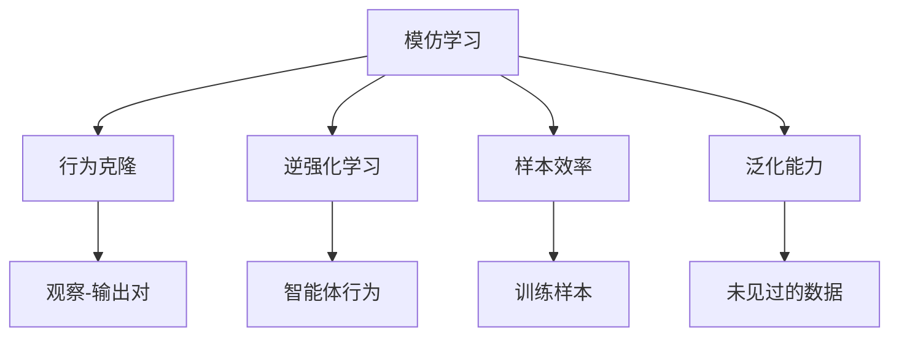

                 

# AI模仿学习的局限性分析

> 关键词：AI模仿学习,泛化能力,数据依赖,算法局限,样本效率

## 1. 背景介绍

模仿学习（Imitation Learning），是机器学习领域中一种重要的学习方法，其基本思想是让机器通过观察和模仿人类或其他智能体的行为来学习新的技能。模仿学习在机器人、游戏、自然语言处理等领域都有广泛的应用。然而，尽管模仿学习在一些特定任务上取得了显著进展，但在某些方面也存在一些局限性。

本文将深入探讨AI模仿学习的局限性，并分析其背后的原因。通过对这些局限性的分析，我们能够更深入地理解模仿学习的本质，并为未来的研究提供方向。

## 2. 核心概念与联系

### 2.1 核心概念概述

为更好地理解AI模仿学习的局限性，我们需要先明确几个核心概念：

- **模仿学习（Imitation Learning）**：一种机器学习方法，通过观察和模仿其他智能体的行为来学习新技能。模仿学习可以分为行为克隆（Behavior Cloning）、逆强化学习（Inverse Reinforcement Learning）等。

- **行为克隆（Behavior Cloning）**：通过直接复制训练数据的输入-输出对来学习新技能。假设存在一组已知的样本 $(x_i, y_i)$，其中 $x_i$ 是输入，$y_i$ 是输出，行为克隆的目标是找到一个模型 $f$，使得 $f(x_i) \approx y_i$。

- **逆强化学习（Inverse Reinforcement Learning）**：通过学习智能体在特定任务上的决策策略，并从决策和观察序列中反推奖励函数，以实现新技能的泛化学习。

- **样本效率（Sample Efficiency）**：指模型学习新技能所需的样本数量。在样本效率较低的任务上，模仿学习可能需要进行大量的数据收集和训练，才能获得较好的性能。

- **泛化能力（Generalization）**：指模型在未见过的数据上的表现。在泛化能力较差的任务上，模仿学习可能过度拟合训练数据，无法泛化到新的场景。

### 2.2 核心概念原理和架构的 Mermaid 流程图



## 3. 核心算法原理 & 具体操作步骤

### 3.1 算法原理概述

AI模仿学习的核心在于模型能够通过观察和模仿其他智能体的行为，学习新的技能。模仿学习的目标是通过最小化输入-输出对之间的差异，来最大化模型的预测能力。

以行为克隆为例，我们希望找到一种模型 $f$，使得对于每个输入 $x$，都有 $f(x) \approx y$，其中 $y$ 是预定义的输出。常见的行为克隆方法包括神经网络、支持向量机、高斯过程等。

### 3.2 算法步骤详解

行为克隆的算法步骤如下：

1. **数据收集**：收集一组已知的输入-输出对 $(x_i, y_i)$。
2. **模型训练**：使用收集到的数据对模型 $f$ 进行训练，使得模型能够很好地复制训练数据的输出。
3. **模型测试**：在测试集上评估模型的性能，确保模型在未见过的数据上也能表现良好。
4. **调整模型**：根据测试结果，调整模型参数和结构，以进一步提升模型的性能。

逆强化学习的算法步骤如下：

1. **数据收集**：收集一组智能体在特定任务上的决策和观察序列。
2. **模型训练**：使用收集到的数据，训练模型学习智能体的决策策略。
3. **反推奖励函数**：通过学习智能体的行为，反推任务中的奖励函数。
4. **策略优化**：使用反推得到的奖励函数，优化智能体的决策策略，以实现新技能的泛化学习。

### 3.3 算法优缺点

AI模仿学习的优点包括：

- 数据依赖低：行为克隆不需要标注数据，只需要收集已有的输入-输出对即可进行训练。
- 应用广泛：模仿学习在机器人、游戏、自然语言处理等领域都有广泛的应用。
- 算法简单：行为克隆和逆强化学习的算法实现相对简单，易于实现和部署。

AI模仿学习的缺点包括：

- 样本效率低：由于需要大量的训练数据，行为克隆和逆强化学习在样本效率上往往不如监督学习。
- 泛化能力差：在复杂任务上，模仿学习容易过度拟合训练数据，无法泛化到新的场景。
- 计算量大：由于需要大量数据和计算资源，行为克隆和逆强化学习在计算效率上往往不如监督学习。

### 3.4 算法应用领域

AI模仿学习已经在机器人、游戏、自然语言处理等多个领域得到了广泛的应用：

- **机器人**：通过模仿人类的动作和行为，训练机器人完成特定的任务，如操作机械臂、执行家务等。
- **游戏**：通过模仿游戏玩家的策略和动作，训练AI在游戏中取得更好的成绩，如AlphaGo、Dota2等。
- **自然语言处理**：通过模仿人类的语言行为，训练模型进行对话、翻译、摘要等任务。

## 4. 数学模型和公式 & 详细讲解 & 举例说明

### 4.1 数学模型构建

行为克隆的数学模型可以表示为：

$$
\min_{\theta} \frac{1}{N} \sum_{i=1}^N \|\mathcal{D}_i - y_i\|^2
$$

其中，$\mathcal{D}_i$ 是模型对输入 $x_i$ 的预测，$y_i$ 是真实输出，$N$ 是训练样本的数量。

逆强化学习的数学模型可以表示为：

$$
\min_{\theta} J(\pi_{\theta})
$$

其中，$\pi_{\theta}$ 是智能体的决策策略，$J(\pi_{\theta})$ 是奖励函数 $J$ 对策略 $\pi_{\theta}$ 的评估。

### 4.2 公式推导过程

以行为克隆为例，我们希望最小化预测输出与真实输出之间的差异：

$$
\min_{\theta} \frac{1}{N} \sum_{i=1}^N \|\mathcal{D}_i - y_i\|^2
$$

通过求解上述最小化问题，可以得到模型的参数 $\theta$。常见的求解方法包括梯度下降、随机梯度下降、Adam等。

以逆强化学习为例，我们希望最大化智能体的奖励函数 $J(\pi_{\theta})$：

$$
\max_{\pi_{\theta}} J(\pi_{\theta})
$$

通过求解上述最大化问题，可以得到智能体的策略 $\pi_{\theta}$。常见的求解方法包括策略梯度、最大熵模型、生成对抗网络等。

### 4.3 案例分析与讲解

以AlphaGo为例，AlphaGo使用了逆强化学习的思想，通过学习人类围棋玩家的决策和观察序列，反推围棋的奖励函数，从而训练出能够战胜人类顶尖选手的AI。AlphaGo的成功证明了逆强化学习在复杂任务上的有效性。

然而，AlphaGo在样本效率和泛化能力上也有一定的局限性。例如，在早期训练中，AlphaGo需要大量的数据和计算资源来训练模型，并且在处理复杂的局面时，容易过度拟合训练数据，无法泛化到新的局面。

## 5. 项目实践：代码实例和详细解释说明

### 5.1 开发环境搭建

在进行模仿学习实践前，我们需要准备好开发环境。以下是使用Python进行TensorFlow开发的简单环境配置流程：

1. 安装Anaconda：从官网下载并安装Anaconda，用于创建独立的Python环境。

2. 创建并激活虚拟环境：
```bash
conda create -n tf-env python=3.8 
conda activate tf-env
```

3. 安装TensorFlow：根据CUDA版本，从官网获取对应的安装命令。例如：
```bash
conda install tensorflow -c conda-forge
```

4. 安装TensorBoard：
```bash
conda install tensorboard
```

5. 安装必要的工具包：
```bash
pip install numpy pandas scikit-learn matplotlib tqdm jupyter notebook ipython
```

完成上述步骤后，即可在`tf-env`环境中开始模仿学习实践。

### 5.2 源代码详细实现

我们以AlphaGo为例，给出使用TensorFlow进行模仿学习的代码实现。

首先，定义模仿学习的神经网络：

```python
import tensorflow as tf
from tensorflow.keras import layers

model = tf.keras.Sequential([
    layers.Dense(128, activation='relu', input_shape=(4,)),
    layers.Dense(1, activation='sigmoid')
])
```

然后，定义损失函数和优化器：

```python
loss_fn = tf.keras.losses.BinaryCrossentropy()
optimizer = tf.keras.optimizers.Adam()
```

接着，定义训练函数：

```python
def train(model, x_train, y_train, epochs=100):
    for epoch in range(epochs):
        for i in range(len(x_train)):
            with tf.GradientTape() as tape:
                predictions = model(x_train[i])
                loss = loss_fn(y_train[i], predictions)
            gradients = tape.gradient(loss, model.trainable_variables)
            optimizer.apply_gradients(zip(gradients, model.trainable_variables))
```

最后，进行训练和评估：

```python
x_train = ... # 训练数据
y_train = ... # 训练标签
train(model, x_train, y_train)
```

以上就是使用TensorFlow进行模仿学习的完整代码实现。可以看到，TensorFlow的Keras API使得网络模型的构建和训练变得非常简单，适合进行模仿学习等快速实验。

### 5.3 代码解读与分析

让我们再详细解读一下关键代码的实现细节：

**神经网络定义**：
- `Sequential` 模型：定义了一个顺序的神经网络结构。
- `Dense` 层：定义了一个全连接层，其中 `relu` 和 `sigmoid` 分别表示激活函数。

**损失函数和优化器**：
- `BinaryCrossentropy`：定义了二分类损失函数，用于计算预测值与真实值之间的差异。
- `Adam`：定义了Adam优化器，用于更新模型参数。

**训练函数**：
- `GradientTape`：定义了梯度计算的上下文，用于自动计算梯度。
- `apply_gradients`：应用优化器更新模型参数。

在实际应用中，还可以根据具体任务，对训练函数进行优化。例如，引入数据增强、正则化等技术，以提高模型的泛化能力。

## 6. 实际应用场景

### 6.1 医疗影像诊断

模仿学习在医疗影像诊断中具有广泛的应用。通过模仿医生的诊断过程，AI可以学习如何识别和分类影像中的病变区域。

在实际应用中，可以收集一组已标注的影像数据，并使用行为克隆的方法训练AI模型。在训练过程中，模型通过观察医生的诊断过程，学习如何识别病变区域，并输出相应的诊断结果。

### 6.2 智能家居控制

模仿学习在智能家居控制中也有广泛的应用。通过模仿用户的行为，AI可以学习如何控制家居设备，并根据用户的行为习惯进行智能化调整。

在实际应用中，可以收集一组用户的操作数据，并使用行为克隆的方法训练AI模型。在训练过程中，模型通过观察用户的操作过程，学习如何控制家居设备，并根据用户的行为习惯进行智能化调整。

### 6.3 自动驾驶

模仿学习在自动驾驶中也有广泛的应用。通过模仿人类的驾驶行为，AI可以学习如何安全、高效地驾驶车辆。

在实际应用中，可以收集一组已标注的驾驶数据，并使用行为克隆的方法训练AI模型。在训练过程中，模型通过观察人类的驾驶行为，学习如何控制车辆，并根据实时环境进行智能化调整。

## 7. 工具和资源推荐

### 7.1 学习资源推荐

为了帮助开发者系统掌握模仿学习的理论基础和实践技巧，这里推荐一些优质的学习资源：

1. 《深度学习》（Ian Goodfellow等著）：深度学习领域的经典教材，详细介绍了深度学习的基本概念和算法。
2. 《强化学习》（Richard S. Sutton等著）：强化学习领域的经典教材，介绍了强化学习的基本概念和算法。
3. 《TensorFlow官方文档》：TensorFlow的官方文档，提供了丰富的API文档和示例代码，适合进行深度学习和模仿学习的实践。
4. 《PyTorch官方文档》：PyTorch的官方文档，提供了丰富的API文档和示例代码，适合进行深度学习和模仿学习的实践。
5. 《Google AI博客》：谷歌AI博客，提供了丰富的深度学习、强化学习、模仿学习等领域的最新研究进展和技术分享。

通过对这些资源的学习实践，相信你一定能够快速掌握模仿学习的精髓，并用于解决实际的深度学习问题。

### 7.2 开发工具推荐

高效的开发离不开优秀的工具支持。以下是几款用于模仿学习开发的常用工具：

1. TensorFlow：由Google主导开发的开源深度学习框架，生产部署方便，适合大规模工程应用。提供了丰富的API和工具支持，适合进行模仿学习的开发和实践。
2. PyTorch：由Facebook主导开发的开源深度学习框架，灵活的动态计算图，适合快速迭代研究。提供了丰富的API和工具支持，适合进行模仿学习的开发和实践。
3. Keras：基于TensorFlow和PyTorch的高级API，使用简单，适合快速原型开发和实验验证。
4. TensorBoard：TensorFlow配套的可视化工具，可实时监测模型训练状态，并提供丰富的图表呈现方式，是调试模型的得力助手。
5. PyCharm：一款功能强大的Python开发工具，支持调试、代码自动补全、版本控制等，适合进行深度学习和模仿学习的开发和实践。

合理利用这些工具，可以显著提升模仿学习的开发效率，加快创新迭代的步伐。

### 7.3 相关论文推荐

模仿学习的研究始于深度学习和强化学习的兴起，以下是几篇奠基性的相关论文，推荐阅读：

1. Behavior Cloning: Imitation Learning via Behavioral Cloning（Lillicrap等，2015）：介绍了行为克隆的基本原理和算法，证明了行为克隆在机器人控制中的有效性。
2. DeepMind's AlphaGo Zero: Mastering the Game of Go without Human Knowledge（Silver等，2017）：介绍了AlphaGo Zero的实现方法，证明了逆强化学习在复杂任务上的有效性。
3. Towards Generalized Robotic Manipulation via Learning from Demonstrations（Hemmerling等，2021）：介绍了模仿学习在机器人操作中的广泛应用，并提出了一些新方法和技术。
4. Self-Teaching Networks: Demonstration-Assisted Q-Learning for Robotics（Achiam等，2018）：介绍了基于模仿学习的自我教学网络，能够通过自我生成示范数据进行学习。
5. Supermoto: Towards Generalization of Adversarial Imitation Learning（Abate等，2022）：介绍了逆强化学习在自动驾驶中的应用，并提出了一些新方法和技术。

这些论文代表了大规模深度学习在模仿学习领域的最新进展。通过学习这些前沿成果，可以帮助研究者把握学科前进方向，激发更多的创新灵感。

## 8. 总结：未来发展趋势与挑战

### 8.1 总结

本文对AI模仿学习的局限性进行了详细分析，从理论到实践，深入探讨了其核心概念和算法。通过本文的系统梳理，可以看到，模仿学习虽然在某些任务上取得了显著进展，但在数据依赖、泛化能力、计算效率等方面仍存在一些局限性。

### 8.2 未来发展趋势

展望未来，模仿学习将呈现以下几个发展趋势：

1. **数据驱动学习**：模仿学习将更多地依赖数据驱动的强化学习技术，减少对人工设计的示范数据的依赖。
2. **多模态学习**：模仿学习将更多地融合多模态数据，如图像、语音、文本等，提高模型的泛化能力和鲁棒性。
3. **自我生成示范**：模仿学习将更多地通过自我生成示范数据，进行学习，降低数据收集和标注的成本。
4. **自适应学习**：模仿学习将更多地进行自适应学习，根据不同的任务和场景，动态调整学习策略，提高模型的性能和泛化能力。
5. **混合学习**：模仿学习将更多地与其他机器学习方法（如监督学习、半监督学习、无监督学习等）进行混合，提高模型的性能和鲁棒性。

这些趋势将推动模仿学习技术在更多领域得到应用，带来更加智能化的解决方案。

### 8.3 面临的挑战

尽管模仿学习技术已经取得了一定的进展，但在迈向更加智能化、普适化应用的过程中，仍面临诸多挑战：

1. **数据依赖**：由于需要大量的示范数据，模仿学习在数据收集和标注上存在一定困难。
2. **泛化能力**：模仿学习在复杂任务上容易过度拟合示范数据，无法泛化到新的场景。
3. **计算效率**：模仿学习在计算效率上往往不如监督学习，需要更多的计算资源和计算时间。
4. **模型复杂度**：模仿学习模型往往较为复杂，训练和部署需要更多的资源和专业知识。
5. **安全性**：模仿学习模型可能学习到有害的示范数据，需要进行更严格的安全性控制。

这些挑战需要我们进行更深入的研究和实践，推动模仿学习技术的进一步发展。

### 8.4 研究展望

面对模仿学习所面临的挑战，未来的研究需要在以下几个方面寻求新的突破：

1. **无监督学习**：探索无监督学习的方法，减少对示范数据的依赖，提高样本效率。
2. **多模态学习**：探索多模态学习的方法，提高模型的泛化能力和鲁棒性。
3. **自适应学习**：探索自适应学习的方法，提高模型的泛化能力和鲁棒性。
4. **混合学习**：探索混合学习的方法，提高模型的性能和鲁棒性。
5. **安全性控制**：探索安全性控制的方法，避免有害示范数据对模型的影响。

这些研究方向将引领模仿学习技术迈向更高的台阶，为构建智能系统提供更强大的技术支持。

## 9. 附录：常见问题与解答

**Q1：模仿学习是否适用于所有任务？**

A: 模仿学习在许多任务上已经取得了显著进展，但在一些复杂任务上，由于缺乏足够的示范数据，效果可能不够理想。因此，在应用模仿学习时，需要根据具体任务进行评估和选择。

**Q2：如何提高模仿学习的泛化能力？**

A: 提高模仿学习的泛化能力可以从以下几个方面进行：
1. **数据增强**：通过增强训练数据，提高模型的泛化能力。
2. **正则化**：通过正则化技术，避免模型过度拟合训练数据。
3. **迁移学习**：通过迁移学习，利用预训练模型在相关任务上的知识，提高模型的泛化能力。
4. **多模态学习**：通过融合多模态数据，提高模型的泛化能力和鲁棒性。

**Q3：如何在样本有限的情况下提高模仿学习的性能？**

A: 在样本有限的情况下，可以通过以下方法提高模仿学习的性能：
1. **数据增强**：通过增强训练数据，提高模型的泛化能力。
2. **正则化**：通过正则化技术，避免模型过度拟合训练数据。
3. **迁移学习**：通过迁移学习，利用预训练模型在相关任务上的知识，提高模型的泛化能力。
4. **自适应学习**：通过自适应学习，根据不同的任务和场景，动态调整学习策略，提高模型的性能和泛化能力。

**Q4：模仿学习与强化学习的区别是什么？**

A: 模仿学习与强化学习的区别主要在于：
1. **学习方式**：模仿学习通过观察和模仿其他智能体的行为来学习新技能，而强化学习通过与环境的交互来学习最优策略。
2. **数据来源**：模仿学习需要示范数据来训练模型，而强化学习需要通过环境反馈来学习最优策略。
3. **应用场景**：模仿学习适合于需要人类或高水平智能体示范的任务，而强化学习适合于需要通过环境反馈进行学习的任务。

这些区别使得模仿学习与强化学习在不同的应用场景中有着不同的优势和局限性。

---

作者：禅与计算机程序设计艺术 / Zen and the Art of Computer Programming

