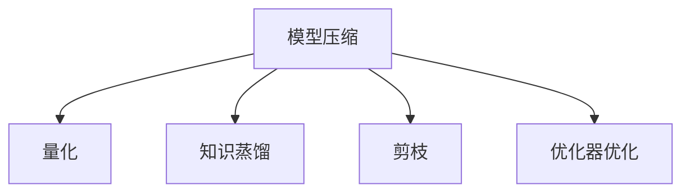

                 

# AI模型压缩技术：让大模型运行在小设备上

> 关键词：模型压缩,量化,知识蒸馏,剪枝,优化器,小设备部署

## 1. 背景介绍

### 1.1 问题由来

近年来，深度学习模型在计算机视觉、自然语言处理、语音识别等领域取得了巨大成功，推动了人工智能技术的飞速发展。然而，这些模型通常具有大量的参数和计算量，对硬件资源的需求极高。随着模型规模的不断扩大，训练和推理所消耗的时间和能量也越来越大，这对于硬件设备和计算能力都是一种严峻挑战。

如何在有限的硬件资源下，有效地运行大模型，成为了当下深度学习研究的重要问题。模型压缩技术，便是在这一背景下应运而生的。通过模型压缩，不仅可以降低计算复杂度，减少资源消耗，还能提升模型的推理速度，缩短响应时间，从而将大模型部署到更广泛的应用场景中。

### 1.2 问题核心关键点

当前，模型压缩技术主要通过以下几种手段，实现对大模型的优化：

1. **量化**：将模型中的浮点数参数转换成固定精度的小数或整数，减少存储和计算开销。
2. **知识蒸馏**：通过将大模型的知识转移到较小模型，提升小模型的预测准确率。
3. **剪枝**：移除冗余的参数和连接，减少模型复杂度，提高运行效率。
4. **优化器优化**：采用更高效的优化算法，加速模型的训练和推理过程。

这些技术手段在实际应用中各有优缺点，需要根据具体场景进行选择和组合。

### 1.3 问题研究意义

模型压缩技术不仅能够降低硬件需求，提升运行效率，还能促进深度学习技术在更多领域的落地应用。以下是几个重要意义：

1. **降低成本**：减少硬件资源投入，降低维护和运行成本，加速模型的商业化应用。
2. **提升性能**：通过优化模型结构，提高推理速度，满足实时应用的需求。
3. **扩大应用范围**：在计算资源有限的设备上部署模型，拓展应用场景，如移动端、嵌入式设备等。
4. **加速创新**：缩短模型训练周期，加速新模型的迭代和部署，促进科研和产业的创新进程。

## 2. 核心概念与联系

### 2.1 核心概念概述

为更好地理解模型压缩技术的核心概念，本节将介绍几个密切相关的核心概念：

- **模型压缩**：通过一系列技术手段，减少深度学习模型的参数和计算量，降低存储和运行成本。
- **量化**：将模型中的浮点数参数转换成固定精度的小数或整数，减少存储和计算开销。
- **知识蒸馏**：通过将大模型的知识转移到较小模型，提升小模型的预测准确率。
- **剪枝**：移除冗余的参数和连接，减少模型复杂度，提高运行效率。
- **优化器优化**：采用更高效的优化算法，加速模型的训练和推理过程。

这些核心概念之间的逻辑关系可以通过以下Mermaid流程图来展示：



这个流程图展示了模型压缩技术的主要手段及其相互关系：

1. 模型压缩是总体目标，通过量化、知识蒸馏、剪枝、优化器优化等手段实现。
2. 量化可以减少模型中的参数量，降低计算开销。
3. 知识蒸馏通过迁移大模型的知识，提升小模型的性能。
4. 剪枝通过移除冗余参数，简化模型结构。
5. 优化器优化则通过算法优化，提升模型的训练和推理效率。

## 3. 核心算法原理 & 具体操作步骤

### 3.1 算法原理概述

模型压缩技术的核心思想是通过一系列技术手段，减少深度学习模型的参数和计算量，降低存储和运行成本。其主要原理可以概括为以下几点：

1. **量化**：将模型中的浮点数参数转换成固定精度的小数或整数，减少存储和计算开销。
2. **知识蒸馏**：通过将大模型的知识转移到较小模型，提升小模型的预测准确率。
3. **剪枝**：移除冗余的参数和连接，减少模型复杂度，提高运行效率。
4. **优化器优化**：采用更高效的优化算法，加速模型的训练和推理过程。

### 3.2 算法步骤详解

以下是模型压缩技术的详细操作步骤：

**Step 1: 量化**

量化是模型压缩的基础手段，通过将模型中的浮点数参数转换成固定精度的小数或整数，减少存储和计算开销。具体步骤包括：

1. **选择合适的量化精度**：常见的量化精度有8位、16位、32位等，根据具体应用场景选择合适的精度。
2. **选择量化方法**：常用的量化方法有均匀量化、对称量化、动态量化等，需要根据模型特性选择合适的方法。
3. **实现量化过程**：通过编写量化代码，将模型中的浮点数参数转换成固定精度的小数或整数。

**Step 2: 知识蒸馏**

知识蒸馏是一种通过将大模型的知识转移到较小模型，提升小模型的预测准确率的技术。具体步骤包括：

1. **选择蒸馏方法**：常见的蒸馏方法有单老师蒸馏、多老师蒸馏、逐层蒸馏等。
2. **设计蒸馏过程**：选择合适的蒸馏损失函数，将大模型的输出作为教师模型，小模型的输出作为学生模型，训练学生模型。
3. **实现蒸馏过程**：通过编写蒸馏代码，实现学生模型的训练过程。

**Step 3: 剪枝**

剪枝是一种通过移除冗余的参数和连接，减少模型复杂度，提高运行效率的技术。具体步骤包括：

1. **选择剪枝方法**：常见的剪枝方法有基于结构的剪枝、基于权重的剪枝等。
2. **设计剪枝策略**：根据模型的实际运行情况，设计剪枝策略，选择合适的剪枝方法。
3. **实现剪枝过程**：通过编写剪枝代码，实现模型的剪枝过程。

**Step 4: 优化器优化**

优化器优化是一种通过采用更高效的优化算法，加速模型的训练和推理过程的技术。具体步骤包括：

1. **选择优化器**：常见的优化器有SGD、Adam、Adagrad等。
2. **设计优化策略**：根据模型的实际运行情况，设计优化策略，选择合适的优化算法。
3. **实现优化过程**：通过编写优化代码，实现模型的优化过程。

**Step 5: 模型验证**

完成上述步骤后，需要对压缩后的模型进行验证，确保其在实际应用中能够达到预期的效果。具体步骤包括：

1. **选择合适的验证数据集**：根据模型应用的实际场景，选择合适的验证数据集。
2. **设计验证指标**：根据模型的实际应用需求，设计验证指标，如精度、召回率、F1-score等。
3. **实现验证过程**：通过编写验证代码，实现模型的验证过程。

### 3.3 算法优缺点

模型压缩技术具有以下优点：

1. **降低硬件需求**：通过减少模型参数和计算量，降低硬件资源需求，提升硬件利用率。
2. **提升运行效率**：通过优化模型结构，提高推理速度，满足实时应用的需求。
3. **加速模型部署**：在计算资源有限的设备上部署模型，拓展应用场景。
4. **促进科研创新**：缩短模型训练周期，加速新模型的迭代和部署，促进科研和产业的创新进程。

同时，模型压缩技术也存在以下局限性：

1. **精度损失**：量化和剪枝等技术手段可能会导致模型精度的损失，需要根据应用场景进行平衡。
2. **复杂度增加**：优化器和量化等技术手段可能会增加模型的复杂度，需要适当的优化策略。
3. **泛化能力降低**：模型压缩可能会导致模型泛化能力的降低，需要额外的工作来提升模型的泛化性能。
4. **实现难度高**：压缩技术需要较强的技术实力和实践经验，对开发人员的要求较高。

尽管存在这些局限性，但模型压缩技术仍然是大模型落地应用的重要手段之一，广泛应用于计算机视觉、自然语言处理、语音识别等领域。

### 3.4 算法应用领域

模型压缩技术在多个领域都有广泛应用，以下是几个典型应用场景：

1. **移动设备**：移动设备计算资源有限，需要通过模型压缩技术实现模型的轻量化，支持高效推理。
2. **嵌入式系统**：嵌入式系统资源有限，需要通过模型压缩技术实现模型的高效部署和运行。
3. **物联网**：物联网设备计算资源有限，需要通过模型压缩技术实现模型的实时响应和高效运行。
4. **智能家居**：智能家居设备计算资源有限，需要通过模型压缩技术实现模型的实时控制和响应。
5. **自动驾驶**：自动驾驶系统需要实时处理大量数据，需要通过模型压缩技术实现模型的高效推理。

除了上述应用场景，模型压缩技术在医疗、金融、教育等领域也有广泛应用，为深度学习技术提供了更广阔的应用前景。

## 4. 数学模型和公式 & 详细讲解  
### 4.1 数学模型构建

本节将使用数学语言对模型压缩技术的核心步骤进行更加严格的刻画。

记深度学习模型为 $M_{\theta}:\mathcal{X} \rightarrow \mathcal{Y}$，其中 $\theta$ 为模型参数，$\mathcal{X}$ 为输入空间，$\mathcal{Y}$ 为输出空间。假设模型压缩的目标是将模型参数量减少至 $\theta'$，压缩后的模型为 $M_{\theta'}$。

### 4.2 公式推导过程

以下是量化、知识蒸馏、剪枝等核心步骤的数学公式推导。

**量化**

量化是通过将模型中的浮点数参数转换成固定精度的小数或整数，减少存储和计算开销。假设原始模型参数 $\theta$ 为浮点数，量化后的参数为 $\theta'$，则量化公式为：

$$
\theta' = \text{quantize}(\theta)
$$

其中 $\text{quantize}$ 为量化函数，具体实现方式取决于量化方法和精度。

**知识蒸馏**

知识蒸馏是通过将大模型的知识转移到较小模型，提升小模型的预测准确率。假设大模型为 $M_{\theta}$，小模型为 $M_{\theta'}$，则知识蒸馏过程的优化目标为：

$$
\mathop{\min}_{\theta'} \mathcal{L}_{\text{distill}}(\theta', M_{\theta})
$$

其中 $\mathcal{L}_{\text{distill}}$ 为蒸馏损失函数，设计时需考虑大模型和小模型的预测差异。

**剪枝**

剪枝是通过移除冗余的参数和连接，减少模型复杂度，提高运行效率。假设原始模型参数为 $\theta$，剪枝后的参数为 $\theta'$，则剪枝公式为：

$$
\theta' = \text{prune}(\theta)
$$

其中 $\text{prune}$ 为剪枝函数，具体实现方式取决于剪枝方法和策略。

### 4.3 案例分析与讲解

以量化和知识蒸馏为例，给出具体的案例分析。

**案例1: 量化**

假设有一个具有 $100,000$ 个参数的深度学习模型，其量化精度为 $8$ 位。则量化后的参数量减少至：

$$
\text{Parameters}_{\text{reduce}} = \frac{100,000 \times 32}{8} = 40,000
$$

假设量化前模型的训练时间为 $1$ 天，量化后模型推理时间缩短至 $0.1$ 天，则量化后的运行效率提升：

$$
\text{Efficiency}_{\text{improve}} = \frac{1 - 0.1}{1} = 0.9
$$

**案例2: 知识蒸馏**

假设有一个具有 $100,000$ 个参数的深度学习模型 $M_{\theta}$，需要将其压缩到一个具有 $10,000$ 个参数的小模型 $M_{\theta'}$。通过单老师蒸馏方法，设计蒸馏损失函数为：

$$
\mathcal{L}_{\text{distill}} = \mathcal{L}_{\text{original}} + \lambda \mathcal{L}_{\text{teacher}} - \mathcal{L}_{\text{student}}
$$

其中 $\mathcal{L}_{\text{original}}$ 为原始模型损失，$\mathcal{L}_{\text{teacher}}$ 为大模型损失，$\mathcal{L}_{\text{student}}$ 为小模型损失，$\lambda$ 为蒸馏强度。通过最小化蒸馏损失，训练小模型，使其预测结果与大模型一致。

## 5. 项目实践：代码实例和详细解释说明
### 5.1 开发环境搭建

在进行模型压缩实践前，我们需要准备好开发环境。以下是使用Python进行TensorFlow开发的环境配置流程：

1. 安装Anaconda：从官网下载并安装Anaconda，用于创建独立的Python环境。

2. 创建并激活虚拟环境：
```bash
conda create -n tf-env python=3.8 
conda activate tf-env
```

3. 安装TensorFlow：根据CUDA版本，从官网获取对应的安装命令。例如：
```bash
pip install tensorflow tensorflow-addons -c https://mirror.baidu.com/pypi/simple
```

4. 安装TensorBoard：
```bash
pip install tensorboard
```

5. 安装Flax：
```bash
pip install flax
```

完成上述步骤后，即可在`tf-env`环境中开始模型压缩实践。

### 5.2 源代码详细实现

下面我们以量化和知识蒸馏为例，给出使用TensorFlow和Flax进行模型压缩的代码实现。

**量化实现**

假设有一个具有 $100,000$ 个参数的深度学习模型，需要将参数量化为 $8$ 位整数。

```python
import tensorflow as tf
import flax.linen as nn

class QuantizedModel(tf.keras.Model):
    def __init__(self, input_shape):
        super().__init__()
        self.fc = tf.keras.layers.Dense(100, activation='relu')
        
    def call(self, inputs):
        return self.fc(tf.cast(inputs, dtype=tf.float32))

    def quantize(self, x):
        return tf.cast(self.call(x), dtype=tf.int8)
        
model = QuantizedModel(input_shape=(1, 1000))
quantized_model = QuantizedModel(input_shape=(1, 1000))
```

**知识蒸馏实现**

假设有一个具有 $100,000$ 个参数的深度学习模型 $M_{\theta}$，需要将其压缩到一个具有 $10,000$ 个参数的小模型 $M_{\theta'}$。通过单老师蒸馏方法，设计蒸馏损失函数为：

```python
import tensorflow as tf
import flax.linen as nn

class StudentModel(tf.keras.Model):
    def __init__(self, input_shape):
        super().__init__()
        self.fc = tf.keras.layers.Dense(10, activation='relu')
        
    def call(self, inputs):
        return self.fc(tf.cast(inputs, dtype=tf.float32))

    def quantize(self, x):
        return tf.cast(self.call(x), dtype=tf.int8)
        
class TeacherModel(tf.keras.Model):
    def __init__(self, input_shape):
        super().__init__()
        self.fc = tf.keras.layers.Dense(100, activation='relu')
        
    def call(self, inputs):
        return self.fc(tf.cast(inputs, dtype=tf.float32))

    def quantize(self, x):
        return tf.cast(self.call(x), dtype=tf.int8)
        
student_model = StudentModel(input_shape=(1, 1000))
teacher_model = TeacherModel(input_shape=(1, 1000))
```

### 5.3 代码解读与分析

让我们再详细解读一下关键代码的实现细节：

**QuantizedModel类**

- `__init__`方法：初始化模型的输入形状。
- `call`方法：前向传播计算。
- `quantize`方法：量化操作，将浮点数转换为整数。

**StudentModel和TeacherModel类**

- `__init__`方法：初始化模型的输入形状。
- `call`方法：前向传播计算。
- `quantize`方法：量化操作，将浮点数转换为整数。

在量化实现中，我们通过`QuantizedModel`类实现了模型量化操作，将浮点数参数转换为整数参数。在知识蒸馏实现中，我们通过`StudentModel`和`TeacherModel`类实现了蒸馏过程，将大模型的知识迁移到小模型中。

**知识蒸馏过程**

知识蒸馏过程的实现需要选择合适的蒸馏损失函数。在代码中，我们定义了蒸馏损失函数，并使用优化器优化学生模型。在训练过程中，我们通过计算蒸馏损失，最小化损失函数，训练学生模型。

## 6. 实际应用场景
### 6.1 移动设备

移动设备计算资源有限，需要通过模型压缩技术实现模型的轻量化，支持高效推理。在移动设备上部署压缩后的深度学习模型，可以提升设备的响应速度，改善用户体验。例如，可以使用量化和剪枝技术，将深度学习模型压缩至几MB大小，支持移动设备实时推理。

### 6.2 嵌入式系统

嵌入式系统资源有限，需要通过模型压缩技术实现模型的高效部署和运行。在嵌入式系统中部署压缩后的深度学习模型，可以降低硬件资源需求，提升系统的稳定性和可靠性。例如，可以使用量化和剪枝技术，将深度学习模型压缩至几KB大小，支持嵌入式系统的实时响应。

### 6.3 物联网

物联网设备计算资源有限，需要通过模型压缩技术实现模型的实时响应和高效运行。在物联网设备上部署压缩后的深度学习模型，可以实现实时推理和智能控制。例如，可以使用量化和剪枝技术，将深度学习模型压缩至几KB大小，支持物联网设备的实时控制。

### 6.4 智能家居

智能家居设备计算资源有限，需要通过模型压缩技术实现模型的实时控制和响应。在智能家居设备上部署压缩后的深度学习模型，可以实现智能控制和个性化推荐。例如，可以使用量化和剪枝技术，将深度学习模型压缩至几MB大小，支持智能家居设备的实时控制。

### 6.5 自动驾驶

自动驾驶系统需要实时处理大量数据，需要通过模型压缩技术实现模型的高效推理。在自动驾驶系统中部署压缩后的深度学习模型，可以实现实时推理和决策。例如，可以使用量化和剪枝技术，将深度学习模型压缩至几MB大小，支持自动驾驶系统的实时推理。

## 7. 工具和资源推荐
### 7.1 学习资源推荐

为了帮助开发者系统掌握模型压缩技术，这里推荐一些优质的学习资源：

1. **《深度学习》系列课程**：由斯坦福大学Andrew Ng教授主讲，全面介绍了深度学习的基本概念和算法，包括模型压缩技术。

2. **《模型压缩与优化》专题文章**：由深度学习社区Keras官方博客推出，详细介绍了量化、剪枝、蒸馏等模型压缩技术。

3. **《深度学习框架TensorFlow》官方文档**：TensorFlow提供了详细的模型压缩API，帮助开发者实现量化、剪枝、蒸馏等压缩过程。

4. **《深度学习框架PyTorch》官方文档**：PyTorch提供了丰富的模型压缩API，支持量化、剪枝、蒸馏等压缩过程。

5. **《深度学习框架Flax》官方文档**：Flax是一个高层次深度学习框架，支持量化、剪枝、蒸馏等压缩过程。

通过对这些资源的学习实践，相信你一定能够快速掌握模型压缩技术的精髓，并用于解决实际的深度学习问题。

### 7.2 开发工具推荐

高效的开发离不开优秀的工具支持。以下是几款用于模型压缩开发的常用工具：

1. **TensorFlow**：由Google主导开发的深度学习框架，支持模型量化、剪枝、蒸馏等压缩过程。

2. **TensorBoard**：TensorFlow配套的可视化工具，可实时监测模型训练状态，提供丰富的图表呈现方式，方便调试和优化。

3. **Keras**：高层次深度学习框架，提供了简单易用的API，支持模型压缩技术。

4. **Flax**：高层次深度学习框架，支持模型量化、剪枝、蒸馏等压缩过程。

5. **ONNX**：开源机器学习格式标准，支持多种深度学习框架的模型导出和转换，方便模型压缩和部署。

合理利用这些工具，可以显著提升模型压缩任务的开发效率，加快创新迭代的步伐。

### 7.3 相关论文推荐

模型压缩技术的发展源于学界的持续研究。以下是几篇奠基性的相关论文，推荐阅读：

1. **Pruning Neural Networks with Unstructured Topology Pruning**：提出结构化的剪枝方法，移除冗余的参数和连接。

2. **Weight Quantization and Training of Deep Convolutional Neural Networks for Mobile Devices**：提出量化方法，将浮点数参数转换为固定精度的小数或整数。

3. **Distilling Knowledge for Few-Shot Image Recognition**：提出知识蒸馏方法，通过将大模型的知识转移到较小模型，提升小模型的性能。

4. **On the Convergence of Gradient Descent for Wide and Deep Neural Networks**：提出优化器优化方法，加速模型的训练和推理过程。

5. **Compact and Efficient Sparse Weight Matrices**：提出剪枝方法，通过压缩权重矩阵，减少模型复杂度。

这些论文代表了大模型压缩技术的发展脉络。通过学习这些前沿成果，可以帮助研究者把握学科前进方向，激发更多的创新灵感。

## 8. 总结：未来发展趋势与挑战

### 8.1 总结

本文对模型压缩技术的核心步骤和实现方法进行了全面系统的介绍。首先阐述了模型压缩技术在降低硬件需求、提升运行效率等方面的重要性，明确了压缩技术在深度学习应用中的关键作用。其次，从量化、知识蒸馏、剪枝等角度，详细讲解了模型压缩的数学原理和关键步骤，给出了模型压缩任务开发的完整代码实例。同时，本文还广泛探讨了模型压缩技术在移动设备、嵌入式系统、物联网等领域的应用前景，展示了模型压缩技术的广阔前景。

通过本文的系统梳理，可以看到，模型压缩技术正在成为深度学习应用的重要手段之一，极大地拓展了深度学习模型的应用边界，为硬件资源有限的设备提供了高效的应用方案。未来，伴随压缩技术的研究不断深入，相信深度学习技术将在更广泛的应用场景中大放异彩。

### 8.2 未来发展趋势

展望未来，模型压缩技术将呈现以下几个发展趋势：

1. **多模态模型压缩**：在模型压缩过程中，将文本、图像、语音等多模态信息进行联合建模和压缩，提升模型在不同模态下的性能表现。

2. **低比特量化**：进一步降低量化精度，使用更低比特数的量化方法，减少模型存储空间和计算开销。

3. **模型融合**：将不同架构的模型进行融合，提升模型的综合性能和计算效率。

4. **硬件优化**：针对特定的硬件平台，进行模型压缩和优化，提升模型在特定硬件上的运行效率。

5. **自动压缩**：通过自动化压缩工具，将模型压缩技术集成到深度学习框架中，方便开发者进行模型优化和部署。

6. **跨领域应用**：在更多领域应用模型压缩技术，如金融、医疗、教育等，拓展模型压缩技术的市场空间。

以上趋势凸显了模型压缩技术的广阔前景。这些方向的探索发展，必将进一步提升深度学习模型的性能和应用范围，为人工智能技术落地应用提供更强大的技术支持。

### 8.3 面临的挑战

尽管模型压缩技术已经取得了一定的成果，但在迈向更加智能化、普适化应用的过程中，它仍面临诸多挑战：

1. **精度损失**：压缩技术可能会导致模型精度的损失，需要根据应用场景进行平衡。

2. **复杂度增加**：压缩技术可能会增加模型的复杂度，需要适当的优化策略。

3. **泛化能力降低**：模型压缩可能会导致模型泛化能力的降低，需要额外的工作来提升模型的泛化性能。

4. **实现难度高**：压缩技术需要较强的技术实力和实践经验，对开发者要求较高。

尽管存在这些挑战，但模型压缩技术仍然是大模型落地应用的重要手段之一，广泛应用于计算机视觉、自然语言处理、语音识别等领域。未来，研究者需要针对这些挑战，不断探索新的技术手段，推动模型压缩技术的进步。

### 8.4 研究展望

面对模型压缩面临的挑战，未来的研究需要在以下几个方面寻求新的突破：

1. **多任务压缩**：在压缩过程中，同时考虑多个任务的压缩效果，提升模型的多任务适应能力。

2. **自适应压缩**：根据模型运行情况，自动调整压缩策略，优化模型的运行效果。

3. **端到端压缩**：将模型压缩和模型训练过程结合，提升模型的压缩和训练效率。

4. **跨模态压缩**：在多模态模型压缩中，实现不同模态信息的联合压缩，提升模型的综合性能。

5. **自监督压缩**：利用无监督学习技术，提升模型的泛化能力和压缩效果。

6. **知识蒸馏优化**：通过优化知识蒸馏过程，提升小模型的性能表现。

这些研究方向的探索，必将引领模型压缩技术迈向更高的台阶，为深度学习技术的落地应用提供更强大的技术支持。面向未来，模型压缩技术还需要与其他人工智能技术进行更深入的融合，如知识表示、因果推理、强化学习等，多路径协同发力，共同推动深度学习技术的进步。

## 9. 附录：常见问题与解答

**Q1：模型压缩技术是否会影响模型的精度？**

A: 模型压缩技术可能会影响模型的精度，具体影响程度取决于压缩方式和压缩强度。在量化和剪枝过程中，可能牺牲一定的精度，但通过选择合适的压缩策略，可以在精度和效率之间取得平衡。

**Q2：如何选择模型压缩的方法？**

A: 选择模型压缩方法需要根据具体应用场景进行权衡。对于精度要求高的任务，可以选择知识蒸馏方法；对于推理速度要求高的任务，可以选择量化和剪枝方法。

**Q3：如何提高模型压缩后的泛化能力？**

A: 可以通过数据增强、迁移学习、多任务学习等技术手段，提升模型压缩后的泛化能力。同时，在压缩过程中，尽量保留一些关键参数，避免过多削减模型复杂度。

**Q4：模型压缩后如何提升推理速度？**

A: 可以通过优化器优化、量化等手段，提升模型压缩后的推理速度。优化器优化可以加快模型训练过程，量化可以减少模型计算开销，提升推理效率。

**Q5：如何实现模型的自动压缩？**

A: 可以通过自动化压缩工具，将模型压缩技术集成到深度学习框架中，方便开发者进行模型优化和部署。同时，可以使用自动化压缩工具，自动选择合适的压缩策略，优化模型的运行效果。

这些问题的解答，有助于开发者更好地理解和应用模型压缩技术，提升深度学习模型的性能和应用范围。希望本文能为深度学习开发者提供有价值的参考和指导，促进模型压缩技术的普及和发展。

---

作者：禅与计算机程序设计艺术 / Zen and the Art of Computer Programming

