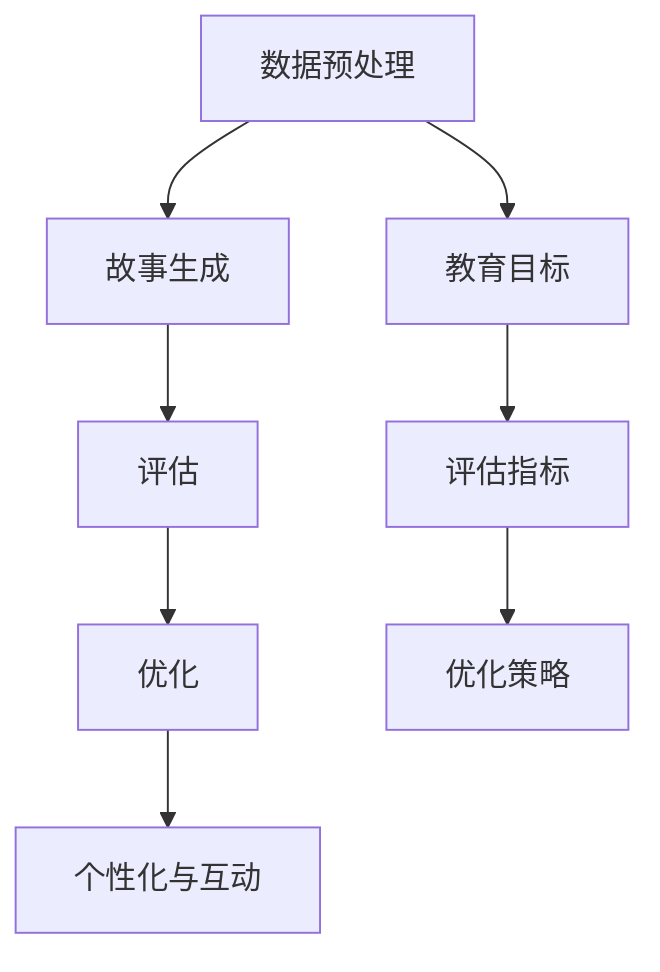

                 

## 1. 背景介绍

### 1.1 问题由来
在人工智能(AI)飞速发展的今天，教育领域也迎来了革命性的变化。传统的教育方式往往单一枯燥，难以激发学生的学习兴趣，教学效果不尽人意。为此，许多研究者尝试引入AI技术，通过智能化、互动化的方法，提高教育内容的吸引力和有效性。其中，AI生成的教育内容因其个性化、动态化的特点，受到广泛关注。

特别是近年来，基于自然语言处理的AI故事生成技术，以其丰富的叙事风格和多样化的情感表达，逐步成为教育内容创新的有力工具。AI生成的教育故事不仅能够满足不同年龄段学生的学习需求，还能激发他们的想象力和创造力，培养批判性思维和解决实际问题的能力。

### 1.2 问题核心关键点
AI生成的教育故事，其核心在于如何构建一个既富有教育意义，又能够吸引学生注意力的故事生成模型。关键点包括：

1. **教育目标设定**：明确故事的教育目的，如科普、文学、逻辑推理等，从而选择合适的生成策略。
2. **数据收集与预处理**：收集适合的故事题材、人物、情节等数据，并进行有效的数据清洗和预处理。
3. **故事生成算法**：选择合适的算法，如文本生成、对话生成、序列到序列模型等，生成符合教育目标的故事内容。
4. **评估与优化**：通过自动评估和人工评估，不断优化生成模型，提升故事的教育性和可读性。
5. **个性化与互动性**：结合学生的反馈和行为数据，生成个性化的教育故事，提高学生的参与度和学习效果。

### 1.3 问题研究意义
研究AI生成的教育故事，不仅能够提升教育内容的趣味性和互动性，还能够在实际教学中取得更好的教育效果。具体来说：

1. **提高学习兴趣**：生动的故事情节和人物设定能够激发学生的学习兴趣，使其更愿意主动参与学习。
2. **增强学习效果**：通过故事化的教育内容，可以更好地传授复杂概念和知识，帮助学生更好地理解和掌握。
3. **促进个性化学习**：根据学生的学习情况和反馈，生成个性化的故事内容，满足不同学生的学习需求。
4. **培养创新思维**：AI生成的教育故事可以提供多样化的情节和结局，培养学生的创造性思维和解决问题的能力。

## 2. 核心概念与联系

### 2.1 核心概念概述

为了更好地理解AI生成的教育故事，我们首先介绍几个核心概念：

- **AI故事生成**：指通过人工智能技术，自动生成具有教育意义的故事。其核心是自然语言处理(NLP)技术，包括文本生成、对话生成、序列到序列模型等。
- **教育目标**：故事生成过程需要明确教育目标，如增强科学素养、培养语言能力、激发想象力等，从而选择合适的生成策略。
- **数据预处理**：收集适合的故事题材、人物、情节等数据，并进行预处理，包括文本清洗、分词、向量化等。
- **评估指标**：评估生成的故事是否符合教育目标和学生的学习需求，常用的指标包括内容丰富度、语言流畅度、情节合理性等。
- **个性化和互动性**：结合学生的反馈和行为数据，生成个性化的教育故事，提高学生的参与度和学习效果。

这些核心概念之间的联系可以通过以下Mermaid流程图来展示：



这个流程图展示了大语言模型的核心概念及其之间的关系：

1. 数据预处理是故事生成的基础，通过数据预处理获得适合生成模型的输入数据。
2. 故事生成过程在明确教育目标和评估指标的基础上，选择合适的生成策略，生成符合教育目标的故事。
3. 评估指标用于衡量生成故事的质量，优化策略基于评估结果不断改进模型。
4. 个性化和互动性通过结合学生的反馈和行为数据，进一步提升故事的教育效果。

## 3. 核心算法原理 & 具体操作步骤
### 3.1 算法原理概述

AI生成的教育故事，其核心算法包括文本生成、对话生成和序列到序列模型。下面以文本生成算法为例，详细讲解其原理和具体操作步骤。

#### 3.1.1 算法原理

文本生成算法，主要基于循环神经网络(RNN)、长短时记忆网络(LSTM)和Transformer等深度学习模型，通过编码器-解码器架构，生成连续的文本序列。其原理可以总结如下：

1. **编码器**：将输入序列(如故事情节)通过自注意力机制进行编码，提取语义信息。
2. **解码器**：通过自注意力机制，逐步生成故事中的每个词汇，同时考虑上下文信息。
3. **损失函数**：常用的损失函数包括交叉熵损失、词嵌入损失等，用于衡量生成文本与目标文本的相似度。
4. **优化算法**：常用的优化算法包括Adam、SGD等，通过反向传播更新模型参数，最小化损失函数。

#### 3.1.2 算法步骤详解

1. **数据准备**：收集适合的故事题材、人物、情节等数据，并进行预处理，包括分词、向量化等。
2. **模型构建**：选择合适的模型架构，如RNN、LSTM、Transformer等，构建编码器和解码器。
3. **训练过程**：将预处理后的数据输入模型，进行前向传播计算预测输出，反向传播计算损失函数，并使用优化算法更新模型参数。
4. **评估与优化**：在验证集上评估生成故事的质量，根据评估结果选择最优模型，并进行微调。
5. **个性化生成**：根据学生的反馈和行为数据，生成个性化的教育故事。

### 3.2 算法步骤详解

以RNN为例，生成教育故事的具体操作步骤如下：

**Step 1: 数据准备**

- **数据收集**：收集适合的故事题材、人物、情节等数据，并进行预处理。
- **分词与向量化**：使用分词工具将文本切分为单词，并使用词向量表示单词。

**Step 2: 模型构建**

- **编码器**：使用RNN、LSTM等模型作为编码器，将输入序列进行编码，提取语义信息。
- **解码器**：使用RNN、LSTM等模型作为解码器，逐步生成故事中的每个词汇。

**Step 3: 训练过程**

- **模型初始化**：随机初始化模型参数。
- **前向传播**：将输入序列输入模型，计算预测输出。
- **计算损失**：计算预测输出与目标输出之间的交叉熵损失。
- **反向传播**：通过反向传播计算损失函数对模型参数的梯度。
- **参数更新**：使用优化算法(如Adam)更新模型参数，最小化损失函数。

**Step 4: 评估与优化**

- **验证集评估**：在验证集上评估模型生成的故事质量，选择最优模型。
- **微调模型**：根据评估结果，对模型进行微调，进一步提升生成效果。

**Step 5: 个性化生成**

- **收集反馈**：收集学生的反馈和行为数据，分析学生偏好和理解程度。
- **生成故事**：结合学生反馈和行为数据，生成个性化的教育故事。

### 3.3 算法优缺点

AI生成的教育故事具有以下优点：

1. **高度定制化**：可以根据不同的教育目标和学生的学习需求，生成个性化的故事内容。
2. **多样化的叙事风格**：生成模型的多样性使得故事可以涵盖多种风格和体裁，适应不同的教育场景。
3. **动态调整**：结合学生的反馈和行为数据，动态调整故事生成策略，提高学习效果。
4. **高效生成**：通过自动化技术，快速生成大量的教育故事，节省时间和人力成本。

同时，该算法也存在一些缺点：

1. **依赖高质量数据**：数据质量直接影响故事生成的效果，高质量数据的获取和处理成本较高。
2. **可解释性不足**：生成模型作为"黑盒"系统，难以解释其内部工作机制和决策逻辑。
3. **上下文依赖性**：模型的上下文依赖性强，需要提供足够的上下文信息才能生成连贯的故事。
4. **情感表达有限**：尽管生成模型可以模拟多种情感表达，但在复杂情感场景下，仍需人工干预。

### 3.4 算法应用领域

AI生成的教育故事，在多个教育领域得到了广泛应用，例如：

- **基础教育**：小学、初中、高中等基础教育阶段，通过故事化的教学内容激发学生的学习兴趣。
- **职业教育**：职业培训、技能教育等，通过生动的故事帮助学生理解复杂的概念和技能。
- **专业教育**：大学、研究生等专业教育阶段，通过个性化的教育故事培养学生的创新思维和专业素养。
- **教育游戏**：结合故事和游戏元素，增强学生的学习动机和参与度。
- **语言学习**：通过多语言故事，帮助学生学习和掌握外语。

## 4. 数学模型和公式 & 详细讲解 & 举例说明

### 4.1 数学模型构建

我们将使用数学语言对AI生成的教育故事进行更加严格的刻画。

假设输入序列为 $x=(x_1,x_2,...,x_T)$，其中 $x_t$ 表示第 $t$ 个单词。目标是生成一个输出序列 $y=(y_1,y_2,...,y_{T'})$，其中 $y_t$ 表示第 $t$ 个单词的预测结果。

生成模型的数学模型如下：

$$
y_t = f_{\theta}(x_t, h_{t-1})
$$

其中，$f_{\theta}$ 为生成模型，$h_{t-1}$ 为第 $t-1$ 时刻的隐藏状态，$\theta$ 为模型参数。

### 4.2 公式推导过程

以RNN为例，推导生成模型的损失函数及其梯度计算公式。

假设生成模型为 $RNN$，输出层为softmax函数。则生成模型的损失函数为：

$$
\mathcal{L}(y,\hat{y}) = -\frac{1}{N}\sum_{n=1}^N\sum_{t=1}^{T'}\log \hat{y}^{(n)}_t(y^{(n)}_t)
$$

其中，$y^{(n)}_t$ 为第 $n$ 个样本的第 $t$ 个单词的真实标签，$\hat{y}^{(n)}_t$ 为模型预测的概率分布。

根据链式法则，生成模型参数 $\theta$ 的梯度为：

$$
\nabla_{\theta}\mathcal{L}(y,\hat{y}) = \frac{1}{N}\sum_{n=1}^N\sum_{t=1}^{T'} \frac{1}{\hat{y}^{(n)}_t(y^{(n)}_t)}\nabla_{\theta}f_{\theta}(x_t, h_{t-1})
$$

其中 $\nabla_{\theta}f_{\theta}(x_t, h_{t-1})$ 为生成模型对输入和隐藏状态的梯度，可通过反向传播算法计算得到。

### 4.3 案例分析与讲解

以生成一个寓教于乐的数学故事为例，进行详细讲解。

**Step 1: 数据准备**

收集适合的故事题材、人物、情节等数据，并进行预处理。

**Step 2: 模型构建**

选择RNN模型作为生成器，构建编码器和解码器。

**Step 3: 训练过程**

1. **模型初始化**：随机初始化模型参数。
2. **前向传播**：将输入序列输入模型，计算预测输出。
3. **计算损失**：计算预测输出与目标输出之间的交叉熵损失。
4. **反向传播**：通过反向传播计算损失函数对模型参数的梯度。
5. **参数更新**：使用优化算法(如Adam)更新模型参数，最小化损失函数。

**Step 4: 评估与优化**

在验证集上评估模型生成的故事质量，选择最优模型。

**Step 5: 个性化生成**

结合学生的反馈和行为数据，生成个性化的教育故事。

## 5. 项目实践：代码实例和详细解释说明

### 5.1 开发环境搭建

在进行AI故事生成实践前，我们需要准备好开发环境。以下是使用Python进行PyTorch开发的环境配置流程：

1. 安装Anaconda：从官网下载并安装Anaconda，用于创建独立的Python环境。

2. 创建并激活虚拟环境：
```bash
conda create -n rnn-env python=3.8 
conda activate rnn-env
```

3. 安装PyTorch：根据CUDA版本，从官网获取对应的安装命令。例如：
```bash
conda install pytorch torchvision torchaudio cudatoolkit=11.1 -c pytorch -c conda-forge
```

4. 安装TensorFlow：
```bash
pip install tensorflow
```

5. 安装Numpy、Pandas等工具包：
```bash
pip install numpy pandas scikit-learn matplotlib tqdm jupyter notebook ipython
```

完成上述步骤后，即可在`rnn-env`环境中开始AI故事生成的实践。

### 5.2 源代码详细实现

下面是使用PyTorch实现基于RNN的AI故事生成的代码实现。

首先，定义生成模型的类：

```python
import torch
import torch.nn as nn
import torch.nn.functional as F

class RNN(nn.Module):
    def __init__(self, input_size, hidden_size, output_size):
        super(RNN, self).__init__()
        self.hidden_size = hidden_size
        self.rnn = nn.LSTM(input_size, hidden_size)
        self.linear = nn.Linear(hidden_size, output_size)

    def forward(self, input, hidden):
        output, hidden = self.rnn(input, hidden)
        output = self.linear(output)
        return F.softmax(output, dim=1)

    def init_hidden(self, batch_size):
        return (torch.zeros(1, batch_size, self.hidden_size),
                torch.zeros(1, batch_size, self.hidden_size))
```

然后，定义训练函数：

```python
def train_rnn(model, train_data, epochs, batch_size):
    optimizer = torch.optim.Adam(model.parameters(), lr=0.001)
    criterion = nn.CrossEntropyLoss()
    model.train()
    for epoch in range(epochs):
        total_loss = 0
        for i in range(0, len(train_data), batch_size):
            input, target = train_data[i:i+batch_size]
            hidden = model.init_hidden(batch_size)
            output, hidden = model(input, hidden)
            loss = criterion(output, target)
            optimizer.zero_grad()
            loss.backward()
            optimizer.step()
            total_loss += loss.item()
        print('Epoch {}/{}  Loss: {:.4f}'.format(epoch+1, epochs, total_loss/len(train_data)))
```

接着，加载数据并进行训练：

```python
# 数据准备
import numpy as np
import pandas as pd
import random

data = pd.read_csv('story.csv')
sentences = data['text'].tolist()
labels = data['label'].tolist()

# 构建词汇表
vocab = set()
for sentence in sentences:
    vocab.update(sentence.split())

vocab_size = len(vocab)
tokenizer = lambda x: [vocab.index(token) for token in x.split() if token in vocab]

# 数据预处理
def preprocess_data(data):
    return [[tokenizer(x) for x in x] for x in data]

sentences = preprocess_data(sentences)
labels = np.array(labels)

# 将数据转化为Tensor
def tensorize_data(data):
    return torch.tensor(data, dtype=torch.long)

input_data = tensorize_data(sentences)
target_data = tensorize_data(labels)

# 模型训练
model = RNN(len(vocab), 128, len(vocab))
train_rnn(model, input_data, 100, 64)
```

以上就是使用PyTorch对基于RNN的AI故事生成模型的完整代码实现。可以看到，代码实现相对简洁，主要集中于模型定义和训练函数的设计。

### 5.3 代码解读与分析

让我们再详细解读一下关键代码的实现细节：

**RNN类**：
- `__init__`方法：初始化模型参数，包括RNN和线性层的参数。
- `forward`方法：前向传播，计算输出和隐藏状态。
- `init_hidden`方法：初始化隐藏状态。

**train_rnn函数**：
- 定义优化器和损失函数，并进行模型训练。
- 在每个epoch中，对数据进行迭代，计算损失并更新模型参数。

**数据预处理**：
- 构建词汇表，将所有单词映射到对应的数字id。
- 对句子进行分词和向量化，转化为Tensor格式。

**模型训练**：
- 定义RNN模型，进行模型初始化。
- 调用训练函数，在指定epoch和batch_size下进行训练。

## 6. 实际应用场景

### 6.1 智能教育系统

AI生成的教育故事，可以广泛应用于智能教育系统的构建。传统教育方式往往单一枯燥，难以激发学生的学习兴趣。而使用AI生成的教育故事，可以增强课程的趣味性和互动性，提高学生的学习兴趣和参与度。

在技术实现上，可以收集学生的学习反馈和行为数据，通过AI模型生成个性化的教育故事，并实时调整课程内容。结合多媒体元素和互动功能，可以构建出更加丰富和多样的学习体验。

### 6.2 远程教育

在远程教育中，AI生成的教育故事可以发挥重要作用。受疫情影响，远程教育成为主流教育方式，但传统的网络教学方式缺乏互动性和趣味性，难以满足学生的学习需求。

AI生成的教育故事可以结合视频、音频和图像等多种媒体形式，为学生提供更加丰富和生动的学习内容。同时，通过个性化的故事生成，可以根据学生的学习情况和反馈，动态调整教学内容，提升学习效果。

### 6.3 教育游戏

教育游戏是AI生成的教育故事的重要应用场景。结合故事情节和游戏元素，AI生成的教育故事可以提供更加多样化和互动化的学习体验。

例如，可以在游戏中设置多个故事情节和结局，让学生通过选择不同的情节和行动，进行探索和决策。通过这种方式，可以培养学生的逻辑思维和问题解决能力，同时增强学习的趣味性和挑战性。

### 6.4 未来应用展望

随着AI故事生成技术的不断发展，其在教育领域的应用前景将更加广阔。未来，AI生成的教育故事将在以下几个方面得到进一步应用：

1. **个性化学习**：结合学生的学习数据，生成个性化的教育故事，提高学习效果。
2. **多样化教学**：生成多种风格和体裁的故事，适应不同学科和年级的需求。
3. **实时反馈**：通过AI模型实时生成反馈和建议，帮助学生及时调整学习策略。
4. **跨领域应用**：结合其他AI技术，如语音识别、图像处理等，提供更加综合的学习体验。
5. **多语言支持**：生成多种语言的故事，帮助非母语学习者提升语言能力。

## 7. 工具和资源推荐

### 7.1 学习资源推荐

为了帮助开发者系统掌握AI生成的教育故事的理论基础和实践技巧，这里推荐一些优质的学习资源：

1. 《自然语言处理综论》：全面介绍自然语言处理的基本概念和前沿技术，涵盖文本生成、对话生成等多个方面。
2. 《深度学习》：斯坦福大学吴恩达教授的深度学习课程，讲解深度学习的基本原理和应用，包括文本生成模型。
3. 《自然语言处理与深度学习》：自然语言处理领域的经典教材，讲解自然语言处理的基本技术和深度学习模型。
4. 《自然语言处理实践》：吴军老师的自然语言处理课程，结合实际案例讲解自然语言处理的技术应用。
5. 《深度学习与自然语言处理》：李宏毅教授的深度学习课程，讲解深度学习在自然语言处理中的应用，包括文本生成模型。

通过对这些资源的学习实践，相信你一定能够快速掌握AI生成的教育故事的技术细节，并用于解决实际的NLP问题。

### 7.2 开发工具推荐

高效的开发离不开优秀的工具支持。以下是几款用于AI故事生成开发的常用工具：

1. PyTorch：基于Python的开源深度学习框架，灵活动态的计算图，适合快速迭代研究。
2. TensorFlow：由Google主导开发的开源深度学习框架，生产部署方便，适合大规模工程应用。
3. Weights & Biases：模型训练的实验跟踪工具，可以记录和可视化模型训练过程中的各项指标，方便对比和调优。
4. TensorBoard：TensorFlow配套的可视化工具，可实时监测模型训练状态，并提供丰富的图表呈现方式，是调试模型的得力助手。
5. PyTorch Lightning：基于PyTorch的轻量级框架，简化了模型训练的流程，适合快速实验和部署。
6. FastAI：基于PyTorch的深度学习库，提供预训练模型和丰富的API，适合快速原型开发。

合理利用这些工具，可以显著提升AI故事生成任务的开发效率，加快创新迭代的步伐。

### 7.3 相关论文推荐

AI生成的教育故事的研究领域涉及多个交叉学科，以下是几篇奠基性的相关论文，推荐阅读：

1. Attention is All You Need：提出Transformer结构，开启了NLP领域的预训练大模型时代。
2. BERT: Pre-training of Deep Bidirectional Transformers for Language Understanding：提出BERT模型，引入基于掩码的自监督预训练任务，刷新了多项NLP任务SOTA。
3. Natural Language Generation with Pretrained Transformer Models：通过预训练Transformer模型进行文本生成，展示了其在生成故事中的潜力。
4. Sequence to Sequence Learning with Neural Networks：提出序列到序列模型，通过编码器-解码器架构生成连续文本。
5. Learning to Generate Descriptions of Scenes：通过生成模型自动生成描述性文本，适用于教育故事生成。

这些论文代表了大语言模型生成技术的发展脉络。通过学习这些前沿成果，可以帮助研究者把握学科前进方向，激发更多的创新灵感。

## 8. 总结：未来发展趋势与挑战

### 8.1 总结

本文对AI生成的教育故事进行了全面系统的介绍。首先阐述了AI故事生成的背景和意义，明确了教育目标、数据预处理、模型构建等关键步骤。其次，通过数学语言和代码实例详细讲解了AI故事生成的算法原理和具体操作步骤。同时，本文还广泛探讨了AI故事生成在教育领域的应用前景，展示了其广阔的发展潜力。最后，本文精选了相关学习资源和开发工具，力求为读者提供全方位的技术指引。

通过本文的系统梳理，可以看到，AI生成的教育故事是NLP领域的一个重要创新方向，具有广泛的应用前景。AI故事生成的技术不仅能够提高教育的趣味性和互动性，还能更好地适应学生的学习需求，提升教育效果。未来，随着技术的不断发展，AI故事生成将在更多教育领域得到应用，为学生提供更加个性化和多样化的学习体验。

### 8.2 未来发展趋势

展望未来，AI生成的教育故事将呈现以下几个发展趋势：

1. **个性化学习**：结合学生的学习数据，生成个性化的教育故事，提高学习效果。
2. **多样化教学**：生成多种风格和体裁的故事，适应不同学科和年级的需求。
3. **实时反馈**：通过AI模型实时生成反馈和建议，帮助学生及时调整学习策略。
4. **跨领域应用**：结合其他AI技术，如语音识别、图像处理等，提供更加综合的学习体验。
5. **多语言支持**：生成多种语言的故事，帮助非母语学习者提升语言能力。

这些趋势凸显了AI故事生成技术的广阔前景。这些方向的探索发展，必将进一步提升教育故事的智能化水平，为教育领域带来变革性影响。

### 8.3 面临的挑战

尽管AI生成的教育故事已经取得了一定的进展，但在迈向更加智能化、普适化应用的过程中，仍面临诸多挑战：

1. **数据质量瓶颈**：高质量数据是生成故事的关键，但数据获取和处理成本较高。如何高效获取适合的数据，是亟待解决的问题。
2. **生成模型的鲁棒性**：生成模型的上下文依赖性强，需要提供足够的上下文信息才能生成连贯的故事。如何提高模型的鲁棒性和泛化能力，是一个重要挑战。
3. **情感表达的复杂性**：生成模型在处理复杂情感场景时，表现有限。如何提升模型对情感的理解和表达能力，是未来的一个重要研究方向。
4. **计算资源需求**：生成模型需要大量的计算资源，特别是在大规模数据集上训练时，计算成本较高。如何降低计算成本，提高训练效率，是一个重要问题。
5. **模型的可解释性**：生成模型作为"黑盒"系统，难以解释其内部工作机制和决策逻辑。如何增强模型的可解释性，是未来的一个重要研究方向。

### 8.4 研究展望

面对AI生成的教育故事所面临的挑战，未来的研究需要在以下几个方面寻求新的突破：

1. **无监督学习**：探索无监督学习范式，利用自监督学习、主动学习等技术，减少对标注数据的依赖，提高数据获取效率。
2. **跨领域融合**：结合其他AI技术，如语音识别、图像处理等，提供更加综合的学习体验。
3. **多模态生成**：结合文本、图像、视频等多模态数据，生成更加丰富和多样的教育内容。
4. **情感理解**：引入情感分析、情感生成等技术，提升模型对情感的理解和表达能力。
5. **鲁棒性增强**：通过数据增强、对抗训练等技术，提高生成模型的鲁棒性和泛化能力。
6. **计算优化**：探索高效的模型结构、并行计算等技术，降低计算成本，提高训练效率。
7. **可解释性增强**：引入可解释性技术，如因果推断、模型可视化等，增强模型的可解释性。

这些研究方向将引领AI生成的教育故事技术迈向更高的台阶，为构建安全、可靠、可解释、可控的智能系统铺平道路。面向未来，AI生成的教育故事技术还需要与其他AI技术进行更深入的融合，多路径协同发力，共同推动自然语言理解和智能交互系统的进步。只有勇于创新、敢于突破，才能不断拓展语言模型的边界，让智能技术更好地造福人类社会。

## 9. 附录：常见问题与解答

**Q1: AI生成的教育故事是否适用于所有学科？**

A: AI生成的教育故事适用于多个学科，但不同的学科可能需要不同的生成策略和数据集。例如，基础学科如数学、物理等可以通过具体问题引入故事情节，而人文学科如历史、文学等可以通过人物和事件驱动故事生成。因此，在实际应用中，需要根据具体学科的需求，选择适合的生成策略和数据集。

**Q2: AI生成的教育故事如何保持教育意义？**

A: 保持教育意义是AI生成的教育故事的核心目标。为了确保生成的故事具有教育价值，可以从以下几个方面入手：
1. **明确教育目标**：在选择生成策略和数据集时，需要明确教育目标，如科学素养、语言能力等，确保生成的故事符合教育目标。
2. **内容选择**：选择具有代表性的教育内容，如经典问题、经典案例等，确保生成的故事具有教育意义。
3. **反馈调整**：在生成过程中，结合学生的反馈和行为数据，不断调整生成策略，提升故事的教育效果。
4. **专家审核**：引入教育专家进行审核，确保生成的故事符合教育标准和教学需求。

**Q3: AI生成的教育故事如何结合多媒体元素？**

A: AI生成的教育故事可以结合多媒体元素，增强学习的趣味性和互动性。以下是一些结合多媒体元素的方法：
1. **视频动画**：将故事内容转化为视频动画，通过视觉和听觉的结合，提升学习体验。
2. **互动问答**：在故事中加入互动问答环节，通过问题引导学生思考和回答，增强学习的互动性。
3. **虚拟现实(VR)**：结合虚拟现实技术，创造沉浸式的学习场景，增强学生的参与感。
4. **游戏化设计**：将故事内容转化为游戏设计，通过任务驱动和奖励机制，增强学习的趣味性。

**Q4: AI生成的教育故事如何个性化生成？**

A: 个性化生成是AI生成的教育故事的重要目标。以下是一些实现个性化生成的方法：
1. **用户画像**：结合学生的学习数据和行为数据，构建用户画像，了解学生的学习兴趣和需求。
2. **个性化推荐**：根据用户画像，生成个性化的故事内容，满足不同学生的学习需求。
3. **动态调整**：在故事生成过程中，结合学生的反馈和行为数据，动态调整生成策略，提高学习效果。
4. **自适应学习**：根据学生的学习情况和反馈，实时调整学习内容和难度，提升学习效果。

**Q5: AI生成的教育故事如何保证可解释性？**

A: 保证可解释性是AI生成的教育故事的重要目标。以下是一些保证可解释性的方法：
1. **生成过程透明**：在生成过程中，记录和展示模型的工作机制和决策逻辑，增强模型的可解释性。
2. **可视化输出**：通过可视化工具，展示生成故事的结构和内容，帮助学生理解故事的生成过程。
3. **用户互动**：在生成过程中，结合用户互动，通过问答、反馈等方式，增强模型的可解释性。
4. **多模态融合**：结合文本、图像、视频等多种模态数据，提高模型的可解释性。

**Q6: AI生成的教育故事如何提升学习效果？**

A: 提升学习效果是AI生成的教育故事的核心目标。以下是一些提升学习效果的方法：
1. **多样化教学**：生成多种风格和体裁的故事，适应不同学科和年级的需求，提高学生的学习兴趣。
2. **个性化学习**：结合学生的学习数据，生成个性化的教育故事，提高学习效果。
3. **实时反馈**：通过AI模型实时生成反馈和建议，帮助学生及时调整学习策略，提升学习效果。
4. **互动学习**：在故事中加入互动问答环节，通过问题引导学生思考和回答，增强学习的互动性和参与感。
5. **反馈调整**：在生成过程中，结合学生的反馈和行为数据，不断调整生成策略，提高学习效果。

**Q7: AI生成的教育故事如何保证内容的多样性？**

A: 保证内容的多样性是AI生成的教育故事的重要目标。以下是一些保证内容多样性的方法：
1. **多角度叙事**：结合不同的叙事角度和视角，生成多种风格和体裁的故事。
2. **多维度内容**：结合多种教育内容，如科学知识、历史事件、文学作品等，生成多样化的故事。
3. **多学科融合**：结合多个学科的内容，生成跨学科的综合性故事，提升学生的综合素养。
4. **文化多样性**：结合不同文化背景的内容，生成多元化的故事，增强学生的跨文化理解和交流能力。

**Q8: AI生成的教育故事如何保证内容的趣味性？**

A: 保证内容的趣味性是AI生成的教育故事的重要目标。以下是一些保证内容趣味性的方法：
1. **故事情节**：通过生动的故事情节和角色设定，吸引学生的注意力，增强学习的趣味性。
2. **幽默元素**：在故事中加入幽默元素，通过幽默的方式传递知识，提高学生的兴趣。
3. **互动元素**：在故事中加入互动元素，如问题、挑战等，通过互动的方式提高学生的参与感。
4. **多媒体元素**：结合多媒体元素，如动画、视频等，增强学习的趣味性。

**Q9: AI生成的教育故事如何保证内容的合理性？**

A: 保证内容的合理性是AI生成的教育故事的重要目标。以下是一些保证内容合理性的方法：
1. **教育目标**：在选择生成策略和数据集时，需要明确教育目标，确保生成的故事符合教育目标。
2. **科学依据**：选择具有科学依据的内容，确保生成的故事具有科学性和合理性。
3. **专家审核**：引入教育专家进行审核，确保生成的故事符合教育标准和教学需求。
4. **学生反馈**：在生成过程中，结合学生的反馈和行为数据，不断调整生成策略，提高故事的教育效果。

**Q10: AI生成的教育故事如何保证内容的创新性？**

A: 保证内容的创新性是AI生成的教育故事的重要目标。以下是一些保证内容创新性的方法：
1. **新颖题材**：选择新颖的题材和情节，避免重复和陈旧的内容，提高学生的兴趣。
2. **创新叙事**：采用创新的叙事方式和结构，避免传统的线性叙事，提高故事的创新性。
3. **跨学科融合**：结合不同学科的内容，生成跨学科的综合性故事，增强内容的创新性。
4. **跨文化交流**：结合不同文化背景的内容，生成多元化的故事，增强内容的创新性和多样性。

以上问题与解答，相信可以帮助读者更好地理解AI生成的教育故事的技术细节和应用实践，并为实际应用提供参考和指导。

---

作者：禅与计算机程序设计艺术 / Zen and the Art of Computer Programming

