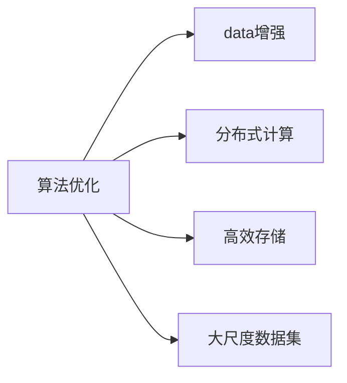
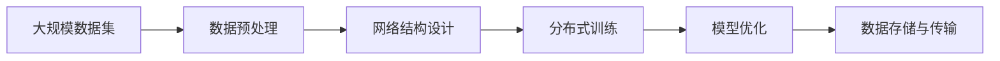

                 

# AI算法、算力与大数据的结合

> 关键词：算法优化, 数据增强, 分布式计算, 高效存储, 大尺度数据集

## 1. 背景介绍

### 1.1 问题由来
人工智能（AI）正逐渐成为推动各行各业创新和进步的关键驱动力。从自然语言处理（NLP）、计算机视觉（CV）到强化学习（RL），AI技术的核心都离不开算法的创新和优化。然而，这些算法的实际应用常常受到数据量和计算能力的制约。如何在有限的资源条件下，实现算法的最佳性能，成为亟待解决的重要课题。

大数据和高性能算力（HPC）的迅速发展为AI算法的优化提供了新的契机。大数据提供了丰富的数据来源，可以用于训练更加准确的模型；高性能算力则能够显著提高模型训练和推理的速度。但与此同时，大规模数据的存储、处理和传输也带来了新的挑战。如何有效结合大数据和算力，以实现AI算法的最佳性能，成为了AI技术发展中的一个关键问题。

### 1.2 问题核心关键点
在AI算法、算力与大数据结合的过程中，需要关注以下几个核心关键点：
1. 数据质量与标注：高质量的数据和有效的标注对于模型训练至关重要。数据缺失、噪音或标注错误可能导致模型性能下降。
2. 算法效率与可扩展性：算法的计算复杂度应尽可能低，同时能够在大规模数据集上高效运行。
3. 存储与传输效率：海量数据的存储和传输是计算资源利用的瓶颈，需要高效的存储和传输方法来减少成本和时间。
4. 分布式计算与并行处理：分布式计算架构可以充分利用多台计算资源的并行处理能力，提高模型训练和推理的速度。

### 1.3 问题研究意义
结合大数据、高算力和高效的算法，可以有效提升AI模型的性能，加速AI技术在各行业的应用。具体意义如下：
1. 提高模型准确性：大数据可以提供更多样化的训练样本，从而提高模型的泛化能力和准确性。
2. 缩短研发周期：高性能算力和大规模分布式计算可以大幅加快模型训练速度，缩短研发周期。
3. 降低运营成本：通过优化算法和存储方式，可以减少数据存储和传输成本，降低整体运营成本。
4. 实现更大规模应用：大规模数据和算力结合，可以实现更复杂、更全面的AI应用，推动AI技术在各个行业中的应用。
5. 增强鲁棒性和安全性：大数据和算力结合，可以实现更多样化的数据训练，增强模型的鲁棒性和安全性，减少错误和偏见。

## 2. 核心概念与联系

### 2.1 核心概念概述

结合AI算法、算力与大数据的核心概念包括：

- **算法优化**：通过数学、统计和计算机科学方法，优化算法的计算复杂度、内存占用和时间复杂度，以提高其在大数据和高性能计算环境下的性能。
- **数据增强**：通过数据清洗、扩充和增强等手段，提高数据质量和多样性，以增强模型的泛化能力和鲁棒性。
- **分布式计算**：利用多台计算机并行处理，通过分布式计算框架（如Hadoop、Spark）实现大规模数据集的高效计算。
- **高效存储**：通过存储技术和数据压缩算法，优化大规模数据的存储和传输，以减少计算成本和时间。
- **大尺度数据集**：通过收集和处理海量数据，构建大尺度数据集，为模型训练提供更多的训练样本和特征信息。

这些概念之间存在紧密的联系，如图中的Mermaid流程图所示。



算法优化是整个结合过程的核心，通过算法优化提高模型性能；数据增强和高效存储是数据处理的两个重要方面，提高数据质量和使用效率；分布式计算则提供高效计算能力，支持大规模数据集的处理；大尺度数据集则是提供丰富的训练样本和特征信息。

## 3. 核心算法原理 & 具体操作步骤
### 3.1 算法原理概述

结合AI算法、算力与大数据的根本目标是，在有限资源条件下，通过算法优化、数据增强、分布式计算和高效存储，实现模型性能的最佳平衡。

具体来说，算法优化主要关注以下几个方面：
1. **参数优化**：通过自动微分和优化算法（如Adam、SGD等），最小化模型的损失函数，调整模型参数，以提高模型性能。
2. **网络结构优化**：通过网络剪枝、模型压缩和量化等技术，减少模型复杂度，提高计算效率。
3. **并行处理优化**：通过并行计算和分布式计算，加速模型训练和推理过程。

### 3.2 算法步骤详解

结合AI算法、算力与大数据的过程可以分为以下几个关键步骤：

**Step 1: 数据预处理**
1. 数据收集：从多个数据源收集原始数据，并进行初步清洗和筛选。
2. 数据标注：对数据进行有效的标注，提供准确的训练信号。
3. 数据增强：对数据进行扩充和增强，增加数据多样性和数量。

**Step 2: 模型训练**
1. 选择算法：根据任务需求选择合适的AI算法，如卷积神经网络（CNN）、循环神经网络（RNN）、Transformer等。
2. 设计网络结构：设计合适的网络结构，确定网络层数、节点数等参数。
3. 设置训练参数：设置学习率、批次大小、优化器等训练参数。
4. 分布式训练：利用分布式计算框架，在多台计算机上并行训练模型。

**Step 3: 模型优化**
1. 参数优化：使用自动微分和优化算法，调整模型参数，最小化损失函数。
2. 网络结构优化：使用网络剪枝、模型压缩和量化等技术，减少模型复杂度。
3. 并行处理优化：利用并行计算和分布式计算，加速模型训练和推理过程。

**Step 4: 数据存储与传输**
1. 数据压缩：使用数据压缩算法，减少数据存储和传输的资源占用。
2. 分布式存储：利用分布式存储系统（如HDFS），实现大规模数据的高效存储。
3. 数据传输优化：优化数据传输协议和方式，减少数据传输时间。

### 3.3 算法优缺点

结合AI算法、算力与大数据的方法具有以下优点：
1. 提高模型性能：通过算法优化和大规模数据集训练，可以显著提高模型性能。
2. 加速模型训练：分布式计算和高性能算力可以大幅加速模型训练过程，缩短研发周期。
3. 降低存储和传输成本：通过高效存储和数据压缩，可以大幅降低数据存储和传输成本。
4. 实现更大规模应用：大尺度数据集和高算力结合，可以实现更复杂、更全面的AI应用。

但这些方法也存在一些缺点：
1. 数据质量依赖：算法和模型的性能高度依赖于数据质量，数据标注和清洗需要大量人力和时间。
2. 计算资源需求高：大规模数据集和高性能算力需要大量计算资源，成本较高。
3. 存储和传输瓶颈：海量数据的存储和传输可能成为计算资源的瓶颈。
4. 算法复杂度高：优化算法和网络结构设计复杂，需要较高的技术水平。

### 3.4 算法应用领域

结合AI算法、算力与大数据的方法广泛应用于以下几个领域：

- **自然语言处理（NLP）**：在语言模型训练、文本分类、机器翻译等任务中，通过大规模语料和大规模分布式计算，提升模型性能。
- **计算机视觉（CV）**：在图像识别、目标检测、图像生成等任务中，通过大尺度数据集和高效存储，提高模型准确性和鲁棒性。
- **推荐系统**：在大规模用户行为数据上训练推荐模型，通过分布式计算和高性能算力，提供个性化推荐服务。
- **金融风控**：在金融数据集上训练风控模型，通过数据增强和高效存储，提升模型的预测能力和鲁棒性。
- **医疗诊断**：在医疗影像数据上训练诊断模型，通过大尺度数据集和分布式计算，提高模型的诊断准确性和鲁棒性。

这些领域的应用展示了结合AI算法、算力与大数据的强大能力，为各个行业的数字化转型提供了有力支持。

## 4. 数学模型和公式 & 详细讲解 & 举例说明

### 4.1 数学模型构建

结合AI算法、算力与大数据的数学模型构建主要涉及以下几个方面：

- **损失函数设计**：根据具体任务设计合适的损失函数，如交叉熵损失、均方误差损失等。
- **模型参数优化**：通过自动微分和优化算法，最小化损失函数，调整模型参数。
- **网络结构设计**：设计合适的网络结构，如卷积神经网络、循环神经网络、Transformer等。

### 4.2 公式推导过程

以卷积神经网络（CNN）为例，介绍其在大数据和高性能计算环境下的训练过程。

CNN的损失函数可以表示为：

$$
\mathcal{L} = \frac{1}{N}\sum_{i=1}^N \sum_{j=1}^C \ell(y_i, \hat{y}_j)
$$

其中，$y_i$ 为真实标签，$\hat{y}_j$ 为模型预测的输出。损失函数 $\ell$ 根据具体任务选择，如交叉熵损失。

模型的前向传播过程可以表示为：

$$
z_{\theta}(x) = W_2 \cdot z_{\theta-1}(x) + b_2
$$

其中，$z_{\theta}(x)$ 为模型输出，$W_2$ 和 $b_2$ 为模型参数。

反向传播过程可以表示为：

$$
\frac{\partial \mathcal{L}}{\partial \theta} = \frac{1}{N}\sum_{i=1}^N \frac{\partial \ell(y_i, \hat{y})}{\partial z} \cdot \frac{\partial z}{\partial \theta}
$$

其中，$\frac{\partial \ell(y_i, \hat{y})}{\partial z}$ 为损失函数对模型输出的梯度，$\frac{\partial z}{\partial \theta}$ 为模型输出对模型参数的梯度。

通过反向传播，可以得到模型参数的更新公式：

$$
\theta \leftarrow \theta - \eta \cdot \frac{\partial \mathcal{L}}{\partial \theta}
$$

其中，$\eta$ 为学习率。

### 4.3 案例分析与讲解

以图像分类任务为例，展示CNN在大数据和高性能计算环境下的应用。

在图像分类任务中，通过大规模数据集（如ImageNet）训练CNN模型，如图中的流程图所示：



1. 数据预处理：对大规模图像数据进行清洗、标注和增强。
2. 网络结构设计：设计合适的卷积层、池化层和全连接层等网络结构。
3. 分布式训练：在多台计算机上并行训练模型，利用分布式计算加速训练过程。
4. 模型优化：通过参数优化、网络结构优化和并行处理优化，提高模型性能。
5. 数据存储与传输：使用数据压缩和分布式存储，减少数据存储和传输的资源占用。

## 5. 项目实践：代码实例和详细解释说明

### 5.1 开发环境搭建

在进行项目实践前，需要准备开发环境。以下是使用Python进行PyTorch开发的环境配置流程：

1. 安装Anaconda：从官网下载并安装Anaconda，用于创建独立的Python环境。

2. 创建并激活虚拟环境：
```bash
conda create -n pytorch-env python=3.8 
conda activate pytorch-env
```

3. 安装PyTorch：根据CUDA版本，从官网获取对应的安装命令。例如：
```bash
conda install pytorch torchvision torchaudio cudatoolkit=11.1 -c pytorch -c conda-forge
```

4. 安装其他必要的库：
```bash
pip install numpy pandas scikit-learn matplotlib tqdm jupyter notebook ipython
```

完成上述步骤后，即可在`pytorch-env`环境中开始项目实践。

### 5.2 源代码详细实现

下面我们以图像分类任务为例，给出使用PyTorch进行CNN模型训练的PyTorch代码实现。

首先，定义数据加载函数：

```python
import torch
from torch.utils.data import DataLoader
from torchvision import datasets, transforms

def load_data(batch_size):
    transform = transforms.Compose([
        transforms.Resize(224),
        transforms.ToTensor(),
        transforms.Normalize(mean=[0.485, 0.456, 0.406], std=[0.229, 0.224, 0.225])
    ])
    train_dataset = datasets.CIFAR10(root='./data', train=True, download=True, transform=transform)
    test_dataset = datasets.CIFAR10(root='./data', train=False, download=True, transform=transform)
    train_loader = DataLoader(train_dataset, batch_size=batch_size, shuffle=True, num_workers=4)
    test_loader = DataLoader(test_dataset, batch_size=batch_size, shuffle=False, num_workers=4)
    return train_loader, test_loader
```

然后，定义模型和优化器：

```python
import torch.nn as nn
import torch.optim as optim

class CNN(nn.Module):
    def __init__(self):
        super(CNN, self).__init__()
        self.conv1 = nn.Conv2d(3, 32, 3, 1, 1)
        self.pool = nn.MaxPool2d(2, 2)
        self.conv2 = nn.Conv2d(32, 64, 3, 1, 1)
        self.fc1 = nn.Linear(64 * 8 * 8, 128)
        self.fc2 = nn.Linear(128, 10)
    
    def forward(self, x):
        x = self.pool(F.relu(self.conv1(x)))
        x = self.pool(F.relu(self.conv2(x)))
        x = x.view(-1, 64 * 8 * 8)
        x = F.relu(self.fc1(x))
        x = self.fc2(x)
        return x

model = CNN()
criterion = nn.CrossEntropyLoss()
optimizer = optim.Adam(model.parameters(), lr=0.001)
```

接着，定义训练和评估函数：

```python
from tqdm import tqdm

def train_epoch(model, train_loader, optimizer, device):
    model.train()
    losses = []
    corrects = []
    with tqdm(total=len(train_loader)) as pbar:
        for i, (images, labels) in enumerate(train_loader):
            images, labels = images.to(device), labels.to(device)
            optimizer.zero_grad()
            outputs = model(images)
            loss = criterion(outputs, labels)
            losses.append(loss.item())
            _, predicted = torch.max(outputs.data, 1)
            corrects.append((predicted == labels).sum().item())
            loss.backward()
            optimizer.step()
            pbar.update(1)
    return sum(losses) / len(train_loader), sum(corrects) / len(train_loader.dataset)

def evaluate(model, test_loader, device):
    model.eval()
    losses = []
    corrects = []
    with tqdm(total=len(test_loader)) as pbar:
        for i, (images, labels) in enumerate(test_loader):
            images, labels = images.to(device), labels.to(device)
            outputs = model(images)
            loss = criterion(outputs, labels)
            losses.append(loss.item())
            _, predicted = torch.max(outputs.data, 1)
            corrects.append((predicted == labels).sum().item())
            pbar.update(1)
    return sum(losses) / len(test_loader), sum(corrects) / len(test_loader.dataset)
```

最后，启动训练流程并在测试集上评估：

```python
epochs = 10
batch_size = 64
device = torch.device('cuda' if torch.cuda.is_available() else 'cpu')

train_loader, test_loader = load_data(batch_size)

for epoch in range(epochs):
    train_loss, train_acc = train_epoch(model, train_loader, optimizer, device)
    test_loss, test_acc = evaluate(model, test_loader, device)
    print(f'Epoch {epoch+1}, train loss: {train_loss:.4f}, train acc: {train_acc:.4f}, test loss: {test_loss:.4f}, test acc: {test_acc:.4f}')
```

以上就是使用PyTorch进行图像分类任务训练的完整代码实现。可以看到，利用分布式计算框架（如DataLoader）可以显著提升模型训练的效率，利用GPU加速计算可以进一步提高训练速度。

### 5.3 代码解读与分析

让我们再详细解读一下关键代码的实现细节：

**数据加载函数**：
- `transforms.Compose`：定义数据增强和预处理步骤。
- `datasets.CIFAR10`：加载CIFAR-10数据集。
- `DataLoader`：创建数据加载器，支持并行加载数据。

**模型定义**：
- `nn.Conv2d`：定义卷积层。
- `nn.MaxPool2d`：定义池化层。
- `nn.Linear`：定义全连接层。
- `nn.CrossEntropyLoss`：定义交叉熵损失函数。
- `Adam`：定义优化器。

**训练和评估函数**：
- `train_epoch`：定义训练函数，计算损失和精度。
- `evaluate`：定义评估函数，计算测试集上的损失和精度。
- `tqdm`：用于进度条，加速显示训练过程。

**训练流程**：
- `epochs`：定义训练轮数。
- `batch_size`：定义批次大小。
- `device`：选择使用CPU还是GPU进行训练。
- `load_data`：加载训练和测试数据集。
- `for`循环：迭代训练轮次，计算损失和精度。
- `print`：输出训练和测试结果。

可以看到，PyTorch配合Dataloader和GPU加速，使得CNN模型的训练过程变得简洁高效。开发者可以将更多精力放在数据处理、模型改进等高层逻辑上，而不必过多关注底层的实现细节。

当然，工业级的系统实现还需考虑更多因素，如模型的保存和部署、超参数的自动搜索、更灵活的任务适配层等。但核心的结合范式基本与此类似。

## 6. 实际应用场景
### 6.1 智慧医疗

结合AI算法、算力与大数据的方法在智慧医疗领域有广泛应用。通过医疗影像数据集（如MRI、CT等）训练深度学习模型，可以辅助医生进行疾病诊断和治疗决策。

在实践中，可以利用大规模医疗影像数据集（如CheXNet、Radiology dataset）训练模型。模型训练过程中，使用数据增强和分布式计算，可以提高模型泛化能力和鲁棒性。在实际应用中，医生可以通过AI辅助诊断系统快速查看影像结果，辅助诊断疾病。

### 6.2 金融风险控制

金融领域的数据量巨大且复杂，结合AI算法、算力与大数据的方法可以用于风险控制和欺诈检测。通过金融交易数据集训练模型，可以实时监测交易异常，识别潜在的欺诈行为。

在实践中，可以利用金融交易数据集（如Kaggle的Credit Scoring dataset）训练模型。模型训练过程中，使用数据增强和分布式计算，可以提高模型泛化能力和鲁棒性。在实际应用中，银行和金融机构可以通过AI辅助风险控制系统实时监测交易行为，识别欺诈风险，降低金融损失。

### 6.3 智能推荐系统

结合AI算法、算力与大数据的方法可以用于构建智能推荐系统。通过用户行为数据集（如Amazon的product dataset）训练模型，可以为用户推荐个性化商品。

在实践中，可以利用用户行为数据集训练推荐模型。模型训练过程中，使用数据增强和分布式计算，可以提高模型泛化能力和鲁棒性。在实际应用中，电商平台可以为用户推荐个性化商品，提升用户体验和销售业绩。

### 6.4 未来应用展望

随着AI算法、算力与大数据的不断演进，结合方法的实际应用将更加广泛和深入。未来，结合方法将在更多领域得到应用，为各行各业带来变革性影响。

- **智能制造**：结合AI算法、算力与大数据，可以实现智能制造生产线，提高生产效率和产品质量。
- **智慧城市**：结合AI算法、算力与大数据，可以实现智慧城市管理，提高城市运行效率和居民生活质量。
- **智能交通**：结合AI算法、算力与大数据，可以实现智能交通系统，优化交通流量和减少拥堵。
- **智慧农业**：结合AI算法、算力与大数据，可以实现智慧农业系统，提高农作物产量和品质。

以上领域的应用展示了结合AI算法、算力与大数据的强大能力，为各个行业的数字化转型提供了有力支持。

## 7. 工具和资源推荐
### 7.1 学习资源推荐

为了帮助开发者系统掌握结合AI算法、算力与大数据的理论基础和实践技巧，这里推荐一些优质的学习资源：

1. **《Deep Learning with PyTorch》**：详细介绍了使用PyTorch进行深度学习的全过程，包括数据处理、模型训练和优化。

2. **《Distributed Computing with Spark》**：介绍了使用Spark进行大规模分布式计算的详细方法和技巧。

3. **《Machine Learning Mastery》**：提供了大量机器学习和深度学习的实际应用案例，帮助读者理解和掌握结合方法。

4. **《Big Data Essentials with Spark》**：介绍了使用Spark进行大数据处理的详细方法和技巧。

5. **《TensorFlow and Keras Deep Learning with Python》**：详细介绍了使用TensorFlow和Keras进行深度学习的全过程，包括模型训练和优化。

6. **《Big Data Analytics with Spark》**：介绍了使用Spark进行大数据分析的详细方法和技巧。

通过学习这些资源，相信你一定能够系统掌握结合AI算法、算力与大数据的方法，并用于解决实际的AI问题。

### 7.2 开发工具推荐

高效的开发离不开优秀的工具支持。以下是几款用于结合AI算法、算力与大数据开发的常用工具：

1. **PyTorch**：基于Python的开源深度学习框架，灵活动态的计算图，适合快速迭代研究。

2. **TensorFlow**：由Google主导开发的开源深度学习框架，生产部署方便，适合大规模工程应用。

3. **Hadoop**：大规模数据处理和分布式计算框架，支持海量数据的存储和处理。

4. **Spark**：基于内存计算的分布式计算框架，支持大规模数据集的快速处理。

5. **Hive**：基于Hadoop的数据仓库，支持结构化数据的存储和查询。

6. **Dask**：基于Python的分布式计算框架，支持多台计算机的并行计算。

合理利用这些工具，可以显著提升结合AI算法、算力与大数据的开发效率，加快创新迭代的步伐。

### 7.3 相关论文推荐

结合AI算法、算力与大数据的发展源于学界的持续研究。以下是几篇奠基性的相关论文，推荐阅读：

1. **《Imagenet Classification with Deep Convolutional Neural Networks》**：提出了卷积神经网络（CNN），并在ImageNet数据集上取得了很好的效果。

2. **《ImageNet Large Scale Visual Recognition Challenge》**：介绍了ImageNet大规模视觉识别挑战赛，展示了大数据在深度学习中的应用。

3. **《Distributed Training of Deep Neural Networks with Amazon Web Services》**：介绍了使用AWS进行分布式深度学习训练的方法和技巧。

4. **《Fast Data and Model Processing with Apache Spark》**：介绍了使用Spark进行大数据处理的详细方法和技巧。

5. **《TensorFlow: A System for Large-Scale Machine Learning》**：介绍了TensorFlow的架构和使用方法，展示了其在深度学习中的广泛应用。

6. **《Learning Phenomena with Deep Models》**：介绍了使用深度学习模型进行复杂现象学习的详细方法和技巧。

这些论文代表了大数据和算力结合方法的发展脉络，为结合AI算法、算力与大数据的研究提供了理论基础和实践指导。

## 8. 总结：未来发展趋势与挑战

### 8.1 总结

本文对结合AI算法、算力与大数据的方法进行了全面系统的介绍。首先阐述了结合方法在AI算法优化、数据增强、分布式计算和高效存储等方面的研究背景和意义，明确了结合方法在提升模型性能、加速模型训练、降低存储和传输成本等方面的重要作用。

通过本文的系统梳理，可以看到，结合AI算法、算力与大数据的方法正在成为AI技术发展的一个重要方向，极大地提升了AI模型的性能，加速了AI技术在各行业的应用。

### 8.2 未来发展趋势

结合AI算法、算力与大数据的未来发展趋势主要包括以下几个方面：

1. **更高效的算法**：未来的算法将更加注重计算效率和内存占用，进一步优化算法的计算复杂度和时间复杂度。
2. **更强大的模型**：结合方法将进一步推动深度学习模型的发展，构建更大规模、更复杂的模型。
3. **更高的算力需求**：随着模型复杂度的增加，对高性能计算资源的需求也将进一步提升。
4. **更广泛的应用场景**：结合方法将在更多领域得到应用，为各行各业带来变革性影响。
5. **更高的数据处理能力**：结合方法将推动大数据处理技术的进一步发展，支持更大规模数据集的处理。

### 8.3 面临的挑战

尽管结合AI算法、算力与大数据的方法已经取得了显著成就，但在实际应用中仍然面临诸多挑战：

1. **数据质量和标注成本**：高质量的数据和标注成本较高，获取数据和标注资源需要大量人力和时间。
2. **计算资源需求高**：大规模数据集和复杂模型需要大量的计算资源，成本较高。
3. **存储和传输瓶颈**：海量数据的存储和传输可能成为计算资源的瓶颈。
4. **算法复杂度高**：优化算法和网络结构设计复杂，需要较高的技术水平。
5. **模型泛化能力不足**：模型在新的数据集上泛化能力不足，需要进行更多的数据增强和模型优化。

### 8.4 研究展望

面对结合AI算法、算力与大数据所面临的挑战，未来的研究需要在以下几个方面寻求新的突破：

1. **优化算法和网络结构**：开发更加高效的算法和网络结构，提高模型的计算效率和内存占用。
2. **改进数据增强和标注方法**：开发更好的数据增强和标注方法，提高数据质量和多样性。
3. **优化分布式计算和存储**：开发更高效的分布式计算和存储方法，支持更大规模数据集的处理。
4. **提高模型泛化能力**：开发更好的模型泛化方法，提升模型在新数据集上的表现。
5. **结合多模态数据**：结合视觉、听觉、文本等多模态数据，构建更加全面、准确的AI模型。

这些研究方向的探索，必将引领结合AI算法、算力与大数据方法迈向更高的台阶，为构建安全、可靠、可解释、可控的智能系统铺平道路。面向未来，结合方法还需要与其他人工智能技术进行更深入的融合，如知识表示、因果推理、强化学习等，多路径协同发力，共同推动自然语言理解和智能交互系统的进步。

## 9. 附录：常见问题与解答

**Q1：结合AI算法、算力与大数据的实际应用有哪些？**

A: 结合AI算法、算力与大数据的实际应用非常广泛，涵盖了自然语言处理、计算机视觉、金融风控、智能推荐等多个领域。例如，在医疗领域，结合方法可以用于辅助疾病诊断和治疗决策；在金融领域，结合方法可以用于风险控制和欺诈检测；在推荐系统领域，结合方法可以用于构建个性化推荐引擎。

**Q2：结合AI算法、算力与大数据的过程包含哪些关键步骤？**

A: 结合AI算法、算力与大数据的过程主要包含以下几个关键步骤：
1. 数据预处理：收集、清洗和标注数据。
2. 模型训练：选择合适的算法和网络结构，训练模型。
3. 分布式计算：利用分布式计算框架，并行训练模型。
4. 模型优化：通过参数优化、网络结构优化和并行处理优化，提高模型性能。
5. 数据存储与传输：使用数据压缩和分布式存储，减少数据存储和传输的资源占用。

**Q3：结合AI算法、算力与大数据的实际应用中，如何处理大规模数据？**

A: 结合AI算法、算力与大数据的实际应用中，处理大规模数据通常采用以下几种方法：
1. 数据分块：将大规模数据分块处理，降低单个计算单元的负担。
2. 分布式计算：利用分布式计算框架（如Hadoop、Spark），并行处理大规模数据。
3. 数据压缩：使用数据压缩算法，减少数据存储和传输的资源占用。
4. 数据存储优化：使用高效的数据存储系统（如HDFS），支持大规模数据的存储和访问。

**Q4：结合AI算法、算力与大数据的实际应用中，如何提升模型性能？**

A: 结合AI算法、算力与大数据的实际应用中，提升模型性能通常采用以下几种方法：
1. 数据增强：通过数据清洗、扩充和增强，提高数据质量和多样性。
2. 算法优化：通过算法优化，减少计算复杂度和内存占用。
3. 网络结构优化：通过网络剪枝、模型压缩和量化等技术，减少模型复杂度。
4. 分布式计算：利用分布式计算框架，并行处理大规模数据集。
5. 模型优化：通过参数优化和模型压缩等方法，提高模型性能。

**Q5：结合AI算法、算力与大数据的实际应用中，如何降低计算成本？**

A: 结合AI算法、算力与大数据的实际应用中，降低计算成本通常采用以下几种方法：
1. 数据压缩：使用数据压缩算法，减少数据存储和传输的资源占用。
2. 分布式计算：利用分布式计算框架，并行处理大规模数据集。
3. 模型压缩：使用模型压缩技术，减少模型复杂度和内存占用。
4. 网络优化：优化网络结构，减少计算复杂度和内存占用。
5. 硬件加速：利用GPU、TPU等硬件加速设备，提高计算效率。

**Q6：结合AI算法、算力与大数据的实际应用中，如何提升模型泛化能力？**

A: 结合AI算法、算力与大数据的实际应用中，提升模型泛化能力通常采用以下几种方法：
1. 数据增强：通过数据清洗、扩充和增强，提高数据质量和多样性。
2. 模型优化：通过参数优化和模型压缩等方法，提高模型性能和泛化能力。
3. 分布式计算：利用分布式计算框架，并行处理大规模数据集。
4. 对抗训练：引入对抗样本，提高模型鲁棒性和泛化能力。
5. 多模态数据融合：结合视觉、听觉、文本等多模态数据，构建更加全面、准确的AI模型。

---

作者：禅与计算机程序设计艺术 / Zen and the Art of Computer Programming

