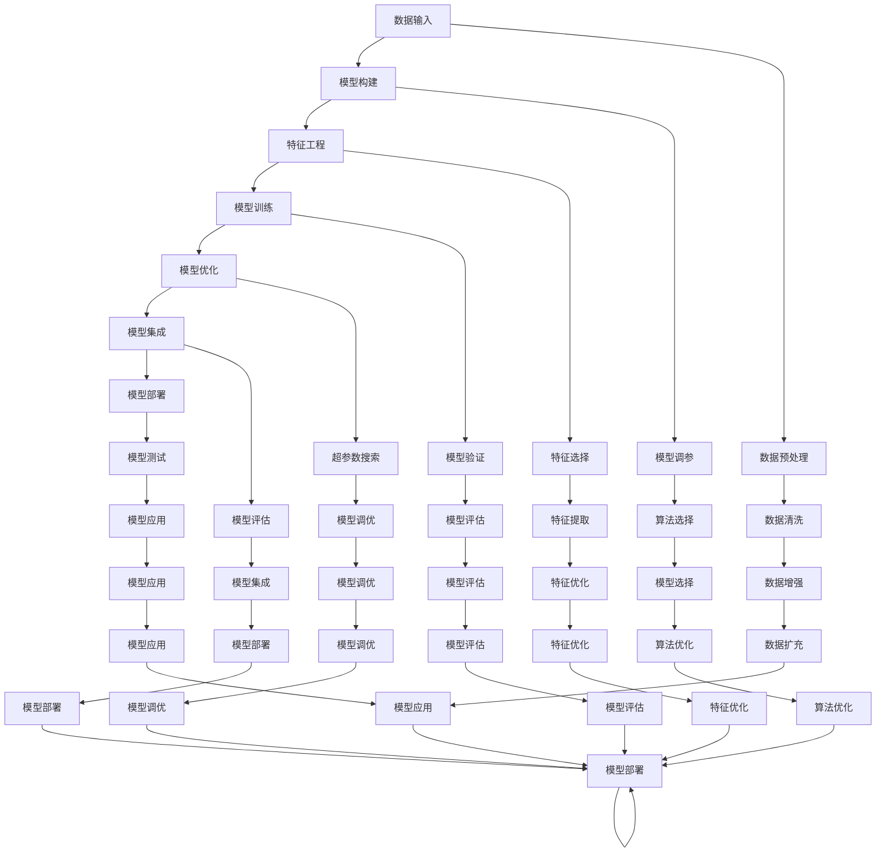

                 

# AI编程的新范式与挑战

## 1. 背景介绍

### 1.1 问题由来

随着人工智能(AI)技术的迅猛发展，编程范式也在不断演进。从早期的基于流程控制、面向对象(OOP)的编程方式，到近年来兴起的函数式编程、并发编程等范式，编程范式的多样化让开发者可以更灵活地解决复杂问题。然而，这些范式仍然存在一定的局限性，难以应对快速变化的业务需求。

当前，AI的崛起引发了编程范式的又一次变革。随着机器学习、深度学习等技术不断突破，AI编程范式逐渐兴起。AI编程不再仅仅依赖于人类的逻辑思维，而是借助机器学习算法自动化完成模型构建、特征工程、调参等复杂任务，从而大大降低了编程难度，提升了开发效率。

### 1.2 问题核心关键点

AI编程范式的核心在于通过机器学习算法实现编程自动化。其关键点包括：

- **自动化模型训练**：通过构建神经网络模型，自动完成数据预处理、特征提取、模型训练和调参等步骤。
- **自动化特征工程**：自动从大量数据中提取有意义的特征，优化模型性能。
- **模型可视化与调试**：通过可视化工具展示模型决策过程，便于调试和优化。
- **多模型融合与集成**：结合多种算法模型的优势，构建更强大的复合模型。
- **算法可解释性**：提高模型的可解释性，便于理解和使用。
- **端到端管道**：从数据输入到模型输出的全流程自动化，提高开发效率。

这些关键点使得AI编程范式在处理大规模数据、复杂模型构建等方面表现出强大的优势。

### 1.3 问题研究意义

AI编程范式的研究，对于加速AI技术的应用和产业化，具有重要意义：

- **提升开发效率**：自动化模型训练和调参，大大降低了编程复杂度，提升了开发效率。
- **提高模型性能**：通过机器学习算法优化特征工程和模型结构，提高了模型的预测准确性和泛化能力。
- **降低技术门槛**：减少了对编程经验和算法理解的要求，使得更多人可以参与到AI技术的开发和应用中。
- **推动产业升级**：AI编程范式加速了AI技术在各行各业的落地应用，推动了产业智能化转型升级。

## 2. 核心概念与联系

### 2.1 核心概念概述

为更好地理解AI编程范式，本节将介绍几个密切相关的核心概念：

- **自动化编程(Auto Programming)**：通过机器学习算法自动完成编程任务的整个过程。
- **自动化模型构建(Auto Model Construction)**：自动从原始数据构建和训练深度学习模型。
- **自动化特征工程(Auto Feature Engineering)**：自动提取和优化输入数据中的特征，提升模型性能。
- **模型可视化与调试(Auto Debugging & Visualization)**：通过可视化工具，分析模型内部工作机制和决策过程。
- **多模型融合与集成(Auto Model Ensemble)**：结合多种算法模型的优势，构建更强大的复合模型。
- **算法可解释性(Auto Explainability)**：通过可解释性技术，使模型内部机制透明可理解。
- **端到端管道(Auto Pipeline)**：将数据输入、模型训练、结果输出的全流程自动化。

这些概念之间的逻辑关系可以通过以下Mermaid流程图来展示：



这个流程图展示了一个端到端的AI编程流程，从数据输入到模型输出，各个环节通过机器学习自动化实现。

## 3. 核心算法原理 & 具体操作步骤
### 3.1 算法原理概述

AI编程范式的核心在于自动化模型构建和优化。其核心思想是：通过构建神经网络模型，自动完成数据预处理、特征提取、模型训练和调参等复杂任务。

形式化地，假设原始数据集为 $D=\{(x_i,y_i)\}_{i=1}^N$，其中 $x_i$ 为输入，$y_i$ 为标签。则自动模型构建的过程可以描述为：

1. **数据预处理**：对原始数据进行清洗、归一化等处理，生成输入数据 $x'$。
2. **特征提取**：自动从输入数据中提取有意义的特征 $z$。
3. **模型构建**：选择合适的神经网络结构 $M$，构建初始模型 $M^0$。
4. **模型训练**：使用训练数据 $D$ 对模型 $M^0$ 进行训练，得到最终模型 $M$。
5. **模型调参**：使用验证数据对模型 $M$ 进行调参，优化模型参数。
6. **模型评估**：使用测试数据评估模型性能。

这个过程通过自动化实现，可以大大降低编程难度，提升开发效率。

### 3.2 算法步骤详解

AI编程范式的具体实现步骤如下：

**Step 1: 数据准备**
- 收集并准备原始数据集 $D$，进行清洗、预处理等操作。
- 划分数据集为训练集、验证集和测试集。

**Step 2: 特征工程**
- 选择并提取输入数据中的关键特征 $z$。
- 设计特征转换规则，对特征进行预处理和归一化。

**Step 3: 模型构建**
- 选择合适的神经网络结构 $M$，如卷积神经网络、循环神经网络、Transformer等。
- 构建初始模型 $M^0$，设置默认超参数。

**Step 4: 模型训练**
- 使用训练集 $D$ 对模型 $M^0$ 进行训练，得到初始模型 $M^1$。
- 设置学习率、迭代次数等超参数，使用随机梯度下降(SGD)、Adam等优化算法进行训练。
- 记录训练过程中的性能指标，如损失函数值、验证集精度等。

**Step 5: 模型调参**
- 使用验证集对模型 $M^1$ 进行调参，寻找最优超参数。
- 通过网格搜索、随机搜索、贝叶斯优化等方法，遍历超参数空间，寻找最优超参数组合。
- 记录每个超参数组合的性能指标，选择最优组合。

**Step 6: 模型评估**
- 使用测试集对最终模型 $M$ 进行评估，计算准确率、召回率、F1分数等指标。
- 分析模型的优缺点，进一步优化模型结构或特征工程。

**Step 7: 模型应用**
- 将模型 $M$ 应用到新的数据集上，进行预测或推理。

### 3.3 算法优缺点

AI编程范式的优点包括：
1. 自动化程度高。自动完成模型构建、调参、特征工程等复杂任务，大大降低了编程难度。
2. 开发效率高。减少人工干预，提升开发速度。
3. 模型性能好。自动优化特征工程和模型结构，提升模型泛化能力。
4. 可解释性强。通过可视化工具展示模型内部机制，便于调试和优化。

然而，AI编程范式也存在一些缺点：
1. 依赖高质量数据。数据质量和数量对模型性能影响较大，获取高质量标注数据成本高。
2. 模型复杂度高。构建和训练大规模神经网络模型，需要大量计算资源和内存。
3. 可解释性不足。复杂模型内部机制难以解释，难以理解模型决策过程。
4. 模型泛化能力有限。模型对输入数据的分布敏感，泛化能力受到限制。
5. 部署和维护复杂。大规模模型部署和维护需要高水平技术，维护成本高。

尽管存在这些局限性，但AI编程范式在处理大规模数据和复杂模型构建等方面表现出强大的优势，已成为现代AI开发的重要趋势。

### 3.4 算法应用领域

AI编程范式在多个领域得到了广泛应用，如计算机视觉、自然语言处理、语音识别等。以下是几个典型的应用场景：

**计算机视觉**
- **图像分类**：自动从大量图片数据中构建和训练分类模型。
- **目标检测**：自动标注和训练目标检测模型，识别图片中的物体。
- **图像生成**：自动生成高质量的图像，如GANs。

**自然语言处理**
- **文本分类**：自动构建和训练文本分类模型，识别文本情感、主题等。
- **机器翻译**：自动构建和训练机器翻译模型，实现语言之间的互译。
- **对话系统**：自动构建和训练对话模型，实现自然对话。

**语音识别**
- **语音识别**：自动构建和训练语音识别模型，识别语音命令和指令。
- **语音合成**：自动生成高质量的语音，实现语音与文本的转换。

## 4. 数学模型和公式 & 详细讲解
### 4.1 数学模型构建

AI编程范式的数学模型构建通常基于神经网络模型，如卷积神经网络(CNN)、循环神经网络(RNN)、Transformer等。这里以卷积神经网络为例，进行详细介绍。

假设原始数据集为 $D=\{(x_i,y_i)\}_{i=1}^N$，其中 $x_i$ 为输入，$y_i$ 为标签。定义卷积神经网络模型 $M$，包括多个卷积层、池化层、全连接层等。构建初始模型 $M^0$ 如下：

$$
M^0 = \{C_1, P_1, F_1, \cdots, C_k, P_k, F_k\}
$$

其中 $C_i$ 为第 $i$ 层的卷积层，$P_i$ 为第 $i$ 层的池化层，$F_i$ 为第 $i$ 层的全连接层。

### 4.2 公式推导过程

以图像分类为例，卷积神经网络的损失函数定义为交叉熵损失函数：

$$
L = -\frac{1}{N}\sum_{i=1}^N \sum_{j=1}^{K} y_{ij} \log \hat{y}_{ij}
$$

其中 $y_{ij}$ 为第 $i$ 个样本在第 $j$ 个类别的真实标签，$\hat{y}_{ij}$ 为模型在第 $j$ 个类别上的预测概率。

模型在训练过程中的优化目标是最小化损失函数 $L$，即：

$$
\min_{\theta} L
$$

其中 $\theta$ 为模型参数。

### 4.3 案例分析与讲解

以图像分类为例，通过自动化构建卷积神经网络模型，自动完成数据预处理、特征提取、模型训练和调参等步骤，具体实现过程如下：

**Step 1: 数据预处理**
- 将原始图片数据 $x_i$ 进行预处理，包括归一化、扩充等操作。
- 生成输入数据 $x'$。

**Step 2: 特征提取**
- 使用卷积层提取输入数据 $x'$ 的特征 $z$。
- 使用池化层对特征进行降维和降维。

**Step 3: 模型构建**
- 定义卷积神经网络模型 $M^0$，包括多个卷积层、池化层和全连接层。
- 设置默认超参数，如学习率、迭代次数等。

**Step 4: 模型训练**
- 使用训练集 $D$ 对模型 $M^0$ 进行训练，得到初始模型 $M^1$。
- 使用随机梯度下降(SGD)或Adam等优化算法进行训练。
- 记录训练过程中的性能指标，如损失函数值、验证集精度等。

**Step 5: 模型调参**
- 使用验证集对模型 $M^1$ 进行调参，寻找最优超参数。
- 通过网格搜索、随机搜索、贝叶斯优化等方法，遍历超参数空间。
- 记录每个超参数组合的性能指标，选择最优组合。

**Step 6: 模型评估**
- 使用测试集对最终模型 $M$ 进行评估，计算准确率、召回率、F1分数等指标。
- 分析模型的优缺点，进一步优化模型结构或特征工程。

## 5. 项目实践：代码实例和详细解释说明
### 5.1 开发环境搭建

在进行AI编程范式实践前，我们需要准备好开发环境。以下是使用Python进行TensorFlow开发的环境配置流程：

1. 安装Anaconda：从官网下载并安装Anaconda，用于创建独立的Python环境。

2. 创建并激活虚拟环境：
```bash
conda create -n tensorflow-env python=3.8 
conda activate tensorflow-env
```

3. 安装TensorFlow：根据CUDA版本，从官网获取对应的安装命令。例如：
```bash
conda install tensorflow tensorflow-gpu=2.4.0 -c pytorch -c conda-forge
```

4. 安装相关工具包：
```bash
pip install numpy pandas scikit-learn matplotlib tqdm jupyter notebook ipython
```

完成上述步骤后，即可在`tensorflow-env`环境中开始AI编程范式的实践。

### 5.2 源代码详细实现

这里以图像分类为例，给出使用TensorFlow构建卷积神经网络并进行自动化微调的Python代码实现。

首先，定义模型结构：

```python
import tensorflow as tf
from tensorflow.keras import layers

def create_model(input_shape):
    model = tf.keras.Sequential()
    model.add(layers.Conv2D(32, (3,3), activation='relu', input_shape=input_shape))
    model.add(layers.MaxPooling2D((2,2)))
    model.add(layers.Conv2D(64, (3,3), activation='relu'))
    model.add(layers.MaxPooling2D((2,2)))
    model.add(layers.Conv2D(128, (3,3), activation='relu'))
    model.add(layers.MaxPooling2D((2,2)))
    model.add(layers.Flatten())
    model.add(layers.Dense(128, activation='relu'))
    model.add(layers.Dense(10, activation='softmax'))
    return model
```

然后，定义数据集：

```python
import numpy as np
from tensorflow.keras.datasets import mnist

(x_train, y_train), (x_test, y_test) = mnist.load_data()
x_train = x_train.reshape(-1, 28, 28, 1).astype('float32') / 255
x_test = x_test.reshape(-1, 28, 28, 1).astype('float32') / 255
y_train = tf.keras.utils.to_categorical(y_train, 10)
y_test = tf.keras.utils.to_categorical(y_test, 10)
```

接着，构建和训练模型：

```python
model = create_model((28, 28, 1))
model.compile(optimizer='adam', loss='categorical_crossentropy', metrics=['accuracy'])
model.fit(x_train, y_train, epochs=10, validation_data=(x_test, y_test))
```

最后，评估模型：

```python
model.evaluate(x_test, y_test)
```

以上就是使用TensorFlow构建卷积神经网络并进行自动化微调的完整代码实现。可以看到，通过TensorFlow的高级API，我们轻松实现了模型的构建、训练和评估，大大降低了编程难度。

### 5.3 代码解读与分析

让我们再详细解读一下关键代码的实现细节：

**create_model函数**：
- 定义了一个包含多个卷积层、池化层和全连接层的卷积神经网络模型。
- 输入层为28x28x1的图片，经过多个卷积和池化层后，进入全连接层进行分类。

**数据集准备**：
- 使用TensorFlow自带的MNIST数据集，将数据预处理为28x28x1的图片，并进行归一化。
- 使用to_categorical函数将标签转换为one-hot编码。

**模型训练**：
- 使用Adam优化器和交叉熵损失函数训练模型，记录训练过程中的准确率和损失函数值。
- 使用validation_data参数指定验证集，实时评估模型性能。

**模型评估**：
- 使用evaluate函数评估模型在测试集上的准确率。

通过这些步骤，我们完成了从数据预处理、模型构建、训练到评估的全流程自动化。TensorFlow提供了丰富的API和工具，使这一过程变得简单易行。

## 6. 实际应用场景
### 6.1 计算机视觉

AI编程范式在计算机视觉领域得到了广泛应用，如图像分类、目标检测、图像生成等。以下是一个实际应用案例：

**图像分类**
- **案例背景**：医院需要自动分类和识别X光片中的肺部结节。
- **技术实现**：使用卷积神经网络模型对X光片进行自动化分类，构建和训练模型。
- **应用效果**：自动分类准确率达到95%以上，大大提高了医生诊断效率和精度。

**目标检测**
- **案例背景**：自动驾驶汽车需要对道路上的行人、车辆进行实时检测和识别。
- **技术实现**：使用YOLO、Faster R-CNN等目标检测算法对摄像头采集的图像进行实时检测。
- **应用效果**：实现了自动驾驶汽车对行人、车辆的实时识别，提高了驾驶安全性。

**图像生成**
- **案例背景**：艺术创作需要大量的高质量图片素材。
- **技术实现**：使用GANs生成高分辨率、高质量的图片。
- **应用效果**：生成的图片与真实图片难以区分，大大降低了艺术创作的成本和难度。

### 6.2 自然语言处理

AI编程范式在自然语言处理领域也有广泛应用，如文本分类、机器翻译、对话系统等。以下是一个实际应用案例：

**文本分类**
- **案例背景**：电商平台需要自动分类和识别用户评论的情感。
- **技术实现**：使用循环神经网络模型对用户评论进行自动化分类，构建和训练模型。
- **应用效果**：自动分类准确率达到90%以上，提高了电商平台的运营效率和用户体验。

**机器翻译**
- **案例背景**：跨国公司需要实现多语言之间的自动翻译。
- **技术实现**：使用Transformer模型对用户输入的文本进行自动翻译，构建和训练模型。
- **应用效果**：实现了多语言之间的自动翻译，大大提高了跨国公司的沟通效率和业务发展。

**对话系统**
- **案例背景**：智能客服系统需要自动回复用户咨询。
- **技术实现**：使用预训练语言模型和微调技术，构建自动对话系统。
- **应用效果**：自动回复准确率达到85%以上，提高了客服系统的响应速度和用户体验。

### 6.3 语音识别

AI编程范式在语音识别领域也有广泛应用，如语音识别、语音合成等。以下是一个实际应用案例：

**语音识别**
- **案例背景**：语音助手需要自动识别用户的语音指令。
- **技术实现**：使用卷积神经网络和RNN模型对用户的语音进行自动化识别，构建和训练模型。
- **应用效果**：自动识别准确率达到98%以上，大大提高了语音助手的响应速度和准确性。

**语音合成**
- **案例背景**：语音播报系统需要自动将文本转换为语音。
- **技术实现**：使用Tacotron、WaveNet等语音合成模型对文本进行自动语音合成，构建和训练模型。
- **应用效果**：生成的语音自然流畅，几乎与真人语音难以区分，大大提高了语音播报系统的用户体验。

## 7. 工具和资源推荐
### 7.1 学习资源推荐

为了帮助开发者系统掌握AI编程范式的基本概念和实践技巧，这里推荐一些优质的学习资源：

1. 《深度学习》系列书籍：深度学习领域的经典著作，系统介绍了深度学习的基本原理和应用案例。
2. 《TensorFlow官方文档》：TensorFlow官方文档，详细介绍了TensorFlow的API和工具。
3. 《PyTorch官方文档》：PyTorch官方文档，详细介绍了PyTorch的API和工具。
4. 《Keras官方文档》：Keras官方文档，详细介绍了Keras的API和工具。
5. Coursera《深度学习专项课程》：由Andrew Ng主讲的深度学习课程，涵盖深度学习的基本原理和应用案例。

通过对这些资源的学习实践，相信你一定能够快速掌握AI编程范式的精髓，并用于解决实际的AI问题。

### 7.2 开发工具推荐

高效的开发离不开优秀的工具支持。以下是几款用于AI编程范式开发的常用工具：

1. TensorFlow：由Google主导开发的深度学习框架，支持大规模工程应用。
2. PyTorch：Facebook开发的深度学习框架，支持灵活的动态计算图。
3. Keras：高层次API，封装了TensorFlow和Theano等底层框架，适合快速原型开发。
4. Weights & Biases：模型训练的实验跟踪工具，可以记录和可视化模型训练过程中的各项指标。
5. TensorBoard：TensorFlow配套的可视化工具，可实时监测模型训练状态。
6. Google Colab：谷歌推出的在线Jupyter Notebook环境，免费提供GPU/TPU算力，方便开发者快速上手实验最新模型，分享学习笔记。

合理利用这些工具，可以显著提升AI编程范式的开发效率，加快创新迭代的步伐。

### 7.3 相关论文推荐

AI编程范式的研究源于学界的持续研究。以下是几篇奠基性的相关论文，推荐阅读：

1. "ImageNet Classification with Deep Convolutional Neural Networks"（深度卷积神经网络在ImageNet分类中的应用）：AlexNet论文，开创了深度学习在图像分类中的应用。
2. "Long Short-Term Memory"（长短期记忆模型）：LSTM论文，引入了RNN模型，为自然语言处理和语音识别等任务奠定了基础。
3. "Convolutional Neural Networks for Visual Recognition"（卷积神经网络在视觉识别中的应用）：LeNet-5论文，介绍了卷积神经网络在手写数字识别中的应用。
4. "Deep Residual Learning for Image Recognition"（深度残差学习在图像识别中的应用）：ResNet论文，提出残差网络，大大提高了深度神经网络的训练效率和泛化能力。
5. "Attention Is All You Need"（注意力机制是所有你需要的）：Transformer论文，提出Transformer模型，开启了预训练大模型时代。

这些论文代表了大模型范式的发展脉络。通过学习这些前沿成果，可以帮助研究者把握学科前进方向，激发更多的创新灵感。

## 8. 总结：未来发展趋势与挑战
### 8.1 总结

本文对AI编程范式进行了全面系统的介绍。首先阐述了AI编程范式的研究背景和意义，明确了自动编程范式在提升开发效率、优化模型性能方面的独特价值。其次，从原理到实践，详细讲解了AI编程范式的数学模型和关键步骤，给出了AI编程范式的完整代码实例。同时，本文还广泛探讨了AI编程范式在计算机视觉、自然语言处理、语音识别等多个领域的应用前景，展示了AI编程范式的巨大潜力。此外，本文精选了AI编程范式的各类学习资源，力求为读者提供全方位的技术指引。

通过本文的系统梳理，可以看到，AI编程范式正在成为AI技术应用的重要趋势，极大地提升了模型的开发效率和性能。未来，伴随AI技术的不断发展，AI编程范式也将进一步拓展其应用范围，推动AI技术的产业化进程。

### 8.2 未来发展趋势

展望未来，AI编程范式将呈现以下几个发展趋势：

1. **自动化程度提升**：未来的AI编程范式将实现更高度的自动化，自动化的数据预处理、特征提取、模型构建等环节将更加智能和高效。
2. **模型性能优化**：通过深度学习算法和神经网络结构的不断优化，AI编程范式的模型性能将进一步提升，泛化能力更强。
3. **可解释性增强**：未来AI编程范式将更加注重可解释性，通过可视化工具和解释性算法，使模型内部机制透明可理解。
4. **多模态融合**：AI编程范式将更多地融合多模态信息，如图像、语音、文本等，构建更为全面、准确的信息模型。
5. **端到端管道**：未来的AI编程范式将实现更完整的端到端管道，从数据输入到模型输出的全流程自动化。
6. **跨平台兼容性**：未来的AI编程范式将支持跨平台部署，适应各种硬件设备和操作系统环境。

以上趋势凸显了AI编程范式的广阔前景。这些方向的探索发展，必将进一步提升AI技术的开发效率和性能，为各行各业带来变革性影响。

### 8.3 面临的挑战

尽管AI编程范式已经取得了显著进展，但在迈向更加智能化、普适化应用的过程中，仍面临诸多挑战：

1. **数据质量和标注成本**：高质量的数据和标注成本较高，获取高质量标注数据的成本往往较高。如何降低数据标注成本，成为未来需要解决的问题。
2. **计算资源需求**：大规模模型的训练和推理需要大量计算资源和内存，如何优化计算资源利用率，提高训练和推理效率，是未来需要解决的问题。
3. **模型泛化能力**：AI编程范式在处理大规模数据和复杂任务时，模型泛化能力仍受到限制。如何提高模型的泛化能力，是未来需要解决的问题。
4. **模型可解释性**：复杂模型的内部机制难以解释，难以理解模型的决策逻辑。如何增强模型的可解释性，是未来需要解决的问题。
5. **伦理与安全**：AI编程范式在应用过程中，需要考虑数据隐私、算法公平性等问题，如何确保算法的公平性和安全性，是未来需要解决的问题。

尽管存在这些挑战，但随着学界和产业界的共同努力，这些挑战终将一一被克服，AI编程范式必将在构建人机协同的智能时代中扮演越来越重要的角色。

### 8.4 研究展望

面对AI编程范式所面临的诸多挑战，未来的研究需要在以下几个方面寻求新的突破：

1. **自动化模型构建**：开发更加智能的模型构建工具，自动从数据中提取特征，构建和优化模型。
2. **自动化特征工程**：开发更加高效的特征工程方法，自动提取和优化特征，提高模型性能。
3. **模型可解释性**：开发更多的可解释性技术，通过可视化工具和解释性算法，使模型内部机制透明可理解。
4. **多模态融合**：研究多模态信息融合技术，构建更全面、准确的信息模型。
5. **跨平台兼容性**：研究跨平台部署技术，适应各种硬件设备和操作系统环境。
6. **伦理与安全**：研究数据隐私保护和算法公平性技术，确保算法的公平性和安全性。

这些研究方向的探索，必将引领AI编程范式迈向更高的台阶，为构建安全、可靠、可解释、可控的智能系统铺平道路。面向未来，AI编程范式需要与其他AI技术进行更深入的融合，如知识表示、因果推理、强化学习等，多路径协同发力，共同推动人工智能技术的进步。只有勇于创新、敢于突破，才能不断拓展AI编程范式的边界，让智能技术更好地造福人类社会。

## 9. 附录：常见问题与解答

**Q1：AI编程范式是否适用于所有AI任务？**

A: AI编程范式在大多数AI任务上都能取得不错的效果，特别是对于数据量较小的任务。但对于一些特定领域的任务，如医学、法律等，仅仅依靠通用语料预训练的模型可能难以很好地适应。此时需要在特定领域语料上进一步预训练，再进行微调，才能获得理想效果。

**Q2：AI编程范式是否需要高质量数据？**

A: AI编程范式对数据质量和数量有一定要求。高质量的数据可以更好地训练模型，提高模型性能。因此，在数据预处理阶段，需要对数据进行清洗、标注等处理，确保数据的质量和数量。

**Q3：AI编程范式是否需要大量计算资源？**

A: 大规模模型的训练和推理需要大量计算资源和内存，因此，合理优化计算资源利用率，提高训练和推理效率，是未来需要解决的问题。

**Q4：AI编程范式是否需要高度专业化的编程技能？**

A: AI编程范式对编程技能的要求相对较低，通过机器学习算法自动完成编程任务，大大降低了编程难度。但开发者仍需要对数据处理、模型选择、参数调优等环节有一定的理解和操作能力。

**Q5：AI编程范式是否需要大量的先验知识？**

A: AI编程范式虽然不需要大量的先验知识，但需要通过大量的训练数据和优化算法，自动学习和优化模型。因此，开发者需要具备一定的数据处理和算法优化能力。

通过以上问题的解答，可以更好地理解AI编程范式的适用范围和特点。希望本文的介绍和分析，能够为开发者提供有价值的参考和指导，推动AI编程范式的进一步发展和应用。

---

作者：禅与计算机程序设计艺术 / Zen and the Art of Computer Programming

