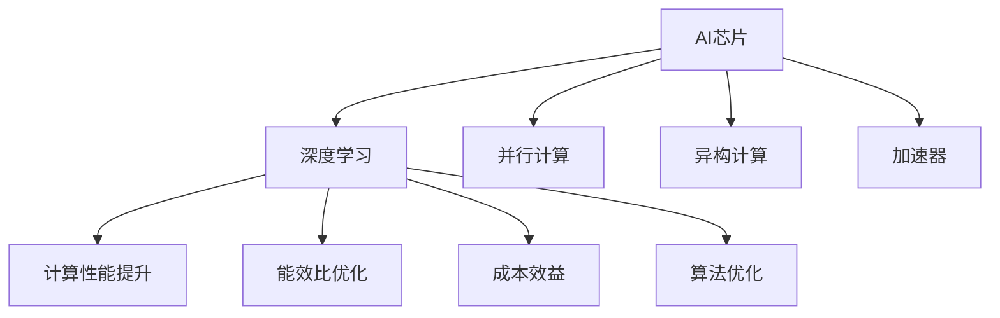

                 

# AI芯片技术对大模型发展的推动作用

> 关键词：AI芯片,大模型,深度学习,异构计算,加速器,硬件优化

## 1. 背景介绍

### 1.1 问题由来
近年来，人工智能(AI)技术迅速发展，深度学习和大模型的应用范围不断扩大，从自然语言处理(NLP)到计算机视觉(CV)，从自动驾驶到医疗健康，各个领域都在积极探索和应用大模型的潜力。然而，随着模型参数量的激增，对计算资源的需求也迅速增长。特别是大模型的训练和推理需要耗费巨大的计算资源，这对传统硬件设施构成了巨大的压力。

为了应对这一挑战，AI芯片技术应运而生。AI芯片，也称为加速器，是一种专门为深度学习任务设计的硬件设备，能够提供比传统CPU/GPU更高的计算性能和更低的能耗。AI芯片的出现，极大地推动了大模型的发展和应用。

### 1.2 问题核心关键点
AI芯片对大模型发展的推动作用主要体现在以下几个方面：

- **计算性能提升**：AI芯片通过高效的并行计算和数据加速，显著提高了深度学习的训练和推理速度。
- **能效比优化**：AI芯片在提高性能的同时，显著降低了功耗，延长了设备的使用寿命。
- **成本效益**：AI芯片的定制化设计和批量生产，降低了深度学习任务的硬件成本。
- **硬件支持与优化**：AI芯片的硬件架构和设计特性，支持深度学习算法的优化实现，提升算法的性能和可靠性。

## 2. 核心概念与联系

### 2.1 核心概念概述

AI芯片技术的核心概念包括：

- **AI芯片**：专为深度学习任务设计的高性能硬件设备，能够提供极高的计算性能和能效比。
- **深度学习**：一种机器学习技术，通过多层神经网络模型，实现对复杂数据的自动学习和推理。
- **并行计算**：利用多个处理器同时执行任务，提高计算效率。
- **异构计算**：利用不同类型和结构的硬件设备，优化深度学习任务的性能。
- **加速器**：除了传统CPU/GPU，还包括各种专用硬件，如FPGA、ASIC、TPU等。

这些核心概念之间通过高性能计算、能效比提升、成本效益优化、算法优化等方式紧密联系，共同推动了大模型在各个领域的应用和发展。

### 2.2 核心概念原理和架构的 Mermaid 流程图



通过这张流程图，我们可以清晰地看到AI芯片、深度学习、并行计算、异构计算和加速器之间的联系和相互作用。

## 3. 核心算法原理 & 具体操作步骤

### 3.1 算法原理概述

AI芯片对大模型发展的推动作用，主要体现在以下几个算法原理：

- **并行计算优化**：AI芯片通过大规模的并行计算，显著提高了深度学习模型的训练和推理速度。例如，TPU（Tensor Processing Unit）可以同时处理多个数据流，从而加快计算速度。
- **数据加速与优化**：AI芯片通过专用的硬件加速器，如GPU、FPGA等，加速数据存储和传输，提高了深度学习模型的性能。
- **模型压缩与量化**：AI芯片的硬件特性支持模型压缩和量化技术，进一步减小了模型的参数量和计算复杂度。
- **算法优化与支持**：AI芯片的硬件架构支持深度学习算法的优化实现，提升了算法的性能和可靠性。

### 3.2 算法步骤详解

基于AI芯片的大模型发展步骤主要包括以下几个关键环节：

1. **硬件选择与配置**：根据大模型规模和任务需求，选择合适的AI芯片硬件，并进行必要的配置和调优。
2. **模型设计**：设计适用于AI芯片的深度学习模型，利用硬件特性进行优化。
3. **数据预处理**：对输入数据进行格式转换和预处理，确保数据适配AI芯片硬件。
4. **训练与推理**：在AI芯片上进行模型的训练和推理，利用硬件加速提升性能。
5. **结果后处理**：对推理结果进行后处理和优化，确保输出符合实际应用需求。

### 3.3 算法优缺点

AI芯片技术在大模型发展中具有以下优点：

- **高性能计算**：AI芯片通过大规模并行计算，显著提升了深度学习模型的计算性能。
- **低能耗设计**：AI芯片通过优化能效比设计，降低了深度学习任务的能耗，延长了设备的使用寿命。
- **成本效益**：AI芯片的定制化设计和批量生产，降低了深度学习任务的硬件成本。
- **算法优化支持**：AI芯片的硬件架构支持深度学习算法的优化实现，提升了算法的性能和可靠性。

同时，AI芯片技术也存在一些缺点：

- **复杂性**：AI芯片的设计和调试较为复杂，需要专业的硬件知识。
- **兼容性**：AI芯片的硬件和软件需要与深度学习框架兼容，有时需要进行定制化开发。
- **设备成本**：高性能AI芯片设备成本较高，对小规模项目可能不经济。
- **通用性**：一些AI芯片设备可能不具备通用性，只能用于特定的深度学习任务。

### 3.4 算法应用领域

AI芯片技术在大模型发展的各个领域均有广泛应用：

- **计算机视觉(CV)**：用于图像分类、目标检测、图像生成等任务。
- **自然语言处理(NLP)**：用于语言模型训练、对话系统、机器翻译等任务。
- **自动驾驶**：用于图像处理、决策支持、路径规划等任务。
- **医疗健康**：用于医学影像分析、疾病预测、药物研发等任务。
- **金融科技**：用于风险评估、交易策略、欺诈检测等任务。

## 4. 数学模型和公式 & 详细讲解

### 4.1 数学模型构建

基于AI芯片的大模型发展，其数学模型主要涉及深度学习模型的训练和推理过程。以卷积神经网络(CNN)为例，其数学模型构建如下：

- **输入层**：表示输入数据，如图像像素值。
- **卷积层**：通过卷积操作提取特征。
- **激活函数层**：引入非线性变换，增强模型表达能力。
- **池化层**：对特征进行降维和提取。
- **全连接层**：将池化后的特征进行线性变换，输出预测结果。

### 4.2 公式推导过程

以CNN为例，其数学模型公式推导如下：

- **输入数据**：$x_{i,j} \in \mathbb{R}^c$，其中 $c$ 表示输入通道数。
- **卷积核**：$w_{k,l} \in \mathbb{R}^c$，其中 $k$ 表示核的高，$l$ 表示核的宽。
- **卷积操作**：$y_{i,j}=\sum_{k=0}^{K-1}\sum_{l=0}^{L-1}x_{i+k,j+l}\cdot w_{k,l}$，其中 $K$ 表示核的大小，$L$ 表示核的步长。
- **激活函数**：$f(y_{i,j})=ReLU(y_{i,j})$。
- **池化操作**：$p_{i,j}=\frac{1}{k}\sum_{k=0}^{K-1}\sum_{l=0}^{L-1}y_{i+k,j+l}$。
- **全连接层**：$z=\sum_{i=0}^{I-1}\sum_{j=0}^{J-1}p_{i,j}\cdot w_i+b$，其中 $I$ 表示全连接层的输入维度，$J$ 表示输出维度，$w_i$ 表示全连接层权重，$b$ 表示偏置。
- **输出**：$s=softmax(z)$。

### 4.3 案例分析与讲解

以ImageNet大规模视觉识别挑战为例，通过使用AI芯片进行模型训练和推理，可以显著提升模型性能：

- **数据准备**：收集和标注ImageNet数据集，分为训练集、验证集和测试集。
- **模型设计**：选择适合的深度学习模型，如VGG、ResNet等，并进行必要的调整以适配AI芯片硬件。
- **训练与优化**：在AI芯片上进行模型训练，利用数据并行和模型并行技术进行优化。
- **推理与部署**：在AI芯片上进行模型推理，利用硬件加速提高推理速度。
- **结果评估**：在测试集上评估模型性能，进行必要的后处理和优化。

## 5. 项目实践：代码实例和详细解释说明

### 5.1 开发环境搭建

在进行大模型项目开发前，需要准备相应的开发环境：

- **硬件设备**：选择适合的AI芯片设备，如TPU、GPU等。
- **深度学习框架**：选择适合的深度学习框架，如TensorFlow、PyTorch等。
- **AI芯片驱动**：安装和配置AI芯片驱动，确保硬件设备能够被深度学习框架正确识别和使用。
- **编译器和工具链**：安装和配置编译器和工具链，确保AI芯片上运行的程序能够被正确编译和执行。

### 5.2 源代码详细实现

以下是一个基于TensorFlow和TPU进行图像分类任务的示例代码：

```python
import tensorflow as tf
import tensorflow_hub as hub
import tensorflow_datasets as tfds

# 加载数据集
train_dataset, test_dataset = tfds.load(name='cifar10', split=['train[:80%]', 'test[:80%]'], as_supervised=True)

# 定义模型
model = hub.KerasLayer('https://tfhub.dev/google/imagenet/inception_v3/feature_vector/1')
model = tf.keras.Sequential([model, tf.keras.layers.Dense(10, activation='softmax')])

# 定义损失函数和优化器
loss_fn = tf.keras.losses.SparseCategoricalCrossentropy(from_logits=True)
optimizer = tf.keras.optimizers.SGD(learning_rate=0.001, momentum=0.9)

# 定义训练过程
@tf.function
def train_step(images, labels):
    with tf.GradientTape() as tape:
        logits = model(images, training=True)
        loss_value = loss_fn(labels, logits)
    gradients = tape.gradient(loss_value, model.trainable_variables)
    optimizer.apply_gradients(zip(gradients, model.trainable_variables))
    return loss_value

# 训练模型
for epoch in range(10):
    for images, labels in train_dataset:
        loss_value = train_step(images, labels)
        print(f'Epoch {epoch+1}, Loss: {loss_value.numpy()}')
    
# 推理模型
for images, labels in test_dataset:
    logits = model(images, training=False)
    predictions = tf.argmax(logits, axis=1)
    print(f'Test Accuracy: {tf.metrics.sparse_categorical_accuracy(labels, predictions).numpy()}')
```

### 5.3 代码解读与分析

上述代码主要包含以下几个关键部分：

- **数据集加载**：使用TensorFlow Datasets加载CIFAR-10数据集，分为训练集和测试集。
- **模型设计**：使用TensorFlow Hub加载预训练的Inception V3模型，作为特征提取层，并添加全连接层进行分类。
- **损失函数和优化器**：使用交叉熵损失函数和SGD优化器进行模型训练。
- **训练过程**：定义一个训练步骤函数，使用GradientTape计算梯度，并使用SGD优化器进行参数更新。
- **模型推理**：在测试集上对模型进行推理，并计算分类准确率。

## 6. 实际应用场景

### 6.1 医疗影像分析

在医疗影像分析中，AI芯片可以显著提升大模型的计算性能和推理速度，帮助医生快速识别和诊断疾病。例如，通过使用GPU或TPU加速大模型，可以在数秒内对X光片或CT扫描进行初步分析，辅助医生做出诊断决策。

### 6.2 自动驾驶

自动驾驶领域对实时性要求极高，大模型需要进行大量计算才能完成复杂任务。通过使用AI芯片加速深度学习模型的训练和推理，可以实现更快速、更准确的驾驶决策，提升自动驾驶系统的安全性。

### 6.3 金融交易

金融交易中，大模型需要进行实时的市场分析和风险评估。通过使用AI芯片加速模型训练和推理，可以显著提高交易决策的效率和准确性，降低交易风险。

### 6.4 未来应用展望

未来，AI芯片技术将继续在大模型发展中发挥重要作用：

- **硬件加速普及**：随着AI芯片技术的发展和成本降低，越来越多的深度学习任务将采用AI芯片加速，推动大模型的广泛应用。
- **深度学习算法优化**：AI芯片的硬件特性将推动深度学习算法的进一步优化，提升模型性能和可靠性。
- **跨领域应用拓展**：AI芯片将进一步拓展到更多领域，如智能家居、智慧城市、物联网等，推动AI技术的深度应用。
- **智能化制造**：AI芯片在大规模工业生产中的应用，将推动智能化制造的升级，提升生产效率和质量。

## 7. 工具和资源推荐

### 7.1 学习资源推荐

为了帮助开发者掌握AI芯片技术，以下是一些优秀的学习资源：

- **《Deep Learning on AI Chips: Architectures, Strategies, and Algorithms》书籍**：介绍深度学习在AI芯片上的应用，涵盖了各种硬件加速器的设计原理和优化策略。
- **CS231n《Convolutional Neural Networks for Visual Recognition》课程**：斯坦福大学的视觉识别课程，涉及深度学习在计算机视觉中的应用。
- **Udacity《AI Chips and Hardware for Deep Learning》课程**：由DeepMind团队主讲的AI芯片课程，涵盖硬件加速器的设计、优化和应用。
- **DeepLearning.AI《Deep Learning Specialization》课程**：Andrew Ng主讲的深度学习课程，涵盖了深度学习算法和应用的基础知识。
- **Google AI Blog**：Google AI团队发布的博客，分享AI芯片和深度学习领域的最新研究成果和应用案例。

### 7.2 开发工具推荐

AI芯片技术的开发需要借助多种工具，以下是一些常用的开发工具：

- **TensorFlow**：谷歌推出的深度学习框架，支持多种硬件加速器，包括GPU、TPU等。
- **PyTorch**：Facebook开发的深度学习框架，支持多种硬件加速器，具有灵活的动态图机制。
- **TensorFlow Hub**：谷歌推出的深度学习模型库，提供预训练模型和组件，方便开发者快速构建深度学习模型。
- **PyTorch Hub**：PyTorch提供的模型库，包含各种预训练模型和组件。
- **NVIDIA cuDNN**：NVIDIA提供的深度学习加速库，支持GPU加速的深度学习算法。

### 7.3 相关论文推荐

以下是一些关于AI芯片和大模型的经典论文，推荐阅读：

- **《Imagenet Classification with Deep Convolutional Neural Networks》**：AlexNet在ImageNet上的应用，开启了深度学习在大规模视觉识别任务上的应用。
- **《GPU Computing for Machine Learning》**：NVIDIA发布的深度学习白皮书，详细介绍了GPU加速深度学习的方法和策略。
- **《Training Deep Neural Networks on TPUs》**：Google发布的TPU加速深度学习的方法和策略，展示了TPU在大规模深度学习任务上的优势。
- **《Dynamic Neural Network Computation with GPUs》**：NVIDIA发布的GPU加速深度学习的方法和策略，展示了GPU在大规模深度学习任务上的优势。
- **《High-Performance Machine Learning on Cloud GPUs》**：Google发布的GPU加速深度学习的方法和策略，展示了GPU在大规模深度学习任务上的优势。

## 8. 总结：未来发展趋势与挑战

### 8.1 总结

本文对AI芯片技术在大模型发展中的作用进行了全面系统的介绍。首先阐述了AI芯片的计算性能提升、能效比优化、成本效益和算法优化等优点，以及硬件复杂性、兼容性、设备成本和通用性等缺点。接着，通过数学模型构建、公式推导过程和案例分析与讲解，详细讲解了基于AI芯片的大模型开发流程。最后，通过项目实践和实际应用场景，展示了AI芯片技术在大模型应用中的广泛应用和未来发展前景。

通过本文的系统梳理，可以看到，AI芯片技术在大模型发展中起到了至关重要的作用，极大地推动了大模型的训练和推理速度，降低了能耗和成本，优化了算法性能和可靠性。然而，AI芯片技术的发展也面临着硬件复杂性、兼容性、设备成本和通用性等挑战。未来，需要进一步探索AI芯片技术的应用，推动深度学习技术在更多领域的应用。

### 8.2 未来发展趋势

未来，AI芯片技术将继续在大模型发展中发挥重要作用：

- **计算性能提升**：AI芯片的计算性能将进一步提升，推动大模型的广泛应用和普及。
- **能效比优化**：AI芯片的能效比将进一步优化，降低深度学习任务的能耗，延长设备的使用寿命。
- **成本效益提升**：AI芯片的定制化设计和批量生产，将进一步降低深度学习任务的硬件成本。
- **算法优化支持**：AI芯片的硬件架构将进一步优化，支持深度学习算法的优化实现，提升算法的性能和可靠性。

### 8.3 面临的挑战

尽管AI芯片技术在大模型发展中发挥了重要作用，但未来仍面临一些挑战：

- **硬件复杂性**：AI芯片的设计和调试较为复杂，需要专业的硬件知识。
- **兼容性问题**：AI芯片的硬件和软件需要与深度学习框架兼容，有时需要进行定制化开发。
- **设备成本高昂**：高性能AI芯片设备成本较高，对小规模项目可能不经济。
- **通用性不足**：一些AI芯片设备可能不具备通用性，只能用于特定的深度学习任务。

### 8.4 研究展望

未来，AI芯片技术的研究方向主要包括以下几个方面：

- **硬件加速器设计**：设计更加高效、通用的AI芯片硬件加速器，支持更多深度学习任务。
- **深度学习算法优化**：优化深度学习算法，适应AI芯片硬件特性，提升模型性能和可靠性。
- **跨领域应用拓展**：拓展AI芯片技术到更多领域，如智能家居、智慧城市、物联网等，推动AI技术的深度应用。
- **智能化制造**：推动AI芯片在大规模工业生产中的应用，提升生产效率和质量。

## 9. 附录：常见问题与解答

**Q1：AI芯片与传统CPU/GPU有何区别？**

A: AI芯片与传统CPU/GPU的主要区别在于其硬件架构和设计目标。AI芯片专为深度学习任务设计，具有高度并行计算能力和专用加速器，能够显著提高深度学习模型的计算性能和能效比。而传统CPU/GPU更多面向通用计算，性能和能效比受到多任务处理的影响，不如AI芯片高效。

**Q2：如何选择合适的AI芯片设备？**

A: 选择AI芯片设备需要考虑以下几个因素：
1. 计算性能：选择高性能的AI芯片设备，如TPU、GPU等，确保能够处理大规模深度学习任务。
2. 能效比：选择能效比高的AI芯片设备，降低深度学习任务的能耗和运行成本。
3. 硬件成本：考虑AI芯片设备的硬件成本，选择性价比高的设备。
4. 兼容性：选择与深度学习框架兼容的AI芯片设备，确保能够顺利运行。

**Q3：AI芯片技术的发展方向是什么？**

A: AI芯片技术的发展方向主要包括以下几个方面：
1. 计算性能提升：通过硬件设计和算法优化，进一步提升AI芯片的计算性能。
2. 能效比优化：通过硬件设计和算法优化，进一步提升AI芯片的能效比。
3. 成本效益提升：通过大规模生产和定制化设计，进一步降低AI芯片设备的硬件成本。
4. 算法优化支持：通过硬件架构设计和算法优化，进一步提升深度学习算法的性能和可靠性。

**Q4：AI芯片技术的应用前景如何？**

A: AI芯片技术在大模型发展中具有广泛的应用前景，涵盖计算机视觉、自然语言处理、自动驾驶、金融科技、医疗健康等多个领域。未来，随着AI芯片技术的不断发展和普及，其应用将进一步扩展到更多领域，推动AI技术的深度应用。

**Q5：AI芯片技术存在哪些挑战？**

A: AI芯片技术在大模型发展中面临以下挑战：
1. 硬件复杂性：AI芯片的设计和调试较为复杂，需要专业的硬件知识。
2. 兼容性问题：AI芯片的硬件和软件需要与深度学习框架兼容，有时需要进行定制化开发。
3. 设备成本高昂：高性能AI芯片设备成本较高，对小规模项目可能不经济。
4. 通用性不足：一些AI芯片设备可能不具备通用性，只能用于特定的深度学习任务。

总之，AI芯片技术在大模型发展中起到了至关重要的作用，但也面临着一些挑战。未来，需要进一步探索AI芯片技术的应用，推动深度学习技术在更多领域的应用。

