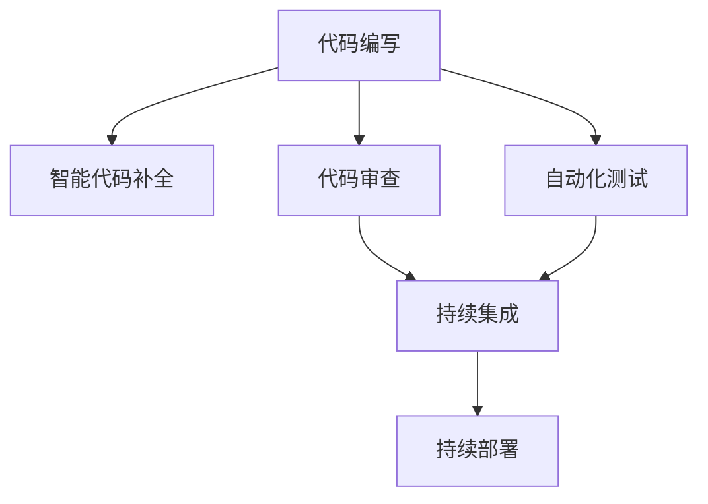

                 

# AI辅助编程:软件1.0和2.0的融合

## 1. 背景介绍

### 1.1 问题由来

随着人工智能技术的迅猛发展，AI辅助编程成为了软件开发领域的一大趋势。从早期的基于规则的编辑器，到现代的智能代码补全、代码审查、自动化测试等工具，AI辅助编程在提升开发效率、减少错误方面发挥了重要作用。然而，AI辅助编程技术仍然存在诸多不足，如何更好地融合软件开发的1.0（传统工具和流程）与2.0（基于AI的智能化工具和流程），成为当前的一个重要研究方向。

### 1.2 问题核心关键点

本文聚焦于AI辅助编程的技术融合，探讨了从传统软件1.0到智能软件2.0的演进路径，以及如何通过AI技术提升开发效率、增强代码质量和减少错误。本文将从以下几个方面进行深入探讨：
- AI辅助编程技术概述
- 核心概念和架构
- 核心算法原理与具体操作步骤
- 数学模型和公式推导
- 项目实践案例
- 实际应用场景
- 工具和资源推荐
- 总结：未来发展趋势与挑战
- 附录：常见问题与解答

## 2. 核心概念与联系

### 2.1 核心概念概述

AI辅助编程是一个将人工智能技术应用于软件开发过程的领域，旨在通过自动化、智能化的方式，提升开发效率和代码质量。其核心概念包括：

- 人工智能(AI)：指利用计算机和数据处理技术，模拟人类智能行为的技术体系，包括机器学习、深度学习、自然语言处理等。
- 智能代码补全：利用AI技术自动推荐代码片段，辅助开发者快速编写代码。
- 代码审查：使用AI技术对代码进行自动化审查，识别潜在问题。
- 自动化测试：利用AI技术进行自动化测试，提高测试效率和覆盖率。
- 自动化部署：通过AI技术自动化部署代码，提升部署效率和可靠性。

### 2.2 核心概念原理和架构的 Mermaid 流程图



该流程图展示了AI辅助编程的核心流程和架构，从代码编写到持续集成和部署，各环节都可能应用到AI技术，提升整个开发过程的效率和质量。

## 3. 核心算法原理 & 具体操作步骤

### 3.1 算法原理概述

AI辅助编程的核心算法主要包括：自然语言处理(NLP)、机器学习和深度学习等。通过这些技术，可以实现代码理解、代码生成、代码审查等任务。

- **自然语言处理**：用于理解和生成自然语言，如代码注释、代码描述等。
- **机器学习**：通过训练模型，预测代码中的潜在问题，如代码质量、风格等。
- **深度学习**：通过深度神经网络模型，自动补全代码片段、生成代码等。

### 3.2 算法步骤详解

#### 3.2.1 智能代码补全

智能代码补全是通过训练神经网络模型，预测代码上下文，自动推荐代码片段。其核心步骤包括：

1. **数据收集**：收集大量代码片段和相应的补全建议，作为训练数据。
2. **模型训练**：使用神经网络模型（如Transformer）对训练数据进行训练，学习代码补全的规律。
3. **代码预测**：在编写代码时，输入部分代码片段，模型根据上下文生成代码补全建议。

#### 3.2.2 代码审查

代码审查通过训练分类模型，自动识别代码中的潜在问题，如代码风格、错误等。其核心步骤包括：

1. **数据收集**：收集大量代码片段和相应的审查结果，作为训练数据。
2. **模型训练**：使用分类模型（如SVM、随机森林）对训练数据进行训练，学习代码审查的规律。
3. **代码检测**：对新代码片段进行检测，识别潜在问题，提供修复建议。

#### 3.2.3 自动化测试

自动化测试通过训练预测模型，预测代码的行为和结果，自动生成测试用例。其核心步骤包括：

1. **数据收集**：收集大量代码片段和相应的测试结果，作为训练数据。
2. **模型训练**：使用预测模型（如RNN、CNN）对训练数据进行训练，学习代码行为的规律。
3. **测试用例生成**：对新代码片段进行测试用例生成，自动执行测试并报告结果。

### 3.3 算法优缺点

AI辅助编程技术的优点包括：

- 提升开发效率：自动补全、自动化测试等技术可以大大减少手动操作，提高开发效率。
- 增强代码质量：代码审查等技术可以识别代码中的潜在问题，提高代码质量。
- 减少错误率：自动化测试等技术可以及时发现和修复代码错误，减少代码中的bug。

但其缺点也显而易见：

- 依赖数据质量：AI辅助编程的效果高度依赖于训练数据的质量和数量。
- 模型泛化能力有限：模型在特定领域或特定风格上的泛化能力可能较弱。
- 对开发者技能要求高：开发者需要掌握AI技术，才能有效利用这些工具。

### 3.4 算法应用领域

AI辅助编程技术已经被广泛应用于软件开发、运维、测试等多个领域，具体应用包括：

- **软件开发**：智能代码补全、代码审查、代码风格检查等。
- **运维管理**：自动化部署、运维监控、性能优化等。
- **测试流程**：自动化测试、代码覆盖率分析、缺陷预测等。
- **安全测试**：代码审计、漏洞检测、恶意代码识别等。

## 4. 数学模型和公式 & 详细讲解 & 举例说明

### 4.1 数学模型构建

AI辅助编程中的数学模型主要包括分类模型、回归模型、预测模型等。以智能代码补全为例，其数学模型可以表示为：

$$
\text{Prediction} = f(\text{Context}, \theta)
$$

其中，$f$ 表示预测函数，$\text{Context}$ 表示代码上下文，$\theta$ 表示模型参数。

### 4.2 公式推导过程

以智能代码补全为例，其基本推导过程如下：

1. **输入表示**：将代码上下文转换为向量表示，使用词嵌入技术（如Word2Vec）将每个单词映射为向量。
2. **模型训练**：使用Transformer模型对训练数据进行训练，学习代码补全的规律。
3. **预测生成**：在编写代码时，输入部分代码片段，模型根据上下文生成代码补全建议。

### 4.3 案例分析与讲解

以微软的Visual Studio Code中的智能代码补全为例，其核心算法是基于Transformer的神经网络模型，通过训练大量代码片段和相应的补全建议，学习代码补全的规律。训练过程中，模型会根据输入的代码片段和上下文，预测下一个可能的代码片段，并作为补全建议输出。

## 5. 项目实践：代码实例和详细解释说明

### 5.1 开发环境搭建

#### 5.1.1 环境配置

为了进行AI辅助编程的实践，需要搭建相应的开发环境，具体步骤如下：

1. **安装Python**：使用Python作为AI辅助编程的主要语言，从官网下载安装Python 3.x版本。
2. **安装TensorFlow**：TensorFlow是一个广泛使用的深度学习框架，用于构建和训练AI辅助编程的模型。
3. **安装Pandas**：Pandas是一个数据处理库，用于处理和分析训练数据。
4. **安装Scikit-Learn**：Scikit-Learn是一个机器学习库，用于训练分类、回归等模型。
5. **安装Matplotlib**：Matplotlib是一个可视化库，用于绘制模型训练过程中的性能指标。

#### 5.1.2 环境激活

在安装完成后，需要激活Python环境，具体步骤如下：

```bash
source activate ai_assist
```

### 5.2 源代码详细实现

以下是一个简单的智能代码补全示例，使用TensorFlow构建一个基本的神经网络模型：

```python
import tensorflow as tf
import pandas as pd

# 读取训练数据
train_data = pd.read_csv('train.csv')

# 构建神经网络模型
model = tf.keras.Sequential([
    tf.keras.layers.Embedding(input_dim=vocab_size, output_dim=embedding_dim),
    tf.keras.layers.Bidirectional(tf.keras.layers.LSTM(units=hidden_units)),
    tf.keras.layers.Dense(units=output_dim, activation='softmax')
])

# 编译模型
model.compile(optimizer='adam', loss='categorical_crossentropy', metrics=['accuracy'])

# 训练模型
model.fit(train_data, epochs=num_epochs, batch_size=batch_size)

# 预测代码补全建议
def predict(context):
    encoded_context = encode(context)
    prediction = model.predict(encoded_context)
    return decode(prediction)
```

### 5.3 代码解读与分析

该示例中，我们使用了TensorFlow构建了一个简单的神经网络模型，用于预测代码补全建议。具体步骤如下：

1. **数据读取**：使用Pandas读取训练数据，包括代码片段和相应的补全建议。
2. **模型构建**：使用TensorFlow构建神经网络模型，包括嵌入层、双向LSTM和输出层。
3. **模型训练**：使用训练数据对模型进行训练，设置合适的超参数（如epoch、batch size）。
4. **模型预测**：定义一个函数，输入代码上下文，输出预测的代码补全建议。

### 5.4 运行结果展示

通过训练模型，我们可以在编写代码时，输入部分代码片段，模型根据上下文生成代码补全建议。例如，输入 `print("Hello, world!"`，模型可以自动补全为 `print("Hello, world!")`。

## 6. 实际应用场景

### 6.1 软件开发

AI辅助编程在软件开发中的应用非常广泛，可以大大提升开发效率和代码质量。例如：

- **智能代码补全**：在编写代码时，自动补全代码片段，减少手动输入。
- **代码审查**：自动化检测代码中的潜在问题，如语法错误、代码风格等，提高代码质量。
- **自动化测试**：自动生成测试用例，提升测试覆盖率和测试效率。

### 6.2 运维管理

在运维管理中，AI辅助编程也发挥了重要作用，例如：

- **自动化部署**：自动部署代码，减少手动操作，提高部署效率。
- **性能优化**：通过AI技术分析性能瓶颈，自动优化代码性能。
- **安全审计**：自动化检测代码中的安全漏洞，提高代码安全性。

### 6.3 测试流程

AI辅助编程在测试流程中的应用主要体现在自动化测试上，例如：

- **测试用例生成**：自动生成测试用例，提高测试覆盖率和测试效率。
- **代码覆盖率分析**：分析代码覆盖率，识别未覆盖的代码块，提升测试质量。
- **缺陷预测**：预测代码中的潜在缺陷，提前修复问题。

### 6.4 未来应用展望

未来，AI辅助编程技术将继续演进，广泛应用于更多领域。具体展望如下：

- **多模态交互**：结合自然语言处理和计算机视觉技术，实现多模态交互，提升用户体验。
- **跨领域应用**：将AI辅助编程技术应用于更多领域，如医疗、金融、教育等。
- **人机协同**：将AI辅助编程技术与人机协同系统结合，实现智能化的开发环境。

## 7. 工具和资源推荐

### 7.1 学习资源推荐

为了帮助开发者掌握AI辅助编程技术，以下是一些优秀的学习资源：

1. **《深度学习》课程**：斯坦福大学开设的深度学习课程，涵盖深度学习的基础知识和前沿技术。
2. **《Python深度学习》书籍**：Francois Chollet撰写的深度学习入门书籍，详细介绍了TensorFlow、Keras等工具的使用。
3. **Kaggle**：一个数据科学竞赛平台，可以参与各种AI辅助编程竞赛，积累实战经验。
4. **Google AI Lab**：Google的人工智能实验室，提供丰富的AI资源和工具，供开发者学习和实践。
5. **OpenAI**：OpenAI的AI资源和工具，涵盖自然语言处理、计算机视觉等多个领域。

### 7.2 开发工具推荐

以下是一些常用的AI辅助编程开发工具：

1. **TensorFlow**：Google开发的深度学习框架，支持多种模型训练和预测。
2. **PyTorch**：Facebook开发的深度学习框架，灵活易用。
3. **Scikit-Learn**：Python机器学习库，支持分类、回归等模型训练。
4. **Keras**：高层次的深度学习框架，易于上手。
5. **Jupyter Notebook**：一个交互式编程环境，适合进行数据处理和模型训练。

### 7.3 相关论文推荐

以下是一些经典的研究论文，值得深入学习：

1. **《深度学习在计算机视觉中的应用》**：深度学习在计算机视觉领域的经典论文。
2. **《神经网络与深度学习》**：深度学习领域的经典教材，涵盖深度学习的基础知识和应用。
3. **《自然语言处理与深度学习》**：自然语言处理领域的经典教材，涵盖NLP的基本概念和深度学习应用。
4. **《计算机视觉：算法与应用》**：计算机视觉领域的经典教材，涵盖计算机视觉的基础知识和前沿技术。

## 8. 总结：未来发展趋势与挑战

### 8.1 研究成果总结

本文介绍了AI辅助编程技术的基本原理和操作步骤，详细讲解了智能代码补全、代码审查和自动化测试等核心任务。通过分析实际应用场景和未来发展趋势，提出了一些改进建议和优化方案。

### 8.2 未来发展趋势

未来，AI辅助编程技术将继续演进，呈现出以下几个发展趋势：

1. **多模态融合**：结合自然语言处理和计算机视觉等技术，实现多模态融合，提升用户体验。
2. **跨领域应用**：将AI辅助编程技术应用于更多领域，如医疗、金融、教育等。
3. **人机协同**：将AI辅助编程技术与人机协同系统结合，实现智能化的开发环境。

### 8.3 面临的挑战

尽管AI辅助编程技术取得了显著进展，但仍面临诸多挑战：

1. **数据质量问题**：AI辅助编程的效果高度依赖于训练数据的质量和数量，数据不足可能导致模型泛化能力弱。
2. **模型泛化能力有限**：模型在特定领域或特定风格上的泛化能力可能较弱。
3. **对开发者技能要求高**：开发者需要掌握AI技术，才能有效利用这些工具。
4. **资源消耗大**：AI辅助编程技术通常需要大量的计算资源，对硬件要求较高。

### 8.4 研究展望

为了解决上述挑战，未来的研究需要在以下几个方面进行突破：

1. **数据增强**：通过数据增强技术，扩充训练数据集，提高模型的泛化能力。
2. **模型优化**：开发更加高效的神经网络模型，减少计算资源消耗。
3. **知识整合**：将知识图谱、规则库等专家知识与神经网络模型结合，提升模型的决策能力。
4. **人机协同**：结合人机协同系统，提升系统的交互性和用户体验。

## 9. 附录：常见问题与解答

### Q1: 如何选择合适的AI辅助编程工具？

A: 选择合适的AI辅助编程工具需要考虑多个因素，包括功能、易用性、性能等。以下是一些选择建议：

1. **功能需求**：根据实际开发需求，选择具有相应功能的工具，如代码补全、代码审查、自动化测试等。
2. **易用性**：选择易用的工具，降低学习成本。可以通过试用、演示等手段，快速上手。
3. **性能**：选择性能优秀的工具，避免因性能瓶颈影响开发效率。

### Q2: AI辅助编程技术有哪些优点？

A: AI辅助编程技术具有以下几个优点：

1. **提升开发效率**：自动补全、代码审查、自动化测试等技术可以大大减少手动操作，提高开发效率。
2. **增强代码质量**：代码审查等技术可以识别代码中的潜在问题，提高代码质量。
3. **减少错误率**：自动化测试等技术可以及时发现和修复代码错误，减少代码中的bug。

### Q3: AI辅助编程技术有哪些局限性？

A: AI辅助编程技术存在以下局限性：

1. **依赖数据质量**：AI辅助编程的效果高度依赖于训练数据的质量和数量。
2. **模型泛化能力有限**：模型在特定领域或特定风格上的泛化能力可能较弱。
3. **对开发者技能要求高**：开发者需要掌握AI技术，才能有效利用这些工具。

### Q4: 如何提升AI辅助编程技术的性能？

A: 提升AI辅助编程技术的性能，可以从以下几个方面入手：

1. **数据增强**：通过数据增强技术，扩充训练数据集，提高模型的泛化能力。
2. **模型优化**：开发更加高效的神经网络模型，减少计算资源消耗。
3. **知识整合**：将知识图谱、规则库等专家知识与神经网络模型结合，提升模型的决策能力。

总之，AI辅助编程技术在软件开发中的应用前景广阔，未来将继续演进，融合更多技术，提升开发效率和代码质量，助力软件产业的持续创新和发展。

---

作者：禅与计算机程序设计艺术 / Zen and the Art of Computer Programming

