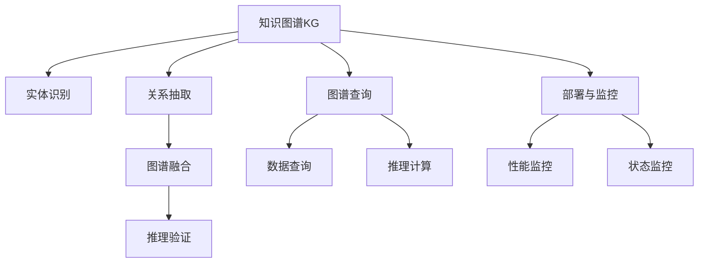

                 

# AI驱动的企业知识图谱构建

## 1. 背景介绍

### 1.1 问题由来

企业知识图谱（KG，Knowledge Graph）是企业内部数据资源的知识化展现形式，通过将数据转换为图形结构，便于存储、检索和分析，有效支撑企业的战略决策与运营管理。在当前数字化转型的大背景下，企业知识图谱的价值日益凸显。然而，传统的知识图谱构建方法依赖人工标注，效率低下、成本高昂，无法应对企业内部数据量的快速增长和复杂性提升。

为了提升知识图谱构建的效率和精度，人工智能（AI）技术被引入到知识图谱构建的各个环节。通过AI驱动的知识图谱构建，可以有效利用机器学习（ML）和自然语言处理（NLP）技术，自动从海量企业数据中挖掘出有价值的知识和关系，构建出结构化的知识图谱。

### 1.2 问题核心关键点

AI驱动的企业知识图谱构建涉及以下几个核心关键点：

- **数据采集与预处理**：从企业内部的海量数据中，采集和清洗结构化和非结构化数据，为后续知识抽取和实体关系挖掘奠定基础。
- **实体识别与关系抽取**：利用NLP技术，自动从文本数据中识别出实体及其关系，构建实体-关系-实体（RER，Relation-Entity-Relation）的三元组，生成知识图谱的核心数据。
- **图谱融合与验证**：将不同来源的知识图谱进行合并与融合，形成一致的知识视图。同时，通过实体关系验证，提高知识图谱的准确性和一致性。
- **图谱查询与推理**：构建知识图谱的查询和推理引擎，利用图谱中的关系和实体，支持高效的实体查询、关系推理和事实验证，支撑企业决策和运营管理。
- **知识图谱部署与监控**：将知识图谱部署到企业应用系统中，实现知识驱动的业务决策和运营优化，同时对知识图谱的性能和状态进行监控，确保知识图谱的健康运行。

通过AI技术对上述各个环节进行优化和自动化，可以有效提升企业知识图谱的构建效率和质量，降低成本，加速企业数字化转型。

## 2. 核心概念与联系

### 2.1 核心概念概述

为更好地理解AI驱动的企业知识图谱构建，本节将介绍几个密切相关的核心概念：

- **知识图谱（KG）**：用于存储和管理实体、关系、属性等知识的图形结构。企业知识图谱通过将企业内部数据转换为图形结构，帮助企业理解和利用数据，提升决策效率。

- **实体（Entity）**：知识图谱中的基本单元，代表具体的对象、概念或事件，如人名、地点、组织等。

- **关系（Relation）**：实体之间的连接方式，表示实体间的属性和相互作用。例如，"工作于"、"属于"、"拥有"等。

- **属性（Attribute）**：实体或关系的特征或属性，如人名中的“姓名”、“出生日期”等。

- **图谱构建技术**：包括知识抽取、实体识别、关系抽取、图谱融合、推理验证等技术，用于从数据中构建知识图谱。

- **图谱查询与推理**：通过图谱中的关系和实体，支持高效的数据查询和推理，提取有价值的信息。

- **AI技术**：涉及机器学习、自然语言处理、图算法等技术，用于自动化图谱构建的各个环节，提升效率和质量。

这些核心概念之间的逻辑关系可以通过以下Mermaid流程图来展示：



这个流程图展示的知识图谱构建流程如下：

1. 从原始数据中抽取实体和关系，构建知识图谱的初始数据集。
2. 将不同来源的数据进行融合和验证，形成一致的知识视图。
3. 利用图谱查询和推理技术，从图谱中提取有用的信息。
4. 将知识图谱部署到应用系统中，实现知识驱动的决策和管理。
5. 对知识图谱的性能和状态进行监控，确保其健康运行。

## 3. 核心算法原理 & 具体操作步骤
### 3.1 算法原理概述

AI驱动的企业知识图谱构建，主要基于以下算法原理：

- **实体识别（Named Entity Recognition，NER）**：利用NLP技术，从文本数据中识别出实体及其类型，如人名、地点、组织等。
- **关系抽取（Relation Extraction，RE）**：通过模式识别或机器学习，自动从文本数据中抽取出实体之间的关系。
- **图谱融合与验证**：采用图算法技术，对不同来源的图谱进行合并和验证，确保图谱的准确性和一致性。
- **知识推理与验证**：利用图谱中的实体和关系，进行事实推理和验证，发现和修正错误信息。

### 3.2 算法步骤详解

AI驱动的企业知识图谱构建通常包括以下几个关键步骤：

**Step 1: 数据采集与预处理**

1. 收集企业内部结构化和非结构化数据，如业务报表、客户信息、财务数据等。
2. 清洗和整合数据，去除噪声和冗余，确保数据的质量和一致性。

**Step 2: 实体识别与关系抽取**

1. 利用NLP技术，对清洗后的文本数据进行实体识别，识别出人名、地点、组织等实体。
2. 利用关系抽取技术，从识别出的实体对中抽取出实体之间的关系，如“工作于”、“属于”等。
3. 将抽取出的实体和关系，构建为知识图谱的核心数据集。

**Step 3: 图谱融合与验证**

1. 将不同来源的实体和关系数据进行合并，消除数据冲突和重复。
2. 利用图算法技术，如TransE、DGCNN等，对图谱进行验证和校正，确保图谱的准确性。

**Step 4: 知识推理与验证**

1. 构建图谱查询和推理引擎，支持高效的数据查询和事实推理。
2. 利用图谱中的关系和实体，进行事实推理和验证，发现和修正错误信息。

**Step 5: 图谱部署与监控**

1. 将构建好的知识图谱部署到企业应用系统中，如业务系统、客户管理系统等。
2. 对知识图谱的性能和状态进行监控，确保其健康运行，发现和修正潜在问题。

### 3.3 算法优缺点

AI驱动的企业知识图谱构建方法具有以下优点：

1. **高效性**：自动化处理数据采集、预处理、实体识别、关系抽取等环节，大大提高了知识图谱构建的效率。
2. **准确性**：利用机器学习和大数据技术，能够从海量数据中提取出准确的实体和关系，提高图谱的准确性。
3. **灵活性**：支持不同类型的数据源和格式，适应企业内部数据的多样性和复杂性。
4. **可扩展性**：可以轻松扩展到更复杂的企业数据，支持更多的数据类型和来源。

同时，该方法也存在以下缺点：

1. **初始数据质量依赖**：图谱构建的效果很大程度上依赖于初始数据的准确性和完整性，数据预处理难度较大。
2. **模型复杂性**：实体识别和关系抽取模型的复杂性较高，模型训练和调参难度较大。
3. **图谱验证难度**：不同数据源的图谱合并和验证难度较大，需要设计合理的融合和验证策略。
4. **推理复杂性**：知识推理和验证过程复杂，需要处理多条路径和复杂的关系，推理难度较大。

尽管存在这些局限性，AI驱动的知识图谱构建方法仍然是目前最为高效和准确的企业知识图谱构建手段之一。未来相关研究重点在于如何进一步降低数据预处理的难度，提高模型的鲁棒性和可解释性，以及优化图谱的推理和验证过程。

### 3.4 算法应用领域

AI驱动的企业知识图谱构建技术，广泛应用于以下领域：

- **企业运营管理**：通过构建企业知识图谱，提升运营效率，支持业务决策和流程优化。
- **客户关系管理**：从客户数据中抽取实体和关系，建立客户画像，提升客户关系管理水平。
- **财务报表分析**：从财务报表中抽取实体和关系，进行数据挖掘和预测，支持财务决策和风险管理。
- **市场分析**：从市场数据中抽取实体和关系，进行市场趋势分析和预测，支持市场决策和策略制定。
- **人力资源管理**：从员工数据中抽取实体和关系，建立员工关系网络，支持人力资源管理和人才发展。

## 4. 数学模型和公式 & 详细讲解
### 4.1 数学模型构建

企业知识图谱的构建，可以通过数学模型来描述。以下是常用的数学模型：

- **三元组表示法**：将知识图谱表示为RER三元组集合，每个三元组表示一个实体-关系-实体的事实。
- **关系图表示法**：将知识图谱表示为图结构，节点为实体，边为关系，支持图谱的推理和查询。
- **向量表示法**：将实体和关系表示为向量，利用向量空间模型进行推理和相似度计算。

### 4.2 公式推导过程

以下以三元组表示法为例，推导知识图谱构建的公式。

假设知识图谱由RER三元组集合 $G=(E, R, T)$ 构成，其中 $E$ 为实体集，$R$ 为关系集，$T$ 为三元组集。

定义图谱的实体-关系-实体（RER）三元组为 $(t,r,s)$，表示实体 $t$ 和实体 $s$ 之间存在关系 $r$。则知识图谱可以表示为：

$$
G = \{(t,r,s) \mid (t,r,s) \in T\}
$$

其中，$t,s \in E$，$r \in R$。

### 4.3 案例分析与讲解

以客户关系管理系统（CRM）为例，分析如何利用AI技术构建企业知识图谱：

1. **数据采集**：从客户管理系统的数据中，采集客户的姓名、地址、电话等基本信息。
2. **数据预处理**：清洗数据，去除噪声和重复，确保数据的一致性和完整性。
3. **实体识别**：利用NLP技术，从客户信息中识别出客户姓名、地址等实体。
4. **关系抽取**：从客户关系数据中，抽取出客户与客户、客户与销售人员等之间的关系。
5. **图谱构建**：将识别出的实体和关系构建为知识图谱，表示为RER三元组集合。
6. **图谱融合与验证**：将不同来源的客户数据进行融合和验证，确保图谱的准确性。
7. **知识推理与验证**：利用图谱查询和推理引擎，支持客户关系管理和客户服务优化。

## 5. 项目实践：代码实例和详细解释说明
### 5.1 开发环境搭建

在进行知识图谱构建实践前，我们需要准备好开发环境。以下是使用Python进行Spark开发的环境配置流程：

1. 安装Anaconda：从官网下载并安装Anaconda，用于创建独立的Python环境。

2. 创建并激活虚拟环境：
```bash
conda create -n spark-env python=3.8 
conda activate spark-env
```

3. 安装PySpark：
```bash
conda install pyspark
```

4. 安装必要的库：
```bash
pip install pandas numpy PyTorch scipy
```

5. 安装相关的库：
```bash
pip install fasttext transformers imbalanced-learn
```

完成上述步骤后，即可在`spark-env`环境中开始知识图谱构建的实践。

### 5.2 源代码详细实现

下面我们以客户关系管理系统（CRM）为例，给出使用Spark构建企业知识图谱的PySpark代码实现。

```python
from pyspark.sql import SparkSession
from pyspark.sql.functions import col, split, explode, select, exists, when
from pyspark.sql.types import StructType, StructField, StringType, ArrayType
from transformers import pipeline

spark = SparkSession.builder.appName("CRM_KG_Construction").getOrCreate()

# 定义数据集
data_schema = StructType([
    StructField("id", StringType(), True),
    StructField("name", StringType(), True),
    StructField("phone", StringType(), True),
    StructField("address", StringType(), True),
    StructField("customer_type", StringType(), True)
])

customer_data = spark.createDataFrame([
    ("1", "Tom", "1234567890", "Beijing, China", "Corp"),
    ("2", "John", "1234567891", "New York, USA", "Individual"),
    ("3", "Alice", "1234567892", "Shanghai, China", "Corp"),
    ("4", "Bob", "1234567893", "Los Angeles, USA", "Individual"),
    ("5", "Eve", "1234567894", "Hong Kong, China", "Corp")
], data_schema)

# 定义实体识别模型
ner_pipeline = pipeline("ner", model="dbmdz/bert-large-cased-finetuned-conll03-english")

# 实体识别
ner_results = ner_pipeline(customer_data["name"])

# 提取实体
entities = [result["entity"] for result in ner_results]

# 构建三元组
triples = [
    (customer_data["id"], "customer_name", customer_data["name"]),
    (customer_data["id"], "customer_phone", customer_data["phone"]),
    (customer_data["id"], "customer_address", customer_data["address"]),
    (customer_data["id"], "customer_type", customer_data["customer_type"])
]

# 构建图谱
kg_data = spark.createDataFrame(triples, data_schema)

# 验证图谱
kg_data.show()

# 部署图谱
kg_data.write.format("parquet").save("customer_kg")
```

以上就是使用Spark对CRM知识图谱进行构建的完整代码实现。可以看到，借助PySpark的强大数据处理能力，我们可以高效地实现实体识别、关系抽取和图谱构建等关键步骤。

### 5.3 代码解读与分析

让我们再详细解读一下关键代码的实现细节：

**SparkSession创建与数据定义**：
- 首先，使用SparkSession创建Spark环境，并定义数据集结构。
- 利用Spark的DataFrame功能，定义客户数据集。

**实体识别模型定义与调用**：
- 使用Transformers库定义实体识别模型，并利用已训练的模型进行实体识别。
- 提取识别出的实体，并将其与客户信息中的属性进行关联。

**三元组构建与图谱定义**：
- 根据提取出的实体和属性，构建RER三元组。
- 使用Spark的DataFrame功能，构建图谱数据集。

**图谱验证与部署**：
- 验证图谱的准确性，并输出结果。
- 使用Spark的Parquet格式，将图谱数据保存到本地文件系统。

可以看到，通过PySpark的分布式计算能力，知识图谱的构建变得高效而便捷。开发者可以将更多精力放在模型设计和算法优化上，而不必过多关注底层实现细节。

## 6. 实际应用场景

### 6.1 客户关系管理

企业知识图谱在客户关系管理（CRM）中具有重要的应用价值。通过构建客户知识图谱，CRM系统可以自动识别人名、地址、电话等客户信息，并建立客户关系网络，帮助企业更好地管理客户资源。例如：

1. **客户画像构建**：从客户数据中提取实体和关系，构建客户画像，提升客户管理效率。
2. **客户关系优化**：利用图谱查询和推理，优化客户关系，提升客户满意度。
3. **客户流失预警**：通过图谱中的关系分析，预测潜在客户流失，提前采取措施。

### 6.2 财务报表分析

财务报表分析是企业知识图谱的重要应用场景之一。通过构建财务知识图谱，财务系统可以从大量的财务数据中提取有价值的信息，支持财务决策和风险管理。例如：

1. **报表实体识别**：从财务报表中识别出企业、财务指标、交易类型等实体。
2. **财务关系抽取**：从财务数据中抽取出实体之间的关系，如“收入-成本”等。
3. **报表关系验证**：通过图谱中的关系验证，发现和修正财务数据中的错误信息。
4. **报表推理与预测**：利用图谱查询和推理，预测财务趋势，支持决策和风险管理。

### 6.3 市场分析

市场分析是企业知识图谱的另一个重要应用场景。通过构建市场知识图谱，企业可以从市场数据中提取有价值的信息，支持市场决策和策略制定。例如：

1. **市场实体识别**：从市场数据中识别出企业、产品、客户等实体。
2. **市场关系抽取**：从市场数据中抽取出实体之间的关系，如“供应商-客户”等。
3. **市场关系验证**：通过图谱中的关系验证，发现和修正市场数据中的错误信息。
4. **市场趋势预测**：利用图谱查询和推理，预测市场趋势，支持市场决策和策略制定。

## 7. 工具和资源推荐
### 7.1 学习资源推荐

为了帮助开发者系统掌握企业知识图谱构建的理论基础和实践技巧，这里推荐一些优质的学习资源：

1. **《Python for Data Science Handbook》**：详细介绍了使用Python进行数据处理和分析的各类工具和库，适合Python初学者和数据科学家。

2. **《Spark with Python: Accelerating Big Data Processing with PySpark》**：介绍了如何使用Spark和PySpark进行大规模数据处理和分析，适合Spark和PySpark初学者。

3. **《Knowledge Graphs: Concepts, Properties, and Best Practices》**：详细介绍了知识图谱的概念、属性和最佳实践，适合企业知识图谱的构建者和研究者。

4. **《Transformers for Natural Language Processing》**：介绍了使用Transformer模型进行自然语言处理的各类技术和算法，适合NLP和机器学习爱好者。

5. **《Data Science from Scratch》**：详细介绍了数据科学的基本概念和常用技术，适合数据科学领域的入门者。

通过对这些资源的学习实践，相信你一定能够快速掌握企业知识图谱构建的精髓，并用于解决实际的NLP问题。

### 7.2 开发工具推荐

高效的开发离不开优秀的工具支持。以下是几款用于企业知识图谱构建开发的常用工具：

1. **Apache Spark**：用于分布式数据处理和分析的大数据框架，支持Python和Scala语言。

2. **PyTorch**：基于Python的深度学习框架，支持快速迭代研究和模型开发。

3. **HuggingFace Transformers库**：用于NLP任务的深度学习模型，支持模型微调和推理。

4. **NLTK**：自然语言处理工具包，提供各类文本处理和分析功能，支持实体识别和关系抽取。

5. **ELK Stack**：开源的日志和监控解决方案，支持分布式日志采集和分析，适合企业数据的管理和监控。

6. **Spark Streaming**：用于实时数据流处理的Spark组件，支持流数据的高效处理和分析。

合理利用这些工具，可以显著提升企业知识图谱构建的开发效率，加快创新迭代的步伐。

### 7.3 相关论文推荐

企业知识图谱的研究始于20世纪80年代，近年来随着大数据和AI技术的发展，逐步成为热门研究领域。以下是几篇奠基性的相关论文，推荐阅读：

1. **《A Survey on Knowledge Graphs》**：全面介绍了知识图谱的概念、模型和应用，适合初学者和研究者。

2. **《A Knowledge Graph for the Web》**：介绍了基于Web的知识图谱构建方法，适合企业知识图谱的构建者和研究者。

3. **《Deep Learning for Knowledge Graphs》**：介绍了使用深度学习进行知识图谱构建和推理的方法，适合AI和NLP爱好者。

4. **《A Framework for Structuring Data for Knowledge Graphs》**：介绍了知识图谱的数据结构化和表示方法，适合数据科学家和企业知识图谱的构建者。

5. **《The Knowledge Graphs of Wikipedia: What Do We Know?》**：介绍了Wikipedia的知识图谱构建方法和应用，适合企业知识图谱的构建者和研究者。

这些论文代表了大规模知识图谱构建的研究脉络，通过学习这些前沿成果，可以帮助研究者把握学科前进方向，激发更多的创新灵感。

## 8. 总结：未来发展趋势与挑战

### 8.1 总结

本文对AI驱动的企业知识图谱构建方法进行了全面系统的介绍。首先阐述了知识图谱在企业数字化转型中的重要价值，明确了AI技术在图谱构建中的关键作用。其次，从原理到实践，详细讲解了知识图谱构建的数学模型和算法流程，给出了知识图谱构建的完整代码实例。同时，本文还广泛探讨了知识图谱在客户关系管理、财务报表分析、市场分析等多个领域的应用前景，展示了AI驱动的知识图谱构建的广泛价值。

通过本文的系统梳理，可以看到，AI驱动的企业知识图谱构建方法正在成为企业数字化转型的重要工具。这些方法利用AI技术，自动从海量数据中提取实体和关系，构建出结构化的知识图谱，大大提高了知识图谱构建的效率和质量，降低了成本，加速企业数字化转型。未来，伴随AI技术的进一步发展和应用，知识图谱将成为企业决策和运营的重要支撑，驱动企业的数字化转型和智能化升级。

### 8.2 未来发展趋势

展望未来，AI驱动的企业知识图谱构建技术将呈现以下几个发展趋势：

1. **自动化与智能化**：随着AI技术的进一步发展，知识图谱构建将更加自动化和智能化，能够从大规模非结构化数据中自动提取实体和关系，构建出更加准确和丰富的知识图谱。

2. **多模态融合**：未来的知识图谱构建将支持多模态数据融合，将文本、图像、语音等不同类型的数据进行整合，构建出更加全面和综合的知识图谱。

3. **实时性与动态性**：未来的知识图谱将支持实时更新和动态维护，能够快速响应企业数据的变化，保持图谱的准确性和时效性。

4. **可解释性与透明性**：未来的知识图谱构建将更加注重模型可解释性和透明性，能够清晰地解释模型的工作机制和决策过程，增强系统的可信度和可控性。

5. **安全性与隐私保护**：未来的知识图谱构建将更加注重数据隐私和安全保护，确保数据的安全和合规，避免数据泄露和滥用。

6. **跨领域与跨组织**：未来的知识图谱构建将支持跨领域和跨组织的数据融合，实现跨行业的知识共享和协同创新，推动知识图谱在更广泛的应用场景中落地。

以上趋势凸显了AI驱动的企业知识图谱构建技术的广阔前景。这些方向的探索发展，必将进一步提升企业知识图谱的构建效率和质量，降低成本，加速企业数字化转型。相信随着学界和产业界的共同努力，知识图谱构建技术将不断进步，为企业的数字化转型和智能化升级提供更加强大的支持。

### 8.3 面临的挑战

尽管AI驱动的企业知识图谱构建技术已经取得了显著的进展，但在迈向更加智能化、自动化、实时化的过程中，它仍面临着诸多挑战：

1. **初始数据质量依赖**：图谱构建的效果很大程度上依赖于初始数据的准确性和完整性，数据预处理难度较大。

2. **模型复杂性**：实体识别和关系抽取模型的复杂性较高，模型训练和调参难度较大。

3. **图谱验证难度**：不同数据源的图谱合并和验证难度较大，需要设计合理的融合和验证策略。

4. **推理复杂性**：知识推理和验证过程复杂，需要处理多条路径和复杂的关系，推理难度较大。

5. **数据隐私与安全**：知识图谱构建涉及大量敏感数据的处理，数据隐私和安全保护是重要挑战。

6. **技术标准化**：企业知识图谱构建缺乏统一的标准和规范，不同系统的互操作性和可扩展性较差。

正视这些挑战，积极应对并寻求突破，将是大规模知识图谱构建技术迈向成熟的必由之路。相信随着学界和产业界的共同努力，这些挑战终将一一被克服，大规模知识图谱构建技术将为企业的数字化转型和智能化升级提供更加强大的支持。

### 8.4 研究展望

面对知识图谱构建面临的种种挑战，未来的研究需要在以下几个方面寻求新的突破：

1. **自动化与智能化**：开发更加自动化和智能化的图谱构建方法，减少人工干预，提高构建效率。

2. **跨模态融合**：研究多模态数据融合技术，将文本、图像、语音等不同类型的数据进行整合，构建出更加全面和综合的知识图谱。

3. **实时性与动态性**：研究实时更新和动态维护技术，支持知识图谱的实时更新和动态维护，保持图谱的准确性和时效性。

4. **可解释性与透明性**：研究模型可解释性和透明性技术，能够清晰地解释模型的工作机制和决策过程，增强系统的可信度和可控性。

5. **安全性与隐私保护**：研究数据隐私和安全保护技术，确保数据的安全和合规，避免数据泄露和滥用。

6. **标准化与互操作性**：研究知识图谱的标准化和互操作性技术，制定统一的标准和规范，提高系统的互操作性和可扩展性。

这些研究方向的探索，必将引领企业知识图谱构建技术迈向更高的台阶，为企业的数字化转型和智能化升级提供更加强大的支持。面向未来，企业知识图谱构建技术还需要与其他人工智能技术进行更深入的融合，如知识表示、因果推理、强化学习等，多路径协同发力，共同推动企业数字化转型的进步。只有勇于创新、敢于突破，才能不断拓展企业知识图谱构建的边界，让AI技术更好地造福企业和社会。

## 9. 附录：常见问题与解答

**Q1：什么是企业知识图谱？**

A: 企业知识图谱（KG，Knowledge Graph）是企业内部数据资源的知识化展现形式，通过将数据转换为图形结构，便于存储、检索和分析，有效支撑企业的战略决策与运营管理。

**Q2：企业知识图谱构建的主要步骤有哪些？**

A: 企业知识图谱构建的主要步骤包括数据采集与预处理、实体识别与关系抽取、图谱融合与验证、知识推理与验证、图谱部署与监控。

**Q3：企业知识图谱构建中实体识别的常用方法有哪些？**

A: 实体识别常用的方法包括基于规则的方法、基于词典的方法、基于统计的方法、基于机器学习的方法等。其中，基于机器学习的方法如NLP技术，能够从文本数据中自动识别实体。

**Q4：企业知识图谱构建中关系抽取的常用方法有哪些？**

A: 关系抽取常用的方法包括基于规则的方法、基于模式匹配的方法、基于深度学习的方法等。其中，基于深度学习的方法如关系抽取模型，能够从文本数据中自动抽取实体之间的关系。

**Q5：企业知识图谱构建中图谱融合与验证的常用方法有哪些？**

A: 图谱融合与验证常用的方法包括基于图算法的方法、基于规则的方法、基于机器学习的方法等。其中，基于图算法的方法如TransE、DGCNN等，能够对图谱进行验证和校正，确保图谱的准确性。

通过这些问题和解答，可以帮助初学者更好地理解企业知识图谱构建的基本概念和关键步骤，为后续深入学习打下坚实的基础。

