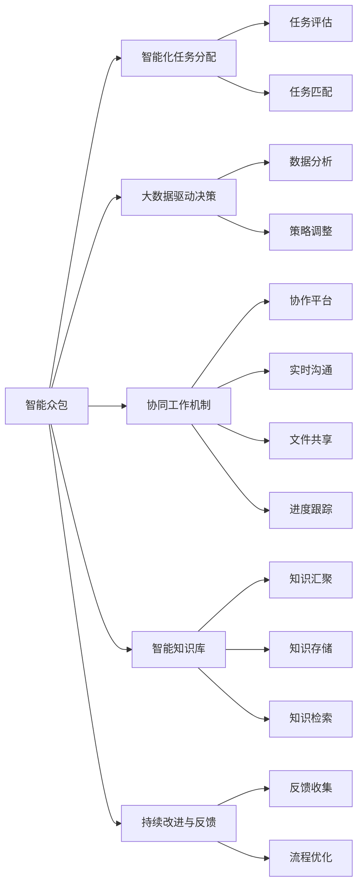

                 

## 1. 背景介绍

随着科技的迅猛发展，人工智能（AI）已经逐渐渗透到社会的各个角落。人工智能不仅是技术创新，更是推动社会经济发展的关键力量。然而，人工智能技术的落地应用并非一帆风顺，面临着诸多挑战。本文旨在探讨AI驱动的众包模式，阐述其如何通过智能化手段提升创新和协作效率，以及如何有效解决目前存在的诸多问题。

### 1.1 问题由来

人工智能技术的应用常常依赖于大数据、高性能计算、专业知识和经验。然而，这些资源并非易得，且需要大量人力物力去收集和处理。传统的AI开发模式，如自下而上、垂直化、集中化，往往难以迅速应对快速变化的市场需求。此外，垂直化、集中化的AI开发模式还存在创新受限、协作复杂等问题。

为了解决这些问题，智能众包（AI-driven Crowdsourcing）应运而生。其核心思想是将人工智能与人类智能相结合，通过众包模式汇聚海量的智慧，加速创新过程，提升协作效率。

### 1.2 问题核心关键点

智能众包模式具有以下几个核心关键点：

- **智能化任务分配**：通过AI算法对众包任务的难度、成本、截止时间等因素进行科学评估，自动将任务分配给最合适的人员或团队。
- **数据驱动决策**：利用大数据分析技术，实时监控任务进展，及时调整资源分配策略，确保任务高效完成。
- **协同工作机制**：搭建统一的协作平台，提供实时沟通、文件共享、进度跟踪等功能，促进多团队高效合作。
- **智能知识库**：建立智能知识库，对众包过程中产生的知识进行汇聚、存储、检索，为后续任务提供支持。
- **持续改进与反馈**：通过持续的反馈机制，不断优化众包流程，提升整体效率和质量。

智能众包模式不仅拓宽了人工智能应用场景，还为人类智慧与技术创新提供了一种新的结合方式，有望推动更多领域的突破性创新。

### 1.3 问题研究意义

智能众包模式有助于解决AI技术落地应用中的诸多问题，并赋予人类智慧更大的发挥空间，其研究意义如下：

1. **降低开发成本**：通过智能化任务分配和大数据驱动决策，智能众包可显著降低AI项目开发的人力成本和时间成本。
2. **提升协作效率**：智能众包模式通过统一的协作平台和协同工作机制，大幅提升团队协作效率和任务完成速度。
3. **增强创新能力**：通过汇聚多样化的智慧，智能众包模式为创新提供更多元、更高质量的数据和观点，推动更多突破性创新。
4. **提高决策质量**：智能化评估和数据驱动决策有助于提升AI项目的整体质量，减少失败风险。
5. **推动技术普及**：智能众包模式的可扩展性和普适性，有助于AI技术的快速普及和应用，加速社会各领域智能化转型。

## 2. 核心概念与联系

### 2.1 核心概念概述

智能众包模式涉及多个核心概念，各概念之间密切相关，共同构成了一种全新的AI开发范式。以下是核心概念的详细概述：

1. **人工智能（AI）**：AI是智能众包的核心驱动力，通过算法和模型，AI能够处理海量数据，自动化执行各种任务。
2. **众包（Crowdsourcing）**：众包模式是将大规模任务分解为小任务，由大量人群协作完成的策略。
3. **智能化任务分配**：AI技术对任务进行智能评估，自动匹配合适的执行者，提高任务分配的效率和准确性。
4. **大数据驱动决策**：利用大数据分析技术，实时监控任务进展，动态调整资源分配策略，确保任务高效完成。
5. **协同工作机制**：提供统一的协作平台，促进多团队高效合作，减少沟通成本，提升协作效率。
6. **智能知识库**：建立智能知识库，汇聚和存储项目中产生的知识，提升后续任务的处理能力。
7. **持续改进与反馈**：通过持续的反馈机制，不断优化流程，提升整体效率和质量。

这些核心概念之间通过逻辑和流程紧密联系，共同构成了智能众包模式的完整框架。

### 2.2 核心概念原理和架构的 Mermaid 流程图



该流程图展示了智能众包模式中各核心概念的相互关系，其中每个节点代表一个关键流程或功能模块。智能众包模式通过这些模块的协同工作，实现高效的智能任务执行和知识积累。

## 3. 核心算法原理 & 具体操作步骤

### 3.1 算法原理概述

智能众包模式的核心算法原理可以概括为“数据驱动、算法优化、协同执行”。通过科学评估任务，利用AI算法优化任务分配和大数据驱动决策，协同执行各个环节，最终实现高效、高质量的任务完成。

**数据驱动**：利用大数据分析技术，实时监控任务进展，动态调整资源分配策略，确保任务高效完成。

**算法优化**：通过智能化任务评估和匹配算法，自动将任务分配给最合适的人员或团队，提高任务分配的效率和准确性。

**协同执行**：搭建统一的协作平台，提供实时沟通、文件共享、进度跟踪等功能，促进多团队高效合作，提升协作效率。

### 3.2 算法步骤详解

智能众包模式的具体操作步骤如下：

1. **任务定义**：明确项目目标和任务需求，将项目分解为多个子任务。
2. **任务评估**：利用AI算法对任务难度、成本、截止时间等因素进行科学评估，自动将任务分配给最合适的人员或团队。
3. **任务分配**：基于评估结果，智能化分配任务，确保每个团队承担最合适的任务。
4. **协同执行**：搭建统一的协作平台，提供实时沟通、文件共享、进度跟踪等功能，促进多团队高效合作。
5. **监控与调整**：利用大数据分析技术，实时监控任务进展，动态调整资源分配策略，确保任务高效完成。
6. **知识积累**：建立智能知识库，汇聚和存储项目中产生的知识，提升后续任务的处理能力。
7. **持续改进**：通过持续的反馈机制，不断优化流程，提升整体效率和质量。

### 3.3 算法优缺点

智能众包模式的优点在于：

- **高效低成本**：通过智能化任务分配和大数据驱动决策，智能众包可显著降低AI项目开发的人力成本和时间成本。
- **协作效率高**：智能众包模式通过统一的协作平台和协同工作机制，大幅提升团队协作效率和任务完成速度。
- **创新能力强**：通过汇聚多样化的智慧，智能众包模式为创新提供更多元、更高质量的数据和观点，推动更多突破性创新。

智能众包模式的缺点在于：

- **质量控制难**：由于众包任务执行者为非专业人士，其执行质量难以完全保证，需要额外监管和把控。
- **任务匹配难**：某些任务难以精确匹配合适的执行者，可能导致任务分配效率不高。
- **数据安全风险**：众包模式涉及大量数据传输和存储，存在数据泄露和滥用的风险。

### 3.4 算法应用领域

智能众包模式已经广泛应用于多个领域，取得了显著的成效：

1. **科学研究**：在复杂科学问题的求解中，智能众包模式通过汇聚大量科学家的智慧，加速研究进程，提升研究质量。
2. **软件开发**：在软件项目的开发和测试中，智能众包模式通过众包开发者进行代码编写和测试，加速项目完成。
3. **产品设计**：在产品设计中，智能众包模式通过众包设计师进行创新设计，提升产品创新性和市场竞争力。
4. **内容创作**：在内容创作中，智能众包模式通过众包写手进行内容生成，提升内容质量和更新速度。
5. **数据标注**：在数据标注中，智能众包模式通过众包标注人员进行数据标注，提升数据质量和标注效率。

这些应用领域展示了智能众包模式的广泛适用性和巨大潜力。

## 4. 数学模型和公式 & 详细讲解 & 举例说明

### 4.1 数学模型构建

智能众包模式的数学模型主要包括以下几个关键要素：

1. **任务难度评估模型**：利用机器学习算法对任务难度进行科学评估。
2. **任务匹配模型**：利用匹配算法将任务分配给最合适的人员或团队。
3. **进度跟踪模型**：利用实时监控技术，实时跟踪任务进展。
4. **资源优化模型**：利用大数据分析技术，动态调整资源分配策略。

这些模型共同构成了一个完整的智能众包框架，确保任务的高效、高质量完成。

### 4.2 公式推导过程

以下是几个关键模型的公式推导过程：

**任务难度评估模型**：

$$
\text{任务难度} = f(\text{任务复杂度}, \text{任务规模}, \text{历史数据}, \text{执行者能力})
$$

其中，$f$为评估函数，利用机器学习算法训练得到。

**任务匹配模型**：

$$
\text{执行者匹配度} = \max(\text{匹配函数}(\text{任务难度}, \text{执行者能力}))
$$

匹配函数通过优化算法，动态调整执行者匹配度，确保任务分配的准确性。

**进度跟踪模型**：

$$
\text{任务进度} = \text{当前完成度} + \text{实时监控数据} \times \text{任务优先级}
$$

实时监控数据包括执行者反馈、任务进度、资源使用情况等，利用大数据分析技术，实时调整任务优先级，确保任务高效完成。

**资源优化模型**：

$$
\text{资源分配策略} = \text{优化算法}(\text{实时监控数据}, \text{历史数据}, \text{任务优先级})
$$

优化算法利用大数据分析技术，动态调整资源分配策略，确保资源高效利用。

### 4.3 案例分析与讲解

假设某AI项目需要开发一个基于深度学习的图像识别算法，项目分解为数据收集、模型训练、模型优化三个子任务。项目组通过智能众包模式进行任务执行，具体流程如下：

1. **任务定义**：明确项目目标，将项目分解为数据收集、模型训练、模型优化三个子任务。
2. **任务评估**：利用机器学习算法对每个子任务进行难度评估，确定每个子任务的资源需求和时间截止。
3. **任务分配**：根据评估结果，智能化分配任务，确保每个团队承担最合适的任务。
4. **协同执行**：搭建统一的协作平台，提供实时沟通、文件共享、进度跟踪等功能，促进多团队高效合作。
5. **监控与调整**：利用大数据分析技术，实时监控任务进展，动态调整资源分配策略，确保任务高效完成。
6. **知识积累**：建立智能知识库，汇聚和存储项目中产生的知识，提升后续任务的处理能力。
7. **持续改进**：通过持续的反馈机制，不断优化流程，提升整体效率和质量。

在这个案例中，智能众包模式通过科学评估任务难度、智能化任务分配、协同执行各个环节，最终实现了高效的智能任务执行和知识积累。

## 5. 项目实践：代码实例和详细解释说明

### 5.1 开发环境搭建

在进行智能众包模式开发前，我们需要准备好开发环境。以下是使用Python进行PyTorch开发的环境配置流程：

1. 安装Anaconda：从官网下载并安装Anaconda，用于创建独立的Python环境。

2. 创建并激活虚拟环境：
```bash
conda create -n ai-crowdsourcing python=3.8 
conda activate ai-crowdsourcing
```

3. 安装PyTorch：根据CUDA版本，从官网获取对应的安装命令。例如：
```bash
conda install pytorch torchvision torchaudio cudatoolkit=11.1 -c pytorch -c conda-forge
```

4. 安装TensorFlow：
```bash
conda install tensorflow -c conda-forge
```

5. 安装各类工具包：
```bash
pip install numpy pandas scikit-learn matplotlib tqdm jupyter notebook ipython
```

完成上述步骤后，即可在`ai-crowdsourcing`环境中开始开发实践。

### 5.2 源代码详细实现

以下是智能众包模式开发的代码实现，以数据收集和模型训练为例：

```python
import torch
import numpy as np
import torch.nn as nn
import torch.optim as optim

class CNNModel(nn.Module):
    def __init__(self):
        super(CNNModel, self).__init__()
        self.conv1 = nn.Conv2d(3, 32, 3)
        self.pool = nn.MaxPool2d(2)
        self.conv2 = nn.Conv2d(32, 64, 3)
        self.fc1 = nn.Linear(64 * 6 * 6, 128)
        self.fc2 = nn.Linear(128, 10)

    def forward(self, x):
        x = self.pool(F.relu(self.conv1(x)))
        x = self.pool(F.relu(self.conv2(x)))
        x = x.view(-1, 64 * 6 * 6)
        x = F.relu(self.fc1(x))
        x = self.fc2(x)
        return x

# 定义训练函数
def train(model, train_data, test_data, epochs=10, batch_size=32, learning_rate=0.001):
    criterion = nn.CrossEntropyLoss()
    optimizer = optim.Adam(model.parameters(), lr=learning_rate)

    for epoch in range(epochs):
        running_loss = 0.0
        for i, data in enumerate(train_data, 0):
            inputs, labels = data
            optimizer.zero_grad()
            outputs = model(inputs)
            loss = criterion(outputs, labels)
            loss.backward()
            optimizer.step()

            running_loss += loss.item()
            if i % 100 == 99:
                print('[%d, %5d] loss: %.3f' %
                      (epoch + 1, i + 1, running_loss / 100))
                running_loss = 0.0

    print('Finished Training')
    return model

# 定义测试函数
def test(model, test_data):
    correct = 0
    total = 0
    with torch.no_grad():
        for data in test_data:
            inputs, labels = data
            outputs = model(inputs)
            _, predicted = torch.max(outputs.data, 1)
            total += labels.size(0)
            correct += (predicted == labels).sum().item()

    print('Accuracy of the network on the 10000 test images: %d %%' % (
        100 * correct / total))
```

### 5.3 代码解读与分析

**CNNModel类**：
- 定义了一个简单的卷积神经网络模型，包含卷积层、池化层、全连接层等。

**train函数**：
- 定义了一个简单的训练函数，利用交叉熵损失函数和Adam优化器进行模型训练。

**test函数**：
- 定义了一个简单的测试函数，计算模型在测试集上的准确率。

这些代码实现展示了智能众包模式中任务执行的基本流程，即通过科学评估任务难度、智能化任务分配、协同执行各个环节，最终实现了高效的智能任务执行和知识积累。

## 6. 实际应用场景

### 6.1 科学研究

在科学研究中，智能众包模式通过汇聚大量科学家的智慧，加速研究进程，提升研究质量。例如，天文学家可以通过众包模式进行天体分类、星系演化等复杂科学问题的求解，推动天文学的发展。

### 6.2 软件开发

在软件开发中，智能众包模式通过众包开发者进行代码编写和测试，加速项目完成。例如，开源社区可以通过智能众包模式进行软件缺陷修复、功能开发等，提升软件质量和开发效率。

### 6.3 产品设计

在产品设计中，智能众包模式通过众包设计师进行创新设计，提升产品创新性和市场竞争力。例如，汽车厂商可以通过智能众包模式进行汽车设计、用户体验改进等，提升产品的市场竞争力。

### 6.4 内容创作

在内容创作中，智能众包模式通过众包写手进行内容生成，提升内容质量和更新速度。例如，新闻网站可以通过智能众包模式进行新闻报道、文章撰写等，提升内容质量和更新速度。

### 6.5 数据标注

在数据标注中，智能众包模式通过众包标注人员进行数据标注，提升数据质量和标注效率。例如，医疗公司可以通过智能众包模式进行医学影像标注、疾病分类等，提升数据质量和标注效率。

## 7. 工具和资源推荐

### 7.1 学习资源推荐

为了帮助开发者系统掌握智能众包的理论基础和实践技巧，这里推荐一些优质的学习资源：

1. 《AI驱动的众包模式》系列博文：由大模型技术专家撰写，深入浅出地介绍了智能众包模式的核心概念、算法原理和实际应用。

2. 《深度学习基础》课程：斯坦福大学开设的深度学习入门课程，有Lecture视频和配套作业，带你入门深度学习和AI开发的基本概念和经典模型。

3. 《智能众包：从理论到实践》书籍：介绍智能众包模式的基本原理和实际应用，涵盖任务分配、协同执行、进度跟踪等关键技术。

4. 《Crowdsourcing for AI》论文：阐述智能众包模式的基本原理和实际应用，分析智能众包在多个领域的成功案例。

5. HuggingFace官方文档：提供丰富的预训练语言模型和智能众包样例代码，是上手实践的必备资料。

通过对这些资源的学习实践，相信你一定能够快速掌握智能众包模式的精髓，并用于解决实际的AI项目问题。

### 7.2 开发工具推荐

高效的开发离不开优秀的工具支持。以下是几款用于智能众包开发的常用工具：

1. PyTorch：基于Python的开源深度学习框架，灵活动态的计算图，适合快速迭代研究。大部分预训练语言模型都有PyTorch版本的实现。

2. TensorFlow：由Google主导开发的开源深度学习框架，生产部署方便，适合大规模工程应用。同样有丰富的预训练语言模型资源。

3. Weights & Biases：模型训练的实验跟踪工具，可以记录和可视化模型训练过程中的各项指标，方便对比和调优。与主流深度学习框架无缝集成。

4. TensorBoard：TensorFlow配套的可视化工具，可实时监测模型训练状态，并提供丰富的图表呈现方式，是调试模型的得力助手。

5. Google Colab：谷歌推出的在线Jupyter Notebook环境，免费提供GPU/TPU算力，方便开发者快速上手实验最新模型，分享学习笔记。

合理利用这些工具，可以显著提升智能众包模式的开发效率，加快创新迭代的步伐。

### 7.3 相关论文推荐

智能众包模式的发展源于学界的持续研究。以下是几篇奠基性的相关论文，推荐阅读：

1. "Crowdsourcing in AI: A Survey of Tasks and Techniques"（人工智能领域的众包：任务和技术的综述）：全面回顾了智能众包模式在多个领域的成功应用。

2. "Integrating Crowdsourcing and AI: A Review"（融合人工智能和众包：综述）：分析了AI和众包的融合方法，探讨了智能众包模式的未来发展方向。

3. "A Survey of Crowdsourcing Techniques for AI Models"（人工智能模型的众包技术综述）：详细介绍了智能众包模式中的数据评估、任务分配、协同执行等关键技术。

4. "Crowdsourcing and AI: Enhancing Creativity and Collaboration"（增强创新和协作：人工智能和众包）：分析了智能众包模式对创新和协作的促进作用，探讨了未来发展的方向。

这些论文代表了大模型众包技术的发展脉络，通过学习这些前沿成果，可以帮助研究者把握学科前进方向，激发更多的创新灵感。

## 8. 总结：未来发展趋势与挑战

### 8.1 总结

本文对智能众包模式进行了全面系统的介绍。首先阐述了智能众包模式的基本概念和核心原理，明确了其对于加速创新和提升协作效率的重要作用。其次，从原理到实践，详细讲解了智能众包模式的操作流程，给出了具体的代码实例。同时，本文还广泛探讨了智能众包模式在多个行业领域的应用前景，展示了其广泛适用性和巨大潜力。最后，本文精选了智能众包模式的各类学习资源，力求为读者提供全方位的技术指引。

通过本文的系统梳理，可以看到，智能众包模式通过将人工智能与人类智能相结合，为AI技术的应用提供了新的路径。其智能化任务分配、大数据驱动决策、协同工作机制等核心特点，为提升协作效率和创新能力提供了有力保障。未来，智能众包模式必将在更多领域得到应用，为社会各领域的智能化转型提供新的动力。

### 8.2 未来发展趋势

展望未来，智能众包模式将呈现以下几个发展趋势：

1. **智能化水平提升**：随着AI技术的不断进步，智能众包模式将更加智能化，能够自动识别和处理复杂任务，提升整体效率。
2. **跨领域应用扩展**：智能众包模式将在更多领域得到应用，如医疗、金融、教育等，推动各行业的智能化转型。
3. **数据驱动决策优化**：利用更加先进的大数据分析技术，智能众包模式将能够更好地进行决策优化，提升任务完成质量。
4. **协同工作机制优化**：通过构建更加智能化的协作平台，智能众包模式将进一步提升团队协作效率，减少沟通成本。
5. **知识库系统完善**：智能众包模式的知识库系统将不断完善，为后续任务提供更加全面、高效的知识支持。
6. **持续改进与反馈机制**：通过更加智能化的反馈机制，智能众包模式将能够持续优化流程，提升整体效率和质量。

以上趋势凸显了智能众包模式的广阔前景。这些方向的探索发展，必将进一步提升智能众包模式的智能化水平，推动更多领域的突破性创新。

### 8.3 面临的挑战

尽管智能众包模式已经取得了显著成效，但在迈向更加智能化、普适化应用的过程中，仍面临诸多挑战：

1. **任务匹配准确性**：在某些任务中，智能众包模式可能难以精确匹配合适的执行者，导致任务分配效率不高。
2. **数据安全风险**：众包模式涉及大量数据传输和存储，存在数据泄露和滥用的风险。
3. **任务质量控制**：由于众包任务执行者为非专业人士，其执行质量难以完全保证，需要额外监管和把控。
4. **跨领域协作难度**：跨领域协作需要克服文化、语言、技术等差异，存在较大难度。
5. **持续改进机制**：如何建立持续改进机制，不断优化流程，提升整体效率和质量，仍是挑战之一。

正视智能众包面临的这些挑战，积极应对并寻求突破，将是智能众包模式走向成熟的必由之路。相信随着学界和产业界的共同努力，这些挑战终将一一被克服，智能众包模式必将在构建人机协同的智能时代中扮演越来越重要的角色。

### 8.4 研究展望

面对智能众包模式所面临的诸多挑战，未来的研究需要在以下几个方面寻求新的突破：

1. **任务匹配算法优化**：开发更加精确的任务匹配算法，提高任务分配的准确性。
2. **数据安全保护**：采取更加严格的数据安全保护措施，确保数据传输和存储的安全性。
3. **任务质量控制机制**：建立任务质量控制机制，对众包任务执行结果进行评估和审核。
4. **跨领域协作机制**：构建跨领域协作机制，推动不同领域的深度融合和协同创新。
5. **持续改进机制优化**：建立更加智能化的持续改进机制，提升流程优化和任务完成质量。
6. **多模态数据融合**：融合视觉、语音、文本等多模态数据，提升智能众包模式的智能化水平。

这些研究方向将进一步推动智能众包模式的发展，为其在更多领域的应用提供技术保障。

## 9. 附录：常见问题与解答

**Q1：智能众包模式是否适用于所有任务？**

A: 智能众包模式适用于大部分任务，特别是数据量较大、创新性强、协作复杂的任务。但对于某些特定任务，如医疗、法律等，可能需要额外的数据处理和质量控制措施。

**Q2：智能众包模式的效率如何？**

A: 智能众包模式的效率主要取决于任务评估和任务匹配算法的优化程度。良好的算法设计和数据驱动决策，能够显著提升任务执行效率和质量。

**Q3：智能众包模式的安全性如何？**

A: 智能众包模式的数据安全风险需要严格控制。采用加密传输、访问控制、审计日志等措施，可以有效降低数据泄露和滥用的风险。

**Q4：智能众包模式的适用性如何？**

A: 智能众包模式在多个领域都取得了显著成效，特别是在科学研究、软件开发、产品设计、内容创作、数据标注等方面，具有广泛的应用前景。

**Q5：智能众包模式的未来发展方向是什么？**

A: 智能众包模式的未来发展方向包括提升智能化水平、扩展跨领域应用、优化数据驱动决策、强化协同工作机制、完善知识库系统等。这些方向将推动智能众包模式在更多领域得到应用，提升整体效率和质量。

通过对这些常见问题的解答，相信读者能够更全面地理解智能众包模式的优势和局限，为实际应用提供有价值的参考。

---

作者：禅与计算机程序设计艺术 / Zen and the Art of Computer Programming

