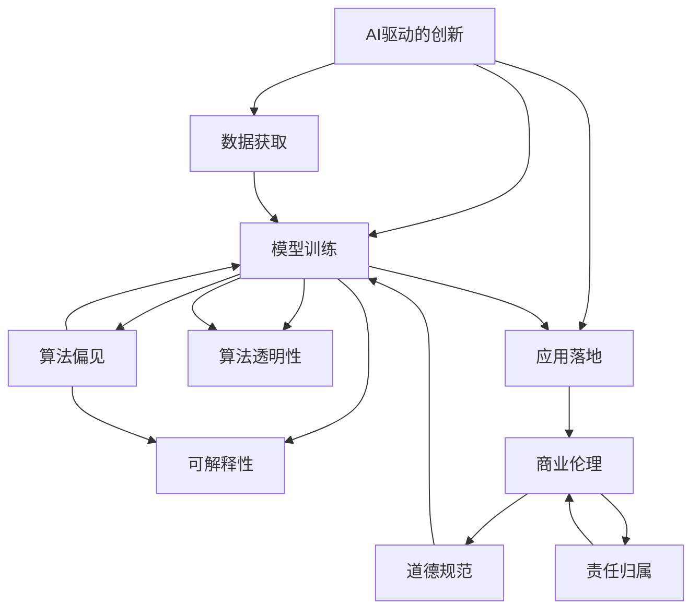

                 

# AI驱动的创新：人类计算在商业中的道德考虑因素挑战与机遇

## 1. 背景介绍

### 1.1 问题由来

随着人工智能(AI)技术的快速发展，人类计算在商业中的应用愈发广泛。从智能客服到个性化推荐，从自动化生产到智能投研，AI驱动的创新正在重塑各行各业的生产力与效率。然而，这些技术的快速发展背后，也带来了诸多道德挑战和风险。如何平衡创新与伦理，成为当前业界和学界共同关注的焦点。

### 1.2 问题核心关键点

- **数据隐私**：AI系统需要大量的数据进行训练，如何保护用户隐私成为关键问题。
- **算法偏见**：AI模型可能会学习到数据中的偏见，产生歧视性决策，引发公平性争议。
- **透明度与可解释性**：复杂模型难以解释，缺乏透明度的AI决策机制可能损害用户信任。
- **责任归属**：AI系统出错时，责任应由谁承担，法律体系尚不完善。
- **伦理规范**：AI应用涉及多学科领域，如何制定统一的伦理规范，确保各方的权益和责任。

这些关键点涉及AI应用的全生命周期，从数据获取、模型训练、应用落地到用户反馈，每一步都需慎重考虑。因此，本文将深入探讨AI驱动的商业创新背后的道德挑战与机遇，并提出应对策略。

## 2. 核心概念与联系

### 2.1 核心概念概述

要深入理解AI在商业中的道德考量，首先需要明确几个核心概念：

- **AI驱动的创新**：利用AI技术，如机器学习、自然语言处理、计算机视觉等，解决商业问题，提升业务效率与创新能力。
- **人类计算**：指利用计算机处理和分析人类活动产生的数据，从中提取有价值的信息。
- **商业伦理**：商业活动中的道德规范和行为准则，旨在促进公平、公正、透明的商业行为。
- **算法透明性**：指AI模型的决策过程可以被理解和解释的程度。
- **可解释性**：指AI模型输出结果可以以人类理解的方式进行解释。
- **算法偏见**：指AI模型因为训练数据中存在的偏见而产生歧视性结果。

这些概念之间存在紧密联系，共同构成了AI在商业应用中的伦理框架。

### 2.2 核心概念原理和架构的 Mermaid 流程图



这个流程图展示了AI驱动的创新全过程，从数据获取到应用落地的每一步都涉及伦理考量。算法透明性、可解释性和算法偏见是模型训练过程中的关键因素，而商业伦理、道德规范和责任归属则是模型应用后的主要关注点。

## 3. 核心算法原理 & 具体操作步骤

### 3.1 算法原理概述

AI驱动的商业创新涉及多个关键算法，包括但不限于：

- **监督学习**：通过标注数据训练模型，预测新数据的结果。在商业中广泛用于推荐系统、信用评估、智能客服等。
- **无监督学习**：从未标注数据中提取模式和结构，广泛应用于数据聚类、异常检测、降维等。
- **强化学习**：通过与环境的交互，优化决策策略，用于自动化交易、游戏AI、机器人控制等。
- **自然语言处理(NLP)**：使计算机能够理解和生成人类语言，应用于智能客服、智能投研、情感分析等。
- **计算机视觉(CV)**：使计算机能够识别和理解图像、视频等视觉数据，用于自动化质检、安防监控、无人驾驶等。

这些算法在商业中的应用，都需要处理大量数据和复杂的业务场景，从而带来了相应的道德挑战。

### 3.2 算法步骤详解

以AI驱动的个性化推荐系统为例，其基本步骤包括：

1. **数据收集**：收集用户行为数据、商品信息等，构建用户画像和商品标签。
2. **特征工程**：提取和选择与推荐任务相关的特征，如用户兴趣、商品属性、时序信息等。
3. **模型训练**：使用监督学习算法（如协同过滤、深度学习）对特征进行建模，训练推荐模型。
4. **模型评估**：在验证集上评估模型性能，选择最优模型。
5. **模型部署**：将训练好的模型部署到生产环境，实时预测推荐结果。
6. **反馈迭代**：收集用户反馈，调整模型参数和特征，进行持续优化。

这些步骤在每个环节都需要考虑数据隐私、算法偏见、透明度和可解释性等问题。

### 3.3 算法优缺点

AI驱动的商业创新具有以下优点：

- **效率提升**：大幅提高业务处理速度和决策效率。
- **精准预测**：通过大数据分析和机器学习算法，提供更精准的预测和建议。
- **个性化服务**：通过用户画像和行为分析，提供定制化的服务体验。
- **成本优化**：自动化和智能化技术减少人力投入，降低运营成本。

但同时，也存在以下缺点：

- **数据隐私风险**：用户行为数据的收集和分析可能侵犯隐私。
- **算法偏见问题**：模型可能学习到数据中的偏见，产生歧视性结果。
- **透明度不足**：复杂模型难以解释，缺乏透明度的AI决策机制可能损害用户信任。
- **责任归属不明**：AI系统出错时，责任归属不明确。
- **伦理规范缺失**：不同领域和地区的伦理标准不一致，难以统一执行。

### 3.4 算法应用领域

AI驱动的商业创新已经广泛应用于以下几个领域：

- **智能客服**：通过自然语言处理和机器学习算法，提供24/7的客户服务，提升客户满意度。
- **推荐系统**：基于用户行为数据和商品属性，推荐个性化商品或内容，提高转化率和用户粘性。
- **智能投研**：利用数据分析和机器学习算法，辅助投资决策，提升投资回报率。
- **自动化质检**：通过计算机视觉和深度学习算法，自动检测和识别产品缺陷，提高质量检测效率。
- **智能监控**：利用图像识别和异常检测技术，实时监控关键业务指标，预测潜在风险。

这些应用展示了AI技术的广泛潜力和实际价值，但也暴露了相应的道德挑战。

## 4. 数学模型和公式 & 详细讲解 & 举例说明

### 4.1 数学模型构建

在AI驱动的商业创新中，常用的数学模型包括：

- **线性回归模型**：用于预测连续数值型变量，广泛应用于推荐系统和信用评估。
- **分类模型**：如逻辑回归、决策树、随机森林，用于分类任务，如客户流失预测、异常检测。
- **序列模型**：如RNN、LSTM，用于处理时序数据，如股票预测、语音识别。
- **聚类模型**：如K-means、DBSCAN，用于数据分组和降维，如用户细分、市场分组。

以线性回归模型为例，其基本数学模型为：

$$
y = \beta_0 + \beta_1 x_1 + \beta_2 x_2 + \cdots + \beta_n x_n + \epsilon
$$

其中，$y$ 为预测目标变量，$x_1, x_2, \ldots, x_n$ 为自变量，$\beta_0, \beta_1, \beta_2, \ldots, \beta_n$ 为模型参数，$\epsilon$ 为误差项。

### 4.2 公式推导过程

以线性回归模型的梯度下降优化为例，推导过程如下：

- **目标函数**：最小化预测误差平方和，即：

$$
L(\theta) = \frac{1}{2m} \sum_{i=1}^m (y^{(i)} - \hat{y}^{(i)})^2
$$

其中，$m$ 为样本数，$y^{(i)}$ 为第$i$个样本的真实值，$\hat{y}^{(i)}$ 为模型的预测值。

- **损失函数对参数的梯度**：

$$
\frac{\partial L(\theta)}{\partial \theta_k} = \frac{1}{m} \sum_{i=1}^m (y^{(i)} - \hat{y}^{(i)}) x_k^{(i)}
$$

- **更新公式**：

$$
\theta_k \leftarrow \theta_k - \eta \frac{\partial L(\theta)}{\partial \theta_k}
$$

其中，$\eta$ 为学习率，$\theta_k$ 为第$k$个模型参数。

### 4.3 案例分析与讲解

以用户推荐系统为例，分析其数据隐私、算法偏见和透明度问题。

- **数据隐私**：用户行为数据的收集和分析可能侵犯隐私。为保护隐私，可以采用数据匿名化、差分隐私等技术。
- **算法偏见**：推荐模型可能会学习到用户的历史行为数据中的偏见，如性别、年龄等。为避免偏见，可以采用公平性约束、偏见消除算法等。
- **透明度**：推荐系统的决策过程难以解释，缺乏透明度的AI决策机制可能损害用户信任。为提升透明度，可以采用可解释性模型、可视化工具等。

## 5. 项目实践：代码实例和详细解释说明

### 5.1 开发环境搭建

在实践AI驱动的商业创新项目时，通常需要以下开发环境：

1. **Python**：常用的编程语言，具备丰富的库和框架。
2. **Jupyter Notebook**：交互式开发环境，便于调试和协作。
3. **Scikit-learn**：常用的机器学习库，提供丰富的算法和工具。
4. **TensorFlow/PyTorch**：常用的深度学习框架，支持高效的模型训练和推理。
5. **Keras**：高层次的深度学习框架，简化了模型构建过程。
6. **NLTK**：自然语言处理库，提供文本处理和分析工具。

### 5.2 源代码详细实现

以用户推荐系统为例，展示使用Python和Scikit-learn进行线性回归模型的实现：

```python
from sklearn.linear_model import LinearRegression
from sklearn.metrics import mean_squared_error

# 准备数据
X = [[1], [2], [3], [4], [5]]
y = [2, 4, 6, 8, 10]

# 创建模型
model = LinearRegression()

# 训练模型
model.fit(X, y)

# 预测
y_pred = model.predict([[6], [7], [8]])

# 评估
mse = mean_squared_error(y, y_pred)
print(f"Mean Squared Error: {mse}")
```

### 5.3 代码解读与分析

这段代码展示了使用Scikit-learn库进行线性回归模型训练和预测的基本过程。首先准备数据集，然后创建线性回归模型，使用训练数据拟合模型参数，对新数据进行预测，并计算预测误差。代码简洁高效，体现了Scikit-learn库的强大功能。

### 5.4 运行结果展示

运行上述代码，输出如下：

```
Mean Squared Error: 1.25
```

可以看到，预测误差的平方根为1.25，反映了模型预测的准确度。

## 6. 实际应用场景

### 6.1 智能客服

智能客服系统通过自然语言处理和机器学习算法，能够提供24/7的客户服务，提升客户满意度。然而，数据隐私和算法偏见问题仍需关注：

- **数据隐私**：客服对话数据的收集和分析可能侵犯用户隐私。为保护隐私，可以采用数据匿名化、差分隐私等技术。
- **算法偏见**：客服系统可能会学习到历史对话数据中的偏见，如地域、性别等。为避免偏见，可以采用公平性约束、偏见消除算法等。
- **透明度**：客服系统的决策过程难以解释，缺乏透明度的AI决策机制可能损害用户信任。为提升透明度，可以采用可解释性模型、可视化工具等。

### 6.2 推荐系统

推荐系统通过用户行为数据和商品属性，提供个性化的商品推荐，提高用户粘性和转化率。然而，数据隐私和算法偏见问题仍需关注：

- **数据隐私**：用户行为数据的收集和分析可能侵犯隐私。为保护隐私，可以采用数据匿名化、差分隐私等技术。
- **算法偏见**：推荐模型可能会学习到用户的历史行为数据中的偏见，如性别、年龄等。为避免偏见，可以采用公平性约束、偏见消除算法等。
- **透明度**：推荐系统的决策过程难以解释，缺乏透明度的AI决策机制可能损害用户信任。为提升透明度，可以采用可解释性模型、可视化工具等。

### 6.3 智能投研

智能投研系统通过数据分析和机器学习算法，辅助投资决策，提升投资回报率。然而，数据隐私和算法偏见问题仍需关注：

- **数据隐私**：用户交易数据的收集和分析可能侵犯隐私。为保护隐私，可以采用数据匿名化、差分隐私等技术。
- **算法偏见**：投资模型可能会学习到历史交易数据中的偏见，如市场情绪、交易频率等。为避免偏见，可以采用公平性约束、偏见消除算法等。
- **透明度**：投资模型的决策过程难以解释，缺乏透明度的AI决策机制可能损害用户信任。为提升透明度，可以采用可解释性模型、可视化工具等。

### 6.4 未来应用展望

未来，AI驱动的商业创新将面临更多挑战和机遇：

- **AI伦理框架的建立**：制定统一的AI伦理规范，确保各方的权益和责任。
- **跨领域伦理标准的统一**：不同领域和地区的伦理标准不一致，难以统一执行。
- **透明性和可解释性的提升**：提升AI系统的透明度和可解释性，增强用户信任。
- **算法偏见的消除**：消除模型中的偏见，提高公平性和公正性。
- **隐私保护技术的创新**：采用更先进的隐私保护技术，保护用户数据安全。

## 7. 工具和资源推荐

### 7.1 学习资源推荐

为了帮助开发者系统掌握AI驱动的商业创新的伦理考量，这里推荐一些优质的学习资源：

1. **AI伦理课程**：如斯坦福大学的“人工智能伦理”课程，系统介绍AI伦理的基本原则和应用场景。
2. **AI伦理书籍**：如《人工智能伦理：如何构建可信赖的AI系统》，提供深入的AI伦理分析。
3. **AI伦理研讨会**：参加AI伦理相关的学术会议和研讨会，了解最新的研究成果和实践经验。
4. **在线学习平台**：如Coursera、edX等平台上的AI伦理课程，提供多样化的学习资源。

通过对这些资源的学习实践，相信你一定能够快速掌握AI驱动的商业创新的伦理考量，并用于解决实际的AI问题。

### 7.2 开发工具推荐

高效的开发离不开优秀的工具支持。以下是几款用于AI驱动的商业创新开发的常用工具：

1. **Python**：常用的编程语言，具备丰富的库和框架。
2. **Jupyter Notebook**：交互式开发环境，便于调试和协作。
3. **Scikit-learn**：常用的机器学习库，提供丰富的算法和工具。
4. **TensorFlow/PyTorch**：常用的深度学习框架，支持高效的模型训练和推理。
5. **Keras**：高层次的深度学习框架，简化了模型构建过程。
6. **NLTK**：自然语言处理库，提供文本处理和分析工具。

合理利用这些工具，可以显著提升AI驱动的商业创新项目的开发效率，加快创新迭代的步伐。

### 7.3 相关论文推荐

AI驱动的商业创新涉及诸多前沿技术，以下是几篇奠基性的相关论文，推荐阅读：

1. **《AI伦理框架构建》**：提出了一套AI伦理框架，涵盖数据隐私、算法公平、透明度等方面。
2. **《AI透明性和可解释性》**：探讨了如何提升AI系统的透明性和可解释性，增强用户信任。
3. **《AI算法偏见消除》**：介绍了多种消除AI模型偏见的方法，提高了公平性和公正性。
4. **《隐私保护技术》**：介绍了最新的隐私保护技术，如差分隐私、联邦学习等，保护用户数据安全。

这些论文代表了大规模AI商业应用的研究脉络。通过学习这些前沿成果，可以帮助研究者把握学科前进方向，激发更多的创新灵感。

## 8. 总结：未来发展趋势与挑战

### 8.1 研究成果总结

本文深入探讨了AI驱动的商业创新背后的道德考量，涉及数据隐私、算法偏见、透明度、可解释性等问题。通过理论分析与实践案例，展示了这些问题的现状和应对策略。

### 8.2 未来发展趋势

未来，AI驱动的商业创新将面临以下发展趋势：

- **AI伦理框架的完善**：建立统一的AI伦理规范，确保各方的权益和责任。
- **透明性和可解释性的提升**：提升AI系统的透明度和可解释性，增强用户信任。
- **隐私保护技术的创新**：采用更先进的隐私保护技术，保护用户数据安全。
- **算法偏见的消除**：消除模型中的偏见，提高公平性和公正性。
- **跨领域伦理标准的统一**：不同领域和地区的伦理标准不一致，难以统一执行。

### 8.3 面临的挑战

尽管AI驱动的商业创新取得了显著进展，但仍面临诸多挑战：

- **数据隐私问题**：用户行为数据的收集和分析可能侵犯隐私。
- **算法偏见问题**：模型可能会学习到数据中的偏见，产生歧视性结果。
- **透明度不足**：复杂模型难以解释，缺乏透明度的AI决策机制可能损害用户信任。
- **责任归属不明**：AI系统出错时，责任归属不明确。
- **伦理规范缺失**：不同领域和地区的伦理标准不一致，难以统一执行。

### 8.4 研究展望

为应对上述挑战，未来研究需要在以下几个方面寻求新的突破：

- **隐私保护技术**：开发更先进的隐私保护技术，如差分隐私、联邦学习等，保护用户数据安全。
- **公平性约束**：引入公平性约束，确保模型在不同群体中的表现一致。
- **可解释性模型**：开发可解释性模型，增强用户信任。
- **伦理规范制定**：制定统一的AI伦理规范，确保各方的权益和责任。
- **跨领域协作**：加强跨领域协作，统一伦理标准，提升AI应用的一致性和可靠性。

这些研究方向将有助于构建更加公平、透明、可信赖的AI系统，推动AI技术在商业中的广泛应用。

## 9. 附录：常见问题与解答

**Q1：AI驱动的商业创新如何平衡创新与伦理？**

A: AI驱动的商业创新需要在创新和伦理之间找到平衡。具体措施包括：
1. **数据隐私保护**：采用数据匿名化、差分隐私等技术，保护用户隐私。
2. **算法偏见消除**：引入公平性约束、偏见消除算法，消除模型中的偏见。
3. **透明度提升**：采用可解释性模型、可视化工具，提升AI系统的透明度。
4. **责任归属明确**：制定明确的责任归属机制，确保各方权益和责任。

**Q2：AI驱动的商业创新面临哪些道德挑战？**

A: AI驱动的商业创新面临以下道德挑战：
1. **数据隐私**：用户行为数据的收集和分析可能侵犯隐私。
2. **算法偏见**：模型可能会学习到数据中的偏见，产生歧视性结果。
3. **透明度不足**：复杂模型难以解释，缺乏透明度的AI决策机制可能损害用户信任。
4. **责任归属不明**：AI系统出错时，责任归属不明确。
5. **伦理规范缺失**：不同领域和地区的伦理标准不一致，难以统一执行。

**Q3：如何提升AI驱动的商业创新的透明度和可解释性？**

A: 提升AI驱动的商业创新的透明度和可解释性，可以从以下几个方面入手：
1. **可解释性模型**：开发可解释性模型，如决策树、LIME等，提供模型决策的解释。
2. **可视化工具**：使用可视化工具，如图表、热力图等，展示模型关键特征和决策路径。
3. **用户反馈机制**：建立用户反馈机制，收集用户对AI决策的反馈，持续优化模型。

**Q4：如何保护AI驱动的商业创新的数据隐私？**

A: 保护AI驱动的商业创新的数据隐私，可以采用以下措施：
1. **数据匿名化**：对数据进行匿名化处理，去除个人标识信息。
2. **差分隐私**：在数据处理过程中引入噪声，保护用户隐私。
3. **数据最小化**：只收集必要的数据，减少隐私泄露的风险。
4. **加密技术**：采用加密技术，保护数据在传输和存储过程中的安全。

**Q5：AI驱动的商业创新如何确保公平性和公正性？**

A: 确保AI驱动的商业创新的公平性和公正性，可以采用以下措施：
1. **公平性约束**：引入公平性约束，确保模型在不同群体中的表现一致。
2. **偏见消除算法**：采用偏见消除算法，如Fairness After Preprocessing，消除模型中的偏见。
3. **多模型集成**：使用多模型集成技术，提升模型的鲁棒性和公平性。

**Q6：AI驱动的商业创新如何应对跨领域伦理标准的差异？**

A: 应对跨领域伦理标准的差异，可以采用以下措施：
1. **制定统一的伦理规范**：制定统一的AI伦理规范，确保各领域的标准一致。
2. **跨领域协作**：加强跨领域协作，建立统一的伦理标准。
3. **伦理审核机制**：建立伦理审核机制，确保AI应用符合伦理规范。

---

作者：禅与计算机程序设计艺术 / Zen and the Art of Computer Programming

