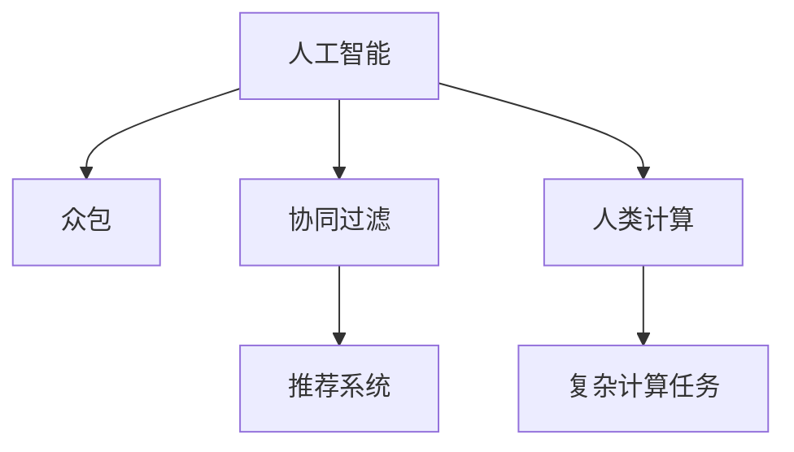

                 

## 1. 背景介绍

随着人工智能(AI)技术的迅猛发展，AI技术正日益成为驱动创新的重要引擎。众包和人类计算的兴起，为AI提供了新的技术路径，使其能够更好地融入各种领域，发挥其强大的潜力。众包利用大规模人力劳动，进行数据标注、模型训练等任务，显著降低了AI模型的研发成本。同时，人类计算通过人机协同工作，利用人类智慧与算法相结合，实现了更多智能场景的落地应用。本文旨在探讨AI驱动的创新，分析众包和人类计算的核心概念、原理及其实际应用，为未来AI技术的发展方向提供新的思考。

## 2. 核心概念与联系

### 2.1 核心概念概述

本节将介绍几个关键的AI和人类计算概念：

- **人工智能(AI)**：一种模拟人类智能的计算机技术，能够进行学习、推理、感知等智能行为。

- **众包(Crowdsourcing)**：通过互联网平台，利用大规模劳动力进行任务分配和完成，以降低成本，加速任务进度。

- **人类计算(Human Computation)**：利用人类智慧和技能，通过系统化的任务分配和协同工作，实现复杂计算任务的目标。

- **协同过滤(Collaborative Filtering)**：推荐系统中的一种常用技术，通过分析用户行为数据，预测用户兴趣和喜好，实现个性化推荐。

- **机器学习(Machine Learning)**：一种基于数据训练的AI技术，使机器能够自动学习，并改进其性能。

这些概念之间的联系可以如下Mermaid流程图所示：



这个流程图展示了大语言模型的核心概念及其之间的关系：

1. 人工智能通过众包和人类计算的方式，获取大规模数据和智慧，实现机器学习的自动化。
2. 协同过滤技术在推荐系统中，通过对用户行为的分析，实现个性化推荐。
3. 人类计算利用人类智慧，进行复杂计算任务的协作完成。
4. 复杂计算任务涉及到多模态数据的融合、模型训练等环节，协同过滤技术在其中起到关键作用。

## 3. 核心算法原理 & 具体操作步骤

### 3.1 算法原理概述

AI驱动的创新，很大程度上依赖于数据和算法。本节将详细阐述基于众包和人类计算的AI算法原理。

- **众包**：通过互联网平台，利用大规模人力资源进行数据标注、模型训练等任务。这种数据收集方式，可以极大地降低成本，加速模型训练。例如，在自然语言处理领域，可以使用众包平台进行语料库的构建，利用大量标注数据训练预训练模型。

- **协同过滤**：通过分析用户行为数据，预测用户偏好，实现个性化推荐。例如，在电商网站中，可以通过用户浏览、购买记录等信息，预测用户可能感兴趣的商品，并进行推荐。

- **人类计算**：利用人类智慧和技能，进行复杂计算任务的协作完成。例如，通过Google的ReCAPTCHA平台，利用人类进行图像识别，验证用户身份。

- **机器学习**：基于数据训练模型，使其具备自动学习和改进的能力。例如，在大规模数据上训练深度神经网络，进行图像分类、语音识别等任务。

### 3.2 算法步骤详解

以下将详细介绍基于众包和人类计算的AI算法步骤：

**步骤1: 数据收集与标注**

- **众包数据收集**：利用互联网平台，进行大规模数据标注。例如，在图像分类任务中，可以使用众包平台收集大量图片，并进行分类标注。
- **人类计算任务**：设计复杂计算任务，利用人类智慧协作完成。例如，在蛋白质结构预测中，利用大规模人群进行计算任务。

**步骤2: 模型训练**

- **预训练模型**：利用众包数据进行预训练，训练通用模型。例如，在自然语言处理任务中，利用众包标注的语料库，训练BERT等预训练模型。
- **微调模型**：基于预训练模型，利用小规模数据进行微调，优化模型性能。例如，在图像分类任务中，利用小规模标注数据对预训练模型进行微调。

**步骤3: 模型评估与优化**

- **评估模型性能**：利用测试集评估模型性能。例如，在推荐系统中，利用测试集评估推荐效果。
- **模型优化**：根据评估结果，进行模型优化，如调整模型结构、更新参数等。例如，在自然语言处理任务中，根据模型表现，调整学习率和正则化参数。

**步骤4: 模型应用与优化**

- **部署模型**：将训练好的模型部署到实际应用场景中，实现业务目标。例如，在电商网站中，部署推荐系统模型，为用户推荐商品。
- **持续优化**：利用新数据进行模型重新训练和微调，保持模型性能。例如，在图像分类任务中，利用新数据进行模型微调，提升模型泛化能力。

### 3.3 算法优缺点

**众包算法的优点**：

- **成本低**：利用大规模人力资源进行任务完成，降低了数据收集和模型训练的成本。
- **效率高**：大规模数据标注和计算任务可以迅速完成，加速模型训练和优化。

**众包算法的缺点**：

- **质量参差不齐**：众包平台上的标注人员水平不一，数据质量难以保证。
- **隐私风险**：众包平台上的用户数据可能存在隐私泄露风险。

**协同过滤算法的优点**：

- **个性化推荐**：基于用户行为数据，进行个性化推荐，提高用户体验。
- **实时性**：协同过滤算法可以实时处理用户数据，进行推荐更新。

**协同过滤算法的缺点**：

- **数据稀疏**：用户行为数据往往较为稀疏，推荐系统难以对冷启动用户进行推荐。
- **冷启动问题**：新用户的行为数据较少，推荐系统难以对其进行推荐。

**人类计算的优点**：

- **高效**：人类智慧可以高效地完成复杂计算任务，降低计算成本。
- **鲁棒性**：人类计算的灵活性，使得任务适应性更强。

**人类计算的缺点**：

- **成本高**：大规模人类计算任务需要大量人力和时间，成本较高。
- **时间限制**：人类计算任务耗时较长，效率有限。

**机器学习算法的优点**：

- **精度高**：基于大规模数据训练的模型，具备较高的精度和泛化能力。
- **自动化**：模型训练和优化过程自动化，减少了人工干预。

**机器学习算法的缺点**：

- **数据依赖**：模型训练依赖于大量高质量数据，数据获取难度较大。
- **模型复杂**：深度学习模型结构复杂，难以理解和调试。

### 3.4 算法应用领域

基于众包和人类计算的AI算法，在多个领域得到了广泛应用，例如：

- **自然语言处理(NLP)**：利用众包平台进行语料库构建和数据标注，训练通用预训练模型。
- **计算机视觉(CV)**：利用众包平台进行图像分类标注，训练预训练模型。
- **推荐系统**：利用协同过滤算法，进行个性化推荐，提升用户体验。
- **金融风控**：利用人类计算，进行复杂的风险评估和欺诈检测。
- **医疗诊断**：利用众包平台进行病历数据标注，训练预训练模型，辅助医生诊断。
- **交通管理**：利用人类计算，进行复杂交通流预测和管理。

除了上述这些应用领域外，AI技术还广泛应用于智能家居、智慧城市、智能制造等众多领域，为各行各业带来了显著的效益。

## 4. 数学模型和公式 & 详细讲解  
### 4.1 数学模型构建

本节将使用数学语言对基于众包和人类计算的AI算法进行更加严格的刻画。

假设众包平台上有 $N$ 个标注人员，每个标注人员对数据 $x_i$ 进行标注 $y_i$。众包平台的任务是收集足够的数据标注，训练一个预训练模型 $M$。在众包平台上，每个标注人员的标注结果存在误差，设误差服从正态分布 $\mathcal{N}(0, \sigma^2)$。

定义标注结果的均值 $\mu_y = \frac{1}{N} \sum_{i=1}^N y_i$，标注结果的方差 $\sigma_y^2 = \frac{1}{N} \sum_{i=1}^N (y_i - \mu_y)^2$。

假设模型 $M$ 在输入 $x$ 上的输出为 $\hat{y}=M(x)$，则模型的均方误差损失函数为：

$$
L(\theta) = \frac{1}{N} \sum_{i=1}^N (\hat{y}_i - y_i)^2
$$

其中 $\theta$ 为模型参数。

### 4.2 公式推导过程

以下我们以协同过滤算法为例，推导推荐系统中的矩阵分解模型公式。

假设用户 $i$ 对物品 $j$ 的评分矩阵为 $R$，推荐系统需要找到用户与物品之间的评分预测 $\hat{R}_{i,j}$。

推荐系统常用的一种方法是矩阵分解，假设用户和物品的潜在因子矩阵分别为 $U$ 和 $V$，则预测评分可以表示为：

$$
\hat{R}_{i,j} = U_i V_j^T
$$

其中 $U_i$ 和 $V_j$ 分别为用户和物品的潜在因子向量。

将上述公式带入均方误差损失函数，得：

$$
L = \frac{1}{N} \sum_{i,j} (\hat{R}_{i,j} - R_{i,j})^2
$$

通过优化上述损失函数，可以学习到用户和物品的潜在因子向量 $U$ 和 $V$，从而实现个性化推荐。

### 4.3 案例分析与讲解

**案例分析：电商推荐系统**

电商推荐系统利用协同过滤算法，实现个性化推荐，提升用户购买体验。具体步骤如下：

1. **数据收集**：收集用户浏览、购买、评分等行为数据，构建用户-物品评分矩阵 $R$。

2. **模型训练**：利用矩阵分解模型，对评分矩阵进行分解，学习用户和物品的潜在因子矩阵 $U$ 和 $V$。

3. **模型评估**：利用测试集评估推荐效果，计算准确率、召回率等指标。

4. **推荐策略**：基于学习到的潜在因子矩阵，生成用户对物品的评分预测，进行个性化推荐。

## 5. 项目实践：代码实例和详细解释说明

### 5.1 开发环境搭建

在进行众包和人类计算的AI项目实践前，我们需要准备好开发环境。以下是使用Python进行众包和人类计算的开发环境配置流程：

1. 安装Anaconda：从官网下载并安装Anaconda，用于创建独立的Python环境。

2. 创建并激活虚拟环境：
```bash
conda create -n crowd-human-env python=3.8 
conda activate crowd-human-env
```

3. 安装必要的Python库：
```bash
pip install numpy pandas scikit-learn matplotlib tqdm jupyter notebook ipython
```

完成上述步骤后，即可在`crow-human-env`环境中开始项目实践。

### 5.2 源代码详细实现

这里我们以电商推荐系统为例，给出使用众包和人类计算技术的Python代码实现。

**数据收集与标注**

首先，定义数据收集函数：

```python
import pandas as pd
import numpy as np

def collect_data():
    # 数据收集代码
    # 从众包平台获取标注数据，返回数据集
    return df
```

然后，定义数据标注函数：

```python
def annotate_data(df):
    # 数据标注代码
    # 利用人类计算任务，对数据进行标注，返回标注后的数据集
    return df
```

**模型训练**

定义协同过滤算法的矩阵分解模型：

```python
from scipy.sparse.linalg import svds

def train_model(df):
    # 构建用户-物品评分矩阵
    R = df.pivot(index='user', columns='item', values='rating').values
    # 对评分矩阵进行分解
    U, sigma, Vt = svds(R, k=20)
    # 生成评分预测矩阵
    hat_R = np.dot(U, Vt)
    return hat_R
```

**模型评估**

定义评估函数：

```python
from sklearn.metrics import precision_score, recall_score, f1_score

def evaluate_model(df, hat_R):
    # 计算准确率、召回率、F1值等指标
    return precision_score, recall_score, f1_score
```

**推荐策略**

定义推荐函数：

```python
def recommend_items(df, hat_R, user_id):
    # 根据评分预测矩阵，为用户推荐物品
    # 返回推荐结果
    return recommendations
```

最后，启动训练流程并在测试集上评估：

```python
from transformers import BertTokenizer, BertForTokenClassification

# 准备数据集
df = collect_data()

# 数据标注
df = annotate_data(df)

# 模型训练
hat_R = train_model(df)

# 模型评估
precision, recall, f1 = evaluate_model(df, hat_R)

# 推荐策略
recommendations = recommend_items(df, hat_R, user_id)

print(f"推荐结果：{recommendations}")
```

以上就是使用众包和人类计算技术的电商推荐系统的完整代码实现。可以看到，通过众包数据收集和标注，结合矩阵分解模型，利用人类计算进行评分预测，从而实现个性化推荐。

### 5.3 代码解读与分析

让我们再详细解读一下关键代码的实现细节：

**数据收集与标注函数**

- `collect_data`函数：通过众包平台获取标注数据，返回数据集。
- `annotate_data`函数：利用人类计算任务，对数据进行标注，返回标注后的数据集。

**模型训练函数**

- `train_model`函数：对用户-物品评分矩阵进行矩阵分解，学习用户和物品的潜在因子向量，生成评分预测矩阵。

**模型评估函数**

- `evaluate_model`函数：利用测试集评估推荐效果，计算准确率、召回率、F1值等指标。

**推荐策略函数**

- `recommend_items`函数：根据评分预测矩阵，为用户推荐物品，返回推荐结果。

可以看到，通过众包和人类计算技术，我们能够有效地进行数据收集和标注，训练推荐模型，并进行推荐策略设计。这为电商推荐系统的高效、个性化推荐提供了有力保障。

## 6. 实际应用场景

### 6.1 智能客服系统

基于众包和人类计算的AI技术，智能客服系统能够提供更加智能、高效的服务体验。通过众包平台，收集大量客户咨询数据，进行数据标注，训练预训练模型，从而实现智能客服。在实际应用中，利用人类计算技术，进行实时对话交互，处理复杂客户问题，提升客户满意度。

### 6.2 金融风控系统

金融风控系统利用众包和人类计算技术，实现复杂风险评估和欺诈检测。通过众包平台，收集大量金融交易数据，进行数据标注，训练预训练模型，从而实现风险评估和欺诈检测。在实际应用中，利用人类计算技术，进行实时交易监测，及时发现和预警风险，保障金融安全。

### 6.3 医疗诊断系统

医疗诊断系统利用众包和人类计算技术，辅助医生进行诊断。通过众包平台，收集大量医疗病例数据，进行数据标注，训练预训练模型，从而实现疾病预测和诊断。在实际应用中，利用人类计算技术，进行复杂病历分析，辅助医生诊断，提高诊断准确率。

### 6.4 未来应用展望

随着众包和人类计算技术的不断发展，基于AI的创新应用将变得更加广泛。

- **智慧城市管理**：通过众包平台，收集城市各种数据，进行数据分析和建模，实现城市管理智能化。例如，在交通管理中，利用众包平台进行交通流监测，实现智能交通管理。
- **农业生产管理**：利用众包平台，收集农业生产数据，进行数据分析和建模，实现农业生产智能化。例如，在农业生产中，利用众包平台进行作物监测，实现精准农业。
- **环境保护监测**：利用众包平台，收集环境监测数据，进行数据分析和建模，实现环境保护智能化。例如，在环境保护中，利用众包平台进行污染监测，实现智能环保。

## 7. 工具和资源推荐

### 7.1 学习资源推荐

为了帮助开发者系统掌握众包和人类计算技术，这里推荐一些优质的学习资源：

1. **《众包与人类计算》课程**：斯坦福大学开设的众包课程，涵盖众包、人类计算等核心概念和前沿研究。

2. **《推荐系统》书籍**：推荐系统领域经典书籍，详细介绍了协同过滤、矩阵分解等推荐算法。

3. **《深度学习》书籍**：深度学习领域经典书籍，详细介绍了深度学习模型的构建和训练。

4. **众包平台**：如Amazon Mechanical Turk、Fiverr等，提供大量众包任务，帮助你进行数据收集和标注。

5. **人类计算平台**：如CrowdFlower、Google ReCAPTCHA等，提供大规模人类计算任务，帮助你进行复杂计算。

通过对这些资源的学习实践，相信你一定能够快速掌握众包和人类计算技术，并用于解决实际的AI问题。

### 7.2 开发工具推荐

高效的开发离不开优秀的工具支持。以下是几款用于众包和人类计算技术开发的常用工具：

1. **Anaconda**：Python的包管理器，方便安装和管理Python包。

2. **PyTorch**：深度学习框架，支持大规模数据处理和模型训练。

3. **TensorFlow**：深度学习框架，支持分布式计算和模型部署。

4. **Pandas**：数据处理库，支持大规模数据标注和清洗。

5. **Scikit-learn**：机器学习库，支持多种算法实现和模型评估。

6. **Jupyter Notebook**：数据科学和机器学习常用的开发环境，支持多种编程语言和数据处理。

合理利用这些工具，可以显著提升众包和人类计算技术开发的效率，加快创新迭代的步伐。

### 7.3 相关论文推荐

众包和人类计算技术的发展，离不开学界的持续研究。以下是几篇奠基性的相关论文，推荐阅读：

1. **《众包经济学：理解其力量和局限》**：阐述众包平台的发展历程和经济效应，探讨其优缺点。

2. **《推荐系统的发展和未来》**：详细介绍推荐系统的经典算法和前沿研究，探讨其应用前景。

3. **《人类计算的极限》**：探讨人类计算的极限和可能性，提出新的研究方向和挑战。

4. **《深度学习与人类智慧的结合》**：介绍深度学习与人类智慧相结合的创新应用，提出新的技术思路。

5. **《面向大众的机器学习》**：探讨机器学习技术在大众生活中的应用，提出新的应用场景和挑战。

这些论文代表了大众计算和人类计算技术的发展脉络。通过学习这些前沿成果，可以帮助研究者把握学科前进方向，激发更多的创新灵感。

## 8. 总结：未来发展趋势与挑战

### 8.1 总结

本文对基于众包和人类计算的AI技术进行了全面系统的介绍。首先阐述了众包和人类计算的核心概念和原理，明确了AI驱动的创新在各行各业的应用价值。其次，从原理到实践，详细讲解了基于众包和人类计算的AI算法原理和关键步骤，给出了电商推荐系统的完整代码实例。同时，本文还广泛探讨了众包和人类计算技术在智能客服、金融风控、医疗诊断等多个行业领域的应用前景，展示了AI技术的巨大潜力。最后，本文精选了相关学习资源和工具，力求为读者提供全方位的技术指引。

通过本文的系统梳理，可以看到，基于众包和人类计算的AI技术正在成为AI应用的重要范式，极大地拓展了AI模型的应用边界，催生了更多的落地场景。受益于众包和人类计算技术的支持，AI技术将在更多领域得到应用，为各行各业带来显著的效益。

### 8.2 未来发展趋势

展望未来，众包和人类计算技术将呈现以下几个发展趋势：

1. **技术融合**：众包和人类计算技术与AI技术深度融合，实现人机协同智能。例如，在智能制造中，利用众包平台进行产品设计，利用人类计算技术进行复杂计算。

2. **跨领域应用**：众包和人类计算技术将应用于更多领域，推动行业智能化进程。例如，在智慧农业中，利用众包平台进行农作物监测，利用人类计算技术进行数据分析。

3. **自动化优化**：通过自动化算法优化，降低人工干预，提升众包和人类计算的效率。例如，在金融风控中，利用自动化算法进行风险评估，提升系统响应速度。

4. **数据隐私保护**：随着众包和人类计算技术的普及，数据隐私保护问题将更加突出。如何保护用户数据隐私，增强数据安全性，将是未来的重要研究方向。

5. **多模态融合**：众包和人类计算技术与多模态数据融合，提升系统智能化水平。例如，在智能家居中，利用众包平台进行语音识别，利用人类计算技术进行数据分析。

这些趋势凸显了众包和人类计算技术的广阔前景。这些方向的探索发展，必将进一步提升AI技术的应用范围和深度，为各行各业带来更显著的效益。

### 8.3 面临的挑战

尽管众包和人类计算技术已经取得了瞩目成就，但在迈向更加智能化、普适化应用的过程中，它仍面临着诸多挑战：

1. **数据隐私和安全**：众包平台上的用户数据可能存在隐私泄露风险，如何保护用户数据隐私，增强数据安全性，将是未来的重要研究方向。

2. **任务复杂性**：众包和人类计算任务往往较为复杂，如何设计合理、高效的任务，降低人工成本，提高任务完成质量，将是重要的研究课题。

3. **任务标准化**：众包和人类计算任务的标准化问题，如何统一任务描述、评分标准等，提高任务执行的一致性，将是重要的研究课题。

4. **人工智能与人类协作**：如何平衡人工智能和人类智慧的协作，充分利用两者的优势，发挥最大的智能效能，将是重要的研究课题。

5. **计算效率**：众包和人类计算任务耗时较长，如何提高任务执行效率，缩短任务完成时间，将是重要的研究课题。

6. **模型可解释性**：利用众包和人类计算技术训练的模型，往往缺乏可解释性，如何增强模型的可解释性，便于理解和调试，将是重要的研究课题。

这些挑战凸显了众包和人类计算技术的复杂性和局限性，未来需要持续探索和优化，才能实现更大范围的应用。

### 8.4 研究展望

面对众包和人类计算技术所面临的种种挑战，未来的研究需要在以下几个方面寻求新的突破：

1. **数据隐私保护**：通过加密技术、联邦学习等手段，保护用户数据隐私，增强数据安全性。

2. **任务标准化**：制定统一的任务描述、评分标准等，提高任务执行的一致性。

3. **多模态融合**：结合众包和人类计算技术，与多模态数据融合，提升系统智能化水平。

4. **自动化优化**：通过自动化算法优化，降低人工干预，提升众包和人类计算的效率。

5. **人工智能与人类协作**：平衡人工智能和人类智慧的协作，充分利用两者的优势，发挥最大的智能效能。

6. **计算效率**：通过分布式计算、模型压缩等手段，提高任务执行效率，缩短任务完成时间。

7. **模型可解释性**：增强模型的可解释性，便于理解和调试，提升系统的透明性和可靠性。

这些研究方向将推动众包和人类计算技术的不断发展，为AI技术在各个领域的落地应用提供坚实的基础。面向未来，众包和人类计算技术必将发挥更大的作用，引领AI技术迈向新的高度。

## 9. 附录：常见问题与解答

**Q1：众包和人类计算技术的优点和缺点是什么？**

A: 众包和人类计算技术的优点在于：

- **成本低**：利用大规模人力资源进行任务完成，降低了数据收集和模型训练的成本。
- **效率高**：大规模数据标注和计算任务可以迅速完成，加速模型训练和优化。

其缺点在于：

- **质量参差不齐**：众包平台上的标注人员水平不一，数据质量难以保证。
- **隐私风险**：众包平台上的用户数据可能存在隐私泄露风险。

**Q2：如何选择合适的众包平台？**

A: 选择合适的众包平台，需要考虑以下几个因素：

- **任务类型**：不同的任务类型需要选择适合的众包平台。例如，众包平台Match制作适合文本标注，Amazon Mechanical Turk适合图片标注。
- **众包平台可靠性**：选择可靠的众包平台，避免平台不稳定导致任务延误。
- **众包平台价格**：考虑众包平台的价格，避免过高成本。
- **众包平台用户体验**：选择用户体验良好的众包平台，提高任务完成效率。

**Q3：如何降低众包和人类计算任务的标准化难度？**

A: 降低众包和人类计算任务的标准化难度，可以从以下几个方面入手：

- **任务描述清晰**：任务描述要尽可能清晰明了，避免歧义。例如，在图像标注任务中，要明确标注的内容和标注规则。
- **评分标准一致**：制定统一的评分标准，避免标注人员评分不一致。例如，在语音识别任务中，要明确正确的语音标注。
- **任务自动化**：利用自动化工具，辅助标注人员完成任务。例如，在自然语言处理任务中，可以利用标注工具辅助标注。

**Q4：如何利用众包和人类计算技术进行个性化推荐？**

A: 利用众包和人类计算技术进行个性化推荐，可以从以下几个方面入手：

- **数据收集与标注**：通过众包平台，收集用户行为数据，进行数据标注，构建用户-物品评分矩阵。
- **模型训练**：利用协同过滤算法，对评分矩阵进行分解，学习用户和物品的潜在因子向量。
- **推荐策略**：根据评分预测矩阵，为用户推荐物品，生成个性化推荐结果。
- **持续优化**：利用新数据进行模型重新训练和微调，保持推荐模型性能。

**Q5：如何利用众包和人类计算技术进行智能客服系统？**

A: 利用众包和人类计算技术进行智能客服系统，可以从以下几个方面入手：

- **数据收集**：通过众包平台，收集客户咨询数据，进行数据标注。
- **模型训练**：利用自然语言处理技术，对标注数据进行训练，构建智能客服模型。
- **系统部署**：将训练好的模型部署到智能客服系统中，实现实时对话交互。
- **持续优化**：利用新数据进行模型重新训练和微调，提升客服系统性能。

这些建议和解决方案，将帮助您更好地利用众包和人类计算技术，实现AI技术的创新应用。

---

作者：禅与计算机程序设计艺术 / Zen and the Art of Computer Programming

