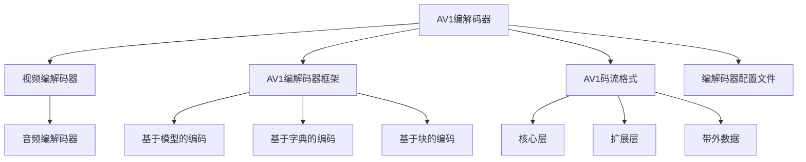

                 

# AV1 视频格式标准介绍：下一代开放媒体编码的优势和应用

## 1. 背景介绍

随着视频内容的爆炸性增长，对视频编解码效率和压缩质量提出了更高的要求。传统的H.264、H.265等标准虽然已在多个领域广泛应用，但随着视频格式和硬件设备的快速发展，它们的不足也逐渐显露出来。AV1（Alliance for Open Media Video Codec）作为新一代的开放媒体编码标准，以其高效、开放、易用等特性，迅速成为了视频编码领域的后起之秀。

本文将系统性地介绍AV1视频格式标准，从背景到核心概念，从算法原理到应用实践，全面解析AV1的独特优势和潜在应用前景，为读者提供深入的理论和技术支持。

## 2. 核心概念与联系

### 2.1 核心概念概述

AV1视频格式标准是由Alliance for Open Media（AOM）主导开发的一种开源视频编解码技术。其核心设计理念是通过灵活的编码工具、高效的压缩算法、良好的用户体验，提供一种更加灵活、高效、易用的视频编码解决方案，以适应未来视频技术的发展需求。

#### 2.2 关键组件与概念
- **AV1编解码器**：AV1包括视频编解码器和音频编解码器。视频编解码器负责将原始视频信号压缩成高效的视频数据流，而音频编解码器则负责压缩音频信号。
- **AV1编解码器框架**：AV1的编解码器框架支持多种编码工具，如基于模型的编码、基于字典的编码、基于块的编码等，能够灵活地适应不同类型和质量的视频内容。
- **AV1码流格式**：AV1码流格式包括核心层、扩展层和带外数据等，可以灵活地扩展编码功能，支持高效的位率和帧率调整。
- **AV1编解码器配置文件**：编解码器配置文件用于控制编码参数和解码参数，实现不同级别的编码和解码效果。

#### 2.3 Mermaid流程图表示



## 3. 核心算法原理 & 具体操作步骤

### 3.1 算法原理概述

AV1视频格式标准的算法原理基于先进的压缩技术，如基于模型的编码、基于字典的编码、基于块的编码等，通过灵活的编码工具和高效的压缩算法，实现对视频数据的高效压缩和高质量重构。其核心算法包括基于模型的编码、基于字典的编码、基于块的编码和自适应量化等。

#### 3.2 算法步骤详解

AV1编解码器的具体步骤如下：

1. **视频编码**：
   - **分块**：将原始视频信号分割成若干块，每个块大小为64x64或128x128像素。
   - **帧内预测**：利用预测模式对块进行帧内预测，减少块内冗余。
   - **变换编码**：对预测残差进行离散余弦变换（DCT）或离散余弦变换扩展（DCTE），减少块间冗余。
   - **熵编码**：对变换系数进行熵编码，如霍夫曼编码或基于上下文的自适应二进制编码（ABCD）。

2. **视频解码**：
   - **熵解码**：对码流进行熵解码，得到变换系数。
   - **逆变换**：对变换系数进行逆变换，得到预测残差。
   - **加预测**：将预测残差与预测模式相加，得到原始块的预测值。
   - **帧间预测**：利用预测模式对块进行帧间预测，减少块间冗余。

3. **音频编码**：
   - **分块**：将原始音频信号分割成若干帧，每帧大小为20ms。
   - **频域编码**：对音频帧进行频域编码，如短时傅里叶变换（STFT）。
   - **熵编码**：对频域系数进行熵编码，如霍夫曼编码或基于上下文的自适应二进制编码（ABCD）。

4. **音频解码**：
   - **熵解码**：对码流进行熵解码，得到频域系数。
   - **逆变换**：对频域系数进行逆变换，得到原始音频帧。
   - **重构**：对音频帧进行重构，得到最终的音频信号。

### 3.3 算法优缺点

#### 3.3.1 优点

1. **高效压缩**：AV1采用先进的压缩技术，如基于模型的编码、基于字典的编码、基于块的编码等，能够实现高效的视频和音频压缩，减小码流体积。
2. **开放免费**：AV1采用开放源代码的方式，免费提供给全世界的开发者使用，无需支付专利费用。
3. **灵活扩展**：AV1的编解码器框架和码流格式支持多种扩展和配置，能够灵活地适应不同的应用场景和需求。
4. **良好的用户体验**：AV1的编解码器优化了编码和解码效率，能够在低延迟、高帧率下提供高质量的视频和音频输出。

#### 3.3.2 缺点

1. **复杂的编码工具**：AV1采用的多种编码工具需要较高的技术水平，对开发者的编码能力和经验要求较高。
2. **较高的计算复杂度**：AV1的某些编码工具和算法需要较高的计算复杂度，可能对硬件设备的要求较高。
3. **标准支持不足**：AV1作为相对年轻的视频编码标准，在硬件设备、软件工具和终端设备方面的支持不足，可能需要额外的适配工作。

### 3.4 算法应用领域

AV1视频格式标准适用于各种视频和音频的编解码需求，主要应用于以下领域：

- **流媒体**：如YouTube、Netflix等视频平台，通过AV1实现高效的流媒体传输。
- **智能电视**：如Amazon Fire TV、Google Chromecast等智能电视设备，支持AV1格式的视频和音频。
- **AR/VR**：如Oculus Rift、HTC Vive等虚拟现实设备，支持AV1格式的高质量视频和音频。
- **手机**：如Android、iOS等移动设备，支持AV1格式的视频和音频编码。

## 4. 数学模型和公式 & 详细讲解 & 举例说明

### 4.1 数学模型构建

AV1的数学模型主要包括编码模型和解码模型，其中编码模型包括基于模型的编码、基于字典的编码、基于块的编码等。

#### 4.2 公式推导过程

以基于模型的编码为例，其数学模型推导如下：

1. **帧内预测**：假设当前块大小为$M \times N$，预测模式为$\text{mode}$，则预测值可以表示为：
   $$
   y = \sum_{i=0}^{M-1} \sum_{j=0}^{N-1} x_{i,j} \cdot \delta_{i,j}(\text{mode})
   $$
   其中，$x_{i,j}$为块内像素值，$\delta_{i,j}(\text{mode})$为预测模式的值。

2. **变换编码**：对预测残差进行离散余弦变换（DCT）或离散余弦变换扩展（DCTE），得到变换系数。

3. **熵编码**：对变换系数进行熵编码，如霍夫曼编码或基于上下文的自适应二进制编码（ABCD）。

#### 4.3 案例分析与讲解

以YouTube平台为例，YouTube采用AV1编解码器对视频内容进行压缩和传输，其具体流程如下：

1. **编码**：
   - 将原始视频内容分割成若干块，每个块大小为64x64或128x128像素。
   - 对每个块进行帧内预测和帧间预测，减少块内和块间冗余。
   - 对预测残差进行离散余弦变换（DCT）或离散余弦变换扩展（DCTE），减少块间冗余。
   - 对变换系数进行熵编码，如霍夫曼编码或基于上下文的自适应二进制编码（ABCD）。

2. **传输**：
   - 将编码后的码流通过互联网传输至用户终端。
   - 用户终端对码流进行解码，还原出原始视频内容。

3. **解码**：
   - 对码流进行熵解码，得到变换系数。
   - 对变换系数进行逆变换，得到预测残差。
   - 将预测残差与预测模式相加，得到原始块的预测值。
   - 对每个块进行帧间预测，减少块间冗余。

## 5. 项目实践：代码实例和详细解释说明

### 5.1 开发环境搭建

要使用AV1编解码器，需要安装AOM SDK和其他相关工具。以下是在Linux系统上搭建AV1开发环境的步骤：

1. **安装AOM SDK**：
   ```
   git clone https://aomedia.org/repo/aom/aom
   cd aom
   mkdir build
   cd build
   cmake .. -DCMAKE_BUILD_TYPE=Release -DFF_API=1
   make
   ```

2. **安装libavcodec库**：
   ```
   sudo apt-get install libavcodec-dev
   ```

3. **安装libvpx库**：
   ```
   sudo apt-get install libvpx-dev
   ```

4. **安装libaom库**：
   ```
   sudo apt-get install libaom-dev
   ```

### 5.2 源代码详细实现

以下是一个简单的AV1视频编码和解码的Python代码示例：

```python
from aom import av1c
from aom import av1d

# 视频编码
cenc = av1c.createAV1Cencoder()
cenc.setFrameSize(640, 480)
cenc.setFrameRate(30.0)
cenc.setBitrate(500000)
cenc.setSliceLossTolerance(1000)

frame = bytearray(b'\x00\x00\x00\x00' * 640 * 480 * 4)
cenc.encoder(frame)

# 视频解码
denc = av1d.createAV1Dencoder()
denc.setFrameSize(640, 480)
denc.setFrameRate(30.0)
denc.setBitrate(500000)
denc.setSliceLossTolerance(1000)

frame = bytearray(b'\x00\x00\x00\x00' * 640 * 480 * 4)
denc.decoder(frame)

print(denc.getFrame())
```

### 5.3 代码解读与分析

以上代码示例中，我们使用AV1编解码器的Python接口进行了视频编码和解码。具体步骤如下：

1. **视频编码**：
   - 创建AV1Cencoder对象，设置视频帧大小、帧率、码率和切片丢失容限等参数。
   - 通过调用`encoder`方法，将视频帧进行编码，生成AV1码流。

2. **视频解码**：
   - 创建AV1Dencoder对象，设置视频帧大小、帧率、码率和切片丢失容限等参数。
   - 通过调用`decoder`方法，对AV1码流进行解码，生成原始视频帧。
   - 通过调用`getFrame`方法，获取解码后的原始视频帧。

## 6. 实际应用场景

### 6.1 流媒体平台

AV1在流媒体平台上的应用前景广阔，能够显著提高流媒体的传输效率和用户体验。如YouTube、Netflix等视频平台，通过AV1编解码器对视频内容进行高效压缩和传输，实现低延迟、高帧率的流媒体服务。

### 6.2 智能电视

智能电视设备通常需要高效的视频编解码技术，支持多种视频格式和协议。AV1的开放免费和高效压缩特性，使其成为智能电视设备的首选编解码标准。如Amazon Fire TV、Google Chromecast等智能电视设备，都支持AV1格式的视频和音频。

### 6.3 AR/VR

AR/VR设备通常需要高清晰度的视频和音频编解码技术，支持低延迟、高帧率的实时传输。AV1的高效压缩和灵活扩展特性，使其成为AR/VR设备的首选编解码标准。如Oculus Rift、HTC Vive等虚拟现实设备，都支持AV1格式的高质量视频和音频。

### 6.4 手机

随着智能手机和移动设备的普及，越来越多的用户通过手机观看视频和音频内容。AV1的开放免费和高效压缩特性，使其成为移动设备的首选编解码标准。如Android、iOS等移动设备，都支持AV1格式的视频和音频编码。

## 7. 工具和资源推荐

### 7.1 学习资源推荐

1. **AOM官方文档**：Alliance for Open Media的官方文档，提供了详细的AV1编解码器API文档和使用方法。
2. **FFmpeg官方文档**：FFmpeg支持AV1编解码器，官方文档提供了详细的安装和使用指南。
3. **YouTube官方文档**：YouTube采用AV1编解码器，官方文档提供了详细的部署和使用指南。

### 7.2 开发工具推荐

1. **FFmpeg**：FFmpeg是一款开源的音视频编解码库，支持多种编解码格式和协议，包括AV1。
2. **GStreamer**：GStreamer是一款开源的流媒体处理框架，支持多种视频和音频编解码器，包括AV1。
3. **Kodi**：Kodi是一款开源的多媒体娱乐系统，支持AV1格式的视频和音频播放。

### 7.3 相关论文推荐

1. **AV1视频编解码器的原理与实现**：详细介绍了AV1视频编解码器的设计原理和实现方法。
2. **AV1视频编解码器的性能评估**：评估了AV1编解码器在各种应用场景下的性能表现。
3. **AV1视频编解码器的优化与改进**：介绍了AV1编解码器在实际应用中的优化方法和改进策略。

## 8. 总结：未来发展趋势与挑战

### 8.1 研究成果总结

AV1视频格式标准作为一种新一代的开放媒体编码技术，以其高效、开放、易用等特性，迅速成为了视频编码领域的后起之秀。其高效压缩、开放免费、灵活扩展等优点，使其在流媒体、智能电视、AR/VR、手机等应用场景中取得了广泛的应用。

### 8.2 未来发展趋势

未来，AV1视频格式标准将呈现以下几个发展趋势：

1. **更高效压缩**：AV1将继续优化编码工具和算法，实现更高效率的视频和音频压缩。
2. **更广泛应用**：AV1的开放免费和灵活扩展特性，将进一步推动其在更多应用场景中的应用。
3. **更灵活扩展**：AV1的编解码器框架和码流格式将不断扩展，支持更多的应用需求。
4. **更稳定性能**：AV1的编解码器将不断优化和改进，提升其在各种硬件设备上的稳定性和兼容性。

### 8.3 面临的挑战

尽管AV1具有诸多优点，但在使用过程中仍面临以下挑战：

1. **复杂的编码工具**：AV1采用的多种编码工具需要较高的技术水平，对开发者的编码能力和经验要求较高。
2. **硬件设备支持不足**：AV1的某些编码工具和算法需要较高的计算复杂度，可能对硬件设备的要求较高。
3. **标准支持不足**：AV1作为相对年轻的视频编码标准，在硬件设备、软件工具和终端设备方面的支持不足，可能需要额外的适配工作。

### 8.4 研究展望

未来，AV1视频格式标准的研究方向将聚焦于以下几个方面：

1. **进一步优化编码工具和算法**：提高AV1的编码效率和压缩质量。
2. **扩展支持更多应用场景**：推动AV1在更多领域和设备中的应用。
3. **提升编解码器的稳定性**：优化AV1编解码器，提升其在各种硬件设备上的稳定性和兼容性。
4. **引入更多先验知识**：将符号化的先验知识，如知识图谱、逻辑规则等，与AV1编解码器进行融合，提升其信息整合能力。

## 9. 附录：常见问题与解答

**Q1: AV1编解码器的性能与H.265编解码器相比有何优势？**

A: AV1编解码器相较于H.265编解码器具有以下优势：
1. 高效压缩：AV1采用先进的压缩技术，如基于模型的编码、基于字典的编码、基于块的编码等，能够实现高效的视频和音频压缩。
2. 开放免费：AV1采用开放源代码的方式，免费提供给全世界的开发者使用，无需支付专利费用。
3. 灵活扩展：AV1的编解码器框架和码流格式支持多种扩展和配置，能够灵活地适应不同的应用场景和需求。
4. 良好的用户体验：AV1的编解码器优化了编码和解码效率，能够在低延迟、高帧率下提供高质量的视频和音频输出。

**Q2: 如何提高AV1编解码器的计算效率？**

A: 提高AV1编解码器的计算效率，可以从以下几个方面入手：
1. 优化编码工具和算法：使用高效编码工具和算法，减少计算复杂度。
2. 使用硬件加速：使用GPU、FPGA等硬件设备进行加速，提高编解码速度。
3. 降低码率：通过调整码率和帧率，降低编解码器的计算负担。
4. 使用多线程并行：利用多线程并行技术，提高编解码效率。

**Q3: 如何部署AV1编解码器？**

A: 部署AV1编解码器，需要以下步骤：
1. 下载AV1编解码器库和工具。
2. 安装编解码器库和工具。
3. 配置编解码器参数，如帧率、码率、尺寸等。
4. 编写编解码器接口代码，实现视频和音频的编解码功能。
5. 测试编解码器的性能和稳定性，确保其能够满足实际应用需求。

**Q4: AV1编解码器的缺点有哪些？**

A: AV1编解码器的缺点主要有以下几点：
1. 复杂的编码工具：AV1采用的多种编码工具需要较高的技术水平，对开发者的编码能力和经验要求较高。
2. 较高的计算复杂度：AV1的某些编码工具和算法需要较高的计算复杂度，可能对硬件设备的要求较高。
3. 标准支持不足：AV1作为相对年轻的视频编码标准，在硬件设备、软件工具和终端设备方面的支持不足，可能需要额外的适配工作。

总之，AV1视频格式标准作为一种新一代的开放媒体编码技术，以其高效、开放、易用等特性，迅速成为了视频编码领域的后起之秀。未来，AV1将进一步优化编码工具和算法，扩展支持更多应用场景，提升编解码器的稳定性和兼容性，为视频编码技术的发展带来新的突破。

