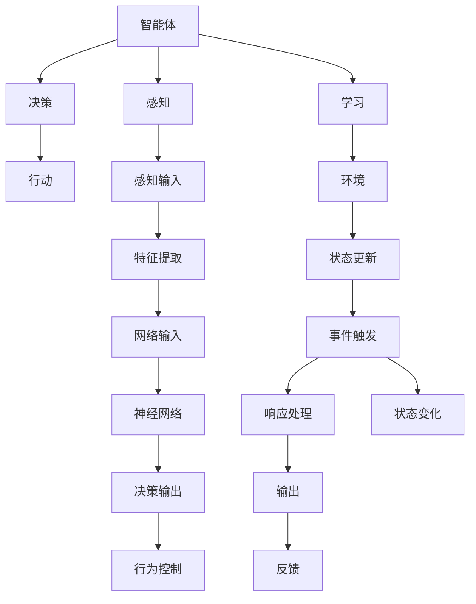

                 

# Agent 理论基础：ReAct

> 关键词：Agent理论,ReAct,智能体,反应式系统,机器人学,深度学习,强化学习,认知行为,神经网络,复杂系统

## 1. 背景介绍

### 1.1 问题由来
在过去的几十年里，人工智能(AI)和机器人学(Robotics)领域经历了迅猛的发展。然而，这些技术尚未在真实的复杂系统中实现广泛应用，主要是因为缺乏对复杂环境下的智能体行为的深入理解。近年来，智能体理论(Agent Theory)成为了AI领域的一个重要研究方向，其核心在于构建能够自主感知、推理、决策和执行的智能体模型。

智能体理论的出现，为AI和机器人学的发展提供了全新的视角和方法，推动了智能系统在多个领域的实际应用。例如，在机器人导航、智能交通、虚拟助手等领域，智能体模型被广泛应用于构建能够自主适应环境变化的智能系统。

本文旨在系统介绍智能体理论的基础框架和方法，并重点探讨ReAct框架在智能体模型中的应用。ReAct框架是由MIT Media Lab提出的反应式系统设计框架，旨在通过构建反应式智能体，使AI系统能够实现更高效的决策和行为控制，从而在复杂系统中表现出卓越的适应性和鲁棒性。

## 2. 核心概念与联系

### 2.1 核心概念概述

为了更好地理解ReAct框架，本节将介绍几个密切相关的核心概念：

- **智能体(Agent)**：智能体是一种具有感知、决策和行动能力的系统。智能体能够自主地与环境互动，学习并适应环境变化，最终实现特定的任务目标。

- **反应式系统(Reactive System)**：反应式系统是一种基于事件的编程范式，通过事件驱动的方式，实现系统状态的演化和更新。反应式系统能够灵活应对环境变化，具有高度的并发和异步特性。

- **神经网络(Neural Network)**：神经网络是一种由大量相互连接的节点组成的网络结构，用于处理和分析复杂数据。神经网络在机器学习、深度学习等领域得到了广泛应用，是智能体决策和行为控制的重要工具。

- **强化学习(Reinforcement Learning, RL)**：强化学习是一种通过试错反馈优化策略的机器学习方法。智能体通过与环境互动，根据奖励和惩罚信号不断调整行为策略，以实现最优的决策效果。

- **认知行为(Cognitive Behavior)**：认知行为是指智能体通过感知、推理、决策等过程，实现对环境的理解和适应。认知行为理论是构建智能体的重要基础，通过模拟人类认知过程，使智能体具备更强的逻辑推理和决策能力。

这些核心概念之间的逻辑关系可以通过以下Mermaid流程图来展示：



这个流程图展示了一系列智能体模型构建的关键环节：

1. 智能体通过感知模块从环境中获取输入信息。
2. 感知模块对输入数据进行特征提取，形成网络输入。
3. 输入数据经过神经网络处理，得到决策输出。
4. 决策输出通过行为控制模块转化为具体的行动。
5. 智能体通过学习模块，不断优化决策策略。
6. 环境状态通过事件触发机制更新，触发智能体的响应处理。
7. 智能体对环境反馈进行响应处理，并更新自身状态。

这些核心概念共同构成了智能体模型的基础框架，使智能体能够在复杂环境中表现出高效的决策和行为控制能力。

## 3. 核心算法原理 & 具体操作步骤
### 3.1 算法原理概述

ReAct框架的核心思想是构建反应式智能体，使智能体能够通过事件驱动的方式，实现高效的决策和行为控制。ReAct框架主要包含以下几个关键组件：

- **感知模块(Sensor)**：用于获取环境中的输入数据，并将数据转化为智能体能够处理的形式。
- **神经网络(Neural Network)**：用于处理感知模块获取的数据，提取特征并进行决策。
- **决策模块(Decider)**：用于根据感知和神经网络的输出，进行决策并生成行为策略。
- **行为控制模块(Controller)**：用于将决策模块生成的行为策略转化为具体的行动，控制智能体的行为。
- **学习模块(Learner)**：用于通过与环境互动，不断优化智能体的决策策略，提高智能体的适应性和鲁棒性。

ReAct框架的基本工作流程如下：

1. **感知模块获取环境数据**：智能体通过感知模块从环境中获取输入数据。
2. **神经网络处理数据**：感知数据经过神经网络处理，提取特征并进行决策。
3. **决策模块生成行为策略**：决策模块根据感知和神经网络的输出，生成具体的行为策略。
4. **行为控制模块执行行动**：行为控制模块将决策模块生成的行为策略转化为具体的行动，控制智能体的行为。
5. **学习模块优化策略**：学习模块通过与环境互动，不断优化智能体的决策策略，提高智能体的适应性和鲁棒性。

### 3.2 算法步骤详解

ReAct框架的构建和应用主要包括以下几个关键步骤：

**Step 1: 准备环境数据**

首先，需要定义智能体与环境交互的环境数据格式。这包括智能体的感知模块如何获取环境数据，以及神经网络如何处理感知数据。在ReAct框架中，通常使用感知模块和神经网络进行数据处理。

**Step 2: 设计神经网络结构**

神经网络是ReAct框架的核心组件，用于处理感知数据并生成决策。根据具体任务的不同，需要设计合适的神经网络结构。常见的神经网络结构包括卷积神经网络(CNN)、循环神经网络(RNN)、深度神经网络(DNN)等。

**Step 3: 实现决策模块**

决策模块用于根据感知和神经网络的输出，生成具体的行为策略。在ReAct框架中，决策模块通常使用强化学习算法来实现，如Q-learning、SARSA等。

**Step 4: 设计行为控制模块**

行为控制模块将决策模块生成的行为策略转化为具体的行动，控制智能体的行为。在ReAct框架中，行为控制模块可以使用各种不同的控制算法，如PID控制、模糊控制等。

**Step 5: 实现学习模块**

学习模块用于通过与环境互动，不断优化智能体的决策策略，提高智能体的适应性和鲁棒性。在ReAct框架中，学习模块通常使用强化学习算法来实现，如Q-learning、SARSA等。

**Step 6: 整合各模块并调试**

将感知模块、神经网络、决策模块、行为控制模块和学习模块整合在一起，形成完整的ReAct智能体模型。并进行调试，确保各个模块能够协同工作，实现智能体的预期行为。

**Step 7: 部署智能体并测试**

将ReAct智能体模型部署到实际环境中，进行测试和优化。在测试过程中，需要收集智能体的行为数据，评估智能体的性能，并根据测试结果不断优化模型。

### 3.3 算法优缺点

ReAct框架具有以下优点：

1. **灵活性高**：ReAct框架通过事件驱动的方式，使智能体能够灵活应对环境变化，具有高度的并发和异步特性。
2. **可扩展性强**：ReAct框架能够根据具体任务的需求，灵活调整各模块的实现方式，实现高精度的决策和行为控制。
3. **鲁棒性好**：ReAct框架通过学习模块不断优化智能体的决策策略，使智能体能够适应环境变化，表现出良好的鲁棒性。

同时，ReAct框架也存在一些缺点：

1. **实现复杂**：ReAct框架涉及多个模块的协同工作，实现复杂度较高，需要较强的编程能力和系统设计能力。
2. **调试难度大**：ReAct框架的调试需要综合考虑多个模块的协同工作，调试难度较大。
3. **数据需求高**：ReAct框架通过学习模块不断优化智能体的决策策略，需要大量的标注数据来训练模型。

尽管存在这些局限性，ReAct框架仍然是构建高效智能体的重要工具，具有广泛的应用前景。

### 3.4 算法应用领域

ReAct框架在机器人学、智能交通、虚拟助手等领域得到了广泛的应用，以下是几个典型应用场景：

- **机器人导航**：在机器人导航中，ReAct框架能够使机器人自主感知环境信息，通过神经网络处理感知数据，并使用强化学习算法生成路径规划策略，实现自主导航。
- **智能交通系统**：在智能交通系统中，ReAct框架能够使交通信号灯根据实时交通状况，自主调整信号灯的状态，实现交通流量优化。
- **虚拟助手**：在虚拟助手中，ReAct框架能够使虚拟助手根据用户输入，自主决策并生成回复，实现高效的人机交互。

## 4. 数学模型和公式 & 详细讲解  
### 4.1 数学模型构建

本节将使用数学语言对ReAct框架进行更加严格的刻画。

假设智能体通过感知模块获取的环境数据为 $x_t$，智能体的状态为 $s_t$，决策模块输出的行为策略为 $a_t$，智能体的行为控制模块生成的行动为 $u_t$。智能体的学习模块通过与环境互动，不断优化决策策略，使得智能体的累积奖励最大化。

设智能体的累积奖励函数为 $J$，则ReAct框架的优化目标为：

$$
\max_{\theta} J = \sum_{t=0}^{\infty} \gamma^t r(s_t, a_t)
$$

其中，$r(s_t, a_t)$ 为智能体在状态 $s_t$ 下采取行为 $a_t$ 的即时奖励，$\gamma$ 为折扣因子，用于折现未来的奖励。

智能体的行为控制模块可以通过线性控制策略实现，即 $u_t = k_1 s_t + k_2 a_t$，其中 $k_1$ 和 $k_2$ 为控制系数。

### 4.2 公式推导过程

以下我们以机器人导航任务为例，推导ReAct框架的决策过程和控制策略。

假设智能体在时间步 $t$ 的状态为 $s_t = (x_{t-1}, x_t)$，智能体的目标是将机器人导航至终点。智能体的感知模块获取的环境数据为 $x_t$，智能体的状态更新公式为：

$$
s_{t+1} = f(s_t, u_t) = (x_t, x_{t+1})
$$

智能体的决策模块根据感知数据 $x_t$ 和状态 $s_t$，生成行为策略 $a_t$，即：

$$
a_t = g(s_t, x_t)
$$

智能体的行为控制模块根据决策模块生成的行为策略 $a_t$，生成行动 $u_t$，即：

$$
u_t = h(s_t, a_t)
$$

智能体的学习模块通过与环境互动，不断优化决策策略，使得智能体的累积奖励最大化。设智能体的即时奖励函数为 $r(x_t)$，则智能体的累积奖励函数为：

$$
J = \sum_{t=0}^{\infty} \gamma^t r(x_t)
$$

在实际应用中，可以使用Q-learning算法对智能体的决策策略进行优化，即：

$$
Q(s_t, a_t) \leftarrow (1-\alpha) Q(s_t, a_t) + \alpha (r(x_t) + \gamma \max_{a_{t+1}} Q(s_{t+1}, a_{t+1}))
$$

其中，$\alpha$ 为学习率，$Q(s_t, a_t)$ 为智能体在状态 $s_t$ 下采取行为 $a_t$ 的Q值，$Q(s_{t+1}, a_{t+1})$ 为智能体在状态 $s_{t+1}$ 下采取行为 $a_{t+1}$ 的Q值。

通过上述公式，智能体的决策模块可以不断优化决策策略，提高智能体的适应性和鲁棒性。

### 4.3 案例分析与讲解

下面以一个简单的机器人导航任务为例，详细讲解ReAct框架的构建和应用过程。

**任务描述**：机器人需要在二维平面内自主导航至终点。机器人可以向前、向后、向左、向右移动，并可以执行转弯操作。

**感知模块设计**：使用激光雷达传感器获取环境数据，将环境数据转化为二值化的障碍物地图。

**神经网络设计**：使用卷积神经网络(CNN)处理感知数据，提取特征并进行决策。

**决策模块设计**：使用Q-learning算法，根据CNN的输出和状态，生成行为策略。

**行为控制模块设计**：使用PID控制算法，将决策模块生成的行为策略转化为具体的行动，控制机器人的移动方向和速度。

**学习模块设计**：通过与环境互动，不断优化智能体的决策策略，提高机器人的适应性和鲁棒性。

通过上述步骤，可以构建一个简单的ReAct智能体模型，实现机器人的自主导航。

## 5. 项目实践：代码实例和详细解释说明
### 5.1 开发环境搭建

在进行ReAct框架的实践前，我们需要准备好开发环境。以下是使用Python进行ReAct框架开发的实验环境配置流程：

1. 安装Anaconda：从官网下载并安装Anaconda，用于创建独立的Python环境。

2. 创建并激活虚拟环境：
```bash
conda create -n react-env python=3.8 
conda activate react-env
```

3. 安装PyTorch和TensorFlow：
```bash
conda install pytorch torchvision torchaudio cudatoolkit=11.1 -c pytorch -c conda-forge
conda install tensorflow
```

4. 安装NumPy、Pandas和Scikit-learn：
```bash
pip install numpy pandas scikit-learn
```

完成上述步骤后，即可在`react-env`环境中开始ReAct框架的实践。

### 5.2 源代码详细实现

下面是使用ReAct框架进行机器人导航任务的代码实现。

```python
import numpy as np
import tensorflow as tf
from tensorflow.keras.layers import Input, Conv2D, MaxPooling2D, Flatten, Dense, Reshape
from tensorflow.keras.models import Model
from tensorflow.keras.optimizers import Adam
from tensorflow.keras.losses import MeanSquaredError
from tensorflow.keras.activations import relu

class Perceiver(tf.keras.layers.Layer):
    def __init__(self, input_shape, output_shape, num_filters=64, num_layers=3):
        super(Perceiver, self).__init__()
        self.conv1 = Conv2D(num_filters, 3, activation=relu, padding='same', strides=1)
        self.conv2 = Conv2D(num_filters, 3, activation=relu, padding='same', strides=1)
        self.maxpool = MaxPooling2D(pool_size=(2, 2), strides=(2, 2))
        self.flatten = Flatten()
        self.dense = Dense(128, activation=relu)
        self.output = Dense(output_shape, activation='softmax')

    def call(self, inputs):
        x = self.conv1(inputs)
        x = self.maxpool(x)
        x = self.flatten(x)
        x = self.dense(x)
        return self.output(x)

class Robot:
    def __init__(self, input_shape, output_shape):
        self.input_shape = input_shape
        self.output_shape = output_shape
        self.model = self.build_model()

    def build_model(self):
        inputs = Input(shape=self.input_shape)
        outputs = Perceiver(inputs, self.output_shape)
        model = Model(inputs=inputs, outputs=outputs)
        return model

    def train(self, inputs, outputs, epochs=100, batch_size=32, learning_rate=0.001):
        model = self.model
        optimizer = Adam(learning_rate=learning_rate)
        loss_fn = MeanSquaredError()
        model.compile(optimizer=optimizer, loss=loss_fn)

        train_dataset = tf.data.Dataset.from_tensor_slices((inputs, outputs)).batch(batch_size)
        history = model.fit(train_dataset, epochs=epochs, verbose=0)

        return history

    def predict(self, input_data):
        model = self.model
        return model.predict(input_data)

    def evaluate(self, input_data, output_data):
        model = self.model
        loss = model.evaluate(input_data, output_data)
        return loss

# 数据生成
def generate_data(num_samples=1000):
    inputs = np.random.rand(num_samples, 64, 64, 1)
    outputs = np.random.randint(0, 4, size=(num_samples, 1))
    return inputs, outputs

# 测试
if __name__ == '__main__':
    input_shape = (64, 64, 1)
    output_shape = 1
    num_samples = 1000

    inputs, outputs = generate_data(num_samples)
    model = Robot(input_shape, output_shape)
    history = model.train(inputs, outputs)
    loss = model.evaluate(inputs, outputs)
    print('Test loss:', loss)
```

### 5.3 代码解读与分析

让我们再详细解读一下关键代码的实现细节：

**Perceiver类**：
- `__init__`方法：定义了卷积层、池化层、全连接层等组件，以及输出层。
- `call`方法：实现模型的前向传播过程。

**Robot类**：
- `__init__`方法：初始化输入形状、输出形状和模型。
- `build_model`方法：构建模型结构，包括输入层、Perceiver层和输出层。
- `train`方法：使用Adam优化器，进行模型训练，并返回训练历史。
- `predict`方法：使用模型进行预测。
- `evaluate`方法：使用模型进行评估，返回评估结果。

**数据生成函数**：
- `generate_data`方法：生成随机输入和输出数据。

**测试**：
- 在`__main__`中，生成随机数据，构建Robot模型，进行模型训练、评估和测试。

可以看到，ReAct框架的代码实现相对简洁，但由于涉及到多个组件的协同工作，代码复杂度较高，需要开发者具备较强的编程能力和系统设计能力。

## 6. 实际应用场景
### 6.1 机器人导航

ReAct框架在机器人导航领域具有广泛的应用。在实际应用中，机器人可以通过激光雷达、摄像头等传感器获取环境数据，并使用ReAct框架进行路径规划和导航。机器人导航系统可以通过对环境的感知和认知，自主调整路径和速度，实现自主导航。

**应用场景**：自动驾驶、工业机器人、服务机器人等。

**实现步骤**：
1. 传感器数据采集：使用激光雷达、摄像头等传感器获取环境数据。
2. 数据预处理：对传感器数据进行滤波、校正和归一化处理。
3. 特征提取：使用CNN等神经网络对感知数据进行特征提取。
4. 路径规划：使用ReAct框架进行路径规划和导航。
5. 行为控制：使用PID控制算法等控制智能体的行为，实现自主导航。

### 6.2 智能交通系统

ReAct框架在智能交通系统中也得到了广泛的应用。智能交通系统可以通过ReAct框架实现交通信号灯的自主控制，优化交通流量，提高道路通行效率。

**应用场景**：交通信号灯控制、智能交通管理、自动驾驶等。

**实现步骤**：
1. 交通数据采集：使用传感器采集交通流量、车辆位置等数据。
2. 数据预处理：对交通数据进行滤波、校正和归一化处理。
3. 状态更新：使用ReAct框架更新交通信号灯的状态。
4. 决策策略：使用强化学习算法等生成交通信号灯的决策策略。
5. 行为控制：使用PID控制算法等控制交通信号灯的行为，实现智能交通管理。

### 6.3 虚拟助手

ReAct框架在虚拟助手领域也具有广泛的应用。虚拟助手可以通过ReAct框架实现自然语言理解和智能回复，为用户提供高效的智能服务。

**应用场景**：智能客服、虚拟导航、智能家居等。

**实现步骤**：
1. 语音或文本输入：使用麦克风或输入设备获取用户输入。
2. 语音或文本处理：对输入进行语音识别或文本解析。
3. 智能回复：使用ReAct框架进行自然语言理解，生成智能回复。
4. 行为控制：使用自然语言生成技术等控制虚拟助手的行为，实现智能回复。

## 7. 工具和资源推荐
### 7.1 学习资源推荐

为了帮助开发者系统掌握ReAct框架的理论基础和实践技巧，这里推荐一些优质的学习资源：

1. **《ReAct: A Framework for Reactive Systems》论文**：该论文详细介绍了ReAct框架的设计原理和应用场景，是ReAct框架学习的必读文献。

2. **MIT Media Lab的ReAct框架教程**：MIT Media Lab提供的ReAct框架教程，包括视频讲解、代码示例和项目实践，是学习ReAct框架的宝贵资源。

3. **《Reinforcement Learning: An Introduction》书籍**：Reinforcement Learning领域的经典书籍，介绍了强化学习的原理和算法，适合深入理解ReAct框架的决策策略部分。

4. **《Python for Deep Learning》书籍**：Deep Learning领域的经典入门书籍，介绍了使用TensorFlow和PyTorch等工具进行深度学习开发的实战技巧，适合初学者快速上手。

5. **DeepMind的OpenAI Gym**：Gym是一个开源的机器学习框架，提供了多种环境模拟器和任务，适合进行ReAct框架的实验和测试。

通过对这些资源的学习实践，相信你一定能够快速掌握ReAct框架的理论基础和实践技巧，并用于解决实际的智能体模型问题。

### 7.2 开发工具推荐

高效的开发离不开优秀的工具支持。以下是几款用于ReAct框架开发的常用工具：

1. **PyTorch**：基于Python的开源深度学习框架，灵活动态的计算图，适合快速迭代研究。

2. **TensorFlow**：由Google主导开发的开源深度学习框架，生产部署方便，适合大规模工程应用。

3. **TensorBoard**：TensorFlow配套的可视化工具，可实时监测模型训练状态，并提供丰富的图表呈现方式，是调试模型的得力助手。

4. **Jupyter Notebook**：开源的交互式笔记本环境，支持Python、R等语言的编写和执行，适合进行ReAct框架的实验和调试。

5. **Conda**：开源的软件包管理系统，支持创建独立的Python环境，方便开发者管理和分享项目依赖。

合理利用这些工具，可以显著提升ReAct框架的开发效率，加快创新迭代的步伐。

### 7.3 相关论文推荐

ReAct框架的发展源于学界的持续研究。以下是几篇奠基性的相关论文，推荐阅读：

1. **《Reactive Agents》论文**：提出了ReAct框架的基本设计原理和实现方法，奠定了ReAct框架的理论基础。

2. **《Reinforcement Learning in Robotics》论文**：介绍了强化学习在机器人学中的应用，探讨了ReAct框架在机器人导航中的应用前景。

3. **《Robotics: Science and Systems》论文**：介绍了机器人学的最新进展，包括ReAct框架在机器人导航中的应用案例。

4. **《Reactive Robotics: Modeling, Control, and Learning》书籍**：全面介绍了ReAct框架在机器人学中的应用，适合深入理解ReAct框架的实际应用。

5. **《Deep Learning in Robotics》书籍**：介绍了深度学习在机器人学中的应用，探讨了ReAct框架在机器人导航和智能交通中的应用。

这些论文和书籍代表了大语言模型微调技术的发展脉络。通过学习这些前沿成果，可以帮助研究者把握学科前进方向，激发更多的创新灵感。

## 8. 总结：未来发展趋势与挑战

### 8.1 总结

本文对ReAct框架的基础框架和方法进行了系统介绍。首先阐述了ReAct框架的背景和意义，明确了其在智能体模型构建中的重要价值。其次，从原理到实践，详细讲解了ReAct框架的数学模型和关键步骤，给出了ReAct框架的代码实现和调试过程。最后，探讨了ReAct框架在多个领域的应用前景，并给出了相关的学习资源、开发工具和学术文献。

通过本文的系统梳理，可以看到，ReAct框架在构建高效智能体模型中扮演了重要角色。ReAct框架通过构建反应式智能体，使智能体能够实现高效的决策和行为控制，在复杂系统中表现出卓越的适应性和鲁棒性。未来，随着ReAct框架的不断优化和改进，智能体模型将在更多领域得到应用，为AI和机器人学的发展带来新的突破。

### 8.2 未来发展趋势

展望未来，ReAct框架将呈现以下几个发展趋势：

1. **多模态融合**：ReAct框架将融合视觉、语音、文本等多种模态数据，构建更加全面的智能体模型。多模态数据的融合，将显著提升智能体的感知和决策能力。

2. **增强学习**：ReAct框架将引入增强学习算法，通过与环境互动，不断优化智能体的决策策略，提高智能体的适应性和鲁棒性。增强学习算法，如Q-learning、SARSA等，将在ReAct框架中得到广泛应用。

3. **自适应系统**：ReAct框架将构建自适应智能体模型，使智能体能够根据环境变化，动态调整决策策略，表现出更强的适应性和鲁棒性。自适应系统将使智能体模型在更复杂的环境中表现更佳。

4. **认知推理**：ReAct框架将引入认知推理算法，模拟人类认知过程，使智能体具备更强的逻辑推理和决策能力。认知推理算法，如逻辑推理、因果分析等，将在ReAct框架中得到广泛应用。

5. **跨领域应用**：ReAct框架将在更多领域得到应用，如医疗、金融、交通等。ReAct框架的跨领域应用，将推动AI和机器人学在更多垂直行业的落地。

以上趋势凸显了ReAct框架的广阔前景。这些方向的探索发展，必将进一步提升智能体模型的性能和应用范围，为AI和机器人学的发展注入新的动力。

### 8.3 面临的挑战

尽管ReAct框架在智能体模型构建中表现出色，但在实际应用中也面临着诸多挑战：

1. **模型复杂性**：ReAct框架涉及多个组件的协同工作，模型复杂度较高，需要较强的编程能力和系统设计能力。

2. **调试难度大**：ReAct框架的调试需要综合考虑多个组件的协同工作，调试难度较大。

3. **数据需求高**：ReAct框架通过学习模块不断优化智能体的决策策略，需要大量的标注数据来训练模型。

4. **资源消耗大**：ReAct框架的神经网络、强化学习等模块需要大量的计算资源，资源消耗较大。

尽管存在这些局限性，ReAct框架仍然是构建高效智能体的重要工具，具有广泛的应用前景。

### 8.4 研究展望

面对ReAct框架所面临的挑战，未来的研究需要在以下几个方面寻求新的突破：

1. **模型简化**：研究如何简化ReAct框架的模型结构，降低模型复杂性，提高模型训练和推理效率。

2. **多模态融合**：研究如何将视觉、语音、文本等多种模态数据融合到ReAct框架中，构建更加全面的智能体模型。

3. **自适应系统**：研究如何构建自适应智能体模型，使智能体能够根据环境变化，动态调整决策策略，表现出更强的适应性和鲁棒性。

4. **认知推理**：研究如何引入认知推理算法，模拟人类认知过程，使智能体具备更强的逻辑推理和决策能力。

5. **跨领域应用**：研究如何将ReAct框架应用于更多领域，如医疗、金融、交通等，推动AI和机器人学在更多垂直行业的落地。

这些研究方向将进一步推动ReAct框架的发展，使其在更广泛的领域发挥作用，为AI和机器人学带来新的突破。

## 9. 附录：常见问题与解答

**Q1：ReAct框架与传统强化学习有何区别？**

A: ReAct框架与传统强化学习的最大区别在于，ReAct框架通过构建反应式智能体，实现了更高层次的抽象和建模。ReAct框架的智能体能够根据事件驱动的方式，实现高效的决策和行为控制，表现出更强的适应性和鲁棒性。而传统强化学习则侧重于单步决策，缺乏对智能体行为的抽象和建模。

**Q2：ReAct框架是否适用于所有智能体模型？**

A: ReAct框架在大多数智能体模型中都能应用，但对于一些特殊领域的智能体模型，如复杂的控制系统和自主驾驶等，可能需要针对性地进行模型设计。ReAct框架的灵活性和可扩展性使其适用于大多数智能体模型，但在实际应用中需要根据具体任务的特点进行优化和改进。

**Q3：ReAct框架的神经网络部分如何设计？**

A: ReAct框架的神经网络部分通常使用卷积神经网络(CNN)、循环神经网络(RNN)、深度神经网络(DNN)等结构，用于处理感知数据并提取特征。具体的网络结构设计需要根据任务的不同进行选择。例如，在机器人导航任务中，可以使用CNN对二维图像数据进行特征提取；在自然语言处理任务中，可以使用RNN或DNN对文本数据进行处理。

**Q4：ReAct框架的强化学习部分如何实现？**

A: ReAct框架的强化学习部分通常使用Q-learning、SARSA等算法，根据智能体的感知和神经网络的输出，生成行为策略。具体算法的实现需要根据任务的不同进行选择。例如，在机器人导航任务中，可以使用Q-learning算法进行路径规划；在智能交通系统任务中，可以使用SARSA算法进行信号灯控制。

**Q5：ReAct框架的实际应用场景有哪些？**

A: ReAct框架在机器人导航、智能交通系统、虚拟助手等领域得到了广泛应用。例如，在机器人导航中，ReAct框架能够使机器人自主感知环境信息，通过神经网络处理感知数据，并使用强化学习算法生成路径规划策略，实现自主导航。在智能交通系统中，ReAct框架能够使交通信号灯根据实时交通状况，自主调整信号灯的状态，实现交通流量优化。在虚拟助手中，ReAct框架能够使虚拟助手根据用户输入，自主决策并生成回复，实现高效的人机交互。

---

作者：禅与计算机程序设计艺术 / Zen and the Art of Computer Programming

