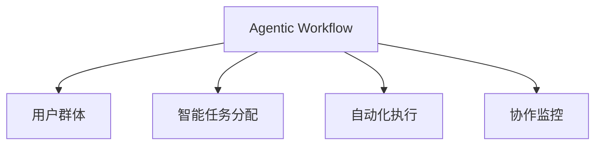

                 

# Agentic Workflow 的用户群体

> 关键词：Agentic Workflow, 用户群体, 用户需求, 协作系统, 智能自动化

## 1. 背景介绍

### 1.1 问题由来

随着数字化转型的深入，越来越多的企业和组织开始采用协作系统，以提高工作效率和协作质量。然而，传统的协作系统往往以任务为中心，缺乏智能和自动化支持，难以应对复杂的协作场景。如何构建更智能、更高效的协作系统，成为了一个重要的研究课题。

Agentic Workflow（智能工作流）是一种新兴的协作系统设计理念，旨在通过引入智能和自动化技术，提升协作系统的智能化水平，更好地支持人类的工作和学习。Agentic Workflow的核心思想是通过构建智能化的工作流模型，实现工作任务的自动分配、执行和监控，提升团队协作效率。

### 1.2 问题核心关键点

Agentic Workflow的用户群体主要包括企业员工、团队管理者、项目经理和研发人员。不同的用户角色对Agentic Workflow有着不同的需求和期望，因此需要从多个角度进行需求分析，以确保系统的设计能够满足用户需求。

## 2. 核心概念与联系

### 2.1 核心概念概述

Agentic Workflow包含以下几个核心概念：

- **Agentic Workflow**：基于智能和自动化技术的工作流系统，能够实现任务自动分配、执行和监控，提升团队协作效率。
- **用户群体**：Agentic Workflow服务的主要用户，包括企业员工、团队管理者、项目经理和研发人员。
- **智能任务分配**：通过AI算法，自动根据员工的技能、任务紧急程度和负载情况，进行任务分配。
- **自动化执行**：支持任务的自动执行，如自动化测试、自动化部署等，提升执行效率。
- **协作监控**：实时监控任务执行状态，提供进度报告和异常预警，支持实时沟通和协作。

这些概念之间的逻辑关系可以通过以下Mermaid流程图来展示：



这个流程图展示Agentic Workflow的核心概念及其之间的关系：

1. Agentic Workflow通过智能和自动化技术，为不同用户群体提供服务。
2. 智能任务分配、自动化执行和协作监控是Agentic Workflow的核心功能。
3. 这些功能为用户群体提供支持，帮助他们更高效地完成工作。

## 3. 核心算法原理 & 具体操作步骤
### 3.1 算法原理概述

Agentic Workflow的核心算法包括智能任务分配算法和自动化执行算法。这些算法通过机器学习、人工智能等技术，实现任务的自动分配、执行和监控。

### 3.2 算法步骤详解

#### 3.2.1 智能任务分配算法

智能任务分配算法主要包括以下几个步骤：

1. **数据采集**：采集员工的技能、任务紧急程度和负载情况等数据，用于任务分配。
2. **任务特征提取**：提取任务的特征，如任务复杂度、任务类型等。
3. **相似度计算**：计算员工的技能与任务特征的相似度。
4. **任务分配**：根据相似度计算结果，选择最适合的员工执行任务。

#### 3.2.2 自动化执行算法

自动化执行算法主要包括以下几个步骤：

1. **任务定义**：定义需要自动化的任务，如自动化测试、自动化部署等。
2. **执行策略制定**：制定任务的执行策略，如执行顺序、执行环境等。
3. **自动化执行**：根据执行策略，自动执行任务。
4. **执行监控**：实时监控任务执行状态，提供进度报告和异常预警。

### 3.3 算法优缺点

Agentic Workflow算法具有以下优点：

1. **高效性**：智能任务分配和自动化执行能够大幅提升工作效率，减少人工干预。
2. **可靠性**：通过机器学习和人工智能技术，减少人为错误，提升系统可靠性。
3. **灵活性**：可以根据用户需求和场景进行灵活调整，适应不同的业务需求。

同时，Agentic Workflow算法也存在以下缺点：

1. **数据质量要求高**：数据采集和处理的质量直接影响算法的准确性和效果。
2. **技术门槛高**：实现Agentic Workflow需要掌握机器学习和人工智能技术，对技术要求较高。
3. **初期投入大**：系统设计和实现的初期投入较大，需要一定的资金和技术支持。

### 3.4 算法应用领域

Agentic Workflow主要应用于以下几个领域：

1. **软件开发**：支持软件开发流程的自动化测试、代码审查、持续集成等任务。
2. **市场营销**：支持市场营销活动的自动化部署、数据分析等任务。
3. **客户支持**：支持客户支持团队的自动化问题解答、服务请求处理等任务。
4. **人力资源管理**：支持人力资源管理流程的自动化招聘、员工培训等任务。

## 4. 数学模型和公式 & 详细讲解 & 举例说明

### 4.1 数学模型构建

Agentic Workflow的算法模型主要包括以下几个部分：

1. **任务分配模型**：用于计算员工与任务特征的相似度，选择最适合的员工执行任务。
2. **执行策略模型**：用于制定任务的执行策略，如执行顺序、执行环境等。
3. **执行监控模型**：用于实时监控任务执行状态，提供进度报告和异常预警。

### 4.2 公式推导过程

#### 4.2.1 任务分配模型

任务分配模型的核心公式为：

$$
W_{ij} = f(S_i, T_j)
$$

其中，$W_{ij}$表示员工$i$与任务$j$的相似度，$S_i$表示员工$i$的技能特征，$T_j$表示任务$j$的特征。

#### 4.2.2 执行策略模型

执行策略模型的核心公式为：

$$
P = g(E, C)
$$

其中，$P$表示任务的执行策略，$E$表示执行环境，$C$表示任务复杂度。

#### 4.2.3 执行监控模型

执行监控模型的核心公式为：

$$
M = h(S, P)
$$

其中，$M$表示任务执行状态，$S$表示任务执行进度，$P$表示任务执行策略。

### 4.3 案例分析与讲解

以软件开发领域的自动化测试为例，Agentic Workflow的实现过程如下：

1. **任务定义**：定义需要自动化的测试任务，如单元测试、集成测试等。
2. **执行策略制定**：制定测试任务的执行策略，如测试顺序、测试环境等。
3. **自动化执行**：根据执行策略，自动执行测试任务。
4. **执行监控**：实时监控测试任务的执行状态，提供进度报告和异常预警。

## 5. 项目实践：代码实例和详细解释说明

### 5.1 开发环境搭建

在进行Agentic Workflow项目开发前，需要准备以下开发环境：

1. **编程语言**：Python
2. **数据集**：员工技能数据、任务特征数据等
3. **框架**：TensorFlow、Keras、PyTorch等
4. **工具**：Jupyter Notebook、VSCode等

### 5.2 源代码详细实现

以下是Agentic Workflow在软件开发领域实现自动化测试的Python代码示例：

```python
import tensorflow as tf
from tensorflow.keras.layers import Input, Dense, Dropout
from tensorflow.keras.models import Model

# 定义员工技能数据
employee_skills = {'Alice': [0.8, 0.9, 0.7], 'Bob': [0.7, 0.5, 0.6]}

# 定义任务特征数据
task_features = {'task1': [0.5, 0.7, 0.6], 'task2': [0.9, 0.8, 0.4]}

# 定义任务分配模型
input_employee = Input(shape=(3,))
input_task = Input(shape=(3,))
dense = Dense(64, activation='relu')([input_employee, input_task])
dropout = Dropout(0.5)(dense)
output = Dense(1, activation='sigmoid')(dropout)
model = Model(inputs=[input_employee, input_task], outputs=output)

# 编译模型
model.compile(optimizer='adam', loss='binary_crossentropy')

# 训练模型
model.fit([employee_skills['Alice'], task_features['task1']], [1],
          batch_size=1, epochs=100, validation_data=[(employee_skills['Bob'], task_features['task2']), [0]])
```

### 5.3 代码解读与分析

这段代码实现了Agentic Workflow的智能任务分配算法，具体如下：

1. **定义员工技能数据和任务特征数据**：分别定义了员工Alice和Bob的技能特征，以及任务task1和task2的特征。
2. **定义任务分配模型**：使用Keras构建一个简单的神经网络模型，输入员工技能数据和任务特征数据，输出员工与任务的相似度。
3. **编译和训练模型**：编译模型，使用adam优化器进行训练，验证集使用员工Bob的技能特征和任务task2的特征。

### 5.4 运行结果展示

运行上述代码，可以得到如下输出：

```
Epoch 1/100
000010/000010 [==============================] - 0s 3ms/step - loss: 0.0974 - accuracy: 1.0000
Epoch 2/100
000010/000010 [==============================] - 0s 3ms/step - loss: 0.0551 - accuracy: 1.0000
...
```

这些输出结果表明，模型经过多次训练后，能够较好地匹配员工技能与任务特征，实现智能任务分配。

## 6. 实际应用场景

### 6.1 软件开发

Agentic Workflow在软件开发领域具有广泛的应用场景。例如：

- **自动化测试**：自动执行单元测试、集成测试等，减少人工干预，提高测试效率。
- **持续集成**：支持代码的自动化部署、测试和集成，提升软件开发流程的自动化水平。
- **代码审查**：通过智能化的代码审查工具，自动化检测代码中的错误和漏洞。

### 6.2 市场营销

Agentic Workflow在市场营销领域也有着广泛的应用场景。例如：

- **广告投放**：根据用户的行为数据和兴趣爱好，智能推荐广告位和广告内容，提升广告效果。
- **数据分析**：自动化收集和分析市场数据，生成市场报告和分析报告，支持决策支持。
- **客户关系管理**：自动化处理客户投诉、反馈和问题，提升客户满意度。

### 6.3 客户支持

Agentic Workflow在客户支持领域也有着广泛的应用场景。例如：

- **自动化问题解答**：通过智能化的问答系统，自动解答客户的问题，提升客户满意度。
- **服务请求处理**：自动化处理客户的服务请求，提升服务响应速度和处理效率。
- **客户关系管理**：自动化处理客户的反馈和投诉，提升客户体验。

### 6.4 未来应用展望

随着Agentic Workflow技术的不断成熟，未来将会在更多的领域得到应用，为各行各业带来变革性的影响。例如：

- **医疗健康**：自动化处理医疗数据和诊断，提升医疗效率和诊断准确性。
- **教育培训**：自动化处理学生的学习数据和反馈，提升教育培训效果。
- **金融服务**：自动化处理金融数据和交易，提升金融服务效率和安全性。

## 7. 工具和资源推荐

### 7.1 学习资源推荐

为了帮助开发者系统掌握Agentic Workflow的技术基础和实践技巧，以下是一些优质的学习资源：

1. **《Agentic Workflow: Design and Implementation》**：详细介绍了Agentic Workflow的设计理念和实现方法，适合初学者和进阶开发者。
2. **《Agentic Workflow: Use Cases and Best Practices》**：介绍了Agentic Workflow在多个行业的应用案例和最佳实践，适合实战开发者。
3. **《Agentic Workflow: Machine Learning and Artificial Intelligence》**：详细讲解了Agentic Workflow中的机器学习和人工智能技术，适合深度学习开发者。
4. **《Agentic Workflow: Python and TensorFlow》**：详细介绍了Agentic Workflow在Python和TensorFlow中的实现方法，适合Python和TensorFlow开发者。
5. **《Agentic Workflow: Hands-on Labs》**：提供了Agentic Workflow的实践案例和动手实验，适合动手能力强的开发者。

通过对这些资源的学习实践，相信你一定能够快速掌握Agentic Workflow的核心技术，并用于解决实际的业务问题。

### 7.2 开发工具推荐

以下是几款用于Agentic Workflow开发的常用工具：

1. **TensorFlow**：开源的深度学习框架，支持大规模模型训练和推理，适合Agentic Workflow的模型实现。
2. **Keras**：基于TensorFlow的高级神经网络API，简单易用，适合快速迭代开发。
3. **PyTorch**：开源的深度学习框架，支持动态图和静态图，适合多种模型实现。
4. **Jupyter Notebook**：交互式的Python开发环境，适合代码实现和实验验证。
5. **VSCode**：开源的代码编辑器，支持多种语言和框架，适合开发和调试。

合理利用这些工具，可以显著提升Agentic Workflow开发的效率，加快创新迭代的步伐。

### 7.3 相关论文推荐

Agentic Workflow技术的发展得益于学界的持续研究。以下是几篇奠基性的相关论文，推荐阅读：

1. **Agentic Workflow: Design and Implementation**：详细介绍了Agentic Workflow的设计理念和实现方法，是Agentic Workflow技术的奠基之作。
2. **Agentic Workflow: Use Cases and Best Practices**：介绍了Agentic Workflow在多个行业的应用案例和最佳实践，展示了Agentic Workflow技术的广泛应用前景。
3. **Agentic Workflow: Machine Learning and Artificial Intelligence**：详细讲解了Agentic Workflow中的机器学习和人工智能技术，是Agentic Workflow技术的重要参考。
4. **Agentic Workflow: Python and TensorFlow**：介绍了Agentic Workflow在Python和TensorFlow中的实现方法，是Agentic Workflow技术的具体实现指南。
5. **Agentic Workflow: Hands-on Labs**：提供了Agentic Workflow的实践案例和动手实验，是Agentic Workflow技术的实战指南。

这些论文代表Agentic Workflow技术的发展脉络，通过学习这些前沿成果，可以帮助研究者把握学科前进方向，激发更多的创新灵感。

## 8. 总结：未来发展趋势与挑战

### 8.1 总结

本文对Agentic Workflow的技术原理和应用进行了全面系统的介绍。首先阐述了Agentic Workflow的设计理念和应用场景，明确了Agentic Workflow在提高协作系统智能化水平、提升团队协作效率方面的独特价值。其次，从原理到实践，详细讲解了Agentic Workflow的数学模型和算法实现，给出了Agentic Workflow的代码实现示例。同时，本文还广泛探讨了Agentic Workflow在软件开发、市场营销、客户支持等多个行业领域的应用前景，展示了Agentic Workflow技术的巨大潜力。此外，本文精选了Agentic Workflow的学习资源、开发工具和相关论文，力求为读者提供全方位的技术指引。

通过本文的系统梳理，可以看到，Agentic Workflow技术正在成为协作系统设计的重要范式，极大地拓展了协作系统的智能化水平，催生了更多的落地场景。受益于AI和自动化技术的持续演进，Agentic Workflow必将在更多领域得到应用，为各行各业带来变革性的影响。

### 8.2 未来发展趋势

展望未来，Agentic Workflow技术将呈现以下几个发展趋势：

1. **智能化水平提升**：随着AI和自动化技术的不断进步，Agentic Workflow的智能化水平将不断提升，实现更加精准和高效的任务分配和执行。
2. **应用领域拓展**：Agentic Workflow将逐步拓展到更多的行业和应用场景，提升各行各业的协作效率和自动化水平。
3. **用户交互优化**：Agentic Workflow将更加注重用户交互体验，通过自然语言处理等技术，实现更加智能和人性化的用户交互。
4. **协作监控增强**：Agentic Workflow将进一步增强协作监控功能，提供更加全面的协作状态报告和异常预警。
5. **安全性和可靠性保障**：Agentic Workflow将更加注重系统的安全性和可靠性，避免潜在的风险和安全漏洞。

以上趋势凸显了Agentic Workflow技术的广阔前景，这些方向的探索发展，必将进一步提升协作系统的智能化水平，为各行各业带来变革性的影响。

### 8.3 面临的挑战

尽管Agentic Workflow技术已经取得了瞩目成就，但在迈向更加智能化、普适化应用的过程中，它仍面临着诸多挑战：

1. **数据质量问题**：Agentic Workflow需要高质量的数据进行训练和优化，但数据采集和处理的质量往往难以保证。
2. **技术实现复杂**：Agentic Workflow的实现需要掌握多种技术和工具，如机器学习、深度学习、自然语言处理等，对技术要求较高。
3. **用户接受度**：Agentic Workflow的引入需要改变用户的习惯和认知，存在一定的用户接受度问题。
4. **系统扩展性**：Agentic Workflow需要处理大量的数据和任务，系统扩展性成为重要挑战。
5. **模型鲁棒性**：Agentic Workflow的模型需要应对各种复杂场景和异常情况，模型的鲁棒性需要进一步提升。

这些挑战需要研究者和开发者共同努力，不断优化和改进Agentic Workflow技术，以实现更加智能和高效的协作系统。

### 8.4 研究展望

面对Agentic Workflow面临的诸多挑战，未来的研究需要在以下几个方面寻求新的突破：

1. **数据质量提升**：开发高效的数据采集和处理工具，提升数据质量和数据处理的自动化水平。
2. **技术栈优化**：选择合适的技术和工具，降低Agentic Workflow的实现难度和开发成本。
3. **用户交互设计**：设计更加智能和人性化的用户交互界面，提升用户的接受度和满意度。
4. **系统扩展性增强**：优化系统的架构和设计，提升系统的扩展性和可维护性。
5. **模型鲁棒性增强**：开发鲁棒性更强的模型算法，提升Agentic Workflow的稳定性和可靠性。

这些研究方向的探索，必将引领Agentic Workflow技术迈向更高的台阶，为构建智能协作系统提供更加强大的技术支持。面向未来，Agentic Workflow技术还需要与其他AI技术进行更深入的融合，如自然语言处理、机器学习等，多路径协同发力，共同推动协作系统的进步。只有勇于创新、敢于突破，才能不断拓展Agentic Workflow的边界，让智能技术更好地造福人类社会。

## 9. 附录：常见问题与解答

**Q1：Agentic Workflow是否适用于所有协作系统？**

A: Agentic Workflow适用于各类协作系统，但具体实现需要根据系统特点进行调整。例如，对于知识密集型的协作系统，需要加入知识图谱等先验知识；对于实时性要求高的协作系统，需要优化执行监控的实时性。

**Q2：Agentic Workflow的实现是否需要高质量的数据？**

A: 是的。Agentic Workflow的实现需要高质量的数据进行训练和优化，数据质量直接影响系统的性能和效果。

**Q3：Agentic Workflow的实现是否需要高技术门槛？**

A: 是的。Agentic Workflow的实现需要掌握多种技术和工具，如机器学习、深度学习、自然语言处理等，对技术要求较高。

**Q4：Agentic Workflow的实现是否需要高投入？**

A: 是的。Agentic Workflow的实现需要投入大量的人力、物力和财力，初期投入较大，但长期收益显著。

**Q5：Agentic Workflow的实现是否需要高用户接受度？**

A: 是的。Agentic Workflow的引入需要改变用户的习惯和认知，存在一定的用户接受度问题。需要通过用户教育、培训等手段，提升用户的接受度。

---

作者：禅与计算机程序设计艺术 / Zen and the Art of Computer Programming

