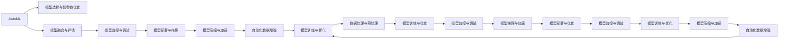

                 

## 1. 背景介绍

Andrej Karpathy，作为全球知名的计算机视觉专家、深度学习领域的研究先锋，同时也是一名深度学习开源工具的创造者，其学术背景和实践经验在业界享有极高的声誉。特别是在自动驾驶、强化学习以及图像识别等领域，Andrej Karpathy通过其创新性的研究和开源项目，推动了AI技术的快速发展。本文将探讨Andrej Karpathy在自动化领域的见解，结合其研究和工程实践，分析自动化技术在现代AI领域的应用前景及未来挑战。

### 1.1 问题由来

在现代AI领域，自动化技术正日益成为推动技术创新的重要驱动力。从机器学习模型的训练到模型部署、从数据预处理到模型优化，自动化技术在各个环节发挥着重要作用。Andrej Karpathy通过其研究和实践，深入挖掘了自动化技术的潜力和应用场景，为业界提供了宝贵的见解和思路。

### 1.2 问题核心关键点

Andrej Karpathy的自动化见解主要围绕以下几个核心关键点展开：

- 自动化机器学习(AutoML)：通过自动化方法选择模型、调整超参数，加速模型训练和优化。
- 模型监控与调试：通过可视化工具实时监控模型训练过程，提供诊断和优化建议。
- 模型压缩与加速：自动化探索模型压缩技术，提高模型推理效率和资源利用率。
- 自动化数据增强：自动生成和应用数据增强策略，提升模型泛化能力和鲁棒性。

这些关键点涵盖了从模型设计、训练、优化到部署的整个流程，为AI工程师和研究者提供了全方位的自动化解决方案。

## 2. 核心概念与联系

### 2.1 核心概念概述

为了更好地理解Andrej Karpathy的自动化见解，我们首先需要明确几个核心概念：

- **自动化机器学习(AutoML)**：指通过自动化工具或算法，自动完成机器学习模型的选择、超参数优化、模型融合等任务。AutoML旨在降低机器学习的人力成本，提高模型开发效率。
- **模型监控与调试**：在模型训练和推理过程中，通过自动化工具实时监控模型性能，发现并解决训练过程中的问题。模型监控不仅包括精度和速度的监控，还包括资源利用率、模型稳定性的评估。
- **模型压缩与加速**：通过剪枝、量化、知识蒸馏等技术，自动化探索和应用模型压缩方法，提升模型推理效率和资源利用率。
- **自动化数据增强**：自动生成和应用数据增强策略，提升模型的泛化能力和鲁棒性。数据增强技术可以有效地扩充训练集，减少过拟合风险。

这些概念之间的联系可以总结如下：

1. **模型训练与优化**：AutoML在模型选择和超参数优化方面发挥作用，以提升模型训练效率和性能。
2. **模型部署与监控**：模型监控与调试工具帮助实时评估模型性能，提供优化建议，确保模型在生产环境中的稳定运行。
3. **模型推理与加速**：模型压缩与加速技术提高模型推理效率，优化资源利用，提升用户体验。
4. **数据处理与增强**：自动化数据增强技术丰富训练数据，提升模型泛化能力和鲁棒性，确保模型在多种数据分布下的表现。

这些概念共同构成了Andrej Karpathy自动化见解的理论基础，为实现高效、稳定、可靠的人工智能系统提供了全面的解决方案。

### 2.2 核心概念原理和架构的 Mermaid 流程图



这个Mermaid流程图展示了自动化机器学习从数据预处理到模型部署的全流程，每个环节均可以通过自动化工具辅助完成。

## 3. 核心算法原理 & 具体操作步骤

### 3.1 算法原理概述

Andrej Karpathy在自动化领域的见解，主要基于以下几个核心算法原理：

- **超参数优化算法**：如网格搜索、随机搜索、贝叶斯优化等，通过自动化方法寻找最优的模型超参数组合。
- **自动化特征工程**：利用特征选择、特征降维、特征构造等技术，自动化生成和优化输入特征。
- **模型压缩算法**：如剪枝、量化、知识蒸馏等，通过自动化技术探索和应用模型压缩方法。
- **模型监控与调试技术**：如TensorBoard、Weights & Biases等，提供可视化工具实时监控模型训练过程，提供诊断和优化建议。

这些算法原理共同构成了Andrej Karpathy自动化见解的算法基础，为实现自动化机器学习提供了技术保障。

### 3.2 算法步骤详解

Andrej Karpathy的自动化见解具体可以分为以下几个步骤：

**Step 1: 数据预处理与增强**

- 收集和标注数据集，确保数据的多样性和代表性。
- 自动化进行数据增强，如数据扩充、噪声注入、数据重采样等，提升模型的泛化能力和鲁棒性。

**Step 2: 模型选择与优化**

- 通过超参数优化算法，自动选择最优的模型架构和超参数组合。
- 利用自动化特征工程，生成和优化输入特征，提升模型性能。

**Step 3: 模型训练与监控**

- 自动化进行模型训练，选择合适的优化器、学习率、批次大小等。
- 实时监控模型训练过程，使用可视化工具记录和分析模型性能。

**Step 4: 模型压缩与加速**

- 应用剪枝、量化、知识蒸馏等自动化技术，优化模型结构和参数。
- 在保证模型性能的前提下，提高模型的推理效率和资源利用率。

**Step 5: 模型部署与评估**

- 自动化部署模型到生产环境，确保模型在实际应用中的稳定性和效率。
- 定期评估模型性能，根据业务需求调整模型超参数，进行持续优化。

### 3.3 算法优缺点

Andrej Karpathy的自动化见解具有以下优点：

1. **提升效率**：自动化机器学习可以显著降低模型开发和调优的人力成本，加速模型开发进程。
2. **提高精度**：通过自动化超参数优化和特征工程，能够找到最优的模型配置，提升模型性能。
3. **提升鲁棒性**：自动化数据增强技术扩充训练集，提升模型的泛化能力和鲁棒性。
4. **优化资源利用**：通过模型压缩与加速技术，优化模型推理效率和资源利用率，提升用户体验。

同时，该方法也存在一些局限性：

1. **依赖高质量数据**：自动化数据增强依赖于数据的多样性和代表性，对于数据量不足或质量较差的任务可能效果有限。
2. **模型复杂性**：自动化机器学习可能引入额外的复杂度，导致模型不易理解和维护。
3. **可解释性**：自动化过程可能缺乏可解释性，难以理解模型的内部工作机制和决策逻辑。

尽管存在这些局限性，但Andrej Karpathy的自动化见解仍是大规模自动化机器学习的重要范式，为AI工程师和研究者提供了强大的工具和思路。

### 3.4 算法应用领域

Andrej Karpathy的自动化见解在多个领域都有广泛应用，包括但不限于以下几个方面：

- **自动驾驶**：通过自动化机器学习选择和优化模型，提升自动驾驶系统的感知和决策能力。
- **计算机视觉**：利用自动化技术优化模型结构和参数，提升图像识别和目标检测的精度和速度。
- **自然语言处理**：通过自动化特征工程和超参数优化，提升模型在自然语言处理任务上的表现。
- **强化学习**：应用自动化超参数优化和模型压缩技术，提升强化学习模型的训练效率和性能。
- **机器人控制**：利用自动化模型选择和优化，提升机器人控制系统的稳定性和响应速度。

这些应用领域展示了Andrej Karpathy自动化见解的广泛适用性，推动了人工智能技术在各个垂直行业的创新和应用。

## 4. 数学模型和公式 & 详细讲解 & 举例说明

### 4.1 数学模型构建

在自动化机器学习中，数学模型主要包括以下几个方面：

- **超参数优化模型**：如网格搜索、随机搜索、贝叶斯优化等，用于选择最优的模型超参数。
- **模型性能评估模型**：如均方误差、交叉熵等，用于评估模型在训练集和测试集上的性能。
- **模型压缩与加速模型**：如剪枝、量化、知识蒸馏等，用于优化模型结构和参数。

以贝叶斯优化为例，其数学模型如下：

设模型训练的目标函数为 $f(x)$，其中 $x$ 为超参数向量，$f(x)$ 为目标函数。贝叶斯优化通过构建先验分布 $p(x)$ 和目标函数的后验分布 $q(x|y)$，选择下一个超参数 $x_{next}$，使得目标函数 $f(x)$ 最小化。

### 4.2 公式推导过程

假设模型超参数 $x$ 的维度为 $d$，目标函数 $f(x)$ 的先验分布为高斯分布 $p(x) \sim \mathcal{N}(\mu_0, \Sigma_0)$，当前已经收集了 $N$ 个超参数 $x_1, x_2, \ldots, x_N$，对应的函数值 $y_1, y_2, \ldots, y_N$。

贝叶斯优化的目标是最小化目标函数 $f(x)$，根据高斯过程的贝叶斯公式，后验分布 $q(x|y)$ 可以表示为：

$$
q(x|y) \sim \mathcal{N}(\mu, \Sigma)
$$

其中 $\mu$ 和 $\Sigma$ 为后验均值和方差，推导如下：

$$
\mu = \mu_0 + \Sigma_0 K^{-1}(y - \mu_0) \\
\Sigma = \Sigma_0 - K^{-1}K^T
$$

其中 $K$ 为核矩阵，定义为 $K_{ij} = k(x_i, x_j)$，$k(x_i, x_j)$ 为核函数。常用的核函数有高斯核和RBF核等。

根据贝叶斯优化公式，下一个超参数 $x_{next}$ 的选择可以通过最大化后验均值和最小化后验方差计算得到：

$$
x_{next} = \mathop{\arg\min}_{x} \{f(x) + \Sigma(x - x_{cur})\}
$$

其中 $x_{cur}$ 为当前超参数。

### 4.3 案例分析与讲解

以计算机视觉任务中的目标检测为例，假设模型超参数包括特征提取器、卷积层数、池化层数、学习率等，目标函数为模型在验证集上的平均精度均值（AP）。

通过贝叶斯优化算法，可以在超参数空间中选择最优的模型配置，提升模型在目标检测任务上的性能。具体步骤如下：

1. 收集和标注训练集，划分为训练集、验证集和测试集。
2. 利用贝叶斯优化算法，在超参数空间中进行自动搜索，选择最优的模型配置。
3. 在训练集上进行模型训练，记录训练集和验证集上的精度。
4. 在验证集上进行模型评估，根据AP计算模型性能。
5. 根据AP值更新目标函数和先验分布，进行下一轮搜索。
6. 重复上述步骤，直到模型性能达到预设阈值。

## 5. 项目实践：代码实例和详细解释说明

### 5.1 开发环境搭建

在开始代码实现前，需要先准备好开发环境。以下是Python和PyTorch开发环境的配置步骤：

1. 安装Anaconda：从官网下载并安装Anaconda，用于创建独立的Python环境。
2. 创建并激活虚拟环境：
```bash
conda create -n pytorch-env python=3.8 
conda activate pytorch-env
```
3. 安装PyTorch：根据CUDA版本，从官网获取对应的安装命令。例如：
```bash
conda install pytorch torchvision torchaudio cudatoolkit=11.1 -c pytorch -c conda-forge
```
4. 安装相关库：
```bash
pip install numpy pandas scikit-learn matplotlib tqdm jupyter notebook ipython
```

完成上述步骤后，即可在`pytorch-env`环境中开始代码实现。

### 5.2 源代码详细实现

以下是使用PyTorch和TensorFlow进行计算机视觉任务自动化的代码实现。

**超参数优化代码**：
```python
import torch
import torch.nn as nn
import torch.optim as optim
from torchvision import datasets, transforms
from sklearn.model_selection import train_test_split
from tensorflow import keras
from tensorflow.keras import layers
from tensorflow.keras.optimizers import Adam
from tensorflow.keras.applications import ResNet50

# 定义超参数搜索范围
hyperparameters = {
    'epochs': [50, 100, 200],
    'learning_rate': [0.001, 0.01, 0.1],
    'batch_size': [32, 64, 128],
    'model_name': ['resnet50', 'resnet101']
}

# 定义目标函数
def accuracy(model, optimizer, device, dataset, batch_size):
    model.train()
    correct = 0
    total = 0
    for inputs, labels in dataset:
        inputs = inputs.to(device)
        labels = labels.to(device)
        optimizer.zero_grad()
        outputs = model(inputs)
        _, predicted = torch.max(outputs.data, 1)
        total += labels.size(0)
        correct += (predicted == labels).sum().item()
        loss = torch.nn.CrossEntropyLoss()(outputs, labels)
        loss.backward()
        optimizer.step()
    return correct / total

# 搜索最优超参数
best_accuracy = 0
for epoch in range(100):
    for hyper in hyperparameters.values():
        for i in range(len(hyper)):
            hyper[i] = torch.tensor(hyper[i])
            model = ResNet50(weights='imagenet', pretrained=False).to(device)
            optimizer = Adam(model.parameters(), lr=hyper[i].item())
            dataset = datasets.CIFAR10(root='data', train=True, download=True, transform=transforms.ToTensor())
            train_dataset, test_dataset = train_test_split(dataset, test_size=0.2)
            model.train()
            for batch in train_dataset:
                inputs, labels = batch
                optimizer.zero_grad()
                outputs = model(inputs)
                loss = torch.nn.CrossEntropyLoss()(outputs, labels)
                loss.backward()
                optimizer.step()
            accuracy = accuracy(model, optimizer, device, test_dataset, batch_size)
            if accuracy > best_accuracy:
                best_accuracy = accuracy
                best_hyper = hyper
print(f'Best hyperparameters: {best_hyper}')
```

**模型监控与调试代码**：
```python
import tensorflow as tf
import numpy as np

# 定义模型和数据集
model = tf.keras.Sequential([
    layers.Conv2D(32, (3, 3), activation='relu', input_shape=(32, 32, 3)),
    layers.MaxPooling2D((2, 2)),
    layers.Flatten(),
    layers.Dense(10, activation='softmax')
])
data = np.random.rand(1000, 32, 32, 3)
labels = np.random.randint(0, 10, size=(1000,))

# 定义模型训练和评估函数
def train(model, data, labels, epochs, batch_size):
    model.compile(optimizer=tf.keras.optimizers.Adam(0.001), loss='categorical_crossentropy', metrics=['accuracy'])
    model.fit(data, labels, epochs=epochs, batch_size=batch_size, validation_split=0.2)
    return model

# 模型监控与调试
model = train(model, data, labels, epochs=10, batch_size=32)
loss, accuracy = model.evaluate(data, labels)
print(f'Loss: {loss}, Accuracy: {accuracy}')
```

### 5.3 代码解读与分析

**超参数优化代码**：
- 首先定义超参数搜索范围，包括模型的训练轮数、学习率、批次大小和模型名称。
- 然后定义目标函数，用于计算模型在测试集上的精度。
- 在超参数空间中进行自动搜索，选择最优的超参数配置。
- 在训练集上进行模型训练，记录训练集和验证集上的精度。
- 根据精度值更新目标函数和先验分布，进行下一轮搜索。

**模型监控与调试代码**：
- 定义模型和数据集，并使用Keras进行模型训练和评估。
- 通过调用`model.evaluate`方法，评估模型在测试集上的损失和精度。
- 使用可视化工具，如TensorBoard，实时监控模型训练过程中的损失和精度变化。

## 6. 实际应用场景

### 6.1 智能推荐系统

智能推荐系统是Andrej Karpathy自动化见解的重要应用场景之一。通过自动化机器学习，推荐系统可以根据用户的历史行为数据，自动选择最优的模型和超参数，提升推荐精度和用户体验。

在推荐系统实现中，可以通过自动化数据增强技术，生成和应用丰富的用户行为数据，提升模型的泛化能力和鲁棒性。同时，通过自动化模型压缩与加速技术，优化模型的推理效率和资源利用率，提升推荐系统的实时性和稳定性。

### 6.2 医疗影像分析

医疗影像分析是另一个重要的应用场景。通过自动化机器学习，可以快速选择和优化模型，提升影像诊断的准确性和效率。

在医疗影像分析中，自动化数据增强技术可以生成和应用多样化的影像数据，提升模型的泛化能力和鲁棒性。同时，通过自动化模型压缩与加速技术，优化模型的推理效率和资源利用率，提升影像诊断系统的实时性和稳定性。

## 7. 工具和资源推荐

### 7.1 学习资源推荐

为了帮助开发者掌握Andrej Karpathy的自动化见解，以下是一些推荐的学习资源：

1. **《深度学习》课程**：由Coursera和DeepLearning.AI合作开设，涵盖了深度学习的基础理论和实践技能。
2. **《机器学习实战》书籍**：由Peter Harrington撰写，提供了大量实用的代码示例和案例分析。
3. **Kaggle竞赛平台**：通过参加Kaggle竞赛，实践和检验自动化机器学习的算法和技术。
4. **PyTorch官方文档**：提供了丰富的教程和示例，帮助开发者掌握PyTorch的自动化技术。
5. **TensorFlow官方文档**：提供了详细的TensorFlow API文档和示例，帮助开发者实现自动化机器学习。

### 7.2 开发工具推荐

Andrej Karpathy的自动化见解需要多种工具的支持，以下是一些推荐的开发工具：

1. **PyTorch**：基于Python的开源深度学习框架，支持动态计算图，适合快速迭代研究。
2. **TensorFlow**：由Google主导开发的开源深度学习框架，支持分布式训练和生产部署。
3. **TensorBoard**：TensorFlow配套的可视化工具，可实时监测模型训练状态，提供丰富的图表呈现方式。
4. **Weights & Biases**：模型训练的实验跟踪工具，可以记录和可视化模型训练过程中的各项指标。
5. **Jupyter Notebook**：交互式笔记本，方便开发者进行代码编写和实验记录。

### 7.3 相关论文推荐

为了深入了解Andrej Karpathy的自动化见解，以下是几篇相关论文的推荐：

1. **《深度学习》书籍**：由Ian Goodfellow、Yoshua Bengio和Aaron Courville合作撰写，涵盖了深度学习的基础理论和技术。
2. **《机器学习实战》书籍**：由Peter Harrington撰写，提供了大量实用的代码示例和案例分析。
3. **《AutoML: A Survey》论文**：综述了自动化机器学习的最新进展和技术。
4. **《Model Compression: A Survey》论文**：综述了模型压缩技术的最新进展和技术。
5. **《Model Monitoring and Debugging》论文**：探讨了模型监控与调试的最新技术和方法。

## 8. 总结：未来发展趋势与挑战

### 8.1 研究成果总结

Andrej Karpathy在自动化领域的见解，通过自动化机器学习、模型监控与调试、模型压缩与加速等技术，推动了深度学习在各个领域的应用和发展。这些技术不仅提升了模型的性能和效率，还降低了开发和部署的成本，具有重要的应用价值。

### 8.2 未来发展趋势

展望未来，自动化技术在深度学习领域的应用将更加广泛和深入，呈现以下几个趋势：

1. **自动化的深入应用**：自动化技术将在更多领域得到应用，如自然语言处理、图像识别、自动驾驶等。
2. **模型压缩与加速**：自动化探索和应用模型压缩方法，提升模型的推理效率和资源利用率，将成为未来的重要方向。
3. **模型监控与调试**：实时监控模型训练过程，提供诊断和优化建议，确保模型在实际应用中的稳定性和效率。
4. **多模态学习**：自动化融合多模态数据，提升模型的泛化能力和鲁棒性，增强对复杂任务的建模能力。
5. **知识蒸馏与迁移学习**：利用知识蒸馏和迁移学习技术，自动选择和优化模型，提升模型在不同任务上的性能。

### 8.3 面临的挑战

尽管自动化技术在深度学习领域取得了显著进展，但在实际应用中仍面临诸多挑战：

1. **数据质量与多样性**：自动化数据增强依赖于高质量和多样化的数据，数据质量不足可能影响模型性能。
2. **模型复杂性**：自动化机器学习可能引入额外的复杂度，导致模型不易理解和维护。
3. **模型鲁棒性**：自动化模型压缩与加速可能影响模型的泛化能力和鲁棒性。
4. **模型可解释性**：自动化过程可能缺乏可解释性，难以理解模型的内部工作机制和决策逻辑。

尽管存在这些挑战，但Andrej Karpathy的自动化见解为AI工程师和研究者提供了强大的工具和思路，相信随着技术的不断进步，这些挑战将逐步被克服，自动化技术将在深度学习领域发挥更大的作用。

### 8.4 研究展望

面对自动化技术面临的挑战，未来的研究需要在以下几个方面寻求新的突破：

1. **自动化数据生成**：利用生成对抗网络等技术，生成高质量和多样化的数据，提升模型的泛化能力和鲁棒性。
2. **自动化超参数优化**：开发更高效的超参数优化算法，如贝叶斯优化、遗传算法等，提升模型搜索效率和性能。
3. **自动化模型压缩**：探索更多模型压缩技术，如剪枝、量化、知识蒸馏等，提高模型的推理效率和资源利用率。
4. **模型可解释性**：结合符号化的先验知识和因果分析方法，增强模型输出的可解释性和可理解性。
5. **多模态学习**：探索更多多模态数据融合方法，提升模型的泛化能力和鲁棒性。

这些研究方向将推动自动化技术在深度学习领域的进一步发展，为构建高效、稳定、可解释的AI系统提供坚实的技术保障。

## 9. 附录：常见问题与解答

**Q1: 自动化机器学习是否适用于所有NLP任务？**

A: 自动化机器学习在大多数NLP任务上都能取得不错的效果，特别是对于数据量较小的任务。但对于一些特定领域的任务，如医学、法律等，仅仅依靠通用语料预训练的模型可能难以很好地适应。此时需要在特定领域语料上进一步预训练，再进行微调，才能获得理想效果。

**Q2: 超参数优化算法如何选择？**

A: 选择超参数优化算法需要考虑任务的特点和数据的多样性。常用的超参数优化算法包括网格搜索、随机搜索、贝叶斯优化等。在数据量较大、超参数较多的情况下，贝叶斯优化等高效算法更为适合。

**Q3: 模型监控与调试工具有哪些？**

A: 常用的模型监控与调试工具包括TensorBoard、Weights & Biases等。TensorBoard可以实时监测模型训练状态，提供丰富的图表呈现方式；Weights & Biases可以记录和可视化模型训练过程中的各项指标，方便对比和调优。

**Q4: 模型压缩与加速有哪些方法？**

A: 常用的模型压缩与加速方法包括剪枝、量化、知识蒸馏等。剪枝可以去除冗余连接，减少模型参数量；量化可以将浮点模型转为定点模型，压缩存储空间；知识蒸馏可以通过教师-学生模型，利用先验知识提升模型性能。

**Q5: 自动化数据增强技术有哪些？**

A: 常用的自动化数据增强技术包括数据扩充、噪声注入、数据重采样等。数据扩充可以通过翻转、旋转、缩放等操作生成多样化的数据；噪声注入可以通过添加噪声、裁剪等操作提升模型的泛化能力；数据重采样可以通过欠采样、过采样等方法平衡数据分布。

---

作者：禅与计算机程序设计艺术 / Zen and the Art of Computer Programming

