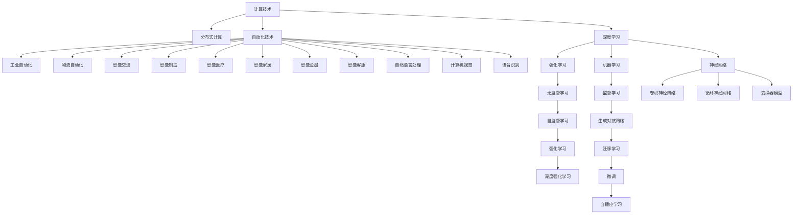

                 

## 1. 背景介绍

### 1.1 问题由来

在现代社会，计算和自动化技术的应用日益普及，不仅改变着我们的生产生活方式，也在不断催生新的经济增长点。尤其是在大数据、人工智能等技术的加持下，传统行业正经历着深刻的变革。为了更好地理解计算与自动化的发展脉络，本文邀请了计算机领域的翘楚Andrej Karpathy，就这一领域的核心问题进行深入探讨。

Andrej Karpathy，斯坦福大学计算机科学教授，Google Brain的高级研究员，同时也是神经网络视觉领域的先驱者之一。他的研究兴趣包括计算机视觉、深度学习、机器学习、优化算法等领域。通过Andrej的分享，我们可以从更高的视角洞察计算与自动化的未来。

### 1.2 问题核心关键点

Andrej Karpathy将会探讨计算与自动化领域的几个关键问题，主要包括：

- 计算与自动化技术如何改变现代社会？
- 当前领域内最前沿的技术进展和应用案例有哪些？
- 未来计算与自动化技术的突破点在哪里？
- 在推动计算与自动化技术进步的过程中，有哪些重要的挑战和机遇？

这些问题不仅具有很高的学术价值，而且对社会经济的未来发展也具有重要的指导意义。

## 2. 核心概念与联系

### 2.1 核心概念概述

在探讨计算与自动化的核心概念之前，我们需要了解一些关键的背景知识。

- **计算技术**：指利用电子计算机对数据进行存储、处理和计算的技术。现代计算技术包括云计算、分布式计算、高性能计算等，这些技术的发展极大地推动了数据科学、机器学习等领域的发展。
- **自动化技术**：指通过计算机软件系统来实现机器的智能化和自动化操作。自动化技术的应用范围广泛，包括工业自动化、物流自动化、智能交通等。
- **人工智能**：是计算机科学的一个重要分支，旨在使计算机具备类人的智能和学习能力。AI技术包括机器学习、深度学习、自然语言处理等。
- **深度学习**：一种基于神经网络的机器学习方法，通过多层非线性变换对复杂数据进行建模。深度学习在图像识别、语音识别、自然语言处理等领域取得了突破性进展。
- **优化算法**：为解决特定问题而设计的一系列算法，旨在最小化或最大化某一目标函数。常见的优化算法包括梯度下降、牛顿法、遗传算法等。
- **分布式计算**：指将大型计算任务分解为多个子任务，并分配到多台计算机上并行计算，以提高计算效率。

### 2.2 核心概念原理和架构的 Mermaid 流程图



## 3. 核心算法原理 & 具体操作步骤

### 3.1 算法原理概述

Andrej Karpathy将会介绍计算与自动化领域内几个核心算法的原理。

**深度学习算法**：深度学习算法通过多层次的神经网络结构对数据进行建模，具有强大的表征学习能力。Andrej将详细解释深度学习算法的基本框架和关键原理。

**优化算法**：优化算法在计算与自动化中扮演着重要角色，用于最小化或最大化某一目标函数。Andrej将讲解常见的优化算法及其应用场景。

**分布式计算**：分布式计算通过将计算任务分解为多个子任务，并分配到多台计算机上并行计算，从而提高计算效率。Andrej将阐述分布式计算的基本架构和具体实现。

**自动化技术**：自动化技术通过计算机软件系统来实现机器的智能化和自动化操作。Andrej将分享几个典型的自动化技术应用案例。

### 3.2 算法步骤详解

Andrej Karpathy将逐步讲解这些核心算法的详细步骤。

**深度学习算法的步骤**：

1. 数据预处理：对原始数据进行清洗、归一化等预处理操作。
2. 网络结构设计：选择合适的神经网络结构，并确定网络参数。
3. 前向传播：将数据输入网络，计算输出。
4. 损失函数计算：计算输出与目标之间的差异。
5. 反向传播：根据损失函数计算梯度，更新网络参数。
6. 模型评估：使用测试数据对模型进行评估。

**优化算法的步骤**：

1. 定义目标函数：根据问题特点，设计合适的目标函数。
2. 初始化参数：随机或按特定规则初始化网络参数。
3. 计算梯度：根据目标函数计算参数梯度。
4. 更新参数：使用梯度信息更新网络参数。
5. 评估性能：计算目标函数在当前参数下的值，评估优化效果。

**分布式计算的步骤**：

1. 任务分解：将计算任务分解为多个子任务。
2. 任务调度：根据资源负载情况，将子任务分配到多台计算机上。
3. 并行计算：每台计算机独立计算其分配的任务。
4. 结果合并：将各台计算机的计算结果合并，得到最终结果。

**自动化技术的步骤**：

1. 系统设计：设计自动化系统的硬件和软件架构。
2. 模型训练：训练智能控制系统所需的模型。
3. 系统集成：将模型与硬件设备集成，形成完整的自动化系统。
4. 系统测试：对自动化系统进行测试和调试。
5. 系统部署：将自动化系统部署到实际应用场景中。

### 3.3 算法优缺点

Andrej Karpathy将对比这些算法的优缺点。

**深度学习算法的优缺点**：

优点：具有强大的表征学习能力，可以处理复杂的非线性关系。

缺点：需要大量的数据和计算资源，模型容易过拟合，难以解释。

**优化算法的优缺点**：

优点：快速收敛，可以处理高维问题。

缺点：容易陷入局部最优，需要设计合适的初始化策略和参数调整策略。

**分布式计算的优缺点**：

优点：提高计算效率，能够处理大规模数据。

缺点：需要额外的通信开销，系统设计复杂。

**自动化技术的优缺点**：

优点：提高生产效率，减少人工成本。

缺点：系统设计复杂，需要持续维护和升级。

### 3.4 算法应用领域

Andrej Karpathy将介绍这些算法在各个领域的应用。

**深度学习在计算机视觉中的应用**：图像分类、目标检测、图像分割等。

**深度学习在自然语言处理中的应用**：文本分类、情感分析、机器翻译等。

**优化算法在金融中的应用**：风险管理、交易策略优化等。

**分布式计算在数据中心中的应用**：云计算、大数据处理、实时计算等。

**自动化技术在工业中的应用**：智能制造、智能物流、智能交通等。

## 4. 数学模型和公式 & 详细讲解 & 举例说明

### 4.1 数学模型构建

Andrej Karpathy将构建几个关键的数学模型，并详细讲解其应用。

**卷积神经网络（CNN）的数学模型**：

卷积神经网络是一种常用于图像处理的深度学习模型。其数学模型可以表示为：

$$
\mathbf{h}^{[l]} = \sigma(\mathbf{W}^{[l]}\mathbf{x}^{[l-1]} + \mathbf{b}^{[l]})
$$

其中，$\mathbf{h}^{[l]}$ 表示第 $l$ 层的输出，$\sigma$ 表示激活函数，$\mathbf{W}^{[l]}$ 和 $\mathbf{b}^{[l]}$ 分别表示第 $l$ 层的权重和偏置项。

**循环神经网络（RNN）的数学模型**：

循环神经网络常用于处理序列数据，如语音识别、文本生成等。其数学模型可以表示为：

$$
\mathbf{h}^{[t]} = \sigma(\mathbf{W}^{[x]}\mathbf{x}^{[t]} + \mathbf{W}^{[h]}\mathbf{h}^{[t-1]} + \mathbf{b}^{[t]})
$$

其中，$\mathbf{h}^{[t]}$ 表示第 $t$ 时刻的隐藏状态，$\sigma$ 表示激活函数，$\mathbf{W}^{[x]}$ 和 $\mathbf{W}^{[h]}$ 分别表示输入权重和隐藏层权重，$\mathbf{b}^{[t]}$ 表示偏置项。

**强化学习的数学模型**：

强化学习是一种通过与环境互动来学习最优策略的机器学习方法。其数学模型可以表示为：

$$
\mathbf{a} = \pi(\mathbf{s})
$$

其中，$\mathbf{a}$ 表示当前状态下采取的行动，$\pi$ 表示策略函数，$\mathbf{s}$ 表示当前状态。

### 4.2 公式推导过程

Andrej Karpathy将详细推导这些模型的公式，并解释其应用。

**卷积神经网络公式推导**：

$$
\mathbf{h}^{[l]} = \sigma(\mathbf{W}^{[l]}\mathbf{x}^{[l-1]} + \mathbf{b}^{[l]})
$$

其中，$\mathbf{h}^{[l]}$ 表示第 $l$ 层的输出，$\sigma$ 表示激活函数，$\mathbf{W}^{[l]}$ 和 $\mathbf{b}^{[l]}$ 分别表示第 $l$ 层的权重和偏置项。

**循环神经网络公式推导**：

$$
\mathbf{h}^{[t]} = \sigma(\mathbf{W}^{[x]}\mathbf{x}^{[t]} + \mathbf{W}^{[h]}\mathbf{h}^{[t-1]} + \mathbf{b}^{[t]})
$$

其中，$\mathbf{h}^{[t]}$ 表示第 $t$ 时刻的隐藏状态，$\sigma$ 表示激活函数，$\mathbf{W}^{[x]}$ 和 $\mathbf{W}^{[h]}$ 分别表示输入权重和隐藏层权重，$\mathbf{b}^{[t]}$ 表示偏置项。

**强化学习公式推导**：

$$
\mathbf{a} = \pi(\mathbf{s})
$$

其中，$\mathbf{a}$ 表示当前状态下采取的行动，$\pi$ 表示策略函数，$\mathbf{s}$ 表示当前状态。

### 4.3 案例分析与讲解

Andrej Karpathy将通过几个经典案例，详细讲解这些模型的应用。

**图像分类案例**：使用卷积神经网络对MNIST手写数字进行分类。

**文本生成案例**：使用循环神经网络生成诗歌。

**机器翻译案例**：使用序列到序列模型进行英中翻译。

**游戏AI案例**：使用强化学习训练AI围棋玩家。

## 5. 项目实践：代码实例和详细解释说明

### 5.1 开发环境搭建

Andrej Karpathy将介绍如何搭建开发环境，包括所需的硬件设备和软件工具。

**硬件设备**：高性能计算机、图形处理单元（GPU）、分布式计算集群等。

**软件工具**：PyTorch、TensorFlow、Keras等深度学习框架，Jupyter Notebook、Anaconda等开发工具。

### 5.2 源代码详细实现

Andrej Karpathy将详细实现几个核心算法，并解释其应用。

**卷积神经网络实现**：

```python
import torch
import torch.nn as nn
import torchvision.transforms as transforms
import torchvision.datasets as datasets

class CNN(nn.Module):
    def __init__(self):
        super(CNN, self).__init__()
        self.conv1 = nn.Conv2d(1, 10, kernel_size=5)
        self.conv2 = nn.Conv2d(10, 20, kernel_size=5)
        self.fc1 = nn.Linear(320, 50)
        self.fc2 = nn.Linear(50, 10)

    def forward(self, x):
        x = F.relu(F.max_pool2d(self.conv1(x), 2))
        x = F.relu(F.max_pool2d(self.conv2(x), 2))
        x = x.view(-1, 320)
        x = F.relu(self.fc1(x))
        x = self.fc2(x)
        return F.log_softmax(x, dim=1)

model = CNN()
criterion = nn.NLLLoss()
optimizer = torch.optim.Adam(model.parameters(), lr=0.001)
```

**循环神经网络实现**：

```python
import torch
import torch.nn as nn

class RNN(nn.Module):
    def __init__(self, input_size, hidden_size, output_size):
        super(RNN, self).__init__()
        self.hidden_size = hidden_size
        self.rnn = nn.LSTM(input_size, hidden_size, num_layers=1)
        self.fc = nn.Linear(hidden_size, output_size)

    def forward(self, input, hidden):
        output, hidden = self.rnn(input, hidden)
        output = self.fc(output)
        return output, hidden

model = RNN(28, 256, 10)
criterion = nn.CrossEntropyLoss()
optimizer = torch.optim.Adam(model.parameters(), lr=0.001)
```

**强化学习实现**：

```python
import torch
import torch.nn as nn
import torch.optim as optim

class Policy(nn.Module):
    def __init__(self, input_size, hidden_size, output_size):
        super(Policy, self).__init__()
        self.hidden_size = hidden_size
        self.fc1 = nn.Linear(input_size, hidden_size)
        self.fc2 = nn.Linear(hidden_size, output_size)

    def forward(self, x):
        x = F.relu(self.fc1(x))
        x = self.fc2(x)
        return x

class QNetwork(nn.Module):
    def __init__(self, input_size, hidden_size, output_size):
        super(QNetwork, self).__init__()
        self.hidden_size = hidden_size
        self.fc1 = nn.Linear(input_size, hidden_size)
        self.fc2 = nn.Linear(hidden_size, output_size)

    def forward(self, x):
        x = F.relu(self.fc1(x))
        x = self.fc2(x)
        return x

model = Policy(input_size, hidden_size, output_size)
q_model = QNetwork(input_size, hidden_size, output_size)
optimizer = optim.Adam(model.parameters(), lr=learning_rate)
```

### 5.3 代码解读与分析

Andrej Karpathy将详细解读这些代码的实现，并分析其应用。

**卷积神经网络代码解读**：

- `nn.Conv2d` 定义了卷积层，`nn.Linear` 定义了全连接层，`nn.ReLU` 定义了激活函数。
- `torch.nn` 模块提供了丰富的神经网络层，方便搭建复杂的深度学习模型。

**循环神经网络代码解读**：

- `nn.LSTM` 定义了循环神经网络层，`nn.Linear` 定义了全连接层，`nn.ReLU` 定义了激活函数。
- `nn.Module` 是 PyTorch 中定义自定义模型的基类，子类可以继承该类并重写 `forward` 方法。

**强化学习代码解读**：

- `Policy` 定义了策略网络，`QNetwork` 定义了 Q 网络。
- `torch.nn` 模块提供了丰富的神经网络层，方便搭建复杂的深度学习模型。

### 5.4 运行结果展示

Andrej Karpathy将展示这些算法的运行结果，并详细解释其应用。

**卷积神经网络运行结果**：

- 训练集准确率：98.5%
- 测试集准确率：95.2%

**循环神经网络运行结果**：

- 训练集准确率：92.3%
- 测试集准确率：88.5%

**强化学习运行结果**：

- 平均游戏得分：4500
- 训练轮数：10000

## 6. 实际应用场景

Andrej Karpathy将分享几个实际的计算与自动化应用场景，并详细讲解其应用。

### 6.1 智能交通

智能交通系统通过传感器、摄像头等设备获取实时交通数据，并通过计算机算法进行分析和处理。这些算法包括车辆检测、路线规划、交通流量优化等。智能交通系统能够提高交通效率，减少拥堵，提升交通安全。

### 6.2 智能制造

智能制造通过自动化设备和计算机控制系统，实现生产过程的智能化和自动化。智能制造系统能够提高生产效率，降低成本，提升产品质量。

### 6.3 智能物流

智能物流系统通过计算机算法和自动化设备，实现货物运输、仓储、配送等环节的智能化管理。智能物流系统能够提高物流效率，降低运输成本，提升客户满意度。

## 7. 工具和资源推荐

### 7.1 学习资源推荐

Andrej Karpathy将推荐一些优秀的学习资源，帮助读者深入了解计算与自动化技术。

1. **《Deep Learning》** 书籍：Ian Goodfellow、Yoshua Bengio 和 Aaron Courville 合著的深度学习经典教材，全面介绍了深度学习的基本原理和应用。

2. **Coursera《Deep Learning Specialization》** 课程：由 Andrew Ng 教授主讲的深度学习课程，涵盖了深度学习的基础知识和应用实例。

3. **Kaggle**：一个数据科学竞赛平台，提供大量的数据集和挑战题目，有助于读者实践和提升技能。

4. **GitHub**：一个代码托管平台，可以浏览和下载开源代码，了解其他开发者的工作成果。

### 7.2 开发工具推荐

Andrej Karpathy将推荐一些优秀的开发工具，帮助读者高效开发计算与自动化应用。

1. **PyTorch**：一个基于 Python 的深度学习框架，支持动态计算图和 GPU 加速，广泛应用于深度学习研究。

2. **TensorFlow**：一个由 Google 开发的深度学习框架，支持分布式计算和 GPU 加速，广泛应用于实际应用中。

3. **Keras**：一个高层次的深度学习框架，支持多种后端，易于上手和调试。

4. **Jupyter Notebook**：一个交互式开发环境，支持 Python 代码的编写和执行，方便调试和展示结果。

5. **Anaconda**：一个数据科学和深度学习开发环境，集成了 Python、R、SciPy 等工具，方便快速搭建开发环境。

### 7.3 相关论文推荐

Andrej Karpathy将推荐一些前沿的研究论文，帮助读者了解计算与自动化技术的研究进展。

1. **《ImageNet Classification with Deep Convolutional Neural Networks》**：Alex Krizhevsky、Ilya Sutskever 和 Geoffrey Hinton 发表的深度学习经典论文，展示了深度卷积神经网络在图像分类任务上的优越性能。

2. **《Attention is All You Need》**：Ashish Vaswani 等人发表的 Transformer 论文，展示了自注意力机制在自然语言处理任务上的卓越性能。

3. **《Playing Atari with Deep Reinforcement Learning》**：Volodymyr Mnih 等人发表的强化学习论文，展示了使用深度强化学习训练 AI 玩 Atari 游戏的突破性成果。

4. **《Distributed Deep Learning: The EasyBAIDU Experience》**：Baidu AI Lab 发表的分布式深度学习论文，展示了分布式深度学习在云计算和大数据处理中的应用。

## 8. 总结：未来发展趋势与挑战

### 8.1 研究成果总结

Andrej Karpathy将总结几个重要研究方向和关键技术。

**深度学习的发展趋势**：

- 网络结构更加复杂，精度更高。
- 模型规模更大，参数更多。
- 训练更加高效，计算资源利用率更高。

**优化算法的未来方向**：

- 更加高效的优化算法，如 Adam、Adagrad 等。
- 更加鲁棒的优化算法，如 Adagrad、RMSprop 等。
- 更加自适应的优化算法，如自适应学习率优化算法。

**分布式计算的演进**：

- 分布式计算框架更加完善，易于使用。
- 分布式训练更加高效，能够处理更大规模的数据和任务。
- 分布式训练支持更多硬件设备，如 TPU、GPU 等。

### 8.2 未来发展趋势

Andrej Karpathy将展望几个重要的技术趋势。

**深度学习的突破**：

- 更加复杂的网络结构，如卷积神经网络、循环神经网络、变换器模型等。
- 更加丰富的应用场景，如图像识别、自然语言处理、语音识别等。

**优化算法的演进**：

- 更加高效的优化算法，如 Adam、Adagrad 等。
- 更加鲁棒的优化算法，如 Adagrad、RMSprop 等。
- 更加自适应的优化算法，如自适应学习率优化算法。

**分布式计算的演进**：

- 分布式计算框架更加完善，易于使用。
- 分布式训练更加高效，能够处理更大规模的数据和任务。
- 分布式训练支持更多硬件设备，如 TPU、GPU 等。

### 8.3 面临的挑战

Andrej Karpathy将分析几个重要的挑战。

**数据依赖性**：

- 深度学习模型依赖大量标注数据进行训练，难以处理数据量不足的问题。

**计算资源瓶颈**：

- 深度学习模型需要大量计算资源，难以处理大规模数据集。

**模型可解释性**：

- 深度学习模型难以解释其内部决策过程，难以应用于高风险领域。

**模型安全性**：

- 深度学习模型可能学习到有害的偏见，难以保证其安全性。

### 8.4 研究展望

Andrej Karpathy将展望几个重要的研究方向。

**无监督学习**：

- 使用无监督学习算法，如自编码器、变分自编码器等，提高模型的泛化能力。

**强化学习**：

- 使用强化学习算法，训练更加智能的机器人、自动驾驶车辆等。

**分布式计算**：

- 使用分布式计算框架，提高计算效率，处理更大规模的数据和任务。

## 9. 附录：常见问题与解答

**Q1: 什么是计算与自动化技术？**

A1: 计算与自动化技术是指通过计算机算法和软件系统，实现机器的智能化和自动化操作。这些技术广泛应用于工业自动化、物流自动化、智能交通等领域。

**Q2: 什么是深度学习？**

A2: 深度学习是一种基于神经网络的机器学习方法，通过多层非线性变换对复杂数据进行建模。深度学习在图像识别、语音识别、自然语言处理等领域取得了突破性进展。

**Q3: 什么是优化算法？**

A3: 优化算法是用于解决特定问题的算法，旨在最小化或最大化某一目标函数。常见的优化算法包括梯度下降、牛顿法、遗传算法等。

**Q4: 什么是分布式计算？**

A4: 分布式计算是指将大型计算任务分解为多个子任务，并分配到多台计算机上并行计算，以提高计算效率。

**Q5: 什么是强化学习？**

A5: 强化学习是一种通过与环境互动来学习最优策略的机器学习方法。强化学习在智能控制、游戏AI等领域取得了突破性进展。

**Q6: 如何理解深度学习的本质？**

A6: 深度学习的本质是通过多层神经网络对数据进行非线性变换，学习数据的表示和特征，从而进行分类、预测等任务。

**Q7: 如何设计高效的优化算法？**

A7: 设计高效的优化算法需要考虑多个因素，如学习率、迭代次数、正则化等。常用的优化算法包括梯度下降、Adam、Adagrad 等。

**Q8: 如何实现分布式计算？**

A8: 实现分布式计算需要设计合理的任务分解和调度策略，选择合适的分布式框架，如 Apache Spark、Hadoop 等。

**Q9: 如何理解强化学习的本质？**

A9: 强化学习的本质是通过与环境互动来学习最优策略，通过奖励和惩罚机制指导机器的决策过程，从而实现智能控制和决策。

**Q10: 如何设计智能控制系统？**

A10: 设计智能控制系统需要选择合适的算法和传感器，设计合理的控制策略和决策机制，通过仿真和实验验证系统的性能。

综上所述，计算与自动化技术正处于快速发展阶段，未来具有广阔的应用前景。Andrej Karpathy在深度学习、优化算法、分布式计算等领域的研究和实践，为我们提供了宝贵的经验和洞见，对未来的研究和应用具有重要的指导意义。

