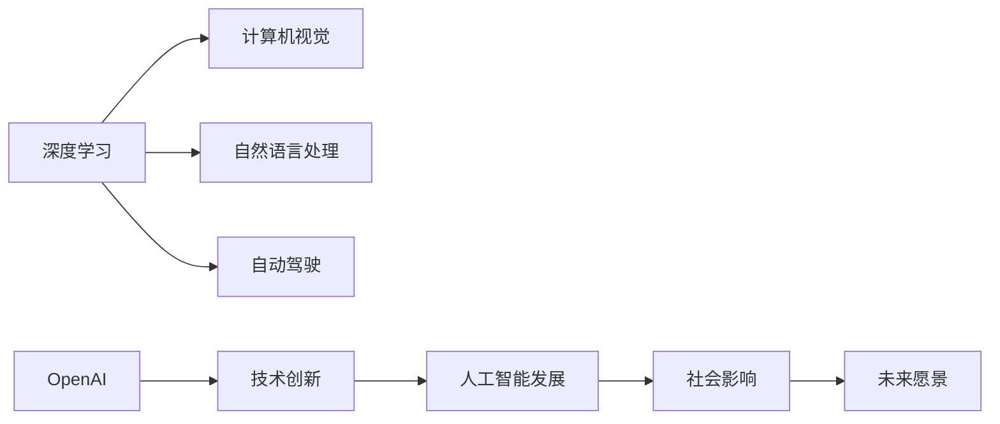

                 

## 1. 背景介绍

### 1.1 问题由来
在深度学习的发展历程中，Andrej Karpathy 是一位举足轻重的人物，他不仅在计算机视觉领域做出了重要贡献，还在OpenAI和Tesla等公司担任要职。Andrej Karpathy 的学术背景和工业实践经历，使他对人工智能的未来有着独到的见解。

本文旨在通过回顾 Andrej Karpathy 在深度学习领域的贡献和思考，探讨他对于OpenAI 未来的展望，以及 AI 技术在未来社会、经济和科技方面的深远影响。

### 1.2 问题核心关键点
Andrej Karpathy 的核心观点主要包括以下几个方面：
1. **深度学习的潜力与挑战**：深度学习技术在图像识别、自然语言处理、自动驾驶等领域取得了显著进展，但同时也面临着计算资源、数据质量、模型可解释性等挑战。
2. **OpenAI 的创新与未来**：OpenAI 如何通过技术创新，保持其在人工智能领域的领先地位。
3. **AI 对社会的影响**：AI 技术对教育、医疗、经济等社会领域的影响，以及在实现人类愿景方面的潜力与挑战。
4. **个人成长与科研经验分享**：Andrej Karpathy 的学术生涯和个人成长经历，对年轻研究者和从业者的启示。

这些关键点将贯穿全文，帮助读者全面理解 Andrej Karpathy 的深度学习理念和未来展望。

## 2. 核心概念与联系

### 2.1 核心概念概述

为更好地理解 Andrej Karpathy 的观点，我们需要了解以下几个核心概念：

- **深度学习**：一种通过多层次神经网络模拟人脑处理复杂任务的技术。
- **计算机视觉**：研究如何让计算机通过图像和视频等视觉信息进行理解、识别和推理。
- **自然语言处理**：使计算机能够理解和生成人类语言的技术。
- **OpenAI**：一家致力于推动人工智能研究的公司，致力于通过技术创新推动 AI 的发展。
- **自动驾驶**：通过 AI 技术实现汽车的自主导航和驾驶。

这些概念之间相互关联，共同构成了安德烈·卡尔帕斯奇对人工智能发展的全面理解。

### 2.2 核心概念原理和架构的 Mermaid 流程图



这个流程图展示了安德烈·卡尔帕斯奇眼中深度学习技术的多维应用和未来发展。

## 3. 核心算法原理 & 具体操作步骤

### 3.1 算法原理概述

安德烈·卡尔帕斯奇认为，深度学习之所以能够取得成功，是因为它能够自动学习特征表示，通过多层次的抽象，逐步提高数据的表现能力。深度学习的核心是神经网络，其中前向传播和反向传播算法是学习的关键。

- **前向传播**：将输入数据经过多个层次的神经网络，逐步提取特征，得到最终的输出。
- **反向传播**：通过计算损失函数对每个参数的梯度，调整网络权重，以最小化损失函数。

### 3.2 算法步骤详解

深度学习的训练过程大致包括以下几个步骤：

1. **数据准备**：收集和预处理训练数据，确保数据的多样性和质量。
2. **模型定义**：选择合适的神经网络架构，如卷积神经网络(CNN)、循环神经网络(RNN)、变分自编码器(VAE)等。
3. **模型初始化**：对模型参数进行随机初始化。
4. **前向传播**：将数据输入模型，得到预测结果。
5. **计算损失**：将预测结果与真实标签计算损失函数，如均方误差、交叉熵等。
6. **反向传播**：通过反向传播算法计算每个参数的梯度。
7. **参数更新**：使用梯度下降等优化算法，更新模型参数。
8. **重复迭代**：重复上述步骤，直至模型收敛。

### 3.3 算法优缺点

深度学习的优点包括：
- **自适应能力**：能够自动学习数据特征，无需手动设计特征提取过程。
- **高表现能力**：在图像识别、自然语言处理等领域取得了显著进展。
- **可扩展性**：适用于各种复杂任务，可以通过堆叠网络层来提升性能。

深度学习的缺点包括：
- **计算资源需求高**：需要大量的计算资源和数据进行训练。
- **可解释性差**：模型内部的参数和过程难以解释，缺乏透明性。
- **过拟合风险**：对于小样本数据集，模型容易出现过拟合现象。

### 3.4 算法应用领域

深度学习技术在多个领域得到广泛应用，如：

- **计算机视觉**：图像分类、目标检测、人脸识别、图像生成等。
- **自然语言处理**：语言翻译、文本分类、情感分析、机器翻译等。
- **自动驾驶**：环境感知、路径规划、行为决策等。
- **医疗影像**：疾病诊断、图像识别、基因分析等。

这些应用领域展示了深度学习技术的强大潜力和广泛适用性。

## 4. 数学模型和公式 & 详细讲解 & 举例说明

### 4.1 数学模型构建

安德烈·卡尔帕斯奇认为，深度学习的数学模型可以概括为以下几个部分：

1. **神经网络**：由多个层次组成，每个层次包含多个神经元。
2. **激活函数**：如 ReLU、Sigmoid、Tanh 等，用于非线性变换。
3. **损失函数**：如均方误差、交叉熵等，用于评估模型预测结果与真实标签的差异。
4. **优化算法**：如梯度下降、Adam、Adagrad 等，用于更新模型参数。

### 4.2 公式推导过程

以图像分类为例，深度学习的数学模型可以表示为：

$$
y = \sigma(\beta W x + a)
$$

其中，$y$ 表示输出结果，$x$ 表示输入数据，$W$ 表示权重矩阵，$a$ 表示偏置项，$\sigma$ 表示激活函数。

对于损失函数，常用的有均方误差和交叉熵损失函数：

$$
\text{MSE} = \frac{1}{n} \sum_{i=1}^{n} (y_i - \hat{y_i})^2
$$

$$
\text{CE} = -\frac{1}{n} \sum_{i=1}^{n} y_i \log \hat{y_i} + (1 - y_i) \log(1 - \hat{y_i})
$$

其中，$y_i$ 表示真实标签，$\hat{y_i}$ 表示模型预测结果。

### 4.3 案例分析与讲解

以卷积神经网络(CNN)为例，CNN 的典型结构包括卷积层、池化层、全连接层等。CNN 在图像分类任务中表现优异，其核心在于通过卷积操作提取局部特征，通过池化操作减少特征维度，从而降低计算复杂度。

## 5. 项目实践：代码实例和详细解释说明

### 5.1 开发环境搭建

安德烈·卡尔帕斯奇强调了开发环境的重要性，以下是搭建 PyTorch 环境的步骤：

1. 安装 Anaconda：
```bash
conda install anaconda
```

2. 创建虚拟环境：
```bash
conda create --name pytorch-env python=3.8
conda activate pytorch-env
```

3. 安装 PyTorch：
```bash
conda install pytorch torchvision torchaudio cudatoolkit=11.1 -c pytorch -c conda-forge
```

4. 安装 TensorBoard：
```bash
pip install tensorboard
```

5. 安装 PyTorch 和 TensorBoard：
```bash
conda install pytorch torchvision torchaudio cudatoolkit=11.1 -c pytorch -c conda-forge
```

完成环境配置后，即可进行深度学习项目的开发。

### 5.2 源代码详细实现

以下是一个简单的图像分类示例代码，包括数据加载、模型定义、训练和测试：

```python
import torch
import torch.nn as nn
import torch.optim as optim
import torchvision.transforms as transforms
from torchvision import datasets

class ConvNet(nn.Module):
    def __init__(self):
        super(ConvNet, self).__init__()
        self.conv1 = nn.Conv2d(3, 32, 3, 1, 1)
        self.conv2 = nn.Conv2d(32, 64, 3, 1, 1)
        self.pool = nn.MaxPool2d(2, 2)
        self.fc1 = nn.Linear(9216, 120)
        self.fc2 = nn.Linear(120, 84)
        self.fc3 = nn.Linear(84, 10)

    def forward(self, x):
        x = self.pool(F.relu(self.conv1(x)))
        x = self.pool(F.relu(self.conv2(x)))
        x = x.view(-1, 9216)
        x = F.relu(self.fc1(x))
        x = F.relu(self.fc2(x))
        x = self.fc3(x)
        return x

# 定义训练函数
def train(model, device, train_loader, optimizer, epoch):
    model.train()
    for batch_idx, (data, target) in enumerate(train_loader):
        data, target = data.to(device), target.to(device)
        optimizer.zero_grad()
        output = model(data)
        loss = F.cross_entropy(output, target)
        loss.backward()
        optimizer.step()

# 定义测试函数
def test(model, device, test_loader):
    model.eval()
    test_loss = 0
    correct = 0
    with torch.no_grad():
        for data, target in test_loader:
            data, target = data.to(device), target.to(device)
            output = model(data)
            test_loss += F.cross_entropy(output, target, reduction='sum').item()
            pred = output.argmax(dim=1, keepdim=True)
            correct += pred.eq(target.view_as(pred)).sum().item()

    test_loss /= len(test_loader.dataset)
    return test_loss, correct

# 定义主函数
def main():
    batch_size = 4
    device = torch.device('cuda' if torch.cuda.is_available() else 'cpu')
    train_dataset = datasets.CIFAR10(root='data', train=True, download=True, transform=transforms.ToTensor())
    test_dataset = datasets.CIFAR10(root='data', train=False, download=True, transform=transforms.ToTensor())
    train_loader = torch.utils.data.DataLoader(train_dataset, batch_size=batch_size, shuffle=True)
    test_loader = torch.utils.data.DataLoader(test_dataset, batch_size=batch_size, shuffle=False)

    model = ConvNet().to(device)
    optimizer = optim.SGD(model.parameters(), lr=0.001, momentum=0.9)
    for epoch in range(10):
        train(model, device, train_loader, optimizer, epoch)
        test_loss, correct = test(model, device, test_loader)
        print(f'Epoch {epoch+1}, Loss: {test_loss:.4f}, Accuracy: {100 * correct / len(test_loader.dataset):.2f}%')

if __name__ == '__main__':
    main()
```

### 5.3 代码解读与分析

这段代码展示了如何使用 PyTorch 进行图像分类的实现。首先，我们定义了一个简单的卷积神经网络模型，包含两个卷积层、两个池化层和三个全连接层。然后，我们定义了训练函数和测试函数，分别用于前向传播、反向传播和模型评估。最后，我们通过循环迭代，训练模型，并在测试集上进行性能评估。

## 6. 实际应用场景

### 6.1 智能交通

安德烈·卡尔帕斯奇认为，自动驾驶是深度学习的重要应用场景之一。自动驾驶技术通过计算机视觉、传感器融合、路径规划等技术，使汽车能够实现自主导航和驾驶。

目前，自动驾驶技术在感知、决策和控制三个方面取得了显著进展。感知方面，通过摄像头、雷达等传感器获取周围环境信息，进行目标检测和物体追踪。决策方面，通过深度学习模型分析环境数据，做出合理的驾驶决策。控制方面，通过车辆控制算法，实现车辆的平稳驾驶。

### 6.2 医疗影像分析

深度学习在医疗影像分析中也发挥了重要作用。通过卷积神经网络，可以自动识别和分类医疗影像中的病灶、组织等。如在乳腺癌影像中，深度学习模型能够自动识别病灶区域，并进行分类。

医疗影像分析的应用包括疾病诊断、影像分割、异常检测等。深度学习模型能够快速处理大量医疗影像数据，提高了医生的诊断效率，减少了误诊率。

### 6.3 金融风险预测

深度学习在金融风险预测中也得到了广泛应用。通过对历史交易数据和市场数据的分析，深度学习模型能够预测股票价格、市场波动等金融风险。

金融风险预测的应用包括信用评分、股票预测、市场分析等。深度学习模型能够从海量数据中提取关键特征，进行风险预测和分析，帮助金融机构做出合理的决策。

### 6.4 未来应用展望

安德烈·卡尔帕斯奇对未来 AI 技术的发展持乐观态度，他认为 AI 技术将在多个领域发挥重要作用。

1. **自动驾驶**：未来自动驾驶技术将更加成熟，能够实现全天候、多场景的自主驾驶。
2. **医疗影像**：深度学习在医疗影像分析中将发挥更大作用，提高诊断效率和准确率。
3. **金融风险预测**：通过深度学习模型，金融风险预测将更加精准，帮助金融机构做出更好的决策。
4. **智能交通**：未来智能交通系统将更加智能，能够实现车路协同、智能调度等功能。

## 7. 工具和资源推荐

### 7.1 学习资源推荐

安德烈·卡尔帕斯奇推荐了以下几个学习资源：

1. **Coursera**：提供深度学习课程，涵盖从入门到高级的内容。
2. **Kaggle**：提供大量的数据集和竞赛，可以锻炼实战能力。
3. **GitHub**：提供开源项目和代码，可以参考和学习。

### 7.2 开发工具推荐

安德烈·卡尔帕斯奇推荐了以下几个开发工具：

1. **PyTorch**：深度学习的主流框架，灵活易用。
2. **TensorFlow**：深度学习的另一个主流框架，适合大规模工程应用。
3. **TensorBoard**：可视化工具，方便调试和监控。

### 7.3 相关论文推荐

安德烈·卡尔帕斯奇推荐了以下几个相关论文：

1. **ImageNet Classification with Deep Convolutional Neural Networks**：AlexNet 论文，奠定了深度学习在图像分类中的基础。
2. **Deep Residual Learning for Image Recognition**：ResNet 论文，提出了深度残差网络，解决了深度神经网络训练中的退化问题。
3. **Attention Is All You Need**：Transformer 论文，提出了自注意力机制，改变了 NLP 领域的研究范式。

## 8. 总结：未来发展趋势与挑战

### 8.1 研究成果总结

安德烈·卡尔帕斯奇认为，深度学习在过去几十年中取得了显著进展，但在应用过程中也面临诸多挑战。

1. **计算资源**：深度学习需要大量的计算资源进行训练，未来的研究方向是如何提高计算效率。
2. **数据质量**：数据质量是深度学习模型的关键，需要更多高质量的数据集。
3. **模型可解释性**：深度学习模型的可解释性较差，需要更多的研究解决这一问题。

### 8.2 未来发展趋势

安德烈·卡尔帕斯奇认为，未来 AI 技术的发展将呈现以下几个趋势：

1. **计算效率**：未来的 AI 技术将更加高效，能够处理更复杂的数据。
2. **模型可解释性**：AI 模型将更加透明，易于理解和解释。
3. **多模态融合**：未来的 AI 技术将能够处理多模态数据，实现视觉、语音、文本等多模态信息的融合。
4. **跨领域应用**：AI 技术将在更多领域得到应用，推动社会的进步和发展。

### 8.3 面临的挑战

安德烈·卡尔帕斯奇认为，未来的 AI 技术在发展过程中面临以下挑战：

1. **数据隐私**：如何保护用户的隐私数据，是未来 AI 技术发展的重要课题。
2. **伦理问题**：AI 技术的应用可能带来伦理问题，需要制定相关的法律法规。
3. **安全性**：AI 技术的应用需要考虑安全性，避免被恶意利用。

### 8.4 研究展望

安德烈·卡尔帕斯奇认为，未来的 AI 技术需要从以下几个方向进行研究：

1. **跨领域融合**：AI 技术将与更多领域进行融合，实现跨学科的协同创新。
2. **多模态学习**：AI 技术将能够处理多模态数据，实现更加全面的理解。
3. **可解释性**：AI 技术将更加透明，易于理解和解释。

## 9. 附录：常见问题与解答

**Q1: 如何理解深度学习的潜力与挑战？**

A: 深度学习的潜力在于其能够自动学习数据特征，通过多层次的抽象，逐步提高数据的表现能力。其挑战在于计算资源需求高、可解释性差、过拟合风险等。

**Q2: 深度学习技术在未来有哪些应用前景？**

A: 深度学习技术将在自动驾驶、医疗影像、金融风险预测、智能交通等领域发挥重要作用。

**Q3: 深度学习技术的发展面临哪些挑战？**

A: 深度学习技术的发展面临计算资源、数据质量、模型可解释性等挑战。

**Q4: 未来 AI 技术的研究方向有哪些？**

A: 未来 AI 技术的研究方向包括计算效率、模型可解释性、多模态融合、跨领域应用等。

作者：禅与计算机程序设计艺术 / Zen and the Art of Computer Programming

