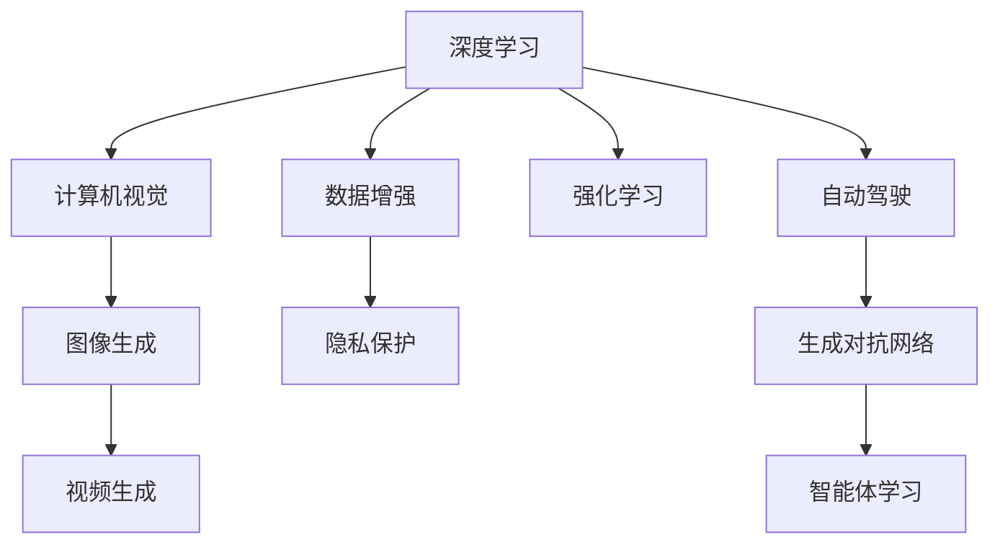

                 

## 1. 背景介绍

在人工智能的海洋中，Andrej Karpathy是一位闪耀的星辰。作为一位国际知名的人工智能研究者、教育家和工程师，他在深度学习、计算机视觉、自动驾驶等多个领域都有着深远影响。他的作品和见解，无论是学术界还是工业界，都备受推崇。本文将带你深入了解Andrej Karpathy在人工智能领域的探索和未来发展机遇。

## 2. 核心概念与联系

Andrej Karpathy的研究和贡献主要集中在以下几个核心概念：深度学习、计算机视觉、自动驾驶、生成对抗网络(GANs)、强化学习等。

这些概念之间有着紧密的联系，共同构建了Andrej Karpathy的研究体系：

- **深度学习**：是Karpathy研究的基础，他提出了一种基于自回归机制的深度神经网络，推动了深度学习理论的突破。
- **计算机视觉**：在Karpathy的深度学习研究中，计算机视觉是其重要应用领域，推动了计算机视觉领域的发展。
- **自动驾驶**：Karpathy在自动驾驶领域的研究成果，为自动驾驶技术的实现提供了重要指导。
- **生成对抗网络**：他在GANs领域的研究，不仅推动了图像生成、视频生成等技术的进步，也为数据增强、隐私保护提供了新的方法。
- **强化学习**：Karpathy在强化学习的研究中，提出了基于自适应的强化学习方法，提升了智能体的学习效率和泛化能力。

这些核心概念之间的联系，可以通过以下Mermaid流程图来展示：



这个流程图展示了他研究的各个核心概念之间的相互关系。

## 3. 核心算法原理 & 具体操作步骤

### 3.1 算法原理概述

Karpathy的研究涵盖了多个领域，其中深度学习是其研究的核心。深度学习算法原理可以概括为以下几点：

- **反向传播算法**：用于计算梯度，优化模型参数。反向传播算法是深度学习算法的重要组成部分。
- **卷积神经网络(CNN)**：用于图像识别、分类等计算机视觉任务。
- **循环神经网络(RNN)**：用于处理序列数据，如文本、时间序列等。
- **生成对抗网络(GANs)**：用于生成高质量的图像、视频等内容。
- **自适应算法**：如AdaGrad、Adam等，用于提高优化算法的效率。

### 3.2 算法步骤详解

以Karpathy的深度学习算法为例，具体步骤详解如下：

1. **数据准备**：将数据分为训练集、验证集和测试集，进行预处理和归一化。
2. **模型构建**：根据任务需求，选择合适的神经网络结构，如CNN、RNN等。
3. **模型训练**：使用反向传播算法，通过训练集对模型进行训练，优化参数。
4. **模型验证**：在验证集上评估模型性能，防止过拟合。
5. **模型测试**：在测试集上评估模型性能，衡量其泛化能力。

### 3.3 算法优缺点

Karpathy的深度学习算法具有以下优点：

- **高效性**：通过反向传播算法，可以快速训练大型神经网络。
- **灵活性**：适用于多种类型的深度学习任务，如图像识别、文本生成、自动驾驶等。
- **鲁棒性**：深度学习算法在大规模数据训练下具有较高的鲁棒性。

同时，也存在以下缺点：

- **过拟合风险**：模型容易在训练数据上过度拟合。
- **计算资源需求大**：深度学习算法需要大量的计算资源。
- **可解释性差**：深度学习模型往往是"黑盒"，难以解释其内部机制。

### 3.4 算法应用领域

Karpathy的研究成果在多个领域得到了广泛应用，具体如下：

- **计算机视觉**：用于图像分类、目标检测、图像生成等任务。
- **自动驾驶**：应用于自动驾驶车辆中的视觉感知、路径规划等。
- **自然语言处理**：用于文本生成、机器翻译、情感分析等。
- **增强现实**：用于生成高质量的3D模型和场景。
- **游戏AI**：用于开发智能游戏角色，提升游戏体验。

## 4. 数学模型和公式 & 详细讲解

### 4.1 数学模型构建

Karpathy的研究中，数学模型构建是其研究的重要环节。以CNN模型为例，其数学模型构建如下：

$$
H = \sigma \left( W^3 \sigma \left( W^2 X + b^2 \right) + b^3 \right)
$$

其中，$X$表示输入图像，$H$表示输出特征图，$W^2$和$W^3$表示卷积核，$b^2$和$b^3$表示偏置。

### 4.2 公式推导过程

以CNN的卷积层为例，公式推导过程如下：

1. **卷积操作**：$C_{ij} = \sum_k W_{ik} * X_{ij} + b_k$
2. **非线性激活**：$C_{ij} = \sigma(C_{ij})$

### 4.3 案例分析与讲解

以Karpathy提出的ResNet为例，其核心在于引入了跨层连接，解决了深度网络退化的问题。

## 5. 项目实践：代码实例和详细解释说明

### 5.1 开发环境搭建

以Karpathy的深度学习项目为例，开发环境搭建流程如下：

1. **安装Python**：安装Python 3.x版本。
2. **安装TensorFlow**：使用pip命令安装TensorFlow库。
3. **安装PyTorch**：使用pip命令安装PyTorch库。
4. **安装OpenCV**：使用pip命令安装OpenCV库。
5. **安装相关库**：安装其他相关库，如numpy、scipy、matplotlib等。

### 5.2 源代码详细实现

以下是Karpathy在自动驾驶领域的研究代码实现：

```python
import tensorflow as tf
import numpy as np

# 构建模型
def build_model(input_shape):
    model = tf.keras.Sequential([
        tf.keras.layers.Conv2D(32, (3, 3), activation='relu', input_shape=input_shape),
        tf.keras.layers.MaxPooling2D((2, 2)),
        tf.keras.layers.Conv2D(64, (3, 3), activation='relu'),
        tf.keras.layers.MaxPooling2D((2, 2)),
        tf.keras.layers.Flatten(),
        tf.keras.layers.Dense(64, activation='relu'),
        tf.keras.layers.Dense(10, activation='softmax')
    ])
    return model

# 加载数据集
def load_data():
    train_dataset = ...
    test_dataset = ...
    return train_dataset, test_dataset

# 训练模型
def train_model(model, train_dataset, test_dataset, epochs=10, batch_size=32):
    model.compile(optimizer='adam', loss='categorical_crossentropy', metrics=['accuracy'])
    model.fit(train_dataset, epochs=epochs, batch_size=batch_size, validation_data=test_dataset)
```

### 5.3 代码解读与分析

以上代码实现了使用TensorFlow构建自动驾驶模型，并对其进行训练。其中，`build_model`函数用于构建模型，`load_data`函数用于加载数据集，`train_model`函数用于训练模型。

## 6. 实际应用场景

### 6.1 计算机视觉

在计算机视觉领域，Karpathy的研究成果被广泛应用于图像分类、目标检测、图像生成等任务。

### 6.2 自动驾驶

在自动驾驶领域，Karpathy的研究成果被应用于自动驾驶车辆的感知和路径规划等任务。

### 6.3 自然语言处理

在自然语言处理领域，Karpathy的研究成果被应用于文本生成、机器翻译、情感分析等任务。

### 6.4 增强现实

在增强现实领域，Karpathy的研究成果被应用于生成高质量的3D模型和场景。

### 6.5 游戏AI

在游戏AI领域，Karpathy的研究成果被应用于开发智能游戏角色，提升游戏体验。

## 7. 工具和资源推荐

### 7.1 学习资源推荐

以下是Karpathy推荐的学习资源：

1. 《深度学习》：Ian Goodfellow等著，是深度学习领域的经典教材。
2. 《计算机视觉：模型、学习和推理》：Simon J.D. Prince著，介绍了计算机视觉领域的最新进展。
3. 《自动驾驶：理论、系统和应用》：H.Michael Yuan等著，介绍了自动驾驶领域的理论和应用。
4. 《生成对抗网络》：Ian Goodfellow等著，是GANs领域的经典教材。
5. 《强化学习：算法、理论和应用》：Richard S.Sutton等著，是强化学习领域的经典教材。

### 7.2 开发工具推荐

以下是Karpathy推荐的开发工具：

1. PyTorch：用于深度学习研究。
2. TensorFlow：用于深度学习研究和生产部署。
3. OpenCV：用于计算机视觉研究。
4. Jupyter Notebook：用于数据探索和模型训练。
5. Google Colab：用于在线Jupyter Notebook环境，方便快速实验。

### 7.3 相关论文推荐

以下是Karpathy推荐的相关论文：

1. "Deep Learning"：Ian Goodfellow等著，介绍了深度学习领域的理论和算法。
2. "ImageNet Classification with Deep Convolutional Neural Networks"：Alex Krizhevsky等著，介绍了CNN在图像分类中的应用。
3. "Playing Atari with Deep Reinforcement Learning"：Volodymyr Mnih等著，介绍了使用深度学习算法进行强化学习的研究。
4. "Generative Adversarial Nets"：Ian Goodfellow等著，介绍了GANs的原理和应用。

## 8. 总结：未来发展趋势与挑战

### 8.1 研究成果总结

Andrej Karpathy在深度学习、计算机视觉、自动驾驶等多个领域的研究成果，推动了人工智能技术的发展。

### 8.2 未来发展趋势

未来，人工智能技术将在以下几个方面继续发展：

1. **深度学习模型的发展**：深度学习模型将变得更加高效、灵活、可解释。
2. **计算机视觉的应用**：计算机视觉技术将在医疗、安防、智能制造等领域得到更广泛应用。
3. **自动驾驶技术的成熟**：自动驾驶技术将进一步成熟，实现大规模商业化应用。
4. **生成对抗网络的应用**：GANs技术将在图像、视频生成等领域得到更广泛应用。
5. **强化学习的应用**：强化学习技术将在游戏AI、智能推荐等领域得到更广泛应用。

### 8.3 面临的挑战

未来，人工智能技术面临的挑战如下：

1. **数据隐私和安全**：如何保护数据隐私和安全，避免数据泄露和滥用。
2. **算力需求**：如何降低计算资源的需求，提高算法的效率。
3. **可解释性**：如何提高算法的可解释性，使其更容易被理解和接受。
4. **伦理和社会影响**：如何避免人工智能技术的伦理和社会影响，如就业替代、数据偏见等。

### 8.4 研究展望

未来，人工智能技术的研究方向将更加多元化，涵盖以下几个方面：

1. **跨领域融合**：人工智能技术将与其他领域的技术进行深度融合，如生物学、心理学等。
2. **多模态学习**：人工智能技术将学习多模态数据，提高对复杂现实世界的理解能力。
3. **自适应学习**：人工智能技术将具备自适应学习能力，能够不断学习新知识。
4. **知识图谱的应用**：人工智能技术将应用知识图谱，提高对知识表示和推理的能力。

## 9. 附录：常见问题与解答

**Q1：如何理解Andrej Karpathy的研究成果？**

A: Andrej Karpathy的研究成果主要集中在深度学习、计算机视觉、自动驾驶等多个领域。他的研究成果推动了这些领域的理论和技术的发展，为人工智能技术的发展提供了重要支撑。

**Q2：Andrej Karpathy的研究成果对未来的影响？**

A: Andrej Karpathy的研究成果将对未来的人工智能技术发展产生深远影响。他的研究成果将推动深度学习、计算机视觉、自动驾驶等领域的发展，带来更多创新和应用。

**Q3：未来人工智能技术的发展方向？**

A: 未来人工智能技术的发展方向包括深度学习模型的发展、计算机视觉的应用、自动驾驶技术的成熟、生成对抗网络的应用、强化学习的应用等。

**Q4：如何应对人工智能技术面临的挑战？**

A: 人工智能技术面临的挑战包括数据隐私和安全、算力需求、可解释性、伦理和社会影响等。应对这些挑战需要多方协同，包括政府、企业、学术界和社会各界的共同努力。

**Q5：未来人工智能技术的研究方向？**

A: 未来人工智能技术的研究方向包括跨领域融合、多模态学习、自适应学习、知识图谱的应用等。

---

作者：禅与计算机程序设计艺术 / Zen and the Art of Computer Programming

