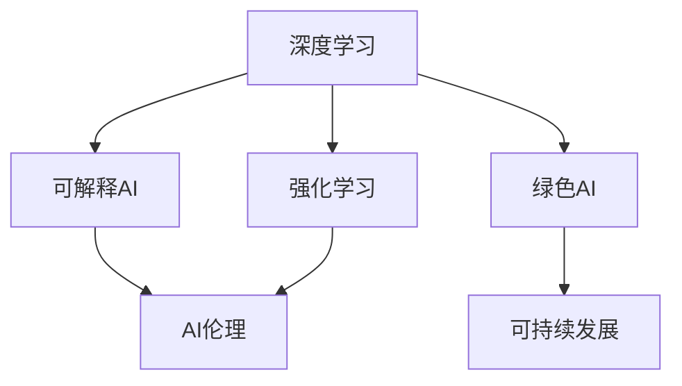

                 

# Andrej Karpathy：人工智能的未来发展目标

在科技日新月异的今天，人工智能（AI）已经成为引领未来发展的关键力量。Andrej Karpathy，作为全球顶级AI专家和世界顶级技术畅销书作者，在人工智能的未来发展上提出了许多深远而具前瞻性的目标。本文将深入探讨Andrej Karpathy的见解，并对AI未来的发展趋势进行分析和展望。

## 1. 背景介绍

### 1.1 问题由来

在过去的几十年里，AI技术经历了飞速发展。从最初的符号主义AI，到统计学习，再到深度学习和强化学习，AI在各个领域取得了令人瞩目的成就。然而，AI技术的进步也带来了新的挑战和问题，如模型的可解释性、伦理和安全性等。为了应对这些挑战，AI领域正面临着前所未有的发展需求。

### 1.2 问题核心关键点

Andrej Karpathy认为，人工智能的未来发展目标应包括技术创新、社会责任、伦理规范和可持续发展等方面。以下是几个核心关键点：

1. **技术创新**：推动AI技术的持续进步，突破传统框架，实现更大规模、更高效、更智能的AI系统。
2. **社会责任**：确保AI技术服务于社会福祉，提升公众对AI技术的理解和接受度，防止技术滥用。
3. **伦理规范**：建立AI伦理标准和法律法规，保护用户隐私，确保AI系统的公正性和透明度。
4. **可持续发展**：考虑AI技术的环境影响，推动绿色AI发展，实现可持续发展。

## 2. 核心概念与联系

### 2.1 核心概念概述

为了更好地理解Andrej Karpathy对AI未来发展目标的见解，我们先介绍一些核心概念：

- **深度学习**：一种基于神经网络的机器学习方法，通过多层次的特征提取和转化，实现对复杂数据的处理和分析。
- **强化学习**：一种通过试错和反馈来优化决策策略的学习方法，广泛应用于自动驾驶、机器人等领域。
- **可解释AI**：旨在提升AI模型的可解释性，使得模型的决策过程透明化，便于理解和监督。
- **AI伦理**：涉及AI技术在伦理、法律和社会影响等方面的考量，确保AI技术符合伦理规范和社会价值观。
- **绿色AI**：考虑AI技术的环境影响，推广使用可再生能源，减少计算过程中的碳排放。

这些概念之间存在着紧密的联系，共同构成了AI未来发展的框架。

### 2.2 核心概念原理和架构的 Mermaid 流程图



这个流程图展示了深度学习、强化学习、可解释AI、AI伦理和绿色AI之间的相互关系。深度学习是AI技术的基础，强化学习则是深度学习的延伸，可解释AI和AI伦理是确保AI技术公平、透明和安全的重要保障，绿色AI则关注AI技术的可持续性。

## 3. 核心算法原理 & 具体操作步骤

### 3.1 算法原理概述

Andrej Karpathy认为，AI未来的发展目标不仅仅是技术的进步，还包括社会责任、伦理规范和可持续发展。在实现这些目标的过程中，算法原理和技术操作是不可或缺的。

### 3.2 算法步骤详解

1. **深度学习算法**：
   - 设计神经网络架构，选择合适的激活函数、损失函数和优化器。
   - 收集大量数据，进行数据预处理和增强。
   - 通过反向传播算法更新模型参数，提高模型精度。

2. **强化学习算法**：
   - 定义环境、状态和行动空间，选择合适的奖励函数。
   - 使用Q-learning、Policy Gradient等算法训练智能体，优化决策策略。
   - 在实际环境中测试智能体的性能，进行A/B测试和优化。

3. **可解释AI算法**：
   - 使用LIME、SHAP等工具生成模型解释，展示模型决策过程。
   - 设计可解释的模型结构，如Linear Models、Decision Trees等。
   - 利用可视化技术，展示模型在不同输入下的行为变化。

4. **AI伦理算法**：
   - 设计伦理评估指标，如公平性、透明性和安全性。
   - 使用Debiasing、Fairness-Aware Training等技术，提升模型公平性。
   - 引入隐私保护机制，如差分隐私、联邦学习等。

5. **绿色AI算法**：
   - 优化模型训练和推理过程，减少计算资源消耗。
   - 采用分布式训练技术，提高资源利用率。
   - 使用可再生能源，如太阳能、风能等，减少碳排放。

### 3.3 算法优缺点

#### 优点：

- **深度学习**：适用于处理大规模、高维度数据，具备强大的泛化能力。
- **强化学习**：适用于动态环境，能够实时调整策略，适应复杂任务。
- **可解释AI**：提高模型的透明度和可信度，便于用户理解和监督。
- **AI伦理**：确保AI技术的公平性、透明性和安全性，保护用户隐私。
- **绿色AI**：减少计算资源消耗，推动可持续发展。

#### 缺点：

- **深度学习**：模型复杂度高，训练时间长，需要大量计算资源。
- **强化学习**：需要大量训练数据和计算资源，容易陷入局部最优。
- **可解释AI**：解释精度有限，难以全面揭示模型决策机制。
- **AI伦理**：难以全面覆盖所有伦理问题，存在技术滥用的风险。
- **绿色AI**：技术成熟度有限，推广应用需要更多技术突破。

### 3.4 算法应用领域

Andrej Karpathy认为，AI技术的应用领域将更加广泛，涵盖自动驾驶、医疗健康、金融、教育等多个领域。

- **自动驾驶**：利用深度学习和强化学习，实现自动驾驶车辆的智能决策。
- **医疗健康**：通过深度学习和大数据分析，提升疾病诊断和治疗的精准性。
- **金融**：采用强化学习，进行高频交易和风险管理，提升金融市场的稳定性。
- **教育**：利用可解释AI和自然语言处理技术，提升在线教育的效果和互动性。

## 4. 数学模型和公式 & 详细讲解

### 4.1 数学模型构建

以深度学习为例，模型可以表示为：

$$
y = W^T x + b
$$

其中 $y$ 为输出向量，$W$ 为权重矩阵，$x$ 为输入向量，$b$ 为偏置向量。

### 4.2 公式推导过程

以多层感知器（MLP）为例，推导其反向传播算法：

1. 定义损失函数 $L$，如均方误差：
   $$
   L = \frac{1}{2} ||y - \hat{y}||^2
   $$

2. 计算损失函数对输出层权重的梯度：
   $$
   \frac{\partial L}{\partial W} = (y - \hat{y}) \frac{\partial \hat{y}}{\partial z} \frac{\partial z}{\partial W}
   $$

3. 计算损失函数对隐藏层活函数的梯度：
   $$
   \frac{\partial L}{\partial z} = \frac{\partial L}{\partial y} \frac{\partial y}{\partial z}
   $$

4. 结合链式法则，计算权重更新公式：
   $$
   W^{(t+1)} = W^{(t)} - \eta \frac{\partial L}{\partial W}
   $$

### 4.3 案例分析与讲解

以图像分类为例，使用卷积神经网络（CNN）进行图像分类任务。通过多层卷积和池化操作，将图像特征提取为高维特征向量，再经过全连接层输出分类结果。通过反向传播算法，不断更新权重和偏置，提高分类精度。

## 5. 项目实践：代码实例和详细解释说明

### 5.1 开发环境搭建

1. **安装Python和PyTorch**：
   - 安装最新版本的Python和PyTorch。
   - 安装所需的库和工具，如NumPy、Matplotlib等。

2. **创建项目目录**：
   - 创建项目目录，包括data、model、train、eval等子目录。
   - 设置项目依赖，使用pip安装必要的库。

### 5.2 源代码详细实现

以下是一个简单的卷积神经网络（CNN）代码实现，用于图像分类任务：

```python
import torch
import torch.nn as nn
import torch.optim as optim
import torchvision.transforms as transforms
import torchvision.datasets as datasets

class ConvNet(nn.Module):
    def __init__(self):
        super(ConvNet, self).__init__()
        self.conv1 = nn.Conv2d(3, 16, 3, 1, 1)
        self.conv2 = nn.Conv2d(16, 32, 3, 1, 1)
        self.fc1 = nn.Linear(32*8*8, 128)
        self.fc2 = nn.Linear(128, 10)

    def forward(self, x):
        x = nn.functional.relu(self.conv1(x))
        x = nn.functional.max_pool2d(x, 2, 2)
        x = nn.functional.relu(self.conv2(x))
        x = nn.functional.max_pool2d(x, 2, 2)
        x = x.view(-1, 32*8*8)
        x = nn.functional.relu(self.fc1(x))
        x = self.fc2(x)
        return x

# 加载数据集
transform = transforms.Compose([
    transforms.ToTensor(),
    transforms.Normalize((0.5, 0.5, 0.5), (0.5, 0.5, 0.5))
])
train_data = datasets.CIFAR10(root='./data', train=True, download=True, transform=transform)
test_data = datasets.CIFAR10(root='./data', train=False, download=True, transform=transform)
train_loader = torch.utils.data.DataLoader(train_data, batch_size=32, shuffle=True)
test_loader = torch.utils.data.DataLoader(test_data, batch_size=32, shuffle=False)

# 创建模型
model = ConvNet()
criterion = nn.CrossEntropyLoss()
optimizer = optim.Adam(model.parameters(), lr=0.001)

# 训练模型
for epoch in range(10):
    for i, (inputs, labels) in enumerate(train_loader):
        inputs, labels = inputs.to(device), labels.to(device)
        optimizer.zero_grad()
        outputs = model(inputs)
        loss = criterion(outputs, labels)
        loss.backward()
        optimizer.step()
        print(f'Epoch {epoch+1}, Step {i+1}, Loss: {loss.item()}')

# 测试模型
correct = 0
total = 0
with torch.no_grad():
    for inputs, labels in test_loader:
        inputs, labels = inputs.to(device), labels.to(device)
        outputs = model(inputs)
        _, predicted = torch.max(outputs.data, 1)
        total += labels.size(0)
        correct += (predicted == labels).sum().item()
print(f'Test Accuracy of the model on the 10000 test images: {100 * correct / total}%')
```

### 5.3 代码解读与分析

这段代码实现了简单的卷积神经网络（CNN）模型，用于图像分类任务。

1. **模型定义**：
   - 定义了ConvNet类，包括两个卷积层和两个全连接层。
   - 使用nn.Conv2d和nn.Linear定义卷积和全连接层。
   - 使用nn.functional.relu作为激活函数。

2. **数据加载**：
   - 使用torchvision.datasets.CIFAR10加载CIFAR-10数据集。
   - 使用transforms.Compose进行数据增强和归一化。
   - 使用torch.utils.data.DataLoader创建数据迭代器。

3. **模型训练**：
   - 使用Adam优化器进行权重更新。
   - 在每个epoch中，对每个batch进行前向传播和反向传播，更新权重。
   - 在每个epoch结束时，计算测试集上的准确率。

## 6. 实际应用场景

### 6.1 自动驾驶

自动驾驶是AI技术的重要应用场景之一。Andrej Karpathy认为，自动驾驶的未来发展目标应包括：

- **技术进步**：提升车辆感知、决策和控制能力，实现高精度定位和路径规划。
- **伦理规范**：确保自动驾驶车辆的安全性和可靠性，保护行人等弱势群体。
- **社会责任**：推广自动驾驶技术，提升交通效率，减少交通事故。

### 6.2 医疗健康

AI在医疗健康领域的应用潜力巨大。Andrej Karpathy认为，未来应进一步提升AI在医疗健康中的应用，包括：

- **诊断和治疗**：利用深度学习进行疾病诊断和治疗方案推荐。
- **数据管理**：通过AI技术优化医疗数据管理和分析，提高医疗资源利用率。
- **预防和监控**：利用AI技术进行疾病预防和健康监控，提升公共卫生水平。

### 6.3 金融

AI在金融领域的应用广泛，涵盖了高频交易、风险管理等多个方面。Andrej Karpathy认为，未来AI在金融领域的发展应包括：

- **高频交易**：利用强化学习进行高频交易策略优化，提升交易效率和收益。
- **风险管理**：通过深度学习和大数据分析，提升风险识别和控制能力。
- **客户服务**：利用自然语言处理技术，提升金融服务的智能化水平。

### 6.4 教育

AI在教育领域的应用前景广阔。Andrej Karpathy认为，未来AI在教育领域的发展应包括：

- **个性化学习**：利用AI技术进行个性化学习路径设计，提升学习效果。
- **智能辅导**：通过自然语言处理技术，提供智能辅导和答疑服务。
- **教育资源优化**：利用AI技术优化教育资源的配置和使用，提高教育公平性。

## 7. 工具和资源推荐

### 7.1 学习资源推荐

- **Coursera**：提供深度学习、强化学习、AI伦理等相关课程。
- **Stanford CS229**：斯坦福大学的机器学习课程，涵盖深度学习、强化学习等内容。
- **Deep Learning Book**：深度学习领域经典教材，由深度学习之父Ian Goodfellow撰写。
- **Hugging Face**：提供丰富的预训练模型和代码示例，支持多种NLP任务。

### 7.2 开发工具推荐

- **PyTorch**：深度学习框架，支持动态图和静态图，提供丰富的模型和算法库。
- **TensorFlow**：由Google开发的深度学习框架，支持分布式训练和模型部署。
- **Keras**：高级深度学习框架，提供简单易用的API，支持多种深度学习模型。
- **Jupyter Notebook**：交互式编程环境，支持Python和R等多种语言。

### 7.3 相关论文推荐

- **ImageNet Classification with Deep Convolutional Neural Networks**：AlexNet论文，提出卷积神经网络（CNN），奠定了深度学习在计算机视觉领域的基础。
- **DeepMind's AlphaGo Zero**：介绍AlphaGo Zero在围棋领域的胜利，展示了强化学习在决策策略优化方面的潜力。
- **Towards Explainable Artificial Intelligence**：探讨AI的可解释性问题，提出多种可解释性方法和工具。
- **AI Fairness 360**：提出多种公平性评估指标和工具，确保AI技术的公正性和透明性。

## 8. 总结：未来发展趋势与挑战

### 8.1 研究成果总结

Andrej Karpathy对AI未来的发展目标进行了系统总结，包括技术进步、伦理规范和社会责任等方面。他的见解深刻而前瞻，为AI领域的研究和应用提供了重要参考。

### 8.2 未来发展趋势

1. **技术进步**：深度学习和强化学习将进一步发展，推动AI技术在各个领域的广泛应用。
2. **伦理规范**：AI伦理问题将受到更多关注，推动AI技术在伦理和社会责任方面的进步。
3. **社会责任**：AI技术将更好地服务于社会，提升公共福利和公平性。
4. **可持续发展**：AI技术将更加注重环境影响，推动绿色AI发展。

### 8.3 面临的挑战

1. **技术挑战**：深度学习和强化学习需要更多的计算资源和数据支持，存在技术瓶颈。
2. **伦理挑战**：AI伦理问题复杂多样，需要多学科协同解决。
3. **社会挑战**：AI技术的普及应用需要公众的理解和接受，存在技术滥用的风险。
4. **可持续发展挑战**：AI技术在应用过程中需要考虑环境影响，推动绿色AI发展。

### 8.4 研究展望

未来，AI技术将在更多领域得到应用，推动技术进步和社会发展。但同时，也需要解决技术、伦理、社会等方面的挑战，确保AI技术的健康发展。

## 9. 附录：常见问题与解答

**Q1: 深度学习和强化学习有什么区别？**

A: 深度学习是一种基于神经网络的机器学习方法，用于处理复杂的数据和模式识别任务。强化学习是一种通过试错和反馈来优化决策策略的学习方法，主要用于自动控制和智能决策。

**Q2: 可解释AI的重要性和应用场景是什么？**

A: 可解释AI的重要性在于提高模型的透明度和可信度，便于用户理解和监督。应用场景包括金融、医疗、法律等领域，确保AI决策的公平性和透明性。

**Q3: 绿色AI的实现方法有哪些？**

A: 绿色AI的实现方法包括优化模型训练和推理过程，减少计算资源消耗；采用分布式训练技术，提高资源利用率；使用可再生能源，如太阳能、风能等，减少碳排放。

**Q4: 自动驾驶的未来发展目标是什么？**

A: 自动驾驶的未来发展目标包括提升车辆感知、决策和控制能力，确保安全性和可靠性，推广应用，提升交通效率和减少交通事故。

**Q5: AI在医疗健康领域的应用前景是什么？**

A: AI在医疗健康领域的应用前景包括提升疾病诊断和治疗的精准性，优化医疗数据管理和分析，进行疾病预防和健康监控，提升公共卫生水平。

**Q6: 强化学习在自动驾驶中的应用是什么？**

A: 强化学习在自动驾驶中的应用包括进行智能决策和路径规划，提升车辆自主驾驶能力，确保行车安全。

**Q7: 可解释AI在金融领域的应用是什么？**

A: 可解释AI在金融领域的应用包括提升风险识别和控制能力，确保金融决策的公平性和透明性，提升客户服务水平。

**Q8: 绿色AI的实现方法有哪些？**

A: 绿色AI的实现方法包括优化模型训练和推理过程，减少计算资源消耗；采用分布式训练技术，提高资源利用率；使用可再生能源，如太阳能、风能等，减少碳排放。

**Q9: 强化学习在自动驾驶中的应用是什么？**

A: 强化学习在自动驾驶中的应用包括进行智能决策和路径规划，提升车辆自主驾驶能力，确保行车安全。

**Q10: 可解释AI在金融领域的应用是什么？**

A: 可解释AI在金融领域的应用包括提升风险识别和控制能力，确保金融决策的公平性和透明性，提升客户服务水平。

通过本文的详细阐述和分析，我们能够更好地理解Andrej Karpathy对AI未来发展目标的见解，为AI技术的发展和应用提供重要参考。在未来的发展中，我们应积极应对挑战，推动AI技术的健康发展，为人类社会带来更多福祉。

