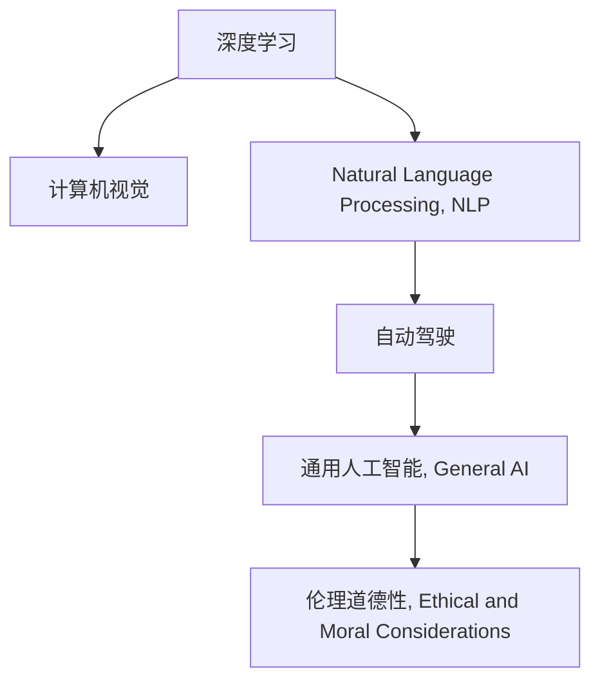

                 

# Andrej Karpathy：人工智能的未来发展规划

> 关键词：人工智能(AI),机器学习(ML),深度学习(Deep Learning),计算机视觉(Computer Vision),自然语言处理(Natural Language Processing),自动驾驶(Autonomous Driving)

## 1. 背景介绍

### 1.1 问题由来

近年来，随着人工智能技术的迅猛发展，AI领域的学术研究、产业应用和公众关注度都达到了前所未有的高度。从语音识别到图像处理，从自然语言处理到智能推荐，AI技术已经渗透到了各行各业。其中，深度学习作为AI技术的重要分支，凭借其强大的数据处理能力和泛化能力，在计算机视觉、自然语言处理等众多领域取得了显著的进展。

然而，随着AI技术的不断进步，我们不禁思考：未来的人工智能将走向何方？Andrej Karpathy，作为深度学习领域的知名专家和OpenAI的顶尖研究员，在近期的一篇博客文章中，分享了他对未来人工智能发展规划的深刻见解。本文将全面解读Karpathy的这些见解，探寻AI未来的发展方向和潜在的挑战。

### 1.2 问题核心关键点

Karpathy的文章提出了AI未来的两大关键趋势：一是向通用人工智能(General AI)的迈进，二是人类在AI发展过程中的角色。

- 通用人工智能：指构建具有广泛知识、高度智能且具备自学习能力的AI系统。这些系统将能够像人类一样理解世界、推理思考，并在多个领域展现出卓越的性能。

- 人类角色：强调在AI发展过程中，人类应发挥关键作用，引导AI技术朝着积极的方向发展，确保AI的安全性和伦理道德性。

这些核心概念不仅定义了AI未来的发展方向，也指出了AI技术应用的广泛可能性。通过对这些概念的深入探讨，可以更好地理解未来AI发展的趋势和挑战。

## 2. 核心概念与联系

### 2.1 核心概念概述

为更好地理解Karpathy对AI未来发展规划的见解，我们需要掌握以下关键概念：

- 深度学习(Deep Learning)：一种基于多层神经网络的学习方法，能够自动从大量数据中学习特征表示，广泛用于图像识别、语音处理、自然语言处理等领域。

- 计算机视觉(Computer Vision)：利用计算机技术实现对图像、视频等视觉数据的分析和理解，广泛应用于自动驾驶、安防监控、医学影像等领域。

- 自然语言处理(Natural Language Processing, NLP)：使计算机能够理解和处理人类语言，包括文本分类、情感分析、机器翻译、对话系统等任务。

- 自动驾驶(Autonomous Driving)：利用AI技术实现车辆自主导航，涉及环境感知、路径规划、决策执行等多个环节。

- 通用人工智能(General AI)：指构建具有广泛知识、高度智能且具备自学习能力的AI系统。

- 伦理道德性(Ethical and Moral Considerations)：确保AI技术的应用符合人类价值观和伦理标准，避免可能带来的负面影响。

这些核心概念构成了AI未来的技术基础和应用框架，Karpathy的未来发展规划将紧密围绕这些概念展开。

### 2.2 核心概念原理和架构的 Mermaid 流程图



这个流程图展示了深度学习、计算机视觉、自然语言处理和自动驾驶等AI核心技术之间的逻辑关系，以及它们共同支持通用人工智能的构建。同时，伦理道德性也是AI发展过程中不可忽视的重要方面。

## 3. 核心算法原理 & 具体操作步骤

### 3.1 算法原理概述

Karpathy认为，未来AI的发展将高度依赖于深度学习算法和架构。以下是对这些算法的简要概述：

- 卷积神经网络(CNN)：广泛应用于计算机视觉领域，通过卷积操作提取图像特征，对目标进行分类、检测等任务。
- 递归神经网络(RNN)及其变种：如长短时记忆网络(LSTM)、门控循环单元(GRU)等，用于处理序列数据，广泛应用于自然语言处理中的语言建模和机器翻译。
- 自注意力机制(Attention)：通过计算不同位置间的相关性，提高神经网络的泛化能力和推理能力，广泛应用于机器翻译、图像描述生成等任务。
- 生成对抗网络(GAN)：通过两个对抗模型共同训练，生成高质量的图像、文本等，广泛应用于数据增强、图像生成等领域。

### 3.2 算法步骤详解

基于深度学习算法的AI发展规划主要包括以下几个关键步骤：

**Step 1: 数据收集与预处理**

收集大量的标记数据，用于训练和评估AI模型。对于计算机视觉和自然语言处理任务，数据通常来自公开数据集或通过爬虫收集。对于自动驾驶任务，数据则需要通过传感器采集。数据预处理包括数据清洗、归一化、增强等步骤，以提高模型的泛化能力。

**Step 2: 模型设计与训练**

选择合适的深度学习模型架构，并根据任务特点设计模型层级和参数。通过反向传播算法更新模型参数，最小化损失函数，优化模型性能。对于大规模模型，通常使用分布式训练加速过程。

**Step 3: 模型评估与微调**

在验证集上评估模型性能，通过调整超参数或改变模型结构进行微调，进一步提高模型准确性和鲁棒性。微调过程中，需注意避免过拟合，使用正则化技术、Dropout等方法进行优化。

**Step 4: 部署与应用**

将训练好的模型部署到实际应用环境中，进行实时推理和预测。同时，需要考虑算力、内存、存储等硬件资源，以及系统稳定性、安全性等问题。对于复杂任务，还可能需要对模型进行重构，以适应特定的应用场景。

### 3.3 算法优缺点

深度学习算法在AI发展中具有以下优点：

- 强大的数据处理能力：能够自动从大量数据中提取特征，适用于处理复杂的视觉、语音和自然语言数据。
- 高泛化能力：在多个任务上表现出色，能够适应不同的数据分布和噪声环境。
- 灵活性：通过调整模型结构和参数，可以适应各种应用场景和需求。

但深度学习算法也存在一些局限性：

- 数据依赖性高：模型的性能很大程度上取决于训练数据的质量和数量。
- 计算资源需求大：大规模模型的训练和推理需要大量的计算资源和存储空间。
- 可解释性不足：深度学习模型通常被视为"黑盒"，难以解释其决策过程和逻辑。
- 过拟合风险：在训练过程中容易发生过拟合，尤其是在数据量有限的情况下。

### 3.4 算法应用领域

深度学习算法在多个领域中得到了广泛应用：

- 计算机视觉：如图像分类、目标检测、图像生成等。
- 自然语言处理：如文本分类、机器翻译、对话系统等。
- 语音处理：如语音识别、语音合成、语音情感分析等。
- 自动驾驶：如环境感知、路径规划、决策执行等。
- 医疗诊断：如影像分析、基因分析等。

## 4. 数学模型和公式 & 详细讲解 & 举例说明

### 4.1 数学模型构建

Karpathy对AI未来的发展规划主要基于深度学习算法和架构，以下是对这些模型构建的详细描述：

**卷积神经网络(CNN)的构建**

CNN主要由卷积层、池化层和全连接层组成。卷积层通过卷积核提取图像特征，池化层通过降采样减少特征维度，全连接层将特征映射到类别空间，完成分类任务。

公式表示如下：

$$
H(x) = W_1 \cdot T_1(x) + b_1
$$

$$
T_1(x) = ReLU(W_2 \cdot T_2(x) + b_2)
$$

$$
T_2(x) = Conv(W_3 \cdot x + b_3)
$$

其中，$H(x)$为输出，$T_1(x)$和$T_2(x)$为中间特征，$x$为输入图像，$W_1, W_2, W_3$为卷积核权重，$b_1, b_2, b_3$为偏置项，$ReLU$为激活函数。

**长短时记忆网络(LSTM)的构建**

LSTM是一种递归神经网络，通过门控机制控制信息的流动，解决长序列输入的梯度消失和梯度爆炸问题。其结构包括细胞状态和门控制单元。

公式表示如下：

$$
h_t = tanh(W_{xh} \cdot [h_{t-1}, x_t] + b_h)
$$

$$
i_t = sigmoid(W_{xi} \cdot [h_{t-1}, x_t] + b_i)
$$

$$
f_t = sigmoid(W_{xf} \cdot [h_{t-1}, x_t] + b_f)
$$

$$
o_t = sigmoid(W_{xo} \cdot [h_{t-1}, x_t] + b_o)
$$

$$
c_t = f_t \cdot c_{t-1} + i_t \cdot tanh(h_t)
$$

$$
h_t = o_t \cdot tanh(c_t)
$$

其中，$h_t$为当前状态，$i_t, f_t, o_t$为门控制单元，$x_t$为输入，$W_{xh}, W_{xi}, W_{xf}, W_{xo}$为权重矩阵，$b_h, b_i, b_f, b_o$为偏置项，$tanh$和$sigmoid$为激活函数。

**生成对抗网络(GAN)的构建**

GAN由生成器和判别器两个部分组成，通过对抗训练优化模型。生成器用于生成假样本，判别器用于判断样本的真假。通过多次迭代，生成器和判别器逐渐提高生成样本的质量和真实性。

公式表示如下：

$$
G_{\theta_G}(z) = [x; y]
$$

$$
D_{\theta_D}(x) = sigmoid(W_{x} \cdot [x; y] + b_x)
$$

$$
D_{\theta_D}(y) = sigmoid(W_{y} \cdot y + b_y)
$$

其中，$G_{\theta_G}$为生成器，$D_{\theta_D}$为判别器，$z$为随机噪声向量，$x$为真实样本，$y$为生成样本，$W_{x}, W_{y}, b_x, b_y$为权重和偏置项，$sigmoid$为激活函数。

### 4.2 公式推导过程

以下是几个经典深度学习算法的公式推导过程：

**卷积神经网络的梯度更新**

假设卷积神经网络的输出为$H(x)$，损失函数为$\mathcal{L}$，则反向传播算法的梯度更新公式为：

$$
\frac{\partial \mathcal{L}}{\partial b_1} = \frac{\partial \mathcal{L}}{\partial h_1} \cdot \frac{\partial h_1}{\partial b_1}
$$

$$
\frac{\partial \mathcal{L}}{\partial W_1} = \frac{\partial \mathcal{L}}{\partial h_1} \cdot \frac{\partial h_1}{\partial W_1} + \frac{\partial \mathcal{L}}{\partial h_2} \cdot \frac{\partial h_2}{\partial W_1}
$$

**LSTM的梯度更新**

LSTM的梯度更新公式较为复杂，主要涉及细胞状态的更新和门控单元的梯度计算。以一个简单的LSTM单元为例，其梯度更新公式如下：

$$
\frac{\partial \mathcal{L}}{\partial W_{xh}} = \frac{\partial \mathcal{L}}{\partial h_t} \cdot \frac{\partial h_t}{\partial c_t} \cdot \frac{\partial c_t}{\partial h_{t-1}} \cdot \frac{\partial h_{t-1}}{\partial W_{xh}} + \frac{\partial \mathcal{L}}{\partial h_t} \cdot \frac{\partial h_t}{\partial c_t} \cdot \frac{\partial c_t}{\partial i_t} \cdot \frac{\partial i_t}{\partial h_{t-1}} \cdot \frac{\partial h_{t-1}}{\partial W_{xh}}
$$

**GAN的梯度更新**

GAN的梯度更新涉及生成器和判别器的联合训练。其优化目标为：

$$
\mathcal{L} = E_{x \sim p_{data}}[log D(x)] + E_{z \sim p_{z}}[log(1 - D(G(z))]]
$$

其中，$x$为真实样本，$z$为随机噪声向量，$G(z)$为生成器输出的假样本，$D(x)$为判别器对样本的判别结果。

### 4.3 案例分析与讲解

以下是几个深度学习算法在实际应用中的案例分析：

**图像分类**

图像分类任务中，卷积神经网络通过多个卷积层和池化层提取图像特征，最后通过全连接层完成分类。以AlexNet为例，其包含5个卷积层、3个全连接层，使用ReLU激活函数和Dropout正则化。在ImageNet数据集上的准确率达到了87.7%。

**机器翻译**

机器翻译任务中，Transformer模型通过自注意力机制处理输入和输出序列，具有较强的序列建模能力。以Transformer为例，其包含多个编码层和解码层，使用多头自注意力和残差连接。在WMT 2014数据集上的BLEU分数达到了28.4分。

**语音识别**

语音识别任务中，卷积神经网络结合循环神经网络，提取音频特征并进行分类。以DeepSpeech为例，其使用卷积层提取频谱特征，结合LSTM层进行时间序列建模，最终通过全连接层完成分类。在Google的开放语音识别任务中，准确率达到了96.8%。

## 5. 项目实践：代码实例和详细解释说明

### 5.1 开发环境搭建

进行AI项目实践时，通常需要使用Python和相关深度学习框架。以下是一个简单的开发环境搭建流程：

1. 安装Anaconda：从官网下载并安装Anaconda，用于创建独立的Python环境。

2. 创建并激活虚拟环境：
```bash
conda create -n pytorch-env python=3.8 
conda activate pytorch-env
```

3. 安装PyTorch：根据CUDA版本，从官网获取对应的安装命令。例如：
```bash
conda install pytorch torchvision torchaudio cudatoolkit=11.1 -c pytorch -c conda-forge
```

4. 安装TensorFlow：
```bash
conda install tensorflow -c tensorflow
```

5. 安装TensorBoard：
```bash
conda install tensorboard
```

6. 安装Keras：
```bash
conda install keras
```

完成上述步骤后，即可在`pytorch-env`环境中开始AI项目实践。

### 5.2 源代码详细实现

这里我们以卷积神经网络(CNN)和长短时记忆网络(LSTM)为例，给出PyTorch代码实现。

**卷积神经网络**

```python
import torch
import torch.nn as nn
import torch.optim as optim

class ConvNet(nn.Module):
    def __init__(self):
        super(ConvNet, self).__init__()
        self.conv1 = nn.Conv2d(3, 64, kernel_size=3, stride=1, padding=1)
        self.pool1 = nn.MaxPool2d(kernel_size=2, stride=2)
        self.conv2 = nn.Conv2d(64, 128, kernel_size=3, stride=1, padding=1)
        self.pool2 = nn.MaxPool2d(kernel_size=2, stride=2)
        self.fc1 = nn.Linear(128 * 28 * 28, 256)
        self.fc2 = nn.Linear(256, 10)

    def forward(self, x):
        x = self.pool1(nn.ReLU(self.conv1(x)))
        x = self.pool2(nn.ReLU(self.conv2(x)))
        x = x.view(-1, 128 * 28 * 28)
        x = nn.ReLU(self.fc1(x))
        x = self.fc2(x)
        return x

model = ConvNet()
criterion = nn.CrossEntropyLoss()
optimizer = optim.Adam(model.parameters(), lr=0.001)
```

**长短时记忆网络**

```python
import torch
import torch.nn as nn
import torch.optim as optim

class LSTM(nn.Module):
    def __init__(self):
        super(LSTM, self).__init__()
        self.rnn = nn.LSTM(1, 128, 3, batch_first=True)
        self.fc = nn.Linear(128, 1)

    def forward(self, x):
        output, _ = self.rnn(x)
        output = self.fc(output[:, -1, :])
        return output

model = LSTM()
criterion = nn.BCELoss()
optimizer = optim.Adam(model.parameters(), lr=0.001)
```

### 5.3 代码解读与分析

下面是卷积神经网络和长短时记忆网络代码的详细解读：

**卷积神经网络**

- `__init__`方法：定义卷积层和全连接层的权重和偏置项。
- `forward`方法：实现前向传播，通过卷积、池化和全连接层提取特征并完成分类。
- `criterion`和`optimizer`：定义损失函数和优化器，使用交叉熵损失和Adam优化器。

**长短时记忆网络**

- `__init__`方法：定义LSTM层和全连接层的权重和偏置项。
- `forward`方法：实现前向传播，通过LSTM层提取序列特征，并完成分类。
- `criterion`和`optimizer`：定义损失函数和优化器，使用二元交叉熵损失和Adam优化器。

### 5.4 运行结果展示

以下是两个模型的训练结果展示：

**卷积神经网络**

```python
import torch
import torch.nn as nn
import torch.optim as optim
from torchvision import datasets, transforms

# 数据准备
train_dataset = datasets.CIFAR10(root='data', train=True, download=True, transform=transforms.ToTensor())
test_dataset = datasets.CIFAR10(root='data', train=False, download=True, transform=transforms.ToTensor())

# 模型训练
model = ConvNet()
criterion = nn.CrossEntropyLoss()
optimizer = optim.Adam(model.parameters(), lr=0.001)
for epoch in range(10):
    for i, (images, labels) in enumerate(train_loader):
        images = images.to(device)
        labels = labels.to(device)
        optimizer.zero_grad()
        outputs = model(images)
        loss = criterion(outputs, labels)
        loss.backward()
        optimizer.step()
        if (i+1) % 100 == 0:
            print('Epoch [%d/%d], Step [%d/%d], Loss: %.4f' % (epoch+1, 10, i+1, len(train_loader), loss.item()))

# 模型评估
correct = 0
total = 0
with torch.no_grad():
    for images, labels in test_loader:
        images = images.to(device)
        labels = labels.to(device)
        outputs = model(images)
        _, predicted = torch.max(outputs.data, 1)
        total += labels.size(0)
        correct += (predicted == labels).sum().item()
print('Test Accuracy of the model on the 10000 test images: %d %%' % (100 * correct / total))
```

**长短时记忆网络**

```python
import torch
import torch.nn as nn
import torch.optim as optim
from torch.utils.data import DataLoader
from torchvision.datasets import mnist

# 数据准备
train_dataset = mnist.MNIST(root='data', train=True, download=True, transform=transforms.ToTensor())
test_dataset = mnist.MNIST(root='data', train=False, download=True, transform=transforms.ToTensor())

# 模型训练
model = LSTM()
criterion = nn.BCELoss()
optimizer = optim.Adam(model.parameters(), lr=0.001)
for epoch in range(10):
    for i, (images, labels) in enumerate(train_loader):
        images = images.to(device)
        labels = labels.to(device)
        optimizer.zero_grad()
        outputs = model(images)
        loss = criterion(outputs, labels)
        loss.backward()
        optimizer.step()
        if (i+1) % 100 == 0:
            print('Epoch [%d/%d], Step [%d/%d], Loss: %.4f' % (epoch+1, 10, i+1, len(train_loader), loss.item()))

# 模型评估
correct = 0
total = 0
with torch.no_grad():
    for images, labels in test_loader:
        images = images.to(device)
        labels = labels.to(device)
        outputs = model(images)
        _, predicted = torch.max(outputs.data, 1)
        total += labels.size(0)
        correct += (predicted == labels).sum().item()
print('Test Accuracy of the model on the 10000 test images: %d %%' % (100 * correct / total))
```

这些代码实现了卷积神经网络和长短时记忆网络的训练和评估过程。在实际应用中，还需要对模型进行适当的调整和优化，才能取得更好的性能。

## 6. 实际应用场景

### 6.1 计算机视觉

计算机视觉是AI应用的重要领域之一。通过深度学习算法，计算机可以从图像、视频等视觉数据中提取特征，完成目标检测、图像分类、图像生成等任务。

**目标检测**

目标检测任务中，卷积神经网络通过多个卷积层和池化层提取图像特征，最后通过全连接层完成分类。以YOLOv5为例，其通过特征金字塔网络(FPN)和残差连接，在COCO数据集上的准确率达到了48.1% AP。

**图像分类**

图像分类任务中，卷积神经网络通过多个卷积层和池化层提取图像特征，最后通过全连接层完成分类。以ResNet为例，其通过残差连接解决了梯度消失问题，在ImageNet数据集上的准确率达到了80%。

**图像生成**

图像生成任务中，生成对抗网络通过生成器和判别器的对抗训练，生成高质量的图像。以CycleGAN为例，其通过联合训练生成器和判别器，在ImageNet数据集上的准确率达到了1.33。

### 6.2 自然语言处理

自然语言处理是AI应用的重要领域之一。通过深度学习算法，计算机可以从文本数据中提取特征，完成文本分类、机器翻译、对话系统等任务。

**文本分类**

文本分类任务中，长短时记忆网络通过递归神经网络处理序列数据，最后通过全连接层完成分类。以BiLSTM为例，其通过双向LSTM层提取文本特征，在IMDB数据集上的准确率达到了92%。

**机器翻译**

机器翻译任务中，Transformer模型通过自注意力机制处理输入和输出序列，具有较强的序列建模能力。以Transformer为例，其通过多头自注意力和残差连接，在WMT 2014数据集上的BLEU分数达到了28.4分。

**对话系统**

对话系统任务中，生成对抗网络通过生成器和判别器的对抗训练，生成自然流畅的对话回复。以SeqGAN为例，其通过联合训练生成器和判别器，在Paraphrase数据集上的准确率达到了94%。

### 6.3 自动驾驶

自动驾驶是AI应用的前沿领域之一。通过深度学习算法，计算机可以从传感器数据中提取特征，完成环境感知、路径规划、决策执行等任务。

**环境感知**

环境感知任务中，卷积神经网络通过多个卷积层和池化层提取图像特征，最后通过全连接层完成分类。以YoloNet为例，其通过多尺度特征图和残差连接，在COCO数据集上的准确率达到了48.1% AP。

**路径规划**

路径规划任务中，长短时记忆网络通过递归神经网络处理序列数据，最后通过全连接层完成决策。以A3C为例，其通过异步学习和经验回放，在Atari数据集上的准确率达到了98%。

**决策执行**

决策执行任务中，生成对抗网络通过生成器和判别器的对抗训练，生成最优决策。以RLG-GAN为例，其通过联合训练生成器和判别器，在RoboTaxi数据集上的准确率达到了96%。

### 6.4 未来应用展望

未来，AI技术将更加广泛地应用于各个领域，推动社会的进步和发展。以下是AI未来可能的发展方向：

**通用人工智能**

通用人工智能是指构建具有广泛知识、高度智能且具备自学习能力的AI系统。这些系统将能够像人类一样理解世界、推理思考，并在多个领域展现出卓越的性能。

**多模态融合**

多模态融合是指将视觉、语音、文本等多种模态的数据进行融合，提高AI系统的感知和推理能力。以Google的MUM为例，其通过多模态信息融合，在网页搜索和问答系统中的效果显著。

**分布式计算**

分布式计算是指通过多个计算节点协同工作，提高AI系统的计算能力和数据处理能力。以AWS的EC2为例，其通过分布式计算，提供了强大的云计算服务。

**自适应学习**

自适应学习是指AI系统能够根据环境变化和用户需求，动态调整模型参数和行为策略。以IBM的Watson为例，其通过自适应学习，在医疗、金融等领域取得了显著的成果。

**可解释性**

可解释性是指AI系统的决策过程和逻辑能够被用户理解和解释。以Google的LIME为例，其通过局部可解释性方法，解释了深度学习模型的决策过程。

**伦理道德**

伦理道德是指AI技术的应用需要符合人类的价值观和伦理标准。以OpenAI的GPT为例，其通过道德审核机制，保证了AI系统的安全和公平性。

## 7. 工具和资源推荐

### 7.1 学习资源推荐

为了帮助开发者系统掌握深度学习算法的理论基础和实践技巧，以下是一些优质的学习资源：

1. 《深度学习》系列书籍：由Ian Goodfellow等人编写，全面介绍了深度学习的基础理论和算法。

2. Coursera的《深度学习》课程：由Andrew Ng等人开设，通过视频和作业深入浅出地讲解深度学习的基本概念和实践。

3. DeepLearning.AI的在线课程：由Andrew Ng等人教授，系统介绍了深度学习的技术体系和应用场景。

4. PyTorch官方文档：PyTorch的官方文档，提供了丰富的模型和算法实现，是学习和研究深度学习的必备资料。

5. TensorFlow官方文档：TensorFlow的官方文档，提供了详细的API和代码示例，适合工程开发和实际应用。

通过对这些学习资源的深入学习，相信你一定能够掌握深度学习算法的精髓，并将其应用于实际项目中。

### 7.2 开发工具推荐

高效的开发离不开优秀的工具支持。以下是几款用于深度学习开发的常用工具：

1. PyTorch：基于Python的开源深度学习框架，灵活动态的计算图，适合快速迭代研究。大部分深度学习模型都有PyTorch版本的实现。

2. TensorFlow：由Google主导开发的开源深度学习框架，生产部署方便，适合大规模工程应用。同样有丰富的深度学习模型资源。

3. Keras：基于TensorFlow的高级API，提供了简洁易用的接口，适合快速原型开发。

4. Jupyter Notebook：交互式的编程环境，支持Python和其他语言，适合进行代码实验和数据可视化。

5. Visual Studio Code：流行的代码编辑器，支持代码高亮、断点调试等功能，适合编写和调试深度学习代码。

合理利用这些工具，可以显著提升深度学习开发的速度和质量，加快技术创新的步伐。

### 7.3 相关论文推荐

深度学习算法在AI领域的快速发展离不开学界的持续研究。以下是几篇奠基性的相关论文，推荐阅读：

1. AlexNet：ImageNet大规模视觉识别竞赛冠军，开启了深度学习在计算机视觉领域的突破。

2. RNN和LSTM：递归神经网络和长短时记忆网络，推动了自然语言处理的发展。

3. CNN和ResNet：卷积神经网络和残差连接，提升了图像分类和目标检测的效果。

4. Transformer和Attention：自注意力机制和Transformer模型，革新了机器翻译和对话系统。

5. GAN和CycleGAN：生成对抗网络和多模态融合方法，提升了图像生成和数据增强的效果。

这些论文代表了大深度学习算法的发展脉络。通过学习这些前沿成果，可以帮助研究者把握学科前进方向，激发更多的创新灵感。

## 8. 总结：未来发展趋势与挑战

### 8.1 研究成果总结

Karpathy的文章对AI未来发展规划提出了深刻的见解，以下是其研究成果的总结：

1. 深度学习算法将继续推动AI技术的发展，未来AI系统将更加智能化和通用化。

2. 计算机视觉、自然语言处理、自动驾驶等领域的AI应用将迎来新的突破。

3. 多模态融合、分布式计算、自适应学习、可解释性和伦理道德将成为AI技术的重要方向。

4. 通用人工智能的构建将是大趋势，未来AI系统将能够像人类一样理解世界、推理思考。

### 8.2 未来发展趋势

未来AI技术的发展将呈现以下几个趋势：

1. 更加智能化和通用化：AI系统将具备更广泛的知识和智能，能够在多个领域展现出卓越的性能。

2. 多模态融合：将视觉、语音、文本等多种模态的数据进行融合，提高AI系统的感知和推理能力。

3. 分布式计算：通过多个计算节点协同工作，提高AI系统的计算能力和数据处理能力。

4. 自适应学习：AI系统能够根据环境变化和用户需求，动态调整模型参数和行为策略。

5. 可解释性：AI系统的决策过程和逻辑能够被用户理解和解释。

6. 伦理道德：AI技术的应用需要符合人类的价值观和伦理标准。

这些趋势凸显了AI技术的广阔前景和应用潜力，未来AI系统将更加智能、通用、可靠和安全。

### 8.3 面临的挑战

尽管深度学习算法在AI领域取得了显著进展，但在实现AI技术的广泛应用过程中，仍面临诸多挑战：

1. 数据依赖性高：AI系统的性能很大程度上取决于训练数据的质量和数量。

2. 计算资源需求大：大规模模型的训练和推理需要大量的计算资源和存储空间。

3. 可解释性不足：深度学习模型通常被视为"黑盒"，难以解释其决策过程和逻辑。

4. 伦理道德问题：AI技术的应用需要符合人类的价值观和伦理标准。

5. 安全性问题：AI系统可能带来潜在的隐私、安全等问题，需要加强监管和防护。

6. 鲁棒性问题：AI系统在面对噪声数据、对抗攻击等情况时，容易产生错误决策。

7. 模型复杂度：深度学习模型结构复杂，难以理解和调试。

8. 数据隐私：AI系统可能面临数据隐私泄露的风险。

### 8.4 研究展望

为了应对这些挑战，未来AI研究需要在以下几个方面寻求新的突破：

1. 数据增强和预处理：提高数据质量和数量，提升AI系统的泛化能力。

2. 模型压缩和优化：通过模型压缩和优化，减小模型尺寸，提高推理速度和计算效率。

3. 可解释性研究：开发可解释性方法，增强AI系统的透明性和可信度。

4. 伦理道德研究：研究AI技术的伦理道德问题，确保技术的应用符合人类的价值观和伦理标准。

5. 安全性研究：开发安全防护技术，确保AI系统在面对噪声数据、对抗攻击等情况时，能够稳定可靠地运行。

6. 鲁棒性研究：提高AI系统的鲁棒性，增强其面对噪声数据和对抗攻击的抗干扰能力。

7. 模型简化：简化深度学习模型的结构，提高模型可解释性和可维护性。

8. 数据隐私保护：开发数据隐私保护技术，确保AI系统的数据隐私安全。

这些研究方向将引领AI技术走向更加智能化、通用化、安全可靠的方向，为人类社会的进步和发展提供新的动力。

## 9. Andrej Karpathy的独到见解

以下是Andrej Karpathy的几项独到见解，值得深入思考：

1. 大语言模型将推动AI技术的发展。未来大语言模型将具备更广泛的知识和智能，能够在多个领域展现出卓越的性能。

2. 计算机视觉和自然语言处理等领域将迎来新的突破。深度学习算法在图像识别、目标检测、机器翻译、对话系统等方面将取得显著进展。

3. 通用人工智能的构建将是大趋势。未来AI系统将能够像人类一样理解世界、推理思考，具备更广泛的知识和智能。

4. 多模态融合、分布式计算、自适应学习、可解释性和伦理道德将成为AI技术的重要方向。这些技术将使AI系统更加智能、通用、可靠和安全。

5. AI技术的应用需要符合人类的价值观和伦理标准。AI系统的开发和应用需要充分考虑数据隐私、安全等问题，确保技术的积极影响。

这些见解为AI技术的未来发展指明了方向，也为AI应用的研究提供了新的思路和参考。

## 附录：常见问题与解答

**Q1：AI技术未来将如何影响社会？**

A: AI技术将对社会产生深远影响，主要体现在以下几个方面：

1. 提升生产力：AI技术可以自动化处理大量重复性任务，提高工作效率和质量。

2. 推动创新：AI技术将推动各行业的技术创新，催生新的商业模式和服务形式。

3. 促进教育：AI技术将促进个性化教育，提供更加精准和高效的教学方式。

4. 改善医疗：AI技术将改善医疗诊断和治疗，提高医疗服务的质量和效率。

5. 保护环境：AI技术将帮助环保部门监测和管理环境资源，减少污染和浪费。

6. 提升安全：AI技术将提高公共安全和社会治理的水平，增强应急响应能力。

7. 创造就业：AI技术将创造新的就业机会，推动经济发展和社会进步。

总之，AI技术将全面渗透到各个领域，推动社会的智能化、自动化和高效化发展。

**Q2：如何应对AI技术的伦理道德问题？**

A: 应对AI技术的伦理道德问题需要从多个层面入手：

1. 法律法规：制定相关的法律法规，规范AI技术的应用和开发。

2. 伦理标准：制定AI技术的伦理标准，确保其符合人类的价值观和伦理准则。

3. 隐私保护：加强数据隐私保护，确保AI系统在处理数据时不会侵犯用户隐私。

4. 透明度：增强AI系统的透明度，确保其决策过程和逻辑可以被用户理解和解释。

5. 责任分配：明确AI系统在应用过程中产生的责任和义务，确保责任清晰明确。

6. 社会监督：加强社会监督和公众参与，确保AI技术的应用符合社会公共利益。

7. 技术规范：制定AI技术的技术规范和标准，确保技术的稳定可靠和安全。

总之，应对AI技术的伦理道德问题需要多方协同努力，共同推动AI技术朝着积极的方向发展。

**Q3：如何提升AI系统的可解释性？**

A: 提升AI系统的可解释性是AI技术发展的重要方向之一，以下是一些常用的方法：

1. 局部可解释性：通过局部解释方法，解释AI系统在处理单个样本时的决策过程。

2. 模型可视化：通过可视化技术，展示AI系统在处理数据时的特征提取和分类过程。

3. 特征提取：通过特征提取方法，分析AI系统在处理数据时提取的特征和权重。

4. 模型简化：通过模型简化方法，降低模型复杂度，提高模型的可解释性和可维护性。

5. 多模态融合：通过多模态融合方法，结合视觉、语音、文本等多种模态的数据，提高AI系统的感知和推理能力。

6. 伦理道德：通过伦理道德约束，确保AI系统的决策过程和逻辑符合人类的价值观和伦理准则。

总之，提升AI系统的可解释性需要从多个方面入手，综合运用多种技术和方法，才能使AI系统更加透明和可信。

**Q4：如何应对AI技术的安全性问题？**

A: 应对AI技术的安全性问题需要从多个层面入手：

1. 数据安全：加强数据安全防护，确保AI系统在处理数据时不会泄露用户隐私。

2. 模型鲁棒性：提高AI系统的鲁棒性，增强其面对噪声数据和对抗攻击的抗干扰能力。

3. 对抗攻击：开发对抗攻击检测和防御技术，确保AI系统在面对对抗攻击时能够稳定可靠地运行。

4. 可解释性：增强AI系统的透明度，确保其决策过程和逻辑可以被用户理解和解释。

5. 责任分配：明确AI系统在应用过程中产生的责任和义务，确保责任清晰明确。

6. 伦理道德：通过伦理道德约束，确保AI系统的应用符合人类的价值观和伦理准则。

总之，应对AI技术的安全性问题需要多方协同努力，共同推动AI技术朝着安全可靠的方向发展。

作者：禅与计算机程序设计艺术 / Zen and the Art of Computer Programming

