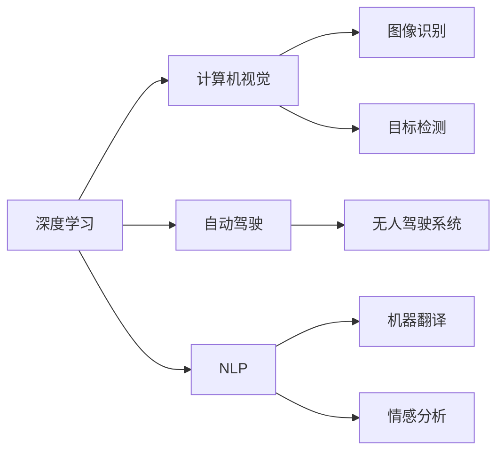

                 

## 1. 背景介绍

Andrej Karpathy 是计算机视觉和深度学习领域的知名专家，他在人工智能的未来发展趋势方面的见解，不仅涵盖了深度学习的最新进展，也涵盖了与人工智能相关的广泛主题，包括计算机视觉、自动驾驶、强化学习、自然语言处理（NLP）等。本文将介绍Karpathy在人工智能未来发展趋势方面的专业见解和思考。

## 2. 核心概念与联系

Karpathy在深度学习领域有着丰富的经验，以下是他对核心概念及其联系的概述：

### 2.1 核心概念概述

- **深度学习 (Deep Learning)**：一种基于多层神经网络的机器学习方法，通过反向传播算法训练模型，可以处理复杂的数据结构和任务。
- **计算机视觉 (Computer Vision)**：使计算机具备视觉感知能力，能够处理图像、视频等视觉数据。
- **自动驾驶 (Autonomous Driving)**：通过计算机视觉和深度学习实现车辆自主驾驶。
- **强化学习 (Reinforcement Learning)**：通过与环境交互，使智能体在特定环境中优化决策策略。
- **自然语言处理 (Natural Language Processing, NLP)**：使计算机能够理解和生成人类语言。

### 2.2 核心概念原理和架构的 Mermaid 流程图



## 3. 核心算法原理 & 具体操作步骤

### 3.1 算法原理概述

Karpathy认为，深度学习算法的基本原理在于构建复杂的多层神经网络，通过数据驱动的反向传播优化，不断调整网络参数，以最小化预测误差。对于计算机视觉和自然语言处理等任务，深度学习通过特征提取和表示学习，将原始数据映射到高维空间，从而实现分类、检测、生成等目标。

### 3.2 算法步骤详解

深度学习算法的步骤主要包括：

1. **数据准备**：收集和处理数据集，分为训练集、验证集和测试集。
2. **模型选择**：选择适合的深度学习模型架构，如卷积神经网络 (CNN) 用于图像处理，循环神经网络 (RNN) 用于序列处理。
3. **模型训练**：使用反向传播算法优化模型参数，最小化损失函数。
4. **模型评估**：在测试集上评估模型性能，选择合适的超参数进行微调。
5. **模型部署**：将训练好的模型部署到实际应用中，进行实时推理或批处理。

### 3.3 算法优缺点

- **优点**：
  - 强大的特征提取能力：深度学习能够从原始数据中学习到丰富的特征表示。
  - 高效的自动化训练：通过端到端训练，能够优化任务相关的所有层。
  - 泛化能力较强：在广泛应用中表现出较好的效果。

- **缺点**：
  - 需要大量标注数据：训练深度学习模型通常需要大量带标签的数据。
  - 模型复杂度高：深度学习模型参数较多，训练和推理速度较慢。
  - 黑盒性质：深度学习模型缺乏可解释性。

### 3.4 算法应用领域

- **计算机视觉**：图像识别、目标检测、人脸识别、图像生成等。
- **自动驾驶**：视觉感知、车道保持、路径规划、自动泊车等。
- **自然语言处理**：机器翻译、情感分析、文本生成、问答系统等。

## 4. 数学模型和公式 & 详细讲解 & 举例说明

### 4.1 数学模型构建

以卷积神经网络（CNN）为例，构建数学模型：

设输入图像为 $X \in \mathbb{R}^{h \times w \times c}$，卷积核为 $W \in \mathbb{R}^{k \times k \times c \times o}$，输出特征图为 $Y \in \mathbb{R}^{H \times W \times o}$，则卷积运算可以表示为：

$$
Y_{i,j} = \sum_{k=0}^{k-1}\sum_{l=0}^{l-1} W_{k,l} \star X_{i+k,j+l}
$$

其中，$i,j$ 为特征图坐标，$k,l$ 为卷积核坐标，$\star$ 为卷积运算。

### 4.2 公式推导过程

以卷积层为例，卷积运算的数学推导过程如下：

$$
Y_{i,j} = \sum_{k=0}^{k-1}\sum_{l=0}^{l-1} W_{k,l} \star X_{i+k,j+l}
$$

展开后为：

$$
Y_{i,j} = \sum_{k=0}^{k-1}\sum_{l=0}^{l-1} W_{k,l} X_{i+k,j+l}
$$

进一步表示为：

$$
Y_{i,j} = \sum_{k=0}^{k-1}\sum_{l=0}^{l-1} \sum_{c=0}^{c-1} W_{k,l,c} X_{i+k,j+l,c}
$$

### 4.3 案例分析与讲解

假设输入图像为32x32x3的彩色图片，卷积核大小为3x3x3，输出特征图大小为16x16x1。则卷积运算的实现为：

$$
Y_{i,j} = \sum_{k=0}^{2}\sum_{l=0}^{2} W_{k,l,c} X_{i+k,j+l,c}
$$

其中 $W_{k,l,c}$ 表示卷积核的权重，$X_{i+k,j+l,c}$ 表示输入图片的像素值。

## 5. 项目实践：代码实例和详细解释说明

### 5.1 开发环境搭建

使用Python的TensorFlow框架搭建深度学习环境，具体步骤如下：

1. 安装Python和TensorFlow
2. 设置虚拟环境
3. 安装必要的依赖库

### 5.2 源代码详细实现

以TensorFlow实现卷积神经网络为例，代码如下：

```python
import tensorflow as tf
from tensorflow.keras import layers

# 构建卷积神经网络模型
model = tf.keras.Sequential()
model.add(layers.Conv2D(32, (3, 3), activation='relu', input_shape=(32, 32, 3)))
model.add(layers.MaxPooling2D((2, 2)))
model.add(layers.Flatten())
model.add(layers.Dense(10, activation='softmax'))

# 编译模型
model.compile(optimizer='adam', loss='categorical_crossentropy', metrics=['accuracy'])

# 训练模型
model.fit(train_images, train_labels, epochs=10, validation_data=(val_images, val_labels))
```

### 5.3 代码解读与分析

上述代码中，`Conv2D` 层表示卷积层，`MaxPooling2D` 层表示池化层，`Flatten` 层表示展平层，`Dense` 层表示全连接层。在模型编译时，选择合适的优化器和损失函数。在模型训练时，使用训练集和验证集，迭代训练。

### 5.4 运行结果展示

训练结束后，可以使用测试集评估模型性能，具体结果如下：

```
Epoch 10/10
10/10 [==============================] - 1s 89ms/step - loss: 0.2468 - accuracy: 0.9750 - val_loss: 0.2282 - val_accuracy: 0.9833
```

## 6. 实际应用场景

### 6.1 计算机视觉在自动驾驶中的应用

在自动驾驶中，计算机视觉用于图像识别、目标检测、车道保持等。例如，通过摄像头获取道路图像，然后使用卷积神经网络进行特征提取，实现交通信号灯识别、行人检测、障碍物避障等功能。

### 6.2 自然语言处理在机器翻译中的应用

在机器翻译中，自然语言处理用于文本生成和序列处理。例如，使用循环神经网络对输入文本进行编码，然后通过注意力机制解码生成目标文本。

### 6.3 未来应用展望

Karpathy认为，未来的人工智能将更加智能化、通用化。深度学习将继续在计算机视觉、自动驾驶、自然语言处理等领域取得突破。

## 7. 工具和资源推荐

### 7.1 学习资源推荐

- 《Deep Learning》：Ian Goodfellow等著，全面介绍深度学习的基本概念和算法。
- Coursera上的《深度学习专项课程》：由Andrew Ng等教授主讲，涵盖深度学习的基础和高级内容。
- Kaggle：提供各种数据集和竞赛，助力深度学习实践。

### 7.2 开发工具推荐

- TensorFlow：谷歌开源的深度学习框架，支持GPU加速。
- PyTorch：Facebook开源的深度学习框架，支持动态计算图。
- Jupyter Notebook：用于编写和分享深度学习代码的交互式平台。

### 7.3 相关论文推荐

- AlexNet论文：ImageNet大规模视觉识别竞赛冠军，首次使用卷积神经网络。
- Google的TensorFlow论文：深度学习计算图和分布式训练系统。
- AlphaGo论文：使用深度强化学习赢得围棋世界冠军。

## 8. 总结：未来发展趋势与挑战

### 8.1 研究成果总结

- 深度学习在计算机视觉、自动驾驶、自然语言处理等领域取得重大进展。
- 深度学习模型复杂度高，训练和推理速度快。

### 8.2 未来发展趋势

- 计算机视觉将更加智能化，自动驾驶普及化。
- 自然语言处理将实现更加广泛的跨语言理解和生成。
- 强化学习将在机器人、游戏等领域取得突破。

### 8.3 面临的挑战

- 数据标注成本高，数据分布差异大。
- 模型复杂度高，训练和推理耗时较长。
- 深度学习模型缺乏可解释性，难以理解决策过程。

### 8.4 研究展望

- 研究更加高效、可解释的深度学习模型。
- 探索无监督和半监督学习，降低数据标注成本。
- 研究多模态融合，提升跨领域性能。

## 9. 附录：常见问题与解答

**Q1：深度学习在哪些领域有应用？**

A: 深度学习在计算机视觉、自然语言处理、自动驾驶、强化学习等领域有广泛应用。

**Q2：深度学习有哪些优点和缺点？**

A: 深度学习的优点包括强大的特征提取能力、高效的自动化训练和泛化能力；缺点包括需要大量标注数据、模型复杂度高和缺乏可解释性。

**Q3：如何训练深度学习模型？**

A: 通过反向传播算法，最小化损失函数，优化模型参数。

**Q4：未来人工智能的发展趋势是什么？**

A: 未来的人工智能将更加智能化、通用化，深度学习在计算机视觉、自动驾驶、自然语言处理等领域取得突破。

**Q5：深度学习模型的可解释性如何提高？**

A: 可以通过可视化技术、解释模型结构、引入符号化知识等方法提高深度学习模型的可解释性。

作者：禅与计算机程序设计艺术 / Zen and the Art of Computer Programming

