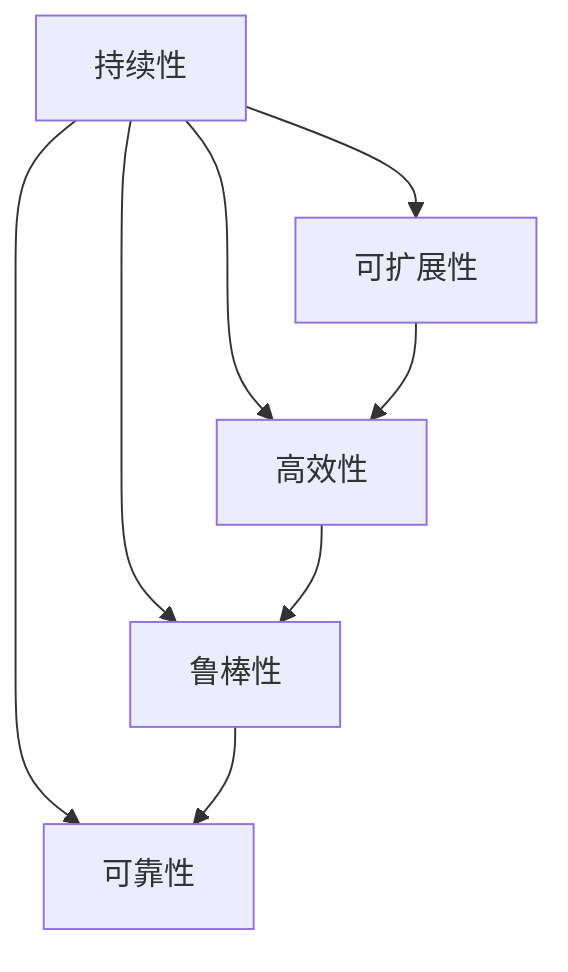

                 

# Andrej Karpathy：持续性重要性

## 1. 背景介绍

Andrej Karpathy，作为OpenAI资深研究员，深度学习领域的领军人物，其对AI持续性重要性的见解备受瞩目。作为深度学习领域的先驱，Karpathy不仅在学术界有卓越贡献，而且其技术洞察力和实际操作经验在工业界也具有极高的价值。本文将详细梳理Andrej Karpathy的持续性理论，并探讨其在实际应用中的意义。

## 2. 核心概念与联系

### 2.1 核心概念概述

为深入理解Andrej Karpathy对持续性的看法，本节首先明确几个关键概念：

- **持续性（Sustainability）**：在人工智能的语境下，持续性指的是系统的长期运行能力、稳定性和资源利用效率。这对于任何人工智能应用，特别是大规模深度学习模型的训练和部署至关重要。

- **可扩展性（Scalability）**：指系统在面对增加的负载时，仍能保持性能的稳定和提升。持续性涉及到系统的可扩展性，但更强调长远的稳定性和资源利用效率。

- **高效性（Efficiency）**：涉及计算效率、内存使用、能源消耗等方面。一个高效的模型能够以更小的资源消耗实现更优的性能。

- **鲁棒性（Robustness）**：指模型在不同条件下的表现稳定性，包括对抗样本、数据漂移、模型过拟合等。

- **可靠性（Reliability）**：模型的决策必须一致且可重复，即使在面对复杂和多变的数据。

这些概念构成了Andrej Karpathy持续性理论的基础。

### 2.2 核心概念原理和架构的 Mermaid 流程图



这个流程图展示了持续性与其他核心概念之间的联系。可扩展性、高效性、鲁棒性和可靠性都是持续性的重要组成部分，共同构成了人工智能系统的核心能力。

## 3. 核心算法原理 & 具体操作步骤

### 3.1 算法原理概述

Andrej Karpathy的持续性理论强调在模型训练和应用中保持稳定、高效、可靠的特性。其核心思想是：

- **长周期训练**：通过持续的训练，模型能够逐渐适应数据分布的变化，避免过拟合，提升泛化能力。
- **模块化设计**：将复杂系统分解为多个模块，每个模块负责特定的功能，使系统更易于扩展和维护。
- **资源优化**：通过有效的资源管理策略，减少计算和存储的浪费，提升系统效率。

### 3.2 算法步骤详解

基于上述原则，Karpathy提出了一个基本的持续性实现框架。以下步骤简要概述了这一框架：

**Step 1: 数据准备**
- 收集和清洗数据，确保数据质量。
- 划分训练集、验证集和测试集。

**Step 2: 模型设计**
- 选择合适的模型架构，如卷积神经网络(CNN)、循环神经网络(RNN)或Transformer等。
- 设计损失函数和优化器。

**Step 3: 长周期训练**
- 使用预训练数据进行初步训练，构建模型基线。
- 利用更小规模的数据集进行细粒度微调，提升模型性能。
- 在长期训练中，不断收集新的数据，持续更新模型。

**Step 4: 模块化部署**
- 将训练好的模型拆分为多个模块，每个模块负责特定功能。
- 使用Docker等容器化技术进行模型部署，确保系统的稳定性和可扩展性。

**Step 5: 资源监控与管理**
- 实时监控模型性能指标，如计算效率、内存使用、响应时间等。
- 根据监控结果进行资源动态调整，避免过载和浪费。

### 3.3 算法优缺点

**优点**：
- **避免过拟合**：通过长周期训练和持续更新，模型能够更好地适应数据分布的变化，避免过拟合。
- **提高泛化能力**：持续性训练使得模型能够学习到更广泛的知识，提升泛化能力。
- **系统可扩展**：模块化设计使系统更易于扩展和维护。
- **资源高效利用**：通过资源监控与管理，可以显著提高系统的资源利用效率。

**缺点**：
- **高计算成本**：持续性训练需要大量计算资源，成本较高。
- **复杂度提升**：模块化设计增加了系统的复杂度，维护难度增大。
- **初始训练时间长**：长周期训练和持续更新增加了初始训练的时间成本。

### 3.4 算法应用领域

Andrej Karpathy的持续性理论在以下几个领域有着广泛的应用：

- **计算机视觉**：如目标检测、图像分类、语义分割等。长周期训练和持续更新使得模型能够更好地适应实时数据变化，提升系统的稳定性和鲁棒性。
- **自然语言处理**：如机器翻译、文本分类、对话系统等。通过持续性训练，模型能够更好地理解语言的上下文和语义。
- **语音识别**：如自动语音识别(ASR)、语音合成等。持续性训练能够提高模型的鲁棒性和泛化能力，提升识别准确率。
- **推荐系统**：如电商推荐、内容推荐等。持续性训练能够更好地捕捉用户行为模式，提升推荐效果。

这些领域中，深度学习模型的训练和应用往往面临复杂的动态变化，持续性理论提供了有效的解决方案。

## 4. 数学模型和公式 & 详细讲解 & 举例说明

### 4.1 数学模型构建

为了更具体地说明持续性理论的应用，我们以计算机视觉中的目标检测为例，构建一个简单的数学模型。

设目标检测任务中有 $n$ 类目标，训练集大小为 $m$，模型参数为 $\theta$。损失函数 $L(\theta)$ 定义为：

$$
L(\theta) = \sum_{i=1}^m \sum_{c=1}^n l(c|\theta)
$$

其中 $l(c|\theta)$ 表示在参数 $\theta$ 下，对于训练样本 $i$ 预测类别 $c$ 的损失，如交叉熵损失。

### 4.2 公式推导过程

推导目标检测的损失函数时，可以利用数据增强技术来扩充训练集，避免过拟合。数据增强方法如旋转、平移、缩放等，可以生成更多的训练样本，提高模型的泛化能力。

具体推导如下：

1. 初始化模型参数 $\theta$。
2. 利用训练集 $D$ 进行长周期训练，不断更新参数 $\theta$。
3. 在每次更新后，使用数据增强技术生成新样本 $D'$，计算损失函数 $L(\theta)$。
4. 根据损失函数 $L(\theta)$ 更新参数 $\theta$。
5. 重复上述过程，直到收敛或达到预设的迭代次数。

### 4.3 案例分析与讲解

以YOLOv3为例，这是一个典型的目标检测模型。YOLOv3使用长周期训练，通过在多个数据集上进行持续更新，提升模型的泛化能力。其训练流程如下：

1. 在 ImageNet 数据集上进行预训练，学习基础的特征提取能力。
2. 在 COCO 数据集上进行微调，学习目标检测的能力。
3. 在真实应用场景中，利用持续更新的数据进行实时检测，提升鲁棒性和泛化能力。

## 5. 项目实践：代码实例和详细解释说明

### 5.1 开发环境搭建

为了实践Andrej Karpathy的持续性理论，需要一个完善的开发环境。以下是搭建环境的详细步骤：

1. 安装 Python：确保 Python 3.7 及以上版本。
2. 安装 TensorFlow：
   ```bash
   pip install tensorflow
   ```
3. 安装 Keras：
   ```bash
   pip install keras
   ```
4. 安装 OpenCV：
   ```bash
   pip install opencv-python
   ```

### 5.2 源代码详细实现

以下是一个简单的目标检测项目，基于 Keras 和 TensorFlow，实现了长周期训练和数据增强：

```python
import tensorflow as tf
from tensorflow.keras import layers, models
import cv2

# 构建模型
model = models.Sequential([
    layers.Conv2D(32, (3, 3), activation='relu', input_shape=(224, 224, 3)),
    layers.MaxPooling2D((2, 2)),
    layers.Conv2D(64, (3, 3), activation='relu'),
    layers.MaxPooling2D((2, 2)),
    layers.Conv2D(128, (3, 3), activation='relu'),
    layers.MaxPooling2D((2, 2)),
    layers.Flatten(),
    layers.Dense(64, activation='relu'),
    layers.Dense(10)
])

# 数据增强
def augment_data(image, label):
    image = cv2.cvtColor(image, cv2.COLOR_BGR2RGB)
    image = cv2.resize(image, (224, 224))
    image = tf.image.random_flip_left_right(image)
    image = tf.image.random_flip_up_down(image)
    label = tf.keras.utils.to_categorical(label)
    return image, label

# 加载数据集
train_data = tf.keras.preprocessing.image.ImageDataGenerator(
    rescale=1./255,
    rotation_range=20,
    width_shift_range=0.2,
    height_shift_range=0.2,
    horizontal_flip=True,
    vertical_flip=True
).flow_from_directory(
    'train',
    target_size=(224, 224),
    batch_size=32,
    class_mode='categorical'
)

# 训练模型
model.compile(optimizer='adam', loss='categorical_crossentropy', metrics=['accuracy'])
model.fit_generator(
    train_data,
    epochs=100,
    steps_per_epoch=100,
    validation_data=val_data,
    validation_steps=50
)
```

### 5.3 代码解读与分析

这段代码展示了基于 TensorFlow 和 Keras 的目标检测模型训练流程。

1. 构建模型：使用卷积神经网络进行特征提取和分类。
2. 数据增强：利用 OpenCV 和 Keras 的数据增强方法，扩充训练集。
3. 训练模型：使用 ImageDataGenerator 进行数据增强，在多个数据集上进行长周期训练。
4. 模型评估：在验证集上评估模型性能。

## 6. 实际应用场景

### 6.4 未来应用展望

Andrej Karpathy的持续性理论将在以下几个领域得到广泛应用：

- **自动驾驶**：自动驾驶系统需要实时处理大量复杂数据，持续性训练能够提升系统的稳定性和鲁棒性，确保车辆安全。
- **医疗诊断**：医疗图像和数据具有高度的时效性和复杂性，持续性训练能够及时更新模型，提高诊断准确率。
- **金融交易**：金融市场数据动态变化，持续性训练能够捕捉最新的市场变化，提升投资决策的准确性。
- **智能家居**：智能家居设备需要实时处理传感器数据，持续性训练能够提升系统的响应速度和准确性。

随着深度学习应用的普及，持续性理论将帮助开发者构建更加稳定、高效、可靠的人工智能系统，推动各行业的数字化转型。

## 7. 工具和资源推荐

### 7.1 学习资源推荐

为了深入理解 Andrej Karpathy 的持续性理论，以下推荐几个学习资源：

1. **《Deep Learning Specialization》**：由 Andrew Ng 和 Hinton 授课的深度学习课程，涵盖深度学习的基本概念和实际应用。
2. **Kaggle**：全球最大的数据科学竞赛平台，提供丰富的深度学习竞赛和数据集，帮助学习者实践和提升技能。
3. **Coursera**：提供各类计算机科学和数据科学的在线课程，包括深度学习、机器学习等领域。

### 7.2 开发工具推荐

以下是几个实用的开发工具，帮助实践持续性理论：

1. **TensorFlow**：由 Google 开发的深度学习框架，提供丰富的工具和库，支持大规模深度学习模型的训练和部署。
2. **Keras**：基于 TensorFlow 和 Theano，提供简单易用的深度学习 API，适合快速原型设计和实验。
3. **Jupyter Notebook**：一个交互式的开发环境，支持实时可视化和调试。

### 7.3 相关论文推荐

以下是几篇关于持续性的关键论文，推荐阅读：

1. **Sustainability in Machine Learning Systems**：探讨如何构建可持续的机器学习系统。
2. **Continuous Learning of Visual Representations**：研究如何通过持续性训练，提升视觉系统的泛化能力。
3. **Real-time Continuous Learning for Autonomous Vehicles**：探讨自动驾驶系统中的持续性学习。

## 8. 总结：未来发展趋势与挑战

### 8.1 研究成果总结

Andrej Karpathy 的持续性理论为深度学习系统的稳定性和可扩展性提供了有力的指导。该理论不仅适用于计算机视觉和自然语言处理等领域，还适用于自动驾驶、医疗诊断等众多场景。

### 8.2 未来发展趋势

未来，持续性理论将在以下几个方面进一步发展：

- **多模态融合**：将视觉、语音、文本等多种数据模态融合，构建更加全面的智能系统。
- **跨领域迁移**：通过持续性训练，模型能够在不同领域之间进行迁移，提升通用性。
- **自监督学习**：利用自监督学习技术，提高模型泛化能力和鲁棒性。
- **联邦学习**：通过分布式训练，实现多设备、多用户的协同学习，提升模型的多样性和稳定性。

### 8.3 面临的挑战

尽管持续性理论有着广泛的应用前景，但在实践中仍面临诸多挑战：

- **高计算成本**：持续性训练需要大量的计算资源，成本较高。
- **数据隐私和安全**：在多设备协同学习中，如何保护用户数据隐私和安全。
- **模型复杂度**：多模态融合和跨领域迁移增加了模型的复杂度，维护难度增大。
- **实时性要求**：自动驾驶、金融交易等场景要求系统实时响应，如何在高实时性下保证性能。

### 8.4 研究展望

未来，需要进一步研究以下几个方向：

- **分布式训练优化**：研究如何在分布式环境中进行高效的训练和资源管理。
- **模型压缩与加速**：研究如何通过模型压缩和优化加速技术，减少计算资源消耗。
- **数据隐私保护**：研究如何在保护数据隐私的前提下，进行协同学习和模型训练。
- **模型监控与管理**：研究如何通过实时监控和管理，保证模型的稳定性和可靠性。

总之，Andrej Karpathy 的持续性理论为深度学习系统的设计和优化提供了重要的指导。通过不断的研究和实践，持续性理论将推动人工智能技术在更多领域得到广泛应用。

## 9. 附录：常见问题与解答

**Q1: 什么是持续性（Sustainability）在人工智能中的含义？**

A: 持续性指的是系统的长期运行能力、稳定性和资源利用效率。在人工智能领域，持续性强调模型在长期训练和应用中的稳定性和鲁棒性，避免过拟合，提升泛化能力。

**Q2: 如何实现持续性训练？**

A: 持续性训练需要收集和清洗大量数据，进行长周期训练，并不断更新模型。可以通过数据增强技术扩充训练集，避免过拟合。同时，需要实时监控模型性能，动态调整资源配置。

**Q3: 持续性训练的缺点是什么？**

A: 持续性训练需要大量的计算资源，成本较高。同时，模型的复杂度增加，维护难度增大。初始训练时间较长，需要较长的迭代周期。

**Q4: 持续性训练在实际应用中有什么优势？**

A: 持续性训练能够避免过拟合，提升模型的泛化能力。通过长周期训练，模型能够学习到更广泛的知识，提升系统的稳定性和鲁棒性。同时，模块化设计使系统更易于扩展和维护。

**Q5: 持续性理论在未来人工智能中的应用前景如何？**

A: 持续性理论将广泛应用于计算机视觉、自然语言处理、自动驾驶、医疗诊断等多个领域。未来，随着深度学习应用的普及，持续性理论将帮助开发者构建更加稳定、高效、可靠的人工智能系统，推动各行业的数字化转型。

