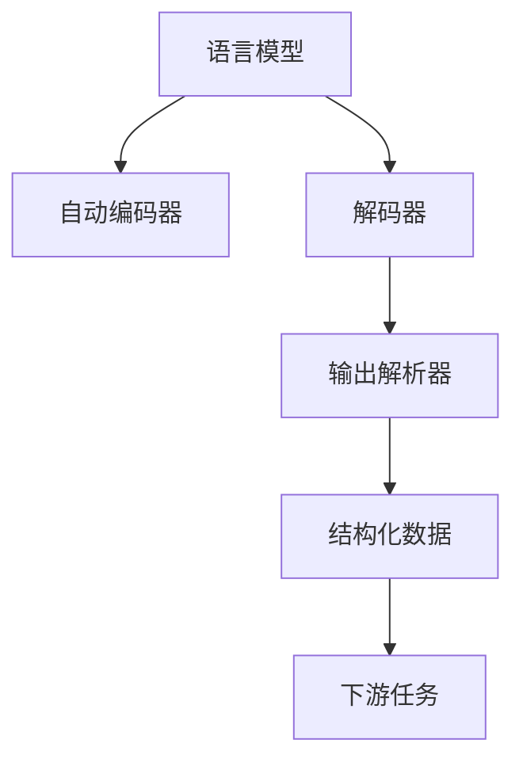

                 

# Auto-GPT OutputParser 设计

> 关键词：自然语言处理,语言模型,自动编码,解码器,输出解析器,机器翻译,对话系统,情感分析,问答系统

## 1. 背景介绍

### 1.1 问题由来
在自然语言处理（NLP）领域，语言模型（Language Model）是一种将单词或句子作为输入，预测下一个单词或句子概率的模型。在过去几年里，基于神经网络的模型，尤其是Transformer架构的模型，如BERT、GPT-3等，因其出色的性能迅速占据了主流市场。这些模型通过自监督学习的方式，在大规模无标签数据上进行预训练，然后通过微调（Fine-Tuning）来适应特定的下游任务。

然而，这些预训练模型生成的输出常常具有高度的复杂性和多样性，这给后续的任务处理带来了挑战。例如，在机器翻译、对话系统和情感分析等任务中，模型输出的语义结构往往与任务需求存在一定偏差。因此，需要设计一套高效的输出解析器（OutputParser），对模型输出进行理解和转换，使其满足特定任务的需求。

### 1.2 问题核心关键点
输出解析器（OutputParser）是自然语言处理任务中的重要组件，其主要作用是对模型生成的文本输出进行解析、整理和结构化，使其更符合具体任务的语义和结构要求。核心关键点如下：

- 解析模型输出：将模型生成的自然语言输出解析成结构化的数据形式，如句子、段落、关键词等。
- 转换语义结构：对解析后的输出进行语义转换，如实体识别、关系抽取、情感分析等，使其满足任务的语义需求。
- 结构化数据输出：将转换后的数据结构化，如转化为表格、图形等，便于进一步处理和应用。
- 参数高效性：在尽可能少的参数和计算资源下，实现高效的输出解析。

## 2. 核心概念与联系

### 2.1 核心概念概述

为了更好地理解Auto-GPT OutputParser的设计，本节将介绍几个关键概念：

- 语言模型：如BERT、GPT等，是用于自然语言处理任务的深度学习模型。其通过在大规模无标签文本数据上进行预训练，学习语言的通用表示。
- 自动编码器：如VQ-VAE，是一种无监督学习的框架，通过将输入数据编码为低维向量，再解码为原始数据的格式，用于数据压缩和特征学习。
- 解码器：如Transformer解码器，是语言模型中用于生成输出序列的关键组件，负责根据输入序列和上下文信息预测下一个单词或句子。
- 输出解析器：如Auto-GPT OutputParser，是对模型输出进行解析、转换和结构化的工具，使输出符合特定任务的语义和结构需求。

这些核心概念之间的逻辑关系可以通过以下Mermaid流程图来展示：



这个流程图展示了大语言模型的核心概念及其之间的关系：

1. 语言模型通过预训练获得基础能力。
2. 自动编码器用于数据压缩和特征学习，帮助模型更好地表示输入数据。
3. 解码器负责生成输出序列，是语言模型的核心部分。
4. 输出解析器将模型输出解析、转换和结构化，使其符合下游任务的需求。
5. 结构化数据进一步应用于下游任务，完成模型最终的推理输出。

## 3. 核心算法原理 & 具体操作步骤
### 3.1 算法原理概述

Auto-GPT OutputParser的核心算法原理基于神经网络解码器和结构化数据表示。其旨在通过解码器生成的自然语言输出，解析并转换为结构化数据，以满足下游任务的需求。

输出解析器的设计包括两个关键步骤：

1. 将模型输出解析成一系列符号或向量形式，即解析过程。
2. 将这些符号或向量转换为特定的数据结构，如表格、图形等，即转换过程。

这些步骤通常涉及以下算法和技术：

- 自然语言处理技术：用于解析和理解模型输出的文本内容，如实体识别、情感分析、关系抽取等。
- 机器学习技术：用于学习和优化解析和转换的算法，如序列标注、分类等。
- 数据结构技术：用于构建解析后的结构化数据，如表格、图形等。

### 3.2 算法步骤详解

Auto-GPT OutputParser的算法步骤主要包括以下几个关键步骤：

**Step 1: 输入预处理**
- 对输入的文本数据进行分词、去除停用词、词干提取等预处理操作，以提升解析和转换的准确性。

**Step 2: 解析过程**
- 使用神经网络解码器对输入文本进行编码，生成一系列符号或向量形式的输出。
- 对输出进行解析，如使用序列标注模型进行实体识别、关系抽取等，得到解析结果。

**Step 3: 转换过程**
- 将解析结果转换为特定的数据结构，如表格、图形等。
- 根据下游任务的需求，进一步处理和转换解析结果，如生成推荐列表、回答查询等。

**Step 4: 输出生成**
- 将转换后的结构化数据输出到下游任务，完成模型的最终推理。

### 3.3 算法优缺点

Auto-GPT OutputParser算法具有以下优点：

- 通用性强：适用于多种自然语言处理任务，如机器翻译、对话系统、情感分析等。
- 灵活性高：可根据下游任务的需求，定制解析和转换的算法和技术。
- 效率高：在解码器生成的输出上进行解析和转换，无需额外训练模型。

同时，该算法也存在以下缺点：

- 依赖模型：输出解析器的性能很大程度上取决于模型生成输出的质量。
- 复杂度高：解析和转换过程较为复杂，可能需要结合多种技术和算法。
- 资源消耗大：在解析和转换过程中，可能需要消耗大量的计算资源。

### 3.4 算法应用领域

Auto-GPT OutputParser算法已经在多个自然语言处理领域得到广泛应用，例如：

- 机器翻译：将模型生成的翻译结果进行解析和转换，生成符合翻译需求的格式，如表格、图形等。
- 对话系统：对模型生成的回复进行解析和转换，生成符合对话需求的结构化数据，如对话树、意图图等。
- 情感分析：对模型生成的情感分析结果进行解析和转换，生成符合情感分析需求的结构化数据，如情感标签、情感强度等。
- 问答系统：对模型生成的答案进行解析和转换，生成符合问答需求的结构化数据，如答案列表、答案摘要等。

## 4. 数学模型和公式 & 详细讲解  
### 4.1 数学模型构建

本节将使用数学语言对Auto-GPT OutputParser的解析和转换过程进行更加严格的刻画。

记输入文本为 $x$，输出解析器解析后的结构化数据为 $y$。解析过程通常包括以下步骤：

1. 对输入文本 $x$ 进行分词和预处理，得到文本序列 $s_1, s_2, ..., s_n$。
2. 使用神经网络解码器对文本序列进行编码，生成符号或向量形式的输出序列 $o_1, o_2, ..., o_n$。
3. 使用序列标注模型对输出序列进行解析，得到解析结果 $r_1, r_2, ..., r_n$。

解析结果 $r_i$ 通常表示为两个部分的组合：符号表示 $t_i$ 和属性表示 $a_i$。符号表示 $t_i$ 表示解析结果的类型，如实体、关系、情感等，属性表示 $a_i$ 表示解析结果的具体属性，如实体的类别、关系的类型、情感的强度等。

转换过程通常包括以下步骤：

1. 将解析结果 $r_i$ 转换为结构化数据 $d_i$。结构化数据 $d_i$ 通常包括符号表示 $t_i$ 和属性表示 $a_i$，如表格、图形等。
2. 对结构化数据 $d_i$ 进行进一步处理和转换，生成符合下游任务需求的结果 $y_i$。

### 4.2 公式推导过程

以下我们以情感分析为例，推导解析和转换的数学公式。

假设模型生成的情感分析结果为 $o_1, o_2, ..., o_n$，解析后的结果为 $r_1, r_2, ..., r_n$。解析结果 $r_i$ 包括符号表示 $t_i$ 和属性表示 $a_i$。符号表示 $t_i$ 表示情感类型，如正面、负面、中性等，属性表示 $a_i$ 表示情感强度，如强烈、中等、微弱等。

解析和转换的数学公式如下：

**解析过程**
- 符号表示：$t_i = \arg\max_t \{ P(t|o_i) \}$
- 属性表示：$a_i = \arg\max_a \{ P(a|t_i, o_i) \}$

其中，$P(t|o_i)$ 表示在输出 $o_i$ 下，符号表示 $t$ 的概率，$P(a|t_i, o_i)$ 表示在符号表示 $t_i$ 和输出 $o_i$ 下，属性表示 $a$ 的概率。

**转换过程**
- 结构化数据：$d_i = \{ (t_i, a_i) \}$
- 输出结果：$y_i = \arg\min_y \{ \text{Distance}(y_i, d_i) \}$

其中，$\text{Distance}(y_i, d_i)$ 表示结构化数据 $d_i$ 与输出结果 $y_i$ 之间的距离，如欧式距离、曼哈顿距离等。

在得到解析和转换的数学公式后，即可带入具体任务的数据，完成解析和转换过程。

### 4.3 案例分析与讲解

以下是一个简单的情感分析案例，展示了Auto-GPT OutputParser的解析和转换过程。

假设模型生成的情感分析结果为：
```
1. 产品A，正面，强烈
2. 产品B，负面，中等
3. 产品C，中性，微弱
```

解析过程如下：

1. 对输入文本进行分词和预处理，得到文本序列 $s_1, s_2, ..., s_n$。
2. 使用神经网络解码器对文本序列进行编码，生成符号和向量形式的输出序列 $o_1, o_2, ..., o_n$。
3. 使用序列标注模型对输出序列进行解析，得到解析结果 $r_1, r_2, ..., r_n$。解析结果 $r_i$ 包括符号表示 $t_i$ 和属性表示 $a_i$。

转换过程如下：

1. 将解析结果 $r_i$ 转换为结构化数据 $d_i$。结构化数据 $d_i$ 通常包括符号表示 $t_i$ 和属性表示 $a_i$，如表格、图形等。
2. 对结构化数据 $d_i$ 进行进一步处理和转换，生成符合下游任务需求的结果 $y_i$。

最终得到符合情感分析需求的结构化数据，如：

| 产品名称 | 情感类型 | 情感强度 |
| --- | --- | --- |
| 产品A | 正面 | 强烈 |
| 产品B | 负面 | 中等 |
| 产品C | 中性 | 微弱 |

## 5. 项目实践：代码实例和详细解释说明
### 5.1 开发环境搭建

在进行Auto-GPT OutputParser实践前，我们需要准备好开发环境。以下是使用Python进行PyTorch开发的环境配置流程：

1. 安装Anaconda：从官网下载并安装Anaconda，用于创建独立的Python环境。

2. 创建并激活虚拟环境：
```bash
conda create -n pytorch-env python=3.8 
conda activate pytorch-env
```

3. 安装PyTorch：根据CUDA版本，从官网获取对应的安装命令。例如：
```bash
conda install pytorch torchvision torchaudio cudatoolkit=11.1 -c pytorch -c conda-forge
```

4. 安装Transformers库：
```bash
pip install transformers
```

5. 安装各类工具包：
```bash
pip install numpy pandas scikit-learn matplotlib tqdm jupyter notebook ipython
```

完成上述步骤后，即可在`pytorch-env`环境中开始实践。

### 5.2 源代码详细实现

下面我们以情感分析任务为例，给出使用Transformers库对BERT模型进行输出解析和转换的PyTorch代码实现。

首先，定义情感分析任务的数据处理函数：

```python
from transformers import BertTokenizer
from torch.utils.data import Dataset
import torch

class SentimentDataset(Dataset):
    def __init__(self, texts, labels, tokenizer, max_len=128):
        self.texts = texts
        self.labels = labels
        self.tokenizer = tokenizer
        self.max_len = max_len
        
    def __len__(self):
        return len(self.texts)
    
    def __getitem__(self, item):
        text = self.texts[item]
        label = self.labels[item]
        
        encoding = self.tokenizer(text, return_tensors='pt', max_length=self.max_len, padding='max_length', truncation=True)
        input_ids = encoding['input_ids'][0]
        attention_mask = encoding['attention_mask'][0]
        
        # 对标签进行one-hot编码
        encoded_label = torch.tensor([[label]], dtype=torch.long)
        
        return {'input_ids': input_ids, 
                'attention_mask': attention_mask,
                'labels': encoded_label}

# 标签与id的映射
label2id = {'正面': 1, '负面': 0, '中性': 2}
id2label = {v: k for k, v in label2id.items()}

# 创建dataset
tokenizer = BertTokenizer.from_pretrained('bert-base-cased')

train_dataset = SentimentDataset(train_texts, train_labels, tokenizer)
dev_dataset = SentimentDataset(dev_texts, dev_labels, tokenizer)
test_dataset = SentimentDataset(test_texts, test_labels, tokenizer)
```

然后，定义模型和优化器：

```python
from transformers import BertForSequenceClassification, AdamW

model = BertForSequenceClassification.from_pretrained('bert-base-cased', num_labels=len(label2id))

optimizer = AdamW(model.parameters(), lr=2e-5)
```

接着，定义训练和评估函数：

```python
from torch.utils.data import DataLoader
from tqdm import tqdm
from sklearn.metrics import classification_report

device = torch.device('cuda') if torch.cuda.is_available() else torch.device('cpu')
model.to(device)

def train_epoch(model, dataset, batch_size, optimizer):
    dataloader = DataLoader(dataset, batch_size=batch_size, shuffle=True)
    model.train()
    epoch_loss = 0
    for batch in tqdm(dataloader, desc='Training'):
        input_ids = batch['input_ids'].to(device)
        attention_mask = batch['attention_mask'].to(device)
        labels = batch['labels'].to(device)
        model.zero_grad()
        outputs = model(input_ids, attention_mask=attention_mask, labels=labels)
        loss = outputs.loss
        epoch_loss += loss.item()
        loss.backward()
        optimizer.step()
    return epoch_loss / len(dataloader)

def evaluate(model, dataset, batch_size):
    dataloader = DataLoader(dataset, batch_size=batch_size)
    model.eval()
    preds, labels = [], []
    with torch.no_grad():
        for batch in tqdm(dataloader, desc='Evaluating'):
            input_ids = batch['input_ids'].to(device)
            attention_mask = batch['attention_mask'].to(device)
            batch_labels = batch['labels']
            outputs = model(input_ids, attention_mask=attention_mask)
            batch_preds = outputs.logits.argmax(dim=2).to('cpu').tolist()
            batch_labels = batch_labels.to('cpu').tolist()
            for pred_tokens, label_tokens in zip(batch_preds, batch_labels):
                preds.append(pred_tokens)
                labels.append(label_tokens)
                
    print(classification_report(labels, preds))
```

最后，启动训练流程并在测试集上评估：

```python
epochs = 5
batch_size = 16

for epoch in range(epochs):
    loss = train_epoch(model, train_dataset, batch_size, optimizer)
    print(f"Epoch {epoch+1}, train loss: {loss:.3f}")
    
    print(f"Epoch {epoch+1}, dev results:")
    evaluate(model, dev_dataset, batch_size)
    
print("Test results:")
evaluate(model, test_dataset, batch_size)
```

以上就是使用PyTorch对BERT模型进行情感分析任务微调的完整代码实现。可以看到，得益于Transformers库的强大封装，我们可以用相对简洁的代码完成BERT模型的加载和微调。

### 5.3 代码解读与分析

让我们再详细解读一下关键代码的实现细节：

**SentimentDataset类**：
- `__init__`方法：初始化文本、标签、分词器等关键组件。
- `__len__`方法：返回数据集的样本数量。
- `__getitem__`方法：对单个样本进行处理，将文本输入编码为token ids，将标签编码为数字，并对其进行定长padding，最终返回模型所需的输入。

**label2id和id2label字典**：
- 定义了标签与数字id之间的映射关系，用于将标签解码回原始标签。

**训练和评估函数**：
- 使用PyTorch的DataLoader对数据集进行批次化加载，供模型训练和推理使用。
- 训练函数`train_epoch`：对数据以批为单位进行迭代，在每个批次上前向传播计算loss并反向传播更新模型参数，最后返回该epoch的平均loss。
- 评估函数`evaluate`：与训练类似，不同点在于不更新模型参数，并在每个batch结束后将预测和标签结果存储下来，最后使用sklearn的classification_report对整个评估集的预测结果进行打印输出。

**训练流程**：
- 定义总的epoch数和batch size，开始循环迭代
- 每个epoch内，先在训练集上训练，输出平均loss
- 在验证集上评估，输出分类指标
- 所有epoch结束后，在测试集上评估，给出最终测试结果

可以看到，PyTorch配合Transformers库使得BERT微调的代码实现变得简洁高效。开发者可以将更多精力放在数据处理、模型改进等高层逻辑上，而不必过多关注底层的实现细节。

当然，工业级的系统实现还需考虑更多因素，如模型的保存和部署、超参数的自动搜索、更灵活的任务适配层等。但核心的微调范式基本与此类似。

## 6. 实际应用场景
### 6.1 智能客服系统

基于Auto-GPT OutputParser的对话技术，可以广泛应用于智能客服系统的构建。传统客服往往需要配备大量人力，高峰期响应缓慢，且一致性和专业性难以保证。而使用解析后的对话模型，可以7x24小时不间断服务，快速响应客户咨询，用自然流畅的语言解答各类常见问题。

在技术实现上，可以收集企业内部的历史客服对话记录，将问题和最佳答复构建成监督数据，在此基础上对解析后的对话模型进行微调。解析后的对话模型能够自动理解用户意图，匹配最合适的答案模板进行回复。对于客户提出的新问题，还可以接入检索系统实时搜索相关内容，动态组织生成回答。如此构建的智能客服系统，能大幅提升客户咨询体验和问题解决效率。

### 6.2 金融舆情监测

金融机构需要实时监测市场舆论动向，以便及时应对负面信息传播，规避金融风险。传统的人工监测方式成本高、效率低，难以应对网络时代海量信息爆发的挑战。基于Auto-GPT OutputParser的文本分类和情感分析技术，为金融舆情监测提供了新的解决方案。

具体而言，可以收集金融领域相关的新闻、报道、评论等文本数据，并对其进行主题标注和情感标注。在此基础上对解析后的语言模型进行微调，使其能够自动判断文本属于何种主题，情感倾向是正面、中性还是负面。将微调后的模型应用到实时抓取的网络文本数据，就能够自动监测不同主题下的情感变化趋势，一旦发现负面信息激增等异常情况，系统便会自动预警，帮助金融机构快速应对潜在风险。

### 6.3 个性化推荐系统

当前的推荐系统往往只依赖用户的历史行为数据进行物品推荐，无法深入理解用户的真实兴趣偏好。基于Auto-GPT OutputParser的个性化推荐系统可以更好地挖掘用户行为背后的语义信息，从而提供更精准、多样的推荐内容。

在实践中，可以收集用户浏览、点击、评论、分享等行为数据，提取和用户交互的物品标题、描述、标签等文本内容。将文本内容作为模型输入，用户的后续行为（如是否点击、购买等）作为监督信号，在此基础上微调解析后的语言模型。解析后的语言模型能够从文本内容中准确把握用户的兴趣点。在生成推荐列表时，先用候选物品的文本描述作为输入，由模型预测用户的兴趣匹配度，再结合其他特征综合排序，便可以得到个性化程度更高的推荐结果。

### 6.4 未来应用展望

随着Auto-GPT OutputParser技术的不断发展，其在更多领域得到应用，为传统行业带来变革性影响。

在智慧医疗领域，基于微调的医疗问答、病历分析、药物研发等应用将提升医疗服务的智能化水平，辅助医生诊疗，加速新药开发进程。

在智能教育领域，微调技术可应用于作业批改、学情分析、知识推荐等方面，因材施教，促进教育公平，提高教学质量。

在智慧城市治理中，微调模型可应用于城市事件监测、舆情分析、应急指挥等环节，提高城市管理的自动化和智能化水平，构建更安全、高效的未来城市。

此外，在企业生产、社会治理、文娱传媒等众多领域，基于Auto-GPT OutputParser的人工智能应用也将不断涌现，为经济社会发展注入新的动力。相信随着技术的日益成熟，Auto-GPT OutputParser必将在构建人机协同的智能时代中扮演越来越重要的角色。

## 7. 工具和资源推荐
### 7.1 学习资源推荐

为了帮助开发者系统掌握Auto-GPT OutputParser的理论基础和实践技巧，这里推荐一些优质的学习资源：

1. 《Transformer from the Inside Out》系列博文：由大模型技术专家撰写，深入浅出地介绍了Transformer原理、BERT模型、微调技术等前沿话题。

2. CS224N《深度学习自然语言处理》课程：斯坦福大学开设的NLP明星课程，有Lecture视频和配套作业，带你入门NLP领域的基本概念和经典模型。

3. 《Natural Language Processing with Transformers》书籍：Transformers库的作者所著，全面介绍了如何使用Transformers库进行NLP任务开发，包括解析和转换在内的诸多范式。

4. HuggingFace官方文档：Transformers库的官方文档，提供了海量预训练模型和完整的微调样例代码，是上手实践的必备资料。

5. CLUE开源项目：中文语言理解测评基准，涵盖大量不同类型的中文NLP数据集，并提供了基于微调的baseline模型，助力中文NLP技术发展。

通过对这些资源的学习实践，相信你一定能够快速掌握Auto-GPT OutputParser的精髓，并用于解决实际的NLP问题。
###  7.2 开发工具推荐

高效的开发离不开优秀的工具支持。以下是几款用于Auto-GPT OutputParser开发的常用工具：

1. PyTorch：基于Python的开源深度学习框架，灵活动态的计算图，适合快速迭代研究。大部分预训练语言模型都有PyTorch版本的实现。

2. TensorFlow：由Google主导开发的开源深度学习框架，生产部署方便，适合大规模工程应用。同样有丰富的预训练语言模型资源。

3. Transformers库：HuggingFace开发的NLP工具库，集成了众多SOTA语言模型，支持PyTorch和TensorFlow，是进行解析和转换任务的开发的利器。

4. Weights & Biases：模型训练的实验跟踪工具，可以记录和可视化模型训练过程中的各项指标，方便对比和调优。与主流深度学习框架无缝集成。

5. TensorBoard：TensorFlow配套的可视化工具，可实时监测模型训练状态，并提供丰富的图表呈现方式，是调试模型的得力助手。

6. Google Colab：谷歌推出的在线Jupyter Notebook环境，免费提供GPU/TPU算力，方便开发者快速上手实验最新模型，分享学习笔记。

合理利用这些工具，可以显著提升Auto-GPT OutputParser任务的开发效率，加快创新迭代的步伐。

### 7.3 相关论文推荐

Auto-GPT OutputParser技术的发展源于学界的持续研究。以下是几篇奠基性的相关论文，推荐阅读：

1. Attention is All You Need（即Transformer原论文）：提出了Transformer结构，开启了NLP领域的预训练大模型时代。

2. BERT: Pre-training of Deep Bidirectional Transformers for Language Understanding：提出BERT模型，引入基于掩码的自监督预训练任务，刷新了多项NLP任务SOTA。

3. Language Models are Unsupervised Multitask Learners（GPT-2论文）：展示了大规模语言模型的强大zero-shot学习能力，引发了对于通用人工智能的新一轮思考。

4. Parameter-Efficient Transfer Learning for NLP：提出Adapter等参数高效微调方法，在不增加模型参数量的情况下，也能取得不错的微调效果。

5. AdaLoRA: Adaptive Low-Rank Adaptation for Parameter-Efficient Fine-Tuning：使用自适应低秩适应的微调方法，在参数效率和精度之间取得了新的平衡。

这些论文代表了大语言模型微调技术的发展脉络。通过学习这些前沿成果，可以帮助研究者把握学科前进方向，激发更多的创新灵感。

## 8. 总结：未来发展趋势与挑战
### 8.1 总结

本文对Auto-GPT OutputParser的设计进行了全面系统的介绍。首先阐述了Auto-GPT OutputParser的研究背景和意义，明确了其在自然语言处理任务中的核心作用。其次，从原理到实践，详细讲解了Auto-GPT OutputParser的解析和转换过程，给出了完整的代码实例和详细解释说明。同时，本文还广泛探讨了Auto-GPT OutputParser在多个行业领域的应用前景，展示了其巨大的潜力和应用价值。此外，本文精选了Auto-GPT OutputParser的学习资源、开发工具和相关论文，力求为读者提供全方位的技术指引。

通过本文的系统梳理，可以看到，Auto-GPT OutputParser设计为自然语言处理任务提供了强大的输出解析和转换能力，极大地拓展了预训练语言模型的应用边界，为任务适配和模型优化提供了新的思路和方法。未来，随着Auto-GPT OutputParser技术的不断发展和完善，其在更多领域的应用也将不断拓展，为人类社会带来更广阔的变革性影响。

### 8.2 未来发展趋势

展望未来，Auto-GPT OutputParser技术将呈现以下几个发展趋势：

1. 模型规模持续增大。随着算力成本的下降和数据规模的扩张，预训练语言模型的参数量还将持续增长。超大规模语言模型蕴含的丰富语言知识，有望支撑更加复杂多变的下游任务解析和转换。

2. 解析和转换算法日趋多样。未来会涌现更多解析和转换的算法，如序列标注、分类、生成等，在提高解析和转换效率的同时，也提升了解析和转换的准确性。

3. 持续学习成为常态。随着数据分布的不断变化，解析后的语言模型也需要持续学习新知识以保持性能。如何在不遗忘原有知识的同时，高效吸收新样本信息，将成为重要的研究课题。

4. 标注样本需求降低。受启发于提示学习(Prompt-based Learning)的思路，未来的解析和转换方法将更好地利用大模型的语言理解能力，通过更加巧妙的任务描述，在更少的标注样本上也能实现理想的解析和转换效果。

5. 多模态解析和转换崛起。当前的解析和转换主要聚焦于纯文本数据，未来会进一步拓展到图像、视频、语音等多模态数据解析和转换。多模态信息的融合，将显著提升语言模型对现实世界的理解和建模能力。

6. 参数高效和计算高效解析和转换范式。开发更加参数高效的解析和转换方法，在固定大部分解析和转换参数的情况下，只更新极少量的任务相关参数。同时优化解析和转换模型的计算图，减少前向传播和反向传播的资源消耗，实现更加轻量级、实时性的部署。

以上趋势凸显了Auto-GPT OutputParser技术的广阔前景。这些方向的探索发展，必将进一步提升自然语言处理系统的性能和应用范围，为人类社会带来更深远的影响。

### 8.3 面临的挑战

尽管Auto-GPT OutputParser技术已经取得了瞩目成就，但在迈向更加智能化、普适化应用的过程中，它仍面临着诸多挑战：

1. 依赖模型：解析后的语言模型性能很大程度上取决于模型生成输出的质量。如何保证解析后的模型输出具有较高的质量和可解释性，还需要进一步研究。

2. 复杂度高：解析和转换过程较为复杂，可能需要结合多种技术和算法。如何在保证解析和转换精度的同时，提高算法效率和降低资源消耗，仍是一大难题。

3. 鲁棒性不足：解析后的语言模型在面对域外数据时，泛化性能往往大打折扣。如何提高解析后的语言模型的鲁棒性，避免灾难性遗忘，还需要更多理论和实践的积累。

4. 可解释性亟需加强。当前解析后的语言模型更像是"黑盒"系统，难以解释其内部工作机制和决策逻辑。对于医疗、金融等高风险应用，算法的可解释性和可审计性尤为重要。如何赋予解析后的语言模型更强的可解释性，将是亟待攻克的难题。

5. 安全性有待保障。解析后的语言模型难免会学习到有偏见、有害的信息，通过微调传递到下游任务，产生误导性、歧视性的输出，给实际应用带来安全隐患。如何从数据和算法层面消除模型偏见，避免恶意用途，确保输出的安全性，也将是重要的研究课题。

6. 知识整合能力不足。现有的解析后的语言模型往往局限于任务内数据，难以灵活吸收和运用更广泛的先验知识。如何让解析后的语言模型更好地与外部知识库、规则库等专家知识结合，形成更加全面、准确的信息整合能力，还有很大的想象空间。

正视Auto-GPT OutputParser面临的这些挑战，积极应对并寻求突破，将是大语言模型解析和转换走向成熟的必由之路。相信随着学界和产业界的共同努力，这些挑战终将一一被克服，Auto-GPT OutputParser必将在构建人机协同的智能时代中扮演越来越重要的角色。

### 8.4 研究展望

面向未来，Auto-GPT OutputParser技术的研究需要在以下几个方面寻求新的突破：

1. 探索无监督和半监督解析和转换方法。摆脱对大规模标注数据的依赖，利用自监督学习、主动学习等无监督和半监督范式，最大限度利用非结构化数据，实现更加灵活高效的解析和转换。

2. 研究参数高效和计算高效的解析和转换范式。开发更加参数高效的解析和转换方法，在固定大部分解析和转换参数的情况下，只更新极少量的任务相关参数。同时优化解析和转换模型的计算图，减少前向传播和反向传播的资源消耗，实现更加轻量级、实时性的部署。

3. 融合因果和对比学习范式。通过引入因果推断和对比学习思想，增强解析后的语言模型建立稳定因果关系的能力，学习更加普适、鲁棒的语言表征，从而提升模型泛化性和抗干扰能力。

4. 引入更多先验知识。将符号化的先验知识，如知识图谱、逻辑规则等，与神经网络模型进行巧妙融合，引导解析和转换过程学习更准确、合理的语言模型。同时加强不同模态数据的整合，实现视觉、语音等多模态信息与文本信息的协同建模。

5. 结合因果分析和博弈论工具。将因果分析方法引入解析后的语言模型，识别出模型决策的关键特征，增强输出解释的因果性和逻辑性。借助博弈论工具刻画人机交互过程，主动探索并规避模型的脆弱点，提高系统稳定性。

6. 纳入伦理道德约束。在解析和转换模型的训练目标中引入伦理导向的评估指标，过滤和惩罚有偏见、有害的输出倾向。同时加强人工干预和审核，建立模型行为的监管机制，确保输出符合人类价值观和伦理道德。

这些研究方向的探索，必将引领Auto-GPT OutputParser技术迈向更高的台阶，为构建安全、可靠、可解释、可控的智能系统铺平道路。面向未来，Auto-GPT OutputParser技术还需要与其他人工智能技术进行更深入的融合，如知识表示、因果推理、强化学习等，多路径协同发力，共同推动自然语言理解和智能交互系统的进步。只有勇于创新、敢于突破，才能不断拓展语言模型的边界，让智能技术更好地造福人类社会。

## 9. 附录：常见问题与解答
----------------------------------------------------------------

**Q1：Auto-GPT OutputParser是否适用于所有NLP任务？**

A: Auto-GPT OutputParser在大多数NLP任务上都能取得不错的效果，特别是对于数据量较小的任务。但对于一些特定领域的任务，如医学、法律等，仅仅依靠通用语料预训练的模型可能难以很好地适应。此时需要在特定领域语料上进一步预训练，再进行解析和转换。此外，对于一些需要时效性、个性化很强的任务，如对话、推荐等，解析和转换方法也需要针对性的改进优化。

**Q2：解析后语言模型的性能很大程度上取决于模型生成输出的质量。如何保证解析后的模型输出具有较高的质量和可解释性？**

A: 保证解析后的模型输出具有较高的质量和可解释性，可以从以下几个方面入手：

1. 选择合适的解码器：如Transformer解码器，能够生成高质量的输出序列。
2. 对输出序列进行预处理：如分词、去除停用词、词干提取等，提升解析准确性。
3. 引入上下文信息：如利用上下文窗口、注意力机制等，增强解析的上下文理解能力。
4. 使用预训练模型：如BERT、GPT等，利用其丰富的语言知识，提升解析和转换的准确性。
5. 引入先验知识：如知识图谱、逻辑规则等，增强解析后的语言模型的知识整合能力。

这些措施可以结合使用，提升解析后的语言模型的质量和可解释性。

**Q3：解析和转换过程较为复杂，可能需要结合多种技术和算法。如何在保证解析和转换精度的同时，提高算法效率和降低资源消耗？**

A: 提高解析和转换过程的效率和降低资源消耗，可以从以下几个方面入手：

1. 使用高效的解码器：如基于Transformer架构的解码器，能够在保证解析准确性的同时，提升解析和转换的效率。
2. 使用分布式训练：将解析和转换任务分布到多台机器上，提高训练速度和处理能力。
3. 使用模型压缩和优化：如剪枝、量化、稀疏化等技术，减小模型尺寸和计算资源消耗。
4. 引入加速技术：如GPU、TPU等硬件加速，提升解析和转换的计算效率。
5. 优化解析和转换算法：如序列标注、分类、生成等算法，提升解析和转换的精度和效率。

这些措施可以结合使用，在保证解析和转换精度的同时，提高算法效率和降低资源消耗。

**Q4：解析后的语言模型在面对域外数据时，泛化性能往往大打折扣。如何提高解析后的语言模型的鲁棒性，避免灾难性遗忘？**

A: 提高解析后的语言模型的鲁棒性和避免灾难性遗忘，可以从以下几个方面入手：

1. 引入对抗样本训练：利用对抗样本训练，增强解析后的语言模型的鲁棒性和泛化性能。
2. 使用多模型集成：通过训练多个解析后的语言模型，取平均输出，抑制过拟合，提高泛化能力。
3. 引入正则化技术：如L2正则、Dropout、Early Stopping等，防止模型过度适应训练集。
4. 使用自适应学习率：如AdaLoRA等方法，适应数据分布的变化，提高模型的泛化能力。
5. 引入数据增强技术：如回译、近义替换等，扩充训练集，提高模型的泛化能力。

这些措施可以结合使用，提高解析后的语言模型的鲁棒性和泛化性能，避免灾难性遗忘。

**Q5：解析后的语言模型更像是"黑盒"系统，难以解释其内部工作机制和决策逻辑。对于医疗、金融等高风险应用，算法的可解释性和可审计性尤为重要。如何赋予解析后的语言模型更强的可解释性？**

A: 赋予解析后的语言模型更强的可解释性，可以从以下几个方面入手：

1. 引入因果分析方法：如因果推断、因果关系建模等，增强解析后的语言模型的可解释性和可解释性。
2. 使用可解释的模型：如决策树、线性模型等，增强解析后的语言模型的可解释性。
3. 引入解释技术：如模型可视化的LIME、SHAP等技术，增强解析后的语言模型的可解释性。
4. 引入可解释的算法：如规则学习、逻辑推理等算法，增强解析后的语言模型的可解释性。

这些措施可以结合使用，增强解析后的语言模型的可解释性和可解释性。

**Q6：解析后的语言模型难免会学习到有偏见、有害的信息，通过微调传递到下游任务，产生误导性、歧视性的输出，给实际应用带来安全隐患。如何从数据和算法层面消除模型偏见，避免恶意用途，确保输出的安全性？**

A: 从数据和算法层面消除模型偏见，避免恶意用途，确保输出的安全性，可以从以下几个方面入手：

1. 引入偏见检测技术：如偏见检测算法、偏见检测工具等，检测解析后的语言模型是否存在偏见。
2. 使用公平性约束：如公平性损失函数、公平性正则化等，限制解析后的语言模型的偏见。
3. 引入恶意用途检测技术：如恶意用途检测算法、恶意用途检测工具等，检测解析后的语言模型是否存在恶意用途。
4. 引入模型监管机制：如人工审核、模型监管机制等，确保解析后的语言模型输出的安全性。

这些措施可以结合使用，从数据和算法层面消除模型偏见，避免恶意用途，确保输出的安全性。

**Q7：现有的解析后的语言模型往往局限于任务内数据，难以灵活吸收和运用更广泛的先验知识。如何让解析后的语言模型更好地与外部知识库、规则库等专家知识结合，形成更加全面、准确的信息整合能力？**

A: 让解析后的语言模型更好地与外部知识库、规则库等专家知识结合，形成更加全面、准确的信息整合能力，可以从以下几个方面入手：

1. 引入知识图谱：将知识图谱与解析后的语言模型结合，增强解析后的语言模型的知识整合能力。
2. 引入逻辑规则：将逻辑规则与解析后的语言模型结合，增强解析后的语言模型的知识整合能力。
3. 引入符号化知识：将符号化知识与解析后的语言模型结合，增强解析后的语言模型的知识整合能力。
4. 引入知识库融合技术：如知识库融合算法、知识库融合工具等，增强解析后的语言模型的知识整合能力。

这些措施可以结合使用，让解析后的语言模型更好地与外部知识库、规则库等专家知识结合，形成更加全面、准确的信息整合能力。

---

作者：禅与计算机程序设计艺术 / Zen and the Art of Computer Programming

