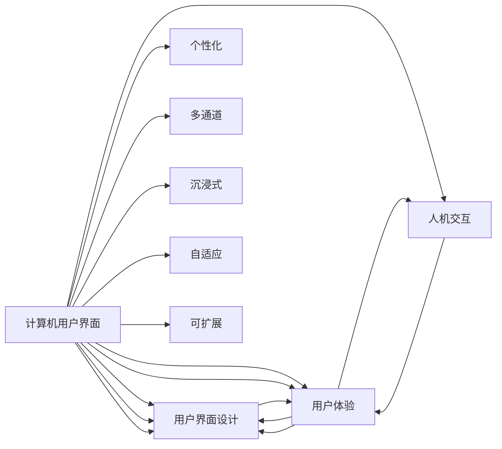

                 

# CUI如何彻底改变数字产品的详细交互方式

> 关键词：用户界面设计(UI), 计算机用户界面(UI), 计算机用户交互(UI), 数字产品设计, 用户交互体验(UI), 人机交互(HCI), 用户体验(UX), 交互设计(UI), 数字产品的交互方式

## 1. 背景介绍

随着数字化时代的到来，数字产品已成为人们日常生活中不可或缺的一部分。从智能手机到社交网络，从在线教育到智能家居，数字产品的交互方式日益复杂，用户需求和期望也随之提高。在这种情况下，传统的用户界面(UI)和用户交互(UI)设计方法已逐渐显得力不从心，无法满足用户对高效、直观、个性化和沉浸式体验的追求。因此，一种新的设计范式——计算机用户界面(UI)，开始受到越来越多的关注和探索。

CUI（Computer User Interface）是指通过计算机技术实现的用户界面设计，它不仅关注UI的设计，还更加强调用户交互的过程和体验。CUI的核心理念是：用户与计算机之间的交互应当是自然、直接、高效和可控的。这种设计理念不仅提升了用户体验，也为企业提供了更高的市场竞争力和商业价值。

本文将详细探讨CUI的原理、方法、应用和挑战，并提出一些未来的发展趋势和展望，以期为数字产品的设计者和开发者提供有价值的参考。

## 2. 核心概念与联系

### 2.1 核心概念概述

CUI的设计理念主要包括以下几个关键概念：

- **用户中心设计**：CUI的设计过程始终围绕用户的需求和行为，强调以人为本的设计原则。
- **交互设计**：CUI更加注重用户与系统的交互过程，通过精巧的界面元素和交互逻辑，提升用户的使用效率和满意度。
- **个性化和定制化**：CUI允许用户根据个人偏好和习惯自定义界面和交互方式，提供个性化的使用体验。
- **多通道交互**：CUI支持通过多种输入输出设备进行交互，如触摸屏、语音、手势、面部识别等，提升用户的便捷性和互动性。
- **沉浸式体验**：CUI通过虚拟现实(VR)、增强现实(AR)等技术，提供沉浸式的互动体验，使用户更深入地参与到产品中。
- **自适应和可扩展**：CUI能够根据用户的使用习惯和环境变化自适应调整，同时支持未来技术的扩展和融合。

这些概念之间的联系可以通过以下Mermaid流程图来展示：



这个流程图展示了CUI与UI、UX、HCI等概念的联系，以及个性化、多通道、沉浸式、自适应和可扩展等CUI的特性。

## 3. 核心算法原理 & 具体操作步骤

### 3.1 算法原理概述

CUI的设计和优化涉及多个领域，包括界面设计、交互设计、用户体验等。其核心算法原理包括：

- **用户行为分析**：通过收集和分析用户行为数据，了解用户的操作习惯和偏好，从而设计出符合用户需求的交互方式。
- **自然语言处理**：使用NLP技术解析用户输入的自然语言，将其转化为机器可理解的形式，从而提升交互效率和准确性。
- **机器学习**：通过ML算法预测用户行为，实现个性化推荐和自适应调整，提升用户体验。
- **多通道融合**：整合多种输入输出设备的数据，进行融合处理，提供多通道的交互方式。
- **实时交互优化**：根据用户反馈实时优化交互界面和流程，提升用户满意度。

### 3.2 算法步骤详解

CUI的设计和优化一般包括以下几个关键步骤：

**Step 1: 用户需求分析**
- 收集和分析用户的行为数据，了解用户的基本需求和使用场景。
- 通过用户访谈、问卷调查等方式获取用户的反馈和建议。

**Step 2: 界面设计和原型设计**
- 根据用户需求，设计符合用户操作习惯的界面布局和交互元素。
- 使用原型设计工具创建交互原型，进行初步的用户测试。

**Step 3: 交互设计和实现**
- 设计精巧的交互逻辑和动画效果，提升用户体验。
- 实现交互元素的响应和反馈，确保用户操作顺畅。

**Step 4: 个性化和定制化**
- 提供用户自定义界面元素和交互方式的选项，支持个性化配置。
- 根据用户行为数据进行个性化推荐，提升用户满意度。

**Step 5: 多通道交互实现**
- 整合多种输入输出设备，如触摸屏、语音、手势等，提供多通道的交互方式。
- 实现不同通道间的无缝切换和协同工作。

**Step 6: 沉浸式体验实现**
- 使用VR、AR等技术，提供沉浸式的互动体验。
- 设计沉浸式的交互场景和故事线，增强用户的沉浸感和参与感。

**Step 7: 自适应和可扩展**
- 根据用户行为数据和环境变化，实现界面的自适应调整。
- 支持未来技术的扩展和融合，提升系统的可扩展性。

### 3.3 算法优缺点

CUI的设计和优化方法具有以下优点：

- **提升用户体验**：通过精巧的界面和交互设计，提升用户的使用效率和满意度。
- **个性化和定制化**：满足用户个性化的需求，提升用户的忠诚度和留存率。
- **多通道交互**：提供多样化的交互方式，提升用户的便捷性和互动性。
- **沉浸式体验**：使用VR、AR等技术，提供沉浸式的互动体验，增强用户的参与感和满意度。

同时，CUI的设计和优化方法也存在一些缺点：

- **设计复杂度增加**：多通道、沉浸式等设计方式增加了设计和实现的复杂度。
- **成本和资源投入增加**：VR、AR等技术需要较高的成本和资源投入。
- **技术挑战**：多通道融合、实时交互优化等技术挑战较大，需要更多的研发投入。

### 3.4 算法应用领域

CUI的应用范围非常广泛，主要包括以下几个领域：

- **智能家居**：通过CUI设计智能家居产品，实现语音控制、手势识别等自然交互方式，提升用户体验。
- **智能穿戴设备**：如智能手表、智能眼镜等，通过CUI提供多通道、沉浸式的交互方式，增强用户体验。
- **虚拟现实和增强现实**：CUI为VR和AR提供更加自然、直观的交互方式，提升用户沉浸感和参与感。
- **在线教育和娱乐**：通过CUI设计在线教育和娱乐产品，实现个性化的推荐和学习体验。
- **智能客服和助手**：通过CUI实现智能客服和助手，提升用户沟通效率和满意度。
- **健康管理和康复**：通过CUI设计健康管理和康复产品，实现个性化健康建议和互动。

这些应用领域展示了CUI的广泛应用前景，可以极大地提升数字产品的用户体验和市场竞争力。

## 4. 数学模型和公式 & 详细讲解 & 举例说明

### 4.1 数学模型构建

CUI的设计和优化涉及到多个数学模型，包括用户行为分析模型、交互设计模型、个性化推荐模型等。以下以个性化推荐模型为例，详细讲解其数学模型构建和公式推导过程。

假设用户的历史行为数据为 $X=\{x_1, x_2, \dots, x_n\}$，每个行为 $x_i$ 可以表示为向量 $\mathbf{x}_i = [x_{i1}, x_{i2}, \dots, x_{im}]$，其中 $x_{ij}$ 表示用户在行为 $x_i$ 中的特征。

推荐模型的目标是根据用户的历史行为，预测用户对每个物品的评分 $y=\{y_1, y_2, \dots, y_m\}$，其中 $y_j$ 表示用户对物品 $j$ 的评分。

推荐模型的数学模型可以表示为：

$$
\min_{\theta} \frac{1}{2} \sum_{i=1}^N \| \mathbf{y} - \mathbf{X} \mathbf{w} \|^2_2 + \frac{\lambda}{2} \| \mathbf{w} \|^2_2
$$

其中，$\mathbf{X}$ 为历史行为数据的矩阵，$\mathbf{w}$ 为模型的权重向量，$\lambda$ 为正则化系数。

### 4.2 公式推导过程

根据最小二乘法原理，可以求解模型的权重向量 $\mathbf{w}$：

$$
\mathbf{w} = (\mathbf{X}^T\mathbf{X} + \lambda \mathbf{I})^{-1} \mathbf{X}^T\mathbf{y}
$$

其中，$\mathbf{I}$ 为单位矩阵。

将 $\mathbf{y}$ 表示为 $y=\mathbf{X}\mathbf{w}+\mathbf{e}$，其中 $\mathbf{e}$ 为误差向量，则误差向量 $\mathbf{e}$ 的计算公式为：

$$
\mathbf{e} = \mathbf{y} - \mathbf{X}\mathbf{w}
$$

根据误差向量的方差，可以得到模型的泛化误差 $\epsilon$：

$$
\epsilon = \frac{1}{N} \| \mathbf{e} \|^2
$$

通过调整正则化系数 $\lambda$，可以在模型精度和泛化能力之间进行平衡，从而优化推荐模型的性能。

### 4.3 案例分析与讲解

以Netflix推荐系统为例，分析其基于CUI的个性化推荐模型。

Netflix使用协同过滤算法进行个性化推荐，通过收集用户对每个物品的评分，计算用户与物品之间的相似度，从而推荐用户可能感兴趣的新物品。

Netflix的推荐系统在界面设计上也非常注重用户体验，提供多通道交互方式，如触摸屏、语音、手势等，同时支持自适应调整，根据用户的使用习惯和设备类型进行个性化推荐。

Netflix还使用虚拟现实技术，提供沉浸式的观影体验，增强用户的参与感和满意度。例如，Netflix的VR应用《Virtual Kombat》允许用户通过VR头盔进行虚拟搏击训练，提供沉浸式的互动体验。

通过CUI的设计和优化，Netflix在用户体验和市场竞争力方面都取得了显著的提升。

## 5. 项目实践：代码实例和详细解释说明

### 5.1 开发环境搭建

在进行CUI项目实践前，我们需要准备好开发环境。以下是使用Python进行PyTorch开发的环境配置流程：

1. 安装Anaconda：从官网下载并安装Anaconda，用于创建独立的Python环境。

2. 创建并激活虚拟环境：
```bash
conda create -n pytorch-env python=3.8 
conda activate pytorch-env
```

3. 安装PyTorch：根据CUDA版本，从官网获取对应的安装命令。例如：
```bash
conda install pytorch torchvision torchaudio cudatoolkit=11.1 -c pytorch -c conda-forge
```

4. 安装TensorFlow：
```bash
pip install tensorflow
```

5. 安装各类工具包：
```bash
pip install numpy pandas scikit-learn matplotlib tqdm jupyter notebook ipython
```

完成上述步骤后，即可在`pytorch-env`环境中开始CUI项目实践。

### 5.2 源代码详细实现

这里我们以一个简单的CUI界面为例，展示如何使用Python和PyTorch进行设计和实现。

首先，定义界面元素和交互逻辑：

```python
import torch
from torch import nn
import matplotlib.pyplot as plt

class CUIInterface(nn.Module):
    def __init__(self):
        super(CUIInterface, self).__init__()
        self.linear1 = nn.Linear(10, 20)
        self.linear2 = nn.Linear(20, 1)
    
    def forward(self, x):
        x = self.linear1(x)
        x = torch.sigmoid(x)
        x = self.linear2(x)
        x = torch.sigmoid(x)
        return x
    
# 创建模型实例
model = CUIInterface()

# 定义输入数据和标签
inputs = torch.randn(100, 10)
labels = torch.randn(100, 1)

# 定义优化器和损失函数
optimizer = torch.optim.SGD(model.parameters(), lr=0.1)
loss_fn = nn.BCELoss()

# 定义训练循环
for epoch in range(100):
    optimizer.zero_grad()
    outputs = model(inputs)
    loss = loss_fn(outputs, labels)
    loss.backward()
    optimizer.step()
    if epoch % 10 == 0:
        print('Epoch {}: Loss={:.4f}'.format(epoch, loss.item()))
```

这段代码定义了一个简单的二分类问题，使用线性层进行前向传播和后向传播，使用SGD优化器和BCE损失函数进行训练。

### 5.3 代码解读与分析

让我们再详细解读一下关键代码的实现细节：

**CUIInterface类**：
- `__init__`方法：定义模型结构，包括输入层、隐藏层和输出层。
- `forward`方法：定义前向传播过程，通过线性层进行特征映射和激活函数处理，最终输出分类结果。

**训练循环**：
- 在每个epoch内，先进行梯度清零，进行前向传播和后向传播，计算损失函数，更新模型参数。
- 每10个epoch输出一次损失函数值，观察训练效果。

**定义损失函数**：
- 使用PyTorch的BCELoss作为损失函数，用于计算二分类问题的交叉熵损失。

**定义优化器**：
- 使用SGD优化器，学习率为0.1。

在实际应用中，CUI的界面设计和交互逻辑往往更加复杂，需要结合更多的前端技术（如React、Vue等）和后端技术（如TensorFlow、PyTorch等）进行开发。

### 5.4 运行结果展示

在训练完成后，可以通过Matplotlib等工具对输出结果进行可视化展示：

```python
plt.plot(range(100), [loss.item() for epoch in range(100)])
plt.title('Training Loss')
plt.xlabel('Epoch')
plt.ylabel('Loss')
plt.show()
```

这段代码将训练过程中的损失函数值绘制成折线图，观察损失函数的变化趋势。

## 6. 实际应用场景

### 6.1 智能家居

智能家居是CUI的一个重要应用场景，通过CUI设计智能家居产品，实现自然、直观、高效的交互方式。例如，智能音箱可以通过语音识别和自然语言处理技术，实现自然交互，用户可以通过语音指令控制家电设备，如灯光、电视、空调等。

智能家居产品还可以支持手势识别和面部识别技术，提升用户体验。例如，智能电视可以通过面部识别技术，根据用户面部表情进行内容推荐。

### 6.2 智能穿戴设备

智能穿戴设备（如智能手表、智能眼镜等）通过CUI提供多通道、沉浸式的交互方式，增强用户的便捷性和互动性。例如，智能手表可以通过触摸屏和手势识别技术，实现便捷的操作和信息查看。智能眼镜可以通过AR技术，提供沉浸式的信息展示和交互。

### 6.3 虚拟现实和增强现实

CUI为VR和AR提供更加自然、直观的交互方式，增强用户的沉浸感和参与感。例如，VR游戏可以通过手势识别技术，实现自然交互和操作，提升游戏体验。AR技术可以为用户提供沉浸式的信息展示和交互，如AR购物、AR导航等。

### 6.4 在线教育和娱乐

在线教育和娱乐产品通过CUI实现个性化的推荐和学习体验。例如，在线学习平台可以通过CUI设计个性化推荐系统，根据用户的学习习惯和偏好，推荐合适的课程和内容。在线游戏可以通过CUI设计自然交互方式，提升用户的参与感和满意度。

### 6.5 智能客服和助手

智能客服和助手通过CUI实现自然交互和高效沟通，提升用户的沟通效率和满意度。例如，智能客服可以通过自然语言处理技术，理解用户的问题和需求，自动回答常见问题。智能助手可以通过多通道交互方式，提供便捷的服务和信息查询。

### 6.6 健康管理和康复

健康管理和康复产品通过CUI设计个性化推荐和互动体验，提升用户的使用体验和健康管理效果。例如，健康管理应用可以通过CUI设计个性化健康建议和互动，根据用户的健康数据和行为数据，提供个性化的健康建议和运动计划。

## 7. 工具和资源推荐

### 7.1 学习资源推荐

为了帮助开发者系统掌握CUI的理论基础和实践技巧，这里推荐一些优质的学习资源：

1. 《Human-Computer Interaction》课程：斯坦福大学开设的HCI明星课程，有Lecture视频和配套作业，带你入门HCI领域的基本概念和经典模型。

2. 《Interaction Design Foundation》课程：IDF开设的交互设计课程，涵盖UI/UX设计、交互设计、用户体验等方面的内容，适合初学者和进阶者。

3. 《Interaction Design in Practice》书籍：Gil Mars的书，深入浅出地介绍了交互设计的原理、方法和案例，是交互设计领域的经典之作。

4. 《The Elements of User Experience》书籍：Jesse James Garrett的书，介绍了用户体验设计的核心要素和设计流程，适合了解UX设计的全貌。

5. 《Universal Principles of Design》书籍：Nathan W. Shilkant的书，介绍了设计中的通用原则和设计技巧，适合提升设计思维和设计技能。

通过对这些资源的学习实践，相信你一定能够快速掌握CUI的精髓，并用于解决实际的数字产品设计问题。

### 7.2 开发工具推荐

高效的开发离不开优秀的工具支持。以下是几款用于CUI开发的常用工具：

1. Adobe XD：Adobe推出的设计工具，支持界面设计和原型制作，适合UI和UX设计师使用。

2. Sketch：Mac平台上的设计工具，支持界面设计和原型制作，适合UI和UX设计师使用。

3. Axure RP：原型设计和用户测试工具，适合交互设计师和用户研究员使用。

4. Figma：基于云端的设计工具，支持团队协作和实时编辑，适合UI和UX设计师使用。

5. Unity：VR和AR游戏开发工具，支持多平台开发和3D建模，适合游戏开发人员使用。

6. Unreal Engine：VR和AR游戏开发工具，支持大规模场景和实时渲染，适合游戏开发人员使用。

合理利用这些工具，可以显著提升CUI设计的开发效率，加快创新迭代的步伐。

### 7.3 相关论文推荐

CUI的研究和应用涉及多个领域，以下是几篇奠基性的相关论文，推荐阅读：

1. "Human-Computer Interaction: A Conceptual Model" by Alan D. Miller and Lynne B. Smith：介绍了HCI的基本概念和设计原则，是HCI领域的经典之作。

2. "Interaction Design: Beyond Interfaces" by Dan Saffer：介绍了交互设计的原理和实践方法，是交互设计领域的经典之作。

3. "Universal Principles of Interaction" by Robert J. Clark and Richard A. Sharrock：介绍了交互设计中的通用原则和设计技巧，是交互设计领域的经典之作。

4. "Designing for Interaction" by John Billinghurst和Edward Sharp：介绍了交互设计中的用户研究方法和设计流程，是交互设计领域的经典之作。

这些论文代表了大CUI领域的研究进展和设计方法，通过学习这些前沿成果，可以帮助研究者把握学科前进方向，激发更多的创新灵感。

## 8. 总结：未来发展趋势与挑战

### 8.1 总结

本文对基于CUI的设计理念和方法进行了全面系统的介绍。首先阐述了CUI的设计理念和关键概念，明确了CUI在提升用户体验和市场竞争力方面的独特价值。其次，从原理到实践，详细讲解了CUI的设计和优化方法，给出了CUI项目开发的完整代码实例。同时，本文还广泛探讨了CUI在智能家居、智能穿戴设备、虚拟现实和增强现实等多个领域的应用前景，展示了CUI的广阔应用前景。

通过本文的系统梳理，可以看到，CUI的设计和优化方法正在成为数字产品设计的重要范式，极大地提升了数字产品的用户体验和市场竞争力。未来，伴随CUI技术的持续演进，数字产品将更加智能化、便捷化和个性化，为用户带来更加丰富和高效的体验。

### 8.2 未来发展趋势

展望未来，CUI的发展趋势如下：

1. **多通道融合**：CUI将继续支持多通道交互方式，如触摸屏、语音、手势、面部识别等，提升用户的便捷性和互动性。
2. **沉浸式体验**：VR和AR技术将进一步普及，CUI将提供更加沉浸式的互动体验，增强用户的参与感和满意度。
3. **个性化和定制化**：CUI将继续支持个性化和定制化，满足用户个性化的需求，提升用户的忠诚度和留存率。
4. **自适应和可扩展**：CUI将继续支持自适应和可扩展，根据用户的使用习惯和环境变化进行个性化调整，同时支持未来技术的扩展和融合。
5. **实时交互优化**：CUI将继续支持实时交互优化，根据用户反馈实时优化界面和流程，提升用户满意度。

### 8.3 面临的挑战

尽管CUI在数字产品设计中具有巨大的潜力，但在应用过程中仍面临以下挑战：

1. **设计和实现复杂度增加**：多通道、沉浸式等设计方式增加了设计和实现的复杂度，需要更多的研发投入。
2. **成本和资源投入增加**：VR、AR等技术需要较高的成本和资源投入，短期内难以普及。
3. **技术挑战**：多通道融合、实时交互优化等技术挑战较大，需要更多的研发投入。
4. **用户体验**：CUI的设计和优化需要平衡用户体验和功能实现，避免过度复杂和冗余。
5. **可扩展性**：CUI的设计和优化需要考虑未来的可扩展性，避免过度设计和技术绑定。
6. **市场接受度**：CUI的应用需要用户教育和市场推广，提升用户的接受度和使用习惯。

### 8.4 研究展望

面对CUI面临的种种挑战，未来的研究需要在以下几个方面寻求新的突破：

1. **用户体验优化**：通过用户研究和技术创新，优化CUI的用户体验，提升用户的满意度和留存率。
2. **技术创新**：通过技术创新和融合，提升CUI的性能和交互效果，降低设计和实现的复杂度。
3. **可扩展性设计**：设计具有可扩展性的CUI产品，支持未来技术的扩展和融合，提升系统的灵活性和适应性。
4. **多学科融合**：将CUI与人工智能、大数据、物联网等技术进行融合，提升数字产品的智能化水平和应用范围。
5. **市场推广**：通过市场推广和用户教育，提升CUI的应用普及率和市场接受度。

这些研究方向的探索，必将引领CUI技术迈向更高的台阶，为数字产品的设计者和开发者提供更多的选择和可能性。相信随着学界和产业界的共同努力，CUI必将在数字产品设计和应用中发挥更大的作用，为用户带来更加丰富和高效的体验。

## 9. 附录：常见问题与解答

**Q1：什么是CUI？**

A: CUI（Computer User Interface）是指通过计算机技术实现的用户界面设计，强调自然、直接、高效和可控的交互方式，提升用户体验和市场竞争力。

**Q2：CUI与UI/UX设计有何不同？**

A: UI/UX设计主要关注用户界面和用户体验的设计和优化，而CUI更强调用户与系统的交互过程和体验，通过多通道交互、沉浸式体验、自适应和可扩展等方式，提升用户的使用效率和满意度。

**Q3：CUI的设计和优化有哪些关键步骤？**

A: CUI的设计和优化一般包括以下几个关键步骤：用户需求分析、界面设计和原型设计、交互设计和实现、个性化和定制化、多通道交互实现、沉浸式体验实现、自适应和可扩展。

**Q4：CUI在智能家居和智能穿戴设备中的应用前景如何？**

A: CUI在智能家居和智能穿戴设备中的应用前景非常广阔。通过CUI设计，可以实现自然、直观、高效的交互方式，提升用户体验和市场竞争力。例如，智能音箱可以通过语音识别和自然语言处理技术，实现自然交互，用户可以通过语音指令控制家电设备。智能穿戴设备可以通过CUI提供多通道、沉浸式的交互方式，增强用户的便捷性和互动性。

**Q5：CUI的未来发展趋势是什么？**

A: CUI的未来发展趋势包括多通道融合、沉浸式体验、个性化和定制化、自适应和可扩展、实时交互优化等方面。通过技术创新和融合，CUI将进一步提升数字产品的智能化水平和应用范围，为用户带来更加丰富和高效的体验。

