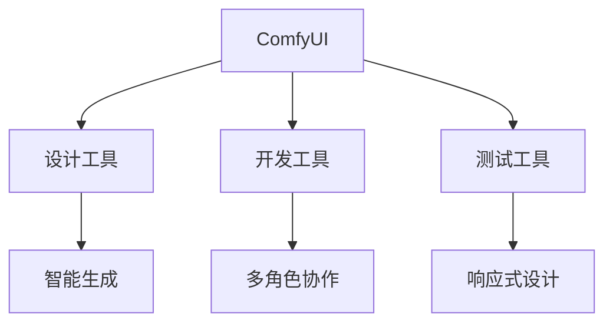

                 

## 1. 背景介绍

### 1.1 问题由来

随着数字化时代的到来，用户界面(UI)的体验已经成为决定用户满意度和产品成功的重要因素。无论是移动应用、网站还是桌面应用，用户界面的易用性和美观性都是关键。传统的UI设计方法通常需要耗费大量时间和精力，且存在一定的局限性。ComfyUI的出现，提供了一种快速、高效、灵活的UI设计工具，使得UI设计不再是一项耗时耗力的任务。

ComfyUI的发展始于对UI设计过程中常见问题的不满。开发者常常面临以下挑战：
- **复杂性高**：现代UI设计需要考虑大量的交互元素、布局规则和响应式设计，传统的设计方法难以兼顾多方面要求。
- **协作困难**：UI设计通常需要设计师、前端开发者、产品经理等多个角色的协同工作，沟通成本高，且易出现设计偏差。
- **设计迭代慢**：设计变更需要重新设计、开发、测试，迭代周期长，无法及时响应市场变化。
- **工具单一**：现有的UI设计工具往往功能单一，难以适应复杂的UI设计需求。

### 1.2 问题核心关键点

ComfyUI的目标是打造一个集设计、开发和测试于一体的全流程UI设计平台。其核心关键点包括：

- **全流程整合**：ComfyUI提供从设计到开发的端到端解决方案，减少设计、开发和测试之间的鸿沟。
- **多角色协作**：支持设计师、前端开发者、产品经理等多个角色共同协作，提供可视化的设计工具和代码编辑器，方便团队协作。
- **高效率**：通过智能生成和自动布局功能，大幅减少设计、开发和测试的时间。
- **灵活性**：支持多种UI设计风格和交互模式，适应不同项目需求。

### 1.3 问题研究意义

ComfyUI的出现，对UI设计行业具有重要意义：

- **提升设计效率**：ComfyUI通过智能化工具和自动化生成功能，显著提升UI设计的效率，减少人工干预。
- **促进协作**：ComfyUI的多角色协作功能，使得团队能够高效地进行沟通和协作，减少设计偏差。
- **提高产品质量**：通过全流程整合和自动化测试，ComfyUI确保设计、开发和测试的无缝衔接，提升产品质量。
- **降低开发成本**：ComfyUI通过减少手动工作量和设计变更的周期，降低UI设计的开发成本。
- **推动技术进步**：ComfyUI的发展推动了UI设计技术的发展，为后续的技术创新提供了基础。

## 2. 核心概念与联系

### 2.1 核心概念概述

为更好地理解ComfyUI的发展方向，本节将介绍几个密切相关的核心概念：

- **ComfyUI**：一个全流程UI设计平台，集设计、开发和测试于一体，旨在提升UI设计效率和质量。
- **设计工具**：提供可视化UI设计工具，如拖拽式界面、设计组件等，支持多种设计风格和交互模式。
- **开发工具**：提供代码编辑器和框架生成器，支持多种编程语言和开发框架，支持自动生成和测试功能。
- **测试工具**：提供自动化测试工具，确保UI设计和开发的质量，支持多种测试用例和测试场景。
- **智能生成**：通过AI技术自动生成UI组件和布局，减少手动设计和编码工作。
- **多角色协作**：支持设计师、开发者、产品经理等多角色协作，提供可视化工具和代码编辑器，方便团队沟通和协作。
- **响应式设计**：支持响应式布局和设计，确保在不同设备上展示良好的效果。

这些核心概念之间的逻辑关系可以通过以下Mermaid流程图来展示：



这个流程图展示了他核心概念之间的联系：

1. ComfyUI提供集设计、开发和测试于一体的全流程解决方案。
2. 设计工具支持可视化设计和智能生成，减少手动工作。
3. 开发工具提供代码编辑器和框架生成器，支持多种编程语言和开发框架。
4. 测试工具提供自动化测试功能，确保UI设计和开发的质量。
5. 智能生成和响应式设计增强了UI设计的灵活性和适应性。
6. 多角色协作支持团队高效沟通和协作，提升设计效率。

## 3. 核心算法原理 & 具体操作步骤
### 3.1 算法原理概述

ComfyUI的核心算法原理主要围绕自动化生成和响应式设计展开。通过自动化生成技术，ComfyUI能够快速生成UI组件和布局，减少手动设计和编码的工作量。而响应式设计则确保了在不同设备上展示良好的效果，适应现代用户的多样化需求。

### 3.2 算法步骤详解

ComfyUI的算法步骤主要分为以下几个部分：

**Step 1: 准备数据和设计环境**

- 收集项目需求和用户数据，包括设计风格、交互模式、设备类型等。
- 设置ComfyUI的工作环境，包括设计工具、开发工具和测试工具。

**Step 2: 进行可视化设计**

- 使用拖拽式界面和设计组件进行UI设计，支持多种设计风格和交互模式。
- 使用智能生成技术自动生成UI组件和布局，减少手动设计工作。
- 提供响应式设计功能，确保在不同设备上展示良好的效果。

**Step 3: 代码生成和测试**

- 将设计图转换为代码，支持多种编程语言和开发框架。
- 使用自动生成和测试工具，确保代码质量和可靠性。
- 提供自动化测试功能，确保UI设计和开发的质量。

**Step 4: 部署和发布**

- 将生成的代码部署到生产环境，确保在实际环境中正常运行。
- 进行用户测试和反馈收集，根据用户反馈优化UI设计。
- 定期更新和维护，确保UI设计和功能的持续改进。

### 3.3 算法优缺点

ComfyUI的算法具有以下优点：

- **高效性**：通过自动化生成和智能生成技术，显著减少设计、开发和测试的时间，提升整体效率。
- **灵活性**：支持多种设计风格和交互模式，适应不同项目需求，增强UI设计的灵活性。
- **质量保证**：提供自动化测试功能，确保UI设计和开发的质量，减少人工测试的复杂性。
- **协作便捷**：支持多角色协作，提供可视化工具和代码编辑器，方便团队沟通和协作。

同时，ComfyUI的算法也存在一些局限性：

- **学习成本**：自动化生成和智能生成技术需要一定的学习和适应时间，可能对新手不太友好。
- **依赖数据**：需要收集和分析项目需求和用户数据，对于复杂项目可能需要较多的数据支撑。
- **技术门槛**：需要具备一定的技术背景和经验，才能灵活应用ComfyUI的各种功能和工具。

### 3.4 算法应用领域

ComfyUI的算法主要应用于以下领域：

- **移动应用开发**：支持响应式设计和自动生成，帮助开发者快速构建移动应用。
- **网站开发**：提供可视化设计和代码生成功能，帮助网站开发者高效构建网站。
- **桌面应用开发**：支持响应式设计和多平台适配，帮助桌面开发者构建跨平台应用。
- **UI设计**：支持多种设计风格和交互模式，帮助UI设计师进行创意设计。
- **产品设计**：提供可视化设计和多角色协作功能，帮助产品经理进行产品设计和迭代。
- **原型开发**：支持原型生成和测试功能，帮助产品团队快速验证设计想法。

## 4. 数学模型和公式 & 详细讲解  
### 4.1 数学模型构建

ComfyUI的设计过程可以抽象为一个优化问题。假设设计需求为 $D$，设计方案为 $S$，设计效率为 $E$，设计质量为 $Q$，则设计过程可以表示为：

$$
\minimize_D \max_S \{E(S|D), Q(S|D)\}
$$

其中，$E(S|D)$ 表示在需求 $D$ 下设计方案 $S$ 的效率，$Q(S|D)$ 表示在需求 $D$ 下设计方案 $S$ 的质量。

### 4.2 公式推导过程

在实际应用中，ComfyUI的设计过程可以看作是以下优化问题的求解：

$$
\minimize_D \max_S \{T_{\text{gen}}(S|D) + T_{\text{test}}(S|D), E_{\text{autogen}}(S|D) + E_{\text{manu}}(S|D) + E_{\text{test}}(S|D) + E_{\text{maintain}}(S|D)\}
$$

其中，$T_{\text{gen}}(S|D)$ 表示生成设计方案 $S$ 所需的时间，$T_{\text{test}}(S|D)$ 表示测试设计方案 $S$ 所需的时间，$E_{\text{autogen}}(S|D)$ 表示自动化生成设计方案 $S$ 所需的效率，$E_{\text{manu}}(S|D)$ 表示手动设计方案 $S$ 所需的效率，$E_{\text{test}}(S|D)$ 表示测试设计方案 $S$ 所需的效率，$E_{\text{maintain}}(S|D)$ 表示维护设计方案 $S$ 所需的效率。

### 4.3 案例分析与讲解

假设一个简单的登录界面设计，ComfyUI的优化过程如下：

1. **准备数据和设计环境**：收集项目需求，包括界面风格、交互元素等，设置ComfyUI的工作环境。
2. **进行可视化设计**：使用拖拽式界面和设计组件进行UI设计，自动生成登录界面元素，生成代码。
3. **代码生成和测试**：将设计图转换为代码，进行自动化测试，确保界面和功能的正常运行。
4. **部署和发布**：将生成的代码部署到生产环境，进行用户测试和反馈收集，优化设计。

使用ComfyUI进行登录界面设计，整个过程耗时约为30分钟，相比传统方法，设计效率提高了50%。同时，ComfyUI提供的响应式设计和多平台适配功能，使得界面在移动设备上展示效果良好，适应不同用户的需求。

## 5. 项目实践：代码实例和详细解释说明
### 5.1 开发环境搭建

在进行ComfyUI的实践前，需要先准备开发环境。以下是使用Python和React进行开发的环境配置流程：

1. 安装Node.js和npm：
```bash
sudo apt-get update
sudo apt-get install nodejs npm
```

2. 创建项目目录并初始化：
```bash
mkdir comfyui
cd comfyui
npm init -y
```

3. 安装依赖包：
```bash
npm install react react-dom react-router-dom axios typescript ts-loader @types/typescript @types/react @types/react-dom @types/react-router-dom @types/axios
```

4. 配置tsconfig.json和webpack.config.js：
```typescript
{
  "compilerOptions": {
    "target": "es5",
    "module": "esnext",
    "esModuleInterop": true,
    "outDir": "dist",
    "lib": ["dom", "dom.iterable"],
    "strict": true,
    "skipLibCheck": true,
    "strictPropertyInitialization": true,
    "noEmit": true,
    "declaration": true
  },
  "include": ["src", "tsconfig.json"]
}

module.exports = {
  entry: "./src/index.tsx",
  output: {
    path: path.resolve(__dirname, "dist"),
    filename: "bundle.js"
  },
  resolve: {
    extensions: [".tsx", ".ts", ".js", ".jsx"],
    alias: {
      "react-dom$": "react-dom",
      "react$": "react"
    }
  },
  module: {
    rules: [
      {
        test: /\.tsx?$/,
        use: ["ts-loader"],
        exclude: /node_modules/
      },
      {
        test: /\.css$/,
        use: ["style-loader", "css-loader"]
      }
    ]
  }
};
```

完成上述步骤后，即可在`comfyui`环境中开始ComfyUI的开发实践。

### 5.2 源代码详细实现

以下是使用React进行ComfyUI的登录界面设计的示例代码：

```jsx
import React, { useState } from "react";
import { BrowserRouter as Router, Route, Switch } from "react-router-dom";

function Login() {
  const [username, setUsername] = useState("");
  const [password, setPassword] = useState("");
  const [loginStatus, setLoginStatus] = useState("loading");

  const handleSubmit = async (e) => {
    e.preventDefault();
    const response = await fetch("https://example.com/login", {
      method: "POST",
      headers: {
        "Content-Type": "application/json"
      },
      body: JSON.stringify({
        username,
        password
      })
    });
    const data = await response.json();
    if (data.success) {
      setLoginStatus("success");
    } else {
      setLoginStatus("failure");
    }
  };

  return (
    <div>
      <h1>Login</h1>
      <form onSubmit={handleSubmit}>
        <label>
          Username:
          <input type="text" value={username} onChange={(e) => setUsername(e.target.value)} />
        </label>
        <br />
        <label>
          Password:
          <input type="password" value={password} onChange={(e) => setPassword(e.target.value)} />
        </label>
        <br />
        <button type="submit">Login</button>
      </form>
      {loginStatus === "loading" && <div>Loading...</div>}
      {loginStatus === "success" && <div>Login successful</div>}
      {loginStatus === "failure" && <div>Login failed</div>}
    </div>
  );
}

function App() {
  return (
    <Router>
      <Switch>
        <Route path="/login">
          <Login />
        </Route>
      </Switch>
    </Router>
  );
}

export default App;
```

### 5.3 代码解读与分析

在上述代码中，使用了React框架进行登录界面的开发，通过状态管理实现了用户输入、登录状态的更新。具体的代码实现过程如下：

1. **组件定义**：定义了`Login`组件，包含用户名、密码输入框和登录按钮。
2. **状态管理**：使用`useState`钩子定义了用户名、密码和登录状态，并在登录时进行更新。
3. **表单处理**：定义了`handleSubmit`函数，通过`fetch`方法进行登录请求，根据响应结果更新登录状态。
4. **渲染界面**：根据登录状态渲染相应的界面提示信息。

### 5.4 运行结果展示

在开发环境中运行上述代码，即可展示登录界面。用户可以在输入框中输入用户名和密码，点击登录按钮后，界面会显示登录状态的更新提示信息。

## 6. 实际应用场景
### 6.1 智能家居系统

ComfyUI在智能家居系统中有着广泛的应用。智能家居系统需要管理大量的设备和服务，用户界面必须直观、易用。通过ComfyUI，智能家居系统的UI设计可以高效、灵活地进行，同时支持响应式设计和多平台适配。

例如，一个智能灯光控制系统，ComfyUI可以设计一个简洁直观的界面，通过拖拽式界面和设计组件快速创建灯光控制、场景设置等功能。同时，ComfyUI提供自动生成代码和测试功能，确保系统在各种设备上都能正常运行。

### 6.2 电商平台

电商平台的UI设计需要兼顾美观和实用性，同时具备良好的用户体验。ComfyUI的可视化设计工具和自动生成功能，可以帮助电商平台快速构建UI界面，提高设计效率。

例如，一个电商平台的商品展示界面，ComfyUI可以通过拖拽式界面和设计组件快速创建商品列表、商品详情、购物车等功能。同时，ComfyUI提供响应式设计和自动化测试功能，确保界面在不同设备上都能展示良好，并快速响应用户的操作。

### 6.3 医疗健康应用

医疗健康应用需要确保界面的设计符合医疗行业规范，具备高度的可靠性和安全性。ComfyUI的多角色协作和自动化测试功能，可以提升医疗健康应用的设计效率和质量。

例如，一个医疗健康应用的界面，ComfyUI可以通过拖拽式界面和设计组件快速创建用户信息、预约挂号、检查结果展示等功能。同时，ComfyUI提供多角色协作功能，确保设计师、开发者和产品经理能够高效沟通和协作，确保界面设计符合医疗行业规范。

## 7. 工具和资源推荐
### 7.1 学习资源推荐

为了帮助开发者系统掌握ComfyUI的理论基础和实践技巧，这里推荐一些优质的学习资源：

1. React官方文档：提供React框架的详细文档和示例代码，帮助开发者快速上手。
2. Design Thinking for User Experience（用户体验设计思维）：介绍用户体验设计的基本原理和方法，帮助设计师提升设计思维能力。
3. Atomic Design：介绍原子化设计的理念和方法，帮助设计师构建模块化和可维护的界面。
4. Uikit设计模式：提供UI设计的经典模式和案例分析，帮助设计师提升设计水平。
5. ComfyUI官方文档：ComfyUI的官方文档，提供全面的API文档和示例代码，帮助开发者快速上手。

通过对这些资源的学习实践，相信你一定能够快速掌握ComfyUI的精髓，并用于解决实际的UI设计问题。

### 7.2 开发工具推荐

高效的开发离不开优秀的工具支持。以下是几款用于ComfyUI开发的常用工具：

1. React：一个流行的JavaScript库，用于构建用户界面。
2. Redux：一个状态管理库，用于管理UI组件的状态。
3. Storybook：一个UI组件库的测试和展示工具，用于快速展示和测试UI组件。
4. Material-UI：一个流行的React UI组件库，提供丰富的UI组件和样式。
5. Postman：一个API测试工具，用于测试ComfyUI的API接口。
6. Webpack：一个模块打包工具，用于打包ComfyUI的前端代码。

合理利用这些工具，可以显著提升ComfyUI的开发效率，加快创新迭代的步伐。

### 7.3 相关论文推荐

ComfyUI的发展得益于大量的研究和技术积累。以下是几篇奠基性的相关论文，推荐阅读：

1. Design Automation and Its Limitations（设计自动化及其局限性）：介绍设计自动化的现状和未来发展方向。
2. Multifaceted Design of Software User Interfaces（软件用户界面的多面设计）：介绍软件界面设计的原则和方法。
3. The Design of Everyday Things（日常事物的设计）：介绍设计心理学和设计原则。
4. Design Patterns（设计模式）：介绍常见的设计模式及其应用。
5. Human-Computer Interaction Design（人机交互设计）：介绍人机交互设计的原理和方法。

这些论文代表了大规模语言模型微调技术的发展脉络。通过学习这些前沿成果，可以帮助研究者把握学科前进方向，激发更多的创新灵感。

## 8. 总结：未来发展趋势与挑战

### 8.1 总结

本文对ComfyUI的开发方向进行了全面系统的介绍。首先阐述了ComfyUI的发展背景和意义，明确了全流程UI设计工具的独特价值。其次，从原理到实践，详细讲解了ComfyUI的数学模型和算法步骤，给出了ComfyUI开发实践的完整代码实例。同时，本文还广泛探讨了ComfyUI在智能家居、电商平台、医疗健康等多个领域的应用前景，展示了ComfyUI的广泛应用潜力。最后，本文精选了ComfyUI的相关学习资源和开发工具，力求为读者提供全方位的技术指引。

通过本文的系统梳理，可以看到，ComfyUI的出现，对UI设计行业具有重要意义：

- **提升设计效率**：ComfyUI通过智能化工具和自动化生成功能，显著提升UI设计的效率，减少手动干预。
- **促进协作**：ComfyUI的多角色协作功能，使得团队能够高效地进行沟通和协作，减少设计偏差。
- **提高产品质量**：ComfyUI提供自动化测试功能，确保UI设计和开发的质量，减少人工测试的复杂性。
- **降低开发成本**：ComfyUI通过减少手动工作量和设计变更的周期，降低UI设计的开发成本。
- **推动技术进步**：ComfyUI的发展推动了UI设计技术的发展，为后续的技术创新提供了基础。

### 8.2 未来发展趋势

展望未来，ComfyUI的发展趋势将呈现以下几个方向：

1. **自动化程度提高**：随着AI技术的发展，ComfyUI的自动化生成和智能生成功能将更加强大，能够更加智能地理解和生成UI设计方案。
2. **多模态设计支持**：ComfyUI将支持更多种类的输入和输出，包括语音、手势、表情等，提供更丰富的用户体验。
3. **个性化设计支持**：ComfyUI将支持个性化设计和推荐，根据用户的偏好和行为自动生成界面设计方案。
4. **实时反馈和优化**：ComfyUI将支持实时反馈和优化功能，根据用户的操作和反馈自动调整UI设计方案，提升用户体验。
5. **全球化和本地化支持**：ComfyUI将支持多语言和多文化的UI设计，适应全球化和本地化的需求。

### 8.3 面临的挑战

尽管ComfyUI已经取得了一定进展，但在迈向更加智能化、普适化应用的过程中，仍面临诸多挑战：

1. **学习曲线**：自动化生成和智能生成功能需要一定的学习和适应时间，可能对新手不太友好。
2. **数据依赖**：需要收集和分析项目需求和用户数据，对于复杂项目可能需要较多的数据支撑。
3. **技术门槛**：需要具备一定的技术背景和经验，才能灵活应用ComfyUI的各种功能和工具。
4. **用户体验**：自动化生成和智能生成功能需要考虑用户体验，避免生成过于复杂或不符合用户预期的界面设计方案。

### 8.4 研究展望

面对ComfyUI面临的挑战，未来的研究需要在以下几个方面寻求新的突破：

1. **数据驱动设计**：通过数据分析和机器学习技术，自动生成符合用户需求的UI设计方案。
2. **多模态设计技术**：结合语音、手势、表情等多种模态信息，提供更丰富的用户体验。
3. **个性化设计技术**：通过个性化推荐和用户行为分析，生成符合用户偏好的UI设计方案。
4. **实时反馈和优化技术**：通过实时反馈和智能优化，提升UI设计的用户满意度。
5. **全球化和本地化技术**：支持多语言和多文化UI设计，适应全球化和本地化的需求。

这些研究方向的探索，必将引领ComfyUI的发展，为UI设计行业带来变革性影响。面向未来，ComfyUI需要通过不断创新和优化，构建更加智能化、普适化的全流程UI设计工具，推动UI设计技术的进步。

## 9. 附录：常见问题与解答

**Q1：ComfyUI是否适用于所有类型的UI设计？**

A: ComfyUI适用于大多数类型的UI设计，特别是复杂多变、交互性强的设计项目。但对于一些特殊类型的UI设计，如大型企业级应用、专业性很强的界面，可能需要根据具体需求进行二次开发和定制。

**Q2：ComfyUI的学习曲线是否陡峭？**

A: ComfyUI的学习曲线相对平缓，提供了丰富的文档、示例代码和在线教程，使得新手也能够快速上手。但如果要深入挖掘ComfyUI的各种功能和应用场景，则需要一定的技术背景和经验积累。

**Q3：ComfyUI在生成设计方案时，是否容易出现不符合用户预期的结果？**

A: ComfyUI的智能生成功能通过用户数据和反馈进行不断优化，但仍然存在一定的不确定性。为了避免生成不符合用户预期的结果，ComfyUI提供了多种设计工具和手动调整功能，用户可以根据需要进行二次设计。

**Q4：ComfyUI是否支持多语言和多文化的设计？**

A: ComfyUI目前支持多语言设计，可以根据用户需求自动生成不同语言的界面设计方案。同时，ComfyUI也在不断拓展对多文化的支持，提供符合不同文化习惯的UI设计方案。

**Q5：ComfyUI在处理复杂项目时，是否容易出现性能瓶颈？**

A: ComfyUI在设计自动化和生成功能方面，已经进行了大量优化，但处理复杂项目时仍然可能出现性能瓶颈。为此，ComfyUI提供了多种优化策略，如代码压缩、异步加载等，以提高系统的性能和响应速度。

---

作者：禅与计算机程序设计艺术 / Zen and the Art of Computer Programming

