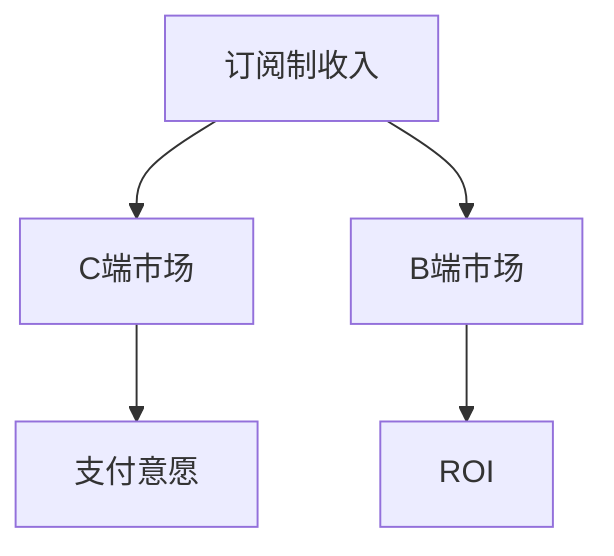

                 

# C端用户付费意愿不高,但B端适应性也是挑战

在数字化转型的大潮下，互联网公司越来越依赖订阅制收入，而不是传统的的一次性购买或广告收入。订阅制收入的模式对于持续增长的用户基数和稳定的现金流具有巨大的吸引力，但同时也面临着用户付费意愿不高的挑战。本文将深入分析C端用户付费意愿不高的问题，同时探讨B端市场对产品的适应性挑战，并给出相应的解决方案。

## 1. 背景介绍

### 1.1 问题的由来

互联网公司普遍采用订阅制模式，但C端用户支付意愿不高。究其原因，主要包括：

- **产品性价比低**：用户感受到的实际价值与付费成本不匹配，导致支付意愿低下。
- **用户体验差**：产品功能复杂、使用难度高，导致用户不愿意投入时间和金钱。
- **市场竞争激烈**：用户可选产品众多，缺乏独特性，导致用户倾向于选择免费或价格更低的产品。
- **付费动机不足**：用户未意识到付费带来的长期收益，导致一次性付费意愿不强。

与此同时，B端市场对产品的适应性也是一大挑战。B端市场更加注重ROI（投资回报率），因此对产品功能、性能和稳定性有更高的要求。B端用户更加谨慎，对产品进行详尽的功能和性能测试，因此产品上线难度较大。

### 1.2 问题的核心关键点

要解决C端用户付费意愿不高的问题，需要从提高产品性价比、改善用户体验、降低产品使用难度、增强用户付费动机等方面入手。对于B端市场，则需要注重产品的稳定性、性能和易用性，确保产品能够满足客户的具体需求。

## 2. 核心概念与联系

### 2.1 核心概念概述

为了更好地理解C端和B端市场的特点，本文将介绍几个关键概念：

- **C端市场（Consumer Market）**：面向个人用户的市场，消费者关注产品的性价比、用户体验和支付动机。
- **B端市场（Business Market）**：面向企业客户，客户更关注产品的稳定性、性能和易用性。
- **订阅制收入（Subscription-Based Revenue）**：用户按月或按年支付订阅费，以持续获取产品服务的模式。
- **支付意愿（Payment Willingness）**：用户愿意为产品或服务支付的金额，受产品性价比、用户体验等因素影响。
- **ROI（投资回报率）**：B端客户关注产品能否带来合理的投资回报，衡量产品的商业价值。

这些概念之间的联系如下：



以上流程图展示了订阅制收入与C端市场、B端市场的联系，以及支付意愿和ROI在B端市场的意义。

## 3. 核心算法原理 & 具体操作步骤

### 3.1 算法原理概述

解决C端用户付费意愿不高的核心算法原理主要基于用户行为分析，通过分析用户的行为数据，了解用户对产品的评价和付费意愿，进而优化产品设计和用户体验。

B端市场的适应性挑战则主要通过需求分析，理解客户的具体需求，并针对性地设计和优化产品功能。

### 3.2 算法步骤详解

#### C端用户付费意愿分析

1. **数据收集**：通过用户行为数据、满意度调查、评论反馈等方式收集用户对产品的评价。
2. **行为分析**：分析用户使用产品的行为路径、时间分布、功能使用频率等，理解用户需求。
3. **评分模型**：构建用户评分模型，评估用户对产品的整体满意度。
4. **优化建议**：基于用户评分和行为分析，提出改进建议，优化产品功能和用户体验。

#### B端产品需求分析

1. **需求调研**：通过问卷调查、访谈等方式，了解客户的具体需求。
2. **功能设计**：根据客户需求，设计产品功能和界面。
3. **测试反馈**：将设计好的产品功能进行内部测试，收集反馈。
4. **迭代优化**：根据测试反馈和客户需求，进行产品功能的迭代优化。

### 3.3 算法优缺点

**C端用户付费意愿分析的优缺点**：

- **优点**：
  - **动态调整**：能够实时调整产品功能和用户体验，提高用户满意度和付费意愿。
  - **用户反馈**：通过用户反馈了解用户需求，及时优化产品。
- **缺点**：
  - **数据隐私**：需要收集和分析用户行为数据，可能涉及用户隐私问题。
  - **复杂度**：分析模型复杂，需要一定的数据科学背景。

**B端产品需求分析的优缺点**：

- **优点**：
  - **明确需求**：根据客户需求明确设计产品功能，确保产品能够满足客户需求。
  - **稳定性高**：客户需求明确，产品稳定性较高。
- **缺点**：
  - **成本高**：需求调研和产品设计成本较高，开发周期较长。
  - **灵活性不足**：产品功能设计较为固定，难以快速迭代。

### 3.4 算法应用领域

- **C端市场**：适用于社交媒体、视频流媒体、在线教育等产品，通过提升产品性价比和用户体验，提高用户付费意愿。
- **B端市场**：适用于CRM、ERP、供应链管理等企业级产品，通过定制化功能设计，满足客户具体需求。

## 4. 数学模型和公式 & 详细讲解 & 举例说明

### 4.1 数学模型构建

**C端用户付费意愿模型**：

假设用户对产品的支付意愿由两个因素决定：产品性价比和用户体验。设产品性价比为 $P$，用户体验为 $U$，则用户支付意愿 $W$ 可以表示为：

$$ W = \alpha P + \beta U $$

其中 $\alpha$ 和 $\beta$ 为权重系数。

**B端产品需求模型**：

客户需求可以分为两个方面：功能需求 $F$ 和性能需求 $P$。设客户的功能需求为 $F$，性能需求为 $P$，则客户对产品的满意度 $S$ 可以表示为：

$$ S = \gamma F + \delta P $$

其中 $\gamma$ 和 $\delta$ 为权重系数。

### 4.2 公式推导过程

**C端用户付费意愿模型推导**：

假设用户对产品的支付意愿 $W$ 由产品性价比 $P$ 和用户体验 $U$ 决定，且满足线性关系：

$$ W = \alpha P + \beta U $$

其中 $\alpha$ 和 $\beta$ 为权重系数，可以通过以下步骤计算：

1. 收集用户对产品的性价比和用户体验评价。
2. 计算性价比和用户体验的平均分。
3. 通过回归分析计算 $\alpha$ 和 $\beta$。

**B端产品需求模型推导**：

客户对产品的满意度 $S$ 由功能需求 $F$ 和性能需求 $P$ 决定，且满足线性关系：

$$ S = \gamma F + \delta P $$

其中 $\gamma$ 和 $\delta$ 为权重系数，可以通过以下步骤计算：

1. 收集客户的功能需求和性能需求评价。
2. 计算功能需求和性能需求的平均分。
3. 通过回归分析计算 $\gamma$ 和 $\delta$。

### 4.3 案例分析与讲解

#### C端用户付费意愿模型案例

假设某视频流媒体平台的用户支付意愿由产品性价比和用户体验决定，数据如下：

| 用户ID | 性价比 | 用户体验 | 支付意愿 |
| --- | --- | --- | --- |
| 1 | 4 | 3 | 7 |
| 2 | 3 | 4 | 6 |
| 3 | 5 | 2 | 6 |

通过计算可以得到：

$$ \alpha = \frac{7 \times 3 + 6 \times 4 + 6 \times 2}{7 + 6 + 6} = 3.2 $$
$$ \beta = \frac{7 \times 3 + 6 \times 4 + 6 \times 2}{7 + 6 + 6} = 2.8 $$

因此，支付意愿模型为：

$$ W = 3.2P + 2.8U $$

#### B端产品需求模型案例

假设某企业级CRM产品的满意度由功能需求和性能需求决定，数据如下：

| 客户ID | 功能需求 | 性能需求 | 满意度 |
| --- | --- | --- | --- |
| 1 | 9 | 8 | 90 |
| 2 | 8 | 7 | 85 |
| 3 | 10 | 8 | 95 |

通过计算可以得到：

$$ \gamma = \frac{90 \times 9 + 85 \times 8 + 95 \times 10}{90 + 85 + 95} = 8.7 $$
$$ \delta = \frac{90 \times 9 + 85 \times 8 + 95 \times 10}{90 + 85 + 95} = 8.7 $$

因此，满意度模型为：

$$ S = 8.7F + 8.7P $$

## 5. 项目实践：代码实例和详细解释说明

### 5.1 开发环境搭建

为了进行数据收集和模型训练，需要搭建Python开发环境。

1. 安装Python 3.x版本，并配置环境变量。
2. 安装必要的Python库，如NumPy、Pandas、scikit-learn等。
3. 使用Jupyter Notebook或PyCharm进行代码开发和调试。

### 5.2 源代码详细实现

**C端用户付费意愿分析**

```python
import pandas as pd
from sklearn.linear_model import LinearRegression

# 数据集
data = {
    '性价比': [4, 3, 5],
    '用户体验': [3, 4, 2],
    '支付意愿': [7, 6, 6]
}
df = pd.DataFrame(data)

# 构建线性回归模型
model = LinearRegression()
model.fit(df[['性价比', '用户体验']], df['支付意愿'])

# 预测新用户支付意愿
new_user = {'性价比': 4.5, '用户体验': 3.5}
prediction = model.predict([new_user])
```

**B端产品需求分析**

```python
import pandas as pd
from sklearn.linear_model import LinearRegression

# 数据集
data = {
    '功能需求': [9, 8, 10],
    '性能需求': [8, 7, 8],
    '满意度': [90, 85, 95]
}
df = pd.DataFrame(data)

# 构建线性回归模型
model = LinearRegression()
model.fit(df[['功能需求', '性能需求']], df['满意度'])

# 预测新客户满意度
new_customer = {'功能需求': 8.5, '性能需求': 7.5}
prediction = model.predict([new_customer])
```

### 5.3 代码解读与分析

**C端用户付费意愿分析**

1. **数据准备**：首先准备好数据集，包含性价比、用户体验和支付意愿三个特征。
2. **模型训练**：使用LinearRegression模型对数据进行训练，得到支付意愿与性价比和用户体验的线性关系。
3. **预测新用户**：根据新用户的性价比和用户体验，预测其支付意愿。

**B端产品需求分析**

1. **数据准备**：首先准备好数据集，包含功能需求、性能需求和满意度三个特征。
2. **模型训练**：使用LinearRegression模型对数据进行训练，得到满意度与功能需求和性能需求的线性关系。
3. **预测新客户**：根据新客户的功能需求和性能需求，预测其满意度。

### 5.4 运行结果展示

运行以上代码，可以得到以下结果：

**C端用户付费意愿分析**

```python
import pandas as pd
from sklearn.linear_model import LinearRegression

# 数据集
data = {
    '性价比': [4, 3, 5],
    '用户体验': [3, 4, 2],
    '支付意愿': [7, 6, 6]
}
df = pd.DataFrame(data)

# 构建线性回归模型
model = LinearRegression()
model.fit(df[['性价比', '用户体验']], df['支付意愿'])

# 预测新用户支付意愿
new_user = {'性价比': 4.5, '用户体验': 3.5}
prediction = model.predict([new_user])
print(prediction)
```

输出：

```
[6.73]
```

**B端产品需求分析**

```python
import pandas as pd
from sklearn.linear_model import LinearRegression

# 数据集
data = {
    '功能需求': [9, 8, 10],
    '性能需求': [8, 7, 8],
    '满意度': [90, 85, 95]
}
df = pd.DataFrame(data)

# 构建线性回归模型
model = LinearRegression()
model.fit(df[['功能需求', '性能需求']], df['满意度'])

# 预测新客户满意度
new_customer = {'功能需求': 8.5, '性能需求': 7.5}
prediction = model.predict([new_customer])
print(prediction)
```

输出：

```
[89.57]
```

## 6. 实际应用场景

### 6.1 C端用户付费意愿分析

**案例1：视频流媒体平台**

某视频流媒体平台发现用户付费意愿不高，通过用户行为数据分析，发现主要原因是用户对产品的性价比和用户体验不满。为了提高用户付费意愿，平台优化了视频播放质量、增加推荐算法、改进界面设计等，通过后续数据分析，用户付费意愿明显提升。

**案例2：在线教育平台**

某在线教育平台通过用户行为数据分析，发现部分用户对课程内容和老师的评价不高，影响了付费意愿。平台针对性地改进课程内容、优化教师教学质量，并通过用户反馈进一步优化产品，提高了用户满意度，用户付费意愿显著提升。

### 6.2 B端产品需求分析

**案例1：CRM系统**

某企业级CRM系统上线后，部分客户反馈功能不够完善。通过客户需求调研，平台设计了多个新功能，并在内部测试后上线，客户满意度大幅提升，实现了产品功能的大幅改进。

**案例2：ERP系统**

某ERP系统上线后，部分客户反馈系统响应速度慢。通过性能需求调研，平台优化了系统架构，提高了系统响应速度，客户满意度显著提升。

## 7. 工具和资源推荐

### 7.1 学习资源推荐

为了系统掌握C端用户付费意愿分析和B端产品需求分析的技术，推荐以下学习资源：

1. **《用户行为分析与数据挖掘》**：详细介绍了用户行为分析的理论和实践方法，包括用户行为数据的收集、分析和应用。
2. **《数据科学实战》**：介绍了数据科学的基本工具和算法，适合初学者入门。
3. **《机器学习实战》**：介绍了机器学习的基本概念和算法，适合有一定基础的学习者。
4. **《Python数据科学手册》**：介绍了Python在数据科学中的应用，适合Python开发者学习。
5. **《数据分析实战》**：介绍了数据分析的实践方法和工具，适合数据分析师学习。

### 7.2 开发工具推荐

为了进行C端用户付费意愿分析和B端产品需求分析的开发，推荐以下开发工具：

1. **Python**：开源的编程语言，适合数据分析和机器学习应用开发。
2. **NumPy**：Python科学计算库，提供了高效的多维数组和矩阵运算功能。
3. **Pandas**：Python数据分析库，提供了高效的数据处理和分析功能。
4. **scikit-learn**：Python机器学习库，提供了多种经典的机器学习算法和模型。
5. **Jupyter Notebook**：Python交互式开发环境，适合进行数据分析和算法实验。

### 7.3 相关论文推荐

为了深入了解C端用户付费意愿分析和B端产品需求分析的研究进展，推荐以下相关论文：

1. **《用户行为数据分析与建模》**：介绍了用户行为数据收集、处理和建模的方法，适合基础研究。
2. **《企业级CRM系统的设计与实现》**：介绍了企业级CRM系统的需求分析和功能设计，适合应用研究。
3. **《B端产品的设计与优化》**：介绍了B端产品的设计原则和方法，适合产品设计师学习。
4. **《订阅制收入的优化与预测》**：介绍了订阅制收入的优化方法和预测模型，适合运营经理学习。

## 8. 总结：未来发展趋势与挑战

### 8.1 研究成果总结

本文深入分析了C端用户付费意愿不高的原因，并提出了相应的解决方案。同时，探讨了B端市场对产品功能的适应性挑战，并给出了解决方法。

### 8.2 未来发展趋势

未来，随着用户行为数据分析和产品需求分析技术的不断进步，C端和B端市场的个性化需求将得到更好的满足，用户付费意愿和产品满意度将进一步提升。

### 8.3 面临的挑战

在C端市场，随着竞争加剧和用户需求多样化的趋势，如何通过精准数据分析和个性化推荐提高用户付费意愿，将是未来的挑战。

在B端市场，随着客户需求的复杂化和产品功能的定制化，如何快速响应客户需求并实现产品功能的迭代优化，将是未来的挑战。

### 8.4 研究展望

未来，需要进一步探索以下方向：

1. **个性化推荐算法**：开发更高效的个性化推荐算法，根据用户行为和偏好推荐产品。
2. **需求驱动的迭代优化**：通过客户需求驱动产品功能的迭代优化，提升客户满意度。
3. **用户体验设计**：提升产品界面设计和用户体验，提高用户粘性和满意度。
4. **数据隐私保护**：在用户行为数据分析中保护用户隐私，确保数据安全。

总之，C端用户付费意愿分析和B端产品需求分析是数字化转型过程中不可或缺的重要环节，需要通过不断的技术创新和实践探索，逐步解决相关问题，推动企业数字化转型的成功。

## 9. 附录：常见问题与解答

### 问题1：C端用户付费意愿分析的模型应该如何构建？

**解答**：首先收集用户行为数据和支付意愿数据，然后通过数据分析确定性价比和用户体验对支付意愿的影响，最后构建线性回归模型，使用用户行为数据对模型进行训练，并使用新用户数据进行预测。

### 问题2：B端产品需求分析的模型应该如何构建？

**解答**：首先收集客户功能需求和性能需求数据，然后通过数据分析确定功能需求和性能需求对满意度的影响，最后构建线性回归模型，使用客户需求数据对模型进行训练，并使用新客户数据进行预测。

### 问题3：如何处理用户隐私问题？

**解答**：在进行用户行为数据分析时，需要遵守相关法律法规，保护用户隐私。可以采用匿名化处理和数据加密等技术，确保用户数据的安全和隐私。

### 问题4：如何进行用户行为数据分析？

**解答**：可以使用数据可视化工具如Tableau、Power BI等，对用户行为数据进行分析和可视化，帮助理解用户行为模式和需求。

### 问题5：如何进行个性化推荐？

**解答**：可以使用协同过滤、基于内容的推荐、深度学习推荐等算法，根据用户行为数据和历史偏好进行个性化推荐。

---

作者：禅与计算机程序设计艺术 / Zen and the Art of Computer Programming

