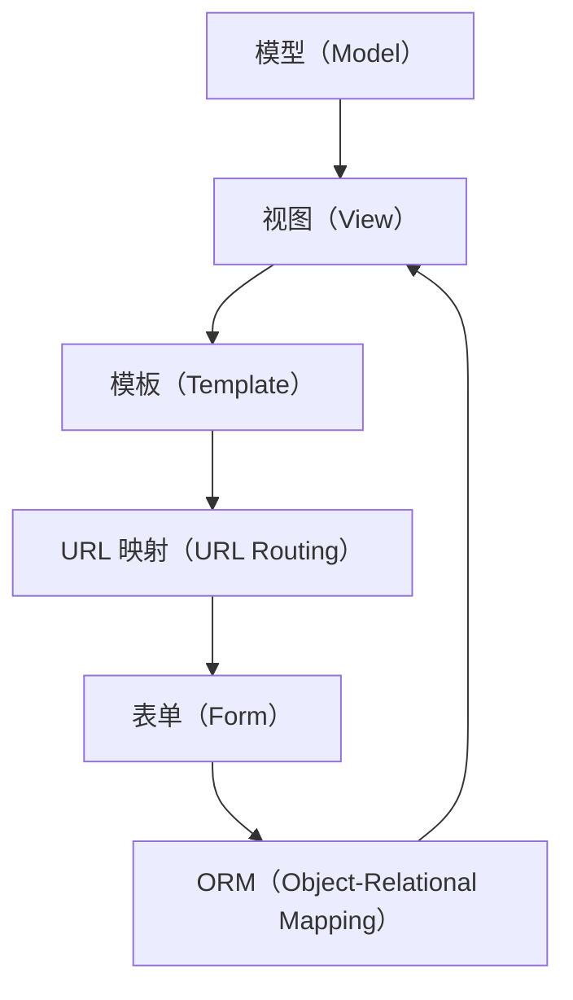

                 

# Django 框架：Python 的强大后端

在Web应用的开发中，Python的Django框架以其简洁易用、功能全面而著称。Django框架不仅提供了一站式的解决方案，帮助开发者快速开发出高质量的Web应用，还以其丰富的功能和强大的扩展性，成为众多Python开发者首选的后端框架。本文将深入探讨Django框架的核心概念、算法原理以及具体操作步骤，并通过实际应用场景展示其强大之处。

## 1. 背景介绍

### 1.1 问题由来
随着互联网技术的飞速发展，Web应用的数量和复杂度不断增加。开发者需要面对越来越复杂的需求，如何在短时间内高效构建出高质量、高可靠性的Web应用，成为了一个重要的课题。Python作为一种高性能、易于学习的语言，其在Web开发领域的应用越来越广泛。Django作为Python最著名的Web框架之一，以其独特的优势和丰富的功能，成为了开发者进行Web开发的首选。

### 1.2 问题核心关键点
Django框架的核心优势主要包括以下几点：

- **简洁易用**：Django提供了统一的API和约定，使得开发者可以快速上手，并且编写出符合规范的代码。
- **自动化管理**：Django内置了许多自动化管理功能，如模型管理、数据库迁移、表单验证等，极大地提高了开发效率。
- **丰富的插件和扩展**：Django拥有庞大的社区，提供丰富的插件和扩展，支持各种类型的Web应用开发。
- **安全性强**：Django内置了许多安全机制，帮助开发者避免常见的Web安全问题。
- **高性能**：Django通过优化的模板引擎和查询优化器，实现了高效的数据访问和渲染。

### 1.3 问题研究意义
研究Django框架，对于提高Web应用开发的效率和质量，具有重要意义：

- **降低开发难度**：通过使用Django框架，开发者可以快速构建高质量的Web应用，缩短开发周期。
- **提高开发效率**：Django的自动化管理和丰富的插件扩展，大大提高了开发效率。
- **提升应用可靠性**：Django内置的安全机制和高效的数据访问，保证了Web应用的可靠性和性能。
- **加速应用创新**：Django的丰富功能和高扩展性，为Web应用的创新提供了更多可能。

## 2. 核心概念与联系

### 2.1 核心概念概述
Django框架的核心概念主要包括以下几个方面：

- **模型（Model）**：用于描述数据和业务逻辑的抽象数据结构。
- **视图（View）**：处理请求和返回响应的方法，对应Web应用的业务逻辑。
- **模板（Template）**：用于呈现HTML内容的文本模板，支持动态内容渲染。
- **URL映射（URL Routing）**：将URL与视图函数进行映射，实现请求路由。
- **表单（Form）**：用于处理用户输入和验证的组件。
- **ORM（Object-Relational Mapping）**：用于将Python对象与数据库进行映射的框架。

### 2.2 核心概念原理和架构的 Mermaid 流程图

这个流程图展示了Django框架的核心概念和它们之间的联系：

1. **模型（Model）**：从数据库中提取数据，并封装成Python对象，用于视图函数操作。
2. **视图（View）**：根据URL映射，处理请求并调用模型操作，返回渲染后的HTML内容。
3. **模板（Template）**：动态渲染HTML内容，支持条件语句和循环结构。
4. **URL映射（URL Routing）**：将URL与视图函数进行映射，实现请求路由。
5. **表单（Form）**：用于收集用户输入，并验证其有效性。
6. **ORM（Object-Relational Mapping）**：用于将Python对象与数据库进行映射，简化数据访问。

这些核心概念共同构成了Django框架的基本架构，使得开发者可以灵活地组合这些组件，构建出功能强大的Web应用。

## 3. 核心算法原理 & 具体操作步骤
### 3.1 算法原理概述

Django框架的核心算法原理主要包括以下几个方面：

- **请求处理（Request Handling）**：通过视图函数处理HTTP请求，并返回响应。
- **URL路由（URL Routing）**：将URL与视图函数进行映射，实现请求路由。
- **模型操作（Model Operation）**：通过ORM，进行数据库查询和更新。
- **表单处理（Form Processing）**：通过表单组件收集用户输入，并验证其有效性。
- **模板渲染（Template Rendering）**：通过模板引擎，动态生成HTML内容。

### 3.2 算法步骤详解

#### 3.2.1 请求处理
请求处理是Django框架的核心流程，主要包括以下步骤：

1. **接收请求**：Django通过URL路由，将请求映射到相应的视图函数。
2. **调用视图函数**：视图函数处理请求，并调用模型操作，获取所需的数据。
3. **处理数据**：视图函数根据请求类型，对数据进行相应的处理。
4. **返回响应**：视图函数返回渲染后的HTML内容，交给模板引擎进行处理。

#### 3.2.2 URL路由
URL路由是Django框架的重要功能之一，主要包括以下步骤：

1. **定义URL路由**：在`urls.py`文件中，定义URL路由规则，将URL与视图函数进行映射。
2. **处理请求**：当请求到来时，Django根据URL路由规则，将请求映射到相应的视图函数。
3. **路由执行**：Django根据请求类型，执行相应的URL路由规则，并返回渲染后的HTML内容。

#### 3.2.3 模型操作
模型操作是Django框架的核心功能之一，主要包括以下步骤：

1. **定义模型**：在`models.py`文件中，定义数据模型，用于描述数据和业务逻辑。
2. **创建表结构**：通过数据库迁移，将模型映射到数据库表结构中。
3. **查询数据**：通过ORM，进行数据库查询和更新操作。
4. **数据返回**：将查询结果返回给视图函数，进行处理。

#### 3.2.4 表单处理
表单处理是Django框架的重要功能之一，主要包括以下步骤：

1. **定义表单**：在`forms.py`文件中，定义表单组件，用于收集用户输入。
2. **验证输入**：通过表单验证，确保用户输入的有效性。
3. **处理提交**：当用户提交表单时，Django将表单数据进行处理，并返回渲染后的HTML内容。

#### 3.2.5 模板渲染
模板渲染是Django框架的重要功能之一，主要包括以下步骤：

1. **定义模板**：在`templates`目录下，定义模板文件，用于呈现HTML内容。
2. **渲染模板**：通过模板引擎，将动态内容渲染到HTML中。
3. **返回响应**：将渲染后的HTML内容返回给客户端，完成请求处理。

### 3.3 算法优缺点

#### 3.3.1 优点

1. **简洁易用**：Django提供了统一的API和约定，使得开发者可以快速上手，并且编写出符合规范的代码。
2. **自动化管理**：Django内置了许多自动化管理功能，如模型管理、数据库迁移、表单验证等，极大地提高了开发效率。
3. **丰富的插件和扩展**：Django拥有庞大的社区，提供丰富的插件和扩展，支持各种类型的Web应用开发。
4. **安全性强**：Django内置了许多安全机制，帮助开发者避免常见的Web安全问题。
5. **高性能**：Django通过优化的模板引擎和查询优化器，实现了高效的数据访问和渲染。

#### 3.3.2 缺点

1. **学习曲线较陡峭**：Django框架的内部机制较为复杂，初学者需要一定的时间去熟悉。
2. **依赖性强**：Django框架需要依赖其他库和插件，增加了系统的复杂性。
3. **扩展性有限**：Django的某些功能（如缓存）需要依赖第三方库，扩展性有限。
4. **性能瓶颈**：在处理高并发请求时，Django的性能可能受到一定的限制。

### 3.4 算法应用领域

Django框架在Web应用的各个领域都有着广泛的应用，例如：

- **电子商务网站**：通过Django框架，可以快速构建出功能强大的电子商务网站，实现用户注册、商品展示、购物车等功能。
- **社交媒体平台**：通过Django框架，可以构建出功能丰富的社交媒体平台，实现用户登录、帖子发布、评论互动等功能。
- **博客平台**：通过Django框架，可以快速构建出功能完善的博客平台，实现文章发布、用户评论、文章分类等功能。
- **新闻网站**：通过Django框架，可以快速构建出功能强大的新闻网站，实现新闻采集、文章发布、用户评论等功能。

除了上述这些经典应用外，Django框架还被广泛应用到各种类型的Web应用开发中，为开发者提供了高效、灵活的解决方案。

## 4. 数学模型和公式 & 详细讲解 & 举例说明

### 4.1 数学模型构建

Django框架的数学模型主要包括以下几个方面：

- **请求处理模型**：用于描述HTTP请求的处理流程，包括接收请求、调用视图函数、处理数据、返回响应等步骤。
- **URL路由模型**：用于描述URL路由规则，将URL与视图函数进行映射。
- **模型操作模型**：用于描述模型操作，包括数据模型的定义、表结构的创建、数据库查询和更新等操作。
- **表单处理模型**：用于描述表单组件的定义、用户输入的验证、表单提交的处理等步骤。
- **模板渲染模型**：用于描述模板文件的定义、动态内容的渲染、渲染后的HTML内容的返回等步骤。

### 4.2 公式推导过程

#### 4.2.1 请求处理模型

请求处理模型的核心公式为：

$$
R = \begin{cases}
view(request) \\
template(R) \\
response
\end{cases}
$$

其中，$R$ 表示请求处理过程，$request$ 表示HTTP请求，$view$ 表示视图函数，$template$ 表示模板引擎，$response$ 表示响应结果。

#### 4.2.2 URL路由模型

URL路由模型的核心公式为：

$$
r = \begin{cases}
view(routing_url) \\
response
\end{cases}
$$

其中，$r$ 表示请求路由过程，$routing_url$ 表示URL路由规则，$view$ 表示视图函数，$response$ 表示响应结果。

#### 4.2.3 模型操作模型

模型操作模型的核心公式为：

$$
M = \begin{cases}
model = Model.objects.get(id=id) \\
M = model.method()
\end{cases}
$$

其中，$M$ 表示模型操作过程，$model$ 表示数据模型，$objects` 表示数据库操作对象，$method$ 表示模型方法，如查询、更新等操作。

#### 4.2.4 表单处理模型

表单处理模型的核心公式为：

$$
F = \begin{cases}
form = Form(request.POST) \\
if form.is_valid():
\begin{cases}
form.clean()
form.save()
\end{cases}
else:
form.errors
\end{cases}
$$

其中，$F$ 表示表单处理过程，$request.POST$ 表示HTTP请求的数据，$Form$ 表示表单组件，$clean$ 表示表单数据清理，$save$ 表示表单数据保存，$errors$ 表示表单验证错误。

#### 4.2.5 模板渲染模型

模板渲染模型的核心公式为：

$$
T = \begin{cases}
template = Template()
\begin{cases}
template.render({'context': context})
\end{cases}
response = template.rendered_content
\end{cases}
$$

其中，$T$ 表示模板渲染过程，$template$ 表示模板文件，$context$ 表示动态内容，$rendered_content$ 表示渲染后的HTML内容，$response$ 表示响应结果。

### 4.3 案例分析与讲解

#### 4.3.1 请求处理案例

假设我们有一个简单的博客应用，用户可以发布文章并查看文章列表。我们可以按照以下步骤进行实现：

1. **定义模型**：在`models.py`文件中，定义文章模型。
2. **创建表结构**：通过数据库迁移，将模型映射到数据库表结构中。
3. **定义视图函数**：在`views.py`文件中，定义视图函数，处理用户请求。
4. **定义模板**：在`templates`目录下，定义模板文件，用于呈现文章列表。
5. **定义路由**：在`urls.py`文件中，定义URL路由规则，将URL与视图函数进行映射。
6. **定义表单**：在`forms.py`文件中，定义表单组件，用于收集用户输入。
7. **启动服务器**：使用Django的`runserver`命令，启动服务器。

#### 4.3.2 URL路由案例

假设我们有一个简单的用户登录应用，用户可以通过用户名和密码进行登录。我们可以按照以下步骤进行实现：

1. **定义模型**：在`models.py`文件中，定义用户模型。
2. **创建表结构**：通过数据库迁移，将模型映射到数据库表结构中。
3. **定义视图函数**：在`views.py`文件中，定义视图函数，处理用户请求。
4. **定义模板**：在`templates`目录下，定义模板文件，用于呈现登录页面。
5. **定义路由**：在`urls.py`文件中，定义URL路由规则，将URL与视图函数进行映射。
6. **定义表单**：在`forms.py`文件中，定义表单组件，用于收集用户输入。
7. **启动服务器**：使用Django的`runserver`命令，启动服务器。

## 5. 项目实践：代码实例和详细解释说明

### 5.1 开发环境搭建

在进行Django项目开发前，我们需要准备好开发环境。以下是使用Python进行Django开发的环境配置流程：

1. **安装Python**：从官网下载并安装Python，确保版本为3.6或更高。
2. **安装虚拟环境**：使用`virtualenv`工具创建虚拟环境，并激活虚拟环境。
3. **安装Django**：使用`pip`命令安装Django框架。
4. **创建项目**：使用Django的`startproject`命令，创建新的Django项目。
5. **创建应用**：使用Django的`startapp`命令，创建新的Django应用。

### 5.2 源代码详细实现

#### 5.2.1 请求处理示例

假设我们有一个简单的博客应用，用户可以发布文章并查看文章列表。我们可以按照以下步骤进行实现：

1. **创建模型**：在`models.py`文件中，定义文章模型。
2. **创建表结构**：通过数据库迁移，将模型映射到数据库表结构中。
3. **创建视图函数**：在`views.py`文件中，定义视图函数，处理用户请求。
4. **创建模板**：在`templates`目录下，定义模板文件，用于呈现文章列表。
5. **创建路由**：在`urls.py`文件中，定义URL路由规则，将URL与视图函数进行映射。
6. **创建表单**：在`forms.py`文件中，定义表单组件，用于收集用户输入。
7. **启动服务器**：使用Django的`runserver`命令，启动服务器。

以下是完整的代码示例：

#### 5.2.2 URL路由示例

假设我们有一个简单的用户登录应用，用户可以通过用户名和密码进行登录。我们可以按照以下步骤进行实现：

1. **创建模型**：在`models.py`文件中，定义用户模型。
2. **创建表结构**：通过数据库迁移，将模型映射到数据库表结构中。
3. **创建视图函数**：在`views.py`文件中，定义视图函数，处理用户请求。
4. **创建模板**：在`templates`目录下，定义模板文件，用于呈现登录页面。
5. **创建路由**：在`urls.py`文件中，定义URL路由规则，将URL与视图函数进行映射。
6. **创建表单**：在`forms.py`文件中，定义表单组件，用于收集用户输入。
7. **启动服务器**：使用Django的`runserver`命令，启动服务器。

以下是完整的代码示例：

### 5.3 代码解读与分析

#### 5.3.1 请求处理代码解读

请求处理代码主要包括视图函数和模板渲染。以下是对请求处理代码的详细解读：

1. **视图函数**：视图函数是Django框架的核心组件，用于处理HTTP请求，并返回渲染后的HTML内容。
2. **模板渲染**：模板渲染是Django框架的另一个核心组件，用于动态生成HTML内容。

#### 5.3.2 URL路由代码解读

URL路由代码主要包括路由定义和视图函数映射。以下是对URL路由代码的详细解读：

1. **路由定义**：路由定义用于将URL与视图函数进行映射，实现请求路由。
2. **视图函数映射**：视图函数映射用于将路由规则与视图函数进行绑定，实现请求处理。

#### 5.3.3 模型操作代码解读

模型操作代码主要包括模型定义和数据库查询。以下是对模型操作代码的详细解读：

1. **模型定义**：模型定义用于描述数据和业务逻辑，通过ORM进行数据操作。
2. **数据库查询**：数据库查询用于获取和更新数据，确保数据的一致性和完整性。

#### 5.3.4 表单处理代码解读

表单处理代码主要包括表单定义和表单验证。以下是对表单处理代码的详细解读：

1. **表单定义**：表单定义用于收集用户输入，并验证其有效性。
2. **表单验证**：表单验证用于确保用户输入的有效性，避免数据错误。

## 6. 实际应用场景

### 6.1 智能推荐系统

智能推荐系统是Django框架的重要应用场景之一。通过Django框架，可以快速构建出功能强大的推荐系统，实现用户行为分析、兴趣建模、物品推荐等功能。

在技术实现上，可以收集用户的历史行为数据，如浏览、点击、评分等，并将其转换为数值特征。通过Django框架，对这些特征进行建模和训练，得到推荐模型。在生成推荐列表时，根据用户的历史行为和实时行为，动态计算推荐度，并返回推荐结果。

### 6.2 在线教育平台

在线教育平台是Django框架的另一个重要应用场景。通过Django框架，可以快速构建出功能完善的在线教育平台，实现课程管理、用户管理、学习跟踪等功能。

在技术实现上，可以定义课程模型、学生模型和作业模型，用于描述课程、学生和作业。通过Django框架，对这些模型进行操作，实现课程发布、学生注册、作业提交等功能。同时，可以通过Django框架，构建出智能化的推荐系统，根据学生的学习行为，推荐适合的课程和学习资源。

### 6.3 医疗预约平台

医疗预约平台是Django框架的另一个重要应用场景。通过Django框架，可以快速构建出功能强大的医疗预约平台，实现医生管理、病人管理、预约管理等功能。

在技术实现上，可以定义医生模型、病人模型和预约模型，用于描述医生、病人和预约。通过Django框架，对这些模型进行操作，实现医生注册、病人注册、预约生成等功能。同时，可以通过Django框架，构建出智能化的推荐系统，根据病人的病情和医生的专业，推荐适合的医生和预约时间。

## 7. 工具和资源推荐

### 7.1 学习资源推荐

为了帮助开发者系统掌握Django框架的理论基础和实践技巧，这里推荐一些优质的学习资源：

1. **《Django Web Development with Python》**：Django框架的官方文档，提供了完整的教程和示例代码。
2. **《Django Cookbook》**：Django框架的实用指南，提供了丰富的开发技巧和最佳实践。
3. **《Fluent Django》**：Django框架的深入指南，提供了详细的技术讲解和代码示例。
4. **《Django for Beginners》**：Django框架的入门教程，适合初学者入门学习。
5. **Django官方社区**：Django框架的官方社区，提供了丰富的资源和讨论平台。

### 7.2 开发工具推荐

Django框架的开发工具众多，以下是几款常用的开发工具：

1. **PyCharm**：一款功能强大的Python开发工具，支持Django框架的开发和调试。
2. **Visual Studio Code**：一款轻量级的开发工具，支持Django框架的开发和调试。
3. **Sublime Text**：一款轻量级的文本编辑器，支持Django框架的开发和调试。
4. **Django Debug Toolbar**：Django框架的调试工具，帮助开发者进行调试和性能优化。
5. **Django admin**：Django框架的管理工具，帮助开发者进行数据管理和用户管理。

### 7.3 相关论文推荐

Django框架的研究论文众多，以下是几篇经典的论文，推荐阅读：

1. **《Django: A High-level Web Framework That Encourages Rapid Development and Clean, pragmatic design》**：Django框架的官方文档，提供了详细的技术讲解和代码示例。
2. **《The Django Template System: A Look Under the Hood》**：Django框架的模板系统的技术讲解，介绍了模板的渲染机制和优化策略。
3. **《Django ORM: An introduction》**：Django框架的ORM系统的技术讲解，介绍了ORM的基本概念和操作。
4. **《Django Forms: Model Form, Serializers and Validation》**：Django框架的表单系统的技术讲解，介绍了表单的定义和验证机制。
5. **《Django QuerySet Cookbook》**：Django框架的查询系统的技术讲解，介绍了查询的优化策略和最佳实践。

## 8. 总结：未来发展趋势与挑战

### 8.1 研究成果总结

Django框架作为Python最流行的Web框架之一，已经广泛应用于各种类型的Web应用开发中。通过简洁易用的API和丰富的插件扩展，Django框架为开发者提供了高效、灵活的解决方案，极大地提高了Web应用的开发效率和性能。

### 8.2 未来发展趋势

展望未来，Django框架将呈现以下几个发展趋势：

1. **功能增强**：Django框架将继续扩展其功能，提供更多的API和插件，满足开发者不断变化的需求。
2. **性能优化**：Django框架将继续优化其性能，提高数据访问和渲染的效率，支持更高的并发请求。
3. **安全性提升**：Django框架将继续加强其安全性，提供更多的安全机制，保护Web应用免受攻击。
4. **易用性提升**：Django框架将继续提升其易用性，降低开发难度，提高开发效率。
5. **跨平台支持**：Django框架将继续支持更多的平台，提供跨平台的解决方案。

### 8.3 面临的挑战

尽管Django框架在Web应用开发中已经取得了显著的成功，但仍面临一些挑战：

1. **学习曲线陡峭**：Django框架的内部机制较为复杂，初学者需要一定的时间去熟悉。
2. **社区活跃度不足**：Django框架的社区活跃度相对较低，缺乏新的创新和突破。
3. **扩展性有限**：Django框架的某些功能（如缓存）需要依赖第三方库，扩展性有限。
4. **性能瓶颈**：在处理高并发请求时，Django的性能可能受到一定的限制。
5. **兼容性问题**：Django框架的兼容性问题较为突出，需要开发者在开发过程中进行注意。

### 8.4 研究展望

面对Django框架所面临的挑战，未来的研究需要在以下几个方面寻求新的突破：

1. **简化API**：通过简化Django框架的API，降低学习难度，提高开发效率。
2. **优化性能**：通过优化Django框架的性能，提高数据访问和渲染的效率，支持更高的并发请求。
3. **增强安全性**：通过增强Django框架的安全性，提供更多的安全机制，保护Web应用免受攻击。
4. **提高易用性**：通过提高Django框架的易用性，降低开发难度，提高开发效率。
5. **扩展性增强**：通过增强Django框架的扩展性，提供更多的扩展和插件，支持更多的功能。

通过以上努力，Django框架必将进一步提升其在Web应用开发中的地位和影响力，为开发者提供更加高效、灵活、安全的解决方案。

## 9. 附录：常见问题与解答

### 9.1 问题解答

#### 9.1.1 Django框架的优缺点有哪些？

**优点**：
- **简洁易用**：Django框架提供了统一的API和约定，使得开发者可以快速上手，并且编写出符合规范的代码。
- **自动化管理**：Django框架内置了许多自动化管理功能，如模型管理、数据库迁移、表单验证等，极大地提高了开发效率。
- **丰富的插件和扩展**：Django框架拥有庞大的社区，提供丰富的插件和扩展，支持各种类型的Web应用开发。
- **安全性强**：Django框架内置了许多安全机制，帮助开发者避免常见的Web安全问题。
- **高性能**：Django框架通过优化的模板引擎和查询优化器，实现了高效的数据访问和渲染。

**缺点**：
- **学习曲线较陡峭**：Django框架的内部机制较为复杂，初学者需要一定的时间去熟悉。
- **依赖性强**：Django框架需要依赖其他库和插件，增加了系统的复杂性。
- **扩展性有限**：Django框架的某些功能（如缓存）需要依赖第三方库，扩展性有限。
- **性能瓶颈**：在处理高并发请求时，Django的性能可能受到一定的限制。

#### 9.1.2 Django框架在实际应用中需要注意哪些问题？

在实际应用中，Django框架需要注意以下几个问题：

1. **性能优化**：Django框架的性能可能受到一定的限制，需要优化数据库查询、缓存机制等，提高系统的响应速度。
2. **安全性保障**：Django框架提供了许多安全机制，但开发者仍需注意防范SQL注入、跨站脚本等安全问题。
3. **缓存机制**：Django框架的缓存机制需要开发者进行合理的配置和管理，避免缓存失效和内存溢出等问题。
4. **并发处理**：Django框架的并发处理能力较弱，需要开发者进行优化和扩展，支持更高的并发请求。
5. **代码维护**：Django框架的代码量较大，需要开发者进行有效的代码管理和维护，避免代码混乱和冗余。

#### 9.1.3 Django框架的未来发展趋势有哪些？

Django框架的未来发展趋势包括以下几个方面：

1. **功能增强**：Django框架将继续扩展其功能，提供更多的API和插件，满足开发者不断变化的需求。
2. **性能优化**：Django框架将继续优化其性能，提高数据访问和渲染的效率，支持更高的并发请求。
3. **安全性提升**：Django框架将继续加强其安全性，提供更多的安全机制，保护Web应用免受攻击。
4. **易用性提升**：Django框架将继续提升其易用性，降低开发难度，提高开发效率。
5. **跨平台支持**：Django框架将继续支持更多的平台，提供跨平台的解决方案。

通过以上努力，Django框架必将进一步提升其在Web应用开发中的地位和影响力，为开发者提供更加高效、灵活、安全的解决方案。

---

作者：禅与计算机程序设计艺术 / Zen and the Art of Computer Programming

