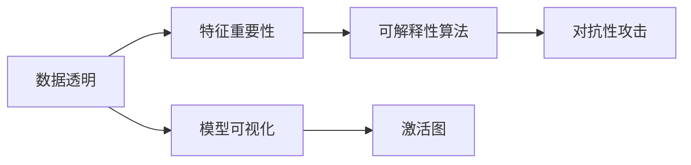

                 

# Explainable AI (XAI)原理与代码实例讲解

## 1. 背景介绍

在人工智能(AI)快速发展的今天，我们越来越依赖于各种基于机器学习的算法来做出决策。然而，这些算法的"黑盒"特性使得我们难以理解其内部的工作原理，也无法信任这些决策。这一问题在金融、医疗、司法等高风险领域尤为严重，因为错误的决策可能会带来严重的后果。因此，研究可解释的人工智能(XAI)技术变得尤为重要。

### 1.1 问题由来

可解释性是人工智能技术应用过程中的一个核心问题。传统的统计模型，如决策树、线性回归等，其结果具有明显的可解释性，可以清晰地展示其背后的逻辑。但随着深度学习等复杂模型的兴起，这种解释性逐渐丧失，模型的决策过程变得难以理解。

近年来，随着深度学习在各行各业中的应用日益广泛，缺乏可解释性的AI模型已经成为制约其大规模应用的主要瓶颈。因此，研究可解释的人工智能技术，从模型、数据、算法等多个角度增强模型的透明度和可解释性，成为学术界和工业界共同关注的焦点。

### 1.2 问题核心关键点

XAI技术旨在通过各种手段和方法，使得AI模型的决策过程变得透明和可解释，便于用户理解和信任。其核心在于如何在保证模型性能的同时，尽可能多地披露模型的内部信息，使其对人类用户具有"可理解性"。

主要包括以下几个关键点：
- 数据透明：使得模型对输入数据的敏感性清晰可见，便于理解模型的推理过程。
- 模型透明：展示模型对输入数据的映射关系，解释模型为何作出特定决策。
- 算法透明：揭示模型的计算过程，让模型行为可被模拟和预测。

## 2. 核心概念与联系

### 2.1 核心概念概述

为了更好地理解XAI技术，本节将介绍几个密切相关的核心概念：

- **可解释人工智能(XAI)**：指通过各种技术手段，使AI模型的决策过程变得透明和可理解，便于用户理解和使用。
- **特征重要性**：指输入数据中各特征对模型输出的影响程度，用于解释模型决策依据。
- **模型可视化**：指通过可视化手段展示模型结构、参数、计算过程等，便于用户理解模型的行为。
- **激活图**：指展示模型在处理输入数据时，各个神经元之间的激活关系，用于分析模型内部的计算路径。
- **可解释性算法**：指利用特定算法和工具，如LIME、SHAP等，生成模型输出的解释，帮助用户理解模型行为。
- **对抗性攻击**：指利用特定手段，使模型输出错误结果，以揭示模型的不稳定性。

这些核心概念之间存在着紧密的联系，共同构成了XAI的研究框架：通过特征重要性和模型可视化揭示模型内部机制，结合可解释性算法生成模型输出的解释，最后通过对抗性攻击验证模型的鲁棒性和稳定性。

### 2.2 核心概念原理和架构的 Mermaid 流程图



这个流程图展示了XAI核心概念之间的逻辑关系：

1. 数据透明：通过特征重要性揭示输入数据对模型输出的影响。
2. 模型可视化：展示模型结构和激活图，帮助理解模型内部机制。
3. 可解释性算法：利用LIME、SHAP等算法生成模型输出的解释。
4. 对抗性攻击：检验模型鲁棒性和稳定性，揭示模型的不足。

这些概念共同构成了解释AI模型的全过程，旨在使得模型决策过程透明、可理解。

## 3. 核心算法原理 & 具体操作步骤

### 3.1 算法原理概述

XAI技术的核心在于通过各种技术手段，使AI模型的决策过程变得透明和可理解。其主要思想是：通过生成模型输出的解释，帮助用户理解模型的行为，从而增加对模型的信任度。

常见的XAI技术包括特征重要性分析、模型可视化、可解释性算法等。这些技术的目标都是揭示模型决策背后的逻辑，增强模型的透明度和可解释性。

### 3.2 算法步骤详解

以下以特征重要性分析为例，详细讲解XAI技术的应用步骤：

**Step 1: 收集数据和模型**
- 收集包含模型输出的数据集，包括输入特征和预测结果。
- 选择合适的机器学习模型，如随机森林、神经网络等。

**Step 2: 计算特征重要性**
- 计算每个特征对模型输出的贡献程度，可以使用平均绝对误差(Average Absolute Error, AAE)、Gini系数、Shapley值等指标。
- 常见的特征重要性计算方法包括：
  - 回归模型的特征重要性：利用模型系数或方差来计算。
  - 决策树的特征重要性：利用信息增益或基尼系数计算。
  - 神经网络的特征重要性：利用LIME、SHAP等算法计算。

**Step 3: 生成特征重要性解释**
- 将特征重要性可视化，通常使用热力图、柱状图等形式展示。
- 通过解释图表，帮助用户理解每个特征对模型输出的影响。

**Step 4: 验证解释可靠性**
- 通过对抗性攻击等手段，验证特征重要性的准确性和可靠性。
- 确认解释结果不会受到数据噪声或模型微小扰动的干扰。

**Step 5: 应用解释结果**
- 将特征重要性解释应用到具体场景中，指导数据处理、模型优化等操作。
- 利用特征重要性，优化模型输入，提高模型性能。

### 3.3 算法优缺点

XAI技术的优点包括：
1. 提高模型可信度：通过解释模型行为，增强用户对模型的信任度，降低决策风险。
2. 优化模型性能：通过特征重要性分析，优化模型输入，提高模型预测精度。
3. 增强数据理解：通过模型可视化，帮助用户理解数据特征与模型输出的关系。

同时，XAI技术也存在一些局限性：
1. 解释复杂度：解释模型可能变得复杂，增加理解难度。
2. 解释准确性：解释结果可能存在偏差，无法完全还原模型决策过程。
3. 解释时效性：生成解释的过程可能耗时较长，影响实时性。
4. 对抗性鲁棒性：模型可能对抗性攻击的影响下，产生误导性解释。

尽管存在这些局限性，但XAI技术依然是大规模应用AI模型的重要手段，具有广泛的应用前景。

### 3.4 算法应用领域

XAI技术在多个领域得到了广泛应用，包括但不限于：

- 金融风控：解释模型对信用风险、欺诈检测等决策的依据，帮助监管机构和金融机构提升决策质量。
- 医疗诊断：解释模型对疾病诊断的依据，辅助医生理解诊断过程，提高诊断准确性。
- 司法判决：解释模型对案件判定的依据，增强司法过程的透明性和公正性。
- 智能推荐：解释模型对用户推荐物品的依据，提高推荐系统可解释性和用户满意度。
- 网络安全：解释模型对异常行为检测的依据，帮助网络管理员识别威胁，提高安全防护能力。

这些应用场景展示了XAI技术在现实世界中的重要价值，为AI技术的普及和应用提供了重要保障。

## 4. 数学模型和公式 & 详细讲解

### 4.1 数学模型构建

假设模型为$f(x;\theta)$，其中$x$为输入数据，$\theta$为模型参数。设模型输出为$y$，定义特征重要性为$I(x_i)$，则特征重要性分析的数学模型可定义为：

$$
I(x_i) = \frac{\partial f(x;\theta)}{\partial x_i} \cdot \frac{1}{\|f(x;\theta)\|_2}
$$

其中，$\frac{\partial f(x;\theta)}{\partial x_i}$表示模型对输入$x_i$的偏导数，$\|f(x;\theta)\|_2$表示模型输出的$L_2$范数。

### 4.2 公式推导过程

以神经网络为例，其特征重要性计算通常使用LIME、SHAP等算法。以LIME算法为例，其核心思想是使用局部线性模型来拟合原始模型的输出，从而计算每个特征的重要性。

假设模型$f$为一个神经网络，输入数据为$x$，预测结果为$\hat{y}$。LIME算法通过生成K个局部线性模型，计算每个模型的预测结果$\hat{y}_k$，然后通过比较模型输出与局部模型的预测结果，计算每个特征的重要性$I(x_i)$。

其推导过程如下：

1. 为输入$x$生成K个局部线性模型：
   - 在$x$的每个特征维度上加入噪声，生成$x_k$。
   - 用$x_k$训练一个线性模型，预测结果为$\hat{y}_k$。

2. 计算模型输出与局部模型的差异：
   - 计算原始模型和每个局部模型的预测差异$\Delta_k$。

3. 计算特征重要性：
   - 计算特征$x_i$的贡献$\Delta_i$，即$\Delta_i = \frac{\Delta_k}{I_k}$，其中$I_k$为$x_k$在特征$x_i$上的权重。

通过上述推导，我们可以使用LIME算法计算神经网络的特征重要性，帮助用户理解模型行为。

### 4.3 案例分析与讲解

以下以LIME算法为例，进行一个具体的案例分析。假设我们有一个二分类模型，输入特征为年龄、性别、收入等，模型输出为是否存在贷款违约。

**Step 1: 数据准备**
- 收集包含年龄、性别、收入等特征的数据集，以及模型的预测结果。
- 将数据集划分为训练集和测试集。

**Step 2: 生成局部线性模型**
- 在年龄特征上加入噪声，生成10个局部数据。
- 用每个局部数据训练一个线性模型，预测结果为$\hat{y}_k$。

**Step 3: 计算模型输出与局部模型的差异**
- 计算原始模型和每个局部模型的预测差异$\Delta_k$。

**Step 4: 计算特征重要性**
- 计算每个特征$x_i$的贡献$\Delta_i$。
- 将特征重要性可视化，生成热力图。

通过LIME算法生成的特征重要性热力图，可以清晰地展示每个特征对模型输出的贡献程度，帮助用户理解模型的决策依据。

## 5. 项目实践：代码实例和详细解释说明

### 5.1 开发环境搭建

在进行XAI技术实践前，我们需要准备好开发环境。以下是使用Python进行LIME开发的流程：

1. 安装Anaconda：从官网下载并安装Anaconda，用于创建独立的Python环境。

2. 创建并激活虚拟环境：
```bash
conda create -n lime-env python=3.8 
conda activate lime-env
```

3. 安装LIME库：
```bash
pip install lime
```

4. 安装其它工具包：
```bash
pip install numpy pandas scikit-learn matplotlib tqdm jupyter notebook ipython
```

完成上述步骤后，即可在`lime-env`环境中开始XAI技术实践。

### 5.2 源代码详细实现

以下是一个简单的Python代码示例，使用LIME算法计算神经网络的特征重要性：

```python
from lime.lime_tabular import LimeTabularExplainer
from sklearn.neural_network import MLPClassifier
from sklearn.datasets import make_classification
from sklearn.model_selection import train_test_split
import numpy as np
import pandas as pd
import lime
import matplotlib.pyplot as plt

# 生成数据集
X, y = make_classification(n_samples=1000, n_features=5, n_informative=3, n_classes=2, random_state=42)

# 划分训练集和测试集
X_train, X_test, y_train, y_test = train_test_split(X, y, test_size=0.2, random_state=42)

# 训练模型
clf = MLPClassifier(hidden_layer_sizes=(5, 5), activation='relu', max_iter=1000, solver='sgd', random_state=42)
clf.fit(X_train, y_train)

# 创建LIME解释器
explainer = LimeTabularExplainer(X_train, feature_names=['feature_0', 'feature_1', 'feature_2', 'feature_3', 'feature_4'], discrete_features=None, categorical_features=None)

# 解释器设置参数
explainer.set_top_labels(y_train)

# 计算特征重要性
for i in range(5):
    X_instance = X_test[i:i+1]
    lime_instance = explainer.explain_instance(X_instance, clf.predict_proba, num_features=i+1)
    print("特征 {} 的重要性：{}".format(i, lime_instance.feature_importances))
    plt.bar(range(len(X_instance[0])), lime_instance.feature_importances, color='b')
    plt.show()
```

### 5.3 代码解读与分析

让我们再详细解读一下关键代码的实现细节：

**LIME解释器初始化**
- `X_train`：输入数据的训练集。
- `feature_names`：输入数据中各个特征的名称。

**设置标签**
- `set_top_labels(y_train)`：设置模型预测的目标标签。

**计算特征重要性**
- `explain_instance(X_instance, clf.predict_proba, num_features=i+1)`：对输入数据进行解释，生成特征重要性。
- `feature_importances`：特征重要性数组，展示了每个特征对模型输出的贡献程度。

通过上述代码，我们可以使用LIME算法计算神经网络的特征重要性，并生成可视化结果。

### 5.4 运行结果展示

运行上述代码，输出特征重要性数组，并生成热力图。以特征重要性热力图为例，可以直观展示每个特征对模型输出的贡献程度，帮助用户理解模型的决策依据。

## 6. 实际应用场景

### 6.1 金融风控

在金融风控领域，模型决策的透明度尤为重要。通过特征重要性分析，银行和金融机构可以清楚地理解模型对信用风险、欺诈检测等决策的依据，帮助监管机构和内部风险管理部门提升决策质量。

在实际应用中，银行可以对客户申请贷款的数据进行特征重要性分析，找出导致模型拒贷或放贷的关键因素，从而优化贷款审批流程，提高贷款审批的准确性和效率。

### 6.2 医疗诊断

医疗诊断过程中，模型决策的透明度同样至关重要。通过特征重要性分析，医生可以了解模型对疾病诊断的依据，辅助医生理解诊断过程，提高诊断准确性。

在实际应用中，医疗系统可以对患者的检查结果和病史数据进行特征重要性分析，找出影响诊断的关键因素，从而提供更为精准的医疗建议，提升患者治疗效果。

### 6.3 司法判决

在司法判决过程中，模型的透明度有助于提升司法过程的公正性和透明度。通过特征重要性分析，司法机关可以了解模型对案件判定的依据，增强司法过程的可解释性和公正性。

在实际应用中，司法系统可以对案件审判数据进行特征重要性分析，找出影响判决的关键因素，从而提供更为公正的判决依据，提升司法审判的公正性和可解释性。

### 6.4 智能推荐

在智能推荐系统领域，模型决策的透明度同样至关重要。通过特征重要性分析，推荐系统可以清楚地理解模型对用户推荐物品的依据，帮助用户理解推荐逻辑，提高推荐系统可解释性和用户满意度。

在实际应用中，推荐系统可以对用户行为数据进行特征重要性分析，找出影响推荐的关键因素，从而提供更为精准的推荐结果，提升用户体验。

## 7. 工具和资源推荐

### 7.1 学习资源推荐

为了帮助开发者系统掌握XAI理论基础和实践技巧，这里推荐一些优质的学习资源：

1. 《The Master Algorithm: How the Quest for the Ultimate Learning Machine Will Remake Our World》：作者Pedro Domingos，介绍了多种机器学习算法及其应用，包括XAI技术。

2. Coursera《Machine Learning》课程：由斯坦福大学教授Andrew Ng主讲，涵盖机器学习基本概念和应用，包括XAI技术。

3. CS224N《Natural Language Processing with Deep Learning》课程：斯坦福大学开设的NLP明星课程，涵盖多种NLP任务及其解释性分析。

4. 《Hands-On Machine Learning with Scikit-Learn, Keras, and TensorFlow》：作者Aurélien Géron，介绍了多种机器学习算法及其应用，包括XAI技术。

5. 《Explainable Artificial Intelligence》：一本全面的XAI技术综述书籍，涵盖多种XAI方法及其应用。

通过这些资源的学习实践，相信你一定能够快速掌握XAI技术的精髓，并用于解决实际的AI问题。

### 7.2 开发工具推荐

高效的开发离不开优秀的工具支持。以下是几款用于XAI技术开发的常用工具：

1. Anaconda：用于创建和管理虚拟环境，方便不同项目之间的隔离。

2. Jupyter Notebook：用于编写和运行Python代码，支持交互式调试和可视化。

3. Scikit-Learn：Python机器学习库，提供了多种常用的机器学习算法及其应用。

4. TensorFlow：由Google主导开发的深度学习框架，支持多种复杂模型及其解释性分析。

5. Weights & Biases：用于记录和可视化模型训练过程的工具，支持多种机器学习框架。

6. TensorBoard：用于可视化模型训练和推理过程的工具，支持多种深度学习框架。

合理利用这些工具，可以显著提升XAI技术的开发效率，加快创新迭代的步伐。

### 7.3 相关论文推荐

XAI技术的研究源于学界的持续研究。以下是几篇奠基性的相关论文，推荐阅读：

1. Explaining Model Predictions: A Case Study with LIME：LIME算法的原始论文，介绍了LIME算法的基本思想和实现细节。

2. Axiomatic Attribution for Deep Networks：提出了多种特征重要性计算方法，用于解释深度神经网络模型的行为。

3. SHAP: A Unified Approach to Interpreting Model Predictions：介绍了SHAP算法的实现细节及其应用。

4. Deep Learning with Shallow Interpretations：介绍了多种可解释性方法及其应用，包括LIME、SHAP等。

这些论文代表了大规模应用AI模型的解释性方法的发展脉络。通过学习这些前沿成果，可以帮助研究者把握学科前进方向，激发更多的创新灵感。

## 8. 总结：未来发展趋势与挑战

### 8.1 总结

本文对基于机器学习的可解释性技术进行了全面系统的介绍。首先阐述了XAI技术的研究背景和意义，明确了特征重要性、模型可视化、可解释性算法等核心概念的联系。其次，从原理到实践，详细讲解了XAI技术的应用步骤，提供了基于LIME算法的代码实现和运行结果展示。同时，本文还探讨了XAI技术在金融、医疗、司法等领域的实际应用，展示了XAI技术在现实世界中的重要价值。

通过本文的系统梳理，可以看到，XAI技术在提升AI模型透明度和可解释性方面具有重要意义，为AI模型的应用和推广提供了重要保障。未来，伴随数据和算法的多样化发展，XAI技术还将进一步拓展其应用范围，成为AI技术落地应用的重要手段。

### 8.2 未来发展趋势

展望未来，XAI技术将呈现以下几个发展趋势：

1. 多模态解释方法：现有的XAI方法主要聚焦于单模态数据，未来将逐步拓展到多模态数据的解释。通过融合不同模态的信息，提供更全面、精准的解释结果。

2. 动态解释技术：现有的XAI方法主要基于静态数据进行解释，未来将逐步拓展到动态数据的解释。通过实时分析数据变化，动态生成解释结果，提升模型的鲁棒性和适应性。

3. 解释结果的普适性：现有的XAI方法主要聚焦于特定领域的解释，未来将逐步拓展到普适性的解释。通过建立通用的解释模型，适用于多种领域和任务。

4. 解释与决策的结合：现有的XAI方法主要聚焦于模型的解释，未来将逐步拓展到解释与决策的结合。通过解释结果指导模型优化，提升决策的透明度和可解释性。

5. 对抗性解释：现有的XAI方法主要聚焦于解释模型输出的准确性，未来将逐步拓展到对抗性解释。通过对抗性解释技术，揭示模型对对抗样本的鲁棒性。

以上趋势凸显了XAI技术的广阔前景。这些方向的探索发展，必将进一步提升AI模型的透明度和可解释性，为AI技术的落地应用提供重要保障。

### 8.3 面临的挑战

尽管XAI技术已经取得了一定进展，但在迈向更加智能化、普适化应用的过程中，它仍面临着诸多挑战：

1. 解释复杂度：解释模型的复杂度不断增加，难以理解其内部逻辑。

2. 解释准确性：解释结果可能存在偏差，无法完全还原模型决策过程。

3. 解释时效性：生成解释的过程可能耗时较长，影响实时性。

4. 对抗性鲁棒性：模型可能对抗性攻击的影响下，产生误导性解释。

5. 解释结果的可靠性：解释结果的可靠性有待验证，可能受到数据噪声或模型微小扰动的干扰。

6. 解释的可解释性：解释结果的可视化可能过于复杂，难以理解。

尽管存在这些挑战，但XAI技术依然是大规模应用AI模型的重要手段，具有广泛的应用前景。

### 8.4 研究展望

面对XAI面临的这些挑战，未来的研究需要在以下几个方面寻求新的突破：

1. 解释方法的简化：通过优化算法和数据预处理，简化解释过程，降低解释复杂度。

2. 解释结果的准确性提升：通过引入更多的特征选择和模型优化技术，提升解释结果的准确性。

3. 实时解释技术的开发：通过优化解释算法的计算复杂度，实现实时解释，提升解释的时效性。

4. 对抗性解释技术的开发：通过对抗性攻击等手段，提高模型的鲁棒性，生成可靠的解释结果。

5. 解释结果的可视化优化：通过改进解释结果的可视化技术，使其更加直观、易懂。

6. 解释结果的可靠性验证：通过引入更多验证手段，确保解释结果的可靠性。

这些研究方向的探索，必将引领XAI技术迈向更高的台阶，为AI技术的普及和应用提供重要保障。相信随着学界和产业界的共同努力，这些挑战终将一一被克服，XAI技术必将在构建安全、可靠、可解释、可控的智能系统中扮演越来越重要的角色。

## 9. 附录：常见问题与解答

**Q1: 特征重要性分析在实际应用中有什么作用？**

A: 特征重要性分析在实际应用中具有以下作用：
1. 揭示数据特征与模型输出的关系：帮助用户理解哪些数据特征对模型输出有重要影响。
2. 优化模型输入：根据特征重要性分析结果，优化模型输入，提高模型性能。
3. 改进数据处理：根据特征重要性分析结果，改进数据处理过程，减少噪声和冗余。
4. 增强决策透明度：通过特征重要性分析，增强模型决策的透明度和可解释性，增加用户信任度。

**Q2: 有哪些常用的XAI技术？**

A: 常用的XAI技术包括：
1. 特征重要性分析：通过计算特征对模型输出的贡献程度，揭示数据特征与模型输出的关系。
2. 模型可视化：展示模型结构、参数、计算过程等，帮助用户理解模型行为。
3. 可解释性算法：利用特定算法和工具，如LIME、SHAP等，生成模型输出的解释，帮助用户理解模型行为。
4. 对抗性攻击：通过对抗性攻击等手段，揭示模型的不稳定性，增强模型鲁棒性。

**Q3: 如何生成解释结果？**

A: 生成解释结果的过程包括以下步骤：
1. 收集数据和模型：收集包含模型输出的数据集，选择机器学习模型。
2. 计算特征重要性：通过回归模型、决策树、神经网络等算法，计算每个特征对模型输出的贡献程度。
3. 生成解释图表：将特征重要性可视化，生成热力图、柱状图等形式。
4. 验证解释可靠性：通过对抗性攻击等手段，验证解释结果的准确性和可靠性。

通过上述步骤，可以生成可靠的解释结果，帮助用户理解模型的决策过程。

**Q4: 特征重要性分析的主要方法有哪些？**

A: 特征重要性分析的主要方法包括：
1. 回归模型的特征重要性：利用模型系数或方差计算。
2. 决策树的特征重要性：利用信息增益或基尼系数计算。
3. 神经网络的特征重要性：利用LIME、SHAP等算法计算。
4. 集成模型的特征重要性：利用集成学习方法计算。

这些方法各有优缺点，应根据具体应用场景选择合适的方法。

**Q5: 为什么需要解释人工智能模型？**

A: 解释人工智能模型具有以下重要作用：
1. 增强用户信任度：通过解释模型行为，增强用户对模型的信任度，降低决策风险。
2. 优化模型性能：通过特征重要性分析，优化模型输入，提高模型预测精度。
3. 增强数据理解：通过模型可视化，帮助用户理解数据特征与模型输出的关系。
4. 促进模型应用：通过解释模型行为，促进模型在各行业的应用，提升AI技术的普及度。

**Q6: 对抗性攻击在XAI技术中有什么作用？**

A: 对抗性攻击在XAI技术中的作用包括：
1. 检验解释结果的可靠性：通过对抗性攻击等手段，验证解释结果的准确性和可靠性。
2. 揭示模型的鲁棒性：通过对抗性攻击，揭示模型对异常样本的鲁棒性，增强模型的稳定性。
3. 指导模型优化：通过对抗性攻击，指导模型优化，减少模型脆弱性。

通过对抗性攻击，可以更好地理解和改进模型，提升模型的解释性和鲁棒性。

---

作者：禅与计算机程序设计艺术 / Zen and the Art of Computer Programming

