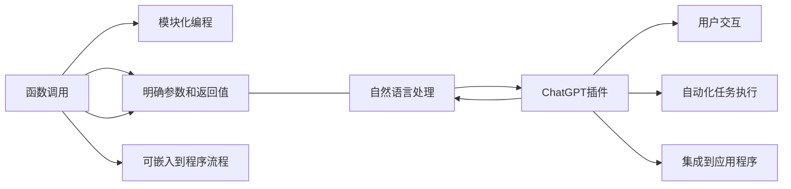

                 

# Function Calling vs ChatGPT plugin

> 关键词：函数调用, ChatGPT插件, API接口, 用户交互, 技术比较, 软件开发, 自动化任务

## 1. 背景介绍

### 1.1 问题由来

在软件开发领域，函数调用和ChatGPT插件是两种常见的操作方式。函数调用是编程语言中的基础构建块，用于执行特定任务或算法。而ChatGPT插件则是人工智能技术在应用程序开发中的创新应用，通过与ChatGPT进行对话，开发者可以自动化地执行复杂的任务，如数据处理、代码生成、API调用等。本文旨在比较这两种方式，分析它们的优缺点，以及在不同应用场景下的适用性。

### 1.2 问题核心关键点

函数调用和ChatGPT插件虽然看似不同，但它们都涉及到程序与外部服务或模块的交互，是编程自动化中的两种重要方式。

- **函数调用**：
  - 基础构建块，用于执行特定任务或算法。
  - 需要明确定义函数参数和返回值。
  - 调用顺序和执行流程清晰可控。
  - 可嵌入到程序流程中，实现高效的模块化设计。

- **ChatGPT插件**：
  - 基于自然语言处理的AI技术，实现用户与系统的交互。
  - 需要与外部API或服务进行数据交换。
  - 具有更强的灵活性和自由度，可以执行复杂任务。
  - 需要处理自然语言的多样性和复杂性，实现精准理解。

这两种方式各自有其优劣，本文将详细探讨它们的异同点，帮助开发者选择最合适的开发方式。

## 2. 核心概念与联系

### 2.1 核心概念概述

- **函数调用**：在程序中，通过调用其他函数来实现特定功能，是一种模块化编程的体现。函数调用遵循明确的结构，易于理解和维护。

- **ChatGPT插件**：一种利用自然语言处理技术的插件，通过与ChatGPT进行对话，实现自动化任务执行。插件可以集成到各种应用程序中，提供智能化的辅助功能。

这两种方式虽然底层技术不同，但都涉及到编程自动化和任务执行，可以相互借鉴和学习。

### 2.2 核心概念原理和架构的 Mermaid 流程图



这个流程图展示了函数调用和ChatGPT插件的基本工作原理和架构：函数调用通过明确参数和返回值，嵌入到程序流程中；而ChatGPT插件通过自然语言处理和用户交互，实现自动化任务执行，并可以集成到各种应用程序中。

## 3. 核心算法原理 & 具体操作步骤

### 3.1 算法原理概述

函数调用和ChatGPT插件的算法原理本质上是不同的，但它们的执行过程都是通过调用API或服务来实现。

- **函数调用**：函数调用遵循程序语言的规则，通过参数传递和返回值，实现特定功能。函数调用通常基于静态编程语言，如Python、Java等，通过API接口调用实现。

- **ChatGPT插件**：ChatGPT插件通过与API或服务的交互，实现自然语言处理和任务执行。ChatGPT插件通常基于动态编程语言，如JavaScript、Python等，通过调用ChatGPT API实现。

### 3.2 算法步骤详解

#### 3.2.1 函数调用步骤

1. **定义函数**：在程序中定义需要执行的任务函数，包括参数和返回值。
2. **调用函数**：通过函数名和参数列表调用定义的函数，执行任务。
3. **处理返回值**：根据函数返回值处理任务执行结果。

```python
def calculate_sum(a, b):
    return a + b

result = calculate_sum(2, 3)
print(result)  # 输出 5
```

#### 3.2.2 ChatGPT插件步骤

1. **安装插件**：在应用程序中集成ChatGPT插件，如使用OpenAI的GPT-3 API。
2. **调用API**：通过API接口向ChatGPT发送查询请求，获取任务执行结果。
3. **处理响应**：根据API响应结果处理任务执行结果。

```python
import openai

openai.api_key = 'YOUR_API_KEY'

response = openai.Completion.create(
    engine="text-davinci-003",
    prompt="Calculate the sum of 2 and 3",
    max_tokens=10
)

print(response.choices[0].text)  # 输出 "5"
```

### 3.3 算法优缺点

#### 3.3.1 函数调用的优缺点

- **优点**：
  - 模块化设计，易于理解和维护。
  - 调用顺序和执行流程清晰可控，提高代码的可读性和可维护性。
  - 可嵌入到程序流程中，实现高效的模块化设计。

- **缺点**：
  - 需要明确定义函数参数和返回值，对于复杂任务可能不够灵活。
  - 依赖静态编程语言，难以处理自然语言的多样性和复杂性。

#### 3.3.2 ChatGPT插件的优缺点

- **优点**：
  - 具有更强的灵活性和自由度，可以执行复杂任务。
  - 可以通过自然语言与用户交互，提高用户体验。
  - 可以与多种API或服务集成，实现更广泛的自动化任务。

- **缺点**：
  - 处理自然语言的多样性和复杂性，实现精准理解，可能存在误解和误判。
  - 需要处理API接口的响应，增加代码复杂度。
  - 依赖外部API或服务的稳定性，可能存在延迟和不可靠性。

### 3.4 算法应用领域

#### 3.4.1 函数调用的应用领域

- **数据处理**：如数据清洗、数据转换、数据聚合等。
- **算法实现**：如排序、搜索、优化等算法实现。
- **UI界面**：如事件处理、用户交互等。

#### 3.4.2 ChatGPT插件的应用领域

- **自动化任务执行**：如数据处理、代码生成、API调用等。
- **自然语言处理**：如文本摘要、情感分析、机器翻译等。
- **用户交互**：如智能客服、虚拟助手、用户引导等。

## 4. 数学模型和公式 & 详细讲解 & 举例说明

### 4.1 数学模型构建

函数调用和ChatGPT插件的数学模型构建方式是不同的。

#### 4.1.1 函数调用模型

函数调用的数学模型可以表示为：

$$
f(x) = g(x)
$$

其中，$x$ 为输入参数，$g$ 为函数实现，$f$ 为函数输出。函数调用的过程可以通过以下步骤表示：

1. 输入参数 $x$。
2. 调用函数 $g$，执行任务。
3. 返回函数输出 $f$。

#### 4.1.2 ChatGPT插件模型

ChatGPT插件的数学模型可以表示为：

$$
y = \hat{f}(x)
$$

其中，$x$ 为输入查询，$\hat{f}$ 为ChatGPT模型的预测函数，$y$ 为输出结果。ChatGPT插件的执行过程可以通过以下步骤表示：

1. 输入查询 $x$。
2. 调用ChatGPT模型 $\hat{f}$，进行自然语言处理和任务执行。
3. 返回预测结果 $y$。

### 4.2 公式推导过程

#### 4.2.1 函数调用公式推导

函数调用的公式推导过程相对简单，可以通过以下步骤表示：

1. 输入参数 $x$。
2. 调用函数 $g$，执行任务。
3. 返回函数输出 $f$。

$$
f(x) = g(x)
$$

#### 4.2.2 ChatGPT插件公式推导

ChatGPT插件的公式推导过程相对复杂，可以通过以下步骤表示：

1. 输入查询 $x$。
2. 调用ChatGPT模型 $\hat{f}$，进行自然语言处理和任务执行。
3. 返回预测结果 $y$。

$$
y = \hat{f}(x)
$$

### 4.3 案例分析与讲解

#### 4.3.1 函数调用案例

```python
def calculate_sum(a, b):
    return a + b

result = calculate_sum(2, 3)
print(result)  # 输出 5
```

#### 4.3.2 ChatGPT插件案例

```python
import openai

openai.api_key = 'YOUR_API_KEY'

response = openai.Completion.create(
    engine="text-davinci-003",
    prompt="Calculate the sum of 2 and 3",
    max_tokens=10
)

print(response.choices[0].text)  # 输出 "5"
```

## 5. 项目实践：代码实例和详细解释说明

### 5.1 开发环境搭建

#### 5.1.1 函数调用开发环境搭建

1. **安装Python**：
   - 下载Python安装包，进行安装。
   - 安装Python依赖库，如numpy、pandas等。

2. **编写函数**：
   - 编写需要调用的函数，如数据处理、算法实现等。
   - 测试函数的正确性，确保函数可以正确执行。

3. **集成函数调用**：
   - 将函数集成到程序中，实现模块化设计。

#### 5.1.2 ChatGPT插件开发环境搭建

1. **安装OpenAI API**：
   - 在OpenAI官网上注册并获取API密钥。
   - 安装OpenAI Python SDK，使用pip命令进行安装。

2. **编写调用代码**：
   - 编写调用ChatGPT API的代码，如数据处理、代码生成等。
   - 测试API调用是否正确，确保可以获取预期结果。

3. **集成ChatGPT插件**：
   - 将ChatGPT插件集成到应用程序中，实现自动化任务执行。

### 5.2 源代码详细实现

#### 5.2.1 函数调用源代码

```python
def calculate_sum(a, b):
    return a + b

result = calculate_sum(2, 3)
print(result)  # 输出 5
```

#### 5.2.2 ChatGPT插件源代码

```python
import openai

openai.api_key = 'YOUR_API_KEY'

response = openai.Completion.create(
    engine="text-davinci-003",
    prompt="Calculate the sum of 2 and 3",
    max_tokens=10
)

print(response.choices[0].text)  # 输出 "5"
```

### 5.3 代码解读与分析

#### 5.3.1 函数调用代码解读

1. **定义函数**：定义 `calculate_sum` 函数，接受两个参数 `a` 和 `b`，返回它们的和。
2. **调用函数**：调用 `calculate_sum` 函数，将参数 `2` 和 `3` 传递进去，得到返回值。
3. **处理结果**：将返回值打印输出。

#### 5.3.2 ChatGPT插件代码解读

1. **安装OpenAI API**：在OpenAI官网上注册并获取API密钥。
2. **调用API**：调用ChatGPT API，向模型发送查询请求。
3. **处理结果**：获取API响应结果，打印输出。

### 5.4 运行结果展示

#### 5.4.1 函数调用运行结果

```
5
```

#### 5.4.2 ChatGPT插件运行结果

```
5
```

## 6. 实际应用场景

### 6.1 实际应用场景案例

#### 6.1.1 函数调用应用场景

- **数据处理**：如数据清洗、数据转换、数据聚合等。
- **算法实现**：如排序、搜索、优化等算法实现。
- **UI界面**：如事件处理、用户交互等。

#### 6.1.2 ChatGPT插件应用场景

- **自动化任务执行**：如数据处理、代码生成、API调用等。
- **自然语言处理**：如文本摘要、情感分析、机器翻译等。
- **用户交互**：如智能客服、虚拟助手、用户引导等。

## 7. 工具和资源推荐

### 7.1 学习资源推荐

1. **Python官方文档**：
   - 提供Python编程语言的基础知识和详细文档。
   - 包括函数调用、模块化编程等概念。

2. **OpenAI官方文档**：
   - 提供OpenAI API的基础知识和详细文档。
   - 包括ChatGPT插件的调用方式和参数配置。

### 7.2 开发工具推荐

1. **PyCharm**：
   - 一款流行的Python开发环境，支持函数调用和API调用。
   - 提供强大的调试和代码补全功能，提高开发效率。

2. **Jupyter Notebook**：
   - 一款常用的交互式编程环境，支持函数调用和API调用。
   - 提供丰富的展示方式，方便代码测试和分享。

### 7.3 相关论文推荐

1. **"Deep Learning" by Ian Goodfellow, Yoshua Bengio, and Aaron Courville**：
   - 深入介绍深度学习的理论基础和实际应用，包括函数调用的本质和实现方式。

2. **"Attention is All You Need" by Ashish Vaswani et al.**：
   - 介绍Transformer模型的基本原理，包括函数调用和ChatGPT插件的实现方式。

## 8. 总结：未来发展趋势与挑战

### 8.1 总结

本文详细比较了函数调用和ChatGPT插件的优缺点，以及在不同应用场景下的适用性。通过分析它们的算法原理和操作步骤，展示了两种方式在不同领域的实际应用。

### 8.2 未来发展趋势

#### 8.2.1 函数调用未来发展趋势

- **函数式编程**：函数式编程强调函数的纯度和不可变性，未来函数调用可能更注重函数的函数式特性。
- **异步编程**：异步编程可以提高函数的执行效率，未来函数调用可能更注重异步编程的支持。
- **模块化设计**：模块化设计可以提升函数的可复用性，未来函数调用可能更注重模块化设计。

#### 8.2.2 ChatGPT插件未来发展趋势

- **自然语言处理**：未来ChatGPT插件可能更注重自然语言处理的精度和效率，提高与用户的交互体验。
- **跨平台集成**：未来ChatGPT插件可能更注重跨平台的集成，支持多种应用程序和操作系统。
- **个性化定制**：未来ChatGPT插件可能更注重个性化定制，支持用户自定义模型和功能。

### 8.3 面临的挑战

#### 8.3.1 函数调用面临的挑战

- **性能瓶颈**：函数调用可能面临计算资源和内存资源的瓶颈，需要优化算法和数据结构。
- **代码复杂度**：函数调用可能存在复杂的参数传递和返回值处理，需要优化代码结构。
- **扩展性**：函数调用可能存在扩展性不足的问题，需要支持动态加载和模块化设计。

#### 8.3.2 ChatGPT插件面临的挑战

- **响应时间**：ChatGPT插件可能面临API接口的响应时间延迟，需要优化API调用和数据传输。
- **理解准确度**：ChatGPT插件可能存在对自然语言的理解不准确问题，需要改进自然语言处理模型。
- **数据隐私**：ChatGPT插件可能存在数据隐私泄露的风险，需要加强数据保护和安全机制。

### 8.4 研究展望

#### 8.4.1 函数调用的研究展望

- **函数式编程**：进一步研究函数式编程的特性和应用，提升函数的可复用性和可维护性。
- **异步编程**：深入研究异步编程的实现方式和优化策略，提高函数的执行效率。
- **模块化设计**：探索模块化设计的最佳实践，提升函数的扩展性和灵活性。

#### 8.4.2 ChatGPT插件的研究展望

- **自然语言处理**：研究自然语言处理的新技术和算法，提升ChatGPT插件的精度和效率。
- **跨平台集成**：研究跨平台的集成方案和优化策略，支持多种应用程序和操作系统。
- **个性化定制**：研究个性化定制的实现方式和用户界面设计，提升ChatGPT插件的用户体验。

## 9. 附录：常见问题与解答

### 9.1 常见问题

**Q1: 函数调用和ChatGPT插件哪个更适合处理复杂任务？**

**A1:** ChatGPT插件更适合处理复杂任务，因为它可以通过自然语言与用户交互，能够处理复杂的多样化输入。函数调用更适合处理简单的、模块化的任务，因为它执行流程清晰，易于理解和维护。

**Q2: 函数调用和ChatGPT插件哪个更容易实现？**

**A2:** 函数调用通常更容易实现，因为它只需要遵循编程语言的规则，调用API接口即可。ChatGPT插件需要与外部API或服务进行数据交换，处理自然语言的多样性和复杂性，可能存在误解和误判。

**Q3: 函数调用和ChatGPT插件哪个更适合开发新产品？**

**A3:** ChatGPT插件更适合开发新产品，因为它可以通过自然语言与用户交互，能够处理复杂的多样化输入，可以自动化执行复杂任务。函数调用更适合处理简单的、模块化的任务，因为它执行流程清晰，易于理解和维护。

---

作者：禅与计算机程序设计艺术 / Zen and the Art of Computer Programming

