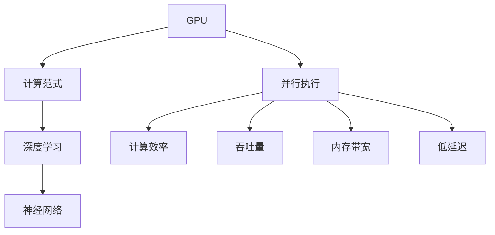

                 

# GPU与并行执行：新计算范式的核心

> 关键词：GPU, 并行执行, 计算范式, 深度学习, 神经网络, 高性能计算

## 1. 背景介绍

### 1.1 问题由来
随着深度学习技术的兴起，GPU（图形处理单元）在计算密集型任务中的应用越来越广泛。GPU具备高效的并行计算能力，能够显著加速深度学习模型的训练和推理。本文将深入探讨GPU与并行执行的原理和实践，重点介绍其在新计算范式中的核心地位。

### 1.2 问题核心关键点
GPU与并行执行的核心在于其高度并行化的计算架构。GPU包含了数千个计算核心，这些核心可以同时处理大量并行数据，从而极大地提高了计算效率。这一特性使得GPU在深度学习模型的训练和推理中发挥了巨大作用。

GPU的优势包括但不限于：
- **高并行性**：GPU可以同时处理多个数据并行计算任务。
- **高吞吐量**：GPU可以同时进行大量数据处理，从而提高计算吞吐量。
- **高内存带宽**：GPU拥有更高的内存带宽，可以更快地读取和写入数据。
- **低延迟**：GPU能够快速进行矩阵运算，降低计算延迟。

## 2. 核心概念与联系

### 2.1 核心概念概述

为更好地理解GPU与并行执行的原理和实践，本节将介绍几个密切相关的核心概念：

- **GPU（图形处理单元）**：GPU是NVIDIA等公司开发的一种专门用于图形渲染的硬件，但其并行计算能力使其在深度学习领域中得到了广泛应用。
- **并行执行**：指同时执行多个计算任务，以提高计算效率和吞吐量。GPU以其高度并行化的架构著称，是实现并行执行的理想硬件。
- **计算范式**：计算范式指的是解决计算问题的策略和方式。GPU与并行执行代表了现代高性能计算的重要计算范式之一。
- **深度学习**：基于神经网络的机器学习技术，通常需要大量的计算资源进行模型训练和推理。
- **神经网络**：深度学习的基础，由多层神经元组成，能够自动学习特征表示。

这些核心概念之间的逻辑关系可以通过以下Mermaid流程图来展示：



这个流程图展示了大语言模型的核心概念及其之间的关系：

1. GPU通过其高度并行化的架构，成为实现并行执行的理想硬件。
2. 并行执行提升了计算效率和吞吐量，从而支持深度学习模型的训练和推理。
3. 计算范式是解决计算问题的策略，GPU与并行执行是现代高性能计算的重要范式之一。
4. 深度学习依赖大量的计算资源，GPU与并行执行能够显著加速这一过程。
5. 神经网络是深度学习的基础，GPU与并行执行为其提供了强有力的计算支持。

## 3. 核心算法原理 & 具体操作步骤
### 3.1 算法原理概述

GPU与并行执行的核心原理在于其能够同时处理多个计算任务。传统CPU（中央处理单元）执行计算任务时，通常是串行执行，每个计算任务只能等待前一个任务完成后才能开始。而GPU通过高度并行化的计算核心，可以在同一时间处理多个任务，从而显著提高计算效率。

### 3.2 算法步骤详解

GPU与并行执行的具体操作步骤包括以下几个关键步骤：

**Step 1: 准备并行计算任务**
- 将深度学习模型的计算任务分解为多个并行子任务。这些子任务通常是计算矩阵乘法、卷积等运算。
- 确定每个子任务需要的计算资源，如GPU核心数、内存等。

**Step 2: 数据划分与分布**
- 将训练数据集划分为多个子集，每个子集分配给一个GPU核心处理。
- 使用分布式计算框架（如CUDA）将数据分发到不同的GPU上进行并行计算。

**Step 3: 并行计算与同步**
- 启动并行计算任务，每个GPU核心独立处理分配给自己的计算任务。
- 在计算过程中，使用同步机制（如OpenCL）保证各个GPU核心之间的数据同步。

**Step 4: 数据聚合与输出**
- 收集各个GPU核心的计算结果，并将结果合并。
- 输出最终的计算结果。

### 3.3 算法优缺点

GPU与并行执行的优点包括：
1. 高效性：并行执行显著提升了计算效率，缩短了计算时间。
2. 可扩展性：通过增加GPU核心数，可以轻松扩展并行计算能力。
3. 灵活性：可以适应不同的计算任务和数据分布，灵活度高。

同时，该方法也存在一定的局限性：
1. 硬件要求高：需要高性能的GPU和相应的软件支持。
2. 编程复杂：并行编程需要较高的技术水平，存在一定的学习曲线。
3. 内存限制：GPU内存有限，大模型和大数据集的处理需要特殊的优化策略。

尽管如此，GPU与并行执行仍是现代高性能计算的重要手段，被广泛应用于深度学习模型的训练和推理中。

### 3.4 算法应用领域

GPU与并行执行在深度学习领域得到了广泛的应用，主要包括以下几个方面：

- **深度学习模型训练**：利用GPU加速深度学习模型的前向传播和反向传播过程，大幅缩短模型训练时间。
- **深度学习模型推理**：利用GPU加速深度学习模型的推理过程，提高推理速度和吞吐量。
- **大规模数据分析**：利用GPU的并行计算能力，对大规模数据进行高效处理和分析。
- **计算机视觉**：GPU被广泛应用于计算机视觉任务，如图像识别、目标检测等。
- **自然语言处理**：GPU在自然语言处理领域中也有广泛应用，如文本分类、情感分析等。

除了深度学习领域，GPU与并行执行也被应用于其他高性能计算场景，如科学计算、数据分析、图像处理等，为这些领域带来了显著的计算效率提升。

## 4. 数学模型和公式 & 详细讲解 & 举例说明

### 4.1 数学模型构建

本节将使用数学语言对GPU与并行执行的原理进行更加严格的刻画。

假设一个深度学习模型包含 $n$ 层神经网络，每一层的计算量为 $C_i$，其中 $i \in [1, n]$。在并行执行中，每个GPU核心独立计算一层神经网络的输出，因此总的计算量为 $C_{total} = C_1 + C_2 + \cdots + C_n$。设共有 $m$ 个GPU核心，则并行计算的效率为：

$$
efficiency = \frac{C_{total}}{m}
$$

其中，$m$ 表示并行计算的加速比，$efficiency$ 表示实际的计算效率提升。

### 4.2 公式推导过程

为了计算实际的并行计算效率，需要考虑GPU核心的并行计算能力。设每个GPU核心每秒可以执行的计算量为 $P$，则实际的并行计算效率为：

$$
efficiency = \frac{C_{total}}{m} \times \frac{P}{C_{total}/m}
$$

化简得到：

$$
efficiency = \frac{P}{m}
$$

这个公式表明，并行执行的效率与GPU核心的并行计算能力成正比，与GPU核心数成反比。

### 4.3 案例分析与讲解

以卷积神经网络（CNN）为例，计算其并行执行的效率。假设CNN包含3层卷积层，每层的计算量为 $C_i = I_i \times K_i \times K_i \times N_i \times N_i$，其中 $I_i$ 为输入特征图的大小，$K_i$ 为卷积核大小，$N_i$ 为卷积核数量。如果每个GPU核心独立计算一层卷积，总的计算量为：

$$
C_{total} = 3 \times I_1 \times K_1 \times K_1 \times N_1 \times N_1
$$

设共有4个GPU核心，每个GPU核心每秒可以执行的计算量为 $P$，则实际的并行计算效率为：

$$
efficiency = \frac{P}{4}
$$

这意味着，使用4个GPU核心并行计算CNN，可以将计算效率提升4倍。

## 5. 项目实践：代码实例和详细解释说明
### 5.1 开发环境搭建

在进行GPU与并行执行的实践前，我们需要准备好开发环境。以下是使用Python进行CUDA开发的环境配置流程：

1. 安装Anaconda：从官网下载并安装Anaconda，用于创建独立的Python环境。

2. 创建并激活虚拟环境：
```bash
conda create -n pytorch-env python=3.8 
conda activate pytorch-env
```

3. 安装CUDA和cuDNN：
```bash
conda install -c pytorch -c conda-forge cudatoolkit=11.1 -c pytorch -c conda-forge torch
```

4. 安装PyTorch：
```bash
conda install -c pytorch -c conda-forge torchvision torchaudio cudatoolkit=11.1 -c pytorch
```

5. 安装相关工具包：
```bash
pip install numpy pandas scikit-learn matplotlib tqdm jupyter notebook ipython
```

完成上述步骤后，即可在`pytorch-env`环境中开始GPU与并行执行的实践。

### 5.2 源代码详细实现

下面我们以卷积神经网络（CNN）为例，给出使用PyTorch对CNN模型进行GPU并行计算的PyTorch代码实现。

首先，定义CNN模型的结构：

```python
import torch.nn as nn
import torch

class CNN(nn.Module):
    def __init__(self):
        super(CNN, self).__init__()
        self.conv1 = nn.Conv2d(3, 16, kernel_size=3, stride=1, padding=1)
        self.conv2 = nn.Conv2d(16, 32, kernel_size=3, stride=1, padding=1)
        self.conv3 = nn.Conv2d(32, 64, kernel_size=3, stride=1, padding=1)
        self.fc1 = nn.Linear(64 * 2 * 2, 128)
        self.fc2 = nn.Linear(128, 10)

    def forward(self, x):
        x = F.relu(self.conv1(x))
        x = F.max_pool2d(x, 2)
        x = F.relu(self.conv2(x))
        x = F.max_pool2d(x, 2)
        x = F.relu(self.conv3(x))
        x = F.max_pool2d(x, 2)
        x = x.view(-1, 64 * 2 * 2)
        x = F.relu(self.fc1(x))
        x = self.fc2(x)
        return x
```

接着，定义GPU并行计算的代码：

```python
import torch.cuda
import torch.distributed as dist
import torch.multiprocessing as mp

def main(rank, world_size):
    torch.cuda.set_device(rank)
    torch.distributed.init_process_group("nccl", rank=rank, world_size=world_size)

    model = CNN().cuda()
    model = torch.nn.DataParallel(model)

    criterion = nn.CrossEntropyLoss().cuda()
    optimizer = torch.optim.Adam(model.parameters(), lr=0.001)

    train_loader = torch.utils.data.DataLoader(
        torchvision.datasets.CIFAR10(root='data', train=True, download=True, transform=transforms.ToTensor()),
        batch_size=128,
        shuffle=True
    )

    for epoch in range(10):
        for batch_idx, (data, target) in enumerate(train_loader):
            data, target = data.cuda(), target.cuda()
            optimizer.zero_grad()
            output = model(data)
            loss = criterion(output, target)
            loss.backward()
            optimizer.step()

    torch.distributed.destroy_process_group()
    mp.get_context().exit()

if __name__ == "__main__":
    mp.spawn(main, args=(8, ), nprocs=8, join=True)
```

在上面的代码中，使用了PyTorch的`DataParallel`来将模型并行化，实现了多GPU上的并行计算。同时，使用`nccl`作为分布式通信协议，实现了多个GPU核心之间的数据同步。

### 5.3 代码解读与分析

让我们再详细解读一下关键代码的实现细节：

**CNN模型定义**：
- 定义了一个简单的卷积神经网络，包含3层卷积和2层全连接层。

**GPU并行计算实现**：
- 在`main`函数中，使用`torch.distributed.init_process_group`初始化分布式计算环境，将模型在多个GPU核心上进行并行化。
- 使用`DataParallel`将模型在多个GPU核心上进行数据并行处理。
- 在训练过程中，使用`nccl`作为分布式通信协议，实现多个GPU核心之间的数据同步。
- 在训练完一轮后，调用`torch.distributed.destroy_process_group`释放资源。

**并行计算参数**：
- 通过`args`参数指定了并行计算的GPU核心数。
- 使用`spawn`函数启动多个进程，并在每个进程中执行`main`函数。

## 6. 实际应用场景
### 6.1 深度学习训练与推理

GPU与并行执行在深度学习训练与推理中发挥了巨大作用。在训练过程中，GPU可以显著加速模型的前向传播和反向传播，从而缩短模型训练时间。在推理过程中，GPU可以加速模型的计算，提高推理速度和吞吐量。

例如，在图像识别任务中，GPU可以并行计算卷积层和全连接层，加速模型的训练和推理。通过GPU并行执行，可以在短时间内训练出高质量的模型，同时提高推理速度，实现实时图像识别和处理。

### 6.2 科学计算

科学计算中，GPU与并行执行可以处理大规模的矩阵计算和数值模拟，大幅提升计算效率。例如，在天气预报、地震模拟、流体力学等领域，GPU并行执行可以处理复杂的数值模拟问题，提高计算速度和精度。

## 7. 工具和资源推荐
### 7.1 学习资源推荐

为了帮助开发者系统掌握GPU与并行执行的理论基础和实践技巧，这里推荐一些优质的学习资源：

1. CUDA Programming Guide：NVIDIA官方提供的GPU编程指南，详细介绍CUDA语言和API的使用。
2. PyTorch官方文档：PyTorch官方文档提供了GPU并行执行的详细说明和样例代码，是学习GPU并行执行的重要参考。
3. Deep Learning Specialization by Andrew Ng：Andrew Ng开设的深度学习课程，涵盖深度学习的基础知识和GPU并行执行的实践。
4. CUDA Deep Learning：CUDA Deep Learning官方教程，提供丰富的GPU并行执行案例和代码实现。
5. Parallel Programming with GPU Accelerators：Rajapakse等编写的GPU并行编程教材，系统介绍了GPU并行执行的原理和实践。

通过对这些资源的学习实践，相信你一定能够快速掌握GPU与并行执行的精髓，并用于解决实际的计算问题。
###  7.2 开发工具推荐

高效的开发离不开优秀的工具支持。以下是几款用于GPU与并行执行开发的常用工具：

1. CUDA：NVIDIA开发的GPU并行计算平台，支持多种编程语言，如C++、Python等。
2. OpenCL：开放计算语言，支持跨平台GPU并行计算，可在CPU和GPU上运行。
3. PyTorch：基于CUDA的深度学习框架，支持GPU并行计算。
4. TensorFlow：Google开发的深度学习框架，支持GPU并行计算。
5. PyOpenCL：Python接口的OpenCL库，支持跨平台GPU并行计算。
6. PyCUDA：Python接口的CUDA库，支持GPU并行计算。

合理利用这些工具，可以显著提升GPU与并行执行的开发效率，加快创新迭代的步伐。

### 7.3 相关论文推荐

GPU与并行执行技术的发展源于学界的持续研究。以下是几篇奠基性的相关论文，推荐阅读：

1. Accelerating Deep Neural Networks with CUDA：Gupta等撰写的论文，介绍了使用CUDA加速深度学习模型的实践。
2. A Survey on CUDA-based Parallel Programming for Deep Learning：Liu等撰写的综述论文，总结了CUDA在深度学习中的应用和优化技术。
3. Distributed Deep Learning with TensorFlow：Chen等撰写的论文，介绍了使用TensorFlow进行分布式深度学习训练的方法。
4. Parallel Programming for GPU with CUDA：Hawkins等撰写的教材，系统介绍了GPU并行编程的原理和实践。
5. Caffe: A Practical Framework for Large-Scale Machine Learning：Jia等撰写的论文，介绍了使用Caffe进行大规模深度学习训练的实践。

这些论文代表了大语言模型微调技术的发展脉络。通过学习这些前沿成果，可以帮助研究者把握学科前进方向，激发更多的创新灵感。

## 8. 总结：未来发展趋势与挑战
### 8.1 总结

本文对GPU与并行执行的原理和实践进行了全面系统的介绍。首先阐述了GPU与并行执行的背景和意义，明确了其在新计算范式中的核心地位。其次，从原理到实践，详细讲解了GPU与并行执行的数学模型和操作步骤，给出了GPU并行计算的完整代码实例。同时，本文还广泛探讨了GPU与并行执行在深度学习训练与推理、科学计算等实际应用场景中的广泛应用，展示了GPU与并行执行的巨大潜力。

通过本文的系统梳理，可以看到，GPU与并行执行在现代高性能计算中占据了核心地位，显著提升了计算效率和吞吐量。GPU与并行执行的应用范围覆盖了深度学习、科学计算等多个领域，成为高性能计算的重要手段。未来，随着GPU技术的不断进步和优化，GPU与并行执行将继续引领现代高性能计算的发展方向。

### 8.2 未来发展趋势

展望未来，GPU与并行执行技术将呈现以下几个发展趋势：

1. **高性能计算架构**：随着GPU硬件和软件技术的不断进步，未来的GPU将具备更高的计算能力和更低的能耗，能够支持更复杂、更大规模的计算任务。
2. **分布式计算**：未来GPU与并行执行将更多地采用分布式计算模式，支持更多的GPU核心并行计算，提高计算效率和吞吐量。
3. **异构计算**：未来GPU与并行执行将更多地与CPU、FPGA等异构计算硬件结合，实现更高效的计算模式。
4. **云计算与边缘计算**：GPU与并行执行将更多地应用于云计算和边缘计算场景，支持大规模数据处理和实时计算需求。
5. **人工智能与大数据**：GPU与并行执行将继续推动人工智能和大数据的发展，支持更高效、更可靠的深度学习模型训练和推理。

这些趋势将使得GPU与并行执行在未来更加广泛地应用于各个领域，成为现代高性能计算的重要支撑。

### 8.3 面临的挑战

尽管GPU与并行执行技术已经取得了瞩目成就，但在迈向更加智能化、普适化应用的过程中，它仍面临着诸多挑战：

1. **硬件成本**：高性能GPU和相关设备的成本较高，限制了其大规模应用。
2. **编程复杂性**：GPU并行计算的编程难度较大，需要较高的技术水平。
3. **内存限制**：GPU内存有限，处理大规模数据集需要特殊的优化策略。
4. **能耗问题**：高性能计算设备功耗较高，能耗问题成为实际应用中的一个重要挑战。
5. **软件生态**：虽然CUDA和OpenCL等工具较为成熟，但跨平台和跨语言的并行编程工具仍需进一步完善。

解决这些挑战，需要学术界和产业界的共同努力，进一步提升GPU与并行执行的技术水平和应用范围。

### 8.4 研究展望

面对GPU与并行执行所面临的种种挑战，未来的研究需要在以下几个方面寻求新的突破：

1. **硬件加速技术**：开发更高效、更强大的GPU硬件，提升计算能力，降低能耗。
2. **分布式计算框架**：开发更高效、更灵活的分布式计算框架，支持更多GPU核心并行计算。
3. **异构计算平台**：开发异构计算平台，支持GPU与CPU、FPGA等异构计算硬件的协同工作。
4. **并行编程工具**：开发更易用的并行编程工具，降低并行编程的难度，提高开发效率。
5. **软件生态系统**：进一步完善并行计算的软件生态系统，支持更多编程语言和开发环境。

这些研究方向将推动GPU与并行执行技术的发展，为现代高性能计算带来新的突破，促进计算机科学的进步。

## 9. 附录：常见问题与解答
### 9.1 GPU与并行执行的区别与联系

GPU与并行执行的主要区别在于其计算架构和计算方式。GPU是一种专门用于图形渲染的高性能计算硬件，具备高度并行化的计算架构，适合进行大规模的并行计算。并行执行是指同时执行多个计算任务，以提高计算效率和吞吐量。GPU与并行执行相结合，可以实现高效的计算，提升计算效率和性能。

### 9.2 如何进行GPU与并行执行的优化？

GPU与并行执行的优化可以从以下几个方面进行：
1. 数据划分与分布：将数据合理地划分并分布在不同的GPU核心上，避免数据传输瓶颈。
2. 内存管理：合理管理内存，减少内存碎片，提高内存利用率。
3. 任务并行度：通过任务并行度优化，最大化GPU核心的利用率，减少等待时间。
4. 同步机制：优化同步机制，减少同步开销，提高并行计算效率。
5. 模型优化：优化模型结构，减少模型计算量，提高计算效率。

### 9.3 GPU与并行执行在实际应用中需要注意哪些问题？

在实际应用中，GPU与并行执行需要注意以下问题：
1. 硬件兼容性：确保所选GPU与软件环境兼容，避免兼容性问题。
2. 编程复杂度：GPU并行编程较为复杂，需要较高的技术水平，避免编程错误。
3. 内存限制：GPU内存有限，处理大规模数据集需要特殊的优化策略。
4. 能耗问题：高性能计算设备功耗较高，需要考虑能耗问题，避免过高的计算成本。
5. 软件生态：选择合适的并行计算框架和工具，提高开发效率。

通过合理处理这些问题，可以充分发挥GPU与并行执行的计算能力，提升计算效率和性能。

---

作者：禅与计算机程序设计艺术 / Zen and the Art of Computer Programming

