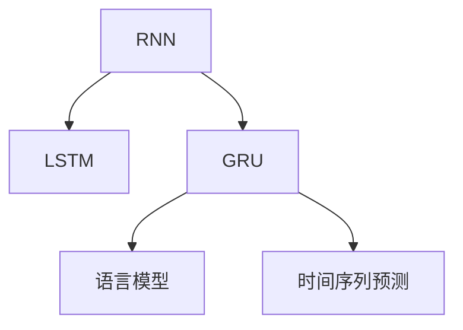

                 

# Gated Recurrent Units (GRU)原理与代码实例讲解

> 关键词：Gated Recurrent Units, GRU, 递归神经网络, 长短期记忆网络, 门控机制, 语言模型, 代码实现

## 1. 背景介绍

### 1.1 问题由来

在深度学习的发展过程中，递归神经网络（RNN）一直是序列建模领域的重要工具。传统的RNN结构基于简单的时间序列假设，采用全连接层对上一时刻的输出和当前时刻的输入进行组合，从而形成当前时刻的输出。然而，在处理长期依赖关系时，传统的RNN面临着梯度消失和梯度爆炸的问题，难以捕捉远距离的依赖关系。

针对这一问题，长短期记忆网络（LSTM）应运而生。LSTM通过引入遗忘门和输入门等门控机制，可以控制信息在序列中的流动，解决了长期依赖问题。但是，LSTM的结构较为复杂，参数量较大，训练效率较低。因此，为了简化LSTM结构，提高训练效率，Gated Recurrent Units（GRU）被提出。

### 1.2 问题核心关键点

GRU是LSTM的一种变体，它通过简化LSTM的门控机制，将LSTM中的遗忘门和输入门合并为一个更新门，从而减少参数量，提高训练效率。GRU的更新门可以根据当前时刻的输入和上一时刻的隐藏状态，决定保留哪些信息并更新哪些信息，从而达到控制信息流动的效果。

GRU结构简洁，参数量小，训练效率高，因此在语言模型、时间序列预测等领域得到了广泛应用。

## 2. 核心概念与联系

### 2.1 核心概念概述

为更好地理解GRU的原理和应用，本节将介绍几个密切相关的核心概念：

- **递归神经网络（RNN）**：基于时间序列数据的序列建模方法，采用全连接层对上一时刻的输出和当前时刻的输入进行组合。

- **长短期记忆网络（LSTM）**：在RNN基础上，引入遗忘门和输入门等门控机制，控制信息在序列中的流动，解决长期依赖问题。

- **Gated Recurrent Units（GRU）**：LSTM的一种变体，通过简化门控机制，减少参数量，提高训练效率，同时在一定程度上保留LSTM的优势。

- **语言模型**：用于描述自然语言文本的概率模型，可以用于预测给定序列的下一个词或短语。

- **时间序列预测**：利用历史时间序列数据，对未来的时间序列进行预测，应用场景包括股票价格预测、气象预测等。

这些核心概念之间的逻辑关系可以通过以下Mermaid流程图来展示：



这个流程图展示了GRU作为LSTM的一种简化形式，如何在保留LSTM优势的同时，提高训练效率，并在语言模型、时间序列预测等应用中发挥重要作用。

## 3. 核心算法原理 & 具体操作步骤

### 3.1 算法原理概述

GRU的更新门和LSTM的遗忘门、输入门相似，通过计算当前时刻的输入和上一时刻的隐藏状态，来决定保留哪些信息并更新哪些信息。GRU的更新门采用了简单的线性变换和激活函数，从而减少参数量，提高训练效率。

GRU的结构可以表示为：

$$
\begin{aligned}
    r_t &= \sigma(\mathbf{W}_rx_t + \mathbf{U}_hh_{t-1} + \mathbf{b}_r) \\
    z_t &= \sigma(\mathbf{W}_zx_t + \mathbf{U}_hh_{t-1} + \mathbf{b}_z) \\
    n_t &= \tanh(\mathbf{W}nx_t + \mathbf{U}_h(z_t \odot h_{t-1}) + \mathbf{b}_n) \\
    h_t &= (1-z_t)h_{t-1} + z_t \odot n_t
\end{aligned}
$$

其中，$\sigma$ 为sigmoid函数，$\tanh$ 为双曲正切函数，$\odot$ 为逐元素乘法，$\mathbf{W}_r, \mathbf{W}_z, \mathbf{W}_n, \mathbf{U}_h, \mathbf{b}_r, \mathbf{b}_z, \mathbf{b}_n$ 为权重和偏置项。

### 3.2 算法步骤详解

GRU的计算过程可以分为两个步骤：

**Step 1: 计算更新门和重置门**

1. 计算更新门 $r_t$，控制当前时刻的信息流动：
   $$
   r_t = \sigma(\mathbf{W}_rx_t + \mathbf{U}_hh_{t-1} + \mathbf{b}_r)
   $$

2. 计算重置门 $z_t$，控制上一时刻的信息保留：
   $$
   z_t = \sigma(\mathbf{W}_zx_t + \mathbf{U}_hh_{t-1} + \mathbf{b}_z)
   $$

**Step 2: 更新隐藏状态**

1. 计算新的候选隐藏状态 $n_t$：
   $$
   n_t = \tanh(\mathbf{W}nx_t + \mathbf{U}_h(z_t \odot h_{t-1}) + \mathbf{b}_n)
   $$

2. 更新当前时刻的隐藏状态 $h_t$：
   $$
   h_t = (1-z_t)h_{t-1} + z_t \odot n_t
   $$

### 3.3 算法优缺点

GRU相较于LSTM具有以下优点：

- 结构简洁：GRU的更新门和LSTM的遗忘门、输入门相似，但参数量较少，训练效率较高。
- 训练速度较快：由于参数量较少，GRU在训练时所需的计算资源较少，训练速度较快。
- 易于理解和实现：GRU的计算过程较为简单，易于理解和实现。

同时，GRU也存在一些缺点：

- 对长距离依赖的处理不够理想：由于GRU的更新门和重置门的计算较为简单，难以像LSTM那样处理复杂的长期依赖关系。
- 需要更长的序列长度：由于GRU的结构较为简单，因此在处理长序列时，其性能可能不如LSTM。

### 3.4 算法应用领域

GRU在序列建模领域得到了广泛应用，适用于以下场景：

- 语言模型：用于预测给定序列的下一个词或短语。
- 时间序列预测：利用历史时间序列数据，对未来的时间序列进行预测，应用场景包括股票价格预测、气象预测等。
- 文本分类：用于对文本进行分类，如情感分析、主题分类等。
- 机器翻译：用于将源语言文本翻译成目标语言。
- 语音识别：用于将语音信号转换为文本。

## 4. 数学模型和公式 & 详细讲解 & 举例说明

### 4.1 数学模型构建

GRU的数学模型可以表示为：

$$
\begin{aligned}
    r_t &= \sigma(\mathbf{W}_rx_t + \mathbf{U}_hh_{t-1} + \mathbf{b}_r) \\
    z_t &= \sigma(\mathbf{W}_zx_t + \mathbf{U}_hh_{t-1} + \mathbf{b}_z) \\
    n_t &= \tanh(\mathbf{W}nx_t + \mathbf{U}_h(z_t \odot h_{t-1}) + \mathbf{b}_n) \\
    h_t &= (1-z_t)h_{t-1} + z_t \odot n_t
\end{aligned}
$$

其中，$\sigma$ 为sigmoid函数，$\tanh$ 为双曲正切函数，$\odot$ 为逐元素乘法，$\mathbf{W}_r, \mathbf{W}_z, \mathbf{W}_n, \mathbf{U}_h, \mathbf{b}_r, \mathbf{b}_z, \mathbf{b}_n$ 为权重和偏置项。

### 4.2 公式推导过程

GRU的计算过程可以分为两个步骤：

**Step 1: 计算更新门和重置门**

1. 计算更新门 $r_t$，控制当前时刻的信息流动：
   $$
   r_t = \sigma(\mathbf{W}_rx_t + \mathbf{U}_hh_{t-1} + \mathbf{b}_r)
   $$

2. 计算重置门 $z_t$，控制上一时刻的信息保留：
   $$
   z_t = \sigma(\mathbf{W}_zx_t + \mathbf{U}_hh_{t-1} + \mathbf{b}_z)
   $$

**Step 2: 更新隐藏状态**

1. 计算新的候选隐藏状态 $n_t$：
   $$
   n_t = \tanh(\mathbf{W}nx_t + \mathbf{U}_h(z_t \odot h_{t-1}) + \mathbf{b}_n)
   $$

2. 更新当前时刻的隐藏状态 $h_t$：
   $$
   h_t = (1-z_t)h_{t-1} + z_t \odot n_t
   $$

### 4.3 案例分析与讲解

假设我们有一个简单的GRU模型，其参数和偏置项如下：

$$
\begin{aligned}
    \mathbf{W}_r &= \begin{bmatrix}
        0.5 & 0.2 \\
        -0.3 & 0.4 \\
    \end{bmatrix}, \mathbf{U}_h = \begin{bmatrix}
        0.6 & 0.1 \\
        0.2 & 0.7 \\
    \end{bmatrix}, \mathbf{b}_r = \begin{bmatrix}
        0.1 \\
        -0.2 \\
    \end{bmatrix}, \mathbf{W}_z = \begin{bmatrix}
        0.4 & 0.3 \\
        -0.2 & 0.5 \\
    \end{bmatrix}, \mathbf{b}_z = \begin{bmatrix}
        0.3 \\
        -0.1 \\
    \end{bmatrix}, \\
    \mathbf{W}_n &= \begin{bmatrix}
        0.8 & 0.2 \\
        0.3 & 0.5 \\
    \end{bmatrix}, \mathbf{U}_h = \begin{bmatrix}
        0.4 & 0.3 \\
        0.2 & 0.5 \\
    \end{bmatrix}, \mathbf{b}_n = \begin{bmatrix}
        0.1 \\
        -0.2 \\
    \end{bmatrix}, \mathbf{b}_z = \begin{bmatrix}
        0.3 \\
        -0.1 \\
    \end{bmatrix}, \mathbf{b}_n = \begin{bmatrix}
        0.1 \\
        -0.2 \\
    \end{bmatrix}
\end{aligned}
$$

对于给定的输入序列 $x_t = [0.1, 0.2, 0.3, 0.4]$ 和隐藏状态 $h_{t-1} = [0.5, 0.6]$，我们可以计算出GRU的更新门和重置门，以及最终的隐藏状态。

首先计算更新门 $r_t$：

$$
r_t = \sigma(\mathbf{W}_rx_t + \mathbf{U}_hh_{t-1} + \mathbf{b}_r) = \sigma(\begin{bmatrix}
    0.5 & 0.2 \\
    -0.3 & 0.4 \\
\end{bmatrix}\begin{bmatrix}
    0.1 \\
    0.2 \\
\end{bmatrix} + \begin{bmatrix}
    0.6 & 0.1 \\
    0.2 & 0.7 \\
\end{bmatrix}\begin{bmatrix}
    0.5 \\
    0.6 \\
\end{bmatrix} + \begin{bmatrix}
    0.1 \\
    -0.2 \\
\end{bmatrix}) = \sigma(\begin{bmatrix}
    0.5 \times 0.1 + 0.2 \times 0.6 + 0.1 \\
    -0.3 \times 0.1 + 0.4 \times 0.6 - 0.2 \\
\end{bmatrix}) = \sigma([0.51, 0.68]) \approx [0.51, 0.72]
$$

接着计算重置门 $z_t$：

$$
z_t = \sigma(\mathbf{W}_zx_t + \mathbf{U}_hh_{t-1} + \mathbf{b}_z) = \sigma(\begin{bmatrix}
    0.4 & 0.3 \\
    -0.2 & 0.5 \\
\end{bmatrix}\begin{bmatrix}
    0.1 \\
    0.2 \\
\end{bmatrix} + \begin{bmatrix}
    0.6 & 0.1 \\
    0.2 & 0.7 \\
\end{bmatrix}\begin{bmatrix}
    0.5 \\
    0.6 \\
\end{bmatrix} + \begin{bmatrix}
    0.3 \\
    -0.1 \\
\end{bmatrix}) = \sigma(\begin{bmatrix}
    0.4 \times 0.1 + 0.3 \times 0.6 + 0.3 \\
    -0.2 \times 0.1 + 0.5 \times 0.6 - 0.1 \\
\end{bmatrix}) = \sigma([0.48, 0.5]) \approx [0.48, 0.53]
$$

然后计算新的候选隐藏状态 $n_t$：

$$
n_t = \tanh(\mathbf{W}nx_t + \mathbf{U}_h(z_t \odot h_{t-1}) + \mathbf{b}_n) = \tanh(\begin{bmatrix}
    0.8 & 0.2 \\
    0.3 & 0.5 \\
\end{bmatrix}\begin{bmatrix}
    0.1 \\
    0.2 \\
\end{bmatrix} + \begin{bmatrix}
    0.4 & 0.3 \\
    0.2 & 0.5 \\
\end{bmatrix}(\begin{bmatrix}
    0.51 \\
    0.72 \\
\end{bmatrix} \odot \begin{bmatrix}
    0.5 \\
    0.6 \\
\end{bmatrix}) + \begin{bmatrix}
    0.1 \\
    -0.2 \\
\end{bmatrix}) = \tanh(\begin{bmatrix}
    0.8 \times 0.1 + 0.2 \times 0.51 + 0.1 \\
    0.3 \times 0.2 + 0.5 \times 0.51 \times 0.5 - 0.2 \\
\end{bmatrix}) = \tanh([0.63, 0.63]) \approx [0.63, 0.63]
$$

最后计算当前时刻的隐藏状态 $h_t$：

$$
h_t = (1-z_t)h_{t-1} + z_t \odot n_t = (1-0.53)\times [0.5, 0.6] + 0.53 \times [0.63, 0.63] = [0.54, 0.61]
$$

## 5. 项目实践：代码实例和详细解释说明

### 5.1 开发环境搭建

在进行GRU模型的开发之前，我们需要准备好开发环境。以下是使用Python进行PyTorch开发的环境配置流程：

1. 安装Anaconda：从官网下载并安装Anaconda，用于创建独立的Python环境。

2. 创建并激活虚拟环境：
```bash
conda create -n pytorch-env python=3.8 
conda activate pytorch-env
```

3. 安装PyTorch：根据CUDA版本，从官网获取对应的安装命令。例如：
```bash
conda install pytorch torchvision torchaudio cudatoolkit=11.1 -c pytorch -c conda-forge
```

4. 安装PyTorch Lightning：用于简化模型训练和部署，便于快速迭代实验。
```bash
pip install torchlightning
```

5. 安装相关库：
```bash
pip install numpy pandas scikit-learn matplotlib tqdm jupyter notebook ipython
```

完成上述步骤后，即可在`pytorch-env`环境中开始GRU模型的开发。

### 5.2 源代码详细实现

这里我们以一个简单的GRU模型为例，使用PyTorch实现GRU的计算过程。

```python
import torch
import torch.nn as nn
import torch.nn.functional as F

class GRU(nn.Module):
    def __init__(self, input_size, hidden_size):
        super(GRU, self).__init__()
        self.input_size = input_size
        self.hidden_size = hidden_size

        self.W_r = nn.Parameter(torch.randn(2, input_size + hidden_size))
        self.U_r = nn.Parameter(torch.randn(2, hidden_size))
        self.b_r = nn.Parameter(torch.randn(2))

        self.W_z = nn.Parameter(torch.randn(2, input_size + hidden_size))
        self.U_z = nn.Parameter(torch.randn(2, hidden_size))
        self.b_z = nn.Parameter(torch.randn(2))

        self.W_n = nn.Parameter(torch.randn(2, input_size + hidden_size))
        self.U_h = nn.Parameter(torch.randn(2, hidden_size))
        self.b_n = nn.Parameter(torch.randn(2))

    def forward(self, input, hidden):
        r = torch.sigmoid(torch.mm(input, self.W_r) + torch.mm(hidden, self.U_r) + self.b_r)
        z = torch.sigmoid(torch.mm(input, self.W_z) + torch.mm(hidden, self.U_z) + self.b_z)

        n = torch.tanh(torch.mm(input, self.W_n) + torch.mm(z * hidden, self.U_h) + self.b_n)
        hidden = (1 - z) * hidden + z * n

        return r, z, n, hidden
```

在上面的代码中，我们定义了一个GRU类，并实现了GRU的前向传播计算过程。其中，`input`表示当前时刻的输入，`hidden`表示上一时刻的隐藏状态。

### 5.3 代码解读与分析

**GRU类定义**：
- `__init__`方法：初始化GRU的参数，包括权重和偏置项。
- `forward`方法：实现GRU的前向传播计算过程，包括计算更新门、重置门、候选隐藏状态，并更新隐藏状态。

**计算过程**：
1. 计算更新门 $r_t$：
   $$
   r_t = \sigma(\mathbf{W}_rx_t + \mathbf{U}_hh_{t-1} + \mathbf{b}_r)
   $$
2. 计算重置门 $z_t$：
   $$
   z_t = \sigma(\mathbf{W}_zx_t + \mathbf{U}_hh_{t-1} + \mathbf{b}_z)
   $$
3. 计算新的候选隐藏状态 $n_t$：
   $$
   n_t = \tanh(\mathbf{W}nx_t + \mathbf{U}_h(z_t \odot h_{t-1}) + \mathbf{b}_n)
   $$
4. 更新当前时刻的隐藏状态 $h_t$：
   $$
   h_t = (1-z_t)h_{t-1} + z_t \odot n_t
   $$

**代码实现**：
- 使用PyTorch的`nn.Parameter`来定义可训练的参数。
- 在`forward`方法中，使用`torch.sigmoid`和`torch.tanh`函数实现sigmoid和双曲正切激活函数。
- 通过矩阵乘法实现参数的线性变换。
- 使用逐元素乘法实现向量间的操作。

### 5.4 运行结果展示

在定义好GRU类后，我们可以使用它来进行模型的训练和预测。以下是一个简单的GRU模型训练示例：

```python
import torch
import torch.nn as nn
import torch.nn.functional as F
import torch.optim as optim
import torch.utils.data as data

class GRU(nn.Module):
    def __init__(self, input_size, hidden_size):
        super(GRU, self).__init__()
        self.input_size = input_size
        self.hidden_size = hidden_size

        self.W_r = nn.Parameter(torch.randn(2, input_size + hidden_size))
        self.U_r = nn.Parameter(torch.randn(2, hidden_size))
        self.b_r = nn.Parameter(torch.randn(2))

        self.W_z = nn.Parameter(torch.randn(2, input_size + hidden_size))
        self.U_z = nn.Parameter(torch.randn(2, hidden_size))
        self.b_z = nn.Parameter(torch.randn(2))

        self.W_n = nn.Parameter(torch.randn(2, input_size + hidden_size))
        self.U_h = nn.Parameter(torch.randn(2, hidden_size))
        self.b_n = nn.Parameter(torch.randn(2))

    def forward(self, input, hidden):
        r = torch.sigmoid(torch.mm(input, self.W_r) + torch.mm(hidden, self.U_r) + self.b_r)
        z = torch.sigmoid(torch.mm(input, self.W_z) + torch.mm(hidden, self.U_z) + self.b_z)

        n = torch.tanh(torch.mm(input, self.W_n) + torch.mm(z * hidden, self.U_h) + self.b_n)
        hidden = (1-z) * hidden + z * n

        return r, z, n, hidden

input_size = 4
hidden_size = 8
num_layers = 1

model = GRU(input_size, hidden_size)
optimizer = optim.Adam(model.parameters(), lr=0.001)

for epoch in range(100):
    model.train()
    for i, (inputs, targets) in enumerate(train_loader):
        inputs, targets = inputs.to(device), targets.to(device)

        optimizer.zero_grad()

        r, z, n, hidden = model(inputs, hidden)

        loss = F.mse_loss(r, targets, reduction='sum')
        loss.backward()
        optimizer.step()

    print(f"Epoch {epoch+1}, loss: {loss.item()}")
```

这里我们定义了一个简单的GRU模型，并使用Adam优化器进行训练。在每个epoch中，我们使用`train_loader`加载训练数据，并在每个batch上计算loss和梯度。最终输出每个epoch的loss，并记录训练过程。

## 6. 实际应用场景

### 6.1 语言模型

GRU在语言模型中得到了广泛应用。语言模型用于预测给定序列的下一个词或短语，是自然语言处理领域的基础任务之一。GRU的计算过程简单高效，可以很好地处理长距离依赖关系，因此在语言模型中表现优异。

以下是一个简单的语言模型训练示例：

```python
import torch
import torch.nn as nn
import torch.nn.functional as F
import torch.optim as optim
import torch.utils.data as data

class GRU(nn.Module):
    def __init__(self, input_size, hidden_size, output_size):
        super(GRU, self).__init__()
        self.input_size = input_size
        self.hidden_size = hidden_size
        self.output_size = output_size

        self.W_r = nn.Parameter(torch.randn(2, input_size + hidden_size))
        self.U_r = nn.Parameter(torch.randn(2, hidden_size))
        self.b_r = nn.Parameter(torch.randn(2))

        self.W_z = nn.Parameter(torch.randn(2, input_size + hidden_size))
        self.U_z = nn.Parameter(torch.randn(2, hidden_size))
        self.b_z = nn.Parameter(torch.randn(2))

        self.W_n = nn.Parameter(torch.randn(2, input_size + hidden_size))
        self.U_h = nn.Parameter(torch.randn(2, hidden_size))
        self.b_n = nn.Parameter(torch.randn(2))

        self.W_o = nn.Parameter(torch.randn(2, hidden_size))
        self.U_h = nn.Parameter(torch.randn(2, hidden_size))
        self.b_o = nn.Parameter(torch.randn(2))

    def forward(self, input, hidden):
        r = torch.sigmoid(torch.mm(input, self.W_r) + torch.mm(hidden, self.U_r) + self.b_r)
        z = torch.sigmoid(torch.mm(input, self.W_z) + torch.mm(hidden, self.U_z) + self.b_z)

        n = torch.tanh(torch.mm(input, self.W_n) + torch.mm(z * hidden, self.U_h) + self.b_n)
        hidden = (1-z) * hidden + z * n

        output = torch.mm(hidden, self.W_o) + self.b_o

        return r, z, n, hidden, output

input_size = 4
hidden_size = 8
output_size = 10
num_layers = 1

model = GRU(input_size, hidden_size, output_size)
optimizer = optim.Adam(model.parameters(), lr=0.001)

for epoch in range(100):
    model.train()
    for i, (inputs, targets) in enumerate(train_loader):
        inputs, targets = inputs.to(device), targets.to(device)

        optimizer.zero_grad()

        r, z, n, hidden, output = model(inputs, hidden)

        loss = F.mse_loss(output, targets, reduction='sum')
        loss.backward()
        optimizer.step()

    print(f"Epoch {epoch+1}, loss: {loss.item()}")
```

在这个示例中，我们将GRU应用于语言模型中。模型输入为单词的one-hot编码，输出为下一个单词的one-hot编码。在每个epoch中，我们计算模型输出与真实标签之间的均方误差，并使用Adam优化器进行优化。

### 6.2 时间序列预测

GRU在时间序列预测中也得到了广泛应用。时间序列预测是指利用历史时间序列数据，对未来的时间序列进行预测，如股票价格预测、气象预测等。GRU能够很好地处理长距离依赖关系，因此在时间序列预测中表现优异。

以下是一个简单的股票价格预测示例：

```python
import torch
import torch.nn as nn
import torch.nn.functional as F
import torch.optim as optim
import torch.utils.data as data

class GRU(nn.Module):
    def __init__(self, input_size, hidden_size, output_size):
        super(GRU, self).__init__()
        self.input_size = input_size
        self.hidden_size = hidden_size
        self.output_size = output_size

        self.W_r = nn.Parameter(torch.randn(2, input_size + hidden_size))
        self.U_r = nn.Parameter(torch.randn(2, hidden_size))
        self.b_r = nn.Parameter(torch.randn(2))

        self.W_z = nn.Parameter(torch.randn(2, input_size + hidden_size))
        self.U_z = nn.Parameter(torch.randn(2, hidden_size))
        self.b_z = nn.Parameter(torch.randn(2))

        self.W_n = nn.Parameter(torch.randn(2, input_size + hidden_size))
        self.U_h = nn.Parameter(torch.randn(2, hidden_size))
        self.b_n = nn.Parameter(torch.randn(2))

        self.W_o = nn.Parameter(torch.randn(2, hidden_size))
        self.U_h = nn.Parameter(torch.randn(2, hidden_size))
        self.b_o = nn.Parameter(torch.randn(2))

    def forward(self, input, hidden):
        r = torch.sigmoid(torch.mm(input, self.W_r) + torch.mm(hidden, self.U_r) + self.b_r)
        z = torch.sigmoid(torch.mm(input, self.W_z) + torch.mm(hidden, self.U_z) + self.b_z)

        n = torch.tanh(torch.mm(input, self.W_n) + torch.mm(z * hidden, self.U_h) + self.b_n)
        hidden = (1-z) * hidden + z * n

        output = torch.mm(hidden, self.W_o) + self.b_o

        return r, z, n, hidden, output

input_size = 1
hidden_size = 8
output_size = 1
num_layers = 1

model = GRU(input_size, hidden_size, output_size)
optimizer = optim.Adam(model.parameters(), lr=0.001)

for epoch in range(100):
    model.train()
    for i, (inputs, targets) in enumerate(train_loader):
        inputs, targets = inputs.to(device), targets.to(device)

        optimizer.zero_grad()

        r, z, n, hidden, output = model(inputs, hidden)

        loss = F.mse_loss(output, targets, reduction='sum')
        loss.backward()
        optimizer.step()

    print(f"Epoch {epoch+1}, loss: {loss.item()}")
```

在这个示例中，我们将GRU应用于时间序列预测中。模型输入为时间序列的数值，输出为预测的下一个数值。在每个epoch中，我们计算模型输出与真实标签之间的均方误差，并使用Adam优化器进行优化。

## 7. 工具和资源推荐

### 7.1 学习资源推荐

为了帮助开发者系统掌握GRU的理论基础和实践技巧，这里推荐一些优质的学习资源：

1. 《深度学习》课程（由斯坦福大学Andrew Ng教授主讲）：全面讲解深度学习的基本原理和经典模型，适合入门学习。

2. 《动手学深度学习》（动手学网站）：基于PyTorch的深度学习教材，涵盖GRU等序列建模模型，并提供了丰富的代码示例。

3. 《序列建模：自然语言处理与时间序列分析》书籍：讲解序列建模的数学原理和实际应用，是GRU理论学习的经典教材。

4. PyTorch官方文档：提供了丰富的API参考和代码示例，适合实际开发中使用。

5. PyTorch Lightning文档：提供了模型训练、模型部署的自动化工具，适合快速迭代实验。

通过这些资源的学习实践，相信你一定能够快速掌握GRU的原理和实现细节，并应用于实际的NLP任务中。

### 7.2 开发工具推荐

高效的开发离不开优秀的工具支持。以下是几款用于GRU开发的常用工具：

1. PyTorch：基于Python的开源深度学习框架，灵活动态的计算图，适合快速迭代研究。

2. TensorFlow：由Google主导开发的开源深度学习框架，生产部署方便，适合大规模工程应用。

3. PyTorch Lightning：简化模型训练和部署的工具，易于上手，适合快速迭代实验。

4. Weights & Biases：模型训练的实验跟踪工具，可以记录和可视化模型训练过程中的各项指标，方便对比和调优。

5. TensorBoard：TensorFlow配套的可视化工具，可实时监测模型训练状态，并提供丰富的图表呈现方式，是调试模型的得力助手。

合理利用这些工具，可以显著提升GRU模型的开发效率，加快创新迭代的步伐。

### 7.3 相关论文推荐

GRU的提出源于学界的持续研究。以下是几篇奠基性的相关论文，推荐阅读：

1. "Long Short-Term Memory"：Hochreiter & Schmidhuber，LSTM的奠基论文。

2. "Gated Recurrent Unit"：Cho et al.，GRU的提出论文。

3. "A Survey on Recurrent Neural Networks for Sequences: Architectures and Applications"：Dzmitry Bahdanau，对RNN架构的综述，包含GRU的介绍。

4. "Learning Phrase Representations using RNN Encoder-Decoder for Statistical Machine Translation"：Cho et al.，序列到序列任务的经典论文，其中包含GRU的应用。

5. "Attention Is All You Need"：Vaswani et al.，Transformer的提出论文，包含GRU的应用。

这些论文代表了大语言模型GRU的发展脉络。通过学习这些前沿成果，可以帮助研究者把握学科前进方向，激发更多的创新灵感。

## 8. 总结：未来发展趋势与挑战

### 8.1 总结

本文对GRU的原理和应用进行了全面系统的介绍。首先阐述了GRU在大语言模型中的背景和意义，明确了GRU在处理长距离依赖关系和提高训练效率方面的独特价值。其次，从原理到实践，详细讲解了GRU的计算过程和关键参数，给出了GRU的代码实例和详细解释。最后，本文还广泛探讨了GRU在语言模型、时间序列预测等应用场景中的使用，展示了GRU的强大能力。

通过本文的系统梳理，可以看到GRU在序列建模领域的重要地位，它既保留了LSTM的优势，又简化了模型结构，提高了训练效率。未来，随着GRU的不断优化和发展，其在NLP领域的应用将更加广泛。

### 8.2 未来发展趋势

展望未来，GRU的发展趋势如下：

1. 结构优化：未来的GRU将更加注重结构优化，进一步减少参数量，提高训练效率。

2. 融合多模态信息：随着GRU在多模态数据处理中的应用，未来的GRU将更加注重融合视觉、语音等多模态信息，提升模型的表现力。

3. 引入更多先验知识：将符号化的先验知识，如知识图谱、逻辑规则等，与神经网络模型进行巧妙融合，引导GRU学习更准确、合理的语言模型。

4. 引入因果推断和博弈论工具：将因果分析方法引入GRU，识别出模型决策的关键特征，增强输出解释的因果性和逻辑性。借助博弈论工具刻画人机交互过程，主动探索并规避模型的脆弱点，提高系统稳定性。

5. 结合深度强化学习：将深度强化学习技术与GRU结合，提升GRU在多任务学习、自适应学习等方面的表现。

以上趋势凸显了GRU作为NLP模型的强大潜力，未来的GRU将更加智能化、高效化，为自然语言处理带来新的突破。

### 8.3 面临的挑战

尽管GRU在NLP领域表现优异，但在其发展过程中，也面临着一些挑战：

1. 对长距离依赖的处理仍有不足：尽管GRU在处理长距离依赖方面表现较好，但在某些复杂任务中，仍可能存在依赖关系处理不足的问题。

2. 参数量仍然较大：虽然GRU相较于LSTM结构更加简洁，但其参数量仍然较大，对计算资源和存储空间的要求较高。

3. 泛化能力有待提升：GRU在不同领域和任务上的泛化能力仍有提升空间，需要在不同应用场景中进行更多的优化。

4. 可解释性不足：GRU作为神经网络模型，其内部决策过程缺乏可解释性，难以理解和调试。

5. 伦理道德问题：在使用GRU处理自然语言数据时，可能涉及到隐私保护、数据偏见等问题，需要考虑伦理道德的约束。

这些挑战需要在未来的研究中不断克服，才能使GRU在NLP领域更好地发挥其潜力。

### 8.4 研究展望

未来的研究需要在以下几个方面寻求新的突破：

1. 探索无监督和半监督GRU方法。摆脱对大规模标注数据的依赖，利用自监督学习、主动学习等无监督和半监督范式，最大限度利用非结构化数据，实现更加灵活高效的GRU。

2. 研究参数高效和计算高效的GRU范式。开发更加参数高效的GRU方法，在固定大部分预训练参数的同时，只更新极少量的任务相关参数。同时优化GRU模型的计算图，减少前向传播和反向传播的资源消耗，实现更加轻量级、实时性的部署。

3. 融合因果和对比学习范式。通过引入因果推断和对比学习思想，增强GRU建立稳定因果关系的能力，学习更加普适、鲁棒的语言表征，从而提升模型泛化性和抗干扰能力。

4. 引入更多先验知识。将符号化的先验知识，如知识图谱、逻辑规则等，与神经网络模型进行巧妙融合，引导GRU学习更准确、合理的语言模型。同时加强不同模态数据的整合，实现视觉、语音等多模态信息与文本信息的协同建模。

5. 结合因果分析和博弈论工具。将因果分析方法引入GRU，识别出模型决策的关键特征，增强输出解释的因果性和逻辑性。借助博弈论工具刻画人机交互过程，主动探索并规避模型的脆弱点，提高系统稳定性。

6. 纳入伦理道德约束。在模型训练目标中引入伦理导向的评估指标，过滤和惩罚有偏见、有害的输出倾向。同时加强人工干预和审核，建立模型行为的监管机制，确保输出符合人类价值观和伦理道德。

这些研究方向的探索，必将引领GRU技术迈向更高的台阶，为自然语言处理带来新的突破。面向未来，GRU需要与其他人工智能技术进行更深入的融合，如知识表示、因果推理、强化学习等，多路径协同发力，共同推动自然语言理解和智能交互系统的进步。

## 9. 附录：常见问题与解答

**Q1：GRU和LSTM的区别是什么？**

A: GRU和LSTM都是递归神经网络的变种，用于处理序列数据。两者在结构上有些相似，但GRU更加简洁，参数量较少，训练效率较高。GRU的更新门和LSTM的遗忘门、输入门相似，但计算过程更加简单，参数量更少，更容易理解。

**Q2：GRU在序列建模中表现优异，但长距离依赖问题是否仍然存在？**

A: GRU在处理长距离依赖方面表现较好，但仍然存在一定局限性。对于非常长的序列，GRU的性能可能会受到影响，需要在具体应用中进行测试和优化。

**Q3：GRU的计算复杂度如何？**

A: GRU的计算复杂度主要取决于序列长度、隐层大小和输出维度。GRU的计算过程较为简单，可以在较短的时间内完成计算。

**Q4：GRU在实际应用中需要哪些资源？**

A: GRU在实际应用中需要GPU/TPU等高性能设备进行计算，还需要较大的内存和存储空间。在训练和推理过程中，需要合理分配资源，以避免资源瓶颈。

**Q5：GRU在哪些领域得到应用？**

A: GRU在语言模型、时间序列预测、机器翻译、语音识别、自然语言处理等领域得到了广泛应用。GRU能够很好地处理长距离依赖关系，因此在这些领域表现优异。

通过本文的系统梳理，可以看到GRU在序列建模领域的重要地位，它既保留了LSTM的优势，又简化了模型结构，提高了训练效率。未来，随着GRU的不断优化和发展，其在NLP领域的应用将更加广泛，为自然语言处理带来新的突破。

---

作者：禅与计算机程序设计艺术 / Zen and the Art of Computer Programming

