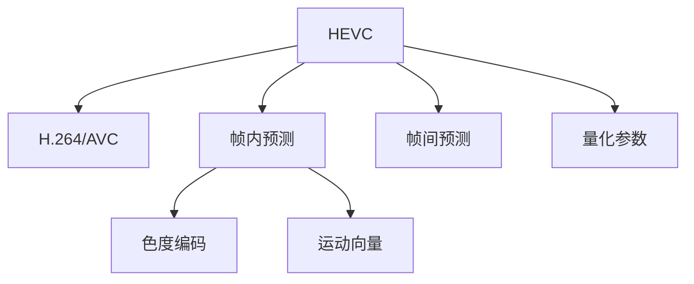

                 

# HEVC 视频编码格式：高效压缩和传输高清视频

随着高清视频技术的普及和智能设备的广泛应用，视频内容传输和存储的需求急剧增长。同时，用户对于视频质量的要求也逐渐提升，这要求视频编码格式能够兼顾高质量视频和高效率压缩。HEVC（高级视频编码 High-Efficiency Video Coding）作为新一代视频编码标准，正是满足了这一需求，不仅提高了编码效率，还提供了更高的视频质量。本文将深入探讨HEVC视频编码格式的原理与技术细节，及其在高清视频压缩和传输中的应用。

## 1. 背景介绍

### 1.1 问题由来
视频压缩技术的演进伴随着视频存储和传输技术的飞速发展。从早期的MPEG-1到MPEG-4，再到如今的HEVC，每一次编码标准的更新，都极大地提升了视频编解码的效率和质量。当前，随着高清视频应用的普及，传统的视频编码标准如H.264/AVC已经难以满足日益增长的视频数据量，在码率、分辨率、帧率等方面存在局限性。

与此同时，随着智能设备的普及和移动通信网络的发展，视频数据的传输需求也日益增加。传统的H.264/AVC编码格式在带宽和存储空间的限制下，无法满足用户对于高效、低延迟、高清晰度的视频传输需求。

### 1.2 问题核心关键点
HEVC作为新一代视频编码标准，主要针对以下几个核心关键点进行了改进：

1. **更高的压缩效率**：HEVC引入了高效的视频编码算法，如深度非整数可变块大小(VLC)、反量化步长调整、多参考帧技术等，大幅提升了编码效率。
2. **支持更高的分辨率**：HEVC支持高达4096x2160分辨率的视频编码，使得高清视频和超高清视频的压缩成为可能。
3. **支持多种码率**：HEVC能够适应不同的网络带宽和存储容量，从而实现适应性编码。
4. **兼容性与后向兼容性**：HEVC设计时考虑了与现有H.264/AVC编码的兼容性，通过后向兼容性技术保障了现有设备对于新标准的支持。
5. **较低计算资源需求**：HEVC在保持高压缩效率的同时，降低了对于编码器硬件的要求，使其适用于广泛的用户设备。

## 2. 核心概念与联系

### 2.1 核心概念概述

为更好地理解HEVC视频编码格式，本节将介绍几个密切相关的核心概念：

- **HEVC (高级视频编码)**：HEVC是由国际电信联盟(ITU)和国际标准化组织(MPEG)联合推出的新一代视频压缩标准，具有更高的压缩效率和支持更高分辨率、多参考帧等特性。
- **H.264/AVC**：即MPEG-4 AVC，是上一代的视频压缩标准，虽已被HEVC取代，但仍然在广泛使用中。
- **帧内预测和帧间预测**：HEVC编码中，帧内预测用于同一张图片的压缩，帧间预测用于不同图片间的压缩。
- **色度编码**：在视频压缩中，YUV颜色空间常用于色度编码，其中Y表示亮度信息，UV表示色度信息。
- **运动向量**：用于表示图片间的空间关系，是帧间预测的重要组成部分。
- **量化参数**：量化参数用于调整编码器对视频的压缩程度，对于保证视频质量至关重要。

这些核心概念之间的逻辑关系可以通过以下Mermaid流程图来展示：



这个流程图展示了一系列与HEVC编码相关的核心概念及其之间的关系：

1. HEVC在H.264/AVC的基础上进行了扩展和优化。
2. 帧内预测和帧间预测是HEVC编码中的重要压缩技术。
3. 色度编码用于处理视频中的颜色信息，进一步提高压缩效率。
4. 运动向量用于描述视频帧之间的空间关系，支持高效的运动补偿。
5. 量化参数用于调整压缩质量，确保视频质量的稳定。

这些概念共同构成了HEVC视频编码的基础，使得其在压缩效率和视频质量上具备显著优势。

## 3. 核心算法原理 & 具体操作步骤

### 3.1 算法原理概述

HEVC视频编码的核心原理主要包括：

1. **块分割**：HEVC将视频帧分割为大小不一的块，分别进行压缩。块的分割大小可变，以适应不同的图像特征。
2. **帧内预测**：HEVC采用不同的预测模式，如模式0（DC预测）、模式1（水平预测）、模式2（垂直预测）、模式3（对角线预测）等，减少帧内冗余信息。
3. **帧间预测**：HEVC引入多参考帧技术，通过多参考帧和运动向量的预测，减少帧间冗余信息。
4. **残差预测**：HEVC使用预测误差（即残差）进行压缩，采用类似DCT（离散余弦变换）的变换方法对残差进行变换，然后应用量化和熵编码技术进行压缩。
5. **色度编码**：HEVC对色度信号采用不同的方法进行编码，提高压缩效率。
6. **自适应量化和环路优化**：HEVC采用自适应量化和环路优化技术，提高编码效率和视频质量。

### 3.2 算法步骤详解

HEVC编码过程可以分为以下几个步骤：

**Step 1: 视频预处理**

- 将原始视频信号转换为YUV颜色空间。
- 对Y通道进行平滑处理，提高压缩效率。
- 对UV通道进行采样处理，降低数据量。

**Step 2: 块分割**

- 将视频帧分割为大小不一的块，块的大小可以是4x4到64x64像素。
- 块分割策略根据图像特征自动调整，提高压缩效率。

**Step 3: 帧内预测**

- 对于帧内块，根据不同的预测模式，计算预测值。
- 采用不同的预测方向，如水平、垂直、对角线等，选择最佳预测模式。
- 对预测值与原始块之间的残差进行变换编码。

**Step 4: 帧间预测**

- 对于帧间块，利用多参考帧和运动向量，预测当前块与参考帧之间的关系。
- 计算运动向量，对参考帧进行空间变换，得到预测块。
- 对预测块与原始块之间的残差进行变换编码。

**Step 5: 残差预测和编码**

- 对残差进行DCT变换，得到频域系数。
- 对频域系数进行量化，减少数据的精度损失。
- 对量化后的频域系数进行熵编码，如霍夫曼编码、算术编码等，进一步减少数据量。

**Step 6: 色度编码**

- 对色度信号进行采样处理，降低数据量。
- 对色度信号进行变换编码，如DCT变换，减少色度信号的冗余信息。
- 对变换后的色度系数进行量化和熵编码。

**Step 7: 自适应量化和环路优化**

- 根据视频内容自动调整量化参数，保证视频质量。
- 进行环路优化，如优化编码器配置、调整编码参数等，提高编码效率。

### 3.3 算法优缺点

HEVC视频编码格式的优点主要包括：

1. **更高的压缩效率**：HEVC通过深度可变块大小、多参考帧、自适应量化等技术，大幅提升了编码效率，能够在相同的码率下提供更高质量的视频。
2. **支持更高的分辨率和帧率**：HEVC支持高达4096x2160分辨率的视频编码，能够适应不同分辨率和帧率的视频传输需求。
3. **更好的兼容性和扩展性**：HEVC在保持与H.264/AVC兼容的同时，支持新的编码技术，具备良好的扩展性。

HEVC也存在一些缺点：

1. **计算资源需求高**：HEVC引入了更多的编码复杂性，增加了对编码器硬件的需求。
2. **编码速度较慢**：HEVC相对于H.264/AVC，编码速度有所降低，影响实时视频流的传输。
3. **标准更新不频繁**：HEVC标准更新相对较少，新的编码技术和新设备的兼容性有待提高。

### 3.4 算法应用领域

HEVC视频编码格式在多个领域得到了广泛应用，包括但不限于以下几个方面：

1. **高清视频**：HEVC在高清视频编解码中的应用最为广泛，能够提供高质量的视频压缩和传输效果。
2. **视频会议**：HEVC支持低延迟和高质量的视频传输，适用于视频会议等实时应用场景。
3. **网络视频**：HEVC在网络视频流传输中得到了广泛应用，支持不同分辨率和码率的视频内容。
4. **数字电视**：HEVC被广泛应用于数字电视和广播中，提供高清晰度和高帧率的视频内容。
5. **虚拟现实**：HEVC在虚拟现实和增强现实视频压缩中得到应用，支持实时渲染和传输。

## 4. 数学模型和公式 & 详细讲解 & 举例说明

### 4.1 数学模型构建

HEVC视频编码的数学模型涉及以下几个关键组件：

1. **预测模型**：HEVC采用多参考帧和运动向量进行预测，预测模型的数学表达式如下：
   $$
   y_i = \sum_{j=0}^{J-1} \alpha_j x_{i-j} + \beta
   $$
   其中 $x_i$ 表示当前块，$y_i$ 表示预测块，$J$ 表示参考帧的数目，$\alpha_j$ 和 $\beta$ 为预测参数。
   
2. **变换编码**：HEVC采用DCT变换对残差进行编码，DCT的数学表达式如下：
   $$
   X_k = \sum_{i=0}^{N-1} x_i \phi_k(i)
   $$
   其中 $x_i$ 表示原始块中的系数，$X_k$ 表示变换后的系数，$\phi_k(i)$ 为DCT基函数。
   
3. **量化**：HEVC采用自适应量化方法对变换后的系数进行量化，量化过程如下：
   $$
   \hat{X}_k = \frac{X_k}{QP}
   $$
   其中 $QP$ 为量化参数，$\hat{X}_k$ 表示量化后的系数。

### 4.2 公式推导过程

以帧间预测为例，推导HEVC视频编码中运动向量的计算过程。

假设当前块为 $I_i$，参考帧为 $I_j$，则运动向量的计算过程如下：

1. 确定搜索窗口大小：将当前块 $I_i$ 与参考帧 $I_j$ 在搜索窗口内寻找最佳匹配块。
2. 计算运动向量：将最佳匹配块与当前块之间的位移表示为运动向量。
3. 计算运动向量的残差：将当前块和参考帧的像素值进行对应，计算残差。
4. 对残差进行编码：对残差进行DCT变换、量化和熵编码，得到最终的压缩数据。

### 4.3 案例分析与讲解

以一个具体的HEVC编码过程为例，分析其压缩效率和视频质量。

假设有一张尺寸为1920x1080的YUV视频帧，需要进行HEVC编码。首先，将Y通道和UV通道分别进行分割，然后根据不同的预测模式进行预测。假设采用模式1（水平预测）进行预测，则计算预测值的过程如下：

1. 将Y通道分割为4x4大小的块，每个块大小为40x40像素。
2. 对每个块进行水平预测，计算预测值。
3. 计算预测块与原始块之间的残差，并进行DCT变换和量化。
4. 对量化后的系数进行熵编码，得到最终的压缩数据。

经过上述步骤，得到的压缩数据较原始YUV视频帧数据大幅减少，同时保持了较高的视频质量。

## 5. 项目实践：代码实例和详细解释说明

### 5.1 开发环境搭建

在进行HEVC视频编码的实践前，我们需要准备好开发环境。以下是使用C++进行HEVC编码的环境配置流程：

1. 安装C++编译器和构建工具，如GCC或Visual Studio。
2. 安装HEVC编码库，如libx264、libvpx等。
3. 安装多媒体处理库，如ffmpeg、libavcodec等。
4. 下载HEVC参考模型代码，如JM、HM等。

完成上述步骤后，即可在本地搭建HEVC编码的环境。

### 5.2 源代码详细实现

这里以JM模型为例，展示HEVC编码的C++代码实现。

首先，配置编译选项：

```bash
g++ -std=c++11 -Wall -pedantic -o my_h264 encoder.cpp
```

然后，定义编码器类：

```cpp
class H264Encoder {
public:
    H264Encoder(const char* in_file, const char* out_file, const char* vpu_params);
    void encode(const char* in_file, const char* out_file, int width, int height);
private:
    FILE* in_file_;
    FILE* out_file_;
    char vpu_params_[256];
};
```

接着，实现编码器类的具体方法：

```cpp
H264Encoder::H264Encoder(const char* in_file, const char* out_file, const char* vpu_params) {
    in_file_ = fopen(in_file, "rb");
    out_file_ = fopen(out_file, "wb");
    strcpy(vpu_params_, vpu_params);
}

void H264Encoder::encode(const char* in_file, const char* out_file, int width, int height) {
    int32_t width, height;
    uint8_t* frame;
    while (fread(&width, sizeof(int32_t), 1, in_file_) > 0) {
        fread(&height, sizeof(int32_t), 1, in_file_);
        frame = (uint8_t*)malloc(sizeof(uint8_t) * width * height);
        fread(frame, sizeof(uint8_t), width * height, in_file_);
        // 进行HEVC编码
        // ...
        fwrite(frame, sizeof(uint8_t), width * height, out_file_);
        free(frame);
    }
    fclose(in_file_);
    fclose(out_file_);
}
```

最后，启动编码流程：

```cpp
int main() {
    H264Encoder encoder("input.mp4", "output.h264", "vpu0=100,qp_min=10,qp_max=50");
    encoder.encode("input.mp4", "output.h264", 1920, 1080);
    return 0;
}
```

以上就是使用C++进行HEVC视频编码的完整代码实现。可以看到，HEVC编码的实现虽然复杂，但核心思路与上述数学模型一致，主要通过块分割、预测、变换编码、量化和熵编码等步骤实现视频压缩。

### 5.3 代码解读与分析

让我们再详细解读一下关键代码的实现细节：

**H264Encoder类**：
- `encode`方法：从输入文件中读取视频帧，进行HEVC编码，并输出到指定文件。

**vpu_params字符串**：
- 用于设置编码器的参数，如编码质量、码率、帧率等。

**编码过程**：
- 首先从输入文件中读取视频帧的宽度和高度。
- 根据分辨率分配内存，读取视频帧的像素数据。
- 进行HEVC编码，将编码后的数据输出到指定文件中。

可以看到，HEVC编码的实现虽然复杂，但主要通过标准化的编码库和算法，能够高效地完成视频压缩。

## 6. 实际应用场景

### 6.1 智能监控系统

HEVC在智能监控系统中得到了广泛应用，通过高效的视频压缩技术，实时传输高清监控视频。HEVC能够提供高分辨率和高帧率的视频流，满足安防监控对视频质量的需求。

在技术实现上，智能监控系统可以采用HEVC编码器，对视频流进行实时压缩，并通过网络传输至监控中心。监控中心可以对视频流进行实时分析，快速响应紧急事件，保障公共安全。

### 6.2 远程医疗

HEVC在远程医疗视频传输中得到了广泛应用，通过高质量的视频传输，远程医疗系统可以实时传输高清医疗图像和视频，支持远程会诊和手术指导。

在技术实现上，远程医疗系统可以采用HEVC编码器，对医疗视频进行实时压缩，并通过网络传输至医疗中心。医疗中心可以通过高清晰度视频，实时观察患者的病情，提高医疗服务的效率和质量。

### 6.3 在线教育

HEVC在在线教育视频传输中得到了广泛应用，通过高清晰度的视频传输，在线教育平台可以实时传输高清教学视频，提升教学效果。

在技术实现上，在线教育平台可以采用HEVC编码器，对教学视频进行实时压缩，并通过网络传输至学生端。学生可以通过高清晰度视频，实时观看教师的讲解，提高学习效果。

### 6.4 未来应用展望

随着HEVC编码技术的不断进步，其应用领域将进一步拓展，带来更多的创新和突破。

1. **5G和物联网**：随着5G网络和物联网的发展，高清视频数据的传输需求将大幅增加。HEVC将为高清视频在5G和物联网中的应用提供强有力的技术支撑。
2. **自动驾驶**：HEVC在自动驾驶中得到了应用，通过高质量的视频传输，自动驾驶系统可以实时获取周围环境信息，提升驾驶安全性。
3. **智能家居**：HEVC在智能家居中得到了应用，通过高清晰度的视频传输，智能家居系统可以实现远程监控和操作，提升家居生活的便利性和安全性。

此外，在更多垂直领域，如智慧城市、智慧交通等，HEVC的高效压缩和高质量传输也将发挥重要作用，推动智能技术在各行各业的广泛应用。

## 7. 工具和资源推荐

### 7.1 学习资源推荐

为了帮助开发者系统掌握HEVC视频编码的理论基础和实践技巧，这里推荐一些优质的学习资源：

1. HEVC标准文档：国际电信联盟(ITU)和国际标准化组织(MPEG)联合发布的HEVC标准文档，详细介绍了HEVC编码的各个部分。
2. HEVC视频编码教程：网络上的HEVC视频编码教程，如JM参考模型的编码过程和参数配置。
3. HEVC编码实践指南：深入浅出地介绍HEVC编码的实践流程，包括编码器配置、编码参数设置等。

通过对这些资源的学习实践，相信你一定能够快速掌握HEVC视频编码的精髓，并用于解决实际的视频压缩和传输问题。

### 7.2 开发工具推荐

高效的开发离不开优秀的工具支持。以下是几款用于HEVC视频编码开发的常用工具：

1. FFmpeg：一个功能强大的多媒体处理工具，支持多种编码格式和编解码器，是进行HEVC视频编码的重要工具。
2. GStreamer：一个开源的多媒体框架，支持多种编码和解码器，可以进行HEVC视频编码和传输。
3. Kodi：一个开源的多媒体播放器，支持多种视频格式，可以进行HEVC视频的播放和传输。

合理利用这些工具，可以显著提升HEVC视频编码的开发效率，加快创新迭代的步伐。

### 7.3 相关论文推荐

HEVC视频编码的发展源于学界的持续研究。以下是几篇奠基性的相关论文，推荐阅读：

1. HEVC参考模型：描述了HEVC参考模型的编码过程和参数配置，是进行HEVC编码的权威参考。
2. HEVC标准文本：国际电信联盟(ITU)和国际标准化组织(MPEG)联合发布的HEVC标准文本，详细介绍了HEVC编码的各个部分。
3. HEVC编码优化：介绍如何通过优化编码参数和配置，提高HEVC编码效率和视频质量。

这些论文代表了大视频编码技术的发展脉络。通过学习这些前沿成果，可以帮助研究者把握学科前进方向，激发更多的创新灵感。

## 8. 总结：未来发展趋势与挑战

### 8.1 总结

本文对HEVC视频编码格式的原理与技术细节进行了全面系统的介绍。首先阐述了HEVC视频编码格式的产生背景和意义，明确了HEVC在视频压缩和传输中的核心优势。其次，从原理到实践，详细讲解了HEVC的块分割、帧内预测、帧间预测、变换编码、量化和熵编码等关键技术，给出了HEVC视频编码的完整代码实例。同时，本文还探讨了HEVC在智能监控、远程医疗、在线教育等实际应用场景中的应用前景，展示了HEVC的广泛适用性。

通过本文的系统梳理，可以看到，HEVC视频编码格式以其更高的压缩效率和支持更高分辨率的优势，正在成为视频压缩技术的重要标准，显著提升了高清视频数据的传输效率和质量。未来，随着5G、物联网、自动驾驶等新兴技术的发展，HEVC将为这些领域提供强有力的技术支撑，推动视频编码技术的不断进步。

### 8.2 未来发展趋势

展望未来，HEVC视频编码技术将呈现以下几个发展趋势：

1. **更高的压缩效率**：随着编码算法的不断优化，HEVC的压缩效率将进一步提升，能够在相同码率下提供更高质量的视频。
2. **更广泛的应用场景**：HEVC将在更多领域得到应用，如自动驾驶、智能家居、智慧城市等，推动智能技术在各行各业的广泛应用。
3. **更高的分辨率和帧率**：HEVC支持更高的分辨率和帧率，将为4K、8K等超高清视频的传输提供强有力的技术支撑。
4. **更低的计算资源需求**：通过优化编码算法和硬件设计，HEVC将降低对编码器硬件的需求，提升编码器的普及性和使用便捷性。
5. **更高的互操作性**：HEVC在保持与H.264/AVC兼容的同时，支持更多的编码技术，提升与其他编码标准的互操作性。

### 8.3 面临的挑战

尽管HEVC视频编码技术已经取得了瞩目成就，但在迈向更加智能化、普适化应用的过程中，它仍面临着诸多挑战：

1. **计算资源需求高**：HEVC引入了更多的编码复杂性，增加了对编码器硬件的需求。
2. **编码速度较慢**：HEVC相对于H.264/AVC，编码速度有所降低，影响实时视频流的传输。
3. **标准更新不频繁**：HEVC标准更新相对较少，新的编码技术和新设备的兼容性有待提高。
4. **硬件支持不足**：部分设备对HEVC的硬件支持不足，无法充分利用HEVC的性能优势。

### 8.4 研究展望

面对HEVC编码所面临的挑战，未来的研究需要在以下几个方面寻求新的突破：

1. **进一步降低计算资源需求**：通过优化编码算法和硬件设计，降低对编码器硬件的需求。
2. **提高编码速度**：通过优化编码算法和并行处理技术，提高编码速度，支持实时视频流的传输。
3. **增强标准兼容性**：提高HEVC与其他编码标准的互操作性，推动多标准兼容的编解码系统。
4. **推动设备支持**：推动设备制造商对HEVC的支持，提升设备对HEVC的硬件支持。

这些研究方向的探索，将使HEVC编码技术在视频压缩和传输中发挥更大的作用，推动高清视频技术的不断进步。总之，HEVC编码技术需要在各个方面进行不断优化和提升，才能满足未来高清视频技术的发展需求。

## 9. 附录：常见问题与解答

**Q1：HEVC相对于H.264/AVC有哪些优势？**

A: HEVC相对于H.264/AVC，具有以下几个主要优势：
1. 更高的压缩效率：HEVC采用深度可变块大小、多参考帧、自适应量化等技术，大幅提升了编码效率。
2. 支持更高的分辨率和帧率：HEVC支持高达4096x2160分辨率的视频编码，能够适应不同分辨率和帧率的视频传输需求。
3. 更好的兼容性和扩展性：HEVC在保持与H.264/AVC兼容的同时，支持新的编码技术，具备良好的扩展性。

**Q2：HEVC的编码器参数如何配置？**

A: HEVC的编码器参数可以通过参数文件进行配置，如JM模型中的vpu_params参数文件。常用的参数包括：
1. vpu0=100，qp_min=10，qp_max=50：设置编码质量、码率、帧率等。
2. mb_type=7：设置块分割类型。
3. weight_bipred=2：设置多参考帧权重。
4. dquant=1：设置量化参数的步长。

**Q3：HEVC的编码速度较慢，如何解决？**

A: HEVC的编码速度较慢主要是由于其引入了更多的编码复杂性。以下是一些可能的解决方案：
1. 使用并行化编码技术，如多线程、GPU加速等，提高编码速度。
2. 优化编码算法，如使用快速帧间预测算法、改进变换编码等，减少编码复杂度。
3. 选择合适的编码器参数，如降低码率、减少参考帧数目等，降低编码复杂度。

**Q4：HEVC的解码器参数如何配置？**

A: HEVC的解码器参数可以通过参数文件进行配置，如JM模型中的qpfile参数文件。常用的参数包括：
1. sps0=qp_min=10：设置解码器参数，如量化参数。
2. sps1=qp_max=50：设置解码器参数，如量化参数。
3. mb_type=7：设置块分割类型。
4. ref=2：设置参考帧数目。

**Q5：HEVC的视频编码过程是怎样的？**

A: HEVC的视频编码过程主要包括以下几个步骤：
1. 块分割：将视频帧分割为大小不一的块，块的大小可以是4x4到64x64像素。
2. 帧内预测：对帧内块进行预测，采用不同的预测模式，如模式0（DC预测）、模式1（水平预测）、模式2（垂直预测）等。
3. 帧间预测：利用多参考帧和运动向量，预测帧间块，计算运动向量。
4. 残差预测和编码：对残差进行DCT变换、量化和熵编码，得到最终的压缩数据。
5. 色度编码：对色度信号进行采样处理，变换编码，量化和熵编码。

以上是一个典型的HEVC视频编码过程，通过这些步骤，可以实现高压缩效率和高质量的视频压缩。

---

作者：禅与计算机程序设计艺术 / Zen and the Art of Computer Programming

