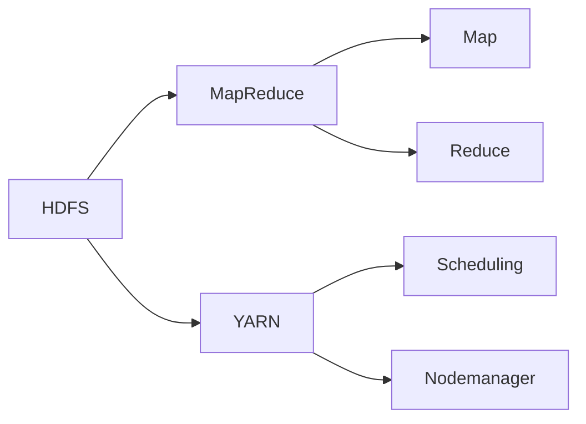

                 

# Hadoop 原理与代码实例讲解

> 关键词：Hadoop, MapReduce, YARN, HDFS, 分布式存储, 大数据处理, 高可靠性, 代码实例

## 1. 背景介绍

### 1.1 问题由来
随着互联网的快速发展和数据量的爆炸性增长，企业和大数据处理机构需要高效、可靠地存储和处理海量数据。传统的集中式数据存储和处理方式已无法满足需求。Hadoop作为开源的大数据处理框架，以其高度的灵活性和可扩展性，在众多企业和大数据应用中得到广泛应用。

### 1.2 问题核心关键点
Hadoop的核心是分布式文件系统HDFS（Hadoop Distributed File System）和分布式计算框架MapReduce。HDFS提供大容量的数据存储和访问能力，MapReduce则用于分布式并行计算，可以将大规模数据处理任务分解为多个并行子任务，显著提高数据处理效率。此外，Hadoop还引入了YARN（Yet Another Resource Negotiator）资源管理系统，用于高效管理集群资源，优化多租户环境下的资源利用率。

Hadoop框架的成功关键在于其容错性、可扩展性和成本效益。容错性使得Hadoop系统在硬件故障时可以自动恢复，保证了数据处理的可靠性；可扩展性允许系统根据需要添加或减少计算节点，支持任意规模的分布式计算任务；成本效益使得企业可以低成本地构建大规模的数据处理系统。

### 1.3 问题研究意义
研究Hadoop框架及其关键组件的原理和实现细节，对于理解大数据处理的分布式计算模型和容错机制具有重要意义。同时，Hadoop的技术范式和工程实践也为其他分布式系统提供了宝贵的参考，促进了大数据技术的普及和应用。

## 2. 核心概念与联系

### 2.1 核心概念概述

Hadoop的核心组件包括HDFS、MapReduce和YARN。

- **HDFS（Hadoop Distributed File System）**：分布式文件系统，用于存储和管理大规模数据。HDFS将文件切分为多个数据块，分布在不同的节点上进行冗余存储，保证数据的高可用性和容错性。

- **MapReduce**：一种编程模型和计算框架，用于并行处理大规模数据集。MapReduce将计算任务分解为Map和Reduce两个阶段，通过并行计算加速数据处理。

- **YARN**：资源管理系统，用于调度和管理集群中的计算资源。YARN将集群资源划分为不同的资源类型，支持多种计算框架和应用程序的运行。

- **数据流**：数据在Hadoop系统中的流动路径，包括数据的存储、读取、传输和计算等环节。

### 2.2 核心概念原理和架构的 Mermaid 流程图



这个流程图展示了Hadoop框架的核心组件和数据流向：

1. 数据存储在HDFS上，并通过数据流流向MapReduce进行计算。
2. MapReduce计算过程包括Map和Reduce两个阶段。
3. YARN负责资源调度和管理，通过数据流将计算任务分配给不同的计算节点。

## 3. 核心算法原理 & 具体操作步骤

### 3.1 算法原理概述

Hadoop的核心原理是分布式存储和计算。通过HDFS和MapReduce的结合，可以高效地处理大规模数据集。MapReduce的核心思想是将大规模数据处理任务分解为多个小任务，通过并行计算加速处理过程。

Hadoop的计算过程分为两个阶段：Map阶段和Reduce阶段。Map阶段负责将输入数据切分为多个键值对，并根据键值对进行分组；Reduce阶段负责对每个键值对的分组结果进行聚合计算。

### 3.2 算法步骤详解

#### 3.2.1 Map阶段

Map阶段的主要任务是对输入数据进行分块和分组。假设有输入数据集$D=\{(k_i, v_i)\}_{i=1}^N$，其中$k_i$为键，$v_i$为值。Map阶段将数据集$D$输入到多个Map任务中，每个Map任务接收部分数据作为输入，将输入数据切分为多个键值对$(k_i, f(k_i, v_i))$，其中$f$为Map函数。Map函数的输出结果被分为两部分：一部分是中间结果$(k_i', v_i')$，其中$k_i'$为新的键，$v_i'$为新的值；另一部分是控制信息$(k_i', v_i')$，用于后续的Reduce阶段。

Map阶段的伪代码如下：

```python
for (each (key, value) in dataset) {
    emit intermediate_key(key, map_function(key, value));
}
```

#### 3.2.2 Reduce阶段

Reduce阶段的主要任务是对Map阶段输出的中间结果进行聚合计算。假设有中间结果集$M=\{(k_i', v_i')\}_{i=1}^M$，Reduce阶段将$M$中的中间结果按照键$k_i'$进行分组，对每个分组进行聚合计算，生成最终结果。具体来说，Reduce阶段将中间结果$(k_i', v_i')$按照键$k_i'$进行分组，并将同一组内的值$v_i'$进行聚合计算，生成最终的输出结果$(k_i', result(v_i'))$。

Reduce阶段的伪代码如下：

```python
for (each (key, value_list) in intermediate_results) {
    emit output_key(key, combine_function(value_list));
}
```

#### 3.2.3 数据流向

在Hadoop系统中，Map和Reduce阶段的数据流向遵循一定的规则：

1. Map任务的输入数据从HDFS中读取，并生成中间结果$(k_i', v_i')$。
2. Reduce任务的输入数据来自Map任务的输出中间结果$(k_i', v_i')$。
3. Reduce任务将输出结果$(k_i', result(v_i'))$写回HDFS中。

### 3.3 算法优缺点

#### 3.3.1 优点

1. **高可用性**：Hadoop的分布式存储和计算机制使得系统具有高度的容错性，即使部分节点故障，也能保证数据的完整性和计算的连续性。
2. **高扩展性**：Hadoop的计算和存储资源可以动态地扩展或缩减，支持任意规模的数据处理任务。
3. **低成本**：Hadoop的开源特性使得企业可以低成本地构建和管理大规模数据处理系统。
4. **灵活性**：Hadoop支持多种数据存储和计算框架，可以适应不同类型的数据处理需求。

#### 3.3.2 缺点

1. **复杂性**：Hadoop系统的设计和实现较为复杂，需要一定的运维和技术支持。
2. **延迟**：由于数据需要在多个节点之间传输和计算，Hadoop的延迟较大，不适合处理对实时性要求高的任务。
3. **资源利用率**：由于资源分配和调度的开销，Hadoop的资源利用率可能不如其他专用数据处理框架。

### 3.4 算法应用领域

Hadoop广泛应用于大数据处理、企业数据仓库、云计算、科学计算等多个领域。其高可靠性和高扩展性使得Hadoop成为处理海量数据的理想选择，适用于各种类型的数据处理任务。

1. **大数据处理**：Hadoop适用于大规模数据集的存储、处理和分析，如Web日志、传感器数据、金融交易数据等。
2. **企业数据仓库**：Hadoop可以构建企业级的数据仓库系统，存储和管理企业历史数据，支持业务分析和决策支持。
3. **云计算**：Hadoop可以作为云计算平台的基础设施，提供弹性计算和存储资源，支持云服务器的数据处理和存储。
4. **科学计算**：Hadoop支持科学计算任务，如天气模拟、生物信息学、天文学等。

## 4. 数学模型和公式 & 详细讲解 & 举例说明

### 4.1 数学模型构建

Hadoop的核心原理可以抽象为分布式存储和计算的数学模型。

假设有一个分布式文件系统HDFS，包含$N$个数据块，每个数据块大小为$s$。数据块$D$按照冗余因子$r$进行备份存储。在MapReduce计算过程中，每个Map任务处理的数据块大小为$b$，Map任务的数量为$P$。

Map和Reduce任务的执行时间和资源需求可以表示为：

$$
t_{Map} = \frac{s}{bP} \times C_{Map}
$$

$$
t_{Reduce} = \frac{s}{bP} \times C_{Reduce}
$$

其中$C_{Map}$和$C_{Reduce}$分别为Map和Reduce任务的执行时间。

### 4.2 公式推导过程

Map和Reduce任务的执行时间可以通过上述公式进行计算。当数据块大小$s$和Map任务数量$P$一定时，执行时间与Map和Reduce任务的资源需求成正比。因此，Hadoop系统可以通过动态调整任务数量和资源分配，优化计算效率。

### 4.3 案例分析与讲解

假设有一个包含$10TB$数据的处理任务，数据块大小为$100GB$，Map任务数量$P=100$，Map任务的执行时间为$1s$，Reduce任务的执行时间为$2s$。可以计算出Map和Reduce任务的执行时间分别为：

$$
t_{Map} = \frac{10TB}{100GB \times 100} \times 1s = 1s
$$

$$
t_{Reduce} = \frac{10TB}{100GB \times 100} \times 2s = 2s
$$

因此，整个任务的总执行时间为$3s$。

## 5. 项目实践：代码实例和详细解释说明

### 5.1 开发环境搭建

在进行Hadoop项目实践前，需要搭建好Hadoop开发环境。以下是搭建Hadoop开发环境的详细步骤：

1. 安装Java Development Kit（JDK）：从官网下载并安装JDK，例如Oracle JDK或OpenJDK。
2. 安装Hadoop：从Hadoop官网下载对应版本的Hadoop，并解压安装。
3. 配置环境变量：设置HADOOP_HOME和PATH环境变量，指向Hadoop的安装目录。
4. 启动Hadoop集群：在终端输入`start-dfs.sh`启动分布式文件系统，输入`start-yarn.sh`启动YARN资源管理器和节点管理器。
5. 测试Hadoop环境：使用Hadoop命令行工具进行测试，例如`hdfs dfs -ls`列出HDFS文件系统中的文件。

### 5.2 源代码详细实现

#### 5.2.1 Map函数实现

Map函数的实现主要涉及数据输入和输出。以下是一个简单的Map函数示例，用于计算输入数据中每个数的平方和：

```java
public class MapFunction extends Mapper<LongWritable, Text, LongWritable, LongWritable> {
    private LongWritable one = new LongWritable(1);
    private LongWritable outputValue = new LongWritable();
    
    @Override
    protected void map(LongWritable key, Text value, Context context) throws IOException, InterruptedException {
        String line = value.toString();
        String[] fields = line.split(" ");
        long sum = 0;
        for (String field : fields) {
            sum += Long.parseLong(field);
        }
        outputValue.set(sum);
        context.write(new LongWritable(1), outputValue);
    }
}
```

#### 5.2.2 Reduce函数实现

Reduce函数的实现主要涉及数据聚合计算。以下是一个简单的Reduce函数示例，用于计算输入数据中所有数的平方和：

```java
public class ReduceFunction extends Reducer<LongWritable, LongWritable, LongWritable, LongWritable> {
    private LongWritable outputValue = new LongWritable();
    
    @Override
    protected void reduce(LongWritable key, Iterable<LongWritable> values, Context context) throws IOException, InterruptedException {
        long sum = 0;
        for (LongWritable value : values) {
            sum += value.get();
        }
        outputValue.set(sum);
        context.write(key, outputValue);
    }
}
```

#### 5.2.3 数据处理流程

在Hadoop系统中，数据处理流程主要包括以下步骤：

1. 数据存储在HDFS上，通过`hdfs dfs -put`命令上传数据。
2. 使用`hadoop jar`命令提交MapReduce作业，例如：

   ```bash
   hadoop jar myjob.jar MapClass ReduceClass input output
   ```

3. 通过`hdfs dfs -ls`命令查看处理结果。

### 5.3 代码解读与分析

Map和Reduce函数是Hadoop的核心组件，用于分布式处理大规模数据集。Map函数负责将输入数据切分为多个键值对，Reduce函数负责对中间结果进行聚合计算。

Map函数和Reduce函数的设计需要遵循以下原则：

1. 键值对的键必须可比较，用于排序和分组。
2. Map函数的输出结果和Reduce函数的输入结果必须一致。
3. 键值对的值可以任意处理，但必须能够转换为排序键。

### 5.4 运行结果展示

在实际运行中，可以通过`hdfs dfs -ls`命令查看HDFS文件系统中的文件，通过`hadoop jar myjob.jar MapClass ReduceClass input output`命令提交MapReduce作业，并通过`hdfs dfs -ls`命令查看处理结果。

## 6. 实际应用场景

### 6.1 数据仓库

Hadoop可以构建企业级的数据仓库系统，存储和管理企业历史数据，支持业务分析和决策支持。企业可以使用Hadoop构建数据湖，将各业务系统的数据集中存储，并利用MapReduce进行数据处理和分析，提供数据洞察和决策支持。

### 6.2 大数据处理

Hadoop适用于大规模数据集的存储、处理和分析，如Web日志、传感器数据、金融交易数据等。通过MapReduce进行分布式并行计算，可以高效地处理海量数据，支持实时数据处理和离线数据分析。

### 6.3 云计算

Hadoop可以作为云计算平台的基础设施，提供弹性计算和存储资源，支持云服务器的数据处理和存储。云计算平台可以使用Hadoop构建数据湖，支持弹性计算和数据存储，提供强大的数据处理能力。

### 6.4 科学计算

Hadoop支持科学计算任务，如天气模拟、生物信息学、天文学等。通过MapReduce进行并行计算，可以高效地处理大规模科学数据，支持复杂的科学计算任务。

## 7. 工具和资源推荐

### 7.1 学习资源推荐

为了帮助开发者系统掌握Hadoop的技术细节和实践技巧，这里推荐一些优质的学习资源：

1. Hadoop官方文档：Hadoop官网提供的官方文档，详细介绍了Hadoop的核心组件和使用方法。
2. Hadoop权威指南：一本经典的Hadoop入门书籍，涵盖了Hadoop的核心概念和实践技巧。
3. Hadoop实战：一本Hadoop应用的实战书籍，提供了大量Hadoop应用的案例和代码实现。
4. Cloudera培训课程：Cloudera提供的官方培训课程，涵盖了Hadoop的基础知识和高级技能。
5. Coursera上的Hadoop课程：Coursera提供的Hadoop课程，由业界专家授课，涵盖Hadoop的各个方面。

通过对这些资源的学习实践，相信你一定能够快速掌握Hadoop的核心原理和实现细节，并用于解决实际的数据处理问题。

### 7.2 开发工具推荐

为了更好地进行Hadoop项目开发，以下是几款常用的开发工具：

1. Eclipse：一个强大的IDE，支持Hadoop项目开发和调试。
2. IntelliJ IDEA：另一个流行的IDE，支持Hadoop项目开发和部署。
3. Hadoop CLI：Hadoop命令行界面，支持Hadoop的各类操作。
4. Hadoop CLI：Hadoop命令行界面，支持Hadoop的各类操作。
5. Hadoop Web UI：Hadoop提供的一站式管理界面，可以监控Hadoop集群状态和资源使用情况。

合理利用这些工具，可以显著提升Hadoop项目开发的效率和质量。

### 7.3 相关论文推荐

Hadoop框架的成功源于学界的持续研究。以下是几篇奠基性的相关论文，推荐阅读：

1. "The Google File System"：谷歌提出的分布式文件系统，为HDFS提供了重要的理论基础。
2. "MapReduce: Simplified Data Processing on Large Clusters"：谷歌提出的MapReduce计算框架，奠定了Hadoop分布式计算的基础。
3. "Yet Another Resource Negotiator"：Hadoop的资源管理系统YARN的论文，介绍了YARN的架构和实现细节。
4. "The Hadoop Distributed File System (HDFS) - A Fault-tolerant Storage System for the Google File System"：HDFS的论文，详细介绍了HDFS的原理和实现细节。

这些论文代表了Hadoop技术的核心内容，对于理解Hadoop的核心原理和实现细节具有重要意义。

## 8. 总结：未来发展趋势与挑战

### 8.1 研究成果总结

Hadoop作为一种分布式计算框架，其分布式存储和计算机制使其在处理大规模数据方面具有显著优势。Hadoop的广泛应用也证明了其核心原理的科学性和可行性。

### 8.2 未来发展趋势

未来，Hadoop将朝着以下几个方向发展：

1. **云计算的融合**：Hadoop将与云计算平台深度融合，提供弹性计算和存储资源，支持云服务器的数据处理和存储。
2. **大数据分析和人工智能的结合**：Hadoop将与大数据分析和人工智能技术深度结合，提供强大的数据处理和分析能力，支持数据驱动的决策支持。
3. **边缘计算的支持**：Hadoop将支持边缘计算，提供低延迟、高可靠性的数据处理能力，支持物联网等边缘场景的应用。

### 8.3 面临的挑战

尽管Hadoop在处理大规模数据方面具有显著优势，但在实际应用中也面临一些挑战：

1. **性能瓶颈**：Hadoop在大数据处理中面临延迟和资源利用率的问题，需要进行优化。
2. **安全性**：Hadoop的分布式特性带来了数据安全性和隐私保护的问题，需要进行加强。
3. **运维复杂性**：Hadoop的部署和运维复杂性较高，需要更多自动化工具的支持。
4. **资源调度**：Hadoop的资源调度算法需要进一步优化，提高资源利用率。

### 8.4 研究展望

未来，Hadoop需要从以下几个方面进行研究：

1. **性能优化**：通过优化HDFS和MapReduce的实现，提高Hadoop系统的性能和可靠性。
2. **安全性增强**：通过改进Hadoop的安全机制，增强数据安全性和隐私保护。
3. **自动化运维**：通过引入自动化运维工具，降低Hadoop的部署和运维复杂性。
4. **边缘计算支持**：支持边缘计算环境，提供低延迟、高可靠性的数据处理能力。

## 9. 附录：常见问题与解答

### 9.1 问题

**Q1: 什么是Hadoop？**

A: Hadoop是一个开源的分布式计算框架，用于处理大规模数据。Hadoop的核心组件包括HDFS和MapReduce，支持分布式存储和计算。

**Q2: Hadoop的核心优势是什么？**

A: Hadoop的核心优势在于其高可靠性、高扩展性和低成本。Hadoop的分布式存储和计算机制使其能够处理大规模数据，并具有高度的容错性和可扩展性。

**Q3: Hadoop的应用场景有哪些？**

A: Hadoop适用于大规模数据集的存储、处理和分析，如Web日志、传感器数据、金融交易数据等。Hadoop还支持企业数据仓库、云计算、科学计算等多个领域的应用。

**Q4: 如何优化Hadoop的性能？**

A: 可以通过优化HDFS和MapReduce的实现，提高Hadoop系统的性能和可靠性。例如，使用Combiner技术可以减少Map和Reduce之间的数据传输，提高计算效率。

**Q5: 如何增强Hadoop的安全性？**

A: 可以通过改进Hadoop的安全机制，增强数据安全性和隐私保护。例如，使用Kerberos认证机制和数据加密技术，保护数据的安全性。

---

作者：禅与计算机程序设计艺术 / Zen and the Art of Computer Programming

