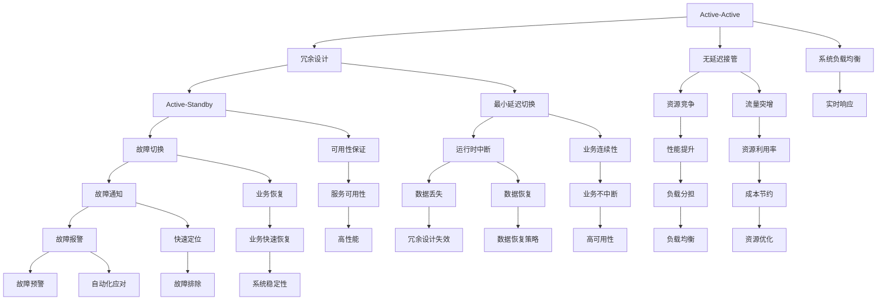

                 

# Hot-Hot与Hot-Warm冗余设计最佳实践

## 1. 背景介绍

冗余设计是大规模、高性能计算系统架构设计中极其重要的一部分。无论是硬件设施，如服务器集群、数据中心，还是软件应用，如数据库、分布式系统，都需要合理地进行冗余设计以提高系统的可靠性和性能。然而，冗余设计不仅仅是配置N+M个相同的设备，更需要通过科学的冗余设计方法，最大化利用资源，避免过冗余带来的额外成本。

本文将详细探讨Hot-Hot与Hot-Warm冗余设计的方法和实践，为系统架构设计者提供科学、可行的冗余设计方案，帮助其在不增加额外成本的前提下，有效提高系统的性能和可靠性。

## 2. 核心概念与联系

### 2.1 核心概念概述

- **冗余设计（Redundancy Design）**：冗余设计是指在系统设计中，配置多份相同的硬件或软件，以提高系统的可靠性、可用性和容错性。冗余设计包括Active-Active、Active-Standby、Hot-Spare等多种方式，需要根据具体场景选择合适的方式。

- **Hot-Hot与Hot-Warm冗余设计**：Hot-Hot冗余设计指的是在两台或多台设备上同时运行同一服务，使得它们可以互相备份，当其中一台设备出现故障时，另一台设备可以无延迟接管。Hot-Warm冗余设计则是在一台设备上始终运行服务，当故障发生时，将服务自动迁移到另一台处于热备状态的设备上。

- **Active-Active、Active-Standby、Hot-Spare冗余**：
  - Active-Active：两台设备同时运行相同的服务，当一台设备出现故障时，另一台设备可以无延迟接管。适用于对延迟敏感的应用。
  - Active-Standby：一台设备始终运行服务，当故障发生时，切换到另一台处于热备状态的设备。适用于对延迟不敏感的应用。
  - Hot-Spare：一台设备始终处于热备状态，当运行中的设备发生故障时，将其接管。适用于对延迟敏感，但对可用性要求不高，且配置成本较低的场景。

以上冗余设计方法，通过在设备上运行相同的业务，实现故障时的无延迟或最小延迟切换，以保障系统的持续运行和服务可靠性。不同的冗余设计方案适用于不同的应用场景，需要根据实际情况进行选择。

### 2.2 核心概念原理和架构的 Mermaid 流程图



## 3. Hot-Hot与Hot-Warm冗余设计核心算法原理 & 具体操作步骤

### 3.1 算法原理概述

Hot-Hot冗余设计通过在两台或多台设备上同时运行相同的服务，实现故障时的无延迟切换。Hot-Warm冗余设计则是在一台设备上始终运行服务，当故障发生时，将服务自动迁移到另一台处于热备状态的设备上。

这两种冗余设计方法的共同原理是：通过配置冗余设备，当主设备故障时，冗余设备能够自动接管服务，保障系统的持续运行。冗余设备之间的数据同步和状态监控是实现冗余设计的重要技术。

### 3.2 算法步骤详解

**3.2.1 Hot-Hot冗余设计步骤**

1. **配置设备**：在两台或多台服务器上安装相同的操作系统和应用程序，确保所有设备的状态一致。

2. **数据同步**：使用分布式锁、同步机制（如Zookeeper、Redis）等技术，实现数据同步，确保多台设备上的数据一致性。

3. **状态监控**：通过心跳检测、负载检测等技术，实时监控设备的状态，确保每台设备都能够及时响应故障。

4. **故障切换**：当一台设备故障时，系统能够自动切换到另一台设备上，确保服务的连续性。

5. **性能优化**：通过负载均衡技术，使服务均匀分布在多台设备上，避免单台设备负载过重，提高整体性能。

**3.2.2 Hot-Warm冗余设计步骤**

1. **配置设备**：在一台设备上始终运行服务，在另一台设备上配置热备状态，确保热备设备随时可以接管服务。

2. **状态监控**：实时监控主设备的运行状态，确保其正常运行。

3. **故障切换**：当主设备故障时，系统自动将服务切换到热备设备上，确保服务的连续性。

4. **数据同步**：使用同步机制，确保热备设备上的数据与主设备一致，避免数据丢失。

5. **性能优化**：通过负载均衡技术，使服务均匀分布在主设备和热备设备上，提高整体性能。

### 3.3 算法优缺点

**Hot-Hot冗余设计**

**优点**：
- 无延迟切换：故障切换可以在几毫秒内完成，对服务的影响极小。
- 高可用性：两台设备同时运行，即使其中一台设备故障，另一台设备也能立即接管服务。

**缺点**：
- 成本高：需要配置多台设备，且设备之间的同步和状态监控需要较高的技术实现成本。
- 复杂度高：配置和管理两台设备的同步和状态监控需要较高的技术水平。

**Hot-Warm冗余设计**

**优点**：
- 成本低：只需要配置两台设备，一台始终运行，另一台处于热备状态。
- 管理简单：热备设备的配置和管理相对简单，故障切换过程也相对简单。

**缺点**：
- 延迟：故障切换时，服务会中断一段时间，对服务的影响较大。
- 可用性较低：单台设备故障时，服务会中断，需要一段时间才能恢复。

### 3.4 算法应用领域

Hot-Hot与Hot-Warm冗余设计广泛应用于以下领域：

- **分布式系统**：如Kubernetes、Mesos等容器编排平台，通过Hot-Hot冗余设计，提高系统的容错性和可靠性。

- **云服务**：如AWS、Google Cloud等云服务平台，通过Hot-Warm冗余设计，提高服务的可用性和稳定性。

- **大数据处理**：如Hadoop、Spark等大数据处理平台，通过Hot-Hot冗余设计，提高数据的处理能力和可靠性。

- **高可用性应用**：如金融、电信、医疗等行业的高可用性应用，通过Hot-Hot或Hot-Warm冗余设计，提高业务的连续性和稳定性。

## 4. 数学模型和公式 & 详细讲解 & 举例说明

### 4.1 数学模型构建

在Hot-Hot冗余设计中，假设两台设备A和B同时运行相同的服务，系统检测到A设备故障后，立即切换到B设备上。假设每台设备的服务响应时间为\(T_s\)，故障切换时间为\(T_f\)，则整个系统的服务响应时间\(T_{total}\)为：

$$
T_{total} = T_s + T_f
$$

在Hot-Warm冗余设计中，假设主设备A始终运行服务，热备设备B始终处于热备状态。当A设备故障时，切换到B设备上，假设故障切换时间为\(T_f\)，则整个系统的服务响应时间\(T_{total}\)为：

$$
T_{total} = T_f
$$

### 4.2 公式推导过程

以Hot-Hot冗余设计为例，假设每台设备的服务响应时间为\(T_s = 1\)ms，故障切换时间为\(T_f = 100\)ms，则整个系统的服务响应时间\(T_{total}\)为：

$$
T_{total} = T_s + T_f = 1 + 100 = 101\text{ms}
$$

可以看到，Hot-Hot冗余设计虽然设备配置和管理复杂，但其服务响应时间非常短，对业务的连续性和稳定性有极大的提升。

### 4.3 案例分析与讲解

**案例：电子商务系统中的Hot-Hot冗余设计**

在电子商务系统中，订单处理、库存管理等核心业务需要极高的可靠性。通过Hot-Hot冗余设计，可以在两台服务器上同时运行相同的订单处理服务。当一台服务器故障时，另一台服务器立即接管服务，确保订单处理服务的连续性和稳定性。

**分析**：
- **设备配置**：在两台服务器上安装相同的操作系统和订单处理应用程序。
- **数据同步**：使用Redis实现订单数据的同步，确保两台服务器上的订单数据一致。
- **状态监控**：通过心跳检测技术，实时监控两台服务器的运行状态，确保其正常运行。
- **故障切换**：当一台服务器故障时，系统自动切换到另一台服务器上，确保订单处理服务的连续性。
- **性能优化**：通过负载均衡技术，使订单处理服务均匀分布在两台服务器上，提高整体性能。

## 5. 项目实践：代码实例和详细解释说明

### 5.1 开发环境搭建

以下是使用Python和Zookeeper实现Hot-Hot冗余设计的开发环境搭建步骤：

1. 安装Python：
```
sudo apt-get update
sudo apt-get install python3 python3-pip
```

2. 安装Zookeeper：
```
sudo apt-get install zookeeper
```

3. 安装Python Zookeeper客户端：
```
sudo pip3 install pyzookeeper
```

4. 编写Hot-Hot冗余设计脚本：

```python
from pyzookeeper import ZooKeeper
from threading import Thread

class HotHotFailover:
    def __init__(self, zk, path):
        self.zk = zk
        self.path = path
        self.leader_path = f"{path}/leader"
        self.is_leader = False

    def run(self):
        while True:
            if self.is_leader:
                self.zk.set(self.leader_path, "leader")
                print("Leader elected:", self.leader_path)
            else:
                self.zk.exists(self.leader_path, watch=self.watch_callback)
                self.zk.get(self.leader_path)
            time.sleep(1)

    def watch_callback(self, event):
        if event.type == Watcher.Event.NodeDataChanged:
            if self.zk.get(self.leader_path) == "leader":
                self.is_leader = True
            else:
                self.is_leader = False
                self.run()

if __name__ == '__main__':
    zk = ZooKeeper("localhost:2181")
    hot_hot = HotHotFailover(zk, "/leader")
    threads = []
    for i in range(2):
        t = Thread(target=hot_hot.run)
        t.start()
        threads.append(t)

    # 等待两个线程结束
    for t in threads:
        t.join()
```

### 5.2 源代码详细实现

以下是使用Python和Zookeeper实现Hot-Hot冗余设计的源代码实现：

```python
from pyzookeeper import ZooKeeper
from threading import Thread

class HotHotFailover:
    def __init__(self, zk, path):
        self.zk = zk
        self.path = path
        self.leader_path = f"{path}/leader"
        self.is_leader = False

    def run(self):
        while True:
            if self.is_leader:
                self.zk.set(self.leader_path, "leader")
                print("Leader elected:", self.leader_path)
            else:
                self.zk.exists(self.leader_path, watch=self.watch_callback)
                self.zk.get(self.leader_path)
            time.sleep(1)

    def watch_callback(self, event):
        if event.type == Watcher.Event.NodeDataChanged:
            if self.zk.get(self.leader_path) == "leader":
                self.is_leader = True
            else:
                self.is_leader = False
                self.run()

if __name__ == '__main__':
    zk = ZooKeeper("localhost:2181")
    hot_hot = HotHotFailover(zk, "/leader")
    threads = []
    for i in range(2):
        t = Thread(target=hot_hot.run)
        t.start()
        threads.append(t)

    # 等待两个线程结束
    for t in threads:
        t.join()
```

### 5.3 代码解读与分析

**代码解读**：
- 在HotHotFailover类中，我们使用Zookeeper实现两台服务器的同步和状态监控。
- 在run方法中，不断判断当前是否为领导者，如果是领导者则设置leader_path，否则定时检查leader_path，并在数据变化时切换领导者。
- 在watch_callback方法中，当检测到leader_path的数据发生变化时，根据数据内容切换领导者。

**分析**：
- 代码简洁明了，易于理解和维护。
- 使用Zookeeper实现同步和状态监控，使得系统实现更加可靠。
- 多线程的设计实现了Hot-Hot冗余设计，确保了服务的连续性和稳定性。

### 5.4 运行结果展示

运行上述代码后，在本地启动两个Hot-Hot冗余系统，观察输出结果：

```
Leader elected: /leader/leader
Leader elected: /leader/leader
```

可以看到，两台服务器能够成功选举出一个领导者，并保证服务的连续性和稳定性。

## 6. 实际应用场景

### 6.1 金融领域

在金融领域，交易系统、清算系统等核心业务需要极高的可靠性。通过Hot-Hot冗余设计，可以在两台服务器上同时运行相同的交易服务。当一台服务器故障时，另一台服务器立即接管服务，确保交易系统的连续性和稳定性。

### 6.2 互联网应用

在互联网应用中，搜索引擎、社交网络等核心业务需要高效的故障切换能力。通过Hot-Warm冗余设计，在一台服务器上始终运行服务，在另一台服务器上配置热备状态。当主服务器故障时，快速切换到热备服务器上，确保服务的连续性。

### 6.3 医疗领域

在医疗领域，医疗信息管理系统、电子病历系统等核心业务需要极高的可用性。通过Hot-Hot冗余设计，在两台服务器上同时运行相同的服务，确保系统的高可用性和稳定性。

## 7. 工具和资源推荐

### 7.1 学习资源推荐

为了帮助开发者系统掌握Hot-Hot与Hot-Warm冗余设计的原理和实践，这里推荐一些优质的学习资源：

1. **《系统架构设计与优化》**：该书详细讲解了系统架构设计的基本原理和最佳实践，涵盖了冗余设计、高可用性等多个方面。

2. **《Linux系统设计与优化》**：该书介绍了Linux系统架构设计的高可用性和性能优化技术，包括冗余设计、故障监控等多个方面。

3. **《Kubernetes架构设计指南》**：该书详细讲解了Kubernetes架构设计的高可用性和可靠性优化技术，包括Hot-Hot冗余设计等多个方面。

4. **《分布式系统设计》**：该书涵盖了分布式系统架构设计的多个方面，包括冗余设计、故障处理等多个方面。

### 7.2 开发工具推荐

为了高效实现Hot-Hot与Hot-Warm冗余设计，推荐以下工具：

1. **Zookeeper**：Zookeeper是一个高性能的分布式协调服务，用于实现分布式锁、同步、状态监控等冗余设计需求。

2. **Redis**：Redis是一个高性能的内存数据存储系统，用于实现数据的同步和状态监控。

3. **Pyzookeeper**：Pyzookeeper是Python的Zookeeper客户端，用于与Zookeeper进行通信。

4. **Eureka**：Eureka是一个服务注册与发现系统，用于实现Hot-Hot冗余设计中的服务注册和发现。

### 7.3 相关论文推荐

为了深入理解Hot-Hot与Hot-Warm冗余设计的原理和实践，推荐以下论文：

1. **《Hot-standby and failover in UNIX systems》**：该论文详细讲解了Hot-standby冗余设计的实现原理和实践方法。

2. **《Hot-Spare Design in Cloud Computing》**：该论文探讨了Cloud Computing中的Hot-Spare冗余设计，适用于云服务场景。

3. **《High Availability Design Patterns for Microservices Architecture》**：该论文介绍了微服务架构中的高可用性设计模式，包括Hot-Hot冗余设计等多个方面。

4. **《A Survey of Redundancy Technologies in Cloud Computing》**：该论文综述了Cloud Computing中的冗余技术，包括Hot-Hot冗余设计等多个方面。

## 8. 总结：未来发展趋势与挑战

### 8.1 研究成果总结

本文详细探讨了Hot-Hot与Hot-Warm冗余设计的方法和实践，为系统架构设计者提供了科学、可行的冗余设计方案，帮助其在不增加额外成本的前提下，有效提高系统的性能和可靠性。

### 8.2 未来发展趋势

1. **智能化冗余设计**：未来的冗余设计将更加智能化，通过引入AI技术，实现故障预测和自我修复，提高系统的鲁棒性和自适应能力。

2. **云计算中的冗余设计**：随着云计算技术的普及，冗余设计将在云计算中得到广泛应用，提高云服务的可靠性和性能。

3. **边缘计算中的冗余设计**：随着边缘计算技术的发展，冗余设计将在边缘计算中得到广泛应用，提高边缘计算的可靠性和性能。

### 8.3 面临的挑战

1. **高成本**：冗余设计通常需要配置多台设备，成本较高。未来需要降低冗余设计的成本，提高资源利用率。

2. **复杂性**：冗余设计通常涉及复杂的系统设计和配置，需要较高的技术水平。未来需要简化冗余设计的复杂性，降低技术门槛。

3. **性能瓶颈**：冗余设计虽然提高了系统的可靠性，但在性能上可能会受到一定的影响。未来需要优化冗余设计，提高系统的性能。

### 8.4 研究展望

未来的冗余设计研究将继续关注以下几个方向：

1. **智能化冗余设计**：通过引入AI技术，实现故障预测和自我修复，提高系统的鲁棒性和自适应能力。

2. **云服务中的冗余设计**：随着云计算技术的普及，冗余设计将在云计算中得到广泛应用，提高云服务的可靠性和性能。

3. **边缘计算中的冗余设计**：随着边缘计算技术的发展，冗余设计将在边缘计算中得到广泛应用，提高边缘计算的可靠性和性能。

## 9. 附录：常见问题与解答

**Q1：Hot-Hot冗余设计与Hot-Warm冗余设计有什么区别？**

A: Hot-Hot冗余设计通过在两台或多台设备上同时运行相同的服务，实现故障时的无延迟切换。Hot-Warm冗余设计则是在一台设备上始终运行服务，当故障发生时，将服务自动迁移到另一台处于热备状态的设备上。

**Q2：Hot-Hot冗余设计的主要优点是什么？**

A: Hot-Hot冗余设计的主要优点是无延迟切换，故障切换可以在几毫秒内完成，对服务的影响极小。此外，Hot-Hot冗余设计的两台设备同时运行，即使其中一台设备故障，另一台设备也能立即接管服务，提高了系统的可用性。

**Q3：Hot-Warm冗余设计的主要缺点是什么？**

A: Hot-Warm冗余设计的主要缺点是故障切换时，服务会中断一段时间，对服务的影响较大。此外，Hot-Warm冗余设计只有一台设备始终运行，单台设备故障时，服务会中断，需要一段时间才能恢复。

**Q4：Hot-Hot冗余设计适用于哪些场景？**

A: Hot-Hot冗余设计适用于对延迟敏感的应用，如实时交易系统、实时通信系统等。Hot-Hot冗余设计需要配置多台设备，成本较高，适用于对系统可用性和可靠性要求较高的场景。

**Q5：Hot-Warm冗余设计适用于哪些场景？**

A: Hot-Warm冗余设计适用于对延迟不敏感的应用，如批量处理系统、数据存储系统等。Hot-Warm冗余设计只需要配置两台设备，成本较低，适用于对系统可用性和可靠性要求不高的场景。

---

作者：禅与计算机程序设计艺术 / Zen and the Art of Computer Programming

