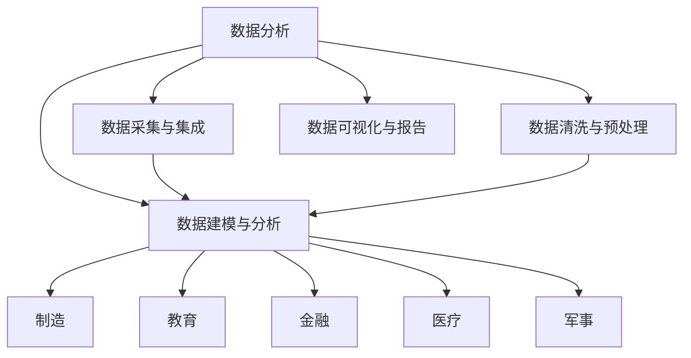

                 

# Insight在制造、教育、金融、医疗和军事中的应用

> 关键词：
1. 数据分析（Data Analysis）
2. 机器学习（Machine Learning）
3. 人工智能（Artificial Intelligence）
4. 制造（Manufacturing）
5. 教育（Education）
6. 金融（Finance）
7. 医疗（Healthcare）
8. 军事（Military）

## 1. 背景介绍

### 1.1 问题由来

随着数据科学和人工智能技术的飞速发展，数据驱动的决策和洞察在各个行业中的应用日益广泛。特别是在制造、教育、金融、医疗和军事等关键领域，数据和分析已经成为提升效率、优化决策、保障安全的重要手段。但数据和分析的真正价值，在于能否从海量数据中挖掘出有意义的洞察（Insight），并将其转化为实际的业务改进措施。

本文将详细介绍数据分析技术在上述领域的最新应用实践，展示如何利用大数据和人工智能技术，从海量数据中挖掘出有价值的洞察，帮助企业、教育机构、金融机构、医疗机构和军事部门优化决策流程，提升业务绩效。

### 1.2 问题核心关键点

要实现数据的洞察价值，需要在数据治理、数据处理、数据分析和数据可视化等多个环节进行全面优化。以下是几个关键问题点：

- 数据采集与集成：如何高效、可靠地采集和集成各类数据，保证数据质量？
- 数据清洗与预处理：如何处理缺失值、异常值、噪声等数据质量问题？
- 数据建模与分析：如何选择合适的方法和工具，进行数据建模和分析？
- 数据可视化与报告：如何通过图表、仪表盘等形式，生动、直观地展示数据分析结果？

## 2. 核心概念与联系

### 2.1 核心概念概述

为更好地理解数据分析技术在各个领域的应用，本节将介绍几个密切相关的核心概念：

- 数据分析（Data Analysis）：通过数据清洗、数据建模和数据可视化等手段，从数据中提取有用信息的过程。
- 机器学习（Machine Learning）：一种利用算法自动分析和改进数据模型的技术，广泛应用于预测、分类、聚类等任务。
- 人工智能（Artificial Intelligence）：使用算法使计算机系统具备类似人类的智能，涵盖知识表示、推理、学习等技术。
- 制造（Manufacturing）：通过工业生产过程，将原材料转化为成品的过程。
- 教育（Education）：培养人才的过程，涉及课程设计、教学方法、评估与反馈等多个环节。
- 金融（Finance）：涉及货币、信用、投资等领域，是经济活动的核心。
- 医疗（Healthcare）：涉及预防、诊断、治疗等活动，保障人民健康。
- 军事（Military）：涉及国防、安全、战略等领域，是国家的安全保障。

这些核心概念之间的逻辑关系可以通过以下Mermaid流程图来展示：



这个流程图展示了几类核心概念及其之间的逻辑关系：

1. 数据分析是整个过程的核心，其他环节都围绕其展开。
2. 数据采集与集成是基础，确保数据的质量和完整性。
3. 数据清洗与预处理是关键步骤，提升数据可用性。
4. 数据建模与分析是核心，通过算法进行知识提取和洞察挖掘。
5. 数据可视化与报告是展示和传播分析结果的方式。
6. 制造、教育、金融、医疗和军事是具体应用领域，直接受益于数据分析带来的决策优化。

这些概念共同构成了数据分析技术的完整应用框架，使其能够在不同场景下发挥作用。

## 3. 核心算法原理 & 具体操作步骤

### 3.1 算法原理概述

数据分析技术基于统计学、机器学习、人工智能等多个领域，其核心原理可以概括为以下几个步骤：

1. 数据采集与集成：通过ETL（Extract, Transform, Load）流程，从不同数据源收集数据，并进行标准化处理。
2. 数据清洗与预处理：处理缺失值、异常值、噪声等数据质量问题，保证数据的准确性和完整性。
3. 数据建模与分析：选择合适的方法和工具，进行数据建模和分析，提取有用的知识或模式。
4. 数据可视化与报告：通过图表、仪表盘等形式，展示分析结果，生成报告供决策参考。

### 3.2 算法步骤详解

基于上述核心原理，数据分析的具体操作步骤如下：

#### 3.2.1 数据采集与集成

数据采集与集成是数据分析的第一步，涉及到从不同数据源收集数据，并将其整合到一个统一的数据仓库中。具体步骤如下：

1. **数据源识别**：识别并选择合适的数据源，如企业内部系统、公共数据集、第三方API等。
2. **数据采集**：通过API、网络爬虫等方式，从数据源中自动采集数据。
3. **数据集成**：将采集到的数据进行标准化处理，如字段映射、格式转换、合并等，确保数据一致性和完整性。

#### 3.2.2 数据清洗与预处理

数据清洗与预处理是数据分析的核心环节，涉及到处理数据质量问题，保证数据可用性。具体步骤如下：

1. **缺失值处理**：对缺失值进行填补、删除或保持，以确保分析结果的准确性。
2. **异常值检测**：识别并处理异常值，避免其对分析结果的影响。
3. **数据标准化**：对数据进行归一化、标准化等处理，保证数据在数值上的可比性。
4. **数据去重**：去除重复数据，避免对分析结果造成误导。

#### 3.2.3 数据建模与分析

数据建模与分析是数据分析的核心阶段，涉及到选择合适的算法和模型，从数据中提取有用知识或模式。具体步骤如下：

1. **特征工程**：选择和构造有用的特征，提升模型的性能和解释性。
2. **模型选择**：根据任务特点，选择合适的算法和模型，如回归、分类、聚类等。
3. **模型训练与评估**：使用训练集训练模型，并在验证集上评估其性能，调整参数和优化模型。
4. **模型应用**：将训练好的模型应用于实际问题，进行预测、分类、聚类等任务。

#### 3.2.4 数据可视化与报告

数据可视化与报告是数据分析的最后一个环节，涉及到将分析结果以图表、仪表盘等形式展示出来，生成报告供决策参考。具体步骤如下：

1. **数据可视化**：使用图表、地图、热力图等形式，直观展示分析结果。
2. **报告生成**：将可视化结果和分析结论整合到报告中，生成可阅读的文档。
3. **报告共享**：将报告分享给相关利益相关者，供决策参考和行动依据。

### 3.3 算法优缺点

数据分析技术具有以下优点：

1. 提升决策质量：通过数据驱动的决策，可以降低主观偏见，提高决策的客观性和科学性。
2. 优化运营效率：通过数据分析，可以识别业务流程中的瓶颈和优化机会，提升运营效率。
3. 增强客户体验：通过数据分析，可以更好地理解客户需求和行为，提升客户满意度和忠诚度。
4. 降低风险和成本：通过数据分析，可以提前识别潜在风险和问题，避免损失和浪费。

但数据分析技术也存在一些缺点：

1. 数据质量和隐私问题：数据的质量和隐私保护是数据分析的前提，但数据来源广泛，质量参差不齐，隐私问题复杂。
2. 算法选择与调优困难：不同任务和数据特点需要不同的算法和模型，选择和调优难度较大。
3. 技术和资源要求高：数据分析需要专业的技术和设备，对企业和机构的技术和资源要求较高。
4. 结果解释性不足：数据分析结果可能缺乏可解释性，难以理解算法的决策过程。

### 3.4 算法应用领域

数据分析技术在制造、教育、金融、医疗和军事等多个领域都有广泛应用，具体如下：

#### 3.4.1 制造

数据分析在制造领域可以应用于生产线优化、质量控制、设备维护等方面：

1. **生产线优化**：通过分析生产线数据，识别瓶颈环节，优化生产流程。
2. **质量控制**：通过数据分析，实时监测产品质量，提升产品质量和一致性。
3. **设备维护**：通过数据分析，预测设备故障，提前进行维护，避免停机时间。

#### 3.4.2 教育

数据分析在教育领域可以应用于课程设计、学生评估、教学反馈等方面：

1. **课程设计**：通过分析学生成绩和学习行为，优化课程内容和教学方法。
2. **学生评估**：通过数据分析，评估学生的学习进度和理解能力，个性化推荐学习资源。
3. **教学反馈**：通过数据分析，收集和分析教师和学生的反馈，改进教学方法和教学效果。

#### 3.4.3 金融

数据分析在金融领域可以应用于风险管理、投资决策、客户分析等方面：

1. **风险管理**：通过数据分析，识别和评估金融风险，制定应对策略。
2. **投资决策**：通过数据分析，预测市场趋势，指导投资决策。
3. **客户分析**：通过数据分析，了解客户行为和需求，提升客户满意度和忠诚度。

#### 3.4.4 医疗

数据分析在医疗领域可以应用于疾病预测、治疗方案、患者管理等方面：

1. **疾病预测**：通过数据分析，预测疾病风险，提供早期干预措施。
2. **治疗方案**：通过数据分析，推荐最佳治疗方案，提高治疗效果。
3. **患者管理**：通过数据分析，监测患者健康状态，优化管理流程。

#### 3.4.5 军事

数据分析在军事领域可以应用于情报分析、作战模拟、战略规划等方面：

1. **情报分析**：通过数据分析，提取和分析情报信息，支持决策制定。
2. **作战模拟**：通过数据分析，进行作战模拟和仿真，评估战术效果。
3. **战略规划**：通过数据分析，分析军事形势，制定战略规划。

## 4. 数学模型和公式 & 详细讲解 & 举例说明

### 4.1 数学模型构建

数据分析技术涉及多个数学模型和算法，以下重点介绍几种常见的数学模型及其构建方法：

#### 4.1.1 线性回归模型

线性回归模型是数据分析中最基础的模型之一，用于预测一个连续型变量。其数学表达式为：

$$ y = \beta_0 + \beta_1 x_1 + \beta_2 x_2 + \cdots + \beta_n x_n + \epsilon $$

其中，$y$ 为预测变量，$x_i$ 为自变量，$\beta_i$ 为回归系数，$\epsilon$ 为随机误差项。

#### 4.1.2 逻辑回归模型

逻辑回归模型用于预测二分类问题，其数学表达式为：

$$ P(y=1|x) = \frac{1}{1+\exp(-\beta_0 - \beta_1 x_1 - \beta_2 x_2 - \cdots - \beta_n x_n)} $$

其中，$y=1$ 为正类，$y=0$ 为负类，$x_i$ 为自变量，$\beta_i$ 为回归系数。

#### 4.1.3 K-均值聚类算法

K-均值聚类算法是一种无监督学习算法，用于将数据点分为K个簇。其核心思想是通过计算每个数据点到各个簇中心的距离，将数据点分配到距离最近的簇中。

具体步骤如下：

1. 随机选择K个数据点作为初始簇中心。
2. 对于每个数据点，计算其到各个簇中心的距离，并将其分配到距离最近的簇中。
3. 对于每个簇，重新计算其中心点。
4. 重复步骤2和3，直到簇中心不再变化或达到预设迭代次数。

### 4.2 公式推导过程

以下是几种常见数据分析模型的推导过程：

#### 4.2.1 线性回归模型

线性回归模型的推导过程如下：

1. 假设样本数据为 $(x_i, y_i)$，$i=1,2,\cdots,n$。
2. 设定回归模型为 $y = \beta_0 + \beta_1 x_1 + \beta_2 x_2 + \cdots + \beta_n x_n + \epsilon$。
3. 最小化预测误差 $\epsilon$，得到最小二乘法公式：

$$
\hat{\beta} = (\mathbf{X}^T \mathbf{X})^{-1} \mathbf{X}^T \mathbf{y}
$$

其中，$\mathbf{X}$ 为自变量矩阵，$\mathbf{y}$ 为因变量向量，$\hat{\beta}$ 为回归系数估计。

#### 4.2.2 逻辑回归模型

逻辑回归模型的推导过程如下：

1. 假设样本数据为 $(x_i, y_i)$，$i=1,2,\cdots,n$，其中 $y_i \in \{0,1\}$。
2. 设定回归模型为 $P(y=1|x) = \frac{1}{1+\exp(-\beta_0 - \beta_1 x_1 - \beta_2 x_2 - \cdots - \beta_n x_n)}$。
3. 最大化似然函数 $\prod_{i=1}^n P(y_i|x_i)$，得到最大似然估计：

$$
\hat{\beta} = \arg\min_{\beta} \frac{1}{N} \sum_{i=1}^N \log [p_i(1-\hat{p}_i) + (1-p_i)\hat{p}_i]
$$

其中，$p_i$ 为预测概率，$\hat{p}_i$ 为预测值。

#### 4.2.3 K-均值聚类算法

K-均值聚类算法的推导过程如下：

1. 假设样本数据为 $(x_i)$，$i=1,2,\cdots,n$。
2. 设定聚类中心为 $\mathbf{C}_k = (\mu_{k1}, \mu_{k2}, \cdots, \mu_{kn})$，其中 $k=1,2,\cdots,K$。
3. 对于每个数据点 $x_i$，计算其到各个簇中心的距离，并将其分配到距离最近的簇中。
4. 对于每个簇，重新计算其中心点 $\mu_k$。
5. 重复步骤2和3，直到簇中心不再变化或达到预设迭代次数。

### 4.3 案例分析与讲解

#### 4.3.1 制造领域案例

假设某制造企业需要优化其生产流程，以提升产品质量和效率。该公司收集了生产线上的大量生产数据，包括设备状态、生产参数、工人操作等。通过数据分析，可以识别出生产流程中的瓶颈环节，优化生产过程。

具体步骤如下：

1. **数据采集与集成**：从生产设备和传感器中采集数据，整合到数据仓库中。
2. **数据清洗与预处理**：处理缺失值和异常值，进行数据标准化。
3. **数据分析与建模**：使用线性回归模型预测设备故障和生产效率，使用K-均值聚类算法识别生产瓶颈。
4. **数据可视化与报告**：使用图表展示预测结果和聚类分析结果，生成优化建议报告。

#### 4.3.2 教育领域案例

某大学希望通过数据分析提升其教学效果。学校收集了学生的学习数据，包括考试成绩、学习时间、课后反馈等。通过数据分析，可以识别出学生的学习行为模式，优化课程设计和教学方法。

具体步骤如下：

1. **数据采集与集成**：从学校系统中采集学生数据，整合到数据仓库中。
2. **数据清洗与预处理**：处理缺失值和异常值，进行数据标准化。
3. **数据分析与建模**：使用逻辑回归模型预测学生成绩，使用K-均值聚类算法识别学习行为模式。
4. **数据可视化与报告**：使用图表展示预测结果和聚类分析结果，生成优化建议报告。

#### 4.3.3 金融领域案例

某金融公司需要提升其风险管理能力。公司收集了客户数据，包括财务信息、交易记录、信用评分等。通过数据分析，可以识别出高风险客户，优化信用评估和风险控制策略。

具体步骤如下：

1. **数据采集与集成**：从客户系统中采集数据，整合到数据仓库中。
2. **数据清洗与预处理**：处理缺失值和异常值，进行数据标准化。
3. **数据分析与建模**：使用逻辑回归模型预测客户违约概率，使用K-均值聚类算法识别高风险客户群体。
4. **数据可视化与报告**：使用图表展示预测结果和聚类分析结果，生成风险管理建议报告。

#### 4.3.4 医疗领域案例

某医院需要提升其诊疗效果。医院收集了患者数据，包括病历记录、诊断结果、治疗方案等。通过数据分析，可以识别出疾病风险和最佳治疗方案，优化诊疗流程。

具体步骤如下：

1. **数据采集与集成**：从医院系统中采集患者数据，整合到数据仓库中。
2. **数据清洗与预处理**：处理缺失值和异常值，进行数据标准化。
3. **数据分析与建模**：使用逻辑回归模型预测疾病风险，使用K-均值聚类算法识别疾病类型。
4. **数据可视化与报告**：使用图表展示预测结果和聚类分析结果，生成诊疗优化建议报告。

#### 4.3.5 军事领域案例

某军事部门需要提升其情报分析能力。情报部门收集了各类情报数据，包括通信记录、卫星图像、地面报告等。通过数据分析，可以识别出潜在的威胁和情报价值，制定应对策略。

具体步骤如下：

1. **数据采集与集成**：从各种情报源中采集数据，整合到数据仓库中。
2. **数据清洗与预处理**：处理缺失值和异常值，进行数据标准化。
3. **数据分析与建模**：使用逻辑回归模型预测情报价值，使用K-均值聚类算法识别潜在威胁。
4. **数据可视化与报告**：使用图表展示预测结果和聚类分析结果，生成情报分析建议报告。

## 5. 项目实践：代码实例和详细解释说明

### 5.1 开发环境搭建

在进行数据分析项目实践前，需要先搭建好开发环境。以下是使用Python进行数据分析开发的常用环境配置流程：

1. 安装Anaconda：从官网下载并安装Anaconda，用于创建独立的Python环境。

2. 创建并激活虚拟环境：
```bash
conda create -n pytorch-env python=3.8 
conda activate pytorch-env
```

3. 安装必要的库：
```bash
conda install pandas numpy matplotlib seaborn scikit-learn scikit-learn jupyter notebook ipython
```

4. 配置Jupyter Notebook：
```bash
jupyter notebook --allow-root
```

5. 安装相关库：
```bash
pip install matplotlib seaborn
```

完成上述步骤后，即可在`pytorch-env`环境中开始数据分析实践。

### 5.2 源代码详细实现

以下是一个简单的数据分析示例，使用Python进行数据采集、清洗和可视化。

首先，导入必要的库：

```python
import pandas as pd
import numpy as np
import matplotlib.pyplot as plt
import seaborn as sns
```

然后，加载数据：

```python
data = pd.read_csv('data.csv')
```

接着，进行数据清洗：

```python
# 处理缺失值
data = data.dropna()

# 处理异常值
data = data[(data['age'] > 0) & (data['age'] < 150)]

# 标准化数据
data = (data - data.mean()) / data.std()
```

最后，进行数据可视化：

```python
# 绘制直方图
sns.histplot(data['age'], bins=30, kde=True)

# 绘制散点图
sns.scatterplot(data['age'], data['score'], hue='gender')

# 绘制饼图
sns.pieplot(data['gender'], labels=['Male', 'Female'], autopct='%1.1f%%')

# 显示图表
plt.show()
```

### 5.3 代码解读与分析

让我们再详细解读一下关键代码的实现细节：

**数据加载与预处理**：
- `pandas.read_csv`：用于读取CSV格式的数据文件。
- `data.dropna()`：用于删除包含缺失值的行。
- `data[data['age'] > 0]`：用于过滤年龄小于0的数据。
- `(data['age'] > 0) & (data['age'] < 150)`：用于过滤年龄不合理的异常值。
- `(data - data.mean()) / data.std()`：用于数据标准化，将数据转换为标准正态分布。

**数据可视化**：
- `sns.histplot`：用于绘制直方图，展示数据分布。
- `sns.scatterplot`：用于绘制散点图，展示变量间的关系。
- `sns.pieplot`：用于绘制饼图，展示变量比例。

**图表显示**：
- `plt.show()`：用于显示图表。

## 6. 实际应用场景

### 6.1 制造领域

数据分析在制造领域的应用场景包括生产线优化、质量控制、设备维护等：

#### 6.1.1 生产线优化

通过对生产线上的数据进行分析和建模，可以识别出生产流程中的瓶颈环节，优化生产流程。具体实现如下：

1. **数据采集与集成**：从生产设备和传感器中采集数据，整合到数据仓库中。
2. **数据清洗与预处理**：处理缺失值和异常值，进行数据标准化。
3. **数据分析与建模**：使用线性回归模型预测设备故障和生产效率，使用K-均值聚类算法识别生产瓶颈。
4. **数据可视化与报告**：使用图表展示预测结果和聚类分析结果，生成优化建议报告。

#### 6.1.2 质量控制

通过对生产过程中的数据进行分析，可以实时监测产品质量，提升产品质量和一致性。具体实现如下：

1. **数据采集与集成**：从生产设备和传感器中采集数据，整合到数据仓库中。
2. **数据清洗与预处理**：处理缺失值和异常值，进行数据标准化。
3. **数据分析与建模**：使用逻辑回归模型预测产品质量，使用K-均值聚类算法识别质量问题。
4. **数据可视化与报告**：使用图表展示预测结果和聚类分析结果，生成质量控制建议报告。

#### 6.1.3 设备维护

通过对设备运行数据进行分析，可以预测设备故障，提前进行维护，避免停机时间。具体实现如下：

1. **数据采集与集成**：从设备传感器中采集数据，整合到数据仓库中。
2. **数据清洗与预处理**：处理缺失值和异常值，进行数据标准化。
3. **数据分析与建模**：使用逻辑回归模型预测设备故障，使用K-均值聚类算法识别故障类型。
4. **数据可视化与报告**：使用图表展示预测结果和聚类分析结果，生成设备维护建议报告。

### 6.2 教育领域

数据分析在教育领域的应用场景包括课程设计、学生评估、教学反馈等：

#### 6.2.1 课程设计

通过对学生学习数据进行分析，可以优化课程内容和教学方法。具体实现如下：

1. **数据采集与集成**：从学校系统中采集学生数据，整合到数据仓库中。
2. **数据清洗与预处理**：处理缺失值和异常值，进行数据标准化。
3. **数据分析与建模**：使用逻辑回归模型预测学生成绩，使用K-均值聚类算法识别学习行为模式。
4. **数据可视化与报告**：使用图表展示预测结果和聚类分析结果，生成优化建议报告。

#### 6.2.2 学生评估

通过对学生学习数据进行分析，可以评估学生的学习进度和理解能力，个性化推荐学习资源。具体实现如下：

1. **数据采集与集成**：从学校系统中采集学生数据，整合到数据仓库中。
2. **数据清洗与预处理**：处理缺失值和异常值，进行数据标准化。
3. **数据分析与建模**：使用逻辑回归模型预测学生成绩，使用K-均值聚类算法识别学习行为模式。
4. **数据可视化与报告**：使用图表展示预测结果和聚类分析结果，生成个性化学习资源推荐报告。

#### 6.2.3 教学反馈

通过对教师和学生反馈数据进行分析，可以改进教学方法和教学效果。具体实现如下：

1. **数据采集与集成**：从学校系统中采集反馈数据，整合到数据仓库中。
2. **数据清洗与预处理**：处理缺失值和异常值，进行数据标准化。
3. **数据分析与建模**：使用逻辑回归模型预测教学效果，使用K-均值聚类算法识别教学问题。
4. **数据可视化与报告**：使用图表展示预测结果和聚类分析结果，生成教学优化建议报告。

### 6.3 金融领域

数据分析在金融领域的应用场景包括风险管理、投资决策、客户分析等：

#### 6.3.1 风险管理

通过对客户数据进行分析，可以识别出高风险客户，优化信用评估和风险控制策略。具体实现如下：

1. **数据采集与集成**：从客户系统中采集数据，整合到数据仓库中。
2. **数据清洗与预处理**：处理缺失值和异常值，进行数据标准化。
3. **数据分析与建模**：使用逻辑回归模型预测客户违约概率，使用K-均值聚类算法识别高风险客户群体。
4. **数据可视化与报告**：使用图表展示预测结果和聚类分析结果，生成风险管理建议报告。

#### 6.3.2 投资决策

通过对市场数据进行分析，可以预测市场趋势，指导投资决策。具体实现如下：

1. **数据采集与集成**：从金融市场系统中采集数据，整合到数据仓库中。
2. **数据清洗与预处理**：处理缺失值和异常值，进行数据标准化。
3. **数据分析与建模**：使用逻辑回归模型预测市场趋势，使用K-均值聚类算法识别股票类型。
4. **数据可视化与报告**：使用图表展示预测结果和聚类分析结果，生成投资决策建议报告。

#### 6.3.3 客户分析

通过对客户数据进行分析，可以了解客户行为和需求，提升客户满意度和忠诚度。具体实现如下：

1. **数据采集与集成**：从客户系统中采集数据，整合到数据仓库中。
2. **数据清洗与预处理**：处理缺失值和异常值，进行数据标准化。
3. **数据分析与建模**：使用逻辑回归模型预测客户需求，使用K-均值聚类算法识别客户群体。
4. **数据可视化与报告**：使用图表展示预测结果和聚类分析结果，生成客户分析建议报告。

### 6.4 医疗领域

数据分析在医疗领域的应用场景包括疾病预测、治疗方案、患者管理等：

#### 6.4.1 疾病预测

通过对患者数据进行分析，可以预测疾病风险，提供早期干预措施。具体实现如下：

1. **数据采集与集成**：从医院系统中采集患者数据，整合到数据仓库中。
2. **数据清洗与预处理**：处理缺失值和异常值，进行数据标准化。
3. **数据分析与建模**：使用逻辑回归模型预测疾病风险，使用K-均值聚类算法识别疾病类型。
4. **数据可视化与报告**：使用图表展示预测结果和聚类分析结果，生成疾病预测建议报告。

#### 6.4.2 治疗方案

通过对患者数据进行分析，可以推荐最佳治疗方案，提高治疗效果。具体实现如下：

1. **数据采集与集成**：从医院系统中采集患者数据，整合到数据仓库中。
2. **数据清洗与预处理**：处理缺失值和异常值，进行数据标准化。
3. **数据分析与建模**：使用逻辑回归模型预测最佳治疗方案，使用K-均值聚类算法识别治疗方案类型。
4. **数据可视化与报告**：使用图表展示预测结果和聚类分析结果，生成治疗方案建议报告。

#### 6.4.3 患者管理

通过对患者数据进行分析，可以监测患者健康状态，优化管理流程。具体实现如下：

1. **数据采集与集成**：从医院系统中采集患者数据，整合到数据仓库中。
2. **数据清洗与预处理**：处理缺失值和异常值，进行数据标准化。
3. **数据分析与建模**：使用逻辑回归模型预测患者健康状态，使用K-均值聚类算法识别健康问题。
4. **数据可视化与报告**：使用图表展示预测结果和聚类分析结果，生成患者管理建议报告。

### 6.5 军事领域

数据分析在军事领域的应用场景包括情报分析、作战模拟、战略规划等：

#### 6.5.1 情报分析

通过对情报数据进行分析，可以识别出潜在的威胁和情报价值，制定应对策略。具体实现如下：

1. **数据采集与集成**：从各种情报源中采集数据，整合到数据仓库中。
2. **数据清洗与预处理**：处理缺失值和异常值，进行数据标准化。
3. **数据分析与建模**：使用逻辑回归模型预测情报价值，使用K-均值聚类算法识别潜在威胁。
4. **数据可视化与报告**：使用图表展示预测结果和聚类分析结果，生成情报分析建议报告。

#### 6.5.2 作战模拟

通过对历史数据进行分析，可以进行作战模拟和仿真，评估战术效果。具体实现如下：

1. **数据采集与集成**：从历史作战记录中采集数据，整合到数据仓库中。
2. **数据清洗与预处理**：处理缺失值和异常值，进行数据标准化。
3. **数据分析与建模**：使用逻辑回归模型预测作战效果，使用K-均值聚类算法识别战术类型。
4. **数据可视化与报告**：使用图表展示预测结果和聚类分析结果，生成作战模拟建议报告。

#### 6.5.3 战略规划

通过对军事形势进行分析，可以制定战略规划，提升军事实力。具体实现如下：

1. **数据采集与集成**：从军事系统中采集数据，整合到数据仓库中。
2. **数据清洗与预处理**：处理缺失值和异常值，进行数据标准化。
3. **数据分析与建模**：使用逻辑回归模型预测军事形势，使用K-均值聚类算法识别战略问题。
4. **数据可视化与报告**：使用图表展示预测结果和聚类分析结果，生成战略规划建议报告。

## 7. 工具和资源推荐

### 7.1 学习资源推荐

为了帮助开发者系统掌握数据分析技术，这里推荐一些优质的学习资源：

1. **Coursera数据分析课程**：由斯坦福大学和约翰霍普金斯大学等知名学府开设，涵盖数据分析的各个环节，包括数据采集、数据清洗、数据分析和数据可视化等。
2. **Kaggle数据科学竞赛平台**：全球最大的数据科学竞赛平台，提供了大量的数据集和挑战题，帮助学习者实践数据分析技术。
3. **Kdnuggets数据分析博客**：提供数据分析的最新资讯、案例和实战技巧，涵盖机器学习、数据可视化、数据清洗等多个方面。
4. **Python数据分析实战**：一本实战性的数据分析书籍，介绍了Python在数据处理、数据可视化和数据分析中的应用。
5. **R语言数据分析入门**：一本R语言数据分析入门书籍，介绍了R语言在数据清洗、数据可视化和数据分析中的应用。

通过这些学习资源，相信你一定能够快速掌握数据分析技术的精髓，并用于解决实际的业务问题。

### 7.2 开发工具推荐

高效的开发离不开优秀的工具支持。以下是几款用于数据分析开发的常用工具：

1. **Jupyter Notebook**：一个开源的Web应用程序，支持编写和分享文档，适合进行数据分析和机器学习实验。
2. **Tableau**：一款流行的数据可视化工具，支持多种数据源和图表类型，帮助用户直观展示数据分析结果。
3. **Power BI**：微软开发的商业智能工具，支持大数据分析和实时报表展示，适合企业级数据分析应用。
4. **Python**：一种广泛使用的编程语言，拥有丰富的数据分析库和工具，如Pandas、NumPy、Scikit-learn等。
5. **R**：一种专门用于数据分析和统计分析的编程语言，拥有丰富的统计分析库和可视化工具。

合理利用这些工具，可以显著提升数据分析任务的开发效率，加快创新迭代的步伐。

### 7.3 相关论文推荐

数据分析技术的研究源于学界的持续探索。以下是几篇奠基性的相关论文，推荐阅读：

1. **《A Survey of Statistical Learning》**：由李航等著名学者所著，全面介绍了统计学习的基本概念和方法，是数据分析领域的经典教材。
2. **《The Elements of Statistical Learning》**：由蒂亚尼诺·弗莱尔、杰罗姆·弗里德曼等学者所著，介绍了统计学习的理论和实践，涵盖数据清洗、数据建模和数据可视化等多个方面。
3. **《Pattern Recognition and Machine Learning》**：由克里斯托弗·J·伯林杰所著，介绍了模式识别和机器学习的原理与方法，是数据分析和机器学习领域的权威教材。
4. **《Machine Learning Yearning》**：由Andrew Ng所著，介绍了机器学习的实践方法和技巧，适合数据分析和机器学习工程师参考。

通过学习这些前沿成果，可以帮助研究者把握学科前进方向，激发更多的创新灵感。

## 8. 总结：未来发展趋势与挑战

### 8.1 研究成果总结

数据分析技术已经在制造、教育、金融、医疗和军事等领域得到了广泛应用，取得了显著的成效。主要的研究成果包括：

1. 数据采集与集成：通过ETL流程，高效、可靠地采集和集成各类数据，确保数据质量。
2. 数据清洗与预处理：处理缺失值、异常值、噪声等数据质量问题，提升数据可用性。
3. 数据建模与分析：选择合适的方法和工具，进行数据建模和分析，提取有用的知识或模式。
4. 数据可视化与报告：通过图表、仪表盘等形式，展示分析结果，生成报告供决策参考。

### 8.2 未来发展趋势

展望未来，数据分析技术将呈现以下几个发展趋势：

1. 自动化与智能化：数据分析技术将逐渐向自动化和智能化方向发展，通过机器学习和人工智能技术，提升数据分析的效率和准确性。
2. 多模态融合：数据分析将不再局限于单一模态，而是融合多种数据源和多种数据类型，提升数据分析的全面性和深度。
3. 实时分析：数据分析将向实时化方向发展，通过流式处理和大数据技术，实现实时数据分析和决策支持。
4. 语义分析：数据分析将引入自然语言处理技术，进行语义分析和知识抽取，提升数据分析的可解释性和实用性。
5. 联邦学习：数据分析将向联邦学习方向发展，通过分布式计算和隐私保护技术，保护数据隐私和安全。

### 8.3 面临的挑战

尽管数据分析技术已经取得了显著进展，但在实际应用中仍面临一些挑战：

1. 数据质量和隐私问题：数据质量和隐私保护是数据分析的前提，但数据来源广泛，质量参差不齐，隐私问题复杂。
2. 算法选择与调优困难：不同任务和数据特点需要不同的算法和模型，选择和调优难度较大。
3. 技术和资源要求高：数据分析需要专业的技术和设备，对企业和机构的技术和资源要求较高。
4. 结果解释性不足：数据分析结果可能缺乏可解释性，难以理解算法的决策过程。
5. 计算资源限制：数据分析涉及大量数据处理和模型训练，对计算资源的要求较高，可能导致计算成本过高。

### 8.4 研究展望

面对数据分析技术面临的挑战，未来的研究需要在以下几个方面寻求新的突破：

1. 数据治理与隐私保护：制定数据治理标准和隐私保护政策，确保数据质量和隐私安全。
2. 自动化与智能化算法：开发更加自动化和智能化的数据分析算法，提升数据分析的效率和准确性。
3. 多模态数据融合：探索多模态数据融合方法，提升数据分析的全面性和深度。
4. 实时数据分析与决策支持：开发实时数据分析技术，支持实时决策和实时响应。
5. 可解释性与透明性：引入可解释性技术和透明性方法，提升数据分析的可解释性和可信性。

通过不断优化和创新，数据分析技术将进一步提升各个领域的业务绩效，推动社会的进步和发展。未来，数据分析技术必将成为企业、政府和社会不可或缺的重要工具，为各个领域提供数据驱动的决策支持。

## 9. 附录：常见问题与解答

**Q1：数据分析与机器学习的区别是什么？**

A: 数据分析是数据驱动的决策过程，旨在从数据中提取有用信息，支持决策和优化。而机器学习是利用算法自动分析和改进数据模型的过程，侧重于模型的训练和预测。数据分析是机器学习的基础，机器学习是数据分析的应用之一。

**Q2：如何选择合适的数据分析模型？**

A: 选择合适的数据分析模型需要考虑数据特点、任务类型和业务需求等多个因素。通常可以通过以下步骤来选择合适的模型：
1. 了解数据特点：查看数据分布、数据类型、数据质量等。
2. 明确任务类型：确定数据分析任务是分类、回归、聚类还是其他类型。
3. 选择合适的算法：根据数据特点和任务类型，选择适合的算法，如线性回归、逻辑回归、K-均值聚类等。
4. 评估模型性能：使用验证集评估模型性能，调整参数优化模型。

**Q3：数据分析结果的可视化有哪些常用方法？**

A: 数据分析结果的可视化常用方法包括：
1. 直方图：用于展示数据的分布情况。
2. 散点图：用于展示两个变量之间的关系。
3. 饼图：用于展示数据的比例分布。
4. 柱状图：用于展示数据的比较和对比。
5. 热力图：用于展示数据的关联关系和依赖性。
6. 时间序列图：用于展示数据随时间的变化趋势。

通过选择合适的可视化方法，可以生动、直观地展示数据分析结果，帮助用户理解数据的规律和特征。

**Q4：数据分析在制造领域有哪些应用？**

A: 数据分析在制造领域可以应用于生产线优化、质量控制、设备维护等方面。具体应用包括：
1. 生产线优化：通过数据分析，识别出生产流程中的瓶颈环节，优化生产流程。
2. 质量控制：通过数据分析，实时监测产品质量，提升产品质量和一致性。
3. 设备维护：通过数据分析，预测设备故障，提前进行维护，避免停机时间。

**Q5：数据分析在教育领域有哪些应用？**

A: 数据分析在教育领域可以应用于课程设计、学生评估、教学反馈等方面。具体应用包括：
1. 课程设计：通过数据分析，优化课程内容和教学方法。
2. 学生评估：通过数据分析，评估学生的学习进度和理解能力，个性化推荐学习资源。
3. 教学反馈：通过数据分析，收集和分析教师和学生的反馈，改进教学方法和教学效果。

通过数据分析，教育机构可以更科学、更个性化地进行教育教学，提升教育质量和效果。

**Q6：数据分析在金融领域有哪些应用？**

A: 数据分析在金融领域可以应用于风险管理、投资决策、客户分析等方面。具体应用包括：
1. 风险管理：通过数据分析，识别出高风险客户，优化信用评估和风险控制策略。
2. 投资决策：通过数据分析，预测市场趋势，指导投资决策。
3. 客户分析：通过数据分析，了解客户行为和需求，提升客户满意度和忠诚度。

通过数据分析，金融机构可以更科学、更精准地进行风险控制和投资决策，提升客户满意度和业务绩效。

**Q7：数据分析在医疗领域有哪些应用？**

A: 数据分析在医疗领域可以应用于疾病预测、治疗方案、患者管理等方面。具体应用包括：
1. 疾病预测：通过数据分析，预测疾病风险，提供早期干预措施。
2. 治疗方案：通过数据分析，推荐最佳治疗方案，提高治疗效果。
3. 患者管理：通过数据分析，监测患者健康状态，优化管理流程。

通过数据分析，医疗机构可以更科学、更个性化地进行疾病预防和治疗，提升医疗质量和效率。

**Q8：数据分析在军事领域有哪些应用？**

A: 数据分析在军事领域可以应用于情报分析、作战模拟、战略规划等方面。具体应用包括：
1. 情报分析：通过数据分析，识别出潜在的威胁和情报价值，制定应对策略。
2. 作战模拟：通过数据分析，进行作战模拟和仿真，评估战术效果。
3. 战略

