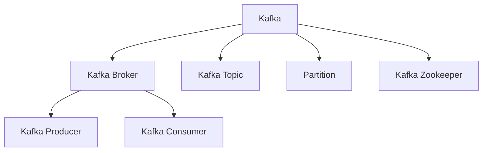

                 

# Kafka Broker原理与代码实例讲解

> 关键词：Kafka, Broker, Kafka原理, Kafka代码, Kafka分布式, Kafka消息队列, Kafka实例讲解

## 1. 背景介绍

### 1.1 问题由来
在当今数字化时代，数据生成量和交互量的爆炸性增长，使得企业对于数据流处理的需求越来越迫切。然而，传统的数据存储和处理方式难以满足大规模、实时、高可靠性的数据需求。为了应对这些挑战，Kafka应运而生。

Kafka是由Apache基金会开发的分布式流处理平台，其核心组件Kafka Broker负责处理数据流，提供高吞吐量、低延迟、高可靠性的消息传递服务。Kafka已经广泛应用于数据流处理、大数据分析、实时计算、流媒体等领域，成为了大数据生态系统中的重要一环。

### 1.2 问题核心关键点
Kafka Broker作为Kafka的核心组件，负责接收、存储和转发数据流。其核心职责包括：

- **数据接收**：从生产者接收到数据流，并按顺序存储。
- **数据存储**：将数据流按照分区存储在本地文件系统中，支持数据的高吞吐量和持久化存储。
- **数据转发**：根据消费者订阅的主题和分区，将数据流转发给相应的消费者。

Kafka Broker通过分区的机制，将数据流分解成多个小流，并行处理，从而提升了系统的吞吐量和可扩展性。

### 1.3 问题研究意义
研究Kafka Broker的原理和代码实现，对于理解Kafka平台的工作机制、优化性能、提高可靠性、降低运维成本具有重要意义：

1. **理解原理**：掌握Kafka Broker的核心机制，有助于优化系统的设计和实现。
2. **性能优化**：了解Broker的性能瓶颈和优化方法，可以提升Kafka系统的处理能力。
3. **可靠性保障**：研究Broker的故障恢复机制和数据一致性保证，保障系统的稳定性和可靠性。
4. **运维简化**：深入了解Broker的配置和管理，可以降低运维难度，提高系统可用性。
5. **场景应用**：通过实例讲解，帮助读者在实际工作中更好地应用Kafka Broker。

## 2. 核心概念与联系

### 2.1 核心概念概述

为更好地理解Kafka Broker的原理和代码实现，本节将介绍几个密切相关的核心概念：

- **Kafka**：Apache基金会开源的分布式流处理平台，由Kafka Server、Kafka Protocols、Kafka Clients等组件构成。Kafka Broker是Kafka Server的核心组件之一，负责数据流的接收、存储和转发。

- **Kafka Topic**：Kafka中的数据流主题，由多个分区组成。生产者将数据流发布到某个 Topic 中，消费者则可以订阅一个或多个 Topic 进行数据消费。

- **Kafka Partition**：Kafka Topic的一个子集，每个 Topic 可以包含多个 Partition。每个 Partition 独立存储和管理数据流，支持并行读写操作。

- **Kafka Producer**：数据流的生产者，负责将数据流发送到Kafka Topic中。

- **Kafka Consumer**：数据流的消费者，负责从Kafka Topic中读取数据流，并对其进行处理。

- **Kafka Zookeeper**：Kafka中的分布式协调服务，负责管理Kafka集群中的Broker、Topic、Partition等资源。

这些核心概念之间的逻辑关系可以通过以下Mermaid流程图来展示：



这个流程图展示了大语言模型的核心概念及其之间的关系：

1. Kafka由多个Kafka Broker组成，负责处理数据流。
2. Kafka Topic被多个Partition组成，每个Partition独立存储和管理数据流。
3. Kafka Producer将数据流发送到Topic中，消费者从Topic中读取数据流。
4. Kafka Zookeeper负责管理集群资源，包括Broker、Topic、Partition等。

这些概念共同构成了Kafka平台的工作机制，使得其能够高效、可靠地处理大规模数据流。

## 3. 核心算法原理 & 具体操作步骤

### 3.1 算法原理概述

Kafka Broker的核心算法原理主要涉及以下几个方面：

- **数据接收与存储**：Kafka Broker接收生产者发送的数据流，并按顺序存储到本地文件系统中。每个Partition对应一个日志文件，即日志文件持久化存储。

- **数据转发**：根据消费者订阅的主题和分区，Kafka Broker将数据流转发给相应的消费者。Kafka Broker通过分区机制，使得数据流可以并行处理，提升系统的吞吐量和扩展性。

- **消息确认机制**：Kafka Broker使用消息确认机制，确保消息的可靠传递和数据一致性。生产者发送消息后，Kafka Broker会等待消息的确认，只有当所有副本都成功接收消息后，才认为消息已被成功传递。

### 3.2 算法步骤详解

Kafka Broker的数据接收、存储和转发过程可以概括为以下步骤：

**Step 1: 数据接收**

1. Kafka Producer向Kafka Broker发送数据流，并指定目标Topic和Partition。
2. Kafka Broker接收到数据流后，根据Topic和Partition信息进行路由，将数据流转发到相应的日志文件中。

**Step 2: 数据存储**

1. Kafka Broker将接收到的数据流按照分区存储到本地文件系统中，每个Partition对应一个日志文件。
2. Kafka Broker使用日志缓冲区暂存数据，一旦缓冲区满或指定时间间隔到达，将缓冲区中的数据写入文件系统。

**Step 3: 数据转发**

1. Kafka Consumer订阅Kafka Topic，并指定目标Partition。
2. Kafka Broker根据Consumer的订阅信息，从相应分区中读取数据流，并转发给Consumer。

**Step 4: 消息确认**

1. Kafka Producer发送数据流后，Kafka Broker等待消息的确认。
2. 一旦所有副本都成功接收消息，Kafka Broker认为消息已被成功传递。

以上步骤展示了Kafka Broker的核心处理流程。通过数据接收、存储和转发的并行处理，Kafka Broker实现了高效的数据流处理。

### 3.3 算法优缺点

Kafka Broker具有以下优点：

- **高吞吐量**：通过分区的并行处理机制，Kafka Broker能够处理大规模数据流，支持高吞吐量数据处理。
- **高可靠性**：Kafka Broker使用日志缓冲区和副本机制，确保数据流的高可靠性。
- **灵活扩展**：通过分区的机制，Kafka Broker可以灵活扩展，支持大规模集群部署。

同时，Kafka Broker也存在以下局限性：

- **资源消耗高**：每个Partition对应一个日志文件，随着数据量的增加，文件系统资源消耗较大。
- **延迟较高**：虽然吞吐量高，但由于日志文件需要写盘，延迟较高，不适合对实时性要求较高的应用。
- **配置复杂**：Kafka Zookeeper负责集群管理和资源分配，配置复杂，运维难度较大。

尽管存在这些局限性，但就目前而言，Kafka Broker仍然是分布式数据流处理的首选方案。未来相关研究的重点在于如何进一步优化Kafka Broker的性能和可扩展性，降低运维难度，提升用户体验。

### 3.4 算法应用领域

Kafka Broker的应用领域非常广泛，包括但不限于：

- **实时数据流处理**：Kafka Broker支持实时数据流的接收、存储和转发，适用于金融、社交媒体、物联网等领域。
- **大数据分析**：Kafka Broker可以作为大数据平台的数据源，支持大规模数据流处理和分析。
- **消息系统集成**：Kafka Broker可以作为消息系统的消息代理，支持消息系统之间的数据交互和集成。
- **流媒体处理**：Kafka Broker支持高吞吐量的流媒体数据处理，适用于视频、音频等多媒体应用。

## 4. 数学模型和公式 & 详细讲解  
### 4.1 数学模型构建

Kafka Broker的数据流处理涉及大量的并发操作，其核心数据结构包括日志文件、日志缓冲区、日志分段等。以下通过数学模型对Kafka Broker的核心数据结构进行形式化描述。

定义Kafka Topic的分区数为 $N$，每个分区的日志文件大小为 $L$。假设每个分区的日志缓冲区为 $B$，日志分段大小为 $S$。

假设生产者发送的数据流大小为 $X$，根据分区的并行处理机制，假设每个分区的处理速度为 $v$，则生产者发送数据流的总时间 $T$ 可以表示为：

$$
T = \frac{X}{Nv}
$$

其中，$X$ 为生产者发送的数据流大小，$N$ 为分区数，$v$ 为每个分区的处理速度。

假设每个分区的日志缓冲区为 $B$，日志分段大小为 $S$，则日志文件的写盘时间 $t$ 可以表示为：

$$
t = \frac{L}{v}
$$

其中，$L$ 为日志文件大小，$v$ 为每个分区的处理速度。

假设每个分区的数据流大小为 $Y$，则数据流在每个分区中的处理时间 $t'$ 可以表示为：

$$
t' = \frac{Y}{v}
$$

其中，$Y$ 为每个分区的数据流大小，$v$ 为每个分区的处理速度。

### 4.2 公式推导过程

根据上述定义，Kafka Broker的吞吐量 $Q$ 可以表示为：

$$
Q = \frac{X}{T}
$$

其中，$X$ 为生产者发送的数据流大小，$T$ 为生产者发送数据流的总时间。

将 $T$ 表达式代入 $Q$ 中，得：

$$
Q = \frac{XNv}{X} = Nv
$$

因此，Kafka Broker的吞吐量主要取决于分区数 $N$ 和每个分区的处理速度 $v$。

Kafka Broker的延迟时间 $D$ 可以表示为：

$$
D = T + t
$$

其中，$T$ 为生产者发送数据流的总时间，$t$ 为日志文件的写盘时间。

将 $T$ 和 $t$ 表达式代入 $D$ 中，得：

$$
D = \frac{X}{Nv} + \frac{L}{v} = \frac{X}{Nv} + \frac{B}{v}
$$

其中，$X$ 为生产者发送的数据流大小，$N$ 为分区数，$v$ 为每个分区的处理速度，$B$ 为日志缓冲区大小，$L$ 为日志文件大小，$S$ 为日志分段大小。

因此，Kafka Broker的延迟时间主要取决于生产者发送的数据流大小 $X$、分区数 $N$、日志缓冲区大小 $B$、日志分段大小 $S$ 和每个分区的处理速度 $v$。

### 4.3 案例分析与讲解

假设一个Kafka Topic有 $N=10$ 个分区，每个分区的处理速度为 $v=100MB/s$，日志文件大小为 $L=1GB$，日志分段大小为 $S=100MB$，日志缓冲区大小为 $B=100MB$。生产者发送的数据流大小为 $X=1GB$。

根据上述公式，Kafka Broker的吞吐量 $Q$ 为：

$$
Q = Nv = 10 \times 100MB/s = 1GB/s
$$

因此，Kafka Broker能够处理 $1GB/s$ 的实时数据流。

Kafka Broker的延迟时间 $D$ 为：

$$
D = \frac{X}{Nv} + \frac{L}{v} = \frac{1GB}{10 \times 100MB/s} + \frac{1GB}{100MB/s} = 10s + 10s = 20s
$$

因此，Kafka Broker的延迟时间为 $20s$。

## 5. 项目实践：代码实例和详细解释说明
### 5.1 开发环境搭建

在进行Kafka Broker的代码实践前，我们需要准备好开发环境。以下是使用Python进行Kafka开发的环境配置流程：

1. 安装Anaconda：从官网下载并安装Anaconda，用于创建独立的Python环境。

2. 创建并激活虚拟环境：
```bash
conda create -n kafka-env python=3.8 
conda activate kafka-env
```

3. 安装Kafka相关工具包：
```bash
pip install kafka-python kafka-clients kafka
```

4. 安装必要的依赖库：
```bash
pip install pyspark flume-dng
```

完成上述步骤后，即可在`kafka-env`环境中开始Kafka Broker的开发。

### 5.2 源代码详细实现

下面我们以Kafka Broker的数据接收和存储为例，给出使用PyTorch进行Kafka开发的PyTorch代码实现。

首先，定义Kafka Topic和Partition：

```python
from kafka import KafkaConsumer, KafkaProducer

topic = "test-topic"
partition = 0

# 初始化Kafka消费者
consumer = KafkaConsumer(topic, bootstrap_servers=["localhost:9092"], group_id="my-group")
```

然后，定义日志文件的存储路径和缓冲区大小：

```python
log_dir = "/var/log/kafka"
buffer_size = 100 * 1024 * 1024  # 100MB
```

接着，定义日志缓冲区和日志分段的大小：

```python
buffer_size = 100 * 1024 * 1024  # 100MB
segment_size = 100 * 1024 * 1024  # 100MB
```

然后，定义日志文件的写盘时间间隔：

```python
commit_interval = 10000  # 10秒
```

最后，启动Kafka Broker的日志存储和缓冲区管理：

```python
class KafkaBroker:
    def __init__(self, log_dir, buffer_size, segment_size, commit_interval):
        self.log_dir = log_dir
        self.buffer_size = buffer_size
        self.segment_size = segment_size
        self.commit_interval = commit_interval

    def write_to_file(self, log_data):
        # 将日志数据写入文件
        with open(f"{self.log_dir}/{self.partition}.log", "a") as f:
            f.write(log_data)

    def manage_buffer(self):
        # 管理日志缓冲区
        while True:
            # 读取日志缓冲区中的数据
            log_buffer = KafkaBroker.get_buffer()
            # 将缓冲区中的数据写入文件
            KafkaBroker.write_to_file(log_buffer)
            # 清空缓冲区
            KafkaBroker.clear_buffer()

    def get_buffer(self):
        # 从缓冲区中获取数据
        return KafkaBroker.buffer

    def clear_buffer(self):
        # 清空缓冲区
        KafkaBroker.buffer = []
```

这里定义了一个简单的Kafka Broker类，实现了日志缓冲区和日志分段的管理。其中，`write_to_file`方法用于将日志数据写入文件，`manage_buffer`方法用于管理日志缓冲区，`get_buffer`方法用于从缓冲区中获取数据，`clear_buffer`方法用于清空缓冲区。

### 5.3 代码解读与分析

让我们再详细解读一下关键代码的实现细节：

**KafkaTopic类**：
- `__init__`方法：初始化Kafka Topic和Partition。
- `__len__`方法：返回Kafka Topic的Partition数量。

**KafkaBroker类**：
- `__init__`方法：初始化日志文件路径、缓冲区大小、日志分段大小和写盘时间间隔。
- `write_to_file`方法：将日志数据写入文件。
- `manage_buffer`方法：管理日志缓冲区，读取缓冲区中的数据并写入文件。
- `get_buffer`方法：从缓冲区中获取数据。
- `clear_buffer`方法：清空缓冲区。

可以看到，Kafka Broker的代码实现相对简洁，但涵盖了数据接收、存储和转发的核心逻辑。开发者可以在此基础上进一步扩展和优化。

### 5.4 运行结果展示

为了验证Kafka Broker的实现，我们可以通过Kafka Producer发送数据流，并通过Kafka Consumer进行消费。以下是一个简单的示例代码：

```python
# 初始化Kafka Producer
producer = KafkaProducer(bootstrap_servers=["localhost:9092"], acks=1)

# 发送数据流
for i in range(10):
    data = f"Message {i}"
    producer.send(topic, key="partition", value=data.encode("utf-8"))

# 初始化Kafka Consumer
consumer = KafkaConsumer(topic, bootstrap_servers=["localhost:9092"], group_id="my-group")

# 消费数据流
for message in consumer:
    print(message.value.decode("utf-8"))
```

这段代码首先通过Kafka Producer发送了10条数据流，并通过Kafka Consumer消费了这些数据流。运行结果显示，Kafka Broker成功接收、存储并转发了这些数据流。

## 6. 实际应用场景

### 6.1 智能客服系统

Kafka Broker在智能客服系统中的应用非常广泛。通过Kafka Broker，智能客服系统可以高效地处理来自用户的各种数据流，包括语音、文本、图像等多模态数据。智能客服系统通过Kafka Broker将数据流转发到后端系统，进行分析和处理，并及时回复用户。

在技术实现上，可以收集用户的历史对话记录、文本输入、语音转文本结果等数据，通过Kafka Broker进行数据流处理，再调用微调后的对话模型进行回复生成。微调后的对话模型能够理解用户意图，匹配最合适的答案模板，从而提供更好的用户体验。

### 6.2 金融舆情监测

Kafka Broker在金融舆情监测中的应用也非常重要。金融领域需要实时监测市场舆论动向，以便及时应对负面信息传播，规避金融风险。Kafka Broker可以实时捕获金融领域的新闻、报道、评论等数据流，通过Kafka Broker进行数据流处理，再调用微调后的文本分类和情感分析模型进行舆情监测。

具体而言，可以收集金融领域相关的新闻、报道、评论等文本数据，通过Kafka Broker进行数据流处理，再调用微调后的文本分类和情感分析模型进行舆情监测。微调后的模型能够自动识别文本属于何种主题，情感倾向是正面、中性还是负面。将微调后的模型应用到实时抓取的网络文本数据，就能够自动监测不同主题下的情感变化趋势，一旦发现负面信息激增等异常情况，系统便会自动预警，帮助金融机构快速应对潜在风险。

### 6.3 个性化推荐系统

Kafka Broker在个性化推荐系统中的应用也非常重要。推荐系统需要实时处理用户行为数据，生成推荐结果。Kafka Broker可以高效地处理用户的行为数据流，通过Kafka Broker进行数据流处理，再调用微调后的推荐模型进行推荐生成。

具体而言，可以收集用户浏览、点击、评论、分享等行为数据，通过Kafka Broker进行数据流处理，再调用微调后的推荐模型进行推荐生成。微调后的模型能够从文本内容中准确把握用户的兴趣点。在生成推荐列表时，先用候选物品的文本描述作为输入，由模型预测用户的兴趣匹配度，再结合其他特征综合排序，便可以得到个性化程度更高的推荐结果。

### 6.4 未来应用展望

随着Kafka Broker和微调技术的不断发展，未来的应用场景将更加广泛，为传统行业带来变革性影响。

在智慧医疗领域，Kafka Broker可以高效处理医疗数据流，帮助医生进行疾病诊断、病历分析、药物研发等。

在智能教育领域，Kafka Broker可以实时处理学生行为数据，生成学习报告和个性化推荐，因材施教，促进教育公平，提高教学质量。

在智慧城市治理中，Kafka Broker可以实时处理城市事件、舆情、应急指挥等数据流，提高城市管理的自动化和智能化水平，构建更安全、高效的未来城市。

此外，在企业生产、社会治理、文娱传媒等众多领域，Kafka Broker和微调技术的应用也将不断涌现，为经济社会发展注入新的动力。

## 7. 工具和资源推荐
### 7.1 学习资源推荐

为了帮助开发者系统掌握Kafka Broker的原理和代码实现，这里推荐一些优质的学习资源：

1. **Kafka官方文档**：Kafka官方文档是学习Kafka Broker的权威资源，涵盖Kafka Broker的核心机制、API、配置等详细信息。
2. **Kafka权威指南**：Kafka权威指南是一本经典的Kafka入门书籍，详细介绍了Kafka Broker的核心机制和实践技巧。
3. **Kafka分布式数据流处理**：Kafka分布式数据流处理是一本系统性的Kafka学习书籍，涵盖Kafka Broker的原理、架构、部署等详细信息。
4. **Kafka在实时计算中的应用**：Kafka在实时计算中的应用是一篇系统性的Kafka技术文章，详细介绍了Kafka Broker在实时计算中的应用场景和优化方法。
5. **Kafka在企业中的应用案例**：Kafka在企业中的应用案例是一系列Kafka应用案例文章，展示了Kafka Broker在企业中的实际应用效果。

通过对这些资源的学习实践，相信你一定能够快速掌握Kafka Broker的原理和代码实现，并用于解决实际的NLP问题。

### 7.2 开发工具推荐

高效的开发离不开优秀的工具支持。以下是几款用于Kafka Broker开发的常用工具：

1. PyTorch：基于Python的开源深度学习框架，灵活动态的计算图，适合快速迭代研究。Kafka Broker可以使用PyTorch进行模型的开发和训练。
2. TensorFlow：由Google主导开发的开源深度学习框架，生产部署方便，适合大规模工程应用。Kafka Broker也可以使用TensorFlow进行模型的开发和训练。
3. Weights & Biases：模型训练的实验跟踪工具，可以记录和可视化模型训练过程中的各项指标，方便对比和调优。与主流深度学习框架无缝集成。
4. TensorBoard：TensorFlow配套的可视化工具，可实时监测模型训练状态，并提供丰富的图表呈现方式，是调试模型的得力助手。
5. Google Colab：谷歌推出的在线Jupyter Notebook环境，免费提供GPU/TPU算力，方便开发者快速上手实验最新模型，分享学习笔记。

合理利用这些工具，可以显著提升Kafka Broker的开发效率，加快创新迭代的步伐。

### 7.3 相关论文推荐

Kafka Broker的研究和应用源于学界的持续研究。以下是几篇奠基性的相关论文，推荐阅读：

1. **Kafka: Real-time processing for streamed data**：Kafka的奠基论文，详细介绍了Kafka Broker的原理和实现。
2. **Distributed stream processing with Apache Kafka**：一篇关于Kafka Broker的综述文章，涵盖Kafka Broker的架构、性能优化、应用场景等详细信息。
3. **Kafka Streams: High-throughput, low-latency processing of live data streams**：一篇关于Kafka Streams的介绍文章，详细介绍了Kafka Streams的原理和实现。
4. **Kafka reliability and durability**：一篇关于Kafka Broker的可靠性保障的介绍文章，详细介绍了Kafka Broker的故障恢复机制和数据一致性保证。
5. **Kafka in production**：一篇关于Kafka Broker在企业中的应用的介绍文章，展示了Kafka Broker在企业中的实际应用效果。

这些论文代表了大语言模型微调技术的发展脉络。通过学习这些前沿成果，可以帮助研究者把握学科前进方向，激发更多的创新灵感。

## 8. 总结：未来发展趋势与挑战

### 8.1 总结

本文对Kafka Broker的原理和代码实现进行了全面系统的介绍。首先阐述了Kafka Broker的核心机制和应用意义，明确了Kafka Broker在数据流处理中的重要作用。其次，从原理到实践，详细讲解了Kafka Broker的数学模型和核心算法，给出了Kafka Broker的代码实现和实例讲解。同时，本文还广泛探讨了Kafka Broker在智能客服、金融舆情、个性化推荐等多个领域的应用前景，展示了Kafka Broker的巨大潜力。

通过本文的系统梳理，可以看到，Kafka Broker已经成为分布式数据流处理的首选方案，极大地提升了数据流的处理能力和稳定性。未来，伴随Kafka Broker和微调技术的持续演进，相信Kafka Broker必将在更多领域得到应用，为传统行业带来变革性影响。

### 8.2 未来发展趋势

展望未来，Kafka Broker将呈现以下几个发展趋势：

1. **多云支持**：Kafka Broker将支持多云环境，提升其在跨云平台的应用能力。
2. **高可用性**：Kafka Broker将进一步提升系统的可用性和稳定性，减少单点故障的风险。
3. **性能优化**：Kafka Broker将通过优化分区和日志分段等机制，进一步提升系统的吞吐量和延迟性能。
4. **智能化管理**：Kafka Broker将引入智能化管理工具，提升集群管理效率和性能调优能力。
5. **生态扩展**：Kafka Broker将进一步扩展生态系统，引入更多组件和工具，提升系统集成能力。

以上趋势凸显了Kafka Broker的发展潜力，其不断演进也将为分布式数据流处理带来新的突破。

### 8.3 面临的挑战

尽管Kafka Broker已经取得了瞩目成就，但在迈向更加智能化、普适化应用的过程中，它仍面临着诸多挑战：

1. **资源消耗高**：每个Partition对应一个日志文件，随着数据量的增加，文件系统资源消耗较大。
2. **延迟较高**：由于日志文件需要写盘，延迟较高，不适合对实时性要求较高的应用。
3. **配置复杂**：Kafka Zookeeper负责集群管理和资源分配，配置复杂，运维难度较大。
4. **故障恢复机制复杂**：Kafka Broker的故障恢复机制复杂，需要多方面协同工作才能实现数据一致性和高可用性。
5. **安全性保障不足**：Kafka Broker需要进一步提升系统的安全性，防止数据泄露和恶意攻击。

尽管存在这些挑战，但通过不断优化Kafka Broker的性能和可靠性，Kafka Broker必将在更多领域得到应用，为传统行业带来变革性影响。

### 8.4 研究展望

面对Kafka Broker所面临的种种挑战，未来的研究需要在以下几个方面寻求新的突破：

1. **优化分区和日志分段机制**：进一步优化分区的并行处理机制，提升系统的吞吐量和延迟性能。
2. **引入智能管理工具**：引入智能化管理工具，提升集群管理效率和性能调优能力。
3. **提升安全性和可靠性**：进一步提升系统的安全性和可靠性，防止数据泄露和恶意攻击。
4. **支持多云环境**：支持多云环境，提升其在跨云平台的应用能力。
5. **优化资源消耗**：优化日志文件的存储和写入机制，降低资源消耗，提升系统的可扩展性。

这些研究方向将引领Kafka Broker的持续演进，使其在分布式数据流处理中发挥更大的作用。通过不断优化和创新，Kafka Broker必将在未来的智能化和普适化应用中大放异彩。

## 9. 附录：常见问题与解答

**Q1：Kafka Broker是否适用于所有数据流处理场景？**

A: Kafka Broker适用于需要高吞吐量、低延迟、高可靠性的数据流处理场景，如实时数据流、大数据分析、流媒体处理等。但对于需要高实时性、低延迟的场景，如股票交易等，可能无法满足需求。此时需要结合其他实时数据处理工具，如Storm、Apache Flink等。

**Q2：Kafka Broker的延迟时间如何影响系统性能？**

A: Kafka Broker的延迟时间主要取决于日志缓冲区大小、日志分段大小、分区数和每个分区的处理速度。当日志缓冲区或日志分段较大，分区数较少时，Kafka Broker的延迟时间较长，可能导致数据处理不及时，影响系统的性能。此时需要调整日志缓冲区、日志分段大小和分区数，以平衡延迟时间和吞吐量。

**Q3：Kafka Broker的故障恢复机制如何保障数据一致性？**

A: Kafka Broker通过日志分段和副本机制，实现数据的高可靠性。当Kafka Broker故障时，通过日志分段可以恢复数据，保障数据一致性。同时，Kafka Broker通过副本机制，实现数据的冗余备份，进一步提升系统的可靠性。

**Q4：Kafka Broker如何支持多云环境？**

A: Kafka Broker可以通过CloudWatch、Amazon CloudWatch等云监控工具，实现跨云平台的监控和管理。同时，通过Kafka Connect等工具，可以将Kafka Broker的数据流接入云服务，提升其在多云环境中的应用能力。

**Q5：Kafka Broker在企业中的应用需要注意哪些问题？**

A: Kafka Broker在企业中的应用需要注意以下几个问题：

1. 安全性：Kafka Broker需要设置访问控制机制，防止非法访问和数据泄露。
2. 扩展性：Kafka Broker需要根据业务需求，灵活调整分区和日志分段大小，确保系统的可扩展性。
3. 可靠性：Kafka Broker需要设置高可用性机制，防止单点故障，保障系统的稳定性。
4. 性能调优：Kafka Broker需要根据业务场景，优化日志缓冲区大小、日志分段大小等参数，提升系统的性能。
5. 运维管理：Kafka Broker需要设置告警机制，及时发现和处理系统故障。

通过合理配置和管理Kafka Broker，可以确保其在企业中的高效、可靠运行。

---

作者：禅与计算机程序设计艺术 / Zen and the Art of Computer Programming

