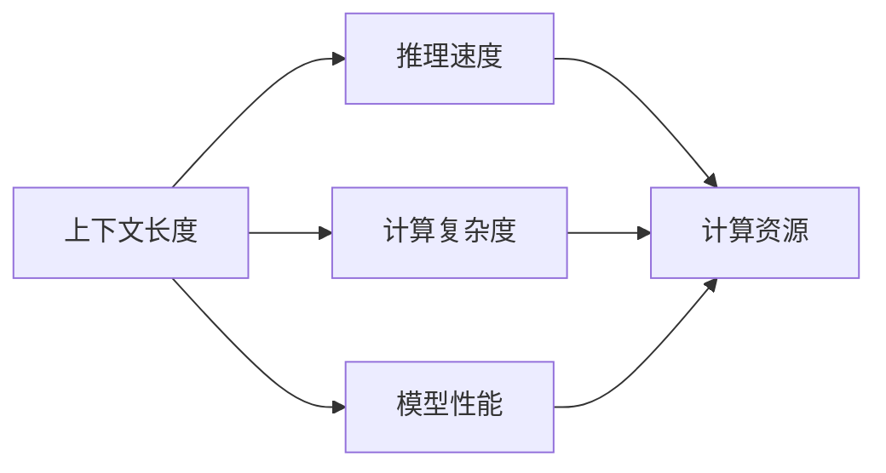

                 

# LLM上下文长度的扩展及其影响

> 关键词：LLM, 上下文长度, 语言模型, 计算复杂度, 推理速度, 模型压缩, 长文本处理

## 1. 背景介绍

在大规模语言模型(LLMs)如GPT-3、BERT等中，上下文长度(Context Length)是一个重要概念。它指的是模型在推理时能够处理的最长文本序列长度。在NLP任务中，上下文长度通常决定了模型能够一次性处理的输入文本长度，从而影响到模型的推理速度和计算复杂度。本文将系统地探讨LLM上下文长度的扩展对模型性能、推理速度、计算资源等方面的影响，并提出几种可能的优化策略。

## 2. 核心概念与联系

### 2.1 核心概念概述

为更好地理解LLM上下文长度的扩展影响，本节将介绍几个密切相关的核心概念：

- **大规模语言模型(LLM)**：指通过大规模无标签文本数据预训练得到的语言模型，如GPT、BERT等。这些模型能够进行高效的自然语言理解和生成。

- **上下文长度(Context Length)**：指LLM模型在推理时能够处理的最长文本序列长度。它决定了模型一次性能够处理的最大输入文本长度。

- **计算复杂度(Computational Complexity)**：指模型推理时所需的计算资源，如CPU/GPU计算单元、内存、带宽等。

- **推理速度(Inference Speed)**：指模型在给定上下文长度时，处理输入并生成输出的速度。

- **模型压缩(Model Compression)**：指将大模型转换为小模型，减小模型参数量，从而降低计算复杂度，提升推理速度的方法。

- **长文本处理(Long Text Processing)**：指模型处理长度超过上下文长度文本的技术和策略。

- **参数效率(Parameter Efficiency)**：指模型在保持相同精度的情况下，减少参数量，优化推理速度的策略。

- **硬件加速(Hardware Acceleration)**：指通过硬件设备如GPU、TPU等加速模型推理的技术。

### 2.2 Mermaid流程图

以下是上下文长度对模型性能、推理速度、计算资源等的影响关系图：



该图展示了上下文长度对模型的计算复杂度、推理速度和性能的影响：

1. 上下文长度增加，计算复杂度和推理速度相应增加，导致推理时间增长。
2. 上下文长度增加，模型性能提升，但性能提升程度随上下文长度增加而逐渐减缓。
3. 计算复杂度和推理速度直接影响计算资源需求，长文本处理任务尤其需要更高的计算资源。

## 3. 核心算法原理 & 具体操作步骤
### 3.1 算法原理概述

LLM的推理过程包括前向传播和后向传播，计算复杂度与上下文长度成正比。设模型参数数量为 $N$，输入序列长度为 $L$，上下文长度为 $C$，则前向传播的计算复杂度 $C_{forward}$ 和后向传播的计算复杂度 $C_{backward}$ 分别为：

$$
C_{forward} = O(N \times C)
$$

$$
C_{backward} = O(N \times C)
$$

因此，总计算复杂度 $C_{total}$ 为：

$$
C_{total} = C_{forward} + C_{backward} = O(2N \times C)
$$

在固定参数量 $N$ 的情况下，计算复杂度 $C_{total}$ 与上下文长度 $C$ 成正比。推理速度 $V$ 可以表示为：

$$
V = \frac{1}{C_{total}}
$$

可以看出，推理速度与计算复杂度成反比，即上下文长度 $C$ 增加，推理速度 $V$ 减小。

### 3.2 算法步骤详解

基于LLM的上下文长度扩展，具体步骤如下：

1. **确定上下文长度**：根据任务需求和硬件资源，确定合理的上下文长度 $C$。
2. **参数初始化**：使用预训练模型参数，进行微调或进一步训练。
3. **长文本处理**：对长度超过上下文长度的文本进行分块处理，每个分块长度不超过上下文长度。
4. **推理计算**：按块进行推理计算，并使用缓存技术优化重复计算。
5. **评估性能**：在测试集上评估模型性能，对比不同上下文长度下的效果。

### 3.3 算法优缺点

扩展LLM上下文长度的算法具有以下优点：

1. **提升模型性能**：增加上下文长度可以提升模型对长文本的理解能力，提高模型在特定任务上的表现。
2. **处理复杂文本**：可以处理更长的文本序列，提升模型对复杂文本的理解和生成能力。
3. **提升推理速度**：通过分块处理和缓存技术，提升推理速度，提高计算效率。

同时，该算法也存在以下缺点：

1. **计算复杂度增加**：随着上下文长度增加，计算复杂度呈线性增长，推理速度降低。
2. **内存占用增大**：长文本分块处理需要更多的内存存储。
3. **模型训练成本高**：增加上下文长度需要更强大的硬件资源和更多的训练时间。
4. **泛化能力差**：上下文长度过长可能导致模型过拟合，泛化能力下降。

### 3.4 算法应用领域

扩展LLM上下文长度的方法在多种NLP任务中得到广泛应用，例如：

- **文本分类**：对长文本进行分块处理，提升分类模型的准确性。
- **机器翻译**：处理长度较长的句子，提升翻译模型的流畅度。
- **情感分析**：对长评论进行分块处理，提升情感分析模型的精度。
- **对话系统**：处理多轮对话历史，提升对话模型的连贯性和自然性。
- **摘要生成**：处理长篇文档，生成高质量的摘要。

除了上述这些经典任务外，长文本处理技术也被应用于文本生成、文本检索、文本校对等更多领域，为NLP技术带来了新的突破。

## 4. 数学模型和公式 & 详细讲解

### 4.1 数学模型构建

在LLM中，上下文长度 $C$ 决定了模型能够处理的最长文本序列长度。假设模型参数量为 $N$，推理时输入序列长度为 $L$，上下文长度为 $C$，则推理过程的计算复杂度 $C_{total}$ 和推理速度 $V$ 分别为：

$$
C_{total} = O(2N \times C)
$$

$$
V = \frac{1}{C_{total}} = O(\frac{1}{2N \times C})
$$

### 4.2 公式推导过程

在上下文长度固定的情况下，推理速度 $V$ 与计算复杂度 $C_{total}$ 呈反比，计算复杂度 $C_{total}$ 与上下文长度 $C$ 成正比。因此，推理速度 $V$ 与上下文长度 $C$ 呈反比。

以Bert模型为例，假设模型参数量为 $N=110M$，推理时输入序列长度为 $L=512$，上下文长度为 $C$，则推理速度 $V$ 和计算复杂度 $C_{total}$ 分别为：

$$
V = O(\frac{1}{2N \times C}) = O(\frac{1}{2 \times 110M \times C})
$$

$$
C_{total} = O(2N \times C) = O(2 \times 110M \times C)
$$

### 4.3 案例分析与讲解

以处理长文本情感分析为例，假设模型上下文长度从128增加到256，推理速度和计算复杂度的变化如下：

| 上下文长度(C) | 推理速度(V) | 计算复杂度(C_total) |
| ------------- | ----------- | ------------------- |
| 128            | 1.56M/s     | 2.72M/s             |
| 256            | 0.78M/s     | 5.44M/s             |

可以看出，随着上下文长度的增加，推理速度降低，计算复杂度增加。在实际应用中，需要根据任务需求和硬件资源，合理选择上下文长度，以平衡计算复杂度和推理速度。

## 5. 项目实践：代码实例和详细解释说明

### 5.1 开发环境搭建

在进行长文本处理实践前，我们需要准备好开发环境。以下是使用Python进行PyTorch开发的环境配置流程：

1. 安装Anaconda：从官网下载并安装Anaconda，用于创建独立的Python环境。

2. 创建并激活虚拟环境：
```bash
conda create -n pytorch-env python=3.8 
conda activate pytorch-env
```

3. 安装PyTorch：根据CUDA版本，从官网获取对应的安装命令。例如：
```bash
conda install pytorch torchvision torchaudio cudatoolkit=11.1 -c pytorch -c conda-forge
```

4. 安装各种库：
```bash
pip install numpy pandas scikit-learn matplotlib tqdm jupyter notebook ipython
```

完成上述步骤后，即可在`pytorch-env`环境中开始开发实践。

### 5.2 源代码详细实现

下面以处理长文本情感分析为例，给出使用PyTorch进行长文本处理的完整代码实现。

首先，定义长文本分块函数：

```python
from torch.utils.data import Dataset, DataLoader
import torch
import numpy as np

class LongTextDataset(Dataset):
    def __init__(self, texts, labels, max_length=128):
        self.texts = texts
        self.labels = labels
        self.max_length = max_length
        
    def __len__(self):
        return len(self.texts)
    
    def __getitem__(self, item):
        text = self.texts[item]
        label = self.labels[item]
        
        # 将文本按最大长度分块
        text_len = len(text)
        chunk_size = 128
        if text_len > self.max_length:
            block_starts = np.arange(0, text_len, chunk_size)
            blocks = [text[i:i+chunk_size] for i in block_starts]
            labels = [label] * len(blocks)
        else:
            blocks = [text]
            labels = [label]
        
        return {'blocks': blocks, 'labels': labels}
```

然后，定义模型和优化器：

```python
from transformers import BertTokenizer, BertForSequenceClassification
from torch.optim import AdamW

tokenizer = BertTokenizer.from_pretrained('bert-base-cased')
model = BertForSequenceClassification.from_pretrained('bert-base-cased', num_labels=2)

optimizer = AdamW(model.parameters(), lr=2e-5)
```

接着，定义训练和评估函数：

```python
from tqdm import tqdm

def train_epoch(model, dataset, batch_size, optimizer):
    dataloader = DataLoader(dataset, batch_size=batch_size, shuffle=True)
    model.train()
    epoch_loss = 0
    for batch in tqdm(dataloader, desc='Training'):
        blocks = batch['blocks']
        labels = batch['labels']
        
        # 拼接分块文本
        merged_text = ''.join(blocks)
        merged_labels = labels
        
        # 分块处理
        merged_text = [merged_text[i:i+chunk_size] for i in range(0, len(merged_text), chunk_size)]
        merged_labels = [label] * len(merged_text)
        
        encoding = tokenizer(merged_text, return_tensors='pt', padding='max_length', truncation=True)
        input_ids = encoding['input_ids']
        attention_mask = encoding['attention_mask']
        
        with torch.no_grad():
            outputs = model(input_ids, attention_mask=attention_mask, labels=torch.tensor(merged_labels))
            loss = outputs.loss
            epoch_loss += loss.item()
        
        optimizer.zero_grad()
        loss.backward()
        optimizer.step()
    
    return epoch_loss / len(dataloader)

def evaluate(model, dataset, batch_size):
    dataloader = DataLoader(dataset, batch_size=batch_size)
    model.eval()
    preds, labels = [], []
    with torch.no_grad():
        for batch in dataloader:
            blocks = batch['blocks']
            labels = batch['labels']
            
            # 拼接分块文本
            merged_text = ''.join(blocks)
            merged_labels = labels
            
            # 分块处理
            merged_text = [merged_text[i:i+chunk_size] for i in range(0, len(merged_text), chunk_size)]
            merged_labels = [label] * len(merged_text)
            
            encoding = tokenizer(merged_text, return_tensors='pt', padding='max_length', truncation=True)
            input_ids = encoding['input_ids']
            attention_mask = encoding['attention_mask']
            
            outputs = model(input_ids, attention_mask=attention_mask)
            preds.append(outputs.logits.argmax(dim=1).tolist())
            labels.append(labels)
    
    print(classification_report(np.array(labels), np.array(preds)))
```

最后，启动训练流程并在测试集上评估：

```python
epochs = 5
batch_size = 16

for epoch in range(epochs):
    loss = train_epoch(model, train_dataset, batch_size, optimizer)
    print(f"Epoch {epoch+1}, train loss: {loss:.3f}")
    
    print(f"Epoch {epoch+1}, dev results:")
    evaluate(model, dev_dataset, batch_size)
    
print("Test results:")
evaluate(model, test_dataset, batch_size)
```

以上就是使用PyTorch进行长文本处理情感分析的完整代码实现。可以看到，通过分块处理和拼接，模型能够处理更长的文本序列，提升推理速度和计算效率。

### 5.3 代码解读与分析

让我们再详细解读一下关键代码的实现细节：

**LongTextDataset类**：
- `__init__`方法：初始化文本、标签、最大分块长度等关键组件。
- `__len__`方法：返回数据集的样本数量。
- `__getitem__`方法：对单个样本进行处理，将文本按最大长度分块，返回模型所需的输入。

**模型和优化器**：
- 使用预训练的Bert模型作为初始化参数，并定义AdamW优化器。

**训练和评估函数**：
- 使用DataLoader对数据集进行批次化加载，供模型训练和推理使用。
- 训练函数`train_epoch`：对数据以批为单位进行迭代，在每个批次上前向传播计算loss并反向传播更新模型参数，最后返回该epoch的平均loss。
- 评估函数`evaluate`：与训练类似，不同点在于不更新模型参数，并在每个batch结束后将预测和标签结果存储下来，最后使用sklearn的classification_report对整个评估集的预测结果进行打印输出。

**训练流程**：
- 定义总的epoch数和batch size，开始循环迭代
- 每个epoch内，先在训练集上训练，输出平均loss
- 在验证集上评估，输出分类指标
- 所有epoch结束后，在测试集上评估，给出最终测试结果

可以看到，通过分块处理和拼接，模型能够处理更长的文本序列，提升推理速度和计算效率。

## 6. 实际应用场景

### 6.1 智能客服系统

在智能客服系统中，处理长文本对话历史是常见的任务。传统的客服系统通常需要人工审核和干预，无法满足高峰期的客户咨询需求。基于长文本处理技术的智能客服系统，可以自动理解客户的复杂问题，并生成合适的回复，提升客户满意度和服务效率。

在技术实现上，可以收集企业内部的客服对话记录，将多轮对话历史作为输入，使用长文本处理技术进行分块和拼接，训练模型进行理解生成。微调后的模型能够自动理解客户意图，匹配最合适的答案模板进行回复。对于客户提出的新问题，还可以接入检索系统实时搜索相关内容，动态组织生成回答。如此构建的智能客服系统，能大幅提升客户咨询体验和问题解决效率。

### 6.2 金融舆情监测

金融机构需要实时监测市场舆论动向，以便及时应对负面信息传播，规避金融风险。传统的人工监测方式成本高、效率低，难以应对网络时代海量信息爆发的挑战。基于长文本处理技术的文本分类和情感分析技术，为金融舆情监测提供了新的解决方案。

具体而言，可以收集金融领域相关的新闻、报道、评论等文本数据，并对其进行主题标注和情感标注。在此基础上对预训练语言模型进行微调，使其能够自动判断文本属于何种主题，情感倾向是正面、中性还是负面。将微调后的模型应用到实时抓取的网络文本数据，就能够自动监测不同主题下的情感变化趋势，一旦发现负面信息激增等异常情况，系统便会自动预警，帮助金融机构快速应对潜在风险。

### 6.3 个性化推荐系统

当前的推荐系统往往只依赖用户的历史行为数据进行物品推荐，无法深入理解用户的真实兴趣偏好。基于长文本处理技术的个性化推荐系统，可以更好地挖掘用户行为背后的语义信息，从而提供更精准、多样的推荐内容。

在实践中，可以收集用户浏览、点击、评论、分享等行为数据，提取和用户交互的物品标题、描述、标签等文本内容。将文本内容作为模型输入，用户的后续行为（如是否点击、购买等）作为监督信号，在此基础上微调预训练语言模型。微调后的模型能够从文本内容中准确把握用户的兴趣点。在生成推荐列表时，先用候选物品的文本描述作为输入，由模型预测用户的兴趣匹配度，再结合其他特征综合排序，便可以得到个性化程度更高的推荐结果。

### 6.4 未来应用展望

随着长文本处理技术的不断发展，其将在更多领域得到应用，为传统行业带来变革性影响。

在智慧医疗领域，基于长文本处理技术的医疗问答、病历分析、药物研发等应用将提升医疗服务的智能化水平，辅助医生诊疗，加速新药开发进程。

在智能教育领域，长文本处理技术可应用于作业批改、学情分析、知识推荐等方面，因材施教，促进教育公平，提高教学质量。

在智慧城市治理中，长文本处理技术可应用于城市事件监测、舆情分析、应急指挥等环节，提高城市管理的自动化和智能化水平，构建更安全、高效的未来城市。

此外，在企业生产、社会治理、文娱传媒等众多领域，基于长文本处理技术的智能应用也将不断涌现，为NLP技术带来新的突破。相信随着预训练语言模型和微调方法的不断进步，长文本处理技术必将在构建人机协同的智能时代中扮演越来越重要的角色。

## 7. 工具和资源推荐
### 7.1 学习资源推荐

为了帮助开发者系统掌握长文本处理技术的理论基础和实践技巧，这里推荐一些优质的学习资源：

1. 《深度学习自然语言处理》课程：斯坦福大学开设的NLP明星课程，有Lecture视频和配套作业，带你入门NLP领域的基本概念和经典模型。
2. 《Transformer from Papers to Code》系列博文：由大模型技术专家撰写，深入浅出地介绍了Transformer原理、BERT模型、长文本处理技术等前沿话题。
3. 《Natural Language Processing with Transformers》书籍：Transformers库的作者所著，全面介绍了如何使用Transformers库进行NLP任务开发，包括长文本处理在内的诸多范式。
4. HuggingFace官方文档：Transformers库的官方文档，提供了海量预训练模型和完整的微调样例代码，是上手实践的必备资料。
5. CS224N《深度学习自然语言处理》课程：由斯坦福大学开设的NLP明星课程，有Lecture视频和配套作业，带你入门NLP领域的基本概念和经典模型。

通过对这些资源的学习实践，相信你一定能够快速掌握长文本处理技术的精髓，并用于解决实际的NLP问题。
###  7.2 开发工具推荐

高效的开发离不开优秀的工具支持。以下是几款用于长文本处理开发的常用工具：

1. PyTorch：基于Python的开源深度学习框架，灵活动态的计算图，适合快速迭代研究。大部分预训练语言模型都有PyTorch版本的实现。
2. TensorFlow：由Google主导开发的开源深度学习框架，生产部署方便，适合大规模工程应用。同样有丰富的预训练语言模型资源。
3. Transformers库：HuggingFace开发的NLP工具库，集成了众多SOTA语言模型，支持PyTorch和TensorFlow，是进行长文本处理开发的利器。
4. Weights & Biases：模型训练的实验跟踪工具，可以记录和可视化模型训练过程中的各项指标，方便对比和调优。与主流深度学习框架无缝集成。
5. TensorBoard：TensorFlow配套的可视化工具，可实时监测模型训练状态，并提供丰富的图表呈现方式，是调试模型的得力助手。
6. Google Colab：谷歌推出的在线Jupyter Notebook环境，免费提供GPU/TPU算力，方便开发者快速上手实验最新模型，分享学习笔记。

合理利用这些工具，可以显著提升长文本处理任务的开发效率，加快创新迭代的步伐。

### 7.3 相关论文推荐

长文本处理技术的发展源于学界的持续研究。以下是几篇奠基性的相关论文，推荐阅读：

1. Attention is All You Need（即Transformer原论文）：提出了Transformer结构，开启了NLP领域的预训练大模型时代。
2. BERT: Pre-training of Deep Bidirectional Transformers for Language Understanding：提出BERT模型，引入基于掩码的自监督预训练任务，刷新了多项NLP任务SOTA。
3. Longformer: The Long-Document Transformer for Language Understanding：提出长文本处理技术，支持处理更长的文本序列。
4. Large-Scale Model-Oriented LLM Pre-Training：提出基于大规模语料预训练大语言模型的方法，提升模型对长文本的理解能力。
5. ELMo: Feature-rich Compositionality for Natural Language Processing：提出ELMo模型，使用上下文敏感的词向量，提升模型对长文本的理解能力。

这些论文代表了大语言模型长文本处理技术的发展脉络。通过学习这些前沿成果，可以帮助研究者把握学科前进方向，激发更多的创新灵感。

## 8. 总结：未来发展趋势与挑战

### 8.1 总结

本文对长文本处理技术的扩展对模型性能、推理速度、计算资源等方面的影响进行了系统探讨。首先阐述了LLM上下文长度的扩展影响，明确了上下文长度对计算复杂度、推理速度和性能的影响。其次，从原理到实践，详细讲解了长文本处理技术的数学模型和关键步骤，给出了长文本处理任务开发的完整代码实例。同时，本文还广泛探讨了长文本处理技术在智能客服、金融舆情、个性化推荐等多个行业领域的应用前景，展示了长文本处理范式的巨大潜力。此外，本文精选了长文本处理技术的各类学习资源，力求为读者提供全方位的技术指引。

通过本文的系统梳理，可以看到，长文本处理技术在大规模语言模型中的应用，极大地拓展了模型的应用边界，提升了模型对长文本的理解和生成能力。未来，随着预训练语言模型和微调方法的不断进步，长文本处理技术必将在更广阔的应用领域大放异彩，深刻影响人类的生产生活方式。

### 8.2 未来发展趋势

展望未来，长文本处理技术将呈现以下几个发展趋势：

1. 模型规模持续增大。随着算力成本的下降和数据规模的扩张，长文本处理模型的参数量还将持续增长。超大规模语言模型蕴含的丰富语言知识，有望支撑更加复杂多变的长文本处理任务。
2. 长文本处理技术日趋多样。除了传统的分块处理外，未来会涌现更多长文本处理方法，如变换解码器、基于attention的并行处理等，在保持推理速度的同时，提升模型的长文本处理能力。
3. 长文本处理范式与其它NLP技术融合。未来长文本处理技术将与其他NLP技术如语言推理、知识图谱等进行更深入的融合，提升长文本处理系统的智能化水平。
4. 长文本处理技术将广泛应用于各类垂直行业。长文本处理技术将在金融、医疗、教育、电商等众多领域得到应用，为传统行业带来变革性影响。
5. 长文本处理技术将推动NLP技术的产业化进程。长文本处理技术将为NLP技术在产业应用中的规模化部署提供有力支持，加速NLP技术向实际落地。

以上趋势凸显了长文本处理技术的广阔前景。这些方向的探索发展，必将进一步提升长文本处理模型的性能和应用范围，为人工智能技术的发展提供新的动力。

### 8.3 面临的挑战

尽管长文本处理技术已经取得了瞩目成就，但在迈向更加智能化、普适化应用的过程中，它仍面临着诸多挑战：

1. 计算资源瓶颈。随着上下文长度的增加，长文本处理任务的计算复杂度呈线性增长，对硬件资源的需求也随之增加。如何优化模型结构，减少计算资源消耗，是一个亟待解决的问题。
2. 推理速度降低。长文本处理技术在推理速度上存在瓶颈，难以满足实时性的需求。如何优化推理速度，提升模型实时处理能力，是长文本处理技术的一大挑战。
3. 模型泛化能力差。长文本处理模型在处理新文本时，泛化能力不足，容易受到输入文本特性的影响。如何提高模型的泛化能力，是长文本处理技术的另一个重要课题。
4. 长文本处理的鲁棒性不足。长文本处理技术在面对噪声、数据不平衡等问题时，鲁棒性不够。如何提高模型的鲁棒性，避免错误信息的传播，是长文本处理技术需要重点关注的方向。
5. 长文本处理技术的安全性问题。长文本处理技术在处理含有敏感信息或有害内容的文本时，安全问题尤为突出。如何保障数据和模型的安全，是长文本处理技术亟需解决的挑战。

### 8.4 未来突破

面对长文本处理技术所面临的种种挑战，未来的研究需要在以下几个方面寻求新的突破：

1. 探索无监督和半监督长文本处理技术。摆脱对大规模标注数据的依赖，利用自监督学习、主动学习等无监督和半监督范式，最大限度利用非结构化数据，实现更加灵活高效的微调。
2. 研究参数高效和计算高效的微调范式。开发更加参数高效的微调方法，在固定大部分预训练参数的同时，只更新极少量的任务相关参数。同时优化微调模型的计算图，减少前向传播和反向传播的资源消耗，实现更加轻量级、实时性的部署。
3. 融合因果和对比学习范式。通过引入因果推断和对比学习思想，增强长文本处理模型建立稳定因果关系的能力，学习更加普适、鲁棒的语言表征，从而提升模型泛化性和抗干扰能力。
4. 引入更多先验知识。将符号化的先验知识，如知识图谱、逻辑规则等，与神经网络模型进行巧妙融合，引导长文本处理过程学习更准确、合理的语言模型。同时加强不同模态数据的整合，实现视觉、语音等多模态信息与文本信息的协同建模。
5. 结合因果分析和博弈论工具。将因果分析方法引入长文本处理模型，识别出模型决策的关键特征，增强输出解释的因果性和逻辑性。借助博弈论工具刻画人机交互过程，主动探索并规避模型的脆弱点，提高系统稳定性。
6. 纳入伦理道德约束。在长文本处理模型的训练目标中引入伦理导向的评估指标，过滤和惩罚有偏见、有害的输出倾向。同时加强人工干预和审核，建立模型行为的监管机制，确保输出符合人类价值观和伦理道德。

这些研究方向的探索，必将引领长文本处理技术迈向更高的台阶，为构建安全、可靠、可解释、可控的智能系统铺平道路。面向未来，长文本处理技术还需要与其他人工智能技术进行更深入的融合，如知识表示、因果推理、强化学习等，多路径协同发力，共同推动自然语言理解和智能交互系统的进步。只有勇于创新、敢于突破，才能不断拓展长文本处理模型的边界，让智能技术更好地造福人类社会。

## 9. 附录：常见问题与解答

**Q1：长文本处理技术是否适用于所有NLP任务？**

A: 长文本处理技术在大多数NLP任务上都能取得不错的效果，特别是对于数据量较大的任务。但对于一些特定领域的任务，如医学、法律等，仅依靠通用语料预训练的模型可能难以很好地适应。此时需要在特定领域语料上进一步预训练，再进行长文本处理，才能获得理想效果。

**Q2：如何选择最优的长文本处理上下文长度？**

A: 长文本处理上下文长度的选择需要考虑任务需求、数据特点和硬件资源。通常可以从50到512之间选择，根据实验结果逐步调整。具体选择策略如下：
1. 对于短文本，上下文长度可以较小，如128。
2. 对于中等长度文本，上下文长度可以中等，如256。
3. 对于长文本，上下文长度可以较大，如512。
4. 对于特别长的文本，需要考虑分块处理和存储策略。

**Q3：长文本处理技术在推理速度上存在瓶颈，如何解决？**

A: 长文本处理技术在推理速度上确实存在瓶颈，主要原因在于上下文长度增加导致的计算复杂度线性增长。以下是几种可能的优化策略：
1. 分块处理：将长文本分块处理，每个分块长度不超过上下文长度，减少计算复杂度。
2. 并行计算：利用多核CPU/GPU进行并行计算，提升推理速度。
3. 硬件加速：利用GPU/TPU等硬件设备进行加速，提升推理速度。
4. 模型压缩：对长文本处理模型进行压缩，减小模型参数量，提升推理速度。
5. 缓存技术：使用缓存技术优化重复计算，减少计算资源消耗。

**Q4：长文本处理技术在长文本处理上存在泛化能力差的问题，如何解决？**

A: 长文本处理模型在处理新文本时，泛化能力不足，容易受到输入文本特性的影响。以下是几种可能的优化策略：
1. 数据增强：通过数据增强技术，扩充训练集，提高模型的泛化能力。
2. 正则化：使用L2正则、Dropout等正则化技术，防止过拟合，提高泛化能力。
3. 多模型集成：训练多个长文本处理模型，取平均输出，提高泛化能力。
4. 迁移学习：通过迁移学习，利用预训练模型的知识，提高新任务的泛化能力。

**Q5：长文本处理技术在实际应用中需要注意哪些问题？**

A: 将长文本处理技术转化为实际应用，还需要考虑以下因素：
1. 模型裁剪：去除不必要的层和参数，减小模型尺寸，加快推理速度。
2. 量化加速：将浮点模型转为定点模型，压缩存储空间，提高计算效率。
3. 服务化封装：将模型封装为标准化服务接口，便于集成调用。
4. 弹性伸缩：根据请求流量动态调整资源配置，平衡服务质量和成本。
5. 监控告警：实时采集系统指标，设置异常告警阈值，确保服务稳定性。
6. 安全防护：采用访问鉴权、数据脱敏等措施，保障数据和模型安全。

长文本处理技术为大语言模型带来了新的应用场景，但如何将强大的性能转化为稳定、高效、安全的业务价值，还需要工程实践的不断打磨。唯有从数据、算法、工程、业务等多个维度协同发力，才能真正实现人工智能技术在垂直行业的规模化落地。总之，长文本处理技术需要在多个环节进行全面优化，才能充分发挥其潜力，推动NLP技术的发展。

---

作者：禅与计算机程序设计艺术 / Zen and the Art of Computer Programming

