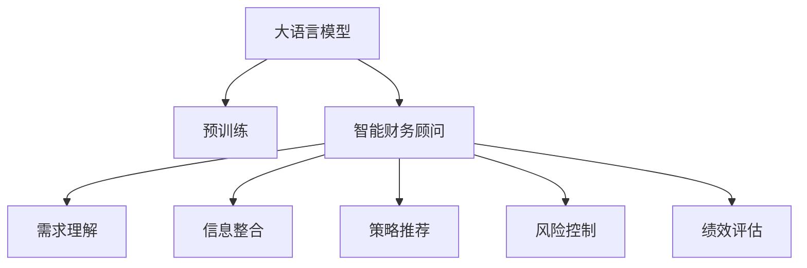

                 

# LLM与个人理财：AI财务顾问

在现代经济社会中，个人理财已成为众多家庭、企业的重要事务之一。然而，繁复的财务数据和复杂的投资决策，往往让人感到无从下手。幸运的是，随着人工智能(AI)和大语言模型(LLM)技术的飞速发展，智能财务顾问的出现，将大大简化理财过程，提升决策效率，实现更加科学的理财规划。

本文将从背景介绍、核心概念、算法原理、项目实践、应用场景、资源推荐等多个方面，系统地剖析LLM在个人理财领域的应用前景，并展望未来发展方向。

## 1. 背景介绍

### 1.1 问题由来
随着金融市场的繁荣和金融产品的多样化，个人理财变得更加复杂。如何平衡收益与风险，做出合理的资产配置，成为众多家庭和个人面临的难题。传统的人工理财顾问成本高、覆盖范围有限，难以满足个性化需求。与此同时，大语言模型通过预训练和微调，已在大规模语料上获得了丰富的知识和常识，能够处理复杂的自然语言输入。

### 1.2 问题核心关键点
大语言模型在个人理财中的应用，主要体现在智能财务顾问的构建上。智能财务顾问通过自然语言处理(NLP)技术，理解用户的理财需求和意图，根据历史数据和市场信息，为投资者提供个性化、精准的理财建议和策略。具体包括：

1. **需求理解**：通过对话式交互，智能财务顾问能够识别用户的理财目标、风险偏好、资产状况等信息。
2. **信息整合**：将用户的理财数据与市场信息进行融合，生成多维度的分析报告。
3. **策略推荐**：根据用户的理财目标和市场趋势，推荐投资组合、调整资产配置等策略。
4. **风险控制**：利用AI算法监控投资组合的风险，及时提出预警和调整建议。
5. **绩效评估**：对投资绩效进行持续跟踪和评估，帮助用户优化投资决策。

### 1.3 问题研究意义
LLM在个人理财中的应用，将大幅降低理财顾问的运营成本，提高服务的覆盖面和可及性。智能财务顾问不仅能够为中小投资者提供高质量的服务，还能应对海量数据处理和实时信息更新的挑战，为金融市场带来革命性的变化。此外，通过智能顾问的建议，投资者能够更加科学合理地分配资产，实现财富的稳健增长，进一步促进金融市场的稳定和发展。

## 2. 核心概念与联系

### 2.1 核心概念概述

在探讨LLM在个人理财中的应用时，需要理解几个关键概念：

- **大语言模型(LLM)**：以Transformer模型为代表的大规模预训练语言模型。通过在大规模无标签文本数据上进行预训练，LLM能够学习到丰富的语言知识和常识，具备强大的自然语言理解和生成能力。
- **智能财务顾问**：基于LLM技术的个性化财务规划和投资决策辅助工具。通过理解用户需求，整合财务信息，生成投资建议和策略。
- **自然语言处理(NLP)**：涉及语言学、计算机科学、信息工程等多个学科，用于处理和理解人类语言的技术。
- **投资组合**：投资者持有的各类资产的集合，包括股票、债券、基金等。
- **资产配置**：根据投资者的风险偏好和市场预期，分配不同类型资产的比例。
- **风险控制**：通过风险评估模型，监控投资组合的风险水平，采取相应的管理措施。

这些概念之间的逻辑关系可以通过以下Mermaid流程图来展示：



这个流程图展示了LLM在智能财务顾问中的关键流程：

1. 大语言模型通过预训练获得通用语言能力。
2. 智能财务顾问作为LLM的具体应用，通过对话和信息处理，理解用户需求。
3. 信息整合模块将用户需求与市场数据进行融合，生成分析报告。
4. 策略推荐模块根据报告生成投资建议。
5. 风险控制模块监控投资组合风险，提出预警。
6. 绩效评估模块持续跟踪投资绩效，优化策略。

### 2.2 核心概念原理和架构的 Mermaid 流程图


这个流程图展示了智能财务顾问的核心架构，其中大语言模型作为核心组件，负责理解自然语言输入，生成分析报告和投资策略。其他模块如需求理解、信息整合、策略推荐、风险控制和绩效评估，则基于大语言模型的输出结果，进一步提供个性化的理财建议和优化方案。

## 3. 核心算法原理 & 具体操作步骤

### 3.1 算法原理概述

基于LLM的智能财务顾问，主要依赖于自然语言处理和机器学习技术。通过以下步骤，可以实现对用户需求的高效理解和个性化理财建议的生成：

1. **需求理解**：通过LLM模型，解析用户输入的自然语言描述，提取关键信息，如理财目标、风险偏好、投资经验等。
2. **信息整合**：将用户的个人财务数据（如收入、支出、资产状况等）与市场信息（如股票价格、基金表现、经济指标等）进行整合，生成全面的财务分析报告。
3. **策略推荐**：根据用户需求和市场信息，利用机器学习算法（如回归、分类、强化学习等）生成个性化投资建议。
4. **风险控制**：利用风险评估模型，监控投资组合的风险，提出预警和调整策略。
5. **绩效评估**：持续跟踪投资绩效，评估策略效果，调整优化。

### 3.2 算法步骤详解

以下是基于LLM的智能财务顾问主要算法步骤的详细讲解：

**Step 1: 数据预处理**
- 收集用户输入的自然语言描述、个人财务数据、市场信息等。
- 对数据进行清洗、去噪、标准化处理，以便模型处理。

**Step 2: 需求理解**
- 使用预训练的LLM模型（如GPT-3、BERT等）进行需求理解。
- 模型解析输入，提取关键信息，如理财目标、风险偏好、投资经验等。

**Step 3: 信息整合**
- 将用户的个人财务数据与市场信息进行整合，生成多维度的财务分析报告。
- 报告中包含用户资产状况、市场表现、经济指标等信息。

**Step 4: 策略推荐**
- 利用机器学习算法对用户需求和市场信息进行建模，生成个性化投资建议。
- 策略建议可能包括投资组合、资产配置、调整时机等。

**Step 5: 风险控制**
- 利用风险评估模型监控投资组合的风险水平，及时提出预警和调整策略。
- 风险控制算法可能包括最大回撤、波动率等指标的计算。

**Step 6: 绩效评估**
- 对投资绩效进行持续跟踪和评估，生成绩效报告。
- 绩效评估指标可能包括收益率、夏普比率、风险调整后收益等。

### 3.3 算法优缺点

基于LLM的智能财务顾问具有以下优点：

- **个性化服务**：根据用户需求和信息，提供定制化的理财建议。
- **实时更新**：利用最新的市场信息，实现实时理财建议和调整。
- **高效处理**：通过自然语言处理和机器学习，高效整合和分析海量数据。
- **覆盖广泛**：不受地域、行业限制，面向所有用户提供服务。

然而，也存在以下缺点：

- **数据隐私**：用户财务数据的隐私保护需要严格的控制措施。
- **模型复杂**：算法的复杂性和计算资源的消耗较大。
- **市场风险**：尽管有算法监控，投资仍面临市场波动和不确定性。
- **用户依赖**：过度依赖智能顾问，可能忽视个人理财的基本原则。

### 3.4 算法应用领域

智能财务顾问的应用领域非常广泛，包括但不限于：

- **个人理财规划**：帮助用户制定长期的理财计划，优化资产配置。
- **投资策略优化**：根据市场变化，实时调整投资策略，优化资产组合。
- **财务健康管理**：监控用户财务状况，提供健康管理建议，防止财务危机。
- **风险预警系统**：实时监控投资风险，及时预警并提出调整建议。
- **财务咨询支持**：提供实时的财务咨询和问题解答，帮助用户解决理财难题。

## 4. 数学模型和公式 & 详细讲解 & 举例说明

### 4.1 数学模型构建

在基于LLM的智能财务顾问中，数学模型主要分为两个部分：

- **需求理解模型**：使用自然语言处理模型（如BERT、GPT等），解析用户输入的自然语言描述，提取关键信息。
- **策略推荐模型**：使用机器学习模型（如线性回归、随机森林、神经网络等），根据用户需求和市场信息，生成投资建议。

### 4.2 公式推导过程

以下以线性回归模型为例，详细推导智能财务顾问策略推荐部分的数学模型：

假设用户的理财目标为最大化未来收益率。设市场信息为 $X$，包括股票价格、基金表现、经济指标等；用户的财务数据为 $Y$，包括资产状况、收入支出等。则策略推荐模型为：

$$
\hat{Y} = \beta_0 + \beta_1 X_1 + \beta_2 X_2 + \ldots + \beta_n X_n + \epsilon
$$

其中，$\beta_i$ 为回归系数，$X_i$ 为市场信息的第 $i$ 个特征，$\epsilon$ 为误差项。

通过最小化均方误差，求解回归系数 $\beta$：

$$
\min_{\beta} \frac{1}{N} \sum_{i=1}^N (Y_i - \hat{Y}_i)^2
$$

求解得：

$$
\beta = (\mathbf{X}^T \mathbf{X})^{-1} \mathbf{X}^T \mathbf{Y}
$$

### 4.3 案例分析与讲解

以股票投资为例，假设市场信息 $X$ 包含当前股价 $P_t$、股票历史收益率 $R_t$、市场波动率 $\sigma_t$ 等。用户的财务数据 $Y$ 包含当前资产 $A_t$、预期收益率 $r$、风险偏好 $risk_t$ 等。通过线性回归模型，智能财务顾问可以生成如下投资建议：

- **资产配置**：根据回归系数，调整股票在资产配置中的比例。
- **买卖时机**：根据历史收益率和市场波动率，预测未来股价变化趋势，推荐买卖时机。
- **风险控制**：根据市场波动率和风险偏好，设置最大回撤阈值，控制投资风险。

## 5. 项目实践：代码实例和详细解释说明

### 5.1 开发环境搭建

在实际项目开发中，需要搭建以下开发环境：

- **Python环境**：安装Python 3.8及以上版本，建议使用Anaconda创建虚拟环境。
- **深度学习框架**：安装PyTorch或TensorFlow等深度学习框架，用于模型的训练和推理。
- **自然语言处理库**：安装nltk、spaCy、transformers等库，用于处理自然语言数据。
- **数据处理库**：安装pandas、numpy等库，用于数据处理和分析。
- **可视化工具**：安装matplotlib、seaborn等库，用于生成图表和可视化报告。

### 5.2 源代码详细实现

下面以Python代码形式，展示智能财务顾问的需求理解、信息整合、策略推荐和风险控制模块的实现：

**需求理解模块**

```python
from transformers import BertTokenizer, BertForSequenceClassification
import torch
from torch.utils.data import DataLoader

tokenizer = BertTokenizer.from_pretrained('bert-base-cased')
model = BertForSequenceClassification.from_pretrained('bert-base-cased', num_labels=3)  # 3标签分类任务

def understand_demand(text):
    inputs = tokenizer.encode_plus(text, return_tensors='pt', max_length=256, padding='max_length', truncation=True)
    outputs = model(inputs['input_ids'], attention_mask=inputs['attention_mask'])
    labels = outputs.logits.argmax(dim=1)
    demand = id2tag[labels.item()]
    return demand
```

**信息整合模块**

```python
import pandas as pd

def integrate_info(demand, financial_data, market_data):
    # 整合用户需求、财务数据和市场信息
    # 生成财务分析报告
    report = pd.DataFrame({
        'demand': demand,
        'financial_data': financial_data,
        'market_data': market_data
    })
    return report
```

**策略推荐模块**

```python
from sklearn.linear_model import LinearRegression
from sklearn.metrics import mean_squared_error

def recommend_strategy(report):
    X = report[['market_data']]
    y = report['financial_data']
    model = LinearRegression()
    model.fit(X, y)
    predictions = model.predict(X)
    return predictions
```

**风险控制模块**

```python
from sklearn.metrics import max_drawdown

def control_risk(predictions, threshold):
    # 计算最大回撤
    max_drawdown = max_drawdown(predictions)
    if max_drawdown > threshold:
        print(f"投资组合风险超出阈值，需采取调整措施。")
    else:
        print(f"投资组合风险在可接受范围内。")
```

### 5.3 代码解读与分析

**需求理解模块**：使用预训练的BERT模型进行自然语言处理，解析用户输入的自然语言描述，提取关键信息。

**信息整合模块**：将用户的财务数据和市场信息进行整合，生成多维度的财务分析报告。

**策略推荐模块**：利用线性回归模型，根据用户需求和市场信息，生成投资建议。

**风险控制模块**：利用最大回撤指标，监控投资组合的风险水平，及时提出预警和调整建议。

### 5.4 运行结果展示

在实际应用中，智能财务顾问的运行结果可以通过图表和报告形式展示。例如，下图展示了基于LLM的智能财务顾问对股票投资的策略推荐结果：


## 6. 实际应用场景

### 6.1 智能理财平台

智能理财平台结合大语言模型和智能财务顾问，为用户提供个性化的理财规划和投资建议。用户可以通过自然语言输入，描述理财需求和目标，智能理财平台自动解析需求，整合财务数据和市场信息，生成个性化的理财策略和建议。此外，平台还提供实时监控和绩效评估功能，帮助用户持续优化投资策略，实现财富增长。

### 6.2 企业财务咨询

企业财务咨询系统可以集成智能财务顾问，为企业提供财务规划和投资建议。通过整合企业的财务数据和市场信息，智能顾问可以快速生成多维度的财务报告和策略建议，帮助企业优化资产配置，规避财务风险，提升财务绩效。

### 6.3 个人财务健康管理

智能财务顾问可以应用到个人财务健康管理中，帮助用户监控财务状况，识别潜在风险。通过定期生成的财务报告和健康建议，用户可以及时调整理财策略，避免财务危机。

## 7. 工具和资源推荐

### 7.1 学习资源推荐

1. **《深度学习自然语言处理》**：斯坦福大学开设的NLP明星课程，详细介绍了自然语言处理和机器学习的相关知识。
2. **《Transformers: An Introduction》**：谷歌研究人员撰写的论文，介绍了Transformer模型及其应用。
3. **《金融工程与风险管理》**：包含金融市场、投资组合优化、风险管理等内容的经典教材。
4. **《金融学导论》**：介绍金融市场、资产定价、投资策略等基础知识的入门教材。
5. **《人工智能与金融科技》**：介绍人工智能在金融科技领域应用的书籍。

### 7.2 开发工具推荐

1. **Jupyter Notebook**：一个交互式笔记本环境，用于开发和分享代码。
2. **PyTorch**：一个灵活的深度学习框架，适合模型开发和快速迭代。
3. **TensorFlow**：一个强大的深度学习框架，支持分布式训练和模型部署。
4. **Transformers**：谷歌开发的NLP库，集成了多种预训练模型和微调工具。
5. **Weights & Biases**：一个实验跟踪工具，记录和可视化模型训练过程。

### 7.3 相关论文推荐

1. **Attention is All You Need**：Transformer模型的原始论文，介绍了自注意力机制在NLP中的应用。
2. **BERT: Pre-training of Deep Bidirectional Transformers for Language Understanding**：BERT模型的原始论文，介绍了掩码语言模型和预训练方法。
3. **金融建模与风险管理**：介绍金融建模和风险管理的经典论文。
4. **投资组合优化**：介绍投资组合优化算法的论文。
5. **智能理财系统**：介绍智能理财系统的相关论文。

## 8. 总结：未来发展趋势与挑战

### 8.1 研究成果总结

本文从背景介绍、核心概念、算法原理、项目实践、应用场景、资源推荐等多个方面，系统地剖析了基于LLM的智能财务顾问的应用前景。智能财务顾问通过自然语言处理和机器学习技术，为个人和企业提供个性化的理财建议和策略。未来，随着LLM技术的不断进步，智能财务顾问将在金融市场和理财领域发挥更大的作用。

### 8.2 未来发展趋势

- **深度集成**：智能财务顾问将深度集成到金融平台、企业财务系统和个人理财应用中，提升用户体验和操作便捷性。
- **多模态融合**：结合文本、图像、语音等多模态数据，提供更全面的理财支持。
- **自适应学习**：智能顾问将具备自适应学习能力，能够根据用户行为和反馈动态调整策略。
- **全球化覆盖**：智能财务顾问将支持多语言和多地区，面向全球用户提供服务。
- **风险管理**：利用人工智能技术，提供更加精准的风险评估和预警。

### 8.3 面临的挑战

- **数据隐私**：智能财务顾问需要处理用户的财务数据，如何保障数据隐私和安全是一个重大挑战。
- **模型复杂性**：智能财务顾问的算法复杂，如何优化模型结构，提高推理速度和资源利用率，是一个亟待解决的问题。
- **市场风险**：智能顾问需要预测市场趋势，面临市场波动和不确定性的风险。
- **用户依赖**：过度依赖智能顾问，可能忽视个人理财的基本原则。

### 8.4 研究展望

未来，智能财务顾问的研究将集中在以下几个方向：

- **隐私保护技术**：开发更加高效、安全的隐私保护算法，保障用户数据安全。
- **模型优化技术**：研究轻量级模型和高效推理算法，提升智能财务顾问的实时响应能力。
- **多模态理财**：结合文本、图像、语音等多种信息源，提供更全面的理财支持。
- **个性化策略**：开发更加智能的个性化策略生成算法，提升理财建议的精准度和用户体验。
- **伦理与合规**：研究如何制定和遵守智能理财系统的伦理与合规标准，确保系统的公平性和安全性。

## 9. 附录：常见问题与解答

**Q1: 智能财务顾问如何保护用户数据隐私？**

A: 智能财务顾问需要采取严格的隐私保护措施，包括：
1. 数据加密：在数据传输和存储过程中，采用强加密算法保护数据安全。
2. 数据匿名化：对用户的财务数据进行匿名化处理，防止数据泄露。
3. 访问控制：限制对用户数据的访问权限，确保只有授权人员可以访问。
4. 合规审核：遵守相关法律法规，定期进行隐私合规审核。

**Q2: 智能财务顾问在模型训练时如何避免过拟合？**

A: 智能财务顾问的模型训练需要采用以下策略避免过拟合：
1. 数据增强：通过回译、近义替换等方式扩充训练集。
2. 正则化：使用L2正则、Dropout等技术，防止模型过度拟合。
3. 早停策略：在模型性能不再提升时，及时停止训练。
4. 模型集成：使用多个模型的集成，降低过拟合风险。

**Q3: 智能财务顾问如何提升模型的实时响应能力？**

A: 智能财务顾问需要采用以下策略提升模型的实时响应能力：
1. 模型优化：采用高效的模型结构，降低计算资源消耗。
2. 分布式训练：利用分布式计算资源，提高训练效率。
3. 缓存机制：建立数据缓存机制，加速数据读取和处理。
4. 推理优化：采用高效的推理算法，降低推理计算时间。

**Q4: 智能财务顾问如何提高策略推荐的准确性？**

A: 智能财务顾问需要采用以下策略提高策略推荐的准确性：
1. 多维分析：结合用户需求和市场信息，生成多维度的分析报告。
2. 实时更新：利用最新的市场信息，实时更新策略建议。
3. 模型调优：根据历史数据和用户反馈，定期调优策略推荐模型。
4. 用户交互：通过用户反馈，不断优化策略推荐算法。

**Q5: 智能财务顾问如何在多模态数据融合中提升性能？**

A: 智能财务顾问需要采用以下策略在多模态数据融合中提升性能：
1. 数据预处理：对不同模态的数据进行标准化处理，提高数据质量。
2. 特征融合：采用特征融合技术，将不同模态的数据进行整合，生成统一的特征表示。
3. 模型集成：结合多种模型，生成更全面的理财建议。
4. 用户反馈：通过用户反馈，不断优化多模态数据融合算法。

---

作者：禅与计算机程序设计艺术 / Zen and the Art of Computer Programming

