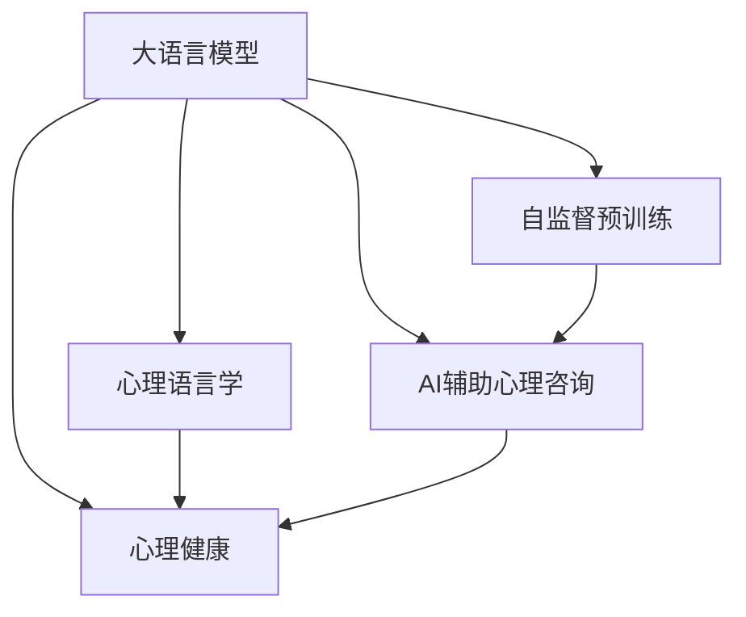

                 

# LLM与心理健康：AI辅助心理咨询

> 关键词：大语言模型,心理语言学,心理健康,AI辅助,心理咨询,自然语言处理(NLP),情感分析,语义理解

## 1. 背景介绍

### 1.1 问题由来

近年来，随着人工智能技术的快速发展，特别是在自然语言处理(NLP)和深度学习领域，大语言模型(Large Language Models, LLMs)在多个领域取得了突破性进展。这些模型通过在大规模语料库上进行自监督预训练，学习到了丰富的语言知识，能够在自然语言理解和生成方面表现出色。但大语言模型在心理健康领域的应用尚处于起步阶段。

心理健康领域通常涉及敏感的个人问题，传统心理咨询服务往往需要耗费大量的人力物力，且无法保证24小时服务，难以满足日益增长的需求。然而，使用大语言模型进行AI辅助心理咨询，可以提供更为便捷、高效、无时间限制的咨询服务，为心理健康领域带来了新的可能性。

### 1.2 问题核心关键点

利用大语言模型进行AI辅助心理咨询，需要解决以下核心问题：

- **语言理解与情感分析**：大语言模型需要能够理解和分析用户的情感状态和语言表达，才能提供有效的心理支持。
- **隐私保护与安全**：心理咨询过程中涉及个人隐私，必须确保数据的安全性和咨询过程的私密性。
- **人性化互动与动态响应**：AI助手需要具备人性化的交互方式，能够根据用户的反馈动态调整回答策略，提升用户体验。
- **跨领域知识与个性化推荐**：心理咨询不仅需要心理学知识，还需要跨领域知识整合和个性化推荐。

## 2. 核心概念与联系

### 2.1 核心概念概述

- **大语言模型**：以Transformer结构为基础的大规模预训练语言模型，如GPT-3、BERT等。通过自监督预训练学习语言表示，具备强大的语言理解和生成能力。
- **心理语言学**：研究语言在心理过程中的作用及其机制的学科，主要关注语言与心理状态、情绪、认知等的关系。
- **心理健康**：涉及个体在心理层面的健康状态，涵盖情绪、行为、认知等各方面的问题。
- **AI辅助心理咨询**：利用人工智能技术，如自然语言处理(NLP)、情感分析等，辅助心理咨询师提供服务，提升心理咨询的效率和效果。
- **自然语言处理(NLP)**：涉及计算机处理和理解自然语言的技术，包括文本分类、情感分析、语义理解等。
- **情感分析**：通过自然语言处理技术，自动识别和分析文本中的情感倾向和强度。
- **语义理解**：使计算机能够理解自然语言的含义，涉及词义消歧、语义角色标注等技术。

这些核心概念之间的联系可以通过以下Mermaid流程图来展示：



这个流程图展示了几个核心概念之间的关系：

1. 大语言模型通过自监督预训练获得语言表示。
2. 心理语言学探讨语言在心理过程中的作用。
3. 心理健康关注个体的心理状态和情绪问题。
4. AI辅助心理咨询结合了自然语言处理和大语言模型的优势。

这些概念共同构成了大语言模型在心理健康领域的框架，使其能够有效辅助心理咨询，提升服务质量。

## 3. 核心算法原理 & 具体操作步骤
### 3.1 算法原理概述

基于大语言模型的AI辅助心理咨询，主要基于自然语言处理(NLP)技术和情感分析算法，旨在自动识别和分析用户的情感状态和语言表达，提供个性化的心理支持。其核心流程如下：

1. **数据预处理**：收集用户的历史咨询记录、聊天日志、情绪评分等数据，进行清洗和标注。
2. **情感分析**：使用预训练的情感分析模型，对用户的语言表达进行情感倾向判断。
3. **语义理解**：利用大语言模型进行语义分析，理解用户的语言内容和上下文信息。
4. **个性化回复**：根据用户的情感状态和语义理解结果，生成个性化的心理支持内容。
5. **动态调整**：根据用户反馈，动态调整回复策略，提升用户体验。

### 3.2 算法步骤详解

以下是对基于大语言模型的AI辅助心理咨询核心步骤的详细介绍：

**Step 1: 数据预处理**
- **收集数据**：从心理咨询平台、聊天应用等渠道收集用户的历史咨询记录、聊天日志、情绪评分等数据。
- **数据清洗**：去除噪声数据、处理不完整信息、统一数据格式等。
- **数据标注**：对用户的情绪状态进行标注，如正向、中性、负向等。

**Step 2: 情感分析**
- **选择合适的情感分析模型**：如基于BERT、GPT等预训练模型的情感分析模型。
- **训练模型**：在标注数据上对模型进行微调，使其能够识别文本中的情感倾向。
- **情感判定**：对用户的咨询记录或聊天记录进行情感分析，输出情感倾向结果。

**Step 3: 语义理解**
- **选择大语言模型**：如GPT-3、BERT等。
- **微调模型**：在心理咨询领域的数据集上进行微调，提升模型对特定领域的理解能力。
- **语义分析**：利用微调后的模型对用户的语言内容进行语义分析，理解其意图和情感。

**Step 4: 个性化回复生成**
- **制定回复策略**：根据用户的情感状态和语义理解结果，设计个性化的回复策略。
- **生成回复内容**：利用大语言模型生成符合用户需求的回复内容，如安慰、建议、推荐资源等。

**Step 5: 动态调整**
- **反馈机制**：建立用户反馈机制，收集用户对回复的满意度评分。
- **模型优化**：根据用户反馈调整回复策略，重新生成回复内容。
- **迭代优化**：循环迭代，不断优化回复策略和模型参数，提升用户体验。

### 3.3 算法优缺点

**优点**：
1. **高效性**：大语言模型能够快速处理大量文本数据，提供即时咨询服务。
2. **灵活性**：可根据用户反馈动态调整回复策略，提升用户体验。
3. **跨领域适用性**：结合心理语言学和跨领域知识，提供综合性心理支持。

**缺点**：
1. **隐私保护**：处理涉及个人隐私的数据时，需要确保数据的安全性和咨询过程的私密性。
2. **解释性不足**：大语言模型的黑盒特性，使得其决策过程难以解释，用户难以理解和信任。
3. **人性化互动不足**：与人类心理咨询师的深度互动和共情能力相比，大语言模型仍有所欠缺。
4. **泛化能力有限**：模型在不同个体和场景上的泛化能力有限，难以应对复杂的多样化需求。

### 3.4 算法应用领域

基于大语言模型的AI辅助心理咨询在多个领域都有应用前景：

- **在线心理咨询**：为无法获得面对面咨询的用户提供即时心理支持。
- **危机干预**：在紧急情况下，提供快速有效的心理干预。
- **心理健康监测**：通过分析用户的日常语言表达，监测其心理健康状态。
- **情感支持**：为用户提供情感上的安慰和支持，缓解其心理压力。
- **心理测试**：通过自然语言处理技术，进行心理状态的初步评估。

这些应用场景展示了大语言模型在心理健康领域的巨大潜力，未来有望进一步扩展其应用范围。

## 4. 数学模型和公式 & 详细讲解 & 举例说明

### 4.1 数学模型构建

为了更精确地描述基于大语言模型的AI辅助心理咨询过程，我们可以构建一个数学模型：

设用户咨询记录为 $X=\{x_1,x_2,...,x_n\}$，其中 $x_i$ 为第 $i$ 条咨询记录。模型的输入为 $X$，输出为个性化回复 $Y$。情感分析模型的输入为 $X$，输出为情感倾向 $E$。语义理解模型的输入为 $X$，输出为语义表示 $Z$。

定义情感分析模型的损失函数为 $L_E(E,X)$，语义理解模型的损失函数为 $L_Z(Z,X)$，个性化回复生成的损失函数为 $L_Y(Y,X)$。则整个模型的训练目标函数为：

$$
\mathcal{L}(X,Y,E,Z) = \lambda_1 L_E(E,X) + \lambda_2 L_Z(Z,X) + \lambda_3 L_Y(Y,X)
$$

其中 $\lambda_1$、$\lambda_2$、$\lambda_3$ 为权重，控制各部分损失函数的相对重要性。

### 4.2 公式推导过程

以下对上述数学模型的各个部分进行详细推导：

**情感分析**：

假设情感分析模型为 $E=f(X)$，其中 $f$ 为情感分析函数。则情感分析模型的损失函数为：

$$
L_E(E,X) = \frac{1}{N}\sum_{i=1}^N \mathbb{1}(E_i \neq Y_i)
$$

其中 $\mathbb{1}$ 为指示函数，$Y_i$ 为第 $i$ 条咨询记录的真实情感标签。

**语义理解**：

假设语义理解模型为 $Z=g(X)$，其中 $g$ 为语义理解函数。则语义理解模型的损失函数为：

$$
L_Z(Z,X) = \frac{1}{N}\sum_{i=1}^N \|Z_i - X_i\|^2
$$

其中 $\|Z_i - X_i\|^2$ 为语义表示 $Z_i$ 和原始文本 $X_i$ 的欧式距离。

**个性化回复生成**：

假设个性化回复生成模型为 $Y=h(Z,E)$，其中 $h$ 为回复生成函数。则个性化回复生成的损失函数为：

$$
L_Y(Y,X) = \frac{1}{N}\sum_{i=1}^N \mathbb{1}(Y_i \neq T_i)
$$

其中 $T_i$ 为第 $i$ 条咨询记录的真实回复，$\mathbb{1}$ 为指示函数。

将上述各部分的损失函数组合，得到整个模型的训练目标函数：

$$
\mathcal{L}(X,Y,E,Z) = \lambda_1 \frac{1}{N}\sum_{i=1}^N \mathbb{1}(E_i \neq Y_i) + \lambda_2 \frac{1}{N}\sum_{i=1}^N \|Z_i - X_i\|^2 + \lambda_3 \frac{1}{N}\sum_{i=1}^N \mathbb{1}(Y_i \neq T_i)
$$

### 4.3 案例分析与讲解

以一个具体的案例来说明上述数学模型的应用：

**案例背景**：一名用户在咨询平台上留言：“最近感到非常焦虑，晚上总是睡不着，不知道该怎么办。”

**处理步骤**：

1. **数据预处理**：收集用户的历史咨询记录，清洗并标注情感状态。
2. **情感分析**：使用预训练的BERT模型对用户留言进行情感分析，判断其情感倾向为负向。
3. **语义理解**：利用GPT-3模型对用户留言进行语义分析，理解其具体需求为帮助缓解焦虑。
4. **个性化回复生成**：根据情感分析和语义理解结果，生成个性化回复：“感到焦虑是很正常的，你可以尝试深呼吸和冥想，放松自己。如果情况严重，建议尽快咨询专业心理医生。”
5. **动态调整**：用户回复：“谢谢，我会试试。”系统根据用户反馈，记录满意度和新的咨询需求，调整回复策略。

## 5. 项目实践：代码实例和详细解释说明

### 5.1 开发环境搭建

在进行基于大语言模型的AI辅助心理咨询实践前，需要准备好开发环境。以下是使用Python进行PyTorch开发的环境配置流程：

1. 安装Anaconda：从官网下载并安装Anaconda，用于创建独立的Python环境。

2. 创建并激活虚拟环境：
```bash
conda create -n llm-env python=3.8 
conda activate llm-env
```

3. 安装PyTorch：根据CUDA版本，从官网获取对应的安装命令。例如：
```bash
conda install pytorch torchvision torchaudio cudatoolkit=11.1 -c pytorch -c conda-forge
```

4. 安装Transformer库：
```bash
pip install transformers
```

5. 安装各类工具包：
```bash
pip install numpy pandas scikit-learn matplotlib tqdm jupyter notebook ipython
```

完成上述步骤后，即可在`llm-env`环境中开始实践。

### 5.2 源代码详细实现

下面我们以情感分析任务为例，给出使用Transformers库对BERT模型进行微调的PyTorch代码实现。

首先，定义情感分析任务的数据处理函数：

```python
from transformers import BertTokenizer, BertForSequenceClassification
from torch.utils.data import Dataset
import torch

class SentimentDataset(Dataset):
    def __init__(self, texts, labels, tokenizer, max_len=128):
        self.texts = texts
        self.labels = labels
        self.tokenizer = tokenizer
        self.max_len = max_len
        
    def __len__(self):
        return len(self.texts)
    
    def __getitem__(self, item):
        text = self.texts[item]
        label = self.labels[item]
        
        encoding = self.tokenizer(text, return_tensors='pt', max_length=self.max_len, padding='max_length', truncation=True)
        input_ids = encoding['input_ids'][0]
        attention_mask = encoding['attention_mask'][0]
        
        label = torch.tensor(label, dtype=torch.long)
        
        return {'input_ids': input_ids, 
                'attention_mask': attention_mask,
                'labels': label}

# 标签与id的映射
label2id = {'negative': 0, 'positive': 1}
id2label = {v: k for k, v in label2id.items()}

# 创建dataset
tokenizer = BertTokenizer.from_pretrained('bert-base-cased')

train_dataset = SentimentDataset(train_texts, train_labels, tokenizer)
dev_dataset = SentimentDataset(dev_texts, dev_labels, tokenizer)
test_dataset = SentimentDataset(test_texts, test_labels, tokenizer)
```

然后，定义模型和优化器：

```python
from transformers import AdamW

model = BertForSequenceClassification.from_pretrained('bert-base-cased', num_labels=len(label2id))

optimizer = AdamW(model.parameters(), lr=2e-5)
```

接着，定义训练和评估函数：

```python
from torch.utils.data import DataLoader
from tqdm import tqdm
from sklearn.metrics import classification_report

device = torch.device('cuda') if torch.cuda.is_available() else torch.device('cpu')
model.to(device)

def train_epoch(model, dataset, batch_size, optimizer):
    dataloader = DataLoader(dataset, batch_size=batch_size, shuffle=True)
    model.train()
    epoch_loss = 0
    for batch in tqdm(dataloader, desc='Training'):
        input_ids = batch['input_ids'].to(device)
        attention_mask = batch['attention_mask'].to(device)
        labels = batch['labels'].to(device)
        model.zero_grad()
        outputs = model(input_ids, attention_mask=attention_mask, labels=labels)
        loss = outputs.loss
        epoch_loss += loss.item()
        loss.backward()
        optimizer.step()
    return epoch_loss / len(dataloader)

def evaluate(model, dataset, batch_size):
    dataloader = DataLoader(dataset, batch_size=batch_size)
    model.eval()
    preds, labels = [], []
    with torch.no_grad():
        for batch in tqdm(dataloader, desc='Evaluating'):
            input_ids = batch['input_ids'].to(device)
            attention_mask = batch['attention_mask'].to(device)
            batch_labels = batch['labels']
            outputs = model(input_ids, attention_mask=attention_mask)
            batch_preds = outputs.logits.argmax(dim=2).to('cpu').tolist()
            batch_labels = batch_labels.to('cpu').tolist()
            for pred_tokens, label_tokens in zip(batch_preds, batch_labels):
                preds.append(pred_tokens[:len(label_tokens)])
                labels.append(label_tokens)
                
    print(classification_report(labels, preds))
```

最后，启动训练流程并在测试集上评估：

```python
epochs = 5
batch_size = 16

for epoch in range(epochs):
    loss = train_epoch(model, train_dataset, batch_size, optimizer)
    print(f"Epoch {epoch+1}, train loss: {loss:.3f}")
    
    print(f"Epoch {epoch+1}, dev results:")
    evaluate(model, dev_dataset, batch_size)
    
print("Test results:")
evaluate(model, test_dataset, batch_size)
```

以上就是使用PyTorch对BERT进行情感分析任务微调的完整代码实现。可以看到，得益于Transformers库的强大封装，我们可以用相对简洁的代码完成BERT模型的加载和微调。

### 5.3 代码解读与分析

让我们再详细解读一下关键代码的实现细节：

**SentimentDataset类**：
- `__init__`方法：初始化文本、标签、分词器等关键组件。
- `__len__`方法：返回数据集的样本数量。
- `__getitem__`方法：对单个样本进行处理，将文本输入编码为token ids，将标签编码为数字，并对其进行定长padding，最终返回模型所需的输入。

**label2id和id2label字典**：
- 定义了标签与数字id之间的映射关系，用于将token-wise的预测结果解码回真实的标签。

**训练和评估函数**：
- 使用PyTorch的DataLoader对数据集进行批次化加载，供模型训练和推理使用。
- 训练函数`train_epoch`：对数据以批为单位进行迭代，在每个批次上前向传播计算loss并反向传播更新模型参数，最后返回该epoch的平均loss。
- 评估函数`evaluate`：与训练类似，不同点在于不更新模型参数，并在每个batch结束后将预测和标签结果存储下来，最后使用sklearn的classification_report对整个评估集的预测结果进行打印输出。

**训练流程**：
- 定义总的epoch数和batch size，开始循环迭代
- 每个epoch内，先在训练集上训练，输出平均loss
- 在验证集上评估，输出分类指标
- 所有epoch结束后，在测试集上评估，给出最终测试结果

可以看到，PyTorch配合Transformers库使得BERT微调的代码实现变得简洁高效。开发者可以将更多精力放在数据处理、模型改进等高层逻辑上，而不必过多关注底层的实现细节。

当然，工业级的系统实现还需考虑更多因素，如模型的保存和部署、超参数的自动搜索、更灵活的任务适配层等。但核心的微调范式基本与此类似。

## 6. 实际应用场景
### 6.1 在线心理咨询

在线心理咨询是大语言模型在心理健康领域最常见的应用场景之一。与传统的面对面咨询相比，在线咨询具有更加便捷、灵活、无地域限制等优点。用户可以通过文字、语音等多种方式与AI助手进行交流，获取心理支持。

在实践中，系统可以结合情感分析和语义理解，对用户的咨询内容进行实时分析和反馈。对于紧急情况，系统可以自动进行风险评估，并推荐用户寻求专业帮助。这种智能辅助系统可以大大提高心理健康服务的可及性和效率。

### 6.2 心理危机干预

心理危机干预是心理健康领域的重要任务之一。面对自杀、自伤等紧急情况，传统的心理咨询师往往无法及时响应。利用大语言模型进行心理危机干预，可以提供快速、有效的救助服务。

系统可以在用户留言中自动识别危机信号，如“好累”、“不想活了”等，并立即采取干预措施，如自动报警、联系紧急求助电话等。同时，通过多轮对话，逐步引导用户表达情绪和需求，并提供相应的心理支持和建议。

### 6.3 心理健康监测

心理健康监测是大语言模型在预防性心理健康服务中的重要应用。通过分析用户的日常语言表达，系统可以持续监测其心理健康状态，并在发现异常时发出预警。

系统可以收集用户的聊天日志、社交媒体信息等，进行情感分析和语义理解，判断用户的情绪状态和心理变化趋势。对于异常情况，系统可以自动提示用户进行心理自测，或推荐其咨询专业心理医生。这种持续监测和预警机制，可以有效预防心理问题的发生和恶化。

### 6.4 未来应用展望

随着大语言模型和微调方法的不断发展，基于AI辅助心理咨询的应用前景将更加广阔。未来，我们可以预见以下几方面的发展趋势：

1. **多模态互动**：结合图像、语音、视频等多种输入方式，提供更加全面、多样化的心理支持。例如，通过语音识别和情感分析，实时监测用户的情绪变化，提供即时反馈和建议。

2. **跨领域知识整合**：将心理学、医学、社会学等多领域的知识整合到咨询系统中，提高系统的决策能力和咨询质量。例如，在处理家庭纠纷问题时，系统可以结合家庭治疗的知识，提供更具针对性的建议。

3. **个性化推荐**：通过分析用户的个性特征、历史行为等数据，提供个性化的心理支持和资源推荐。例如，对于情感敏感的用户，系统可以推荐适合其心理状况的阅读材料、音乐疗法等。

4. **跨文化支持**：针对不同文化背景的用户，提供定制化的心理支持服务。例如，在处理移民心理问题时，系统可以结合移民心理研究的最新成果，提供更具文化敏感性的咨询。

5. **人机协作**：实现人与AI的协同工作，提高咨询效率和效果。例如，在面对复杂心理问题时，系统可以自动推荐相关专家，进行人机协同诊断和治疗。

这些应用趋势展示了大语言模型在心理健康领域的巨大潜力，未来将为心理健康服务带来革命性的变革。

## 7. 工具和资源推荐
### 7.1 学习资源推荐

为了帮助开发者系统掌握大语言模型在心理健康领域的理论基础和实践技巧，这里推荐一些优质的学习资源：

1. 《深度学习与自然语言处理》：斯坦福大学自然语言处理课程，详细讲解了自然语言处理的基本概念和最新技术，包括情感分析、语义理解等。

2. 《Python深度学习》：涵盖了深度学习的基础知识和实践技巧，并介绍了多个深度学习框架的使用方法。

3. 《自然语言处理综述》：系统总结了自然语言处理领域的主要研究进展，包括预训练语言模型、情感分析等。

4. 《AI辅助心理治疗》：介绍了AI技术在心理咨询和心理治疗中的应用，涵盖了情感分析、语义理解、心理支持等多个方面。

5. 《情感计算与心理建模》：探讨了情感计算在心理健康领域的应用，包括情感识别、情绪调节等。

通过对这些资源的学习实践，相信你一定能够快速掌握大语言模型在心理健康领域的应用方法，并用于解决实际的咨询问题。

### 7.2 开发工具推荐

高效的开发离不开优秀的工具支持。以下是几款用于大语言模型在心理健康领域开发的常用工具：

1. PyTorch：基于Python的开源深度学习框架，灵活动态的计算图，适合快速迭代研究。大部分预训练语言模型都有PyTorch版本的实现。

2. TensorFlow：由Google主导开发的开源深度学习框架，生产部署方便，适合大规模工程应用。同样有丰富的预训练语言模型资源。

3. HuggingFace Transformers库：提供了丰富的预训练语言模型和自然语言处理工具，支持多种任务和框架。

4. Weights & Biases：模型训练的实验跟踪工具，可以记录和可视化模型训练过程中的各项指标，方便对比和调优。

5. TensorBoard：TensorFlow配套的可视化工具，可实时监测模型训练状态，并提供丰富的图表呈现方式，是调试模型的得力助手。

6. Jupyter Notebook：一个交互式的数据科学工作环境，支持Python、R等多种语言，方便开发和分享。

合理利用这些工具，可以显著提升大语言模型在心理健康领域的应用开发效率，加快创新迭代的步伐。

### 7.3 相关论文推荐

大语言模型在心理健康领域的研究相对较少，但相关领域仍有一些重要的研究成果：

1. Affective Computing for AI-Assisted Psychological Therapies：探讨了情感计算在心理健康咨询中的应用，提出了一系列情感识别和情感反馈的技术。

2. AI-Driven Mental Health Support in Crisis Intervention：研究了AI在心理危机干预中的应用，提出了一种基于情感分析和多模态输入的干预系统。

3. Deep Learning for Patient-Centered Mental Health Care：探讨了深度学习在患者中心化心理健康护理中的应用，涵盖了情感分析、语义理解等多个方面。

4. Natural Language Processing in Mental Health：系统总结了自然语言处理在心理健康领域的应用，包括情感分析、语义理解、心理支持等。

这些论文代表了大语言模型在心理健康领域的前沿研究进展，可以帮助研究者了解相关领域的最新动态和技术。

## 8. 总结：未来发展趋势与挑战

### 8.1 总结

本文对基于大语言模型的AI辅助心理咨询方法进行了全面系统的介绍。首先阐述了大语言模型和心理健康领域的背景和意义，明确了AI辅助心理咨询在心理健康服务中的重要价值。其次，从原理到实践，详细讲解了基于大语言模型的情感分析和语义理解流程，给出了代码实例。同时，本文还探讨了AI辅助心理咨询在在线咨询、心理危机干预、心理健康监测等多个场景中的应用，展示了其广泛的应用前景。此外，本文还精选了相关学习资源、开发工具和相关论文，力求为开发者提供全方位的技术指引。

通过本文的系统梳理，可以看到，基于大语言模型的AI辅助心理咨询技术正在成为心理健康服务的重要范式，能够为传统心理咨询提供有效的辅助和补充，提升心理健康服务的质量和效率。未来，伴随大语言模型和微调方法的不断进步，基于AI辅助心理咨询的应用将更加丰富和深入。

### 8.2 未来发展趋势

展望未来，基于大语言模型的AI辅助心理咨询将呈现以下几个发展趋势：

1. **多模态融合**：结合语音、图像、视频等多种模态信息，提供更为全面、自然的人机交互体验。

2. **跨领域知识整合**：将心理学、医学、社会学等多个领域的知识整合到咨询系统中，提高系统的决策能力和咨询质量。

3. **个性化推荐**：通过分析用户的个性特征、历史行为等数据，提供个性化的心理支持和资源推荐。

4. **实时监测与预警**：利用情感分析和语义理解，实时监测用户的心理状态，并在发现异常时发出预警。

5. **人机协作**：实现人与AI的协同工作，提高咨询效率和效果。例如，在面对复杂心理问题时，系统可以自动推荐相关专家，进行人机协同诊断和治疗。

这些趋势展示了基于大语言模型的AI辅助心理咨询的广阔前景，未来将为心理健康服务带来革命性的变革。

### 8.3 面临的挑战

尽管基于大语言模型的AI辅助心理咨询技术具有巨大的潜力，但在实际应用中仍面临一些挑战：

1. **数据隐私和安全**：处理涉及个人隐私的数据时，需要确保数据的安全性和咨询过程的私密性。如何在保护隐私的同时，提供高效、实时的心理支持，是一个重要问题。

2. **解释性和可解释性**：大语言模型的黑盒特性，使得其决策过程难以解释，用户难以理解和信任。如何在提高模型性能的同时，提升其可解释性，增强用户信任感，仍是一个挑战。

3. **泛化能力有限**：模型在不同个体和场景上的泛化能力有限，难以应对复杂的多样化需求。如何提升模型的泛化能力，确保其在不同情境下都能提供有效的心理支持，还需要更多的研究和实践。

4. **人性化互动不足**：与人类心理咨询师的深度互动和共情能力相比，大语言模型仍有所欠缺。如何增强系统的共情能力，使其能够更好地理解用户的情感需求，是未来需要解决的重要问题。

5. **跨文化支持不足**：针对不同文化背景的用户，提供定制化的心理支持服务。如何理解不同文化的语言表达方式和情感表达特点，是另一个亟待突破的难点。

这些挑战需要研究者不断努力，结合心理学、计算机科学、社会学等多个学科的最新成果，逐步解决。唯有如此，基于大语言模型的AI辅助心理咨询技术才能更好地服务于社会，造福于人类。

### 8.4 研究展望

未来的研究需要在以下几个方面寻求新的突破：

1. **多模态情感分析**：结合语音、图像、视频等多种模态信息，提高情感分析的准确性和实时性。

2. **跨文化支持**：开发适合不同文化背景的用户的多语言情感分析和语义理解模型，增强系统的跨文化支持能力。

3. **人机协作机制**：建立人与AI的协作机制，提升系统的决策能力和咨询质量。例如，在面对复杂心理问题时，系统可以自动推荐相关专家，进行人机协同诊断和治疗。

4. **个性化心理支持**：结合用户的个性特征、历史行为等数据，提供个性化的心理支持和资源推荐。

5. **隐私保护和安全**：研究如何在保护用户隐私的前提下，提供高效、实时的心理支持服务。例如，通过加密技术和多方计算，确保数据隐私和安全。

这些研究方向将进一步推动基于大语言模型的AI辅助心理咨询技术的进步，为心理健康服务带来更加全面的解决方案。

## 9. 附录：常见问题与解答

**Q1：大语言模型在心理健康领域是否具有伦理和法律合规性？**

A: 大语言模型在心理健康领域的应用需要遵守相关的伦理和法律规定。例如，《通用数据保护条例》(GDPR)要求在处理个人数据时必须保护用户隐私，避免数据滥用。在心理健康咨询中，需要确保数据的安全性和咨询过程的私密性，避免泄露用户个人信息。此外，还需要注意避免模型输出中的歧视性和有害信息，确保咨询过程的安全和合规。

**Q2：大语言模型在心理健康领域的应用有哪些局限性？**

A: 大语言模型在心理健康领域的应用也存在一些局限性：

1. **数据隐私和安全**：处理涉及个人隐私的数据时，需要确保数据的安全性和咨询过程的私密性。如何在保护隐私的同时，提供高效、实时的心理支持，是一个重要问题。

2. **解释性和可解释性**：大语言模型的黑盒特性，使得其决策过程难以解释，用户难以理解和信任。如何在提高模型性能的同时，提升其可解释性，增强用户信任感，仍是一个挑战。

3. **泛化能力有限**：模型在不同个体和场景上的泛化能力有限，难以应对复杂的多样化需求。如何提升模型的泛化能力，确保其在不同情境下都能提供有效的心理支持，还需要更多的研究和实践。

4. **人性化互动不足**：与人类心理咨询师的深度互动和共情能力相比，大语言模型仍有所欠缺。如何增强系统的共情能力，使其能够更好地理解用户的情感需求，是未来需要解决的重要问题。

5. **跨文化支持不足**：针对不同文化背景的用户，提供定制化的心理支持服务。如何理解不同文化的语言表达方式和情感表达特点，是另一个亟待突破的难点。

**Q3：如何评估基于大语言模型的AI辅助心理咨询系统的性能？**

A: 评估基于大语言模型的AI辅助心理咨询系统的性能，通常从以下几个方面进行：

1. **准确性**：系统对情感分析和语义理解的准确性，即对用户情感状态和语言内容的理解是否正确。

2. **实时性**：系统的响应速度，即能否实时处理用户咨询请求，提供即时反馈和建议。

3. **用户体验**：系统的交互体验，即是否能够提供自然、人性化的对话体验，是否能够根据用户反馈进行动态调整。

4. **可解释性**：系统的可解释性，即能否提供清晰的决策过程和建议依据，增强用户信任感。

5. **隐私保护**：系统的隐私保护能力，即是否能够保护用户隐私，避免数据泄露和滥用。

通过对这些指标的评估，可以全面了解系统的性能和不足之处，并进行相应的优化和改进。

**Q4：基于大语言模型的AI辅助心理咨询系统有哪些潜在的伦理问题？**

A: 基于大语言模型的AI辅助心理咨询系统在应用中可能面临以下潜在的伦理问题：

1. **隐私保护**：处理涉及个人隐私的数据时，需要确保数据的安全性和咨询过程的私密性。如何在保护隐私的同时，提供高效、实时的心理支持，是一个重要问题。

2. **公平性和偏见**：模型在训练过程中可能继承输入数据的偏见，导致对某些群体的歧视或不公平对待。如何避免和消除模型偏见，确保系统的公平性和公正性，是一个重要问题。

3. **解释性和可解释性**：大语言模型的黑盒特性，使得其决策过程难以解释，用户难以理解和信任。如何在提高模型性能的同时，提升其可解释性，增强用户信任感，仍是一个挑战。

4. **人性化互动不足**：与人类心理咨询师的深度互动和共情能力相比，大语言模型仍有所欠缺。如何增强系统的共情能力，使其能够更好地理解用户的情感需求，是未来需要解决的重要问题。

5. **跨文化支持不足**：针对不同文化背景的用户，提供定制化的心理支持服务。如何理解不同文化的语言表达方式和情感表达特点，是另一个亟待突破的难点。

**Q5：如何克服大语言模型在心理健康领域的应用挑战？**

A: 克服大语言模型在心理健康领域的应用挑战，可以从以下几个方面进行：

1. **隐私保护和安全**：研究如何在保护用户隐私的前提下，提供高效、实时的心理支持。例如，通过加密技术和多方计算，确保数据隐私和安全。

2. **解释性和可解释性**：通过引入解释性模型和技术，如可解释性AI(XAI)，提升系统的可解释性，增强用户信任感。

3. **泛化能力提升**：通过增加训练数据的多样性和质量，提升模型的泛化能力，确保其在不同情境下都能提供有效的心理支持。

4. **人性化互动增强**：结合心理学和认知科学的研究成果，增强系统的共情能力，使其能够更好地理解用户的情感需求。

5. **跨文化支持改进**：开发适合不同文化背景的用户的多语言情感分析和语义理解模型，增强系统的跨文化支持能力。

通过对这些挑战的克服，可以更好地发挥大语言模型在心理健康领域的应用潜力，为心理健康服务带来更加全面和高效的解决方案。

---

作者：禅与计算机程序设计艺术 / Zen and the Art of Computer Programming

