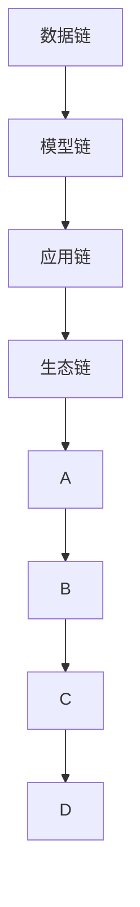

                 

# LLM产业链：新兴AI经济的脉络

> 关键词：大语言模型, 产业链, 人工智能, 新兴经济, 自动化, 智能应用, 数据利用, 技术生态, 未来趋势

## 1. 背景介绍

### 1.1 问题由来
在21世纪科技迅猛发展的背景下，人工智能（AI）已成为推动全球经济增长的新引擎。特别是大语言模型（Large Language Model, LLM）的问世，显著提升了自然语言处理（NLP）领域的自动化水平。大语言模型通过在超大规模语料库上进行自监督预训练，形成了强大的语言理解与生成能力，为AI产业链的各个环节提供了坚实的基础。

然而，大语言模型不仅仅是一套黑盒技术，其背后涉及到庞大的产业链生态，包括数据收集与处理、模型训练与优化、应用集成与部署等多个环节。这些环节协同工作，共同驱动着AI经济的健康发展。本文将系统性地介绍LLM产业链，阐述其在新兴AI经济中的脉络和作用。

### 1.2 问题核心关键点
大语言模型的产业链涉及多个环节，具体包括：

- **数据链：** 数据收集、标注、清洗和处理，是大模型预训练的基础。
- **模型链：** 模型设计、训练、优化和部署，是大模型功能实现的保证。
- **应用链：** 模型集成、接口调用、系统部署，是大模型在实际业务中的运用。
- **生态链：** 工具支持、社区交流、标准化，是大模型产业链的有力支撑。

大语言模型产业链的每一个环节都密切相关，相互依存，共同构成了新兴AI经济的脉络。本文将逐一探讨这些环节的运行机制和相互关系，为读者提供完整的产业链视角。

## 2. 核心概念与联系

### 2.1 核心概念概述

为了更好地理解LLM产业链，本节将介绍几个核心概念：

- **大语言模型（LLM）：** 以自回归或自编码模型为代表的超大规模预训练语言模型。通过在无标签文本数据上自监督预训练，学习通用的语言表示。
- **预训练（Pre-training）：** 在大规模无标签数据上通过自监督学习任务训练模型的过程，如语言建模、掩码语言模型等。
- **微调（Fine-tuning）：** 在大模型上使用下游任务的标注数据进行有监督训练，适配特定任务需求。
- **迁移学习（Transfer Learning）：** 将在大规模数据上预训练得到的知识，迁移应用到小规模数据或新任务上，提升模型性能。
- **产业链（Industrial Chain）：** 由数据、模型、应用、生态等多个环节构成的相互依存、相互促进的完整系统。
- **生态系统（Ecosystem）：** 围绕大模型形成的技术、工具、社区等支持网络，保障产业链的稳定运行。

这些概念之间的关系可以通过以下Mermaid流程图来展示：



这个流程图展示了大语言模型产业链中各个环节的相互联系和相互依存关系。

## 3. 核心算法原理 & 具体操作步骤
### 3.1 算法原理概述

大语言模型产业链的核心在于通过数据链、模型链、应用链、生态链的协同工作，实现从数据获取到实际应用的全过程自动化和智能化。其原理可以概括为：

- **数据链：** 通过爬虫、标注工具等手段，从各类网络平台、公开数据集、用户生成内容等渠道收集大规模无标签或少量标注数据，构建训练集。
- **模型链：** 在数据集上，通过预训练和微调技术，训练出能够处理特定任务的大模型。
- **应用链：** 将大模型集成到具体业务系统中，通过API接口提供服务，实现业务自动化和智能化。
- **生态链：** 构建和维护工具库、社区、标准等基础设施，支持产业链的各环节高效运转。

### 3.2 算法步骤详解

以下将详细介绍大语言模型产业链的各个环节的操作步骤：

**Step 1: 数据链**
- 收集数据：使用爬虫工具从互联网、公开数据集、数据库等渠道收集无标签或少量标注数据，构建训练集。
- 数据清洗：使用数据清洗工具进行重复、错误、不完整的处理，确保数据质量。
- 数据标注：在需要标注的数据上，进行人工或半自动标注，生成带标签的数据集。

**Step 2: 模型链**
- 模型设计：选择或设计适合的神经网络结构，如Transformer、RNN等。
- 预训练：在收集的数据集上，使用自监督任务进行预训练，如语言建模、掩码语言模型等。
- 微调：在特定任务的少量标注数据上，进行有监督微调，适配任务需求。

**Step 3: 应用链**
- 模型集成：将微调后的模型嵌入应用系统中，通过API接口提供服务。
- 应用部署：将模型部署在云平台、本地服务器、嵌入式设备等环境中，实现实际应用。
- 系统集成：将模型与业务系统中的其他组件集成，实现自动化和智能化功能。

**Step 4: 生态链**
- 工具支持：开发和推广工具链，包括数据收集、处理、标注工具，模型训练、优化工具，应用集成、部署工具等。
- 社区交流：建立开发者社区，促进知识交流、经验分享、技术协作。
- 标准化：推动行业标准的制定和应用，确保数据、模型、应用的一致性和互操作性。

### 3.3 算法优缺点

大语言模型产业链具有以下优点：

1. **自动化与效率提升：** 通过自动化的数据处理、模型训练、应用集成等环节，大幅提升工作效率，降低人力成本。
2. **灵活性与适用性：** 可以根据实际需求，快速适配各类NLP任务，提供定制化的解决方案。
3. **产业链协同：** 数据链、模型链、应用链、生态链各环节协同工作，形成完整的闭环，提升整体性能。

同时，该方法也存在一些缺点：

1. **数据依赖性强：** 数据链是产业链的基础，数据质量的好坏直接影响最终模型的表现。
2. **模型复杂度高：** 大规模模型的训练和优化需要强大的计算资源和算法支持，成本较高。
3. **应用场景局限：** 模型链和应用链的适配需要针对具体任务进行调整，跨领域迁移能力有限。
4. **生态系统尚需完善：** 虽然已有一些开源工具和社区，但整体生态系统的成熟度还需进一步提升。

尽管存在这些局限性，大语言模型产业链仍是当前AI领域的重要发展方向，具有广泛的应用前景。

### 3.4 算法应用领域

大语言模型产业链的应用领域非常广泛，涵盖了金融、医疗、教育、客服等多个行业。以下是几个典型应用案例：

**金融行业：** 通过文本分类、情感分析等技术，实现金融舆情监测、智能投顾、客户服务自动化等应用。

**医疗行业：** 利用文本摘要、命名实体识别等技术，实现医疗记录自动化、患者问答系统、医学知识图谱构建等应用。

**教育行业：** 应用机器翻译、情感分析、对话系统等技术，实现自动批改作业、个性化推荐、智能辅导等教育服务。

**客服行业：** 使用对话系统、情感分析等技术，实现智能客服机器人、客户情感监测、投诉自动处理等功能。

## 4. 数学模型和公式 & 详细讲解 & 举例说明

### 4.1 数学模型构建

大语言模型的数学模型可以概括为：

$$
M = f_{\theta}(X, D)
$$

其中，$M$ 表示模型，$f_{\theta}$ 表示模型函数，$\theta$ 表示模型参数，$X$ 表示输入数据，$D$ 表示数据集。模型函数的构建通常基于神经网络，如Transformer、RNN等。

### 4.2 公式推导过程

以下以Transformer模型为例，推导其基本原理：

- **编码器层**：
$$
y = f_{e}(x, \theta)
$$

其中 $f_{e}$ 为编码器层函数，$x$ 为输入向量，$\theta$ 为模型参数。编码器层的目的是将输入序列 $x$ 转换为一系列隐状态 $y$。

- **自注意力机制**：
$$
a = \text{Softmax}\left(\frac{QK^T}{\sqrt{d_k}}\right)
$$
$$
b = \text{DotProduct}(Q, K)
$$

其中 $Q$、$K$、$V$ 分别为查询向量、键向量和值向量。自注意力机制通过计算输入序列中各个位置的注意力权重，实现序列的表示学习。

- **多头注意力**：
$$
y = \sum_{i=1}^h f_{attn}(x, \theta)
$$

其中 $f_{attn}$ 表示多头注意力函数，$h$ 表示多头数。多头注意力通过并行多组注意力机制，提升模型的复杂度与表现力。

- **位置编码**：
$$
x_i = x_i + \delta_i
$$

其中 $\delta_i$ 表示位置编码向量。位置编码通过在输入序列中加入位置信息，使得模型能够更好地理解序列的时序关系。

### 4.3 案例分析与讲解

以BERT模型为例，分析其在自然语言处理中的应用。BERT模型基于Transformer架构，通过在大规模无标签数据上进行自监督预训练，学习通用的语言表示。在预训练后，通过微调适配下游任务，实现各种NLP任务的自动化处理。

**BERT模型的预训练**：
- 使用掩码语言模型和下一句预测任务进行预训练。
- 在大规模语料库上进行自监督学习，如维基百科、新闻、书籍等。

**BERT模型的微调**：
- 收集特定任务的少量标注数据。
- 在预训练模型基础上，使用微调技术适配任务需求，如情感分类、实体识别、文本摘要等。

通过上述步骤，BERT模型能够在金融舆情监测、医疗文本分析、教育智能辅导等场景中发挥巨大作用。

## 5. 项目实践：代码实例和详细解释说明

### 5.1 开发环境搭建

在进行LLM产业链项目实践前，我们需要准备好开发环境。以下是使用Python进行PyTorch开发的环境配置流程：

1. 安装Anaconda：从官网下载并安装Anaconda，用于创建独立的Python环境。

2. 创建并激活虚拟环境：
```bash
conda create -n pytorch-env python=3.8 
conda activate pytorch-env
```

3. 安装PyTorch：根据CUDA版本，从官网获取对应的安装命令。例如：
```bash
conda install pytorch torchvision torchaudio cudatoolkit=11.1 -c pytorch -c conda-forge
```

4. 安装TensorFlow：
```bash
conda install tensorflow
```

5. 安装各类工具包：
```bash
pip install numpy pandas scikit-learn matplotlib tqdm jupyter notebook ipython
```

完成上述步骤后，即可在`pytorch-env`环境中开始实践。

### 5.2 源代码详细实现

下面我们以BERT模型进行文本分类任务为例，给出使用Transformers库进行预训练和微调的PyTorch代码实现。

首先，定义文本分类任务的模型：

```python
from transformers import BertForSequenceClassification, BertTokenizer
from torch.nn import CrossEntropyLoss
from torch.utils.data import DataLoader, Dataset

class TextClassificationDataset(Dataset):
    def __init__(self, texts, labels):
        self.texts = texts
        self.labels = labels
        self.tokenizer = BertTokenizer.from_pretrained('bert-base-uncased')

    def __len__(self):
        return len(self.texts)

    def __getitem__(self, idx):
        text = self.texts[idx]
        label = self.labels[idx]
        encoding = self.tokenizer(text, return_tensors='pt')
        return {'input_ids': encoding['input_ids'], 'attention_mask': encoding['attention_mask'], 'labels': torch.tensor([label], dtype=torch.long)}

# 初始化BERT模型和优化器
model = BertForSequenceClassification.from_pretrained('bert-base-uncased', num_labels=2)
optimizer = AdamW(model.parameters(), lr=2e-5)

# 数据加载器
train_loader = DataLoader(TextClassificationDataset(train_texts, train_labels), batch_size=16, shuffle=True)
```

然后，定义模型训练和评估函数：

```python
def train_epoch(model, data_loader, optimizer, device):
    model.to(device)
    model.train()
    total_loss = 0
    for batch in data_loader:
        input_ids = batch['input_ids'].to(device)
        attention_mask = batch['attention_mask'].to(device)
        labels = batch['labels'].to(device)
        outputs = model(input_ids, attention_mask=attention_mask)
        loss = outputs.loss
        total_loss += loss.item()
        optimizer.zero_grad()
        loss.backward()
        optimizer.step()
    return total_loss / len(data_loader)

def evaluate(model, data_loader, device):
    model.eval()
    total_preds, total_labels = [], []
    with torch.no_grad():
        for batch in data_loader:
            input_ids = batch['input_ids'].to(device)
            attention_mask = batch['attention_mask'].to(device)
            labels = batch['labels'].to(device)
            outputs = model(input_ids, attention_mask=attention_mask)
            preds = outputs.predictions.argmax(dim=1)
            total_preds.extend(preds)
            total_labels.extend(labels)
    acc = (total_preds == total_labels).mean()
    return acc

# 训练模型
for epoch in range(epochs):
    train_loss = train_epoch(model, train_loader, optimizer, device)
    eval_acc = evaluate(model, dev_loader, device)
    print(f"Epoch {epoch+1}, train loss: {train_loss:.3f}, eval acc: {eval_acc:.3f}")
```

最后，启动模型训练并在测试集上评估：

```python
epochs = 5
device = torch.device('cuda' if torch.cuda.is_available() else 'cpu')

for epoch in range(epochs):
    train_loss = train_epoch(model, train_loader, optimizer, device)
    eval_acc = evaluate(model, test_loader, device)
    print(f"Epoch {epoch+1}, train loss: {train_loss:.3f}, eval acc: {eval_acc:.3f}")
```

以上就是使用PyTorch对BERT进行文本分类任务微调的完整代码实现。可以看到，得益于Transformers库的强大封装，我们可以用相对简洁的代码完成BERT模型的加载和微调。

### 5.3 代码解读与分析

让我们再详细解读一下关键代码的实现细节：

**TextClassificationDataset类**：
- `__init__`方法：初始化文本、标签和分词器。
- `__len__`方法：返回数据集的样本数量。
- `__getitem__`方法：对单个样本进行处理，将文本输入编码为token ids，将标签转换为张量。

**模型定义与训练**：
- 使用BertForSequenceClassification和BertTokenizer，初始化模型和分词器。
- 定义训练器、优化器、损失函数。
- 通过循环迭代训练和验证过程，调整模型参数。

这些代码实现详细展示了LLM产业链在具体项目中的技术应用，从数据预处理到模型微调，再到模型评估，整个过程高效且可复用。

## 6. 实际应用场景

### 6.1 智能客服系统

智能客服系统是大语言模型在金融、电商、医疗等多个领域的重要应用场景。通过微调，构建能够理解自然语言输入、自动生成回答的智能客服机器人，可以极大提升客户咨询体验。

**具体流程**：
- 收集客户与客服之间的历史对话记录，标记问答对。
- 使用微调技术训练大模型，使其能够匹配问答对中的语义和情感。
- 将微调后的模型部署到客服系统中，实时响应用户咨询。
- 定期更新模型，适配最新的客户需求和业务变化。

智能客服系统的引入，能够实现7x24小时不间断服务，减少人力成本，提高客户满意度。

### 6.2 金融舆情监测

金融行业需要实时监测市场舆情，防止负面信息传播，规避金融风险。大语言模型通过微调技术，能够在短期内实现对大量金融文本的自动化分析。

**具体流程**：
- 收集金融新闻、评论、公告等文本数据，标记情感极性。
- 使用微调技术训练大模型，使其能够自动识别情感极性。
- 将微调后的模型集成到金融舆情监控系统中，实时监测舆情变化。
- 根据舆情变化，进行风险预警和应对策略调整。

金融舆情监测系统的引入，能够及时发现负面信息，帮助金融机构避免重大风险，保障金融市场稳定。

### 6.3 个性化推荐系统

个性化推荐系统是大语言模型在电商、媒体、社交等多个领域的重要应用场景。通过微调，构建能够理解用户兴趣、推荐相关物品的系统，能够极大提升用户体验。

**具体流程**：
- 收集用户浏览、购买、评价等行为数据，标记物品标签。
- 使用微调技术训练大模型，使其能够学习物品与用户之间的语义关联。
- 将微调后的模型集成到推荐系统中，实时生成个性化推荐列表。
- 定期更新模型，确保推荐内容的时效性和相关性。

个性化推荐系统的引入，能够提供更加精准、多样化的推荐内容，提升用户粘性和满意度。

### 6.4 未来应用展望

未来，大语言模型产业链将在更多领域得到广泛应用，为各行各业带来变革性影响。

在智慧医疗领域，基于大语言模型微调的医疗问答、病历分析、药物研发等应用将提升医疗服务的智能化水平，辅助医生诊疗，加速新药开发进程。

在智能教育领域，微调技术可应用于作业批改、学情分析、知识推荐等方面，因材施教，促进教育公平，提高教学质量。

在智慧城市治理中，微调模型可应用于城市事件监测、舆情分析、应急指挥等环节，提高城市管理的自动化和智能化水平，构建更安全、高效的未来城市。

此外，在企业生产、社会治理、文娱传媒等众多领域，基于大模型微调的人工智能应用也将不断涌现，为经济社会发展注入新的动力。相信随着预训练语言模型和微调方法的不断演进，大语言模型产业链必将在构建人机协同的智能时代中扮演越来越重要的角色。

## 7. 工具和资源推荐

### 7.1 学习资源推荐

为了帮助开发者系统掌握LLM产业链的理论基础和实践技巧，这里推荐一些优质的学习资源：

1. **深度学习与自然语言处理课程**：由斯坦福大学和清华大学开设的Coursera、edX等平台上的相关课程，系统讲解深度学习和自然语言处理的基本概念和前沿技术。
2. **Transformer原理与应用**：由HuggingFace推出的官方文档和社区文章，详细介绍Transformer模型的原理、实现与应用场景。
3. **自然语言处理实战**：由O'Reilly出版的书籍，提供丰富的代码实例和实战案例，帮助开发者提升实际应用能力。
4. **LLM产业链调研报告**：由各类行业研究机构发布的调研报告，深入分析LLM产业链的各个环节和市场趋势。

通过对这些资源的学习实践，相信你一定能够全面掌握LLM产业链的知识体系，并应用于实际项目中。

### 7.2 开发工具推荐

高效的开发离不开优秀的工具支持。以下是几款用于LLM产业链开发的常用工具：

1. **PyTorch和TensorFlow**：主流的深度学习框架，提供灵活的计算图和自动微分功能，支持大规模模型的训练和优化。
2. **Transformers库**：HuggingFace开发的NLP工具库，集成了众多预训练语言模型，支持PyTorch和TensorFlow，是进行LLM微调的重要工具。
3. **Jupyter Notebook**：交互式的编程环境，支持代码单元格、数据可视化和自动保存功能，方便开发者调试和迭代。
4. **Weights & Biases**：模型训练的实验跟踪工具，可以记录和可视化模型训练过程中的各项指标，方便对比和调优。
5. **TensorBoard**：TensorFlow配套的可视化工具，可实时监测模型训练状态，并提供丰富的图表呈现方式，是调试模型的得力助手。

合理利用这些工具，可以显著提升LLM产业链的开发效率，加快创新迭代的步伐。

### 7.3 相关论文推荐

大语言模型产业链的发展源于学界的持续研究。以下是几篇奠基性的相关论文，推荐阅读：

1. **Attention is All You Need**：提出了Transformer结构，开启了NLP领域的预训练大模型时代。
2. **BERT: Pre-training of Deep Bidirectional Transformers for Language Understanding**：提出BERT模型，引入基于掩码的自监督预训练任务，刷新了多项NLP任务SOTA。
3. **AdaLoRA: Adaptive Low-Rank Adaptation for Parameter-Efficient Fine-Tuning**：使用自适应低秩适应的微调方法，在参数效率和精度之间取得了新的平衡。
4. **Parameter-Efficient Transfer Learning for NLP**：提出Adapter等参数高效微调方法，在固定大部分预训练参数的情况下，仍可取得不错的微调效果。
5. **LLM产业链研究报告**：由各类行业研究机构发布的调研报告，深入分析LLM产业链的各个环节和市场趋势。

这些论文代表了大语言模型产业链的发展脉络。通过学习这些前沿成果，可以帮助研究者把握学科前进方向，激发更多的创新灵感。

## 8. 总结：未来发展趋势与挑战

### 8.1 总结

本文系统性地介绍了LLM产业链的各个环节，从数据链、模型链、应用链、生态链的协同工作，到实际应用场景的落地，全面阐述了LLM产业链在AI经济中的脉络和作用。通过本文的系统梳理，可以看到，LLM产业链是当前AI领域的重要发展方向，具有广泛的应用前景和巨大的商业价值。

### 8.2 未来发展趋势

展望未来，LLM产业链将呈现以下几个发展趋势：

1. **自动化与智能化**：通过自动化技术，进一步提升各环节的智能化水平，实现全流程的自动化和智能化。
2. **多模态融合**：将文本、图像、语音等多模态数据结合，实现更全面、深入的自然语言处理。
3. **跨领域应用**：推动LLM产业链在更多垂直行业的应用，提升各行各业的智能化水平。
4. **生态系统成熟**：构建完善的工具链、社区、标准化体系，提升产业链的整体运行效率。

这些趋势凸显了LLM产业链的广阔前景，将为AI经济的发展注入新的动力。

### 8.3 面临的挑战

尽管LLM产业链已经取得了显著成就，但在迈向更加智能化、普适化应用的过程中，仍面临诸多挑战：

1. **数据依赖性强**：数据链是产业链的基础，数据质量的好坏直接影响最终模型的表现。
2. **模型复杂度高**：大规模模型的训练和优化需要强大的计算资源和算法支持，成本较高。
3. **应用场景局限**：模型链和应用链的适配需要针对具体任务进行调整，跨领域迁移能力有限。
4. **生态系统不完善**：虽然已有一些开源工具和社区，但整体生态系统的成熟度还需进一步提升。

尽管存在这些挑战，但随着技术的不断演进和生态系统的完善，LLM产业链必将在未来的AI经济中发挥更加重要的作用。

### 8.4 研究展望

面对LLM产业链所面临的挑战，未来的研究需要在以下几个方面寻求新的突破：

1. **数据链优化**：探索更高效、更可靠的数据收集和标注方法，降低数据依赖。
2. **模型链改进**：开发更加高效、更加通用的模型结构，提升模型性能和泛化能力。
3. **应用链扩展**：推动LLM产业链在更多垂直行业的应用，提升各行各业的智能化水平。
4. **生态链完善**：构建完善的工具链、社区、标准化体系，提升产业链的整体运行效率。

这些研究方向的探索，必将引领LLM产业链迈向更高的台阶，为构建人机协同的智能时代铺平道路。面向未来，LLM产业链还需要与其他AI技术进行更深入的融合，如知识表示、因果推理、强化学习等，多路径协同发力，共同推动自然语言理解和智能交互系统的进步。只有勇于创新、敢于突破，才能不断拓展语言模型的边界，让智能技术更好地造福人类社会。

## 9. 附录：常见问题与解答

**Q1: 大语言模型产业链涉及哪些环节？**

A: 大语言模型产业链主要涉及数据链、模型链、应用链和生态链四个环节。

- **数据链**：数据收集、标注、清洗和处理，是大模型预训练的基础。
- **模型链**：模型设计、训练、优化和部署，是大模型功能实现的保证。
- **应用链**：模型集成、接口调用、系统部署，是大模型在实际业务中的运用。
- **生态链**：工具支持、社区交流、标准化，支持产业链的各环节高效运转。

这四个环节相互依存，共同构成大语言模型产业链的完整生态。

**Q2: 微调过程中如何选择学习率？**

A: 微调的学习率通常比预训练时小1-2个数量级，以避免破坏预训练权重。一般建议从1e-5开始调参，逐步减小学习率，直至收敛。也可以使用warmup策略，在开始阶段使用较小的学习率，再逐渐过渡到预设值。

**Q3: 微调模型在落地部署时需要注意哪些问题？**

A: 将微调模型转化为实际应用，还需要考虑以下因素：

- **模型裁剪**：去除不必要的层和参数，减小模型尺寸，加快推理速度。
- **量化加速**：将浮点模型转为定点模型，压缩存储空间，提高计算效率。
- **服务化封装**：将模型封装为标准化服务接口，便于集成调用。
- **弹性伸缩**：根据请求流量动态调整资源配置，平衡服务质量和成本。
- **监控告警**：实时采集系统指标，设置异常告警阈值，确保服务稳定性。
- **安全防护**：采用访问鉴权、数据脱敏等措施，保障数据和模型安全。

通过这些优化措施，可以确保微调模型在实际应用中的高效、稳定和安全运行。

---

作者：禅与计算机程序设计艺术 / Zen and the Art of Computer Programming

