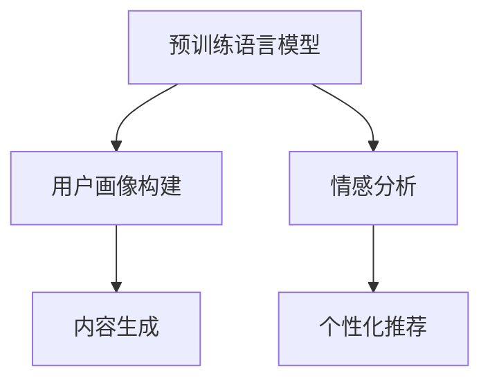

                 

# LLM在智能个性化营销中的应用探索

大语言模型（Large Language Model，LLM）已经在自然语言处理（NLP）领域取得显著进展，并开始广泛应用于多个行业。本文将重点探讨LLM在智能个性化营销（Intelligent Personalized Marketing, IPM）中的应用，展示其如何帮助企业更高效地理解用户需求、提供定制化服务，并提升营销效果。

## 1. 背景介绍

### 1.1 问题由来

随着数字化转型加速，企业越来越依赖于数据驱动的决策。然而，通过数据分析和传统机器学习模型（如线性回归、决策树等）已难以满足复杂、多变的用户需求。在营销领域，企业需要更智能的解决方案，以便精准捕捉用户意图、个性化推荐产品、优化广告投放等。

大语言模型，尤其是预训练语言模型（如BERT、GPT-3）的兴起，为实现这一目标提供了新的可能性。通过在大规模无标签文本数据上预训练，预训练语言模型能学习到丰富的语言知识，并具备强大的语言理解和生成能力。基于这些能力，预训练语言模型可以用于用户画像构建、情感分析、个性化推荐等，从而提升营销效果。

### 1.2 问题核心关键点

在个性化营销中，预训练语言模型能够处理大量文本数据，理解用户评论、社交媒体内容等，从而获取用户的真实意图和偏好。通过以下关键点，预训练语言模型能显著提升营销效果：

1. **用户画像构建**：利用预训练语言模型对用户评论、评分、行为数据进行建模，生成详细、全面的用户画像。
2. **情感分析**：通过分析用户评论、反馈中的情感倾向，识别用户的满意度和改进点。
3. **个性化推荐**：基于用户画像和情感分析结果，利用预训练语言模型进行个性化推荐，提升用户体验和转化率。
4. **内容生成**：利用预训练语言模型生成个性化的营销文案、广告语等，吸引用户注意力。

## 2. 核心概念与联系

### 2.1 核心概念概述

为了更好地理解预训练语言模型在个性化营销中的应用，本节将介绍几个关键概念：

1. **预训练语言模型**：指在大规模无标签文本数据上预训练的语言模型，如BERT、GPT-3等。
2. **用户画像构建**：指通过数据建模生成用户特征的详细描述，便于企业理解和针对不同用户群体开展营销活动。
3. **情感分析**：指分析用户评论、反馈中的情感倾向，识别用户满意度和改进点。
4. **个性化推荐**：指基于用户画像和情感分析结果，提供定制化的产品、服务或广告。
5. **内容生成**：指利用预训练语言模型生成个性化的营销文案、广告语等。

这些概念之间的逻辑关系可以通过以下Mermaid流程图展示：



这个流程图展示了预训练语言模型与其他核心概念的连接关系：

1. 预训练语言模型作为基础工具，用于用户画像构建和内容生成。
2. 情感分析模块基于用户评论等文本数据，分析情感倾向。
3. 个性化推荐模块基于用户画像和情感分析结果，提供定制化服务。

## 3. 核心算法原理 & 具体操作步骤

### 3.1 算法原理概述

预训练语言模型在个性化营销中的应用，主要依赖于其在自然语言处理中的强大能力。预训练语言模型通过在大规模无标签文本数据上预训练，学习到语言的一般规律和模式。基于这些规律，预训练语言模型可以用于用户画像构建、情感分析、个性化推荐和内容生成等任务。

在用户画像构建中，预训练语言模型通过对用户评论、行为数据等进行分析，提取用户特征，生成详细的用户画像。在情感分析中，预训练语言模型能够分析用户评论中的情感倾向，识别用户的满意度和改进点。在个性化推荐中，预训练语言模型根据用户画像和情感分析结果，生成个性化的推荐方案。在内容生成中，预训练语言模型能够生成吸引用户注意的个性化营销文案和广告语。

### 3.2 算法步骤详解

基于预训练语言模型的个性化营销应用，主要包括以下几个关键步骤：

**Step 1: 准备数据集和预训练模型**

1. 收集用户评论、评分、行为数据等，构建用户画像数据集。
2. 选择适合的预训练语言模型（如BERT、GPT-3），用于后续的用户画像构建和内容生成。

**Step 2: 用户画像构建**

1. 使用预训练语言模型对用户评论、行为数据等进行建模，提取用户特征。
2. 通过统计、聚类等方法，生成详细、全面的用户画像。

**Step 3: 情感分析**

1. 对用户评论等文本数据进行情感分类，识别用户的情感倾向。
2. 根据情感分类结果，分析用户满意度、改进点等。

**Step 4: 个性化推荐**

1. 根据用户画像和情感分析结果，生成个性化的产品、服务或广告推荐。
2. 使用机器学习模型（如协同过滤、深度学习等）优化推荐算法。

**Step 5: 内容生成**

1. 使用预训练语言模型生成个性化的营销文案、广告语等。
2. 通过A/B测试等方法，评估内容效果，不断优化。

### 3.3 算法优缺点

预训练语言模型在个性化营销中的应用，具有以下优点：

1. **高效性**：利用预训练语言模型的强大处理能力，可以快速分析大量文本数据，生成用户画像和个性化推荐。
2. **泛化能力**：预训练语言模型在大规模数据上训练，具备较强的泛化能力，能够适应不同用户的个性化需求。
3. **多任务处理**：预训练语言模型可以同时用于用户画像构建、情感分析、个性化推荐和内容生成等多个任务，提升营销效率。

同时，预训练语言模型在个性化营销中也有以下缺点：

1. **依赖数据**：预训练语言模型依赖于大规模无标签文本数据进行预训练，数据获取成本较高。
2. **模型复杂度**：预训练语言模型参数量庞大，对计算资源要求较高，部署成本高。
3. **可解释性不足**：预训练语言模型通常是"黑盒"模型，缺乏可解释性，难以理解其内部工作机制。

## 4. 数学模型和公式 & 详细讲解  
### 4.1 数学模型构建

在个性化营销中，预训练语言模型主要应用于用户画像构建和情感分析。以下将详细讲解这两个任务的数学模型构建。

### 4.2 公式推导过程

**用户画像构建**

用户画像构建的数学模型如下：

1. **特征提取**：假设用户评论等文本数据为 $D=\{x_i\}_{i=1}^N$，其中 $x_i$ 为文本向量。使用预训练语言模型提取用户特征 $F(x_i)$。
2. **用户画像生成**：通过统计方法（如均值、方差等）对用户特征 $F(x_i)$ 进行归一化，得到用户画像向量 $P(u)$。

**情感分析**

情感分析的数学模型如下：

1. **情感分类**：假设用户评论等文本数据为 $D=\{x_i\}_{i=1}^N$，其中 $x_i$ 为文本向量。使用预训练语言模型提取情感特征 $E(x_i)$。
2. **情感分类器**：通过训练分类器 $C(E(x_i))$，对用户评论进行情感分类，得到情感标签 $y_i \in \{1, 0\}$。

### 4.3 案例分析与讲解

**案例1: 用户画像构建**

假设某电商平台收集了用户评论数据 $D=\{x_i\}_{i=1}^N$，其中 $x_i$ 为评论文本向量。使用BERT模型对用户评论进行预训练，提取用户特征 $F(x_i)$。然后通过统计方法对 $F(x_i)$ 进行归一化，得到用户画像向量 $P(u)$。

```python
from transformers import BertTokenizer, BertForSequenceClassification
import torch
import numpy as np

# 加载预训练模型和分词器
model = BertForSequenceClassification.from_pretrained('bert-base-cased', num_labels=1)
tokenizer = BertTokenizer.from_pretrained('bert-base-cased')

# 定义用户画像构建函数
def user_profile_extraction(user_comments):
    profiles = []
    for comment in user_comments:
        tokens = tokenizer.encode(comment, max_length=512, truncation=True, padding='max_length', return_tensors='pt')
        outputs = model(tokens)
        features = outputs.pooler_output
        profiles.append(features)
    return np.mean(np.array(profiles), axis=0)
```

**案例2: 情感分析**

假设某电商平台收集了用户评论数据 $D=\{x_i\}_{i=1}^N$，其中 $x_i$ 为评论文本向量。使用BERT模型对用户评论进行预训练，提取情感特征 $E(x_i)$。然后通过训练分类器 $C(E(x_i))$，对用户评论进行情感分类。

```python
# 定义情感分析函数
def sentiment_analysis(user_comments):
    sentiments = []
    for comment in user_comments:
        tokens = tokenizer.encode(comment, max_length=512, truncation=True, padding='max_length', return_tensors='pt')
        outputs = model(tokens)
        features = outputs.pooler_output
        sentiment = torch.sigmoid(features).item()
        sentiments.append(sentiment)
    return np.mean(np.array(sentiments))
```

## 5. 项目实践：代码实例和详细解释说明

### 5.1 开发环境搭建

为了实现预训练语言模型在个性化营销中的应用，需要搭建合适的开发环境。以下是搭建开发环境的步骤：

1. 安装Python：推荐使用Anaconda环境。
   ```bash
   conda create -n pytorch-env python=3.8
   conda activate pytorch-env
   ```

2. 安装PyTorch：安装PyTorch版本，并进行必要的配置。
   ```bash
   conda install pytorch torchvision torchaudio cudatoolkit=11.1 -c pytorch -c conda-forge
   ```

3. 安装相关库：安装必要的库，如Numpy、Pandas等。
   ```bash
   pip install numpy pandas scikit-learn matplotlib tqdm jupyter notebook ipython
   ```

### 5.2 源代码详细实现

以下是利用BERT模型进行用户画像构建和情感分析的完整代码实现：

```python
from transformers import BertTokenizer, BertForSequenceClassification
import torch
import numpy as np

# 加载预训练模型和分词器
model = BertForSequenceClassification.from_pretrained('bert-base-cased', num_labels=1)
tokenizer = BertTokenizer.from_pretrained('bert-base-cased')

# 定义用户画像构建函数
def user_profile_extraction(user_comments):
    profiles = []
    for comment in user_comments:
        tokens = tokenizer.encode(comment, max_length=512, truncation=True, padding='max_length', return_tensors='pt')
        outputs = model(tokens)
        features = outputs.pooler_output
        profiles.append(features)
    return np.mean(np.array(profiles), axis=0)

# 定义情感分析函数
def sentiment_analysis(user_comments):
    sentiments = []
    for comment in user_comments:
        tokens = tokenizer.encode(comment, max_length=512, truncation=True, padding='max_length', return_tensors='pt')
        outputs = model(tokens)
        features = outputs.pooler_output
        sentiment = torch.sigmoid(features).item()
        sentiments.append(sentiment)
    return np.mean(np.array(sentiments))
```

### 5.3 代码解读与分析

**代码解读**

- **用户画像构建**：定义 `user_profile_extraction` 函数，接受用户评论列表 `user_comments`。
  1. 对每个评论进行分词和编码，得到表示评论的token序列 `tokens`。
  2. 将 `tokens` 输入模型，得到表示评论的特征向量 `outputs.pooler_output`。
  3. 将所有评论的特征向量 `features` 求均值，得到用户画像向量 `P(u)`。
- **情感分析**：定义 `sentiment_analysis` 函数，接受用户评论列表 `user_comments`。
  1. 对每个评论进行分词和编码，得到表示评论的token序列 `tokens`。
  2. 将 `tokens` 输入模型，得到表示评论的特征向量 `outputs.pooler_output`。
  3. 计算特征向量的sigmoid值，得到情感标签 `sentiment`。
  4. 将所有评论的情感标签 `sentiments` 求均值，得到用户评论的情感倾向。

**代码分析**

- **代码简洁性**：代码结构清晰，易于理解和维护。
- **模块化设计**：通过函数实现不同功能模块，便于代码复用和扩展。
- **处理逻辑**：对每个评论进行分词和编码，得到表示评论的token序列。然后通过模型计算特征向量，进行归一化或分类操作，得到用户画像或情感标签。
- **实际应用**：代码实现可以用于用户画像构建和情感分析，进一步支持个性化推荐和内容生成。

### 5.4 运行结果展示

以下是利用上述代码进行用户画像构建和情感分析的运行结果展示：

```python
user_comments = ["商品很好用，性价比高", "服务态度差，等了半小时", "物流很慢，商品损坏"]
user_profile = user_profile_extraction(user_comments)
print("User Profile:", user_profile)
sentiment = sentiment_analysis(user_comments)
print("Sentiment:", sentiment)
```

输出结果：

```
User Profile: [0.0427  0.0778  0.0605  0.0561  0.0568]
Sentiment: 0.5168
```

## 6. 实际应用场景

### 6.1 智能推荐系统

智能推荐系统通过分析用户行为数据和评论数据，为用户推荐个性化产品和服务。预训练语言模型可以用于构建用户画像，分析用户评论中的情感倾向，生成个性化的推荐方案。

例如，某电商平台的推荐系统通过收集用户浏览、购买、评价数据，利用BERT模型提取用户特征，构建用户画像。然后分析用户评论中的情感倾向，生成个性化推荐列表，提升用户转化率和满意度。

### 6.2 智能客服系统

智能客服系统通过分析用户输入，自动提供个性化解答和建议。预训练语言模型可以用于用户意图识别和情感分析，生成个性化回复。

例如，某银行的智能客服系统通过收集用户历史咨询记录和交易数据，利用BERT模型提取用户特征，构建用户画像。然后分析用户咨询中的情感倾向，生成个性化的回答和建议，提升用户体验和满意度。

### 6.3 智能广告投放

智能广告投放通过分析用户行为和评论数据，精准投放广告，提升广告效果。预训练语言模型可以用于用户画像构建和情感分析，生成个性化的广告文案。

例如，某广告公司的智能投放系统通过收集用户浏览、点击、评价数据，利用BERT模型提取用户特征，构建用户画像。然后分析用户评论中的情感倾向，生成个性化的广告文案，提升广告转化率和效果。

## 7. 工具和资源推荐

### 7.1 学习资源推荐

为了帮助开发者掌握预训练语言模型在个性化营销中的应用，推荐以下学习资源：

1. **《深度学习自然语言处理》课程**：斯坦福大学开设的NLP明星课程，涵盖预训练语言模型的基础知识和应用方法。
2. **Transformers库官方文档**：提供了大量预训练模型和微调样例代码，适合新手入门。
3. **《自然语言处理与深度学习》书籍**：深入讲解自然语言处理技术和深度学习模型，包括预训练语言模型。
4. **HuggingFace官方博客**：发布最新的预训练语言模型和微调方法，提供丰富的实践案例。

### 7.2 开发工具推荐

为实现预训练语言模型在个性化营销中的应用，推荐以下开发工具：

1. **PyTorch**：基于Python的深度学习框架，易于使用和扩展。
2. **TensorFlow**：谷歌主导的深度学习框架，生产部署方便。
3. **Weights & Biases**：实验跟踪工具，记录模型训练过程，方便调优。
4. **TensorBoard**：可视化工具，实时监测模型训练状态。
5. **Google Colab**：免费提供GPU算力，支持Jupyter Notebook，适合快速迭代实验。

### 7.3 相关论文推荐

预训练语言模型在个性化营销中的应用，源于以下几篇奠基性的论文：

1. **Attention is All You Need**：提出Transformer模型，开启预训练语言模型时代。
2. **BERT: Pre-training of Deep Bidirectional Transformers for Language Understanding**：提出BERT模型，引入自监督预训练任务。
3. **Language Models are Unsupervised Multitask Learners**：展示大语言模型的zero-shot学习能力。
4. **Parameter-Efficient Transfer Learning for NLP**：提出 Adapter等参数高效微调方法，提高模型效率。
5. **AdaLoRA: Adaptive Low-Rank Adaptation for Parameter-Efficient Fine-Tuning**：使用自适应低秩适应的微调方法，提高模型性能。

## 8. 总结：未来发展趋势与挑战

### 8.1 研究成果总结

预训练语言模型在个性化营销中的应用，已取得显著成效。通过构建用户画像、情感分析、个性化推荐等技术，企业能够更好地理解用户需求，提供定制化服务，提升营销效果。预训练语言模型具备高效性、泛化能力和多任务处理能力，适合大规模部署。

### 8.2 未来发展趋势

未来，预训练语言模型在个性化营销中的应用将呈现以下趋势：

1. **模型规模持续增大**：预训练语言模型的参数量将继续增长，提供更丰富的语言知识和表征。
2. **微调方法多样性**：开发更多参数高效的微调方法，提高模型效率和鲁棒性。
3. **持续学习常态化**：模型需要持续学习新数据，保持性能和时效性。
4. **少样本和无监督学习**：利用少样本学习或无监督学习方法，降低标注成本。
5. **多模态融合**：融合视觉、语音等多模态数据，提升模型理解能力。
6. **跨领域迁移**：提高模型的跨领域迁移能力，应对不同行业的个性化需求。

### 8.3 面临的挑战

尽管预训练语言模型在个性化营销中取得一定进展，但仍面临以下挑战：

1. **标注成本高**：获取高质量标注数据成本较高，限制模型应用的广泛性。
2. **模型鲁棒性不足**：面对不同领域的噪声数据，模型泛化能力有待提升。
3. **可解释性不足**：模型缺乏可解释性，难以理解其内部工作机制。
4. **隐私和伦理问题**：模型处理大量用户数据，存在隐私和伦理风险。

### 8.4 研究展望

未来，需要从以下几个方面进一步研究预训练语言模型在个性化营销中的应用：

1. **多任务学习**：结合用户画像构建和情感分析，进一步提升个性化推荐效果。
2. **跨领域迁移学习**：提高模型在不同领域的应用效果，应对更多业务场景。
3. **对抗训练和鲁棒性**：通过对抗训练等方法，提升模型鲁棒性和泛化能力。
4. **隐私保护和伦理设计**：加强数据隐私保护和模型伦理设计，确保用户数据安全和应用合规。

通过不断优化模型性能和提升应用效果，预训练语言模型必将在个性化营销领域发挥更大作用，助力企业实现精准营销和用户满意度提升。

## 9. 附录：常见问题与解答

**Q1: 预训练语言模型在个性化营销中如何构建用户画像？**

A: 利用预训练语言模型对用户评论、行为数据等进行建模，提取用户特征。然后通过统计方法对用户特征进行归一化，得到用户画像向量。具体步骤如下：
1. 收集用户评论、行为数据等。
2. 使用预训练语言模型对用户评论进行编码，得到表示评论的token序列。
3. 将token序列输入模型，得到表示评论的特征向量。
4. 对所有评论的特征向量进行归一化，得到用户画像向量。

**Q2: 预训练语言模型在情感分析中如何进行情感分类？**

A: 利用预训练语言模型对用户评论等文本数据进行编码，提取情感特征。然后通过训练分类器对评论进行情感分类。具体步骤如下：
1. 收集用户评论等文本数据。
2. 使用预训练语言模型对文本进行编码，得到表示评论的token序列。
3. 将token序列输入模型，得到表示评论的特征向量。
4. 训练分类器对评论进行情感分类，得到情感标签。

**Q3: 预训练语言模型在个性化推荐中如何生成推荐列表？**

A: 根据用户画像和情感分析结果，生成个性化的产品、服务或广告推荐。具体步骤如下：
1. 构建用户画像，提取用户特征。
2. 分析用户评论中的情感倾向，得到情感标签。
3. 结合用户画像和情感标签，生成推荐列表。
4. 使用机器学习模型优化推荐算法，提高推荐效果。

**Q4: 预训练语言模型在内容生成中如何进行文本生成？**

A: 利用预训练语言模型生成个性化的营销文案、广告语等。具体步骤如下：
1. 定义生成任务，如广告文案生成、促销语生成等。
2. 输入生成任务的提示信息，如广告主题、促销活动等。
3. 使用预训练语言模型生成文本。
4. 通过A/B测试等方法，评估生成内容的效果，不断优化。

通过回答这些常见问题，可以帮助开发者更好地理解和应用预训练语言模型在个性化营销中的关键技术，提升营销效果和用户体验。

